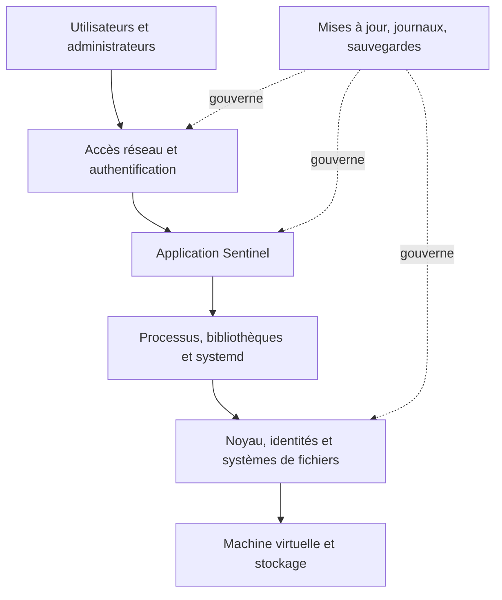
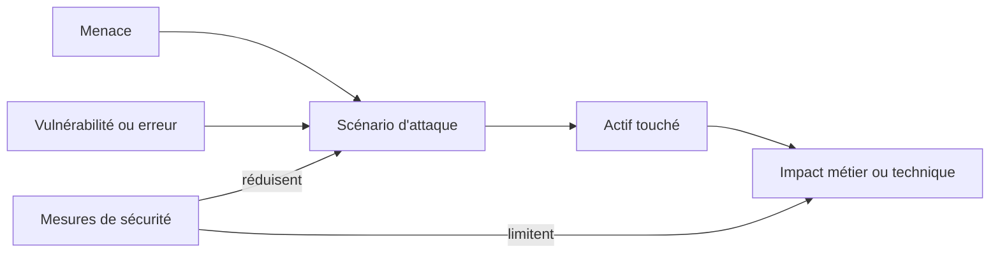
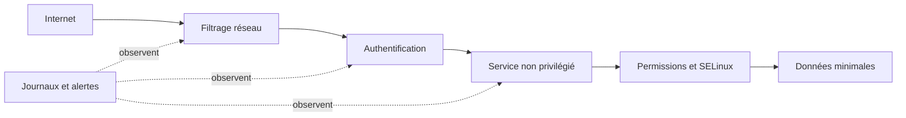

# Chapitre 1.1 — Pourquoi sécuriser un socle Linux ?

> **Campagne 1 — Installation et fondations**

> *« Une application ne peut pas être durablement plus sûre que le système qui l'exécute. »*

## Vous êtes ici

```text
PARTIE I — Construire un socle sécurisé

Campagne 1

► 1.1 Pourquoi sécuriser un socle Linux ?
  1.2 Installer AlmaLinux minimal
  1.3 Comprendre les composants du système
  1.4 Établir la baseline du serveur
  1.5 Mettre à jour et gérer les dépôts
  1.6 Organiser les systèmes de fichiers
  1.7 Comprendre identités et permissions
  1.8 Administrer avec sudo
  1.9 Mission : mettre le serveur en sécurité
  1.10 Créer le laboratoire Sentinel
```

## Objectifs pédagogiques

À l'issue de ce chapitre, vous serez capable de :

- expliquer pourquoi la sécurité d'une application commence au niveau du système ;
- relier confidentialité, intégrité, disponibilité et traçabilité à des situations concrètes ;
- identifier une surface d'attaque et proposer une première réduction ;
- raisonner en couches de défense sans confondre complexité et sécurité ;
- formuler des exigences de socle pour le futur service Sentinel.

## Pourquoi ce chapitre existe

Installer Linux ne produit pas automatiquement un serveur sûr. Une installation crée des comptes, des services, des paquets, des interfaces réseau et des règles de confiance. Chaque choix ouvre des possibilités utiles, mais aussi des chemins d'abus.

Sentinel sera progressivement empaqueté, exposé sur le réseau, géré par systemd et relié à d'autres composants. Si son hôte est mal maintenu, surchargé de logiciels ou administré sans trace, les protections applicatives ne suffiront pas. Ce chapitre pose donc le modèle qui guidera toutes les décisions suivantes.

## Le socle : une frontière de confiance

Le **socle Linux** regroupe le matériel ou la machine virtuelle, le noyau, le système de fichiers, les paquets de base, les identités, les services d'administration et leurs configurations. Il fournit à l'application ses ressources et impose une partie de ses règles.



Une faiblesse basse dans cette pile peut affecter toutes les couches supérieures. Un compte administrateur compromis modifie le service ; une bibliothèque vulnérable affecte l'application ; un disque saturé peut arrêter les journaux puis le service. Sécuriser le socle consiste à rendre ces scénarios moins probables, moins étendus et plus visibles.

## Les propriétés à protéger

Le triptyque classique **confidentialité, intégrité, disponibilité** fournit trois questions simples.

| Propriété | Question | Exemple Sentinel |
| --- | --- | --- |
| confidentialité | qui peut lire l'information ? | la clé privée TLS n'est lisible que par le service autorisé |
| intégrité | qui peut modifier l'information ? | la configuration ne peut pas être remplacée par un utilisateur ordinaire |
| disponibilité | le service reste-t-il utilisable ? | une limite de ressources empêche un processus de saturer l'hôte |

Deux propriétés complètent ce modèle. L'**authenticité** permet de vérifier l'identité d'un utilisateur, d'un serveur ou d'un paquet. La **traçabilité** relie une action à une date, une identité et un résultat. Sans elles, on peut parfois constater un changement sans savoir s'il était autorisé ni qui l'a provoqué.

La **non-répudiation** cherche à rendre difficile la contestation ultérieure d'une action. Une signature numérique peut y contribuer en reliant un artefact à une clé, mais elle ne suffit pas seule : il faut aussi maîtriser l'attribution et la protection de la clé, l'horodatage et la conservation des preuves. De même, un journal local apporte de la traçabilité sans garantir automatiquement la non-répudiation si un administrateur peut le modifier. Cette nuance deviendra importante lorsque les paquets Sentinel seront signés et que les journaux seront centralisés.

Ces objectifs peuvent entrer en tension. Une journalisation détaillée améliore l'enquête mais peut exposer des données ; un contrôle très strict peut empêcher une opération de maintenance urgente. L'ingénieur ne cherche pas un maximum abstrait : il choisit des garanties adaptées au risque, puis documente les compromis.

## Menace, vulnérabilité et risque

Une **menace** est un événement ou un acteur susceptible de causer un dommage. Une **vulnérabilité** est une faiblesse exploitable. Le **risque** combine la vraisemblance d'un scénario et son impact. Cette distinction évite de traiter toutes les alertes comme équivalentes.



Exemple : un service d'administration écoute sur toutes les interfaces, accepte un mot de passe faible et n'est pas journalisé. La menace peut être un attaquant distant ; les faiblesses sont l'exposition, l'authentification insuffisante et l'absence de détection ; l'impact maximal est la prise de contrôle du serveur. Fermer le flux inutile, renforcer l'authentification et conserver des traces agissent sur des étapes différentes.

## Comprendre la surface d'attaque

La **surface d'attaque** regroupe les points par lesquels un système reçoit des données, des commandes ou de la confiance : ports réseau, comptes, API, paquets, tâches planifiées, supports amovibles, interfaces d'administration et dépendances de la chaîne de livraison.

Un composant non utilisé n'est pas neutre. Il doit être mis à jour, configuré, surveillé et compris. L'installation minimale applique donc une règle économique autant que sécuritaire : ne conserver que ce qui possède un besoin explicite.

Réduire la surface ne signifie pas supprimer aveuglément. Un serveur sans synchronisation de l'heure rend ses journaux difficiles à corréler ; retirer un outil de diagnostic indispensable peut allonger une panne. La bonne question est : **quel besoin justifie ce composant, qui le maintient et comment prouve-t-on qu'il reste maîtrisé ?**

## Construire une défense en profondeur

Aucune mesure n'est parfaite. La **défense en profondeur** combine des contrôles indépendants afin qu'un premier échec ne produise pas immédiatement l'impact maximal.



Les couches ont des fonctions différentes :

- **prévenir** : réduire les services, appliquer le moindre privilège, vérifier les signatures ;
- **contenir** : isoler l'identité du service, limiter les permissions et les ressources ;
- **détecter** : journaliser les connexions, les élévations et les échecs ;
- **récupérer** : sauvegarder, reconstruire et disposer d'une procédure de retour arrière.

Ajouter plusieurs outils qui dépendent tous du même compte `root` ne crée pas forcément plusieurs couches. L'indépendance compte davantage que le nombre de produits.

## Trois principes directeurs

### Moindre privilège

Une personne ou un processus reçoit seulement les droits nécessaires, pendant la durée nécessaire. Sentinel n'aura pas besoin d'une session `root` permanente ; son opérateur utilisera une élévation contrôlée pour les tâches d'administration.

### Sécurisation par défaut

Après une installation ou un redémarrage, l'état attendu doit être l'état sûr : service non exposé tant que le réseau n'est pas configuré, contrôle de signature actif, SELinux enforcing, permissions restrictives. Une protection qui dépend d'une action manuelle oubliable est fragile.

### Reproductibilité

Une machine que l'on sait reconstruire est plus facile à corriger et à auditer qu'une machine unique modifiée à la main. Dans cette campagne, la baseline et la documentation prépareront l'automatisation future sans la devancer.

### Décider avec des preuves proportionnées

Un principe devient utile lorsqu'il produit une décision observable. « Appliquer le moindre privilège » peut se traduire par un compte de service distinct, puis se vérifier avec `ps`, `id` et les propriétaires des fichiers. « Réduire la surface » se traduit par une liste de services autorisés, puis se vérifie avec `systemctl` et `ss`. La preuve doit correspondre à la propriété annoncée : un fichier de configuration correctement écrit ne prouve pas que le service l'a chargé.

Une décision de sécurité courte peut suivre ce format :

| Champ | Exemple initial |
| --- | --- |
| actif | configuration Sentinel |
| scénario | modification par un compte non autorisé |
| exigence | seuls les administrateurs la modifient ; le service la lit |
| contrôle | propriétaire `root`, groupe et mode adaptés, SELinux plus tard |
| preuve | `stat`, test sous l'identité du service, journal de changement |
| récupération | restaurer la version validée et redémarrer après contrôle |

Cette discipline évite deux excès : empiler des protections sans besoin ou déclarer un objectif sans moyen de le tester. Elle crée aussi une mémoire de conception. Lorsqu'une campagne ajoutera SELinux, TLS ou un conteneur, l'équipe pourra expliquer quelle hypothèse supplémentaire est couverte au lieu de présenter la technologie comme une fin.

Le niveau de preuve reste proportionné au risque. Un laboratoire peut accepter une vérification manuelle relue ; une production critique exigera automatisation, séparation des rôles, conservation distante et tests de récupération. Le modèle reste le même, mais la force du contrôle et de la preuve augmente.

## Penser comme défenseur et comme attaquant

Le défenseur part des actifs et des usages légitimes : quelles données, quels flux, quelles identités, quelle durée d'indisponibilité acceptable ? Il transforme les réponses en règles vérifiables.

L'attaquant cherche plutôt les hypothèses implicites : un service oublié, un compte partagé, une permission trop large, un paquet téléchargé hors dépôt, un secret présent dans l'historique du shell. Examiner les deux points de vue évite une sécurité limitée à une checklist.

Pour Sentinel, un scénario initial peut être formulé ainsi : « un défaut de l'API permet l'exécution de code avec l'identité du service ». Les contrôles attendus deviennent concrets : compte dédié, fichiers système non modifiables, secrets séparés, flux sortants limités, journaux exploitables et reconstruction possible.

## TP 1 — Cartographier une surface d'attaque

Prenez une machine Linux de laboratoire et constituez un inventaire sans la modifier :

```bash
hostnamectl
ip -brief address
ss -lntup
systemctl --type=service --state=running
getent passwd
sudo dnf repolist
```

Pour chaque service en écoute, notez le port, l'interface, le processus, l'identité d'exécution et le besoin supposé. Classez ensuite chaque élément : **nécessaire**, **à confirmer** ou **inutile**. Une écoute sur `127.0.0.1` n'a pas la même exposition qu'une écoute sur toutes les interfaces, mais elle reste un point de confiance local.

Résultat attendu : une carte courte et factuelle, pas encore une liste de commandes de durcissement.

## TP 2 — Écrire un scénario de risque

Choisissez un élément « à confirmer » et rédigez une fiche contenant :

1. l'actif à protéger ;
2. l'acteur ou l'événement redouté ;
3. la condition d'entrée ;
4. la faiblesse exploitée ;
5. l'impact sur confidentialité, intégrité, disponibilité ou traçabilité ;
6. une mesure préventive, une mesure de confinement et une mesure de détection ;
7. la preuve attendue pour chacune.

Évitez « sécuriser le serveur » comme mesure : ce n'est ni une action précise ni un résultat testable.

## Mission d'ingénieur — Définir le socle de confiance de Sentinel

Votre équipe prépare un premier serveur Sentinel. Produisez une note d'architecture d'une page qui comporte :

- les actifs essentiels : code, configuration, identité du service, secrets, journaux et disponibilité ;
- trois scénarios de risque réalistes ;
- les frontières de confiance entre administrateur, système, service et client réseau ;
- cinq principes de construction du socle ;
- pour chaque principe, une preuve qui pourra être collectée dans les chapitres suivants.

La note doit différencier les décisions immédiates des mesures futures. Par exemple, « SELinux reste enforcing » est une décision de socle ; l'écriture d'une politique dédiée appartient à une campagne ultérieure.

## Impact sur Sentinel

Sentinel devient le fil rouge qui rend les décisions mesurables. Son socle devra être minimal, maintenu, administré par élévation temporaire, organisé selon les conventions Linux et observable. Le service disposera plus tard de sa propre identité, de permissions limitées et de protections complémentaires.

Le but n'est pas de déclarer Sentinel « sécurisé », mais de conserver une chaîne d'arguments et de preuves depuis l'installation jusqu'à l'exploitation.

## Synthèse

- Le socle Linux impose une partie des règles de sécurité de toutes les applications hébergées.
- Confidentialité, intégrité, disponibilité, authenticité et traçabilité rendent les objectifs discutables et testables.
- La non-répudiation exige plus qu'une trace : attribution, protection des clés, horodatage et conservation participent à la preuve.
- Un risque relie une menace, une faiblesse, un actif et un impact.
- Réduire la surface d'attaque supprime des responsabilités sans supprimer les fonctions nécessaires.
- La défense en profondeur combine prévention, confinement, détection et récupération.
- Moindre privilège, sécurisation par défaut et reproductibilité guideront la construction de Sentinel.

## Infographie de révision

```text
ACTIFS ──► SCÉNARIOS ──► IMPACTS ──► EXIGENCES ──► PREUVES
  │            │             │              │
  │       menace +       C / I / D      prévenir
  │       faiblesse      + traces       contenir
  │                                     détecter
  └── code, configuration, secrets      récupérer

SURFACE MINIMALE + MOINDRE PRIVILÈGE + DÉFENSE EN PROFONDEUR
                          │
                          └── socle de confiance de Sentinel
```

## Pour aller plus loin

Les guides de durcissement tels que les profils CIS ou les recommandations de l'ANSSI sont des bases de comparaison, pas des commandes à appliquer sans contexte. Chaque exigence doit être reliée au risque, à la version du système et aux contraintes d'exploitation.

Chapitre suivant : transformer ces principes en décisions d'installation pour une machine AlmaLinux minimale et reconstructible.

← Début de la formation · [1.2 — Installer AlmaLinux minimal](1.2-installation-almalinux-minimal.md) →
