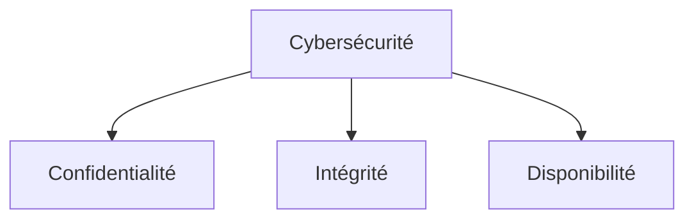
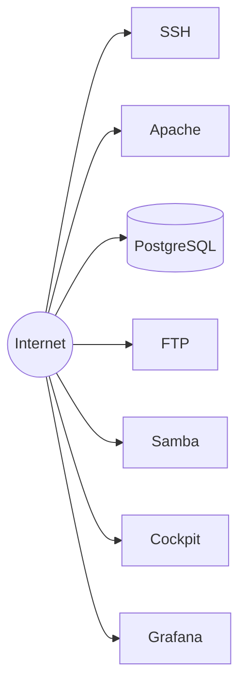
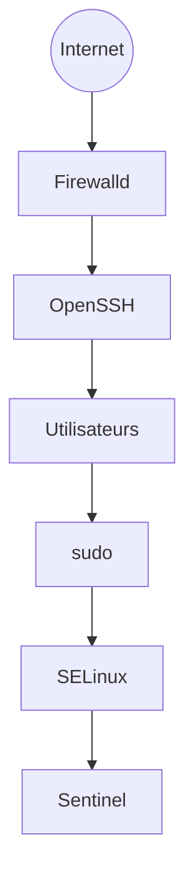
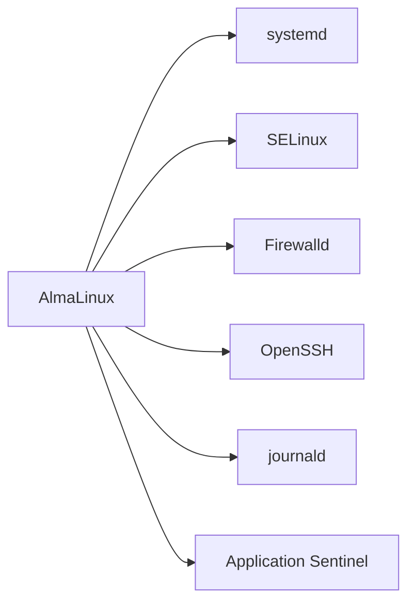
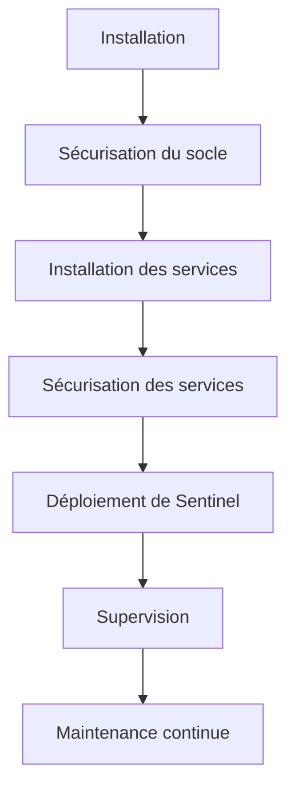
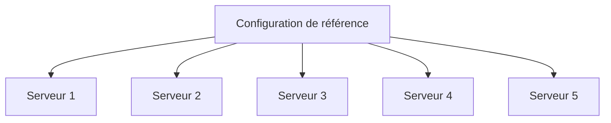
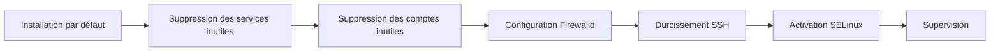
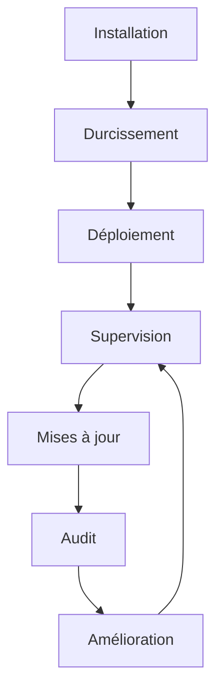
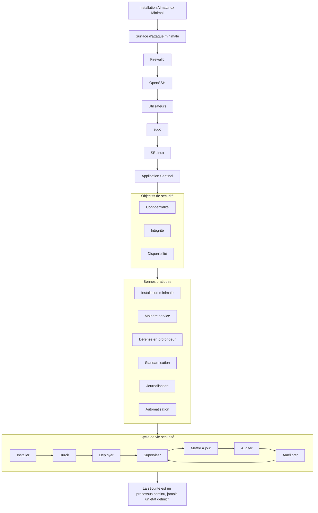

# Chapitre 1.1 — Pourquoi sécuriser un socle Linux ?

> **Campagne 1 — Installation et fondations**

> *« La sécurité n'est pas un logiciel que l'on installe à la fin d'un projet. C'est une propriété que l'on construit dès les premières minutes de vie d'un système. »*

---

## Vous êtes ici

```text
# Partie I — Construire un socle sécurisé

# Campagne 1 — Installation et fondations

    ► 1.1 Pourquoi sécuriser un socle Linux ?
      1.2 Installation d'AlmaLinux Minimal
      1.3 Comprendre les privilèges
      1.4 Le système de fichiers
      1.5 Utilisateurs et groupes
      1.6 Permissions Linux
      1.7 sudo et moindre privilège
      1.8 Première sécurisation de Sentinel
```

---

## Objectifs pédagogiques

À la fin de ce chapitre, vous serez capable de :

- comprendre pourquoi la sécurité commence dès l'installation ;
- distinguer sécurité, sûreté et disponibilité ;
- comprendre la notion de surface d'attaque ;
- identifier les différentes couches de protection d'un système Linux ;
- adopter la manière de raisonner d'un ingénieur sécurité.

---

## Pourquoi ce chapitre existe

Lorsqu'un nouvel administrateur installe un serveur Linux, son premier réflexe consiste souvent à se demander :

> « Comment installer mon application ? »

Pour un ingénieur sécurité, la question est différente.

> **« Comment empêcher que ce serveur devienne un point d'entrée pour un attaquant ? »**

Cette différence de point de vue est fondamentale.

Tout au long de cet ouvrage, vous apprendrez progressivement à ne plus regarder un serveur comme une simple machine exécutant des programmes, mais comme un **actif de sécurité** qu'il faut protéger.

Avant même de parler de pare-feu, de certificats ou de SELinux, il est donc nécessaire de comprendre pourquoi la sécurisation d'un socle Linux est devenue indispensable.

---

## Le contexte actuel

Il y a une vingtaine d'années, beaucoup de serveurs étaient installés dans des réseaux relativement isolés.

Les attaques existaient déjà, mais elles étaient souvent ciblées.

Aujourd'hui, la situation est radicalement différente.

Des robots parcourent Internet en permanence.

Ils recherchent automatiquement :

- des services vulnérables ;
- des mots de passe faibles ;
- des versions logicielles obsolètes ;
- des erreurs de configuration ;
- des interfaces d'administration exposées.

Le délai entre la mise en ligne d'un serveur et les premières tentatives de connexion se compte parfois en **minutes**.

La question n'est donc plus :

> *« Mon serveur sera-t-il attaqué ? »*

Mais plutôt :

> **« Quand sera-t-il attaqué, et comment résistera-t-il ? »**

---

## Le rôle d'un socle sécurisé

Dans ce livre, nous utiliserons très souvent l'expression :

> **socle sécurisé**

Qu'est-ce que cela signifie exactement ?

Le socle est constitué de tout ce qui existe **avant** l'installation de l'application métier.

Par exemple :

- le système d'exploitation ;
- les utilisateurs ;
- les permissions ;
- les services système ;
- la configuration réseau ;
- les mécanismes d'authentification ;
- les journaux ;
- les politiques de sécurité.

Notre application **Sentinel** viendra s'appuyer sur ce socle.

Si celui-ci est fragile,

l'application héritera automatiquement de cette fragilité.

À l'inverse,

un socle robuste augmente considérablement la résilience de toute l'infrastructure.

---

## Une analogie

Imaginez la construction d'une maison.

Vous pouvez installer :

- une porte blindée ;
- une alarme ;
- des caméras ;
- des fenêtres renforcées.

Mais si les fondations sont instables,

l'ensemble du bâtiment reste vulnérable.

Un serveur Linux fonctionne exactement de la même manière.

L'application représente la maison.

Le système d'exploitation représente les fondations.

C'est pourquoi nous allons consacrer toute cette première partie à construire un socle solide.

---

## Les trois objectifs de la cybersécurité

La sécurité informatique repose traditionnellement sur trois propriétés fondamentales.



Ces trois notions seront présentes tout au long de ce livre.

---

### La confidentialité

La confidentialité consiste à empêcher qu'une information soit consultée par une personne non autorisée.

Exemples :

- un fichier contenant des données médicales ;
- une clé privée SSH ;
- une base de données clients.

Le chiffrement,

les permissions Linux,

les certificats TLS

et les politiques d'accès participent directement à cette propriété.

---

### L'intégrité

L'intégrité garantit que les données n'ont pas été modifiées de manière non autorisée.

Un exemple simple.

Deux fichiers semblent identiques.

Pourtant,

l'un d'eux contient une ligne supplémentaire insérée par un attaquant.

Visuellement,

la différence peut être invisible.

L'intégrité permet précisément de détecter ce type d'altération.

Nous rencontrerons plus tard :

- les sommes de contrôle ;
- les signatures numériques ;
- les RPM signés ;
- les certificats.

Tous contribuent à protéger l'intégrité.

---

### La disponibilité

Un serveur parfaitement confidentiel,

mais éteint,

n'a aucune utilité.

La disponibilité consiste donc à maintenir le service accessible lorsque les utilisateurs légitimes en ont besoin.

Elle concerne notamment :

- les sauvegardes ;
- la redondance ;
- les mises à jour maîtrisées ;
- la surveillance ;
- les protections contre le déni de service.

Un bon ingénieur sécurité protège toujours simultanément ces trois propriétés.

## Au-delà du triptyque CIA

Le triptyque :

- Confidentialité ;
- Intégrité ;
- Disponibilité.

constitue la base historique de la sécurité informatique.

Cependant,

une infrastructure moderne doit répondre à d'autres exigences.

Nous allons en rencontrer plusieurs tout au long de cette formation.

---

### L'authenticité

Comment être certain que l'on communique réellement avec le bon serveur ?

Comment savoir qu'un administrateur est bien celui qu'il prétend être ?

C'est le rôle de l'authenticité.

Elle repose notamment sur :

- les certificats numériques ;
- les signatures cryptographiques ;
- les clés SSH ;
- FreeIPA.

Sans authenticité,

il devient possible d'usurper une identité.

---

### La traçabilité

Imaginons deux situations.

#### Première situation

Un administrateur modifie un fichier critique.

Personne ne sait :

- qui ;
- quand ;
- depuis quelle machine.

---

#### Deuxième situation

Toutes les opérations sont enregistrées.

Vous connaissez :

- l'utilisateur ;
- la date ;
- la commande exécutée ;
- les fichiers concernés.

La seconde situation permet :

- d'enquêter ;
- d'auditer ;
- de corriger ;
- d'apprendre des incidents.

La traçabilité deviendra un thème majeur de cet ouvrage.

---

### La non-répudiation

Cette notion est moins connue.

Elle consiste à empêcher une personne de nier une action qu'elle a réellement effectuée.

Par exemple.

Si un administrateur signe numériquement un paquet RPM,

il ne pourra plus raisonnablement prétendre qu'il n'en est pas l'auteur.

Les signatures numériques apportent cette propriété.

---

## Les attaquants ne ciblent pas Linux

Une erreur fréquente consiste à penser :

> *« Les attaquants veulent compromettre Linux. »*

En réalité,

Linux n'est qu'un moyen.

Les véritables objectifs sont généralement :

- voler des données ;
- chiffrer les fichiers (rançongiciel) ;
- utiliser le serveur comme relais d'attaque ;
- héberger des contenus malveillants ;
- rebondir vers d'autres systèmes.

Autrement dit,

le système d'exploitation est rarement la cible finale.

Il constitue une étape.

---

## La notion de surface d'attaque

L'un des concepts les plus importants en cybersécurité est celui de **surface d'attaque**.

Définition.

> **La surface d'attaque représente l'ensemble des points par lesquels un attaquant peut interagir avec un système.**

Par exemple.

Un serveur exécutant uniquement SSH présente une surface d'attaque relativement limitée.

À l'inverse,

un serveur exposant :

- SSH ;
- Apache ;
- PostgreSQL ;
- Cockpit ;
- Grafana ;
- FTP ;
- Samba.

offre beaucoup plus de possibilités à un attaquant.

Nous pouvons le représenter simplement.



Chaque nouveau service augmente potentiellement la surface d'attaque.

Cela ne signifie pas qu'il faut supprimer tous les services.

Cela signifie qu'il faut **justifier chacun d'eux**.

---

## Le principe du moindre service

Nous retrouverons ce principe tout au long de cette formation.

Il peut se résumer ainsi.

> **Un service inutile est un service qui ne devrait pas être installé.**

Prenons un exemple.

Vous développez Sentinel.

Votre serveur a uniquement besoin de :

- SSH ;
- votre API Sentinel.

Pourquoi installer :

- un serveur FTP ?
- un serveur NFS ?
- un serveur graphique ?
- un navigateur web ?

Chaque composant supplémentaire :

- augmente la consommation mémoire ;
- ajoute du code ;
- peut contenir des vulnérabilités ;
- devra être maintenu.

La sécurité commence donc souvent par la simplicité.

---

## Les couches de protection

Un serveur professionnel ne repose jamais sur une seule protection.

Il accumule plusieurs barrières successives.



Si une couche échoue,

les suivantes continuent à protéger le système.

Cette approche porte un nom.

> **La défense en profondeur**.

C'est probablement le principe le plus important de toute cette formation.

---

## Pourquoi AlmaLinux ?

Le choix de la distribution n'est pas anodin.

Nous utiliserons AlmaLinux car elle possède plusieurs qualités particulièrement intéressantes.

- stabilité sur plusieurs années ;
- compatibilité avec Red Hat Enterprise Linux ;
- documentation abondante ;
- très forte présence en entreprise ;
- excellente intégration avec SELinux, systemd, Podman, FreeIPA et Ansible.

Autrement dit,

nous travaillons sur une distribution représentative de ce que l'on rencontre dans les environnements professionnels.

Elle constitue donc un excellent support pédagogique.

---
## 💎 Le point d'expertise

### La sécurité n'est jamais absolue

L'une des premières erreurs que commettent les débutants consiste à chercher :

> **Le système parfaitement sécurisé.**

Il n'existe pas.

Pourquoi ?

Parce que la sécurité est toujours une question de :

- coût ;
- risque ;
- temps ;
- probabilité.

Prenons deux exemples.

Premier serveur.

```text
Installation par défaut

↓

Mot de passe faible

↓

Tous les services actifs
```

---

Deuxième serveur.

```text
Installation minimale

↓

Pare-feu

↓

SELinux

↓

Clés SSH

↓

Journalisation

↓

Surveillance
```

Le second serveur n'est pas invulnérable.

Mais l'effort nécessaire pour le compromettre est considérablement supérieur.

Un attaquant opportuniste choisira généralement une cible plus simple.

La sécurité consiste donc à **augmenter le coût de l'attaque**.

---

### Le meilleur logiciel de sécurité est souvent celui que l'on n'a pas installé

Cette phrase surprend souvent.

Pourtant,

elle résume parfaitement une philosophie utilisée dans les grandes entreprises.

Chaque logiciel supplémentaire apporte :

- du code ;
- des dépendances ;
- des mises à jour ;
- des vulnérabilités potentielles ;
- des erreurs de configuration.

Un composant inexistant ne pourra jamais être compromis.

Nous retrouverons constamment cette idée.

> **Le composant le plus sûr est celui qui n'existe pas.**

---

### La sécurité est une propriété du système

Beaucoup de personnes pensent :

> « Je vais installer un antivirus. »

ou

> « Je vais installer un pare-feu. »

Comme si un produit suffisait.

En réalité,

la sécurité résulte de l'ensemble du système.

Prenons Sentinel.



Si un seul de ces composants est mal configuré,

l'ensemble de la chaîne peut être fragilisé.

C'est pourquoi un ingénieur sécurité raisonne toujours de manière globale.

---

## 🧠 Comment pense un architecte ?

Lorsqu'un développeur crée une nouvelle fonctionnalité,

il se demande souvent :

> **Comment cela fonctionne ?**

Un architecte sécurité pose une autre question.

> **Quelles seraient les conséquences si cette fonctionnalité était compromise ?**

Cette manière de raisonner change complètement la conception d'un système.

Prenons un exemple.

Vous développez une API.

Le développeur pense :

```text
Recevoir une requête

↓

Traiter

↓

Répondre
```

L'architecte ajoute immédiatement :

```text
Qui appelle ?

↓

Est-il authentifié ?

↓

A-t-il le droit ?

↓

La requête est-elle valide ?

↓

Est-elle journalisée ?

↓

La réponse divulgue-t-elle trop d'informations ?
```

Le même logiciel est observé sous un angle totalement différent.

---

### Penser en scénarios

Un architecte ne protège pas contre une attaque précise.

Il imagine plusieurs scénarios.

Par exemple.

```text
Vol du portable

↓

Compromission d'un administrateur

↓

Erreur de configuration

↓

Suppression accidentelle

↓

Faille logicielle

↓

Panne matérielle
```

Chaque scénario conduit à une protection différente.

C'est cette méthode que nous appliquerons tout au long de la formation.

---

### La sécurité commence avant le premier paquet installé

Une erreur très répandue consiste à considérer que :

```text
Installation Linux

↓

Installation application

↓

Sécurité
```

La réalité est exactement inverse.



Autrement dit,

la sécurité commence avant même que Sentinel n'existe.

C'est précisément l'objectif de cette première campagne.

---

## ⚔️ Comment pense un attaquant ?

Un attaquant ne connaît généralement pas votre serveur.

Il commence donc par observer.

Ses premières questions sont très simples.

```text
Quel système ?

↓

Quels ports ?

↓

Quels services ?

↓

Quelles versions ?

↓

Quelles erreurs de configuration ?
```

Autrement dit,

avant d'attaquer,

il collecte des informations.

Cette phase s'appelle :

> **la reconnaissance** (*Reconnaissance*).

Tout au long de cette formation,

nous chercherons à limiter la quantité d'informations qu'un serveur divulgue.

---

### L'erreur humaine est souvent la première vulnérabilité

Les statistiques montrent que de nombreuses compromissions ne proviennent pas d'une faiblesse cryptographique,

mais d'une erreur de configuration.

Par exemple.

- un mot de passe trop simple ;
- une sauvegarde oubliée ;
- un service inutile installé ;
- un port laissé ouvert ;
- un utilisateur disposant de privilèges excessifs.

La bonne nouvelle est que ces erreurs sont largement évitables grâce à :

- des procédures ;
- des standards ;
- des revues de configuration ;
- de l'automatisation.

C'est exactement ce que nous construirons progressivement avec Sentinel.

---
## 🏢 En entreprise

Dans une entreprise,

la sécurisation d'un serveur ne dépend jamais uniquement de l'administrateur qui l'installe.

Elle repose sur un ensemble de règles communes.

On parle de :

- politiques de sécurité ;
- standards techniques ;
- procédures d'exploitation ;
- guides de durcissement.

L'objectif est simple.

Que tous les serveurs présentent le même niveau de sécurité.

---

### La standardisation

Imaginons une entreprise possédant :

```text
5 serveurs
```

Chaque administrateur les configure différemment.

```text
Serveur A

↓

SSH configuré
```

---

```text
Serveur B

↓

SSH + Cockpit
```

---

```text
Serveur C

↓

FTP activé
```

---

```text
Serveur D

↓

SELinux désactivé
```

---

```text
Serveur E

↓

Configuration inconnue
```

Cette situation est extrêmement difficile à maintenir.

À l'inverse,

une entreprise mature définit une configuration de référence.



Tous les serveurs deviennent prévisibles.

---

### Le principe du durcissement

Le terme anglais est :

> **Hardening**

Le durcissement consiste à supprimer progressivement tout ce qui est inutile.

Par exemple.



Le serveur devient progressivement plus résistant,

non pas parce qu'on lui ajoute des protections,

mais parce qu'on retire des possibilités d'attaque.

---

### La sécurité est un processus continu

Beaucoup imaginent le scénario suivant.

```text
Installation

↓

Sécurisation

↓

Fin
```

En réalité,

la vie d'un serveur ressemble davantage à ceci.



La sécurité ne s'arrête jamais.

Chaque mise à jour,

chaque nouveau service,

chaque évolution de l'infrastructure nécessite une réévaluation.

---

## 📚 Culture technique

### Pourquoi les guides de durcissement existent-ils ?

Les grandes organisations publient régulièrement des recommandations.

Par exemple.

- Red Hat ;
- ANSSI ;
- CIS (Center for Internet Security) ;
- NIST ;
- NSA.

Ces documents décrivent les meilleures pratiques connues à un instant donné.

Ils répondent notamment à des questions comme :

- quels services désactiver ;
- quelles permissions appliquer ;
- quels algorithmes utiliser ;
- quelles politiques de journalisation adopter.

Nous nous inspirerons régulièrement de ces bonnes pratiques tout au long de cette formation.

---

### Pourquoi une installation minimale ?

Une distribution Linux peut être installée de plusieurs façons.

Par exemple.

- installation graphique complète ;
- serveur standard ;
- poste de travail ;
- installation minimale.

Pour Sentinel,

nous choisirons systématiquement :

```text
Installation minimale
```

Pourquoi ?

Parce qu'elle contient :

- moins de logiciels ;
- moins de dépendances ;
- moins de services ;
- moins de vulnérabilités potentielles.

C'est l'application directe du principe du moindre service.

---

## ⚠️ Piège classique

### Installer "au cas où"

Un administrateur installe parfois un logiciel en se disant.

> *« Je pourrais en avoir besoin un jour. »*

Quelques mois plus tard,

ce logiciel est :

- oublié ;
- jamais utilisé ;
- jamais mis à jour.

Pourtant,

il continue à écouter sur le réseau.

Chaque composant installé doit répondre à une question simple.

> **Quel besoin métier justifie sa présence ?**

Si aucune réponse n'existe,

le composant ne devrait probablement pas être installé.

---

### Confondre sécurité et complexité

Un autre piège consiste à penser qu'une infrastructure très complexe est forcément plus sûre.

C'est souvent l'inverse.

Une infrastructure simple est généralement :

- plus facile à comprendre ;
- plus facile à auditer ;
- plus facile à maintenir ;
- moins sujette aux erreurs de configuration.

La simplicité constitue donc un véritable mécanisme de sécurité.

---

## Laboratoire AlmaLinux

### Objectif

Observer l'état d'un système immédiatement après son installation.

---

#### Étape 1 — Identifier les services

Lister les services actifs.

```bash
systemctl list-units --type=service --state=running
```

Pour chacun,

répondre aux questions suivantes.

- À quoi sert-il ?
- Est-il indispensable ?
- Écoute-t-il sur le réseau ?

---

#### Étape 2 — Identifier les ports ouverts

Afficher les sockets d'écoute.

```bash
ss -tulpn
```

Faire le lien entre :

- un processus ;
- un service systemd ;
- un port réseau.

---

#### Étape 3 — Observer les comptes système

Afficher le contenu de :

```text
/etc/passwd
```

Identifier :

- votre compte utilisateur ;
- les comptes système ;
- les comptes possédant `/sbin/nologin`.

Nous reviendrons en détail sur ces notions dans les prochains chapitres.

---

## Mission d'ingénieur

Vous rejoignez une entreprise qui vient d'acquérir cinquante nouveaux serveurs.

Votre responsable sécurité vous demande de rédiger une politique de sécurisation du socle.

Votre document devra répondre aux questions suivantes.

- Pourquoi utiliser une installation minimale ?
- Quels services doivent être présents immédiatement après l'installation ?
- Quels principes de sécurité doivent être appliqués avant tout déploiement applicatif ?
- Quels contrôles devront être réalisés avant de considérer un serveur comme prêt pour la production ?

Votre réponse devra être justifiée en utilisant les notions étudiées dans ce chapitre.

---

## Impact sur Sentinel

Ce chapitre constitue le point de départ de toute la formation.

À partir de maintenant,

chaque décision concernant Sentinel devra être évaluée selon plusieurs critères.

- Réduit-elle la surface d'attaque ?
- Respecte-t-elle le principe du moindre service ?
- Renforce-t-elle la défense en profondeur ?
- Facilite-t-elle les audits futurs ?
- Peut-elle être automatisée ?

Ces cinq questions accompagneront désormais chacune des évolutions de notre infrastructure.

---

## Synthèse

- La sécurité commence dès l'installation du système d'exploitation.
- Un socle sécurisé protège toutes les applications qui s'y exécuteront.
- La surface d'attaque doit être réduite au strict nécessaire.
- La défense en profondeur consiste à superposer plusieurs couches de protection indépendantes.
- Une installation minimale est généralement préférable à une installation riche en fonctionnalités.
- La sécurité est un processus continu et non une étape finale.
- Les erreurs de configuration représentent une source majeure de compromission.
- La simplicité est souvent l'une des meilleures protections.

---

## Infographie de révision



[1.2 — Installation d'AlmaLinux minimal](1.2-installation-almalinux-minimal.md) →
