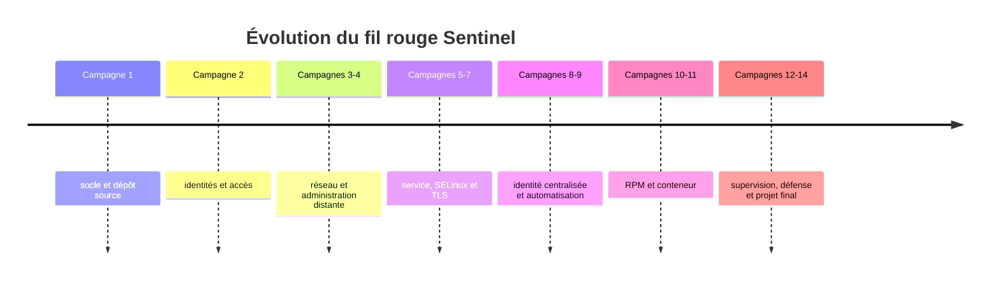
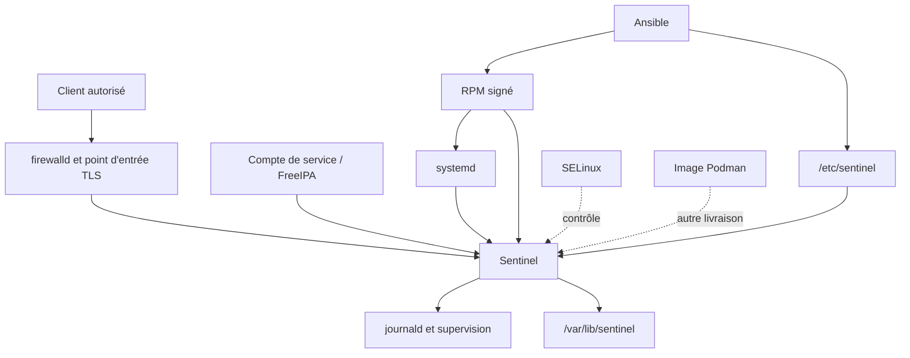
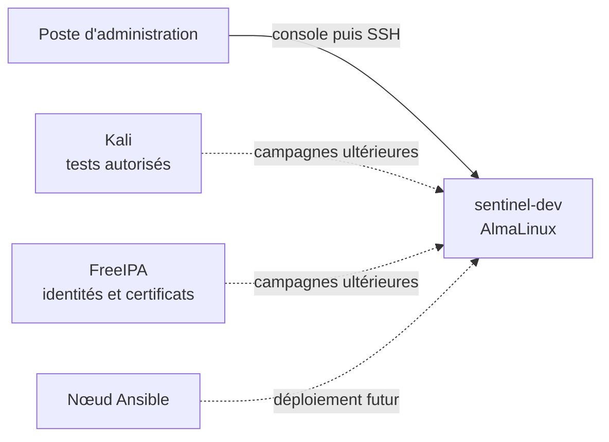
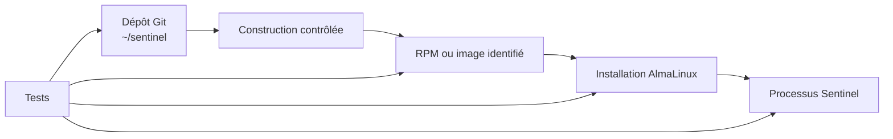
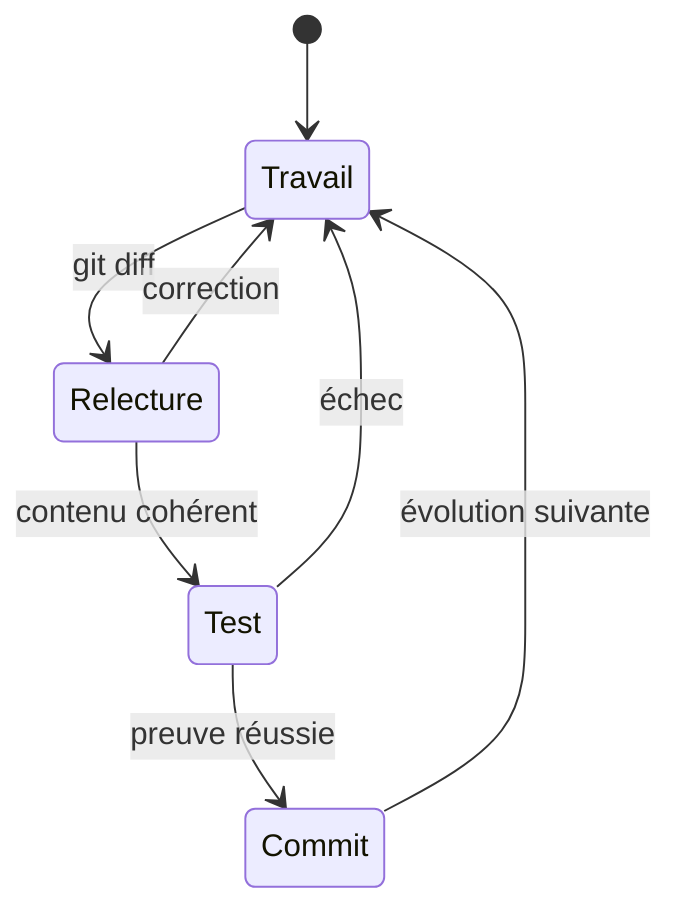
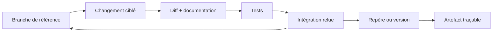
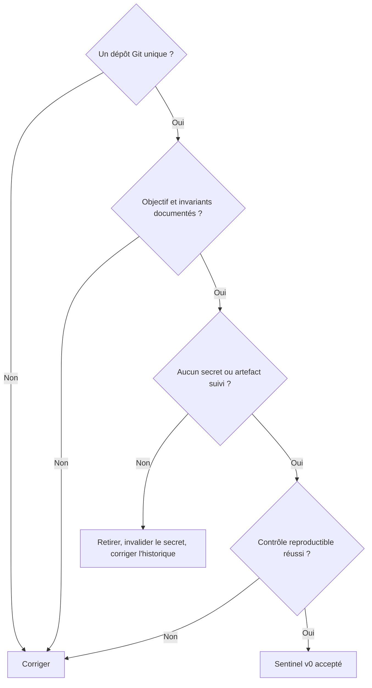

# Chapitre 1.10 — Créer le laboratoire Sentinel

> **Campagne 1 — Installation et fondations**

> *« Un laboratoire durable possède une source de vérité, des règles et une trajectoire. »*

## Vous êtes ici

```text
PARTIE I — Construire un socle sécurisé

Campagne 1

  1.1 Pourquoi sécuriser un socle Linux ? ✔
  1.2 Installer AlmaLinux minimal ✔
  1.3 Comprendre les composants du système ✔
  1.4 Établir la baseline du serveur ✔
  1.5 Mettre à jour et gérer les dépôts ✔
  1.6 Organiser les systèmes de fichiers ✔
  1.7 Comprendre identités et permissions ✔
  1.8 Administrer avec sudo ✔
  1.9 Mission : mettre le serveur en sécurité ✔
► 1.10 Créer le laboratoire Sentinel
```

## Objectifs pédagogiques

À l'issue de ce chapitre, vous serez capable de :

- expliquer le rôle de Sentinel comme fil rouge de la formation ;
- distinguer dépôt source, installation système et environnement de laboratoire ;
- initialiser un dépôt Git simple avec documentation et conventions minimales ;
- définir les invariants techniques qui relieront les campagnes ;
- produire une première version vide mais vérifiable du projet.

## Pourquoi ce chapitre existe

Les fondations du serveur sont prêtes. Il faut maintenant créer l'objet que les campagnes feront évoluer. Sans projet commun, chaque exercice produirait un exemple isolé : une unité systemd sans application, un RPM sans cycle de vie, une politique SELinux sans ressource réelle.

Sentinel est une application pédagogique de supervision légère. Elle commencera presque vide, puis gagnera une identité système, un service, une API, des journaux, TLS, un paquet RPM, une intégration centralisée, un déploiement automatisé et une forme conteneurisée. La difficulté viendra de l'intégration progressive, pas de la complexité métier du code.

## Le contrat pédagogique de Sentinel

Sentinel sert à observer comment une application devient un produit Linux exploitable.



Chaque campagne doit améliorer le même projet ou son infrastructure. Une nouvelle brique est acceptée lorsqu'elle répond à un besoin pédagogique et possède une preuve. On ne réécrit pas Sentinel à partir de zéro pour éviter une migration.

Les invariants initiaux sont :

- AlmaLinux constitue la plateforme de référence ;
- le code et la documentation vivent dans un dépôt Git unique ;
- les mécanismes natifs sont privilégiés : systemd, journald, RPM/DNF, firewalld, SELinux et les conventions du FHS ;
- le service ne dépend pas d'une exécution permanente comme `root` ;
- configuration, secrets, état et code restent séparés ;
- chaque évolution est testable et possède un retour arrière adapté ;
- aucune donnée sensible n'est enregistrée dans Git.

## Architecture cible sans tout construire maintenant



Ce diagramme décrit une direction, pas le contenu du premier commit. Implémenter maintenant TLS, une base, des plugins et un conteneur empêcherait de comprendre la raison de chaque mécanisme. La version initiale doit seulement rendre la structure et les décisions visibles.

## Les machines et leurs rôles

Le laboratoire évoluera par étapes.

| Machine | Rôle initial | Évolution |
| --- | --- | --- |
| poste de travail | lire, éditer, versionner, accéder à la console | pilotage Ansible et analyse |
| `sentinel-dev` AlmaLinux | héberger le projet puis le service | paquet, SELinux, conteneur |
| Kali | absente ou éteinte au départ | tests autorisés des surfaces exposées |
| FreeIPA | ajoutée plus tard | identités, politiques et certificats |
| nœuds supplémentaires | non nécessaires | industrialisation et supervision |



Le réseau doit rester un segment de laboratoire. Kali ne rend pas une action autorisée par sa seule présence : chaque test possède un périmètre, une cible et un objectif explicites.

## Trois espaces à séparer

Le projet traversera trois espaces qui ne doivent pas être confondus :

1. **dépôt source** : code, tests, documentation, métadonnées de construction ;
2. **artefact** : paquet RPM ou image construit à partir d'une révision ;
3. **installation** : fichiers déployés sous `/usr`, `/etc`, `/var` et `/run`.



Le dépôt de développement dans `~/sentinel` n'est pas le répertoire d'exécution du service. Plus tard, le paquet installera le code et les configurations aux emplacements définis au chapitre 1.6.

## Concevoir le dépôt initial

Une structure courte suffit :

```text
sentinel/
├── docs/
│   └── architecture.md
├── scripts/
├── sentinel/
│   └── __init__.py
├── tests/
├── .gitignore
├── LICENSE
├── README.md
└── pyproject.toml
```

Chaque entrée a un rôle :

- `sentinel/` accueillera le code Python importable ;
- `tests/` contiendra les preuves automatisées ;
- `docs/` conservera les décisions trop détaillées pour le README ;
- `scripts/` recevra seulement des opérations reproductibles et relues ;
- `pyproject.toml` décrira progressivement le projet et sa construction ;
- `.gitignore` exclura caches, environnements locaux, artefacts et secrets ;
- `README.md` orientera un nouveau contributeur.

Ne placez pas d'environnement virtuel, de mot de passe, de certificat privé, de paquet construit ou de base de données d'exécution dans le dépôt.

## Git comme source de vérité

Git conserve l'histoire des décisions, mais seulement si les commits restent compréhensibles et si les secrets n'y entrent jamais.



Un commit ne remplace pas une sauvegarde distante ni une revue. Il offre une unité de changement réversible pour le code et la documentation. Les données de Sentinel auront une autre stratégie.

### Faire évoluer le dépôt sans perdre le fil

Une évolution commence par un besoin lié à la campagne, se développe dans un changement limité, puis rejoint la branche de référence après relecture. Le nom exact des branches importe moins que la constance du processus : état de départ connu, diff relu, tests exécutés, commit explicite et possibilité de retrouver l'artefact construit.



Évitez une branche durable différente pour chaque machine : la configuration propre à l'environnement doit être paramétrée, pas cachée dans des historiques divergents. Évitez également les commits qui mélangent code, formatage massif et changement d'infrastructure ; leur relecture et leur retour arrière deviennent difficiles.

Un secret ajouté à Git doit être considéré comme exposé, même si le fichier est supprimé dans le commit suivant. La réponse consiste d'abord à invalider ou renouveler le secret, puis à nettoyer l'historique si nécessaire et à améliorer le contrôle préventif. Réécrire l'historique sans rotation laisse la valeur utilisable dans les clones, caches ou journaux.

Le dépôt peut conserver des **références** vers des secrets : nom logique, emplacement attendu, propriétaire, mode, procédure de provisionnement et de rotation. Il ne conserve pas leur valeur. Cette distinction permettra plus tard d'automatiser le déploiement sans transformer Git en coffre-fort.

Enfin, marquez les étapes réellement reproductibles. Un tag posé sur un code qui ne construit pas ou dont les dépendances sont inconnues n'est qu'une étiquette. À mesure que Sentinel mûrit, chaque repère devra relier révision source, tests, artefact, configuration compatible et procédure de déploiement.

## Documenter les décisions initiales

Le `README.md` doit répondre rapidement à :

- quel problème pédagogique Sentinel illustre-t-il ?
- quelle plateforme est supportée ?
- comment préparer l'environnement de développement ?
- comment lancer les tests lorsqu'ils existeront ?
- quels composants ne sont pas encore implémentés ?
- où se trouvent les décisions d'architecture ?
- comment signaler un secret ajouté par erreur ?

`docs/architecture.md` enregistre les invariants, les chemins cibles, les identités et la trajectoire. Distinguez une décision ferme d'une hypothèse à confirmer. Une roadmap trop détaillée devient rapidement fausse ; liez les grandes étapes aux campagnes.

## TP 1 — Initialiser le dépôt

Installez Git depuis un dépôt approuvé si nécessaire, puis configurez une identité de commit adaptée au laboratoire sans publier d'adresse personnelle inutile.

```bash
sudo dnf install git
mkdir -p ~/sentinel/{docs,scripts,sentinel,tests}
cd ~/sentinel
git init
touch sentinel/__init__.py
touch README.md LICENSE pyproject.toml .gitignore docs/architecture.md
git status
```

Complétez `.gitignore` au minimum pour les caches Python, environnements virtuels, artefacts de construction et fichiers locaux de secrets. Utilisez des motifs compréhensibles et commentez les exclusions propres au projet.

Avant le premier commit :

```bash
git diff --no-index /dev/null README.md || true
git status --short
git diff --check
```

Ajoutez explicitement les fichiers attendus, relisez le contenu indexé avec `git diff --cached`, puis créez un commit nommé par exemple `Initialiser le projet Sentinel`.

## TP 2 — Ajouter un contrôle sans développer l'application

Créez une vérification simple qui prouve la présence de la structure et l'absence de catégories sensibles connues. Le choix de l'outil est libre ; le script doit être lisible et retourner un code non nul en cas d'échec.

Le contrôle peut vérifier :

- présence de `README.md`, `pyproject.toml`, `sentinel/` et `tests/` ;
- absence de fichiers nommés `.env`, `*.key` ou d'un environnement `.venv/` suivi par Git ;
- propreté des espaces avec `git diff --check` ;
- absence d'artefacts sous `dist/` et `build/` dans l'index.

Exécutez le contrôle, conservez son résultat dans le compte rendu de TP, puis faites un second commit distinct. Il ne s'agit pas d'un scanner de secrets complet, mais d'une première barrière.

## Mission d'ingénieur — Livrer Sentinel v0

Préparez un dépôt qu'un nouveau membre de l'équipe peut comprendre sans explication orale. Les livrables sont :

1. structure initiale et premier commit ;
2. README avec objectif, périmètre et démarrage ;
3. décision d'architecture avec invariants ;
4. `.gitignore` commenté ;
5. contrôle de structure exécutable ;
6. conventions de commit et de revue ;
7. matrice des chemins futurs issue du chapitre 1.6 ;
8. modèle d'identité issu du chapitre 1.7 ;
9. règles d'administration issues du chapitre 1.8 ;
10. référence vers la baseline acceptée au chapitre 1.9, sans recopier de données sensibles.

La version v0 ne fournit pas encore de service réseau. Sa réussite se mesure à la reproductibilité du dépôt et à la clarté de la trajectoire.

## Critères de réussite



Le dépôt doit être propre après le commit, le contrôle doit réussir depuis une nouvelle copie et les éléments non implémentés doivent être annoncés honnêtement.

## Impact sur Sentinel

Sentinel possède désormais une identité de projet, une source de vérité et des contraintes d'intégration. Les campagnes suivantes enrichiront le même dépôt, tandis que l'installation système restera produite par des artefacts. Cette séparation rendra possibles revue, tests, packaging, déploiement et retour arrière.

## Synthèse

- Sentinel est un fil rouge destiné à rendre visibles les mécanismes Linux d'un produit exploitable.
- L'architecture cible donne une direction sans imposer d'implémenter toutes les briques dès maintenant.
- Dépôt source, artefact et installation sont trois espaces distincts.
- Git conserve les changements du projet, pas les secrets ni les données d'exécution.
- Les outils natifs et les chemins standards forment des invariants du laboratoire.
- Sentinel v0 est réussi si une autre personne peut comprendre, contrôler et faire évoluer le dépôt.

## Infographie de révision

```text
                 SENTINEL : UN FIL ROUGE UNIQUE

SOURCE GIT ─► TESTS ─► ARTEFACT ─► INSTALLATION ─► SERVICE
    │                        │             │            │
 README                  RPM / image     FHS         systemd
 décisions               signature       config      journald
 code                    version         état        SELinux

Campagne 1 : dépôt v0 + socle accepté
Suite       : identités → réseau → service → confiance → industrialisation

RÈGLE : une brique est ajoutée quand son besoin et sa preuve sont compris.
```

## Pour aller plus loin

Conservez `man git`, la documentation Python de `pyproject.toml` et les règles de contribution du projet. La campagne 2 va maintenant transformer le modèle d'identité en contrôles d'accès précis pour les fichiers et l'administration.

Campagne suivante : approfondir les permissions Unix, les ACL, l'`umask`, PAM, les comptes système et les délégations `sudo`.

← [1.9 — Mission : mettre le serveur en sécurité](1.9-premiere-mise-en-securite-serveur.md) · [2.1 — Les permissions Unix](../campagne%202/2.1-permissions-unix.md) →
