# Campagne 1 — Installation et fondations

# Chapitre 1.10 — Création du laboratoire Sentinel

> *« Avant de construire un service sécurisé, il faut disposer d'un environnement de travail reproductible. Ce laboratoire deviendra le fil conducteur de toute la formation. »*

---

# Vous êtes ici

```text
Partie I — Construire un socle sécurisé

Campagne 1 — Installation et fondations

      1.1 Pourquoi sécuriser un socle Linux ?
      1.2 Installation d'AlmaLinux Minimal
      1.3 Comprendre les composants d'un système Linux
      1.4 Premier démarrage et premières vérifications
      1.5 Mise à jour et gestion des dépôts
      1.6 Architecture des systèmes de fichiers
      1.7 Utilisateurs, groupes et permissions
      1.8 sudo et principe du moindre privilège
      1.9 Première mise en sécurité du serveur
    ► 1.10 Création du laboratoire Sentinel
```

---

# Objectifs pédagogiques

À la fin de ce chapitre, vous serez capable de :

- construire un laboratoire de développement reproductible ;
- comprendre l'architecture générale du projet Sentinel ;
- préparer les futures campagnes sans avoir à reconstruire votre environnement ;
- organiser proprement votre espace de travail ;
- comprendre le cycle de vie complet de l'application.

---

# Pourquoi ce chapitre existe

Depuis le début de cette campagne,

nous avons appris à sécuriser un système Linux.

À partir de maintenant,

nous allons progressivement construire une véritable application.

Cette application nous accompagnera jusqu'à la fin de la formation.

Elle servira à apprendre :

- Python ;
- RPM ;
- systemd ;
- TLS ;
- FreeIPA ;
- SELinux ;
- Podman ;
- Ansible ;
- OpenSCAP ;
- l'industrialisation.

Autrement dit,

nous n'allons plus travailler sur des exemples isolés,

mais sur un **projet unique qui évoluera pendant toute la formation.**

---

# Pourquoi une seule application ?

Il serait possible d'écrire :

- un serveur Web ;
- un démon système ;
- un client réseau ;
- un service REST ;
- plusieurs scripts Python.

Mais cette approche possède un défaut.

À chaque nouveau sujet,

il faudrait repartir de zéro.

Nous préférons une approche différente.

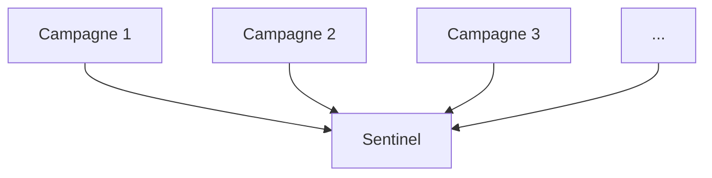

Chaque nouvelle compétence enrichira la même application.

Le projet gagnera progressivement en maturité,

exactement comme dans une entreprise.

---

# Qu'est-ce que Sentinel ?

Sentinel est une application de supervision légère.

Son objectif sera progressivement de :

- collecter des informations système ;
- exposer une API sécurisée ;
- produire des journaux ;
- communiquer avec d'autres machines ;
- s'authentifier avec des certificats ;
- être déployée sous forme de RPM ;
- fonctionner comme un véritable service Linux.

Aujourd'hui,

Sentinel ne fera presque rien.

C'est volontaire.

Nous allons la construire étape par étape.

---

# Une architecture évolutive

Notre application évoluera progressivement.

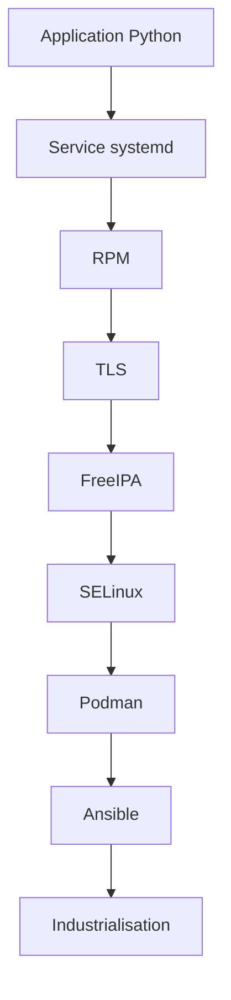

Chaque campagne ajoutera une nouvelle brique.

À aucun moment nous ne repartirons de zéro.

---

# Les objectifs de conception

Avant même d'écrire une ligne de code,

nous fixons plusieurs règles.

Sentinel devra être :

- simple ;
- maintenable ;
- sécurisée ;
- modulaire ;
- industrialisable.

Nous éviterons volontairement les raccourcis qui compliqueraient les campagnes suivantes.

---

# Une application pensée pour Linux

Sentinel ne sera pas une application portable.

Elle sera volontairement conçue pour exploiter les mécanismes Linux.

Par exemple.

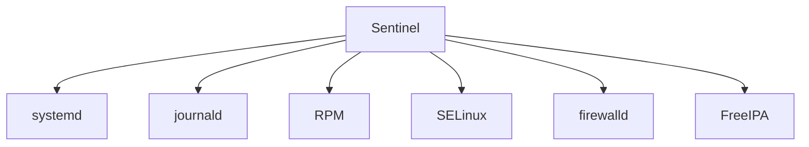

L'objectif de cette formation est justement de découvrir comment une application professionnelle s'intègre dans son système d'exploitation.

---

# Une architecture simple

Nous commencerons avec une structure volontairement minimaliste.

```text
sentinel/

├── sentinel/
│   └── __init__.py
│
├── tests/
│
├── pyproject.toml
│
├── README.md
│
└── LICENSE
```

Au fil de la formation,

cette arborescence évoluera naturellement.

---
# Une progression identique à celle d'un vrai projet

Dans une entreprise,

une application ne devient pas un produit complet en une journée.

Elle évolue progressivement.

Notre laboratoire suivra exactement cette logique.

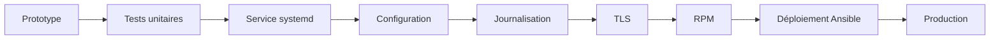

Vous découvrirez ainsi non seulement **comment développer une application**,

mais surtout **comment la faire évoluer vers un produit industrialisé**.

---

# Les machines du laboratoire

Tout au long de cette formation,

nous utiliserons un laboratoire stable.

Il évoluera progressivement sans jamais être reconstruit.

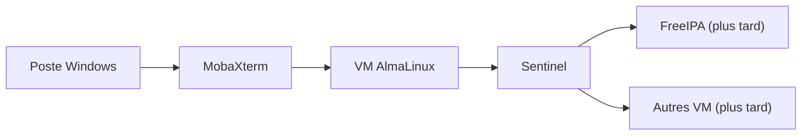

Dans les premières campagnes,

une seule machine suffit.

Puis,

au fur et à mesure,

de nouvelles machines viendront enrichir le laboratoire.

Cette approche permet de conserver un environnement simple au départ,

tout en préparant les campagnes avancées.

---

# Les règles du laboratoire

Afin que toutes les campagnes restent compatibles,

nous respecterons quelques règles simples.

## Une seule source de vérité

Le projet Sentinel ne devra jamais exister en plusieurs versions différentes.

Une seule arborescence sera utilisée.

Toutes les améliorations seront réalisées dessus.

---

## Toujours utiliser les outils natifs

Lorsque Linux fournit un mécanisme standard,

nous l'utiliserons.

Par exemple.

| Besoin | Solution retenue |
|---------|------------------|
| Installation | RPM |
| Gestion des services | systemd |
| Journaux | journald |
| Configuration | `/etc` |
| Données | `/var/lib` |
| Authentification | FreeIPA |
| Pare-feu | firewalld |
| Déploiement | Ansible |

L'objectif est de construire une application qui ressemble à un véritable logiciel d'entreprise.

---

## Toujours privilégier la sécurité

Chaque nouvelle fonctionnalité sera développée avec une question en tête.

> **Comment la sécuriser ?**

Cette réflexion accompagnera tout le développement.

Nous éviterons volontairement les solutions rapides qui compliquent ensuite la sécurisation.

---

# Les grandes étapes de Sentinel

À la fin de cette formation,

Sentinel ressemblera à ceci.

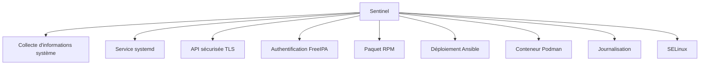

Chaque bloc correspondra à une compétence acquise pendant la formation.

---

# Pourquoi développer notre propre application ?

Une question revient souvent.

> Pourquoi ne pas utiliser directement Nginx, Apache ou Grafana ?

Parce que ces logiciels sont déjà terminés.

Ils masquent une grande partie des mécanismes internes.

En développant Sentinel,

nous contrôlerons entièrement :

- le code ;
- l'installation ;
- les certificats ;
- les permissions ;
- les journaux ;
- les unités systemd ;
- les RPM ;
- les politiques SELinux.

Nous comprendrons donc **pourquoi** chaque mécanisme existe.

---

# L'objectif final

À la fin de la formation,

Sentinel ne sera plus un simple script Python.

Il sera devenu un véritable produit Linux.

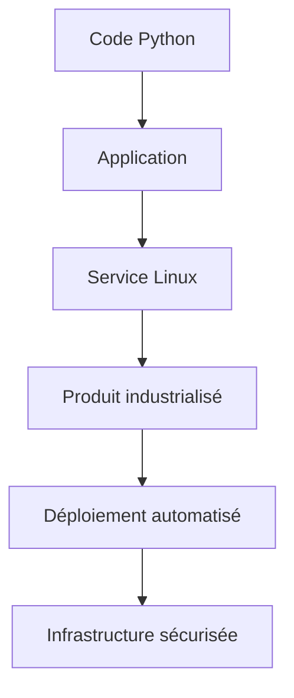

Vous aurez ainsi parcouru exactement le même chemin qu'une équipe de développement professionnelle.

---

# 💎 Le point d'expertise

## Un laboratoire doit être reproductible

Dans une entreprise,

personne ne souhaite entendre :

> « Chez moi ça fonctionne. »

Un laboratoire professionnel doit pouvoir être reconstruit facilement.

Visualisons.

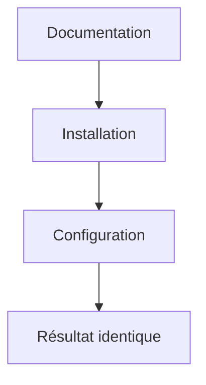

C'est précisément la raison pour laquelle nous :

- documenterons toutes les étapes ;
- utiliserons des outils standard ;
- automatiserons progressivement le déploiement.

À terme,

un nouveau collaborateur devra pouvoir reconstruire entièrement Sentinel sans connaissance préalable.

---

## Sentinel est un prétexte pédagogique

L'objectif principal n'est pas de produire le meilleur logiciel de supervision.

Sentinel est un **fil rouge**.

Chaque fonctionnalité sera choisie parce qu'elle permet d'introduire un nouveau concept.

Par exemple.

| Fonctionnalité | Concept étudié |
|---------------|----------------|
| Fichier de configuration | FHS |
| Service systemd | Administration système |
| API TLS | Certificats |
| RPM | Packaging |
| Déploiement | Ansible |
| Conteneur | Podman |
| Authentification | FreeIPA |

Ainsi,

chaque campagne apportera immédiatement une application concrète.

---
# 🧠 Comment pense un architecte ?

Un architecte ne conçoit jamais uniquement une application.

Il conçoit également son **cycle de vie**.

Avant même la première ligne de code,

il réfléchit déjà à plusieurs questions.

- Comment sera installée l'application ?
- Comment sera-t-elle configurée ?
- Comment sera-t-elle mise à jour ?
- Comment sera-t-elle supervisée ?
- Comment sera-t-elle désinstallée ?
- Comment migrer les données ?

Visualisons.

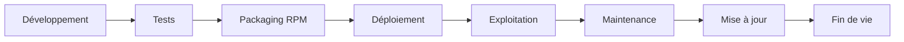

L'objectif de Sentinel est précisément d'apprendre à maîtriser chacune de ces étapes.

---

## Concevoir pour les dix prochaines campagnes

Il est très tentant,

au début d'un projet,

de prendre des raccourcis.

Par exemple :

- lancer directement le script Python ;
- stocker les fichiers dans son répertoire personnel ;
- utiliser le compte root ;
- ignorer les journaux.

Ces choix fonctionnent...

pendant quelques jours.

Mais ils rendent ensuite extrêmement difficile :

- la création d'un RPM ;
- l'intégration avec systemd ;
- le déploiement Ansible ;
- la sécurisation SELinux.

Nous allons donc faire exactement l'inverse.

Chaque décision prise aujourd'hui préparera les campagnes futures.

---

# ⚔️ Comment pense un attaquant ?

Un attaquant ne s'intéresse pas uniquement au code.

Il cherche également les erreurs d'intégration.

Par exemple.

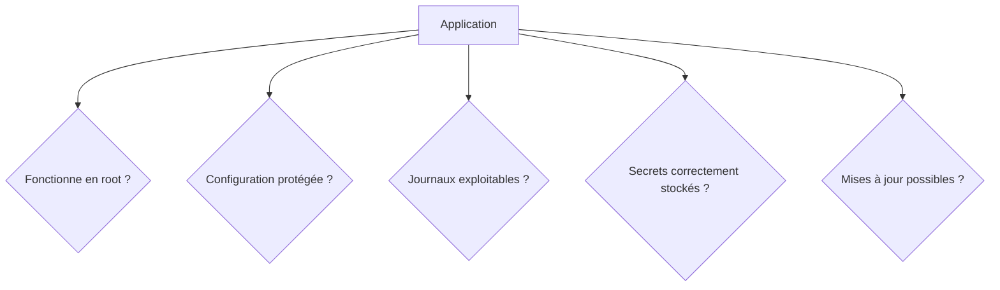

Une application techniquement excellente,

mais mal intégrée au système,

reste une cible intéressante.

C'est pourquoi nous consacrons autant de temps à l'architecture qu'au développement.

---

# 🏢 En entreprise

Lorsqu'une nouvelle application est développée,

elle est rarement confiée à une seule personne.

On retrouve généralement plusieurs équipes.

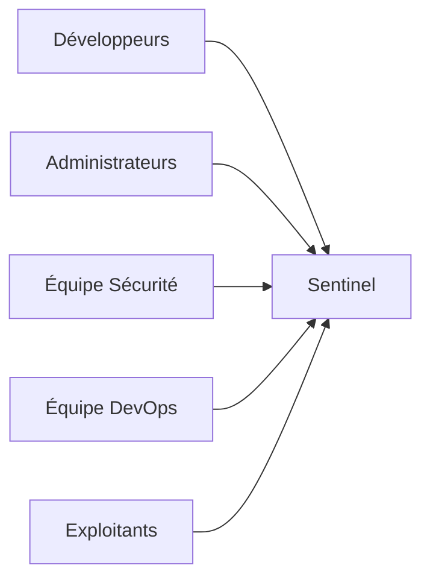

Toutes ces équipes travaillent sur **le même produit**.

Notre laboratoire reproduira cette organisation.

Selon les campagnes,

nous adopterons tour à tour le rôle :

- du développeur ;
- de l'administrateur système ;
- de l'ingénieur sécurité ;
- de l'ingénieur DevOps.

Vous apprendrez ainsi à comprendre les contraintes de chacun.

---

# 📚 Culture technique

## Pourquoi les distributions Enterprise privilégient-elles les standards ?

Une grande entreprise peut gérer :

- plusieurs centaines ;
- plusieurs milliers ;
- parfois plusieurs dizaines de milliers de serveurs.

À cette échelle,

l'originalité devient un problème.

Les standards permettent :

- une maintenance plus simple ;
- une meilleure automatisation ;
- une documentation plus claire ;
- des audits plus rapides.

C'est pourquoi nous utiliserons systématiquement :

- le FHS ;
- RPM ;
- systemd ;
- journald ;
- firewalld ;
- SELinux ;
- FreeIPA ;
- Ansible.

Ces technologies forment aujourd'hui le socle des distributions Linux Enterprise.

---

# ⚠️ Piège classique

## Considérer le laboratoire comme un simple environnement de test

Le laboratoire Sentinel n'est pas un bac à sable jetable.

Il représente un véritable environnement de développement.

Chaque campagne viendra enrichir :

- son architecture ;
- son code ;
- son packaging ;
- sa configuration.

Il ne devra jamais être recréé intégralement.

Au contraire,

nous apprendrons progressivement à le faire évoluer,

comme dans un véritable projet professionnel.

---

## Vouloir tout développer dès le début

Beaucoup de développeurs souhaitent immédiatement créer :

- une API ;
- une interface Web ;
- une base de données ;
- un système de plugins ;
- des conteneurs.

Nous allons volontairement résister à cette tentation.

Chaque nouvelle fonctionnalité apparaîtra **uniquement lorsqu'elle deviendra pédagogiquement utile**.

Cette progression permettra de comprendre le rôle exact de chaque technologie.

---

# Laboratoire AlmaLinux

## Objectif

Créer l'environnement qui servira de base à toutes les campagnes suivantes.

---

## Étape 1 — Créer le répertoire du projet

Par convention.

```bash
mkdir ~/sentinel
cd ~/sentinel
```

Ce répertoire deviendra la racine du projet.

---

## Étape 2 — Initialiser un dépôt Git

Créer le dépôt.

```bash
git init
```

Créer ensuite un premier commit.

Même si le projet est presque vide,

nous souhaitons conserver son historique dès le premier jour.

---

## Étape 3 — Préparer la structure

Créer les premiers éléments.

```text
sentinel/
├── sentinel/
├── tests/
├── docs/
├── scripts/
├── pyproject.toml
├── README.md
└── LICENSE
```

Les campagnes suivantes enrichiront progressivement cette arborescence.

---

## Étape 4 — Documenter le projet

Dans le fichier `README.md`,

décrire :

- l'objectif du projet ;
- l'architecture générale ;
- les technologies utilisées ;
- les prochaines étapes.

Cette documentation évoluera en même temps que Sentinel.

---

## Étape 5 — Vérifier le laboratoire

Avant de poursuivre la formation,

vérifiez que :

- le projet est créé ;
- Git fonctionne ;
- la structure est propre ;
- la documentation existe.

Vous disposez maintenant d'une base stable pour toutes les campagnes suivantes.

---

# Mission d'ingénieur

Votre responsable technique vous demande de préparer le référentiel de développement d'une nouvelle application interne.

Votre mission consiste à définir :

- l'organisation du dépôt Git ;
- la structure des répertoires ;
- les conventions de développement ;
- les technologies retenues ;
- les standards Linux qui devront être respectés.

L'objectif est que n'importe quel développeur rejoignant le projet dans six mois puisse comprendre immédiatement son organisation.

---

# Ce qu'il faut retenir

- Sentinel est le **fil rouge** de toute cette formation.
- L'application évoluera progressivement, sans jamais repartir de zéro.
- Chaque campagne ajoutera une nouvelle capacité au projet.
- Les choix d'architecture réalisés aujourd'hui prépareront le packaging RPM, systemd, SELinux, FreeIPA, Podman et Ansible.
- Le laboratoire doit être **reproductible**, **documenté** et **maintenable**.
- L'objectif final n'est pas uniquement de développer une application Python, mais de construire un **véritable service Linux Enterprise**.

---

# Grande infographie de révision du chapitre

```text
┌──────────────────────────────────────────────────────────────────────────────────────────────┐
│            CHAPITRE 1.10 — CRÉATION DU LABORATOIRE SENTINEL                                  │
├──────────────────────────────────────────────────────────────────────────────────────────────┤
│                                                                                              │
│                          LE FIL ROUGE DE LA FORMATION                                        │
│                                                                                              │
│                 Campagne 1                                                                   │
│                      │                                                                       │
│                      ▼                                                                       │
│              Sentinel v0                                                                     │
│                      │                                                                       │
│      ┌───────────────┼───────────────────────────────────────────────┐                       │
│      ▼               ▼               ▼               ▼               ▼                       │
│   systemd          RPM            TLS          FreeIPA         Ansible ...                   │
│                                                                                              │
├──────────────────────────────────────────────────────────────────────────────────────────────┤
│                        OBJECTIFS DU PROJET                                                   │
│                                                                                              │
│ ✔ Service Linux                                                                              │
│ ✔ Python                                                                                     │
│ ✔ Packaging RPM                                                                              │
│ ✔ Journalisation                                                                             │
│ ✔ Authentification                                                                           │
│ ✔ Déploiement automatisé                                                                     │
│ ✔ Sécurisation                                                                               │
│                                                                                              │
├──────────────────────────────────────────────────────────────────────────────────────────────┤
│                     TECHNOLOGIES UTILISÉES                                                   │
│                                                                                              │
│ Python                                                                                       │
│ Git                                                                                          │
│ systemd                                                                                      │
│ RPM / DNF                                                                                    │
│ firewalld                                                                                    │
│ SELinux                                                                                      │
│ FreeIPA                                                                                      │
│ Podman                                                                                       │
│ Ansible                                                                                      │
│                                                                                              │
├──────────────────────────────────────────────────────────────────────────────────────────────┤
│                              IDÉE CLÉ                                                        │
│                                                                                              │
│ « Une application professionnelle ne se résume pas                                           │
│  à son code. Elle comprend également son installation,                                       │
│  sa sécurité, son exploitation, ses mises à jour                                             │
│  et son industrialisation. »                                                                 │
└──────────────────────────────────────────────────────────────────────────────────────────────┘
```

# 🎉 Fin de la Campagne 1

Cette première campagne constitue un **socle extrêmement solide**. Avant d'aborder les mécanismes de sécurité avancés, le lecteur maîtrise désormais :

- l'architecture interne de Linux ;
- la gestion des paquets et des dépôts ;
- l'organisation du système de fichiers (FHS) ;
- les utilisateurs, groupes et permissions ;
- `sudo` et le principe du moindre privilège ;
- les bases du hardening ;
- l'environnement de travail qui servira de fil rouge jusqu'à la fin de la formation.
