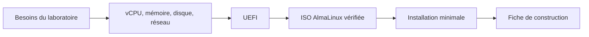
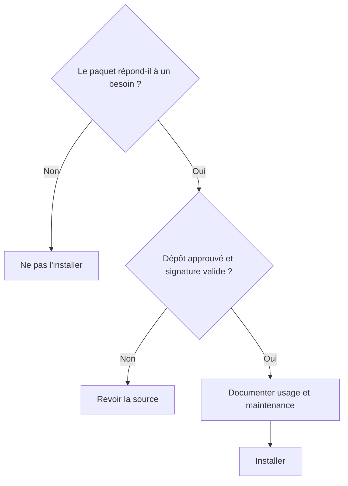
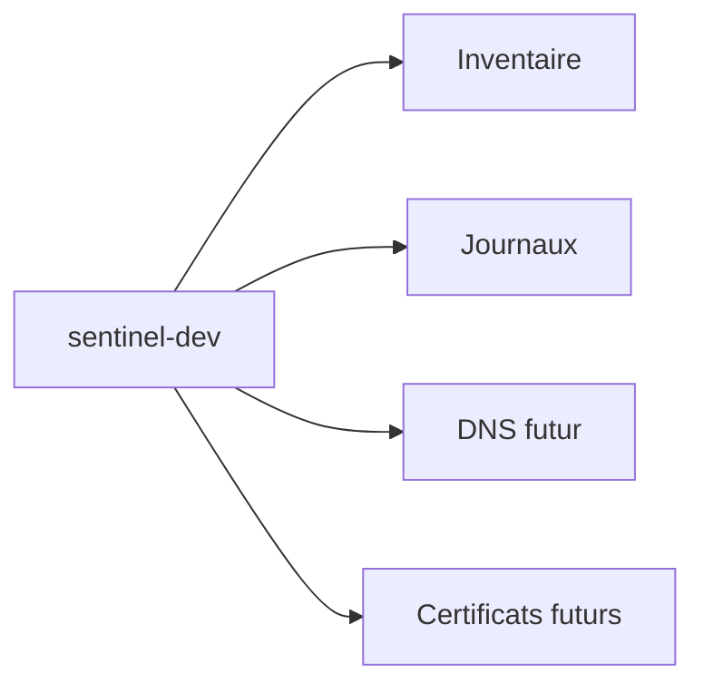
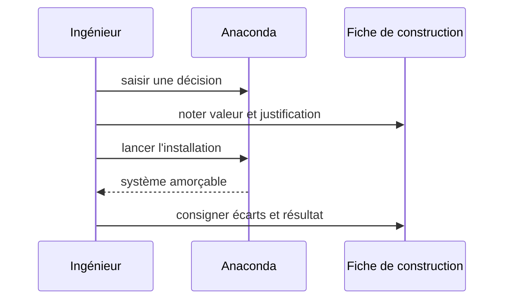

# Chapitre 1.2 — Installer AlmaLinux minimal

> **Campagne 1 — Installation et fondations**

> *« L'installation est la première configuration de sécurité du serveur. »*

## Vous êtes ici

```text
PARTIE I — Construire un socle sécurisé

Campagne 1

  1.1 Pourquoi sécuriser un socle Linux ? ✔
► 1.2 Installer AlmaLinux minimal
  1.3 Comprendre les composants du système
  1.4 Établir la baseline du serveur
  1.5 Mettre à jour et gérer les dépôts
  1.6 Organiser les systèmes de fichiers
  1.7 Comprendre identités et permissions
  1.8 Administrer avec sudo
  1.9 Mission : mettre le serveur en sécurité
  1.10 Créer le laboratoire Sentinel
```

## Objectifs pédagogiques

À l'issue de ce chapitre, vous serez capable de :

- préparer une machine virtuelle adaptée au laboratoire ;
- vérifier l'origine et l'intégrité d'une image d'installation AlmaLinux ;
- justifier le profil minimal, le stockage, le réseau et les identités choisis ;
- réaliser une installation guidée sans interface graphique sur le serveur ;
- conserver une fiche d'installation permettant de reconstruire la machine.

## Pourquoi ce chapitre existe

Une installation réussie ne se résume pas à obtenir une invite de connexion. Elle fixe le firmware, le découpage du stockage, les paquets initiaux, le nom de la machine, les comptes et la première configuration réseau. Ces choix influencent les mises à jour, les sauvegardes, le diagnostic et le durcissement.

Le laboratoire doit rester accessible à un débutant tout en adoptant des habitudes d'entreprise : média vérifié, profil minimal, compte nominatif, élévation par `sudo`, documentation des paramètres et possibilité de reconstruction.

## Définir la machine avant de l'installer

Le serveur Sentinel est une machine virtuelle. La virtualisation permet de recommencer, de prendre des instantanés ponctuels et de séparer le laboratoire du poste de travail. Un instantané n'est toutefois ni une sauvegarde indépendante ni une documentation de construction.

Une configuration de départ raisonnable comporte deux processeurs virtuels, 4 Gio de mémoire, un disque dynamique de 30 à 40 Gio et une interface réseau connectée au segment de laboratoire. Adaptez ces valeurs à l'hyperviseur et aux campagnes suivantes ; notez la valeur réellement allouée.



UEFI est retenu pour se rapprocher des plateformes actuelles et préparer la compréhension de la chaîne de démarrage. Le mode choisi doit rester constant après l'installation : passer arbitrairement de BIOS à UEFI peut rendre le système non amorçable.

## Obtenir et vérifier le média

Téléchargez l'ISO depuis un miroir référencé par le projet AlmaLinux. Récupérez également le fichier de sommes de contrôle depuis la source officielle, puis comparez la somme de l'image locale.

```bash
sha256sum AlmaLinux-*.iso
```

La valeur doit être identique à celle publiée pour le nom exact de l'ISO. Une somme prouve que le fichier reçu correspond au fichier annoncé ; sa confiance dépend encore de la provenance de la valeur de référence. Dans un processus plus exigeant, vérifiez aussi la signature du fichier de sommes selon les instructions du projet.

Conservez dans la fiche de construction : édition, version, architecture, URL d'origine, date de téléchargement et SHA-256. « Dernière ISO disponible » n'est pas une référence reproductible.

## Choisir un profil minimal

Dans l'installateur Anaconda, sélectionnez un environnement de type **Minimal Install** sans interface graphique. L'objectif n'est pas de rendre le serveur inconfortable, mais de limiter les paquets et les services dont il faut assurer le suivi.

L'administration se fera par la console au début, puis par SSH dans une campagne dédiée. Les outils utiles seront ajoutés depuis des dépôts connus au moment où leur besoin apparaîtra. Cette progression permet de relier chaque paquet à une fonction.



Le profil minimal ne dispense pas de l'inventaire. Il fournit un point de départ maîtrisable, pas une certification de sécurité.

## Concevoir le stockage sans sur-ingénierie

Pour le premier laboratoire, le partitionnement automatique avec LVM est adapté. Il crée les espaces nécessaires au démarrage et permet une certaine évolution des volumes. XFS, choix courant par défaut sur les systèmes Enterprise Linux, convient au système de fichiers principal.

Ne transformez pas ce chapitre en étude exhaustive de XFS, ext4 et de tous les schémas LVM. Les décisions utiles ici sont :

- le disque virtuel est assez grand pour le système, les journaux et les futurs artefacts ;
- le partitionnement retenu est noté ;
- le chiffrement éventuel est compatible avec le mode de démarrage du laboratoire ;
- les données importantes ne dépendront pas uniquement du disque de la VM.

Sur une plateforme de production, `/var`, les journaux ou les données applicatives peuvent être séparés pour limiter certains effets de saturation et adapter les sauvegardes. Ce choix dépend des volumes, des performances, du chiffrement et des procédures de récupération ; il ne doit pas être copié sans analyse.

### Comparer des variantes d'installation

Deux installations peuvent être valides tout en répondant à des contraintes différentes. Dans une VM de formation, le partitionnement automatique réduit les erreurs et accélère la reconstruction. Sur un serveur qui conserve beaucoup de journaux, séparer leur volume peut empêcher leur croissance de bloquer le système racine. Sur une machine distante sans console, le chiffrement intégral demande une procédure de déverrouillage au démarrage ; ignorer cette contrainte peut transformer une protection de confidentialité en panne de disponibilité.

| Décision | Laboratoire | Production possible | Question de validation |
| --- | --- | --- | --- |
| ressources | modestes et ajustables | capacité mesurée avec marge | que se passe-t-il en cas de saturation ? |
| stockage | automatique avec LVM | volumes séparés selon données | que faut-il sauvegarder et restaurer ? |
| réseau | segment isolé, DHCP possible | adressage et DNS gouvernés | quels flux sont nécessaires dès l'installation ? |
| chiffrement | selon objectif du lab | souvent exigé pour certains actifs | qui déverrouille après un redémarrage distant ? |
| profil | minimal | minimal complété par rôle | quel paquet justifie chaque fonction ? |

La bonne pratique n'est donc pas une valeur universelle. C'est une décision reliée au contexte, enregistrée et vérifiée au premier démarrage. Cette méthode prépare l'automatisation : un futur fichier Kickstart pourra exprimer les valeurs, mais il ne remplacera pas leur justification.

Gardez également une distinction entre **reconstruction** et **restauration**. Reconstruire recrée le système, les paquets et les configurations depuis des sources maîtrisées. Restaurer remet des données ou un état qui ne peuvent pas être régénérés. Le plan d'installation doit permettre la première opération sans prétendre résoudre la seconde.

## Nommer et connecter la machine

Choisissez un nom stable et fonctionnel, par exemple `sentinel-dev`. Un nom comme `server1` vieillit mal lorsqu'il faut corréler inventaire, DNS, certificats et journaux.

Pour le laboratoire, une adresse attribuée par DHCP est acceptable si elle reste identifiable. Une adresse fixe ou une réservation DHCP devient utile lorsque d'autres machines doivent joindre le serveur. Notez au minimum l'interface, l'adresse, la passerelle, les serveurs DNS et la méthode d'attribution.



Activez l'interface dans l'installateur, mais n'exposez pas la VM directement à Internet comme un serveur public. Utilisez le réseau de laboratoire prévu par l'hyperviseur et documentez les flux nécessaires.

## Créer les identités initiales

Créez un utilisateur administratif nominatif et autorisez-le à administrer le système. Sur AlmaLinux, l'appartenance au groupe `wheel` lui permet généralement d'utiliser `sudo` selon la politique installée.

Utilisez une phrase de passe propre au laboratoire et ne la placez ni dans le dépôt Git ni dans une capture d'écran. Le compte `root` peut rester verrouillé si le mode d'installation et la procédure de récupération le permettent ; sinon, définissez un secret distinct et protégez-le. L'objectif est d'éviter la session `root` quotidienne, pas de perdre tout moyen de récupération.

Deux identités ont des finalités différentes :

| Identité | Usage | Interdit |
| --- | --- | --- |
| administrateur nominatif | connexion et élévation temporaire | exécuter le service Sentinel |
| futur compte `sentinel` | exécuter uniquement l'application | se connecter et administrer l'hôte |

Le compte de service sera créé plus tard, lorsque ses répertoires et permissions seront définis.

## Installer avec une fiche de décisions

Avant de cliquer sur **Begin Installation**, relisez les choix comme une revue de changement :

1. destination et schéma de stockage ;
2. profil logiciel minimal ;
3. fuseau horaire et synchronisation de l'heure ;
4. nom d'hôte et interface active ;
5. utilisateur administratif ;
6. état du compte `root` ;
7. source d'installation.



Cette fiche deviendra plus tard une source pour l'automatisation. Pour l'instant, elle sert à détecter les décisions implicites et à rendre la reconstruction possible par une autre personne.

## Premier démarrage contrôlé

Après le redémarrage, retirez ou éjectez l'ISO afin de démarrer sur le disque installé. Connectez-vous avec le compte nominatif, puis collectez quelques preuves sans changer le système :

```bash
hostnamectl
cat /etc/os-release
findmnt --real
lsblk -f
ip -brief address
timedatectl
id
sudo -l
```

Vérifiez que le nom, l'édition, les systèmes de fichiers, le réseau, l'heure et l'élévation correspondent à la fiche. Le chapitre 1.4 transformera cette vérification en baseline complète.

Ne lancez pas une série de commandes trouvées sur Internet pour « durcir » la VM. Commencez par connaître l'état obtenu, puis appliquez des changements identifiés et réversibles.

## TP 1 — Préparer le dossier d'installation

Avant l'installation, produisez un dossier contenant :

- les caractéristiques de la VM ;
- la référence exacte de l'ISO et sa somme SHA-256 ;
- le type de firmware ;
- le mode réseau et le nom d'hôte ;
- le schéma de stockage envisagé ;
- les identités initiales sans leurs secrets ;
- les critères d'acceptation du premier démarrage.

Ajoutez une justification courte pour chaque choix. Une valeur sans raison est difficile à réexaminer ; une longue dissertation masque parfois l'absence de décision.

## TP 2 — Installer puis confronter le réel au prévu

Réalisez l'installation, exécutez les commandes de premier démarrage et complétez un tableau d'écarts :

| Élément | Prévu | Observé | Écart accepté ? | Action |
| --- | --- | --- | --- | --- |
| nom d'hôte | `sentinel-dev` | à relever | oui/non | corriger ou documenter |
| profil | minimal | à relever | oui/non | inventorier |
| stockage | LVM/XFS | à relever | oui/non | analyser |
| réseau | segment laboratoire | à relever | oui/non | corriger |
| heure | synchronisée | à relever | oui/non | diagnostiquer |

Ne corrigez un écart qu'après l'avoir enregistré. Cette discipline distingue l'observation de la modification.

## Mission d'ingénieur — Rendre l'installation reconstructible

Confiez votre fiche à une autre personne ou relisez-la comme si vous découvriez le projet. Elle doit permettre de répondre sans ambiguïté à ces questions :

1. quelle image utiliser et comment vérifier son intégrité ?
2. quelles ressources attribuer à la VM ?
3. quel réseau et quel nom configurer ?
4. quel profil logiciel sélectionner ?
5. quel stockage obtenir ?
6. quelles identités créer et à quoi servent-elles ?
7. quelles commandes prouvent que l'installation est conforme ?
8. comment signaler un écart sans inventer une nouvelle référence ?

La mission est réussie si une reconstruction produit un serveur fonctionnellement équivalent, même si les identifiants matériels ou l'adresse DHCP diffèrent.

## Impact sur Sentinel

Sentinel dispose maintenant d'un hôte minimal, nommé et documenté. Aucun composant applicatif n'est encore installé, ce qui permet d'établir un état de référence avant d'ajouter des dépendances. Le compte administratif sera séparé du futur compte de service.

Les choix de stockage, de réseau et d'identité ne figent pas toute l'architecture. Ils créent une base explicite que les campagnes suivantes pourront faire évoluer par des changements relisibles.

## Synthèse

- L'installation fixe déjà des frontières de confiance et des responsabilités de maintenance.
- Une ISO doit être obtenue depuis une source officielle et contrôlée avec sa référence publiée.
- Le profil minimal réduit l'inventaire initial sans garantir à lui seul la sécurité.
- Le partitionnement automatique avec LVM convient au laboratoire ; la production exige une analyse de capacité et de récupération.
- Un compte nominatif administre l'hôte ; le futur service utilisera une identité distincte.
- La fiche de construction rend les choix révisables et la machine reconstructible.

## Infographie de révision

```text
SOURCE OFFICIELLE ──► ISO + SHA-256 ──► VM DOCUMENTÉE
                                              │
                 ┌────────────────────────────┼─────────────────────────┐
                 ▼                            ▼                         ▼
          PROFIL MINIMAL                STOCKAGE LVM              RÉSEAU LAB
                 │                            │                         │
                 └────────────────────────────┼─────────────────────────┘
                                              ▼
                          COMPTE NOMINATIF + SUDO CONTRÔLÉ
                                              │
                                              ▼
                              PREMIER DÉMARRAGE VÉRIFIABLE
```

## Pour aller plus loin

Conservez les instructions officielles AlmaLinux correspondant à la version installée et la documentation de votre hyperviseur. Les écrans d'Anaconda évoluent ; la fiche doit décrire les résultats attendus, pas seulement une suite de clics.

Chapitre suivant : comprendre comment noyau, espace utilisateur, processus, bibliothèques et systemd coopèrent sur le serveur obtenu.

← [1.1 — Pourquoi sécuriser un socle Linux ?](1.1-pourquoi-securiser-socle-linux.md) · [1.3 — Comprendre les composants du système](1.3-composants-systeme-linux.md) →
