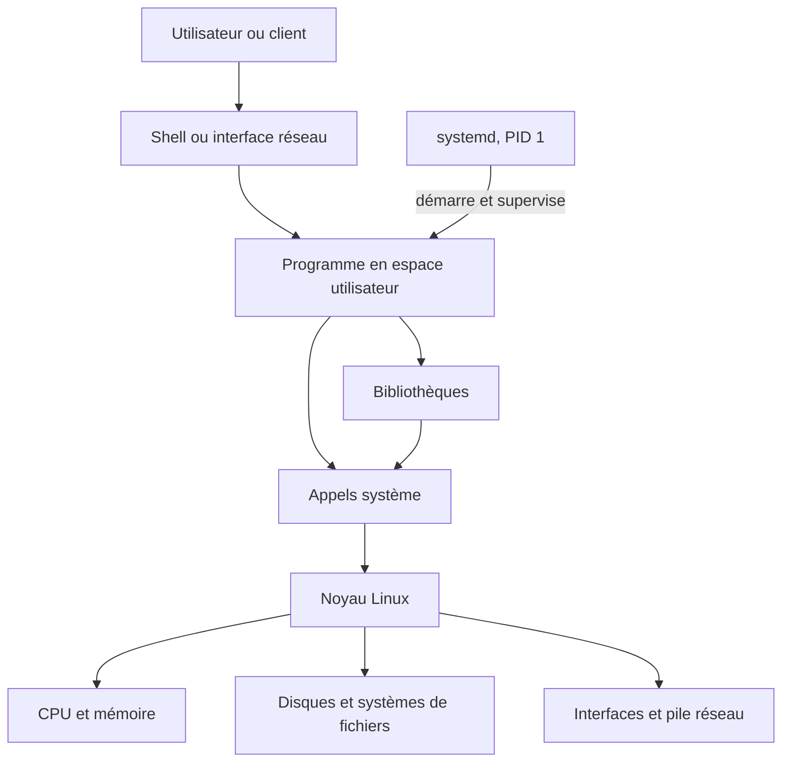
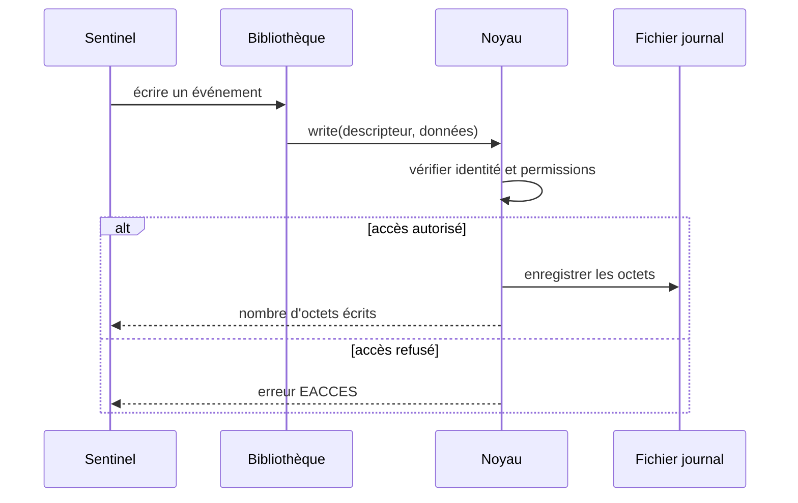
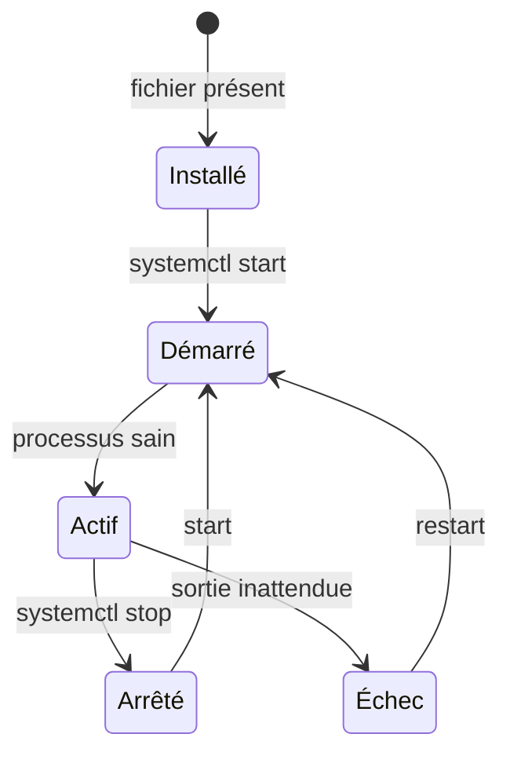
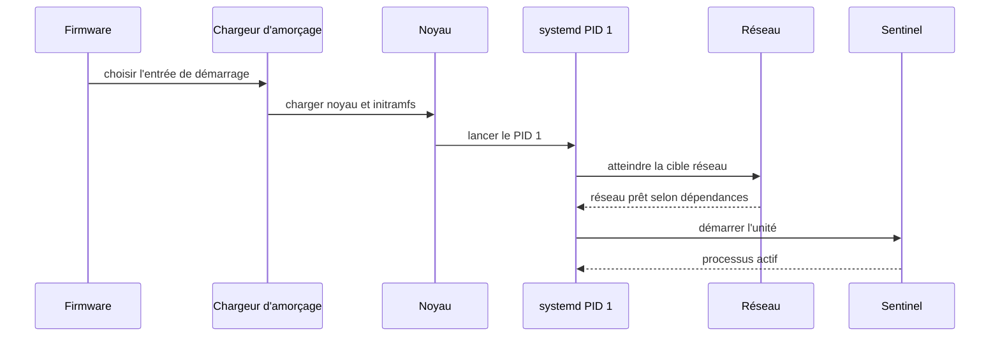

# Chapitre 1.3 — Comprendre les composants d'un système Linux

> **Campagne 1 — Installation et fondations**

> *« Diagnostiquer Linux commence par savoir dans quelle couche chercher. »*

## Vous êtes ici

```text
PARTIE I — Construire un socle sécurisé

Campagne 1

  1.1 Pourquoi sécuriser un socle Linux ? ✔
  1.2 Installer AlmaLinux minimal ✔
► 1.3 Comprendre les composants du système
  1.4 Établir la baseline du serveur
  1.5 Mettre à jour et gérer les dépôts
  1.6 Organiser les systèmes de fichiers
  1.7 Comprendre identités et permissions
  1.8 Administrer avec sudo
  1.9 Mission : mettre le serveur en sécurité
  1.10 Créer le laboratoire Sentinel
```

## Objectifs pédagogiques

À l'issue de ce chapitre, vous serez capable de :

- distinguer noyau, espace utilisateur, shell, bibliothèque, processus et service ;
- expliquer le passage d'une application vers le noyau par les appels système ;
- relier un programme sur disque à un processus en mémoire puis à une unité systemd ;
- localiser la couche probable d'une panne ou d'un contrôle de sécurité ;
- observer ces composants sur le serveur AlmaLinux.

## Pourquoi ce chapitre existe

Des termes comme « Linux », « service » ou « application » sont souvent employés comme s'ils désignaient la même chose. Cette confusion conduit à chercher un problème réseau dans Bash, à attribuer à systemd une décision du noyau ou à croire qu'un fichier exécutable est déjà un processus.

Sentinel traversera toutes ces couches : un paquet déposera des fichiers, systemd créera un processus, des bibliothèques fourniront des fonctions, le noyau arbitrera les accès et les journaux conserveront les événements. Une carte mentale stable évite de mémoriser des commandes sans comprendre leurs résultats.

## La carte générale du système



La distribution AlmaLinux assemble le noyau Linux avec des outils, bibliothèques, conventions, paquets et politiques de maintenance. Bash est un programme de cette distribution ; il n'est ni le noyau ni « Linux entier ».

## Le noyau arbitre les ressources

Le noyau s'exécute avec le niveau de privilège nécessaire pour gérer le processeur, la mémoire, les périphériques, les systèmes de fichiers, le réseau et l'ordonnancement. Les applications ordinaires vivent en **espace utilisateur** et ne manipulent pas directement le matériel.

Lorsqu'un programme veut ouvrir un fichier, créer un processus ou envoyer des octets sur le réseau, il demande l'opération au noyau par un **appel système**. Le noyau vérifie le contexte : identité, permissions, état de la ressource, politique de sécurité et limites.



Une erreur `Permission denied` ne signifie donc pas que le programme « refuse ». Elle indique souvent qu'une règle évaluée par le noyau n'autorise pas l'opération. Les campagnes suivantes distingueront permissions Unix, ACL, capacités et SELinux.

## Programme, processus et service

Un **programme** est un ensemble d'instructions stocké dans un fichier. Un **processus** est une instance en cours d'exécution avec un PID, une identité, une mémoire, des fichiers ouverts et un environnement. Plusieurs processus peuvent exécuter le même programme.

Un **service** est une fonction durable fournie par le système, souvent gérée par un superviseur. Sous AlmaLinux, systemd démarre la plupart des services et suit leur état à travers des **unités**. Le fichier de programme, le processus et l'unité ne sont pas interchangeables.



Un service peut être installé mais désactivé, activé au démarrage mais actuellement en échec, ou démarré manuellement sans être activé. Les commandes `systemctl status`, `is-active` et `is-enabled` répondent à des questions différentes.

## Le rôle particulier de systemd

Le premier processus de l'espace utilisateur porte normalement le PID 1. systemd organise le démarrage, exprime des dépendances, lance les services dans un contexte défini, collecte leur sortie avec journald et réagit à leur arrêt.

Il ne remplace pas le noyau : lorsqu'une unité indique `User=sentinel`, systemd prépare l'identité du processus, puis le noyau applique réellement les règles d'accès. Lorsqu'une unité limite la mémoire, systemd configure le mécanisme du noyau correspondant.

### Du démarrage au service disponible

Le démarrage relie plusieurs composants avant que Sentinel puisse répondre. Le firmware charge un programme d'amorçage ; celui-ci charge le noyau et son environnement initial ; le noyau initialise le matériel visible et lance le premier processus d'espace utilisateur ; systemd atteint ensuite des cibles et démarre les unités selon leurs dépendances.



Chaque flèche fournit un point de diagnostic différent. Une entrée de démarrage incorrecte se traite avant l'espace utilisateur ; un module manquant se cherche côté noyau ; un ordre de dépendance se lit dans systemd ; une application qui quitte avec un code d'erreur se comprend dans ses journaux.

Cette chaîne explique aussi pourquoi « redémarrer le service » et « redémarrer la machine » ne sont pas équivalents. Le premier recrée un processus et relit généralement sa configuration ; le second change potentiellement le noyau actif, réinitialise `/run`, rejoue les montages et reconstruit tout le graphe d'unités. Un redémarrage est parfois nécessaire, mais sa portée doit être assumée et testée.

Pour relier l'état courant au démarrage :

```bash
cat /proc/cmdline
systemctl list-dependencies default.target
systemd-analyze time
systemd-analyze critical-chain
```

Les mesures de `systemd-analyze` servent à orienter une enquête, pas à désactiver automatiquement l'unité la plus lente. Une dépendance de sécurité ou de stockage peut légitimement retarder la disponibilité.

Pour observer le PID 1 et la hiérarchie :

```bash
ps -p 1 -o pid,comm,args
systemctl --version
systemctl list-units --type=service --state=running
systemd-cgls
```

Les détails de création et de durcissement d'une unité seront traités dans la campagne systemd. Ici, retenez la relation entre définition, processus et noyau.

## Shell et commandes

Le shell lit une commande, développe certaines expressions, prépare les redirections et lance un programme. Une commande peut être :

- une fonctionnalité interne du shell, comme `cd` ;
- un exécutable, comme `/usr/bin/id` ;
- un alias ou une fonction ;
- un chemin explicite vers un script.

```bash
printf '%s\n' "$SHELL"
ps -p $$ -o pid,ppid,comm,args
type cd
type id
command -v id
```

Cette distinction compte pour le diagnostic. `cd` doit modifier le répertoire du shell courant ; un processus enfant ne pourrait pas modifier durablement le répertoire de son parent. À l'inverse, `id` est exécuté comme un programme et interroge le système sur les identités.

## Les bibliothèques partagent des fonctions

Une bibliothèque fournit du code réutilisable : résolution de noms, traitement cryptographique, formatage, interaction avec le système. Beaucoup d'exécutables sont **liés dynamiquement** et chargent des bibliothèques au démarrage.

```bash
file /usr/bin/curl
ldd /usr/bin/curl
rpm -qf /usr/bin/curl
```

`ldd` est ici appliqué à un binaire connu du système. N'utilisez pas cet outil sans précaution sur un exécutable non fiable. `rpm -qf` relie un fichier au paquet qui en assure la maintenance.

Une bibliothèque partagée réduit la duplication et permet de corriger plusieurs programmes par la mise à jour d'un composant commun. Elle crée aussi une dépendance : une incompatibilité ou une vulnérabilité peut affecter plusieurs consommateurs. Le gestionnaire de paquets sert précisément à maintenir ces relations.

## Modules, périphériques et pseudo-systèmes de fichiers

Le noyau peut charger des **modules** qui ajoutent la prise en charge d'un matériel ou d'une fonction. Ils s'exécutent dans l'espace noyau ; leur origine et leur nécessité sont donc importantes.

```bash
lsmod | sed -n '1,15p'
uname -r
```

Linux expose aussi des informations du noyau sous forme de fichiers virtuels. `/proc` décrit notamment processus et paramètres ; `/sys` représente des objets du noyau et du matériel ; `/dev` contient les interfaces vers les périphériques. Leur contenu n'est pas stocké comme un document ordinaire sur le disque.

```bash
cat /proc/cmdline
cat /proc/uptime
ls /sys/class/net
```

Cette interface explique l'expression « beaucoup de choses sont représentées comme des fichiers », sans signifier que toute ressource est un fichier persistant.

## Une méthode de diagnostic par couches

Face à un symptôme, formulez d'abord ce qui était attendu et ce qui est observé. Puis descendez la pile sans sauter directement à une conclusion.

| Symptôme | Première couche à examiner | Outils initiaux |
| --- | --- | --- |
| unité en échec | systemd et journaux | `systemctl status`, `journalctl` |
| processus absent | processus et unité | `ps`, `systemctl` |
| accès fichier refusé | identité et règles du noyau | `id`, `namei`, `ls -l` |
| port non joignable | écoute, réseau, filtrage | `ss`, `ip` |
| fonction introuvable | paquet et bibliothèques | `rpm`, `ldd` |
| ressource saturée | noyau et processus | `free`, `df`, `ps` |

Une panne traverse parfois plusieurs couches. Le tableau indique un point de départ, pas une certitude.

## TP 1 — Suivre une commande jusqu'au noyau

Exécutez une commande simple et identifiez ses composants :

```bash
command -v cat
file /usr/bin/cat
rpm -qf /usr/bin/cat
ldd /usr/bin/cat
strace -e trace=openat,read,write /usr/bin/cat /etc/os-release
```

Si `strace` n'est pas installé, recherchez son paquet puis installez-le depuis les dépôts approuvés après validation de votre formateur. Repérez l'ouverture du fichier, les lectures et les écritures. Distinguez ce que fait le shell de ce que fait `cat`, puis ce que le noyau arbitre.

## TP 2 — Relier une unité à ses processus

Choisissez un service déjà actif, par exemple `chronyd`, puis observez-le :

```bash
systemctl status chronyd --no-pager
systemctl show chronyd -p MainPID -p User -p Group -p FragmentPath
systemctl cat chronyd
ps -o pid,ppid,user,group,comm,args -p "$(systemctl show -p MainPID --value chronyd)"
journalctl -u chronyd -b --no-pager | tail -n 20
```

Relevez le fichier d'unité, l'identité, le PID principal et les derniers événements. N'altérez pas le service. Expliquez quelle information vient de systemd, du processus ou du noyau.

## Mission d'ingénieur — Cartographier l'exécution de Sentinel

Dessinez le chemin futur d'une requête adressée à Sentinel, depuis le client jusqu'à une écriture de journal. Votre modèle doit montrer :

1. l'entrée réseau ;
2. le processus Sentinel et son identité ;
3. les bibliothèques utiles ;
4. au moins trois appels au noyau ;
5. les fichiers de configuration et de données ;
6. l'unité systemd ;
7. les points où un refus ou une panne peut se produire ;
8. l'outil initial de diagnostic pour chacun.

Le livrable est réussi si chaque composant a un rôle précis et si systemd, noyau et application ne sont pas confondus.

## Impact sur Sentinel

Sentinel sera un programme installé sur disque, exécuté comme processus par systemd avec une identité dédiée. Il utilisera des bibliothèques et demandera au noyau des accès aux fichiers, au réseau et à la mémoire. Les contrôles seront placés dans la couche capable de les imposer et les preuves seront collectées dans la couche capable de les observer.

## Synthèse

- AlmaLinux est une distribution ; le noyau Linux n'est qu'un de ses composants centraux.
- L'espace utilisateur demande des opérations au noyau par les appels système.
- Un programme est un fichier ; un processus est une exécution ; un service est une fonction supervisée.
- systemd gère le cycle de vie des services mais s'appuie sur les mécanismes du noyau.
- Le shell lance des programmes et orchestre leurs entrées et sorties.
- Les bibliothèques partagées créent à la fois réutilisation et dépendances.
- Un diagnostic fiable part du symptôme et examine les couches dans un ordre explicite.

## Infographie de révision

```text
UTILISATEUR
    │ commande / requête
    ▼
SHELL OU SERVICE ──► PROGRAMME ──► PROCESSUS
                                      │
                               bibliothèques
                                      │ appels système
                                      ▼
                                  NOYAU
                         ┌────────────┼────────────┐
                         ▼            ▼            ▼
                      fichiers      réseau      mémoire

systemd : démarre, configure et supervise le processus
noyau   : arbitre réellement l'accès aux ressources
```

## Pour aller plus loin

Les pages de manuel `man 2 syscalls`, `man 5 proc` et `man systemd` permettent d'approfondir chaque couche à partir de la documentation installée avec le système.

Chapitre suivant : utiliser cette carte pour établir une baseline courte, comparable et exploitable du serveur fraîchement installé.

← [1.2 — Installer AlmaLinux minimal](1.2-installation-almalinux-minimal.md) · [1.4 — Établir la baseline du serveur](1.4-premier-demarrage-verifications.md) →
