# Campagne 1 — Installation et fondations

# Chapitre 1.3 — Comprendre les privilèges sous Linux

> *« Sous Linux, tout n'est pas une question de confiance. Tout est une question de privilèges. »*

---

# Vous êtes ici

```text
Partie I — Construire un socle sécurisé

Campagne 1 — Installation et fondations

      1.1 Pourquoi sécuriser un socle Linux ?
      1.2 Installation d'AlmaLinux Minimal
    ► 1.3 Comprendre les privilèges
      1.4 Le système de fichiers
      1.5 Utilisateurs et groupes
      1.6 Permissions Linux
      1.7 sudo et moindre privilège
      1.8 Première sécurisation de Sentinel
```

---

# Objectifs pédagogiques

À la fin de ce chapitre, vous serez capable de :

- comprendre pourquoi Linux distingue les utilisateurs ordinaires du superutilisateur ;
- expliquer ce qu'est réellement un privilège ;
- comprendre le rôle du noyau dans le contrôle des accès ;
- identifier les risques liés à l'utilisation du compte root ;
- raisonner selon le principe du moindre privilège.

---

# Pourquoi ce chapitre existe

Imaginez qu'un utilisateur ouvre accidentellement un programme malveillant.

Que pourrait faire ce programme ?

La réponse dépend entièrement des privilèges dont dispose l'utilisateur.

S'il possède uniquement des droits limités,

les dégâts resteront généralement contenus.

En revanche,

si ce programme s'exécute avec les privilèges de **root**,

il pourra potentiellement :

- supprimer des fichiers système ;
- créer des utilisateurs ;
- désactiver les protections ;
- installer d'autres logiciels ;
- compromettre complètement le serveur.

La sécurité d'un système Linux repose donc avant tout sur une idée très simple :

> **Chaque utilisateur ne doit posséder que les privilèges strictement nécessaires.**

---

# Qu'est-ce qu'un privilège ?

Un privilège représente un droit accordé à un processus ou à un utilisateur.

Par exemple.

- lire un fichier ;
- modifier une configuration ;
- écouter sur un port réseau ;
- créer un utilisateur ;
- arrêter un service ;
- charger un module du noyau.

Chaque opération sensible nécessite un privilège particulier.

Le noyau Linux décide alors :

- d'autoriser ;
- ou de refuser

l'opération demandée.

---

# Le noyau est le gardien du système

Toutes les demandes passent par le noyau.

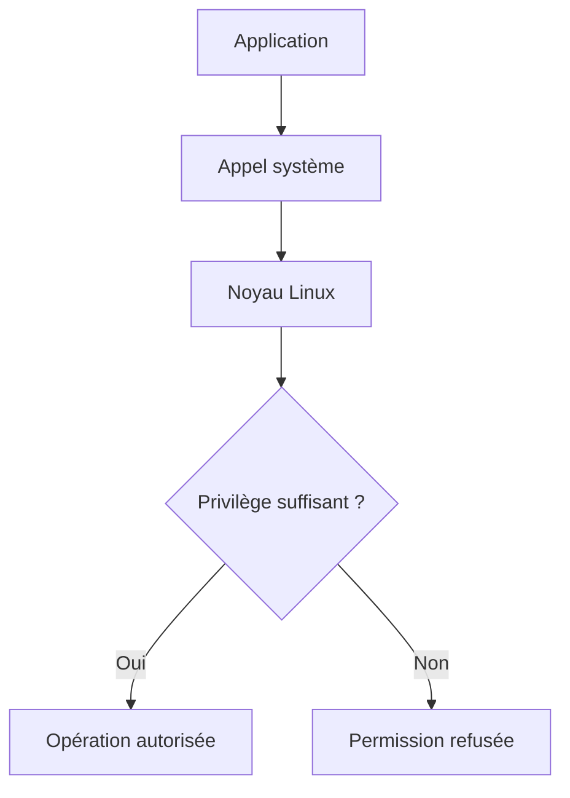

Le noyau ne fait confiance à aucun programme.

Chaque action est vérifiée.

Cette architecture constitue l'un des piliers de la sécurité de Linux.

---

# Utilisateur et processus

Une erreur fréquente consiste à penser que ce sont uniquement les utilisateurs qui possèdent des droits.

En réalité,

Linux raisonne principalement en termes de **processus**.

Chaque processus possède une identité.

Cette identité est héritée de l'utilisateur qui l'a lancé.

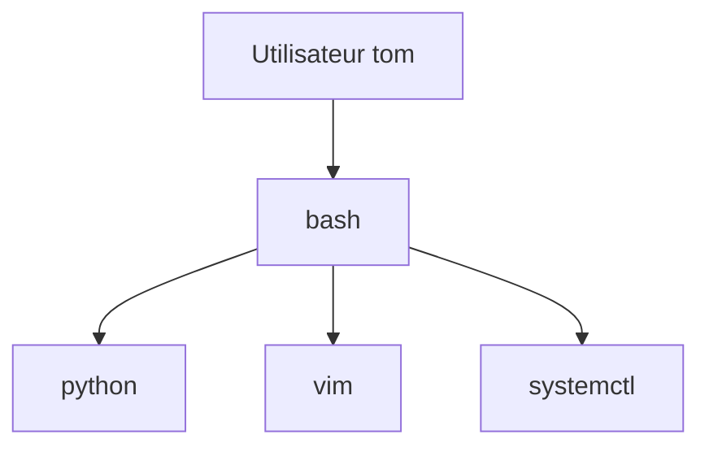

Tous ces processus héritent des privilèges de l'utilisateur,

sauf si un mécanisme particulier vient les modifier.

Nous découvrirons plus tard :

- `sudo` ;
- les bits SUID ;
- les capacités Linux (*Capabilities*).

---

# Tous les utilisateurs ne sont pas égaux

Linux distingue plusieurs catégories.

| Catégorie | Rôle |
|-----------|------|
| root | Contrôle total du système |
| Utilisateur classique | Travail quotidien |
| Comptes système | Exécution des services |

Cette distinction est essentielle.

Elle permet d'isoler les différents composants du système.

Un serveur Web n'a pas besoin des mêmes privilèges qu'un administrateur.

Un serveur DNS n'a pas besoin des mêmes droits qu'une base de données.

Chaque service dispose donc de sa propre identité.

Nous reviendrons très largement sur cette notion au chapitre consacré aux utilisateurs.

---

# Le superutilisateur

Sous Linux,

un utilisateur possède un statut particulier.

Son nom est :

```text
root
```

Il est parfois appelé :

- superutilisateur ;
- administrateur système.

Contrairement aux autres comptes,

root peut pratiquement tout faire.

Par exemple.

- modifier n'importe quel fichier ;
- arrêter le système ;
- créer des utilisateurs ;
- modifier les permissions ;
- installer des logiciels ;
- désactiver des protections.

Il ne s'agit pas simplement d'un utilisateur "plus puissant".

Il s'agit d'un utilisateur **qui échappe à la majorité des contrôles classiques**.

# Pourquoi root est-il si puissant ?

Pour comprendre la philosophie de Linux,

il faut répondre à une question essentielle.

Pourquoi existe-t-il un utilisateur capable de tout faire ?

La réponse est simple.

Certaines opérations nécessitent une autorité absolue.

Par exemple :

- installer le système ;
- modifier le noyau ;
- créer des utilisateurs ;
- configurer le réseau ;
- installer des services ;
- réparer une machine en panne.

Il serait impossible d'administrer un système si aucun utilisateur ne disposait de ces privilèges.

Root est donc indispensable.

Mais son utilisation doit rester exceptionnelle.

---

# Le problème de root

Imaginons maintenant deux situations.

Premier scénario.

```text
Administrateur

↓

Connexion root

↓

Toutes les commandes

s'exécutent

avec tous les privilèges
```

Une simple erreur peut alors provoquer :

- la suppression d'un répertoire système ;
- la modification d'une configuration critique ;
- l'arrêt involontaire d'un service de production.

---

Deuxième scénario.

```text
Administrateur

↓

Compte personnel

↓

sudo

↓

Commande privilégiée

↓

Retour au compte normal
```

Dans cette approche,

les privilèges élevés ne sont utilisés que quelques secondes.

Le risque est considérablement réduit.

---

# Une erreur peut devenir catastrophique

Prenons un exemple célèbre.

Supposons que l'on exécute :

```bash
rm -rf /
```

Avec un utilisateur classique,

la commande échouera très rapidement.

Le noyau refusera la suppression de la majorité des fichiers.

En revanche,

avec root,

le système pourra commencer à supprimer ses propres composants.

C'est précisément pour éviter ce type de catastrophe que l'on recommande de ne jamais travailler quotidiennement avec le compte root.

---

# Les privilèges protègent également contre les erreurs

On imagine souvent que les privilèges servent uniquement à arrêter les attaquants.

En réalité,

ils protègent également les administrateurs.

Prenons l'exemple suivant.

Vous développez Sentinel.

Votre programme contient un bug.

Il tente d'effacer :

```text
/etc
```

Deux situations existent.

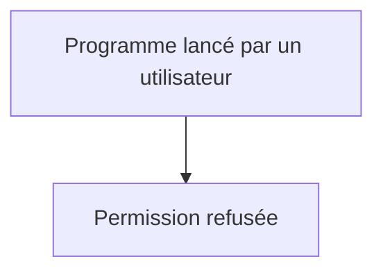

Ou bien.

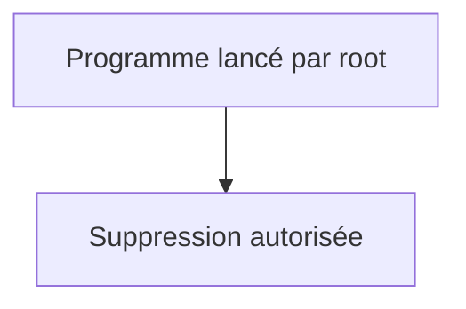

Dans le premier cas,

le système protège l'administrateur contre sa propre erreur.

Dans le second,

il lui fait confiance.

Cette différence est fondamentale.

---

# L'identifiant numérique

Linux ne connaît pas les noms des utilisateurs.

En interne,

il manipule uniquement des identifiants numériques.

Le plus célèbre est :

```text
UID 0
```

qui correspond à :

```text
root
```

Les utilisateurs classiques possèdent généralement :

```text
UID ≥ 1000
```

Les comptes système utilisent,

selon les distributions,

des identifiants plus faibles.

Nous étudierons ces notions beaucoup plus en détail dans le chapitre suivant.

---

# Les privilèges sont hérités

Lorsqu'un processus lance un autre processus,

les privilèges sont généralement conservés.

Visualisons.

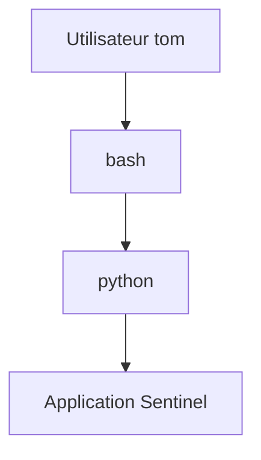

Si `tom` possède des droits limités,

tous ces programmes disposeront eux aussi de droits limités.

C'est une propriété extrêmement importante.

Elle permet d'éviter qu'une application obtienne accidentellement davantage de privilèges que son utilisateur.

---

# Changer d'identité

Linux permet toutefois de modifier cette identité.

Par exemple avec :

```bash
sudo
```

ou

```bash
su
```

Dans ce cas,

le processus change d'identité.

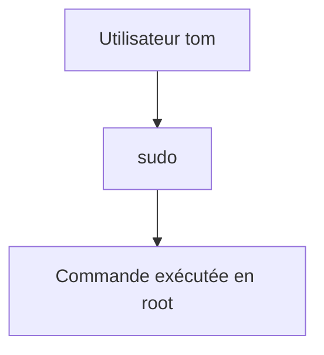

Nous consacrerons un chapitre entier à ces mécanismes,

car ils constituent le mode d'administration recommandé sur les serveurs modernes.

---

# Les comptes système

Lorsque vous ouvrirez :

```text
/etc/passwd
```

vous découvrirez probablement plusieurs dizaines d'utilisateurs.

Par exemple.

- `chrony`
- `sssd`
- `rpc`
- `dbus`
- `nginx`
- `apache`
- `postfix`

Ces utilisateurs ne correspondent pas à des personnes.

Ils représentent des **identités techniques**.

Chaque service Linux fonctionne sous un compte dédié.

Pourquoi ?

Parce qu'un service compromis ne doit pas automatiquement obtenir les droits d'un autre.

Par exemple.

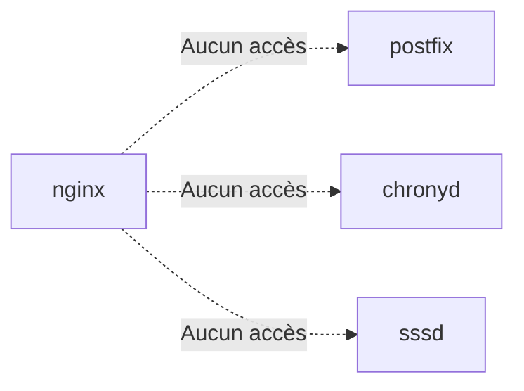

Cette séparation limite fortement l'impact d'une compromission.

Nous approfondirons cette architecture lorsque nous étudierons les utilisateurs système.

---
# 💎 Le point d'expertise

## Les privilèges sont vérifiés à chaque appel système

Une idée reçue consiste à penser que Linux vérifie les privilèges uniquement lors de la connexion de l'utilisateur.

En réalité,

le noyau effectue cette vérification **des milliers de fois par seconde**.

À chaque fois qu'un processus souhaite :

- ouvrir un fichier ;
- créer un répertoire ;
- écouter sur un port ;
- envoyer un signal à un autre processus ;
- modifier une configuration ;

il effectue un **appel système** (*system call*).

Le noyau contrôle alors immédiatement si cette opération est autorisée.

Le fonctionnement est donc plus proche de ceci.

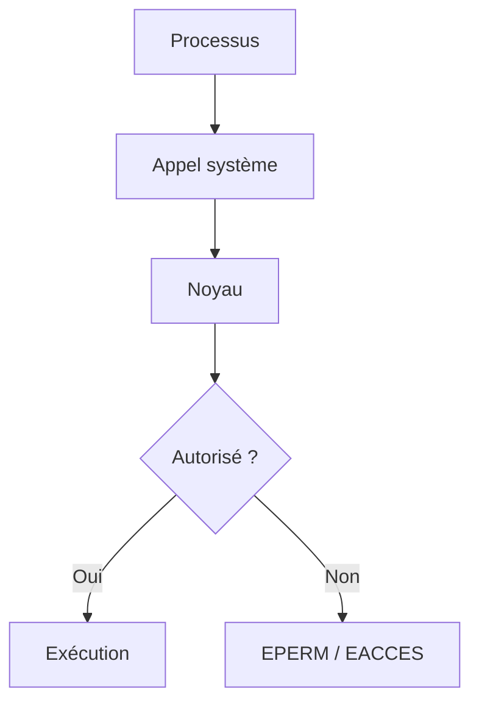

Le noyau ne "fait pas confiance" aux applications.

Il vérifie systématiquement leurs droits.

---

## Root n'est pas magique

Beaucoup de débutants imaginent que root est un utilisateur "spécial".

En réalité,

pour le noyau,

root est simplement l'utilisateur dont :

```text
UID = 0
```

Lorsqu'un appel système est reçu,

le noyau regarde notamment l'identité du processus.

Schématiquement.

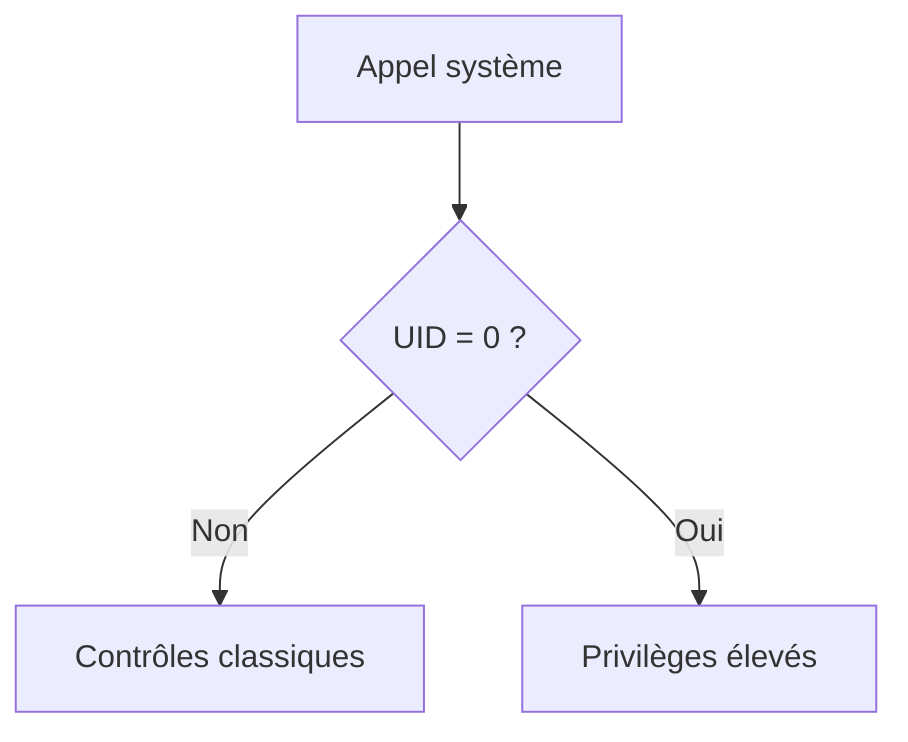

Cette vision est importante.

Linux ne connaît pas "Monsieur Root".

Il connaît un identifiant numérique.

Nous verrons plus tard que certains mécanismes (comme les *Linux Capabilities*) permettent justement de découper une partie des privilèges traditionnellement accordés à UID 0.

---

## Les processus sont les véritables acteurs

Un utilisateur n'effectue jamais directement une action sur le système.

Il lance toujours un programme.

Prenons un exemple.

Vous tapez :

```bash
cat /etc/passwd
```

En réalité,

la séquence ressemble davantage à ceci.

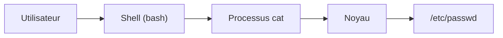

Ce n'est donc jamais l'utilisateur qui ouvre directement le fichier.

C'est le processus `cat`.

Le noyau vérifie alors les droits de ce processus.

Cette distinction est fondamentale pour comprendre le fonctionnement de Linux.

---

# 🧠 Comment pense un architecte ?

Un architecte ne se demande jamais :

> « Qui utilise ce serveur ? »

Il se demande :

> **« Quels privilèges sont réellement nécessaires ? »**

Prenons un exemple.

Notre application Sentinel doit :

- écouter sur un port ;
- lire un fichier de configuration ;
- écrire des journaux.

A-t-elle besoin de :

- modifier `/etc/shadow` ?
- créer des utilisateurs ?
- installer des RPM ?
- arrêter le système ?

Bien sûr que non.

Un architecte cherche donc systématiquement à réduire les privilèges.

Cette réflexion aboutit naturellement au principe suivant.

> **Least Privilege** (*Principe du moindre privilège*)

Nous consacrerons plusieurs chapitres à son application concrète.

---

## Penser en cas de compromission

Une autre manière de raisonner consiste à imaginer que l'application est déjà compromise.

Supposons que Sentinel contienne une vulnérabilité.

L'attaquant pourra uniquement faire ce que Sentinel est autorisé à faire.

Deux possibilités existent.

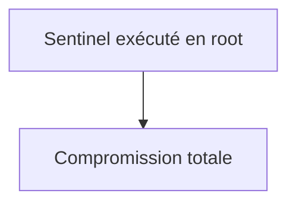

Ou bien.

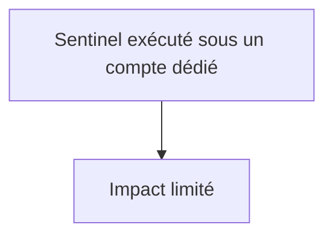

Toute l'architecture de sécurité moderne repose sur cette idée.

On ne cherche pas seulement à empêcher les attaques.

On cherche également à limiter leurs conséquences.

---

# ⚔️ Comment pense un attaquant ?

Lorsqu'un attaquant obtient l'exécution d'un programme,

sa première question est généralement :

> **Sous quel utilisateur fonctionne ce programme ?**

Pourquoi ?

Parce que cette information détermine immédiatement ce qu'il pourra faire.

Par exemple.

```text
www-data

↓

Lecture des fichiers Web
```

est beaucoup moins intéressant que :

```text
root

↓

Contrôle complet du système
```

C'est pourquoi les attaquants recherchent ensuite ce que l'on appelle une **élévation de privilèges** (*Privilege Escalation*).

Leur objectif est simple.

```text
Compte limité

↓

Exploiter une faiblesse

↓

Obtenir root
```

Toute la conception des systèmes Linux vise précisément à rendre cette transition la plus difficile possible.

---

# 🏢 En entreprise

Dans une infrastructure professionnelle,

les applications ne sont pratiquement jamais exécutées sous root.

Chaque service possède généralement :

- son propre utilisateur ;
- son propre groupe ;
- son propre répertoire ;
- ses propres permissions.

On retrouve ainsi des comptes comme :

- `nginx`
- `postgres`
- `chrony`
- `sssd`
- `named`

Cette séparation présente un avantage majeur.

Si un service est compromis,

les autres continuent à être protégés.

L'isolation des privilèges constitue ainsi l'un des fondements de la sécurité des systèmes Linux modernes.

---
# 📚 Culture technique

## Pourquoi Linux préfère plusieurs utilisateurs plutôt qu'un seul administrateur

Sur certains anciens systèmes,

tout le monde utilisait le même compte administrateur.

Cette approche présentait plusieurs inconvénients.

- impossible de savoir qui avait effectué une action ;
- impossibilité de limiter les droits d'un utilisateur ;
- risque élevé d'erreur ;
- aucune responsabilité individuelle.

Linux adopte une philosophie différente.

Chaque personne possède son propre compte.

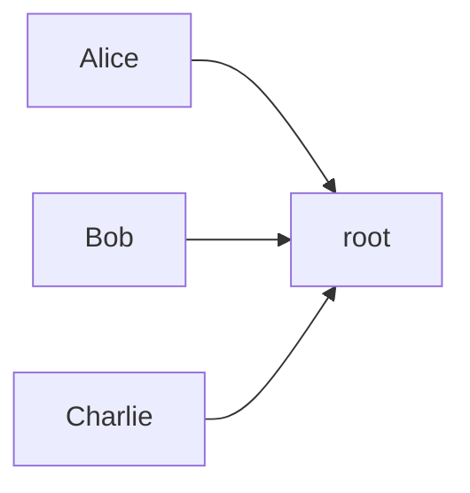

En réalité,

nous verrons bientôt que même cette représentation est simplifiée.

En pratique,

les administrateurs ne deviennent root que ponctuellement via `sudo`.

Chaque action reste ainsi attribuable à un utilisateur précis.

---

## Pourquoi ne pas toujours utiliser sudo ?

Une question revient souvent.

> *Si sudo est recommandé, pourquoi ne pas lancer toutes les commandes avec sudo ?*

Parce que `sudo` représente une **élévation temporaire de privilèges**.

Plus cette élévation dure longtemps,

plus le risque augmente.

L'idée est donc simple.

```text
Travail quotidien

↓

Utilisateur normal

↓

Commande d'administration

↓

sudo

↓

Retour immédiat
```

Cette philosophie est aujourd'hui utilisée dans pratiquement toutes les infrastructures professionnelles.

---

## Le principe du moindre privilège n'est pas réservé à Linux

Ce principe existe dans quasiment tous les systèmes modernes.

On le retrouve notamment dans :

- Windows ;
- Android ;
- iOS ;
- Kubernetes ;
- Docker ;
- Podman ;
- les bases de données ;
- les API.

Autrement dit,

ce que nous apprenons ici dépasse largement le cadre de Linux.

C'est un principe universel de cybersécurité.

---

## Root n'est pas invincible

Une autre idée reçue consiste à croire que root peut absolument tout faire.

En pratique,

certaines protections continuent de s'appliquer.

Par exemple :

- certaines politiques SELinux ;
- certains mécanismes matériels ;
- certaines protections du noyau.

Nous verrons notamment que SELinux peut empêcher root d'effectuer certaines opérations.

Cette idée surprend souvent les administrateurs débutants.

Pourtant,

elle constitue l'un des mécanismes les plus puissants de Linux moderne.

---

# ⚠️ Piège classique

## Exécuter une application en root "par simplicité"

Imaginons un développeur.

Son application rencontre une erreur d'autorisation.

La solution la plus simple semble être :

```bash
sudo mon_application
```

L'erreur disparaît.

Mais un nouveau problème apparaît.

Toute vulnérabilité de cette application dispose désormais des privilèges root.

Cette pratique est extrêmement dangereuse.

La bonne approche consiste toujours à comprendre :

> **Pourquoi cette permission est-elle refusée ?**

puis à corriger précisément ce problème,

plutôt qu'à donner tous les privilèges.

---

## Partager le compte root

Autre mauvaise pratique.

Toute une équipe utilise le même mot de passe root.

Les conséquences sont nombreuses.

- impossible de savoir qui a réalisé une action ;
- impossibilité de révoquer un seul administrateur ;
- obligation de changer le mot de passe pour toute l'équipe.

Les entreprises modernes privilégient :

- des comptes nominatifs ;
- `sudo` ;
- une journalisation complète.

---

# Laboratoire AlmaLinux

## Objectif

Observer concrètement le fonctionnement des privilèges sous Linux.

---

## Étape 1 — Identifier votre utilisateur

Afficher votre identité.

```bash
whoami
```

Puis.

```bash
id
```

Observer :

- votre UID ;
- votre GID ;
- les groupes auxquels vous appartenez.

Conserver ces informations,

nous les réutiliserons dans le prochain chapitre.

---

## Étape 2 — Tester une opération interdite

Essayer d'afficher le contenu de :

```bash
cat /etc/shadow
```

Observer le résultat.

Comprendre que le noyau refuse cette opération.

---

## Étape 3 — Réaliser la même opération avec sudo

Exécuter maintenant.

```bash
sudo cat /etc/shadow
```

Comparer les deux comportements.

Identifier précisément ce qui a changé.

---

## Étape 4 — Observer les processus

Ouvrir un second terminal.

Dans le premier.

```bash
sleep 300
```

Dans le second.

```bash
ps -ef
```

Repérer le processus `sleep`.

Identifier :

- son propriétaire ;
- son PID.

Comprendre que chaque processus possède une identité propre.

---

# Mission d'ingénieur

Votre équipe développe un nouveau service destiné à remplacer Sentinel.

Un développeur propose de lancer le service directement sous le compte root afin d'éviter les problèmes de permissions.

Votre responsable sécurité vous demande de rédiger un avis technique.

Votre réponse devra expliquer :

- pourquoi cette approche est dangereuse ;
- quels risques elle introduit ;
- comment appliquer le principe du moindre privilège ;
- comment concevoir un compte de service dédié.

Vous devrez également proposer une architecture permettant de limiter les conséquences d'une compromission de l'application.

---

# Impact sur Sentinel

Nous savons désormais qu'une application ne doit jamais disposer de plus de privilèges que nécessaire.

Cette idée influencera toutes les décisions prises dans la suite du livre.

Notre futur service Sentinel :

- n'utilisera pas le compte root ;
- possédera sa propre identité ;
- disposera uniquement des permissions indispensables ;
- sera isolé des autres services.

Cette philosophie sera renforcée par :

- les utilisateurs système ;
- les permissions Linux ;
- SELinux ;
- les Linux Capabilities.

---

# Ce qu'il faut retenir

- Les privilèges sont contrôlés par le noyau à chaque appel système.
- Root correspond à l'utilisateur possédant l'UID 0.
- Les processus héritent généralement des privilèges de leur utilisateur.
- Le principe du moindre privilège limite les conséquences d'une erreur ou d'une compromission.
- Les services doivent être exécutés sous des comptes dédiés plutôt que sous root.
- `sudo` permet une élévation temporaire des privilèges et constitue la méthode d'administration recommandée.
- Une bonne gestion des privilèges protège autant contre les attaques que contre les erreurs humaines.

---
# Grande infographie de révision du chapitre

```text
┌──────────────────────────────────────────────────────────────────────────────────────────────┐
│               CHAPITRE 1.3 — COMPRENDRE LES PRIVILÈGES SOUS LINUX                             │
├──────────────────────────────────────────────────────────────────────────────────────────────┤
│                                                                                              │
│                     COMMENT LINUX DÉCIDE-T-IL ?                                               │
│                                                                                              │
│      Utilisateur                                                                             │
│            │                                                                                 │
│            ▼                                                                                 │
│      Processus                                                                               │
│            │                                                                                 │
│            ▼                                                                                 │
│      Appel système                                                                           │
│            │                                                                                 │
│            ▼                                                                                 │
│      Noyau Linux                                                                             │
│            │                                                                                 │
│      ┌─────┴────────────┐                                                                    │
│      ▼                  ▼                                                                    │
│ Autorisé          Permission refusée                                                        │
│                                                                                              │
├──────────────────────────────────────────────────────────────────────────────────────────────┤
│                           LES IDENTITÉS                                                      │
│                                                                                              │
│ UID 0        → root                                                                          │
│ UID ≥ 1000  → Utilisateurs                                                                  │
│ UID système → Services Linux                                                                │
│                                                                                              │
│ Exemple :                                                                                    │
│                                                                                              │
│ root                                                                                         │
│ tom                                                                                          │
│ nginx                                                                                        │
│ postgres                                                                                     │
│ chrony                                                                                       │
│ sssd                                                                                         │
│                                                                                              │
├──────────────────────────────────────────────────────────────────────────────────────────────┤
│                       HÉRITAGE DES PRIVILÈGES                                                 │
│                                                                                              │
│ Utilisateur                                                                                  │
│      │                                                                                       │
│      ▼                                                                                       │
│ bash                                                                                         │
│      │                                                                                       │
│      ▼                                                                                       │
│ python                                                                                       │
│      │                                                                                       │
│      ▼                                                                                       │
│ Sentinel                                                                                     │
│                                                                                              │
│ Les processus héritent normalement des privilèges                                            │
│ de leur processus parent.                                                                    │
│                                                                                              │
├──────────────────────────────────────────────────────────────────────────────────────────────┤
│                      MOINDRE PRIVILÈGE                                                       │
│                                                                                              │
│ Mauvaise approche                      Bonne approche                                        │
│                                                                                              │
│ root en permanence                     Utilisateur                                           │
│        │                                      │                                              │
│        ▼                                      ▼                                              │
│ Toutes les commandes                  sudo uniquement                                       │
│ avec tous les droits                  lorsque nécessaire                                     │
│                                                                                              │
├──────────────────────────────────────────────────────────────────────────────────────────────┤
│                     POURQUOI DES COMPTES SYSTÈME ?                                            │
│                                                                                              │
│ nginx        → Serveur Web                                                                   │
│ postgres     → Base de données                                                               │
│ chronyd      → Synchronisation horaire                                                       │
│ sssd         → Authentification                                                              │
│                                                                                              │
│ Chaque service possède sa propre identité afin de                                            │
│ limiter les conséquences d'une compromission.                                                │
│                                                                                              │
├──────────────────────────────────────────────────────────────────────────────────────────────┤
│                         BONNES PRATIQUES                                                     │
│                                                                                              │
│ ✔ Utiliser un compte personnel                                                               │
│ ✔ Employer sudo ponctuellement                                                               │
│ ✔ Exécuter les services sous un compte dédié                                                 │
│ ✔ Limiter les privilèges au strict nécessaire                                                │
│ ✔ Journaliser les actions d'administration                                                   │
│ ✘ Ne jamais utiliser root comme compte quotidien                                             │
│ ✘ Ne jamais lancer une application en root "pour que ça marche"                              │
│ ✘ Ne jamais partager le compte root                                                          │
├──────────────────────────────────────────────────────────────────────────────────────────────┤
│                                IDÉE CLÉ                                                      │
│                                                                                              │
│ « Sous Linux, la sécurité ne repose pas sur la confiance,                                    │
│  mais sur le contrôle systématique des privilèges                                            │
│  accordés à chaque processus. »                                                              │
└──────────────────────────────────────────────────────────────────────────────────────────────┘
```

C'est précisément pour cette raison que son utilisation doit rester exceptionnelle.

---
