# Campagne 1 — Installation et fondations

# Chapitre 1.3 — Comprendre les composants d'un système Linux

> *« Avant de sécuriser un système, il faut comprendre de quoi il est constitué. On ne protège correctement que ce que l'on connaît. »*

---

# Vous êtes ici

```text
Partie I — Construire un socle sécurisé

Campagne 1 — Installation et fondations

      1.1 Pourquoi sécuriser un socle Linux ?
      1.2 Installation d'AlmaLinux Minimal
    ► 1.3 Comprendre les composants d'un système Linux
      1.4 Premier démarrage et premières vérifications
      1.5 Mise à jour et gestion des dépôts
      1.6 Architecture des systèmes de fichiers
      1.7 Utilisateurs, groupes et permissions
      1.8 sudo et principe du moindre privilège
      1.9 Première mise en sécurité du serveur
      1.10 Création du laboratoire Sentinel
```

---

# Objectifs pédagogiques

À la fin de ce chapitre, vous serez capable de :

- identifier les principaux composants d'un système Linux ;
- comprendre leur rôle respectif ;
- distinguer le noyau des programmes utilisateurs ;
- comprendre le rôle de systemd, du shell et des bibliothèques ;
- visualiser comment une commande est réellement exécutée.

---

# Pourquoi ce chapitre existe

Lorsque l'on utilise Linux pour la première fois,

on voit simplement un terminal.

On tape une commande.

```bash
ls
```

Puis le système répond.

Tout paraît simple.

Pourtant,

entre le moment où vous appuyez sur **Entrée**

et celui où le résultat apparaît,

plusieurs dizaines de composants collaborent.

Comprendre cette architecture est indispensable.

En effet,

la sécurité ne consiste pas à protéger un unique programme.

Elle consiste à protéger **l'ensemble des composants qui coopèrent**.

---

# Une vision globale

Avant d'étudier chaque élément,

observons le système dans son ensemble.

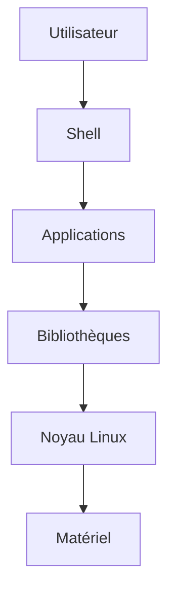

Chaque couche possède une responsabilité bien définie.

Une défaillance dans une couche peut avoir des conséquences sur toutes les suivantes.

---

# Le noyau Linux

Le noyau,

appelé également **Kernel**,

constitue le cœur du système.

Il est chargé de :

- gérer la mémoire ;
- gérer les processus ;
- gérer les périphériques ;
- gérer le réseau ;
- contrôler les permissions ;
- communiquer avec le matériel.

Toutes les applications passent obligatoirement par lui.

Sans noyau,

Linux ne fonctionne tout simplement pas.

---

# Le noyau est un arbitre

Le noyau ne réalise pas seulement des tâches techniques.

Il prend également toutes les décisions importantes.

Par exemple.

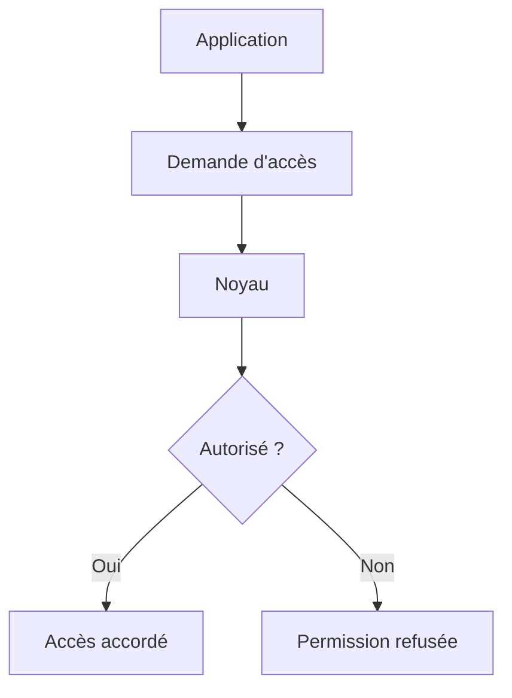

Le noyau est donc l'un des premiers acteurs de la sécurité.

---

# Les applications

Au-dessus du noyau,

on trouve les programmes utilisés quotidiennement.

Par exemple.

- bash
- vim
- ssh
- systemctl
- python
- podman
- rpm
- dnf

Ces programmes sont appelés :

> **Applications utilisateur** (*User Space*).

Contrairement au noyau,

ils ne disposent pas d'un accès direct au matériel.

Ils doivent toujours demander l'autorisation au noyau.

---

# Les bibliothèques

Beaucoup d'applications utilisent les mêmes fonctionnalités.

Par exemple.

- ouvrir un fichier ;
- établir une connexion réseau ;
- afficher du texte ;
- manipuler des chaînes de caractères.

Plutôt que de réécrire ce code dans chaque programme,

Linux utilise des bibliothèques partagées.

Visualisons.

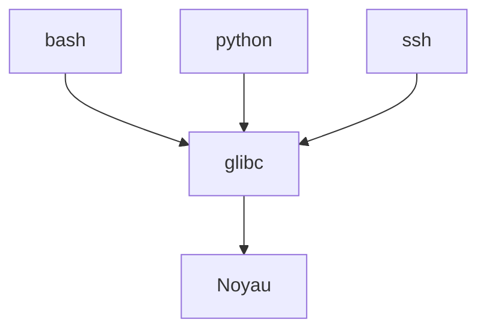

L'une des plus importantes est :

```text
glibc
```

Elle constitue l'interface entre les applications et le noyau.

---

# Le shell

Lorsque vous ouvrez un terminal,

vous ne communiquez pas directement avec Linux.

Vous dialoguez avec un programme appelé :

```text
Shell
```

Le plus courant sur AlmaLinux est :

```text
bash
```

Son rôle est simple.

- lire les commandes ;
- les interpréter ;
- lancer les programmes correspondants.

Schématiquement.

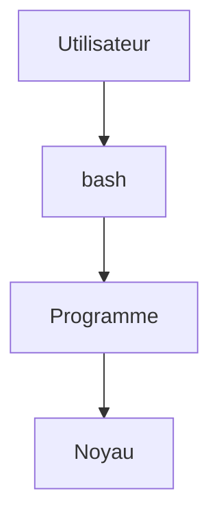

Le shell n'est donc pas le système d'exploitation.

Il constitue simplement votre interface avec celui-ci.

---
# L'espace utilisateur (*User Space*)

Il est important de distinguer deux mondes.

Le premier est :

```text
Kernel Space
```

Le second est :

```text
User Space
```

Visualisons cette séparation.

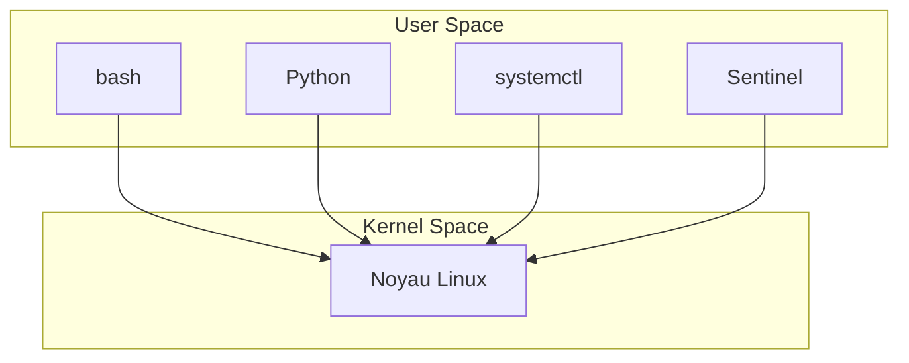

Cette séparation est fondamentale.

Une application classique ne peut pas :

- accéder directement à la mémoire du noyau ;
- piloter directement un périphérique ;
- modifier les tables réseau ;
- gérer les processus.

Elle doit systématiquement passer par le noyau.

Cette isolation constitue l'un des premiers mécanismes de sécurité de Linux.

---

# Les appels système

Comment une application communique-t-elle avec le noyau ?

Grâce aux **appels système** (*System Calls*).

Prenons un exemple.

Votre programme souhaite lire un fichier.

Il ne lit pas directement le disque.

Il demande au noyau.

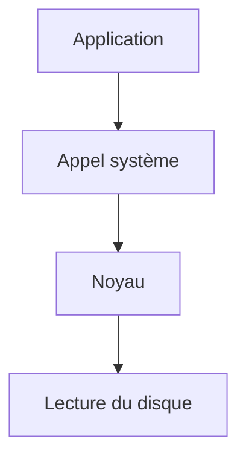

Le noyau décide alors :

- si l'accès est autorisé ;
- où se trouve le fichier ;
- comment communiquer avec le disque.

Toutes les applications Linux fonctionnent selon ce principe.

---

# systemd

Lorsque le serveur démarre,

une question se pose.

> **Qui lance tous les services ?**

La réponse est :

```text
systemd
```

C'est le premier processus utilisateur lancé après le noyau.

Son identifiant est toujours :

```text
PID 1
```

Visualisons.

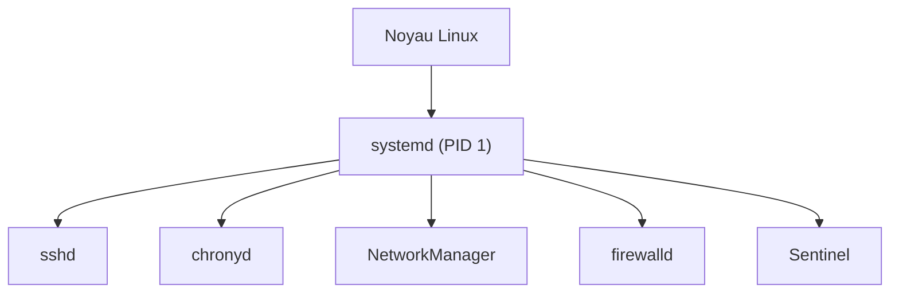

Pratiquement tous les services que nous utiliserons seront démarrés par **systemd**.

Nous lui consacrerons une campagne entière.

---

# Les processus

Chaque programme exécuté devient un **processus**.

Par exemple.

Vous lancez :

```bash
vim fichier.txt
```

Linux crée un nouveau processus.

Visualisons.

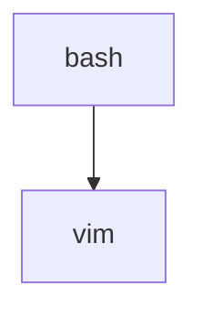

Si vous lancez ensuite :

```bash
python sentinel.py
```

Un second processus apparaît.

Chaque processus possède notamment :

- un PID ;
- un propriétaire ;
- une mémoire ;
- des fichiers ouverts ;
- des privilèges.

Nous apprendrons à les observer avec :

```bash
ps
```

```bash
top
```

```bash
htop
```

---

# Les services

Tous les programmes ne sont pas destinés à être utilisés directement par un utilisateur.

Beaucoup fonctionnent en arrière-plan.

On les appelle :

> **Services** (*Daemons*)

Quelques exemples.

- sshd
- chronyd
- firewalld
- rsyslog
- podman
- sssd

Visualisons.

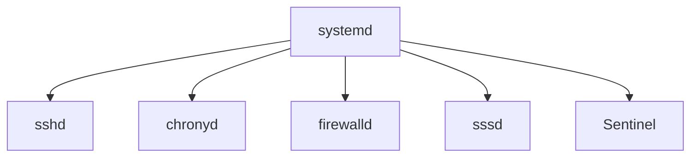

Contrairement à un programme lancé dans un terminal,

un service reste actif en permanence.

Il attend qu'un événement se produise.

Par exemple.

- une connexion SSH ;
- une requête HTTP ;
- une demande DNS.

---

# Les modules du noyau

Le noyau Linux est capable de charger des fonctionnalités supplémentaires.

Ces composants sont appelés :

> **Modules du noyau**

Ils permettent notamment de gérer :

- des cartes réseau ;
- des pilotes de stockage ;
- des systèmes de fichiers ;
- certaines fonctions de sécurité.

Visualisons.

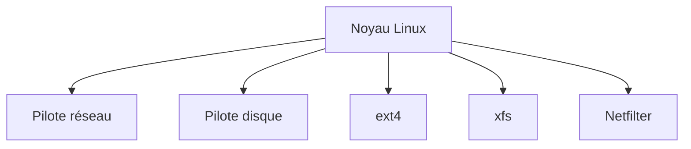

L'avantage est simple.

Le noyau ne charge que ce dont il a réellement besoin.

Cette architecture améliore :

- les performances ;
- la modularité ;
- la maintenance.

---

# Pourquoi cette architecture est-elle importante ?

Prenons Sentinel.

Notre application ne communiquera jamais directement avec le matériel.

Elle dialoguera avec le noyau.

Le noyau dialoguera avec les pilotes.

Les pilotes dialogueront avec le matériel.

Visualisons.

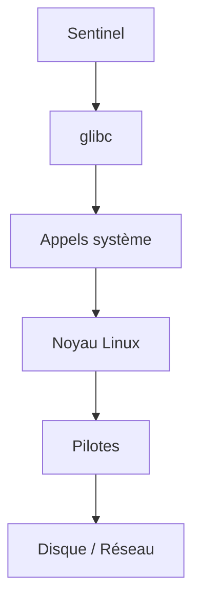

Cette architecture explique pourquoi la sécurité d'une application dépend autant :

- de ses propres permissions ;
- du noyau ;
- des services système ;
- de la configuration de Linux.

---
# 💎 Le point d'expertise

## Tous les composants n'ont pas le même niveau de privilège

L'architecture que nous venons d'étudier n'est pas seulement une organisation logicielle.

Elle constitue également une séparation de privilèges.

Visualisons.

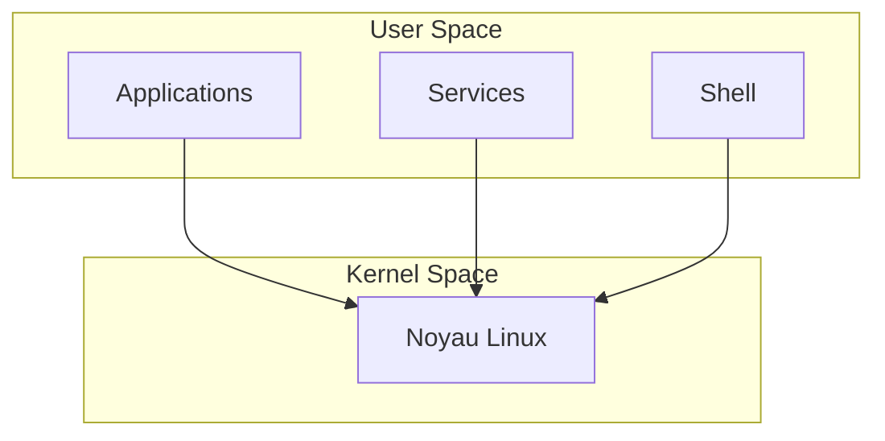

Les applications évoluent dans un environnement fortement limité.

Elles ne peuvent pas :

- accéder directement au matériel ;
- modifier la mémoire du noyau ;
- créer arbitrairement des processus privilégiés ;
- contourner les permissions.

Cette séparation limite fortement l'impact d'une vulnérabilité.

---

## Pourquoi le noyau est-il si critique ?

Si une application se bloque,

le reste du système continue généralement de fonctionner.

En revanche,

si le noyau rencontre une erreur critique,

tout le système peut s'arrêter.

C'est pourquoi le noyau est l'un des composants :

- les plus robustes ;
- les plus testés ;
- les plus protégés.

Une très grande partie des mécanismes de sécurité étudiés dans cette formation s'appuient directement sur lui.

Par exemple.

- les permissions ;
- les utilisateurs ;
- les groupes ;
- les capacités Linux ;
- SELinux ;
- Netfilter ;
- les espaces de noms (*Namespaces*).

---

## Les applications ne parlent jamais directement au matériel

Prenons un exemple.

Sentinel souhaite écrire un journal.

Ce qui semble être une simple écriture correspond en réalité à une longue chaîne d'opérations.

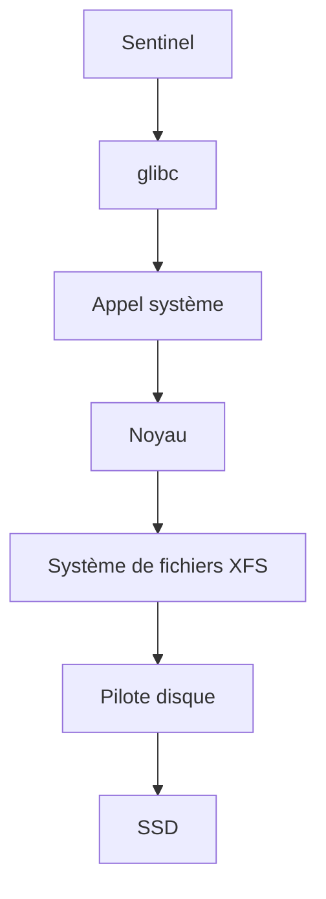

Cette architecture permet :

- de vérifier les permissions ;
- de gérer les erreurs ;
- d'assurer l'intégrité des données ;
- d'isoler les applications.

---

## Pourquoi systemd est-il si important ?

Dans les systèmes Linux modernes,

presque tous les services sont contrôlés par :

```text
systemd
```

Il ne sert pas uniquement à démarrer les programmes.

Il gère également :

- leur redémarrage automatique ;
- leur journalisation ;
- leurs dépendances ;
- leurs limites de ressources ;
- leur utilisateur d'exécution ;
- leur environnement.

Autrement dit,

systemd est aujourd'hui l'orchestrateur du système.

Nous construirons progressivement notre service Sentinel autour de lui.

---

# 🧠 Comment pense un architecte ?

Lorsqu'un architecte conçoit une application,

il ne réfléchit pas uniquement à son code.

Il réfléchit également à son intégration dans le système.

Prenons Sentinel.

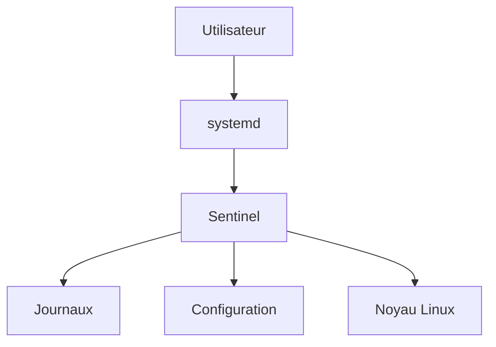

Cette vision permet de répondre très tôt à plusieurs questions.

- Comment l'application sera-t-elle lancée ?
- Où lira-t-elle sa configuration ?
- Où écrira-t-elle ses journaux ?
- Sous quel utilisateur fonctionnera-t-elle ?
- Comment sera-t-elle arrêtée ?
- Comment sera-t-elle supervisée ?

Toutes ces décisions sont prises avant même d'écrire la première ligne de code.

---

## Une application n'est qu'un composant parmi d'autres

Une erreur fréquente consiste à considérer son application comme le centre du système.

En réalité,

une application Linux professionnelle doit coopérer avec :

- systemd ;
- le noyau ;
- SELinux ;
- le pare-feu ;
- le système de journalisation ;
- le gestionnaire de paquets ;
- l'annuaire d'entreprise.

Plus une application respecte ces composants,

plus elle sera simple à maintenir et à industrialiser.

---

# ⚔️ Comment pense un attaquant ?

Lorsqu'un attaquant découvre un serveur,

il cherche rapidement à comprendre son architecture.

Par exemple.

- Quels services sont actifs ?
- Quels processus tournent ?
- Quel système d'initialisation est utilisé ?
- Quels composants disposent des privilèges les plus élevés ?

Cette cartographie lui permet d'identifier les cibles les plus intéressantes.

Le défenseur adopte finalement la même démarche,

mais dans un objectif opposé :

> **comprendre le système pour mieux le protéger.**

---

# 🏢 En entreprise

Dans une entreprise,

un administrateur ne connaît pas nécessairement le code source de toutes les applications.

En revanche,

il connaît parfaitement leur intégration dans le système.

Par exemple,

il sait :

- quel service les démarre ;
- quel utilisateur les exécute ;
- quels ports elles utilisent ;
- où elles stockent leurs données ;
- où consulter leurs journaux ;
- comment les superviser.

C'est exactement cette approche que nous adopterons avec Sentinel.

Notre objectif n'est pas simplement de développer une application,

mais de construire un véritable **service Linux**, conforme aux standards des environnements professionnels.

---
# 📚 Culture technique

## Pourquoi Linux est-il composé de nombreux petits programmes ?

Contrairement à d'autres systèmes d'exploitation,

Linux suit historiquement une philosophie très simple.

> **Chaque programme doit faire une seule chose, mais la faire parfaitement.**

Cette idée provient directement des premiers systèmes Unix.

Prenons un exemple.

```bash
cat journal.log | grep ERROR | sort | uniq
```

Ici,

quatre programmes collaborent.

| Programme | Rôle |
|-----------|------|
| `cat` | Lire un fichier |
| `grep` | Filtrer les lignes |
| `sort` | Trier |
| `uniq` | Supprimer les doublons |

Aucun de ces programmes n'est complexe.

En revanche,

leur combinaison permet de résoudre des problèmes très élaborés.

Cette philosophie explique en grande partie la puissance de Linux.

---

## Pourquoi parle-t-on de "distribution Linux" ?

Une question revient souvent.

> Linux est-il le système d'exploitation ?

Pas exactement.

Le mot **Linux** désigne uniquement :

```text
Le noyau
```

Une distribution ajoute autour du noyau :

- systemd ;
- bash ;
- glibc ;
- dnf ;
- rpm ;
- OpenSSH ;
- les bibliothèques ;
- les outils d'administration.

Visualisons.

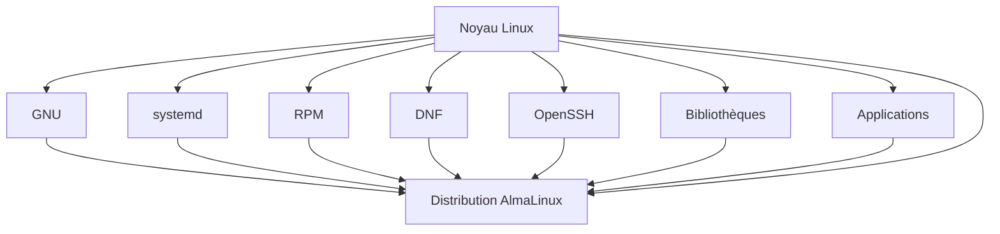

Autrement dit,

**AlmaLinux n'est pas seulement Linux.**

C'est un ensemble cohérent de plusieurs centaines de composants soigneusement intégrés.

---

## Pourquoi systemd possède-t-il toujours le PID 1 ?

Lorsque le noyau termine son initialisation,

il doit lancer un premier processus.

Ce processus devient automatiquement :

```text
PID 1
```

Sous AlmaLinux,

il s'agit de :

```text
systemd
```

Tous les autres processus descendent ensuite de lui.

Visualisons.

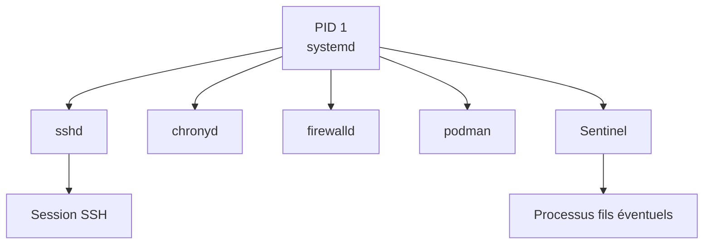

Cette position particulière explique pourquoi systemd joue un rôle central dans l'administration du système.

---

## Pourquoi les bibliothèques sont-elles partagées ?

Imaginons mille applications utilisant les mêmes fonctions réseau.

Sans bibliothèques partagées,

chacune embarquerait sa propre copie.

Conséquences.

- davantage d'espace disque ;
- davantage de mémoire utilisée ;
- davantage de mises à jour.

Grâce aux bibliothèques partagées,

une seule copie est utilisée par toutes les applications.

Cette approche améliore :

- les performances ;
- la maintenance ;
- la sécurité,

puisqu'une seule mise à jour peut corriger plusieurs centaines de programmes.

---

# ⚠️ Piège classique

## Confondre Linux avec Bash

De nombreux débutants pensent que :

```text
Terminal

=

Linux
```

En réalité,

le terminal exécute généralement :

```text
bash
```

qui est simplement un programme.

Vous pouvez parfaitement remplacer bash par :

- zsh ;
- fish ;
- dash ;
- tcsh.

Le noyau Linux continue pourtant de fonctionner exactement de la même manière.

Le shell est donc une interface,

pas le système d'exploitation.

---

## Penser que systemd est le noyau

Autre confusion très fréquente.

On lit parfois :

> « systemd gère Linux. »

En réalité,

systemd reste une application.

Elle possède certes un rôle particulier (PID 1),

mais elle s'exécute **au-dessus du noyau**.

Le noyau pourrait fonctionner avec un autre système d'initialisation.

Historiquement,

on trouvait par exemple :

- SysVinit ;
- Upstart ;
- OpenRC.

Aujourd'hui,

systemd est devenu la référence sur la majorité des distributions professionnelles.

---

# Laboratoire AlmaLinux

## Objectif

Découvrir les principaux composants d'un système Linux en les observant directement.

---

## Étape 1 — Identifier le noyau

Afficher.

```bash
uname -r
```

Puis.

```bash
uname -a
```

Identifier :

- la version du noyau ;
- l'architecture ;
- le nom de la machine.

---

## Étape 2 — Identifier le processus PID 1

Exécuter.

```bash
ps -p 1 -f
```

Vérifier que le processus numéro 1 est bien :

```text
systemd
```

---

## Étape 3 — Observer l'arbre des processus

Installer si nécessaire.

```bash
sudo dnf install psmisc
```

Puis.

```bash
pstree
```

Observer comment tous les services sont rattachés à systemd.

---

## Étape 4 — Identifier votre shell

Afficher.

```bash
echo $SHELL
```

Puis.

```bash
ps
```

Observer que le shell est simplement un processus parmi les autres.

---

## Étape 5 — Observer les bibliothèques utilisées

Choisir un programme.

```bash
which ls
```

Puis.

```bash
ldd /usr/bin/ls
```

Observer le nombre de bibliothèques partagées utilisées.

Vous découvrirez qu'une simple commande dépend déjà de nombreux composants du système.

---

# Mission d'ingénieur

Vous devez présenter Linux à une nouvelle équipe de développeurs qui n'a jamais travaillé sur un système Unix.

Votre objectif est de leur expliquer :

- le rôle du noyau ;
- le rôle de systemd ;
- la différence entre Kernel Space et User Space ;
- le rôle du shell ;
- pourquoi les applications utilisent des bibliothèques partagées ;
- pourquoi Sentinel devra s'intégrer à cette architecture plutôt que chercher à la contourner.

Votre présentation devra être suffisamment claire pour que les développeurs comprennent **où leur application s'insère dans l'ensemble du système**.

---

# Ce qu'il faut retenir

- Linux est composé de nombreux composants spécialisés qui coopèrent entre eux.
- Le **noyau** est le cœur du système et arbitre tous les accès.
- Les applications évoluent en **User Space** et communiquent avec le noyau grâce aux appels système.
- **systemd** est le premier processus utilisateur (PID 1) et orchestre les services.
- Le **shell** est une interface entre l'utilisateur et le système, et non le système lui-même.
- Comprendre cette architecture est indispensable pour développer, sécuriser et administrer correctement une application comme Sentinel.

---
# Grande infographie de révision du chapitre

```text
┌──────────────────────────────────────────────────────────────────────────────────────────────┐
│          CHAPITRE 1.3 — COMPRENDRE LES COMPOSANTS D'UN SYSTÈME LINUX                         │
├──────────────────────────────────────────────────────────────────────────────────────────────┤
│                                                                                              │
│                          ARCHITECTURE GLOBALE                                                 │
│                                                                                              │
│ Utilisateur                                                                                  │
│      │                                                                                       │
│      ▼                                                                                       │
│ Shell (bash)                                                                                 │
│      │                                                                                       │
│      ▼                                                                                       │
│ Applications                                                                                 │
│      │                                                                                       │
│      ▼                                                                                       │
│ Bibliothèques (glibc...)                                                                     │
│      │                                                                                       │
│      ▼                                                                                       │
│ Noyau Linux                                                                                  │
│      │                                                                                       │
│      ▼                                                                                       │
│ Matériel                                                                                     │
│                                                                                              │
├──────────────────────────────────────────────────────────────────────────────────────────────┤
│                         USER SPACE / KERNEL SPACE                                             │
│                                                                                              │
│ User Space                        Kernel Space                                               │
│                                                                                              │
│ bash                              Noyau Linux                                                │
│ python                            Gestion mémoire                                            │
│ Sentinel                          Gestion réseau                                             │
│ ssh                               Permissions                                                │
│ vim                               Processus                                                  │
│                                                                                              │
│ Toute communication passe obligatoirement par le noyau.                                      │
│                                                                                              │
├──────────────────────────────────────────────────────────────────────────────────────────────┤
│                           LE NOYAU GÈRE                                                      │
│                                                                                              │
│ ✔ Processus                                                                                  │
│ ✔ Mémoire                                                                                    │
│ ✔ Réseau                                                                                     │
│ ✔ Permissions                                                                                │
│ ✔ Utilisateurs                                                                               │
│ ✔ Pilotes                                                                                    │
│ ✔ Systèmes de fichiers                                                                       │
│                                                                                              │
├──────────────────────────────────────────────────────────────────────────────────────────────┤
│                              SYSTEMD                                                         │
│                                                                                              │
│ PID 1                                                                                        │
│      │                                                                                       │
│      ├── sshd                                                                                │
│      ├── chronyd                                                                             │
│      ├── firewalld                                                                           │
│      ├── rsyslog                                                                             │
│      ├── podman                                                                              │
│      └── Sentinel                                                                            │
│                                                                                              │
├──────────────────────────────────────────────────────────────────────────────────────────────┤
│                          UNE COMMANDE LINUX                                                   │
│                                                                                              │
│ Utilisateur                                                                                  │
│      │                                                                                       │
│      ▼                                                                                       │
│ bash                                                                                         │
│      │                                                                                       │
│      ▼                                                                                       │
│ Programme                                                                                    │
│      │                                                                                       │
│      ▼                                                                                       │
│ Bibliothèque                                                                                 │
│      │                                                                                       │
│      ▼                                                                                       │
│ Appel système                                                                                │
│      │                                                                                       │
│      ▼                                                                                       │
│ Noyau Linux                                                                                  │
│                                                                                              │
├──────────────────────────────────────────────────────────────────────────────────────────────┤
│                           COMPOSANTS MAJEURS                                                  │
│                                                                                              │
│ Kernel          → Gère le système                                                            │
│ systemd         → Lance les services                                                         │
│ Shell           → Interface utilisateur                                                      │
│ glibc           → Bibliothèque système                                                       │
│ RPM             → Gestion des paquets                                                        │
│ DNF             → Gestion des dépôts                                                         │
│ OpenSSH         → Accès distant                                                              │
│                                                                                              │
├──────────────────────────────────────────────────────────────────────────────────────────────┤
│                             IDÉE CLÉ                                                         │
│                                                                                              │
│ « Linux n'est pas un programme unique.                                                       │
│  C'est un ensemble de composants spécialisés                                                 │
│  qui coopèrent autour du noyau. Comprendre cette                                             │
│  architecture est indispensable pour sécuriser                                               │
│  correctement un serveur. »                                                                  │
└──────────────────────────────────────────────────────────────────────────────────────────────┘
```
