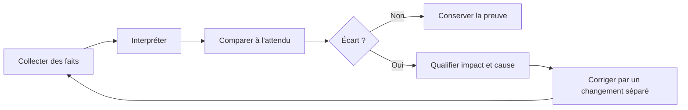
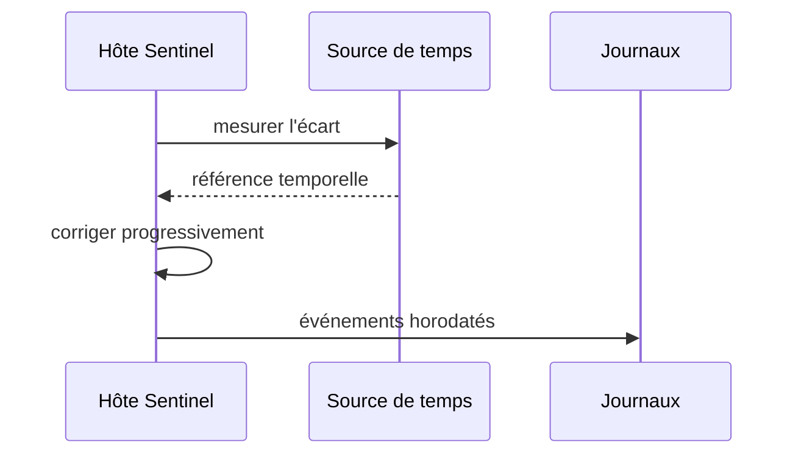

# Chapitre 1.4 — Établir la baseline du serveur

> **Campagne 1 — Installation et fondations**

> *« Une modification n'est maîtrisée que si l'état précédent était connu. »*

## Vous êtes ici

```text
PARTIE I — Construire un socle sécurisé

Campagne 1

  1.1 Pourquoi sécuriser un socle Linux ? ✔
  1.2 Installer AlmaLinux minimal ✔
  1.3 Comprendre les composants du système ✔
► 1.4 Établir la baseline du serveur
  1.5 Mettre à jour et gérer les dépôts
  1.6 Organiser les systèmes de fichiers
  1.7 Comprendre identités et permissions
  1.8 Administrer avec sudo
  1.9 Mission : mettre le serveur en sécurité
  1.10 Créer le laboratoire Sentinel
```

## Objectifs pédagogiques

À l'issue de ce chapitre, vous serez capable de :

- distinguer contrôle de réception, baseline et supervision continue ;
- inventorier identité, version, temps, réseau, stockage, ressources et services ;
- interpréter les résultats essentiels au lieu d'accumuler des sorties ;
- produire une photographie horodatée et comparable du serveur ;
- détecter et qualifier un écart avant de le corriger.

## Pourquoi ce chapitre existe

Un serveur qui démarre n'est pas nécessairement conforme. Une interface peut être inactive, l'heure décalée, un volume presque plein ou un service attendu en échec. À l'inverse, une différence n'est pas toujours une anomalie : l'adresse DHCP, l'uptime et l'usage mémoire évoluent naturellement.

La **baseline** est un ensemble limité de faits et d'attentes qui décrit l'état de référence. Elle permet de comparer avant et après une mise à jour, de transmettre le serveur à une autre équipe et de diagnostiquer une dérive. Elle ne remplace pas la supervision : elle fournit son point de départ.

## Observer avant d'agir

La réception suit un cycle simple : collecter, interpréter, comparer, décider, puis seulement modifier.



Cette séparation évite qu'une commande de diagnostic modifie silencieusement l'état à mesurer. Elle conserve aussi la preuve de l'écart initial, utile si la correction échoue.

## Identifier le système

Commencez par répondre à trois questions : quelle machine, quel système, quel noyau ?

```bash
hostnamectl
cat /etc/os-release
uname -r
uname -m
uptime
```

`hostnamectl` donne l'identité déclarée de l'hôte et plusieurs informations de contexte. `/etc/os-release` décrit la distribution en espace utilisateur. `uname -r` indique le noyau effectivement démarré. Une mise à jour peut installer un nouveau noyau sans que celui-ci soit actif avant le redémarrage ; ces informations ne sont donc pas redondantes.

Relevez seulement les champs utiles : nom statique, édition et version, architecture, version du noyau actif, type de virtualisation et date du dernier démarrage.

## Vérifier le temps

Des horloges incohérentes rendent difficiles la corrélation des journaux, l'authentification et la validation des certificats.

```bash
timedatectl
systemctl is-active chronyd
chronyc tracking
chronyc sources -v
```

Contrôlez le fuseau, l'état de synchronisation et la présence de sources utilisables. Un service `chronyd` actif ne prouve pas à lui seul que l'horloge est synchronisée. Dans un réseau isolé, la source peut être interne ; documentez-la au lieu d'ouvrir un flux arbitraire.



## Vérifier le réseau par couches

Une connectivité correcte combine interface, adresse, route, résolution de noms et accès au service visé. Testez chaque couche plutôt qu'un unique `ping`.

```bash
ip -brief link
ip -brief address
ip route
resolvectl status 2>/dev/null || cat /etc/resolv.conf
ss -lntup
```

Puis réalisez des tests adaptés au laboratoire :

```bash
ping -c 2 ADRESSE_PASSERELLE
getent hosts NOM_A_RESoudre
curl --head --max-time 10 URL_AUTORISEE
```

Remplacez les valeurs symboliques par les cibles autorisées. Une réponse ICMP ne prouve ni la résolution DNS ni l'accès HTTPS ; un échec ICMP ne prouve pas qu'un service TCP est inaccessible. `ss` montre les ports en écoute localement et leur adresse de liaison, ce qui prépare l'analyse de surface d'attaque.

## Vérifier stockage et montages

Trois vues se complètent : les périphériques, les montages et leur occupation.

```bash
lsblk -o NAME,TYPE,FSTYPE,SIZE,MOUNTPOINTS
findmnt --real
df -hT
df -ih
```

`df -hT` mesure l'espace en blocs ; `df -ih` mesure les inodes. Un système de fichiers peut refuser de nouveaux fichiers parce que l'un ou l'autre est épuisé. Vérifiez que les montages correspondent au schéma prévu et qu'aucun média d'installation ne reste monté comme dépendance.

Pour LVM, complétez si nécessaire :

```bash
sudo pvs
sudo vgs
sudo lvs
```

La baseline doit noter les volumes et points de montage structurants, pas recopier chaque pseudo-système de fichiers.

## Vérifier mémoire et charge

```bash
free -h
uptime
ps -eo pid,ppid,user,%cpu,%mem,stat,comm --sort=-%mem | head
```

Linux utilise la mémoire libre pour les caches et peut la récupérer. Interprétez donc la colonne `available` plutôt que d'alerter uniquement parce que `free` est faible. La charge moyenne doit être rapprochée du nombre de processeurs et de la durée d'observation ; une valeur isolée ne suffit pas à diagnostiquer une saturation.

Pour connaître le nombre de processeurs visibles :

```bash
nproc
lscpu | sed -n '1,20p'
```

La baseline enregistre les ressources allouées et un ordre de grandeur au repos. La supervision future collectera leur évolution.

## Vérifier services et démarrage

```bash
systemctl --failed
systemctl list-units --type=service --state=running
systemctl list-unit-files --state=enabled
systemctl get-default
journalctl -p warning..alert -b --no-pager
```

Un service actif n'est pas nécessairement activé au démarrage ; un service activé n'est pas nécessairement actif. Comparez les unités observées au profil minimal attendu. Les avertissements du journal doivent être qualifiés : certains sont informatifs dans une VM, d'autres révèlent un périphérique, un montage ou une authentification en échec.

Ne désactivez pas immédiatement un service inconnu. Identifiez son paquet, ses dépendances et son rôle :

```bash
systemctl status NOM.service --no-pager
systemctl cat NOM.service
rpm -qf "$(systemctl show -p FragmentPath --value NOM.service)"
```

## Vérifier les contrôles de socle

Sans anticiper les campagnes spécialisées, quelques états doivent être visibles dès la réception :

```bash
getenforce
sudo firewall-cmd --state
sudo firewall-cmd --get-active-zones
id
sudo -l
```

SELinux doit rester `Enforcing` sauf exigence contraire explicitement documentée. Le pare-feu actif ne prouve pas que les règles sont correctes, mais son absence constitue un écart à analyser. `id` et `sudo -l` vérifient l'identité courante et l'étendue de l'administration autorisée.

## Concevoir une baseline utile

Une bonne baseline combine faits, attentes et commandes de preuve.

| Domaine | Attendu stable | Fait variable | Preuve |
| --- | --- | --- | --- |
| identité | nom et rôle de l'hôte | uptime | `hostnamectl`, `uptime` |
| logiciel | distribution approuvée | noyau après maintenance | `/etc/os-release`, `uname -r` |
| temps | synchronisation active | source sélectionnée | `chronyc tracking` |
| réseau | interfaces et ports autorisés | adresse DHCP | `ip`, `ss` |
| stockage | montages et capacité prévue | occupation | `findmnt`, `df` |
| services | aucun échec inexpliqué | PID | `systemctl --failed` |
| sécurité | SELinux enforcing, pare-feu actif | compte connecté | `getenforce`, `firewall-cmd` |

La date, l'auteur, la version de la fiche et les écarts acceptés doivent accompagner les données. Évitez d'enregistrer des secrets, des jetons ou le contenu complet de fichiers sensibles.

### Distinguer dérive, événement et changement attendu

Une comparaison brute produit de nombreux écarts. Le PID d'un service change après redémarrage ; l'occupation de `/var/log` augmente ; une adresse DHCP peut être renouvelée. Ces variations sont des **événements normaux** si elles restent dans les limites prévues. Une nouvelle unité activée après une transaction DNF est un **changement attendu** si elle figurait dans le plan. Un port inconnu sans changement approuvé constitue une **dérive** à qualifier.

| Observation | Nature probable | Vérification suivante |
| --- | --- | --- |
| nouveau noyau installé, ancien encore actif | changement incomplet | planifier le redémarrage et son test |
| PID différent, même unité et même binaire | événement normal | vérifier état et heure du redémarrage |
| port supplémentaire après installation | effet possible du changement | relire transaction, unité et besoin réseau |
| fichier de configuration modifié sans ticket | dérive possible | propriétaire, date, historique et contenu sûr |
| espace libre en baisse continue | tendance à surveiller | localiser la croissance et la rétention |

Une baseline utile associe donc des **valeurs exactes** pour les invariants, des **plages** pour les ressources et des **règles d'évolution** pour les états dynamiques. Exiger un PID fixe serait absurde ; exiger que le processus s'exécute toujours comme `sentinel` est pertinent.

Le traitement d'une dérive doit préserver les indices. Avant de redémarrer un service ou de remplacer un fichier, collectez état, journal, métadonnées et liens avec les derniers changements. La correction immédiate peut restaurer le service tout en détruisant l'explication nécessaire pour empêcher la récidive.

Cette distinction prépare la supervision : la baseline fournit ce qui doit rester vrai, tandis que les seuils et alertes décrivent la vitesse ou l'amplitude acceptable des variations.

## TP 1 — Produire la fiche de réception

Créez un répertoire de travail hors de `/etc`, puis collectez les commandes précédentes dans un fichier horodaté. Vous pouvez utiliser `script` pour conserver une session lisible :

```bash
mkdir -p ~/sentinel-baseline
script --log-out ~/sentinel-baseline/reception.txt
```

Exécutez les contrôles, ajoutez vos interprétations, puis terminez la capture avec `exit`. Relisez le fichier et retirez toute donnée inutile ou sensible avant de le partager.

Produisez en complément un résumé de dix à quinze lignes : conforme, écarts, impact, décision et prochaine action.

## TP 2 — Comparer avant et après un changement contrôlé

Choisissez un changement réversible, par exemple la modification du message d'accueil de test dans votre répertoire personnel. Collectez avant et après : métadonnées du fichier, somme SHA-256 et date.

```bash
install -m 0644 /dev/null ~/sentinel-baseline/probe.txt
stat ~/sentinel-baseline/probe.txt
sha256sum ~/sentinel-baseline/probe.txt
printf '%s\n' 'baseline Sentinel' > ~/sentinel-baseline/probe.txt
stat ~/sentinel-baseline/probe.txt
sha256sum ~/sentinel-baseline/probe.txt
```

Expliquez quelles valeurs changent, lesquelles restent stables et pourquoi. Le but est d'apprendre la comparaison, pas de simuler artificiellement une compromission.

## Mission d'ingénieur — Accepter ou refuser le serveur

Votre équipe reçoit une VM censée être la référence Sentinel. À partir de la fiche d'installation et de vos observations, rendez une décision :

- **accepté** : conforme et prêt pour les changements suivants ;
- **accepté avec réserves** : écarts maîtrisés, responsables et échéances définis ;
- **refusé** : écart bloquant ou provenance impossible à établir.

Le rapport doit contenir les preuves, cinq contrôles prioritaires, les écarts classés par impact et les actions proposées. Il doit distinguer fait, hypothèse et décision. Une capture brute de terminal sans interprétation n'est pas un rapport d'acceptation.

## Impact sur Sentinel

La baseline décrit l'hôte avant l'installation de Sentinel. Les futurs changements pourront être reliés à une transaction DNF, une configuration, une unité ou une règle de sécurité. En cas d'incident, elle aidera à distinguer une propriété initiale d'une dérive ultérieure.

## Synthèse

- La réception vérifie un état ; la baseline le documente ; la supervision suit son évolution.
- Identité, temps, réseau, stockage, ressources, services et contrôles de sécurité forment le minimum utile.
- Une commande ne constitue une preuve que si son résultat est interprété et daté.
- Les faits stables et les valeurs naturellement variables ne se comparent pas de la même manière.
- Un écart est enregistré et qualifié avant sa correction.
- La baseline de Sentinel doit rester courte, reproductible et exempte de secrets.

## Infographie de révision

```text
IDENTITÉ ─┐
TEMPS ────┤
RÉSEAU ───┤
STOCKAGE ─┼──► COLLECTER ─► COMPARER ─► QUALIFIER ─► DÉCIDER
RESSOURCES┤          │                         │
SERVICES ─┤          └── preuve datée          └── changement séparé
SÉCURITÉ ─┘

BASELINE = faits utiles + attentes + écarts acceptés + commandes de preuve
```

## Pour aller plus loin

Conservez les pages de manuel des commandes utilisées et la fiche de construction du chapitre précédent. Une baseline automatisée viendra plus tard ; sa qualité dépendra du modèle manuel établi ici.

Chapitre suivant : maintenir le logiciel installé à travers les paquets RPM, les dépôts approuvés et les transactions DNF.

← [1.3 — Comprendre les composants du système](1.3-composants-systeme-linux.md) · [1.5 — Mettre à jour et gérer les dépôts](1.5-mise-a-jour-gestion-depots.md) →
