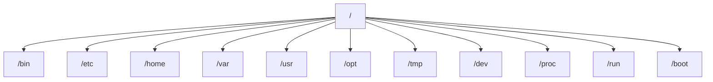
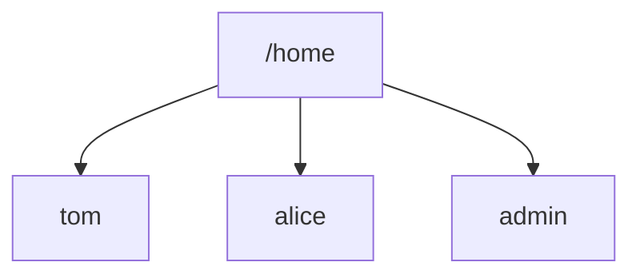
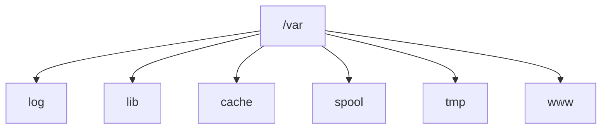
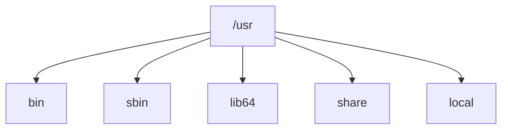
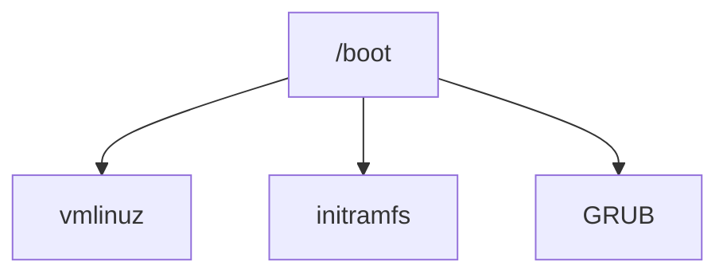
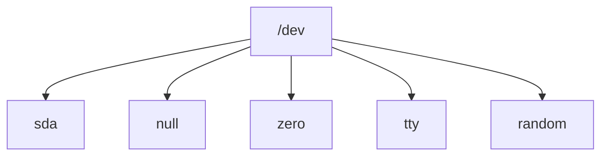
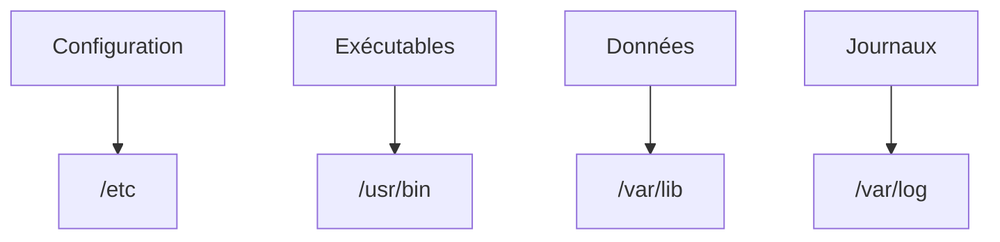
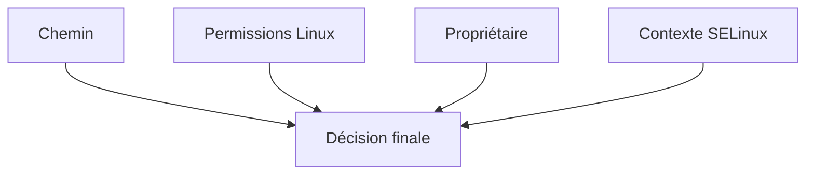
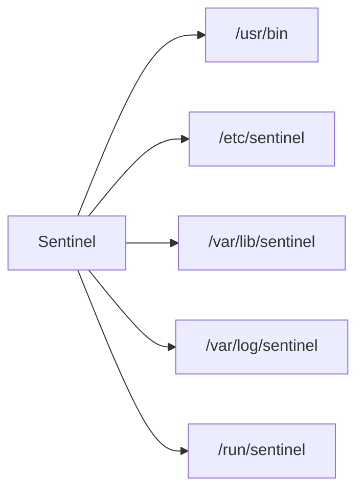
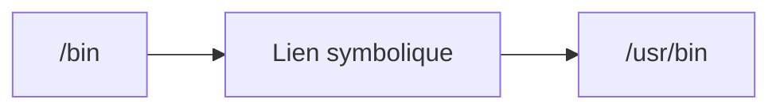

# Campagne 1 — Installation et fondations

# Chapitre 1.4 — Comprendre le système de fichiers Linux

> *« Sous Linux, pratiquement tout est représenté sous la forme d'un fichier. Comprendre l'organisation du système de fichiers revient à comprendre le système lui-même. »*

---

# Vous êtes ici

```text
Partie I — Construire un socle sécurisé

Campagne 1 — Installation et fondations

      1.1 Pourquoi sécuriser un socle Linux ?
      1.2 Installation d'AlmaLinux Minimal
      1.3 Comprendre les privilèges
    ► 1.4 Le système de fichiers
      1.5 Utilisateurs et groupes
      1.6 Permissions Linux
      1.7 sudo et moindre privilège
      1.8 Première sécurisation de Sentinel
```

---

# Objectifs pédagogiques

À la fin de ce chapitre, vous serez capable de :

- comprendre l'organisation du système de fichiers Linux ;
- distinguer les principaux répertoires système ;
- expliquer le rôle de chacun d'eux ;
- comprendre pourquoi cette organisation participe directement à la sécurité ;
- identifier les emplacements qui seront utilisés par notre application Sentinel.

---

# Pourquoi ce chapitre existe

Lorsque l'on découvre Linux,

la première surprise est souvent l'absence de lettres de lecteurs.

Sous Windows,

on retrouve généralement :

```text
C:
D:
E:
```

Sous Linux,

il n'existe qu'un seul arbre.

Tout commence ici.

```text
/
```

Ce caractère se prononce :

> **la racine** (*root filesystem*).

À partir de ce point,

tout le système est organisé de manière hiérarchique.

Comprendre cette organisation est indispensable.

Pourquoi ?

Parce que les permissions,

les utilisateurs,

SELinux,

les sauvegardes

et même les services systemd

reposent directement sur cette hiérarchie.

---

# Une vision globale

Le système de fichiers Linux ressemble à un arbre.



Chaque répertoire possède un rôle précis.

Contrairement à certaines idées reçues,

ils ne sont pas placés au hasard.

---

# Le répertoire racine

Le point de départ est :

```text
/
```

Il contient tous les autres répertoires.

Il ne faut pas le confondre avec :

```text
/root
```

qui correspond au répertoire personnel du superutilisateur.

Cette confusion est extrêmement fréquente chez les débutants.

Retenez dès maintenant.

| Répertoire | Signification |
|------------|---------------|
| `/` | Racine du système |
| `/root` | Dossier personnel de root |

Nous utiliserons très souvent ces deux chemins dans la suite de la formation.

---

# Les répertoires des utilisateurs

Les comptes classiques possèdent généralement leur répertoire ici.

```text
/home
```

Par exemple.

```text
/home/tom
```

ou

```text
/home/alice
```

Chaque utilisateur travaille principalement dans son propre espace.

Visualisons.



Par défaut,

un utilisateur n'a pas le droit de modifier le répertoire personnel d'un autre utilisateur.

Cette séparation participe directement à la sécurité.

---

# Le répertoire /etc

Le dossier :

```text
/etc
```

contient la majorité des fichiers de configuration.

Par exemple.

- utilisateurs ;
- groupes ;
- configuration SSH ;
- configuration réseau ;
- configuration de systemd ;
- configuration de SELinux ;
- configuration de Firewalld.

Autrement dit,

presque toute l'administration d'un serveur passe un jour par :

```text
/etc
```

C'est pourquoi ce répertoire est particulièrement sensible.

Une modification incorrecte peut empêcher un serveur de démarrer correctement.

---
# Le répertoire /var

Le nom :

```text
/var
```

provient de :

> **Variable**

Il contient toutes les données qui évoluent au cours de la vie du système.

Par exemple.

- les journaux ;
- les bases de données ;
- les files d'attente ;
- les caches ;
- certains contenus web.

Visualisons.



C'est ici que nous retrouverons notamment :

- les journaux système ;
- certaines données de Sentinel ;
- plusieurs informations utiles lors des investigations.

---

# Le répertoire /usr

Contrairement à ce que son nom laisse penser,

```text
/usr
```

ne contient pas les fichiers des utilisateurs.

Il héberge principalement :

- les programmes ;
- les bibliothèques ;
- la documentation ;
- les exécutables installés par les paquets RPM.

On peut le représenter ainsi.



Dans les distributions modernes,

la majorité des logiciels installés par :

```bash
dnf install
```

finissent dans ce répertoire.

---

# Le répertoire /opt

Le dossier :

```text
/opt
```

est destiné aux logiciels installés indépendamment du système.

Par exemple.

```text
/opt/mon_application
```

ou

```text
/opt/sentinel
```

Nous utiliserons justement cet emplacement pour certaines versions de Sentinel avant de construire un paquet RPM.

Il permet de séparer clairement :

- le système ;
- les logiciels métiers.

---

# Le répertoire /tmp

Comme son nom l'indique,

```text
/tmp
```

est destiné aux fichiers temporaires.

Ces fichiers :

- peuvent être supprimés automatiquement ;
- ne doivent jamais contenir de données importantes ;
- sont accessibles à de nombreux programmes.

Il faut donc être prudent.

Une mauvaise utilisation de :

```text
/tmp
```

peut entraîner des problèmes de sécurité.

Nous reviendrons sur ce point lorsque nous étudierons les permissions.

---

# Le répertoire /boot

Le démarrage de Linux dépend principalement de :

```text
/boot
```

On y trouve notamment :

- le noyau ;
- l'image initramfs ;
- les fichiers nécessaires au démarrage.

Visualisons.



Même si nous n'approfondirons pas le fonctionnement du démarrage,

il est important de savoir que ce répertoire est critique.

---

# Les pseudo systèmes de fichiers

Tous les répertoires ne correspondent pas à de véritables fichiers stockés sur le disque.

Prenons par exemple.

```text
/proc
```

ou

```text
/sys
```

Ces répertoires sont générés dynamiquement par le noyau.

Ils permettent d'observer le fonctionnement interne du système.

Par exemple.

```text
/proc/cpuinfo
```

semble être un fichier.

Pourtant,

aucun fichier de ce nom n'existe réellement sur le disque.

Le noyau génère son contenu à la demande.

Cette particularité est très utilisée par les outils d'administration.

---

# Tout est un fichier

L'une des philosophies historiques d'Unix est la suivante.

> **Everything is a file**

Cela signifie que de nombreux objets sont manipulés comme des fichiers.

Par exemple.

- un disque ;
- un terminal ;
- une clé USB ;
- une socket ;
- un périphérique série.

Ils apparaissent généralement dans :

```text
/dev
```

Visualisons.



Cette uniformité simplifie énormément la conception du système.

Les applications utilisent les mêmes appels système,

qu'elles manipulent un fichier classique,

un disque

ou un terminal.

---

# Pourquoi cette organisation est-elle importante ?

Supposons qu'un administrateur souhaite sauvegarder uniquement les données applicatives.

Doit-il sauvegarder :

```text
/usr
```

Probablement pas.

Les logiciels peuvent être réinstallés.

En revanche,

il devra probablement sauvegarder :

- `/etc`
- `/var`
- certaines parties de `/home`

Cette séparation logique facilite :

- les sauvegardes ;
- les restaurations ;
- les mises à jour ;
- les migrations.

Elle constitue donc également un élément important de la sécurité.

---
# 💎 Le point d'expertise

## Le système de fichiers est une frontière de sécurité

Lorsqu'un débutant découvre Linux,

il considère souvent l'arborescence comme un simple moyen de ranger les fichiers.

En réalité,

elle constitue également un mécanisme de sécurité.

Pourquoi ?

Parce que chaque répertoire possède :

- un propriétaire ;
- un groupe ;
- des permissions ;
- parfois des contextes SELinux.

Prenons un exemple.

Notre application Sentinel possède son fichier de configuration.

```text
/etc/sentinel/config.yml
```

Ses journaux.

```text
/var/log/sentinel/
```

Ses données.

```text
/var/lib/sentinel/
```

Son exécutable.

```text
/usr/bin/sentinel
```

Chaque élément possède :

- des permissions différentes ;
- des sauvegardes différentes ;
- un cycle de vie différent.

Cette séparation est volontaire.

Elle limite considérablement les erreurs d'administration.

---

## Pourquoi ne pas tout installer dans /home ?

Les débutants installent souvent leurs applications ici.

```text
/home/tom/projet/
```

Cela fonctionne...

mais uniquement pour des projets personnels.

Une application système doit être compréhensible par tous les administrateurs.

Pour cette raison,

Linux possède une organisation normalisée.

Par exemple.



Grâce à cette convention,

un administrateur connaît immédiatement l'emplacement attendu de chaque élément.

---

## Pourquoi /var est-il si important ?

Lorsqu'un serveur tombe en panne,

le premier réflexe est souvent de consulter les journaux.

Ils se trouvent généralement dans :

```text
/var/log
```

Mais ce répertoire contient également :

- les journaux de sécurité ;
- les journaux applicatifs ;
- les journaux système.

Autrement dit,

une très grande partie des investigations commencera dans :

```text
/var
```

Nous reviendrons régulièrement dans ce répertoire pendant toute la formation.

---

## Le système de fichiers prépare déjà SELinux

Beaucoup d'administrateurs pensent que SELinux ajoute une nouvelle couche indépendante.

En réalité,

il complète une organisation déjà existante.

Visualisons.



Autrement dit,

l'emplacement d'un fichier influence déjà sa politique de sécurité.

Nous comprendrons pleinement ce mécanisme lorsque nous aborderons SELinux.

---

# 🧠 Comment pense un architecte ?

Un architecte ne choisit jamais un répertoire au hasard.

Lorsqu'il développe une nouvelle application,

il se pose immédiatement plusieurs questions.

- Où sera installée l'application ?
- Où seront stockées les données ?
- Où sera placé le fichier de configuration ?
- Où écrira-t-elle ses journaux ?
- Que faudra-t-il sauvegarder ?
- Que faudra-t-il restaurer après un incident ?

Ces questions influencent directement l'architecture.

Prenons Sentinel.



Dès maintenant,

nous construisons notre application comme le ferait une entreprise.

---

## Préparer les futures mises à jour

Supposons qu'une nouvelle version de Sentinel soit publiée.

Si tous les fichiers sont mélangés,

la mise à jour devient risquée.

En revanche,

avec une organisation standard.

```text
Programme

↓

/usr/bin
```

```text
Configuration

↓

/etc
```

```text
Données

↓

/var/lib
```

Les mises à jour peuvent remplacer le programme

sans toucher :

- à la configuration ;
- aux données des utilisateurs.

Cette séparation constitue un principe fondamental des distributions Linux.

---

# ⚔️ Comment pense un attaquant ?

Lorsqu'un attaquant obtient un accès limité,

il cherche rapidement plusieurs éléments.

Par exemple.

- les fichiers de configuration ;
- les clés privées ;
- les bases de données ;
- les journaux ;
- les sauvegardes.

Autrement dit,

il connaît généralement très bien l'organisation du système de fichiers.

Une mauvaise protection de :

```text
/etc
```

ou

```text
/var
```

peut suffire à compromettre tout un serveur.

La connaissance de l'arborescence est donc aussi importante pour le défenseur que pour l'attaquant.

---

## Tous les fichiers n'ont pas la même valeur

Imaginons deux fichiers.

Premier fichier.

```text
/usr/bin/ls
```

Deuxième fichier.

```text
/etc/shadow
```

Ils sont tous les deux importants.

Mais leur criticité est très différente.

Le second contient les informations d'authentification des utilisateurs.

Sa protection devient donc prioritaire.

Un architecte apprend progressivement à classer les fichiers selon leur sensibilité.

Cette classification guidera ensuite :

- les permissions ;
- les sauvegardes ;
- le chiffrement ;
- la supervision.

---

# 🏢 En entreprise

Dans une infrastructure professionnelle,

la disposition des fichiers est rarement laissée au hasard.

Les équipes définissent généralement des conventions.

Par exemple.

- les applications RPM installent leurs exécutables dans `/usr/bin` ;
- les fichiers de configuration sont placés dans `/etc` ;
- les données persistantes sont stockées dans `/var/lib` ;
- les journaux sont centralisés dans `/var/log` ;
- les fichiers temporaires utilisent `/run` ou `/tmp`.

Cette organisation permet :

- des sauvegardes cohérentes ;
- des mises à jour simplifiées ;
- une meilleure automatisation avec Ansible ;
- une intégration naturelle avec SELinux et systemd.

C'est exactement cette organisation que nous adopterons pour Sentinel tout au long de cette formation.

---
# 📚 Culture technique

## Pourquoi le FHS existe-t-il ?

L'organisation des répertoires Linux n'est pas apparue par hasard.

Elle suit une spécification appelée :

```text
Filesystem Hierarchy Standard (FHS)
```

Le FHS définit où doivent être placés :

- les exécutables ;
- les bibliothèques ;
- les fichiers de configuration ;
- les données variables ;
- les fichiers temporaires ;
- les journaux.

Grâce à cette normalisation,

un administrateur qui découvre un nouveau serveur peut immédiatement retrouver ses repères.

Par exemple,

quel que soit le logiciel installé,

on s'attend à trouver :

```text
Configuration

↓

/etc
```

et non dans un répertoire inventé par chaque éditeur.

Cette cohérence est l'une des grandes forces des systèmes Unix.

---

## Pourquoi existe-t-il plusieurs répertoires bin ?

Les débutants sont souvent surpris.

Pourquoi trouve-t-on :

```text
/bin
```

mais aussi :

```text
/usr/bin
```

et parfois :

```text
/usr/local/bin
```

Historiquement,

chaque répertoire répondait à un besoin différent.

Aujourd'hui,

sur AlmaLinux moderne,

une grande partie de cette distinction a disparu.

Par exemple.

```bash
ls -l /bin
```

montre généralement que :

```text
/bin

↓

/usr/bin
```

est désormais un lien symbolique.

Le FHS évolue avec les distributions,

mais les chemins historiques restent conservés afin d'assurer la compatibilité.

---

## Le répertoire /run

Nous avons rapidement aperçu :

```text
/run
```

Il mérite quelques explications.

Contrairement à :

```text
/var
```

qui contient des données persistantes,

`/run` contient des informations **uniquement valides tant que le système fonctionne**.

Par exemple :

- les PID des services ;
- les sockets Unix ;
- certains fichiers de verrouillage ;
- des informations temporaires.

Après un redémarrage,

son contenu disparaît automatiquement.

C'est pourquoi notre futur service Sentinel utilisera probablement :

```text
/run/sentinel/
```

pour certains fichiers temporaires.

---

## Les liens symboliques

Linux possède un mécanisme extrêmement puissant.

Le lien symbolique.

Prenons un exemple.



Pour l'utilisateur,

tout semble se trouver dans :

```text
/bin
```

En réalité,

le noyau redirige automatiquement vers :

```text
/usr/bin
```

Nous utiliserons largement les liens symboliques lors du packaging RPM.

---

# ⚠️ Piège classique

## Modifier directement un fichier dans /usr

Supposons qu'un administrateur modifie :

```text
/usr/bin/monprogramme
```

Tout semble fonctionner.

Quelques semaines plus tard,

une mise à jour RPM est installée.

Le fichier est remplacé.

Toutes les modifications disparaissent.

Les distributions Linux distinguent volontairement :

- les fichiers appartenant au système ;
- les fichiers de configuration.

Les personnalisations doivent donc être placées :

- dans `/etc` ;
- ou dans des emplacements prévus à cet effet.

Jamais directement dans les exécutables installés.

---

## Sauvegarder tout le disque

Autre erreur fréquente.

Créer une sauvegarde complète de tout le système.

En pratique,

ce n'est généralement pas nécessaire.

Prenons Sentinel.

Les éléments réellement importants sont :

- les configurations ;
- les bases de données ;
- les journaux si nécessaire ;
- les certificats ;
- les secrets.

Les exécutables RPM,

eux,

peuvent être réinstallés.

Une bonne stratégie de sauvegarde repose donc sur la compréhension de l'arborescence Linux.

---

# Laboratoire AlmaLinux

## Objectif

Explorer concrètement le système de fichiers afin de se familiariser avec son organisation.

---

## Étape 1 — Parcourir la racine

Afficher le contenu du répertoire racine.

```bash
ls /
```

Identifier chacun des répertoires principaux.

Essayer d'expliquer leur rôle avant de consulter la documentation.

---

## Étape 2 — Explorer les répertoires

Afficher successivement.

```bash
ls /etc
```

```bash
ls /usr
```

```bash
ls /var
```

```bash
ls /home
```

Observer la différence de contenu.

Chercher à identifier la logique qui se cache derrière chaque emplacement.

---

## Étape 3 — Identifier les liens symboliques

Exécuter.

```bash
ls -l /
```

Repérer les éventuels liens symboliques,

notamment ceux concernant :

```text
/bin

/sbin

/lib

/lib64
```

Comprendre qu'un chemin visible n'est pas toujours l'emplacement physique réel.

---

## Étape 4 — Observer les fichiers temporaires

Afficher.

```bash
ls /run
```

Puis.

```bash
ls /tmp
```

Comparer leur contenu.

Se demander :

- lequel survit à un redémarrage ?
- lequel est destiné aux applications ?
- lequel est géré directement par le système ?

---

# Mission d'ingénieur

Vous devez préparer l'installation de Sentinel sur une centaine de serveurs AlmaLinux.

Votre équipe souhaite connaître l'emplacement recommandé pour :

- les exécutables ;
- les fichiers de configuration ;
- les certificats TLS ;
- les journaux ;
- les données persistantes ;
- les fichiers temporaires ;
- les sockets Unix.

Votre mission consiste à proposer une arborescence conforme au **Filesystem Hierarchy Standard** et compatible avec les outils système (RPM, systemd, SELinux et Ansible).

Justifiez chacun de vos choix.

---

# Impact sur Sentinel

Grâce à ce chapitre,

nous pouvons déjà définir l'organisation future de notre application.

Par exemple.

| Élément | Emplacement |
|----------|-------------|
| Exécutable | `/usr/bin/sentinel` |
| Configuration | `/etc/sentinel/` |
| Certificats | `/etc/sentinel/certs/` |
| Données persistantes | `/var/lib/sentinel/` |
| Journaux | `/var/log/sentinel/` |
| PID / Socket | `/run/sentinel/` |

Cette organisation sera conservée pendant toute la formation.

Elle facilitera ensuite :

- la création du paquet RPM ;
- la mise en place du service systemd ;
- la configuration de SELinux ;
- l'automatisation avec Ansible.

---

# Ce qu'il faut retenir

- Linux organise l'ensemble du système autour d'une unique arborescence commençant par `/`.
- Le **Filesystem Hierarchy Standard (FHS)** définit le rôle des principaux répertoires.
- `/etc` contient les configurations, `/usr` les programmes, `/var` les données variables et `/home` les données des utilisateurs.
- Les applications professionnelles doivent respecter cette organisation afin de faciliter les mises à jour, les sauvegardes et l'administration.
- Les liens symboliques permettent de conserver la compatibilité avec les anciens chemins tout en simplifiant l'organisation interne.
- Comprendre l'arborescence Linux est indispensable pour administrer, sécuriser et industrialiser un serveur.

---
# Grande infographie de révision du chapitre

```text
┌──────────────────────────────────────────────────────────────────────────────────────────────┐
│             CHAPITRE 1.4 — COMPRENDRE LE SYSTÈME DE FICHIERS LINUX                            │
├──────────────────────────────────────────────────────────────────────────────────────────────┤
│                                                                                              │
│                     LE SYSTÈME DE FICHIERS LINUX                                              │
│                                                                                              │
│                               /                                                              │
│                               │                                                              │
│        ┌──────────────┬────────┼────────┬──────────────┐                                     │
│        │              │        │        │              │                                     │
│      /etc          /usr      /var     /home        /opt                                    │
│        │              │        │        │              │                                     │
│ Configurations   Programmes  Données  Utilisateurs Applications                             │
│                              variables                                                     │
│                                                                                              │
├──────────────────────────────────────────────────────────────────────────────────────────────┤
│                       RÔLE DES PRINCIPAUX RÉPERTOIRES                                         │
│                                                                                              │
│ /etc        → Configuration du système                                                       │
│ /usr        → Programmes et bibliothèques                                                    │
│ /var        → Journaux, bases de données, caches                                             │
│ /home       → Répertoires personnels                                                         │
│ /root       → Répertoire personnel de root                                                   │
│ /boot       → Démarrage de Linux                                                             │
│ /run        → Données temporaires des services                                               │
│ /tmp        → Fichiers temporaires                                                           │
│ /dev        → Périphériques                                                                  │
│ /proc       → Informations du noyau                                                         │
│ /opt        → Applications tierces                                                          │
│                                                                                              │
├──────────────────────────────────────────────────────────────────────────────────────────────┤
│                     ORGANISATION DE SENTINEL                                                  │
│                                                                                              │
│ /usr/bin/sentinel               → Exécutable                                                 │
│ /etc/sentinel/                  → Configuration                                              │
│ /etc/sentinel/certs/            → Certificats                                                │
│ /var/lib/sentinel/              → Données persistantes                                       │
│ /var/log/sentinel/              → Journaux                                                   │
│ /run/sentinel/                  → PID, sockets, fichiers temporaires                         │
│                                                                                              │
├──────────────────────────────────────────────────────────────────────────────────────────────┤
│                     CE QUI DOIT ÊTRE SAUVEGARDÉ                                               │
│                                                                                              │
│ ✔ /etc                                                                          Critique     │
│ ✔ /var/lib                                                                      Critique     │
│ ✔ /var/log (selon politique)                                                    Important    │
│ ✔ Certificats                                                                    Critique     │
│ ✔ Secrets                                                                        Critique     │
│                                                                                              │
│ ✘ /usr/bin (réinstallable via RPM)                                                          │
│ ✘ Bibliothèques système (réinstallables)                                                    │
│                                                                                              │
├──────────────────────────────────────────────────────────────────────────────────────────────┤
│                         PRINCIPES À RETENIR                                                  │
│                                                                                              │
│ ✔ Respecter le Filesystem Hierarchy Standard (FHS)                                           │
│ ✔ Ne jamais placer les fichiers "au hasard"                                                  │
│ ✔ Séparer configuration, données et exécutables                                              │
│ ✔ Utiliser les emplacements standards                                                        │
│ ✔ Faciliter les sauvegardes et les mises à jour                                              │
│ ✔ Préparer l'intégration avec RPM, systemd et SELinux                                        │
│                                                                                              │
├──────────────────────────────────────────────────────────────────────────────────────────────┤
│                           ERREURS À ÉVITER                                                   │
│                                                                                              │
│ ✘ Modifier directement /usr/bin                                                              │
│ ✘ Installer une application dans /home                                                      │
│ ✘ Mélanger configuration et données                                                         │
│ ✘ Sauvegarder tout le disque sans distinction                                                │
│ ✘ Ignorer les conventions du FHS                                                            │
│                                                                                              │
├──────────────────────────────────────────────────────────────────────────────────────────────┤
│                                IDÉE CLÉ                                                      │
│                                                                                              │
│ « L'arborescence Linux n'est pas une convention esthétique.                                  │
│  C'est une architecture pensée pour simplifier                                               │
│  l'administration, la sécurité, les sauvegardes                                              │
│  et l'industrialisation des serveurs. »                                                      │
└──────────────────────────────────────────────────────────────────────────────────────────────┘
```

