# Chapitre 1.5 — Mise à jour et gestion des dépôts

> **Campagne 1 — Installation et fondations**

> *« Un serveur non maintenu devient progressivement un serveur vulnérable. La gestion des paquets est donc un élément fondamental de la sécurité. »*

---

## Vous êtes ici

```text
Partie I — Construire un socle sécurisé

Campagne 1 — Installation et fondations

      1.1 Pourquoi sécuriser un socle Linux ?
      1.2 Installation d'AlmaLinux Minimal
      1.3 Comprendre les composants d'un système Linux
      1.4 Premier démarrage et premières vérifications
    ► 1.5 Mise à jour et gestion des dépôts
      1.6 Architecture des systèmes de fichiers
      1.7 Utilisateurs, groupes et permissions
      1.8 sudo et principe du moindre privilège
      1.9 Première mise en sécurité du serveur
      1.10 Création du laboratoire Sentinel
```

---

## Objectifs pédagogiques

À la fin de ce chapitre, vous serez capable de :

- comprendre la différence entre RPM et DNF ;
- comprendre le fonctionnement des dépôts AlmaLinux ;
- rechercher, installer, mettre à jour et supprimer un paquet ;
- vérifier l'origine d'un paquet grâce aux signatures GPG ;
- comprendre les bonnes pratiques de gestion des mises à jour en entreprise.

---

## Pourquoi ce chapitre existe

Un serveur Linux n'est jamais figé.

Au fil du temps,

de nouvelles versions apparaissent.

Certaines corrigent :

- des bogues ;
- des vulnérabilités de sécurité ;
- des problèmes de performances ;
- des incompatibilités.

Sans mécanisme de mise à jour,

administrer plusieurs centaines de serveurs serait pratiquement impossible.

Linux fournit donc un véritable **écosystème de gestion logicielle**.

---

## Les quatre acteurs principaux

Sur AlmaLinux,

quatre composants collaborent.

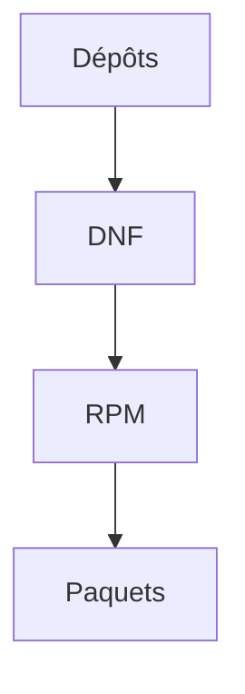

Chacun possède un rôle bien précis.

---

## Qu'est-ce qu'un paquet RPM ?

Un programme Linux n'est généralement pas installé en copiant simplement un exécutable.

Il est distribué sous la forme d'un **paquet RPM**.

Un paquet contient notamment :

- les exécutables ;
- les bibliothèques ;
- les fichiers de configuration ;
- la documentation ;
- les scripts d'installation ;
- les métadonnées.

Autrement dit,

un RPM est un véritable **conteneur d'installation**.

---

## Visualisons un paquet

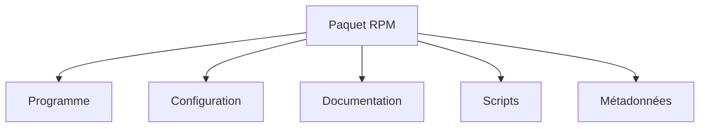

Nous consacrerons plusieurs campagnes à la création de nos propres RPM pour Sentinel.

---

## Le rôle de RPM

RPM signifie :

```text
RPM Package Manager
```

Son rôle est simple.

Il gère les paquets installés localement.

Par exemple,

il sait répondre aux questions suivantes.

- Ce paquet est-il installé ?
- Quelle version est présente ?
- Quels fichiers contient-il ?
- À quel paquet appartient ce fichier ?

RPM ne télécharge rien.

Il travaille uniquement avec les paquets présents sur la machine.

---

## Le rôle de DNF

DNF signifie :

```text
Dandified Yum
```

DNF travaille à un niveau supérieur.

Il sait :

- contacter les dépôts ;
- rechercher un paquet ;
- résoudre automatiquement les dépendances ;
- télécharger les fichiers RPM ;
- demander ensuite à RPM de les installer.

Visualisons.

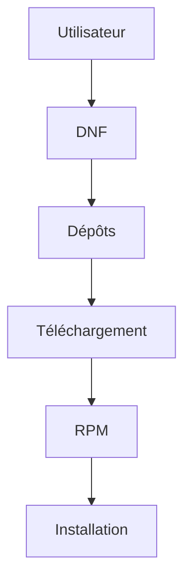

En pratique,

l'administrateur utilise principalement **DNF**.

RPM intervient en arrière-plan.

---

## Une analogie simple

Imaginons une bibliothèque.

```text
Bibliothèque

↓

Recherche d'un livre

↓

Emprunt

↓

Lecture
```

Sous AlmaLinux.

```text
DNF

↓

Recherche du paquet

↓

Téléchargement

↓

RPM

↓

Installation
```

DNF joue donc le rôle du bibliothécaire.

RPM joue celui du gestionnaire de votre bibliothèque personnelle.

---

## Pourquoi ne pas utiliser directement RPM ?

Prenons un exemple.

Vous souhaitez installer :

```text
nginx
```

Ce logiciel dépend d'autres bibliothèques.

Avec RPM,

vous devriez installer chaque dépendance manuellement.

Avec DNF,

le processus ressemble à ceci.

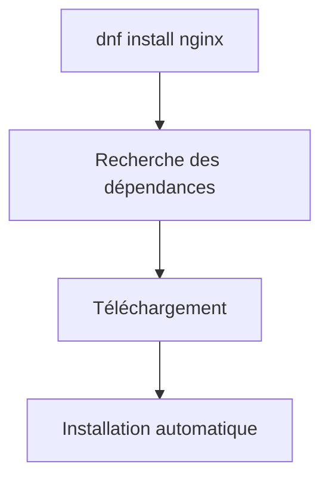

Cette résolution automatique des dépendances constitue l'une des principales forces de DNF.

---
## Les dépôts logiciels

Jusqu'à présent,

nous avons parlé des paquets.

Mais où sont-ils stockés ?

Ils se trouvent dans des **dépôts logiciels**.

Un dépôt est simplement un serveur contenant :

- les paquets RPM ;
- leurs métadonnées ;
- leurs signatures cryptographiques.

Visualisons.

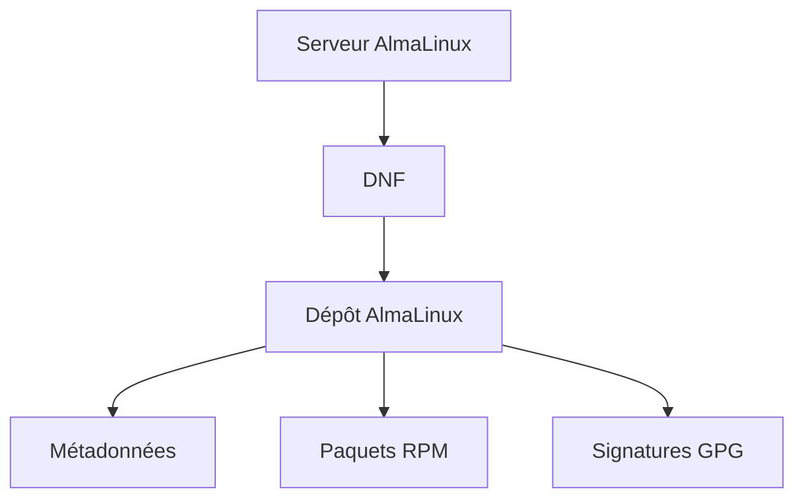

À chaque installation,

DNF consulte d'abord les métadonnées,

puis télécharge uniquement les paquets nécessaires.

---

## Les dépôts AlmaLinux

Une installation AlmaLinux utilise généralement plusieurs dépôts officiels.

Les plus importants sont :

| Dépôt | Rôle |
|--------|------|
| BaseOS | Composants fondamentaux du système |
| AppStream | Applications et langages |
| CRB (CodeReady Builder) | Bibliothèques de développement |
| Extras | Composants complémentaires |

Ces dépôts sont maintenus par le projet AlmaLinux.

Ils constituent la source officielle des logiciels du système.

---

## Comprendre BaseOS

Le dépôt **BaseOS** contient le cœur du système.

Par exemple.

- bash
- systemd
- glibc
- coreutils
- util-linux
- openssh
- rpm

Visualisons.

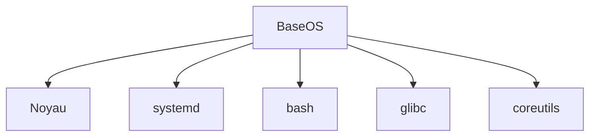

Ces composants évoluent relativement peu,

car ils doivent rester extrêmement stables.

---

## Comprendre AppStream

Le dépôt **AppStream** contient les logiciels utilisés quotidiennement.

Par exemple.

- Python
- Git
- Podman
- Apache
- PostgreSQL
- MariaDB
- PHP

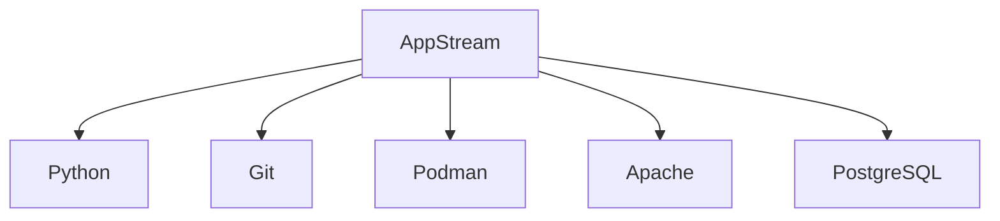

C'est probablement le dépôt que vous utiliserez le plus pendant cette formation.

---

## Pourquoi plusieurs dépôts ?

Une question légitime est la suivante.

> Pourquoi ne pas tout placer dans un seul dépôt ?

La réponse est simple.

Les composants n'ont pas les mêmes contraintes.

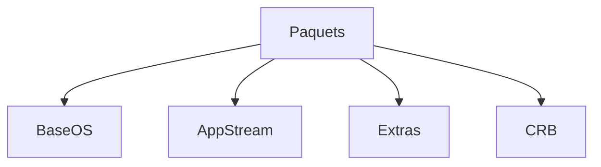

Cette séparation permet notamment :

- de mieux organiser les logiciels ;
- de limiter les dépendances ;
- de simplifier les mises à jour ;
- de maintenir une meilleure stabilité.

---

## Les métadonnées

Avant de télécharger un paquet,

DNF récupère d'abord les métadonnées du dépôt.

Ces informations indiquent notamment :

- les paquets disponibles ;
- leurs versions ;
- leurs dépendances ;
- leurs signatures ;
- leur emplacement.

Visualisons.

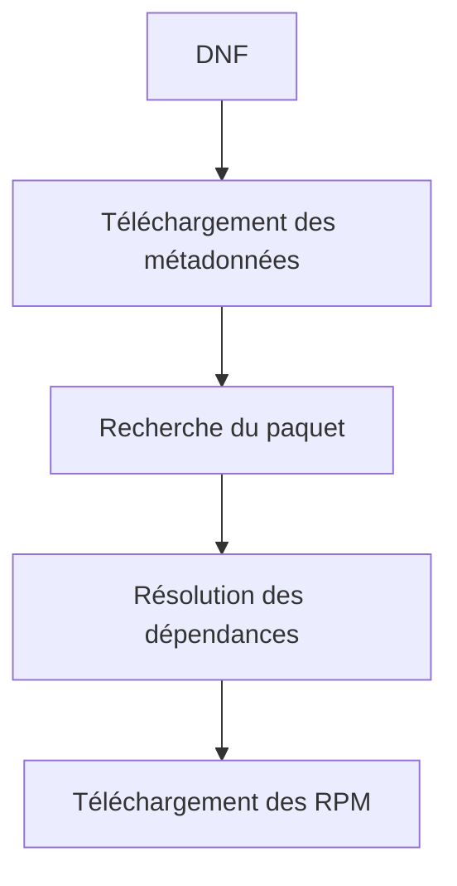

C'est pourquoi la première commande DNF est parfois un peu plus lente.

Les métadonnées sont ensuite conservées dans un cache local.

---

## Où sont configurés les dépôts ?

Les fichiers de configuration se trouvent généralement dans :

```text
/etc/yum.repos.d/
```

Par exemple.

```text
almalinux.repo

almalinux-appstream.repo

epel.repo
```

Chaque fichier décrit :

- le nom du dépôt ;
- son URL ;
- son état (activé ou non) ;
- la vérification GPG ;
- diverses options.

Nous apprendrons plus tard à créer nos propres dépôts RPM.

---

## Afficher les dépôts

Lister les dépôts actifs.

```bash
dnf repolist
```

Afficher tous les dépôts.

```bash
dnf repolist --all
```

Exemple.

```text
repo id                 status

baseos                  enabled

appstream               enabled

extras                  enabled
```

Cette commande fait partie des premières vérifications réalisées lors d'un audit.

---

## Rechercher un paquet

Pour rechercher un logiciel.

```bash
dnf search nginx
```

Ou.

```bash
dnf search python
```

DNF interroge les métadonnées téléchargées précédemment.

Aucun paquet n'est encore installé.

Il s'agit uniquement d'une recherche.

---

## Obtenir des informations

Avant d'installer un paquet,

on peut consulter ses informations.

```bash
dnf info nginx
```

Exemple.

```text
Nom

Version

Architecture

Résumé

Description

Dépôt d'origine
```

Cette commande permet notamment de vérifier :

- l'origine du paquet ;
- sa version ;
- le dépôt utilisé.

Une excellente habitude avant toute installation.

---
## Installer un paquet

L'installation d'un logiciel est extrêmement simple.

Par exemple.

```bash
sudo dnf install nginx
```

Que se passe-t-il réellement ?

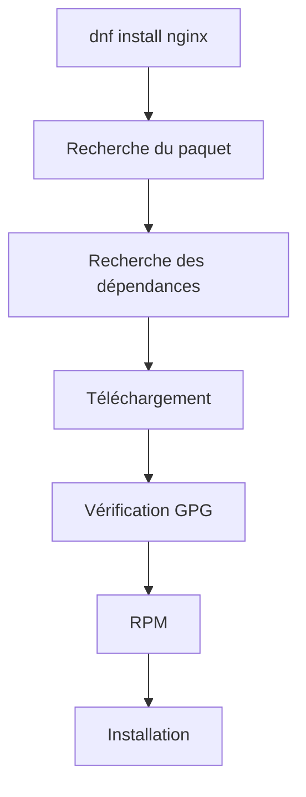

L'administrateur ne voit qu'une seule commande.

Pourtant,

plusieurs dizaines d'opérations sont réalisées automatiquement.

---

## Les dépendances

Peu de logiciels fonctionnent seuls.

Prenons Sentinel.

Notre application Python utilisera par exemple :

- Python ;
- OpenSSL ;
- SQLite ;
- différentes bibliothèques Python.

Visualisons.

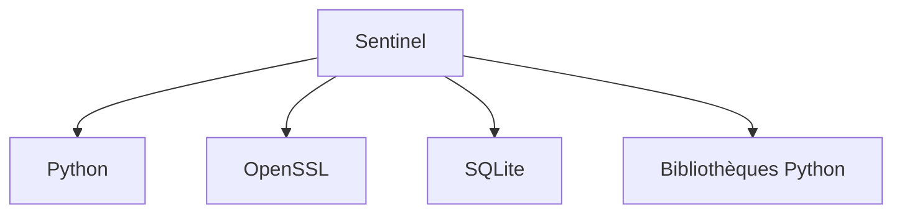

Toutes ces dépendances seront automatiquement installées par DNF.

C'est ce qui rend l'installation fiable et reproductible.

---

## Mettre à jour le système

Afficher les mises à jour disponibles.

```bash
sudo dnf check-update
```

Installer toutes les mises à jour.

```bash
sudo dnf upgrade
```

ou.

```bash
sudo dnf update
```

Les deux commandes sont aujourd'hui équivalentes.

Visualisons.

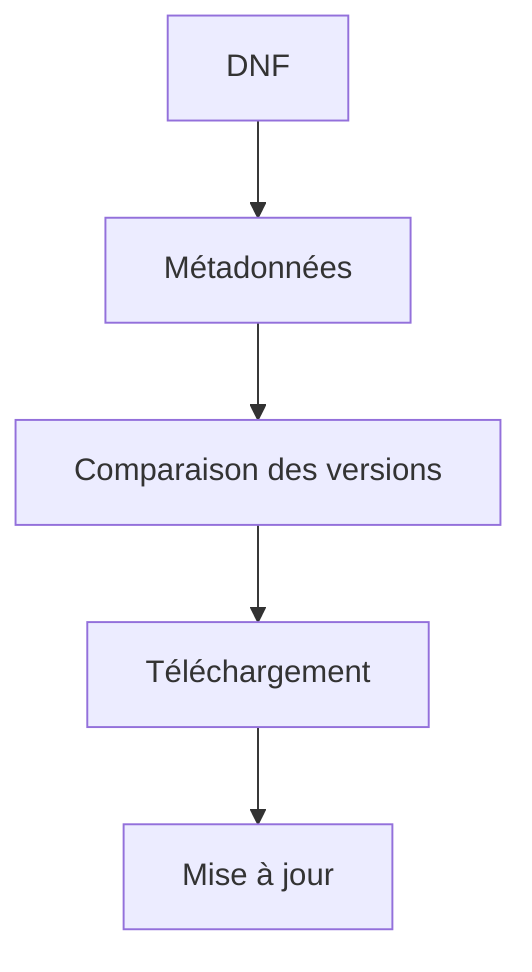

---

## Pourquoi mettre à jour ?

Les mises à jour n'apportent pas uniquement de nouvelles fonctionnalités.

Elles corrigent aussi :

- des vulnérabilités ;
- des bogues ;
- des problèmes de stabilité ;
- des incompatibilités matérielles.

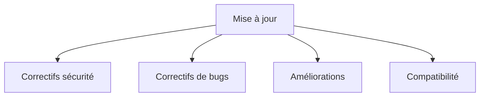

Dans un environnement de production,

la mise à jour constitue donc une opération de sécurité.

---

## Supprimer un paquet

Supprimer un logiciel.

```bash
sudo dnf remove nginx
```

DNF vérifie automatiquement :

- les dépendances restantes ;
- les paquets devenus inutiles.

Cette opération est beaucoup plus sûre qu'une suppression manuelle des fichiers.

---

## Nettoyer le cache

DNF conserve les paquets téléchargés.

Afficher la taille du cache.

```bash
du -sh /var/cache/dnf
```

Le nettoyer.

```bash
sudo dnf clean all
```

Les métadonnées seront automatiquement retéléchargées lors de la prochaine utilisation.

---

## Vérifier un paquet installé

RPM permet de répondre à de nombreuses questions.

Par exemple.

Le paquet est-il installé ?

```bash
rpm -q nginx
```

Quels fichiers contient-il ?

```bash
rpm -ql nginx
```

À quel paquet appartient un fichier ?

```bash
rpm -qf /usr/bin/python3
```

Afficher les informations du paquet.

```bash
rpm -qi nginx
```

Ces commandes sont extrêmement utilisées lors d'un diagnostic.

---

## Comprendre l'historique DNF

Une fonctionnalité souvent méconnue est l'historique.

Afficher les transactions.

```bash
dnf history
```

Exemple.

```text
ID

Date

Action

Utilisateur
```

Chaque installation,

mise à jour ou suppression est enregistrée.

Visualisons.

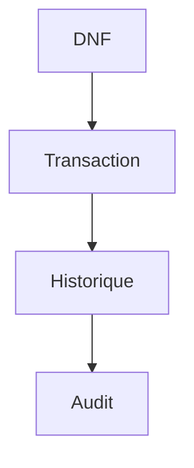

Cette fonctionnalité est très utile lorsqu'il faut comprendre :

- quand un paquet a été installé ;
- qui a lancé une mise à jour ;
- quelle opération a modifié le système.

---

## Annuler une transaction

DNF permet même d'annuler certaines opérations.

Par exemple.

```bash
sudo dnf history
```

Puis.

```bash
sudo dnf history undo 25
```

Cette commande tente de revenir à l'état précédant la transaction numéro 25.

Attention.

Toutes les opérations ne sont pas réversibles.

Il ne faut donc jamais considérer cette fonctionnalité comme un remplacement d'une véritable sauvegarde.

---

## Les signatures GPG

Comment savoir qu'un paquet provient réellement d'AlmaLinux ?

Grâce aux signatures GPG.

Chaque paquet officiel est signé cryptographiquement.

Lors de l'installation,

le processus est le suivant.

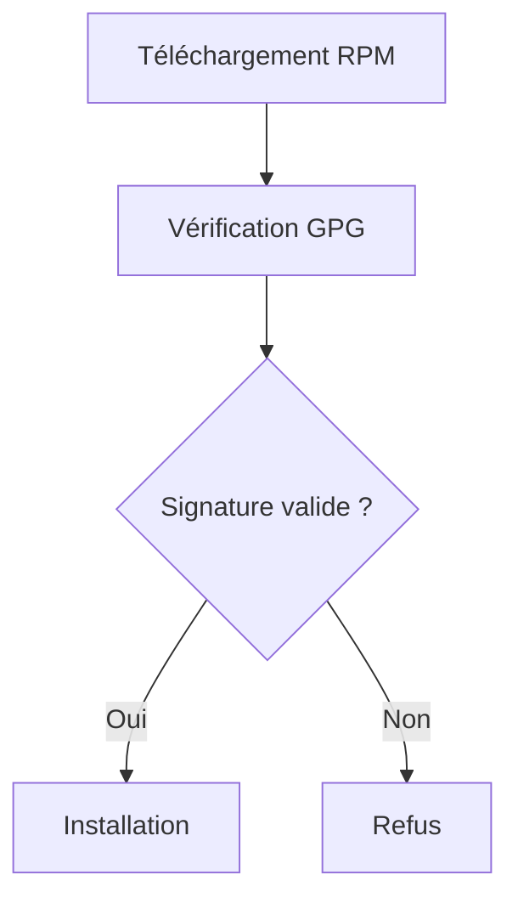

Cette vérification protège contre :

- un paquet modifié ;
- un dépôt compromis ;
- une attaque de type *Man in the Middle*.

C'est une étape essentielle de la chaîne de confiance.

---
## 💎 Le point d'expertise

### Une mise à jour ne consiste pas simplement à installer la dernière version

Lorsque l'on débute,

on imagine souvent qu'une mise à jour revient à installer :

> **la version la plus récente disponible.**

Dans une distribution d'entreprise comme AlmaLinux,

ce n'est généralement **pas** le cas.

Prenons un exemple.

Le projet OpenSSL publie :

```text
OpenSSL 3.0.0

↓

3.0.1

↓

3.0.2

↓

3.1

↓

3.2
```

AlmaLinux ne suivra pas nécessairement toutes ces versions.

À la place,

les mainteneurs appliquent très souvent une technique appelée :

> **Backporting**

Ils conservent une version stable,

tout en y intégrant uniquement les correctifs importants.

Schématiquement.

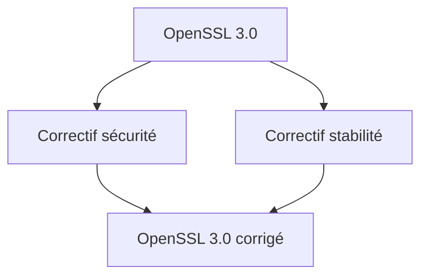

Ainsi,

la version affichée peut sembler ancienne,

tout en étant parfaitement sécurisée.

C'est un principe essentiel des distributions Enterprise.

---

### Pourquoi la stabilité est-elle prioritaire ?

Dans un environnement personnel,

une régression est souvent gênante.

Dans une entreprise,

elle peut arrêter :

- une chaîne de production ;
- un hôpital ;
- une banque ;
- un réseau industriel.

Les distributions comme AlmaLinux privilégient donc :

- la stabilité ;
- la compatibilité ;
- les correctifs de sécurité.

Avant les nouvelles fonctionnalités.

Cette philosophie explique pourquoi Red Hat, AlmaLinux ou Rocky Linux sont si répandus dans les infrastructures critiques.

---

### Une mise à jour est une opération sensible

Mettre à jour un serveur n'est jamais une opération anodine.

Une bonne procédure ressemble généralement à ceci.

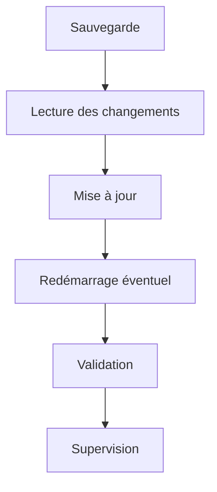

Les administrateurs expérimentés ne lancent jamais une mise à jour importante sans préparation.

---

### Toutes les mises à jour ne nécessitent pas un redémarrage

Beaucoup de paquets peuvent être remplacés pendant que le système fonctionne.

En revanche,

certaines mises à jour concernent :

- le noyau ;
- glibc ;
- systemd.

Dans ces cas,

un redémarrage est souvent nécessaire.

Visualisons.

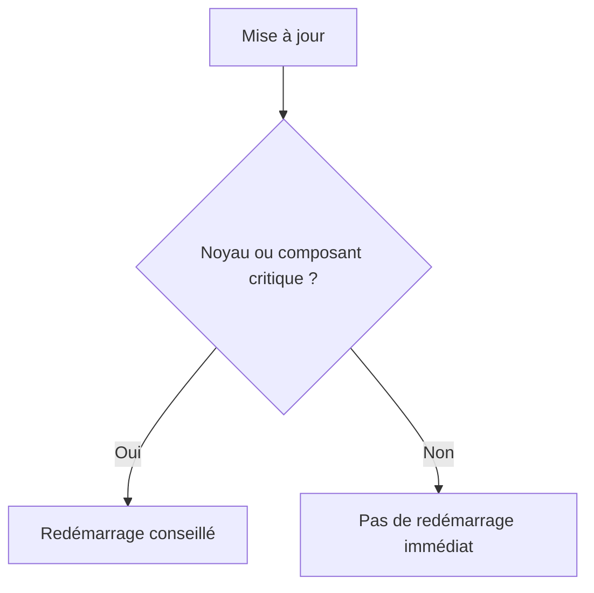

Un bon administrateur vérifie toujours si un redémarrage est nécessaire avant de clôturer une maintenance.

---

## 🧠 Comment pense un architecte ?

Un architecte ne se demande jamais :

> **Comment installer un logiciel ?**

Il préfère répondre aux questions suivantes.

- Quelle est son origine ?
- Est-il maintenu ?
- Est-il compatible avec notre distribution ?
- Pourra-t-il être mis à jour facilement ?
- Son cycle de vie est-il compatible avec celui de l'entreprise ?

Ces questions sont souvent plus importantes que le logiciel lui-même.

---

### Préparer les futures mises à jour

Notre application Sentinel sera distribuée sous forme de RPM.

Elle devra donc être capable de :

- être installée avec DNF ;
- être mise à jour automatiquement ;
- conserver sa configuration ;
- migrer ses données si nécessaire.

Visualisons.

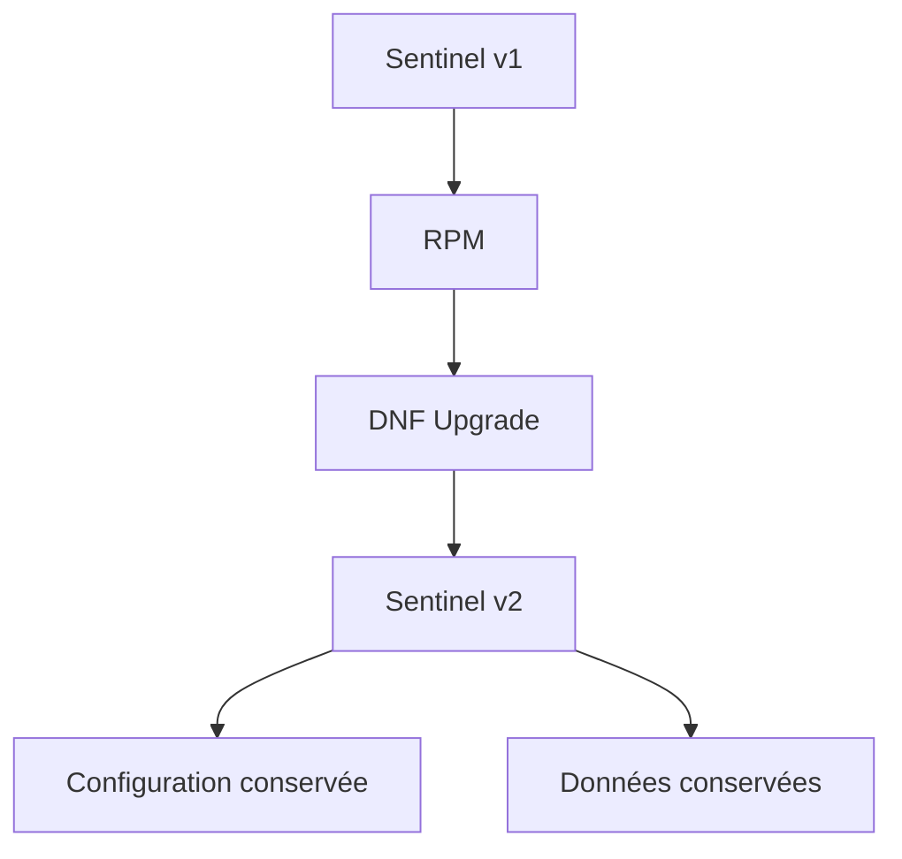

Cette intégration avec l'écosystème RPM constitue l'un des objectifs majeurs de cette formation.

---

## ⚔️ Comment pense un attaquant ?

Lorsqu'un attaquant découvre un serveur,

l'une de ses premières questions est :

> **Le système est-il à jour ?**

Pourquoi ?

Parce que de nombreuses attaques exploitent des vulnérabilités déjà corrigées depuis plusieurs mois,

voire plusieurs années.

L'attaquant cherchera notamment :

- une version ancienne d'OpenSSH ;
- un noyau vulnérable ;
- une bibliothèque OpenSSL obsolète ;
- un serveur Web non corrigé.

Autrement dit,

ne pas appliquer les mises à jour revient souvent à laisser ouvertes des failles déjà connues publiquement.

---

## 🏢 En entreprise

Les grandes infrastructures ne mettent généralement pas à jour les serveurs directement depuis Internet.

L'architecture ressemble davantage à ceci.

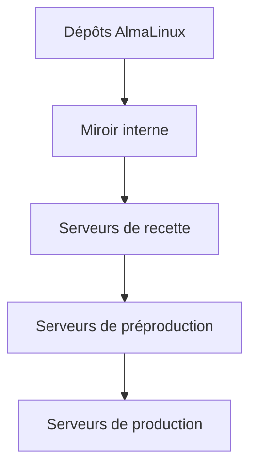

Les nouvelles versions sont d'abord testées,

puis validées,

avant d'être déployées progressivement.

Cette stratégie réduit considérablement le risque d'introduire une régression en production.

---

## 📚 Culture technique

### Pourquoi DNF conserve-t-il un cache ?

Après avoir utilisé DNF,

vous remarquerez que les métadonnées et certains paquets sont conservés dans :

```text
/var/cache/dnf
```

Ce cache permet :

- d'accélérer les recherches suivantes ;
- d'éviter des téléchargements inutiles ;
- de limiter le trafic réseau.

Il est automatiquement mis à jour lorsque cela est nécessaire.

Vous pouvez le supprimer avec :

```bash
sudo dnf clean all
```

mais ce n'est généralement pas indispensable.

---

### Pourquoi RPM ne télécharge-t-il jamais de paquets ?

Historiquement,

RPM est un **gestionnaire de paquets**,

pas un gestionnaire de dépôts.

Son rôle est volontairement limité.

Il sait :

- installer ;
- supprimer ;
- vérifier ;
- interroger les paquets.

La recherche des logiciels,

le téléchargement et la résolution des dépendances sont confiés à DNF.

Cette séparation des responsabilités suit la philosophie Unix :

> **Un composant, une responsabilité.**

---
## ⚠️ Piège classique

### Installer des paquets hors des dépôts officiels

Un débutant rencontre souvent la situation suivante.

Il recherche un logiciel sur Internet.

Il trouve un RPM.

Puis il exécute immédiatement.

```bash
sudo rpm -ivh logiciel.rpm
```

Le logiciel s'installe.

Mais plusieurs questions restent sans réponse.

- Qui a créé ce paquet ?
- Est-il signé ?
- Est-il compatible avec AlmaLinux ?
- Recevra-t-il des mises à jour ?
- Ses dépendances sont-elles correctes ?

Dans une infrastructure professionnelle,

la règle est simple.

> **Privilégier les dépôts officiels ou les dépôts internes validés.**

Un RPM téléchargé au hasard sur Internet représente un risque important.

---

### Désactiver la vérification GPG

Il arrive qu'un paquet refuse de s'installer.

Un message semblable apparaît.

```text
GPG signature verification failed
```

Certains tutoriels proposent alors :

```bash
sudo dnf install --nogpgcheck ...
```

Cette commande contourne complètement la vérification cryptographique.

Elle ne doit être utilisée que dans des situations exceptionnelles,

parfaitement maîtrisées.

Dans un environnement de production,

désactiver la vérification GPG revient à supprimer l'une des protections les plus importantes de la chaîne de confiance.

---

### Utiliser rpm pour installer des logiciels

Une autre erreur fréquente consiste à croire que :

```text
rpm

=

outil d'installation
```

En réalité,

pour installer un logiciel provenant d'un dépôt,

la commande normale est :

```bash
sudo dnf install paquet
```

RPM est principalement utilisé pour :

- interroger les paquets ;
- vérifier leur contenu ;
- diagnostiquer un problème ;
- installer un RPM local très particulier.

Dans 95 % des cas,

l'administrateur travaille avec **DNF**.

---

## Laboratoire AlmaLinux

### Objectif

Découvrir concrètement le fonctionnement de DNF et RPM.

---

### Étape 1 — Explorer les dépôts

Afficher.

```bash
dnf repolist
```

Puis.

```bash
dnf repolist --all
```

Identifier :

- BaseOS ;
- AppStream ;
- Extras ;
- CRB.

Repérer les dépôts activés et ceux qui sont désactivés.

---

### Étape 2 — Rechercher un logiciel

Choisir un logiciel.

Par exemple.

```bash
dnf search nginx
```

Puis.

```bash
dnf info nginx
```

Identifier :

- la version ;
- le dépôt d'origine ;
- l'architecture ;
- le résumé.

---

### Étape 3 — Installer un paquet

Installer.

```bash
sudo dnf install tree
```

Observer :

- les dépendances proposées ;
- le téléchargement ;
- la vérification GPG ;
- l'installation.

Puis tester.

```bash
tree
```

---

### Étape 4 — Explorer avec RPM

Afficher.

```bash
rpm -qi tree
```

Puis.

```bash
rpm -ql tree
```

Enfin.

```bash
rpm -qf /usr/bin/tree
```

Comprendre la différence entre :

- DNF (gestion des dépôts) ;
- RPM (gestion locale des paquets).

---

### Étape 5 — Consulter l'historique

Afficher.

```bash
dnf history
```

Repérer la transaction correspondant à l'installation précédente.

Observer les informations enregistrées.

---

## Mission d'ingénieur

Votre entreprise prépare un dépôt RPM interne destiné à distribuer l'application Sentinel.

Vous devez définir une stratégie répondant aux questions suivantes.

- Quels paquets proviendront des dépôts AlmaLinux officiels ?
- Quels paquets seront développés en interne ?
- Comment garantir leur authenticité ?
- Comment distribuer les mises à jour à plusieurs centaines de serveurs ?
- Comment tester une nouvelle version avant son déploiement en production ?

Votre proposition devra expliquer le rôle de :

- RPM ;
- DNF ;
- des dépôts ;
- des signatures GPG ;
- des environnements de recette et de production.

---

## Impact sur Sentinel

Ce chapitre est particulièrement important pour notre projet.

À partir de la campagne 4,

Sentinel ne sera plus lancé à partir d'un simple répertoire Git.

Il deviendra un **véritable paquet RPM**.

Il pourra alors être installé avec une simple commande.

```bash
sudo dnf install sentinel
```

Puis mis à jour naturellement.

```bash
sudo dnf upgrade sentinel
```

Les fichiers de configuration,

les certificats,

les unités systemd,

les journaux et les scripts de migration seront intégrés directement dans le paquet.

Autrement dit,

Sentinel deviendra un citoyen de première classe de l'écosystème AlmaLinux.

---

## Synthèse

- Un **RPM** est un paquet contenant un logiciel, sa configuration, ses métadonnées et ses scripts d'installation.
- **RPM** gère les paquets installés localement, tandis que **DNF** gère les dépôts, les téléchargements et les dépendances.
- Les dépôts officiels AlmaLinux (BaseOS, AppStream, CRB et Extras) constituent la source privilégiée des logiciels.
- Les signatures **GPG** garantissent l'authenticité et l'intégrité des paquets.
- Les mises à jour sont un élément essentiel de la sécurité d'un système Linux.
- Une infrastructure professionnelle privilégie des dépôts maîtrisés, des tests en recette et un déploiement progressif des mises à jour.
- Sentinel sera lui-même distribué sous forme de RPM afin de s'intégrer naturellement à l'écosystème AlmaLinux.

---

## Infographie de révision

```text
┌──────────────────────────────────────────────────────────────────────────────────────────────┐
│              CHAPITRE 1.5 — MISE À JOUR ET GESTION DES DÉPÔTS                                │
├──────────────────────────────────────────────────────────────────────────────────────────────┤
│                                                                                              │
│                    CHAÎNE D'INSTALLATION D'UN LOGICIEL                                       │
│                                                                                              │
│ Dépôts                                                                                       │
│      │                                                                                       │
│      ▼                                                                                       │
│ Métadonnées                                                                                  │
│      │                                                                                       │
│      ▼                                                                                       │
│ DNF                                                                                          │
│      │                                                                                       │
│      ▼                                                                                       │
│ RPM                                                                                          │
│      │                                                                                       │
│      ▼                                                                                       │
│ Installation                                                                                 │
│                                                                                              │
├──────────────────────────────────────────────────────────────────────────────────────────────┤
│                     RÔLE DES COMPOSANTS                                                      │
│                                                                                              │
│ RPM      → Gestion locale des paquets                                                        │
│ DNF      → Dépôts, dépendances et mises à jour                                               │
│ GPG      → Vérification de l'authenticité                                                    │
│ Dépôts   → Distribution des logiciels                                                        │
│                                                                                              │
├──────────────────────────────────────────────────────────────────────────────────────────────┤
│                     DÉPÔTS ALMALINUX                                                         │
│                                                                                              │
│ BaseOS      → Système de base                                                                │
│ AppStream   → Applications et langages                                                       │
│ CRB         → Bibliothèques de développement                                                 │
│ Extras      → Composants complémentaires                                                     │
│                                                                                              │
├──────────────────────────────────────────────────────────────────────────────────────────────┤
│                       COMMANDES ESSENTIELLES                                                 │
│                                                                                              │
│ dnf search        → Rechercher un paquet                                                     │
│ dnf info          → Informations                                                             │
│ dnf install       → Installer                                                                │
│ dnf update        → Mettre à jour                                                            │
│ dnf remove        → Désinstaller                                                             │
│ dnf history       → Historique                                                               │
│ rpm -qi           → Informations d'un paquet                                                 │
│ rpm -ql           → Lister les fichiers d'un paquet                                          │
│ rpm -qf           → Identifier le paquet d'un fichier                                        │
│                                                                                              │
├──────────────────────────────────────────────────────────────────────────────────────────────┤
│                      BONNES PRATIQUES                                                        │
│                                                                                              │
│ ✔ Utiliser les dépôts officiels                                                              │
│ ✔ Vérifier les signatures GPG                                                                │
│ ✔ Tester les mises à jour avant la production                                                │
│ ✔ Utiliser DNF plutôt que RPM pour installer                                                 │
│ ✔ Conserver un historique des mises à jour                                                   │
│ ✘ Télécharger des RPM au hasard sur Internet                                                 │
│ ✘ Désactiver GPG sans justification                                                          │
│                                                                                              │
├──────────────────────────────────────────────────────────────────────────────────────────────┤
│                     IMPACT SUR SENTINEL                                                      │
│                                                                                              │
│ Sentinel                                                                                    │
│      │                                                                                       │
│      ▼                                                                                       │
│ RPM interne                                                                                  │
│      │                                                                                       │
│      ▼                                                                                       │
│ Dépôt d'entreprise                                                                           │
│      │                                                                                       │
│      ▼                                                                                       │
│ dnf install sentinel                                                                         │
│      │                                                                                       │
│      ▼                                                                                       │
│ dnf upgrade sentinel                                                                         │
│                                                                                              │
├──────────────────────────────────────────────────────────────────────────────────────────────┤
│                               IDÉE CLÉ                                                       │
│                                                                                              │
│ « La gestion des paquets ne consiste pas simplement                                          │
│  à installer des logiciels.                                                                  │
│  Elle garantit la cohérence, la sécurité, la                                                 │
│  maintenabilité et l'industrialisation de                                                    │
│  tout un parc de serveurs. »                                                                 │
└──────────────────────────────────────────────────────────────────────────────────────────────┘
```

---

← [1.4 — Premier démarrage et premières vérifications](1.4-premier-demarrage-verifications.md) · [1.6 — Architecture des systèmes de fichiers](1.6-architecture-systemes-fichiers.md) →
