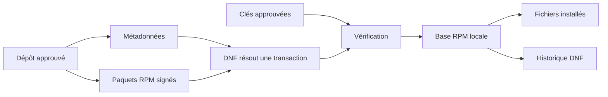
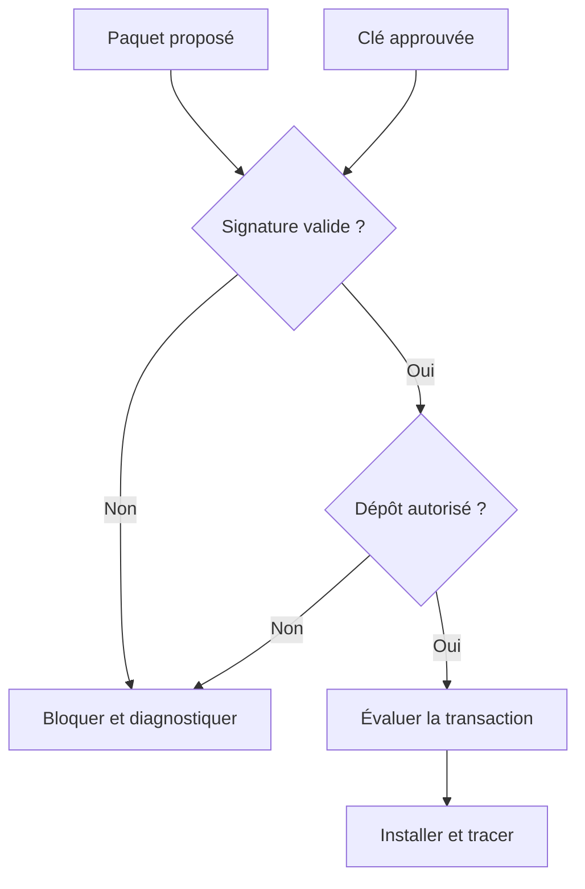

# Chapitre 1.5 — Mettre à jour et gérer les dépôts

> **Campagne 1 — Installation et fondations**

> *« Installer un logiciel, c'est accepter sa provenance, ses dépendances et son cycle de maintenance. »*

## Vous êtes ici

```text
PARTIE I — Construire un socle sécurisé

Campagne 1

  1.1 Pourquoi sécuriser un socle Linux ? ✔
  1.2 Installer AlmaLinux minimal ✔
  1.3 Comprendre les composants du système ✔
  1.4 Établir la baseline du serveur ✔
► 1.5 Mettre à jour et gérer les dépôts
  1.6 Organiser les systèmes de fichiers
  1.7 Comprendre identités et permissions
  1.8 Administrer avec sudo
  1.9 Mission : mettre le serveur en sécurité
  1.10 Créer le laboratoire Sentinel
```

## Objectifs pédagogiques

À l'issue de ce chapitre, vous serez capable de :

- distinguer paquet RPM, dépôt, métadonnées, signature et transaction DNF ;
- expliquer les rôles de BaseOS, AppStream et des avis d'errata AlmaLinux ;
- rechercher, installer, mettre à jour et retirer un paquet depuis une source approuvée ;
- vérifier la provenance et les fichiers d'un paquet installé ;
- préparer une maintenance avec contrôle, preuve et retour arrière réaliste ;
- éviter les installations manuelles qui échappent au cycle de vie du système.

## Pourquoi ce chapitre existe

Un serveur minimal doit évoluer : correctifs de sécurité, nouveaux outils et dépendances de Sentinel. Chaque ajout modifie la surface d'attaque et crée une responsabilité de mise à jour. Copier un binaire dans `/usr/local/bin` peut sembler rapide, mais le système ignore alors sa provenance, sa version et les fichiers qu'il a installés.

AlmaLinux s'appuie sur RPM pour représenter les paquets et sur DNF pour résoudre leur installation depuis des dépôts. Ce chapitre traite le point de vue du **consommateur et de l'exploitant**. La fabrication, la signature et la publication des paquets Sentinel appartiennent à la campagne 10.

## La chaîne de confiance logicielle



Un **RPM** contient des fichiers, des métadonnées, des dépendances et des scripts de cycle de vie. La base RPM locale sait quels paquets sont installés et quels fichiers leur appartiennent. Elle ne télécharge rien par elle-même.

Un **dépôt** publie des RPM et des métadonnées qui permettent de les rechercher. **DNF** consulte les dépôts activés, calcule les dépendances et applique une transaction cohérente. Utiliser directement `rpm -i` pour un paquet téléchargé contourne une partie de cette résolution et rend la provenance plus difficile à gouverner.

## Comprendre les dépôts activés

AlmaLinux sépare les contenus en dépôts ayant des rôles et des cycles distincts. Les noms exacts dépendent de la version installée ; n'activez pas un dépôt en vous fondant sur une capture d'écran d'une autre version.

Deux ensembles constituent les repères principaux de la famille Enterprise Linux :

| Dépôt | Contenu attendu | Décision d'exploitation |
| --- | --- | --- |
| BaseOS | fonctions fondamentales du système d'exploitation | reste une fondation de l'installation |
| AppStream | applications en espace utilisateur, langages et bases de données | fournit les composants adaptés aux charges de travail |

Des dépôts complémentaires tels qu'Extras ou un dépôt de construction destiné aux dépendances de développement peuvent exister selon la version. Ils ne sont pas équivalents à BaseOS et AppStream et ne doivent pas être activés « au cas où ». Vérifiez leur identifiant, leur rôle et leur politique de support sur l'hôte réel.

```bash
sudo dnf repolist
sudo dnf repolist --all
sudo dnf repoinfo
```

Les fichiers de définition se trouvent généralement sous `/etc/yum.repos.d/`. Ils indiquent l'emplacement des métadonnées, l'état du dépôt et les paramètres de vérification.

```bash
sudo grep -R -E '^(\[|name=|baseurl=|mirrorlist=|metalink=|enabled=|gpgcheck=|gpgkey=)' \
  /etc/yum.repos.d/
```

Ne modifiez pas encore ces fichiers. Relevez le propriétaire RPM d'une définition et son origine :

```bash
rpm -qf /etc/yum.repos.d/*.repo
```

Un dépôt additionnel élargit la chaîne de confiance. Avant de l'activer, l'équipe doit connaître son propriétaire, sa politique de signature, son support, les risques de conflit et la procédure de retrait.

## Rechercher avant d'installer

Partez du besoin, pas d'un nom supposé :

```bash
dnf search tree
dnf info tree
dnf repoquery --info tree
dnf repoquery --requires tree
```

Selon l'installation, certaines sous-commandes peuvent nécessiter un paquet de greffons. Vérifiez la commande avec `dnf --help` et installez seulement l'outil nécessaire depuis les dépôts approuvés.

Avant une installation, simulez ou examinez la transaction proposée :

```bash
sudo dnf install tree --assumeno
```

DNF affiche le paquet, la version, l'architecture, le dépôt source, la taille et les dépendances. `--assumeno` permet d'étudier la proposition sans l'appliquer. Lisez cette sortie : une commande familière peut déclencher une transaction plus large que prévu.

### Dépendances, fournisseurs et flux de versions

Une dépendance exprime souvent une capacité plutôt qu'un nom de fichier précis. Plusieurs paquets peuvent fournir une commande ou une bibliothèque ; DNF choisit une solution compatible avec les dépôts et l'architecture activés. Pour rechercher le fournisseur d'un chemin ou d'une capacité :

```bash
dnf provides '*/semanage'
dnf repoquery --whatprovides 'python(abi)'
```

Les jokers doivent être cités afin que le shell ne les développe pas avant DNF. La sortie peut contenir plusieurs versions ou architectures : sélectionnez celle qui correspond au système, puis examinez le dépôt source.

AppStream peut proposer des flux de versions pour certains composants. Un flux choisi influence les versions compatibles disponibles pour l'hôte ; le changer n'est pas une simple mise à jour mineure. Observez l'état sans le modifier :

```bash
dnf module list --enabled
dnf module list NOM_DU_MODULE
```

Selon la version AlmaLinux et le composant, le mécanisme de modules peut être moins présent ou évoluer. La documentation locale et la transaction proposée restent les références. Ne réinitialisez pas ou ne basculez pas un flux sur un serveur utilisé sans étudier les dépendances et la procédure de migration.

Les **dépendances faibles** et paquets recommandés peuvent aussi élargir une transaction. Leur désactivation globale pour obtenir une machine plus petite peut supprimer des fonctions attendues. À l'inverse, les accepter sans lecture ajoute des composants. La décision doit être prise par rôle et vérifiée avec les tests de l'application.

Cette complexité justifie l'usage de DNF : il rend visible un graphe que l'installation manuelle répartirait entre téléchargements, scripts et copies impossibles à relire comme une transaction unique.

## Appliquer et prouver une installation

```bash
sudo dnf install tree
rpm -q tree
rpm -qi tree
rpm -ql tree
rpm -V tree
```

`rpm -qi` décrit le paquet installé, `rpm -ql` liste ses fichiers et `rpm -V` compare certains attributs aux métadonnées enregistrées. Une absence de sortie de `rpm -V` signifie qu'aucune différence vérifiée n'a été détectée ; ce n'est pas une analyse complète de compromission.

Reliez également une commande à son paquet :

```bash
command -v tree
rpm -qf "$(command -v tree)"
```

Cette relation est centrale pour l'exploitation : lorsqu'un fichier pose problème, l'équipe peut retrouver son paquet, sa version et sa source de mise à jour.

## Signatures et clés approuvées

La vérification GPG permet de contrôler qu'un paquet a été signé par une clé approuvée et n'a pas été modifié après signature. Elle ne garantit pas que le logiciel est exempt de vulnérabilité ni que le dépôt répond à votre besoin.

```bash
rpm -qa 'gpg-pubkey*'
sudo dnf config-manager --dump 2>/dev/null | grep -E '^(gpgcheck|repo_gpgcheck)'
```

Ne contournez pas un échec avec `--nogpgcheck`. Un tel échec indique une rupture de la chaîne de confiance : mauvaise source, clé absente, métadonnées incohérentes ou téléchargement altéré. La bonne action est d'identifier la cause et de comparer la clé par un canal fiable.



## Préparer une mise à jour

Une mise à jour corrige des défauts mais peut modifier un comportement. Le processus doit donc inclure l'observation avant et après, la fenêtre de changement et la stratégie de récupération.

AlmaLinux publie des **avis** qui donnent du sens aux paquets proposés :

| Préfixe | Type d'avis | Question à poser |
| --- | --- | --- |
| `ALSA` | sécurité | quelles vulnérabilités et quelle sévérité ? |
| `ALBA` | correction d'anomalie | quel défaut fonctionnel est corrigé ? |
| `ALEA` | amélioration | quel comportement ou quelle capacité évolue ? |

Consultez les avis disponibles avant de réduire une mise à jour à une simple liste de versions :

```bash
dnf updateinfo --list
dnf updateinfo list updates security
dnf updateinfo info IDENTIFIANT_AVIS
```

La seconde commande cible les avis de sécurité non encore appliqués. Les métadonnées disponibles dépendent des dépôts activés ; une absence de résultat ne prouve pas à elle seule que le système est à jour. Comparez la date de rafraîchissement, les dépôts attendus et, pour une enquête précise, le portail officiel des errata.

```bash
sudo dnf check-update
sudo dnf upgrade --assumeno
dnf needs-restarting 2>/dev/null || true
```

`dnf check-update` utilise un code de retour particulier lorsqu'il existe des mises à jour ; ne traitez pas automatiquement toute valeur non nulle comme une panne sans consulter la page de manuel. La commande `needs-restarting` dépend des greffons disponibles et aide à identifier les processus utilisant encore d'anciens fichiers.

Avant la transaction, enregistrez : baseline utile, espace disque, unités en échec, paquets proposés et sauvegarde des données concernées. Pendant une maintenance, évitez les commandes concurrentes DNF ou RPM.

Appliquez ensuite :

```bash
sudo dnf upgrade
sudo dnf history info last
```

Après la transaction, vérifiez les services critiques, les journaux, le noyau actif et la nécessité d'un redémarrage. « La commande a réussi » n'est pas un test fonctionnel de Sentinel.

## Historique, retrait et retour arrière

DNF conserve un historique des transactions :

```bash
sudo dnf history
sudo dnf history info last
```

L'historique apporte la traçabilité des paquets ajoutés, mis à jour ou retirés. Les fonctions `undo` ou `rollback` ne sont pas une garantie universelle : une ancienne version peut ne plus être disponible, un script de paquet peut avoir migré des données et un service peut avoir changé de format.

Le retour arrière réel combine selon le risque : versions conservées dans un dépôt, sauvegarde restaurable, configuration versionnée, procédure applicative et test. Pour un outil sans données, le retrait est simple :

```bash
sudo dnf remove tree --assumeno
sudo dnf remove tree
```

Relisez la transaction de suppression : une dépendance devenue inutile peut être proposée, tandis qu'un paquet partagé doit rester.

## Cache et métadonnées

DNF conserve des métadonnées et des paquets dans un cache pour accélérer les opérations. Le nettoyer n'est pas une routine de sécurité ; cela force de nouveaux téléchargements et peut compliquer un diagnostic.

```bash
sudo dnf clean metadata
sudo dnf makecache
du -sh /var/cache/dnf
```

Utilisez `clean all` pour résoudre un besoin identifié ou libérer de l'espace, pas comme réflexe après chaque transaction.

## TP 1 — Qualifier puis installer un outil

Pour le paquet `tree`, produisez avant installation : besoin, dépôt source, version, dépendances et transaction simulée. Appliquez l'installation, puis prouvez :

- la version installée ;
- le fichier exécutable fourni ;
- la liste de fichiers ;
- l'absence de modification détectée par `rpm -V` ;
- l'identifiant de transaction DNF.

Terminez par un test fonctionnel dans votre répertoire personnel. Ne confondez pas la preuve d'installation avec la preuve que l'outil répond au besoin.

## TP 2 — Préparer une maintenance sans l'exécuter

Construisez une fiche pour la prochaine mise à jour du serveur :

1. état avant changement ;
2. liste et origine des paquets proposés ;
3. capacité disque ;
4. services à tester ;
5. critères de succès ;
6. conditions d'arrêt ;
7. sauvegarde ou reconstruction disponible ;
8. décision de redémarrage ;
9. preuves à joindre au compte rendu.

Exécutez seulement les commandes de lecture et la transaction avec `--assumeno`. La mission 1.9 appliquera une maintenance maîtrisée.

## Mission d'ingénieur — Accepter ou refuser un nouveau dépôt

Une équipe propose un dépôt tiers pour obtenir un outil plus récent. Rédigez une décision comprenant : propriétaire, URL, clé de signature et empreinte vérifiée, paquets concernés, risques de remplacement, durée de support, procédure de désactivation et alternative fournie par les dépôts actuels.

La décision ne doit pas se limiter à « le site est connu ». Elle doit préciser la frontière de confiance ajoutée et les preuves nécessaires avant activation.

## Impact sur Sentinel

Les dépendances de Sentinel seront installées et maintenues par des transactions relisibles. À terme, Sentinel sera lui-même livré comme RPM signé depuis un dépôt gouverné. Dès maintenant, aucune dépendance ne doit être ajoutée hors du système de paquets sans exception documentée.

## Synthèse

- RPM décrit les paquets et leurs fichiers ; DNF résout des transactions depuis des dépôts.
- BaseOS fournit la fondation du système ; AppStream apporte applications, langages et composants adaptés aux charges de travail.
- Un dépôt activé élargit la chaîne de confiance et doit avoir un propriétaire.
- Les avis ALSA, ALBA et ALEA relient une mise à jour à un risque de sécurité, une anomalie ou une amélioration.
- La transaction proposée doit être lue avant installation, mise à jour ou suppression.
- Les signatures protègent provenance et intégrité, pas la qualité fonctionnelle du logiciel.
- L'historique DNF trace les changements mais ne remplace pas une stratégie de retour arrière.
- Une maintenance se termine par des tests du système et de l'application.

## Infographie de révision

```text
BESOIN ─► RECHERCHE ─► DÉPÔT APPROUVÉ ─► SIGNATURE ─► TRANSACTION
                                                          │
                         ┌────────────────────────────────┼──────────────┐
                         ▼                                ▼              ▼
                    INSTALLER                         METTRE À JOUR    RETIRER
                         │                                │              │
                         └──────────────► HISTORIQUE + TESTS ◄───────────┘

Pas de --nogpgcheck ; pas de binaire orphelin ; pas de rollback supposé.
```

## Pour aller plus loin

Utilisez `man dnf`, `man rpm`, la documentation des [dépôts AlmaLinux](https://wiki.almalinux.org/repos/AlmaLinux) et celle des [avis d'errata](https://wiki.almalinux.org/documentation/errata.html). La campagne 10 reprendra la chaîne du côté producteur : construction, dépendances, configuration, signature, dépôt privé et packaging de Sentinel.

Chapitre suivant : placer correctement exécutables, configuration, données, journaux et fichiers temporaires dans l'arborescence Linux.

← [1.4 — Établir la baseline du serveur](1.4-premier-demarrage-verifications.md) · [1.6 — Organiser les systèmes de fichiers](1.6-architecture-systemes-fichiers.md) →
