# Campagne 1 — Installation et fondations

# Chapitre 1.5 — Utilisateurs et groupes

> *« Linux ne protège pas les fichiers. Il protège les accès. Et ces accès sont accordés à des identités. »*

---

# Vous êtes ici

```text
Partie I — Construire un socle sécurisé

Campagne 1 — Installation et fondations

      1.1 Pourquoi sécuriser un socle Linux ?
      1.2 Installation d'AlmaLinux Minimal
      1.3 Comprendre les privilèges
      1.4 Le système de fichiers
    ► 1.5 Utilisateurs et groupes
      1.6 Permissions Linux
      1.7 sudo et moindre privilège
      1.8 Première sécurisation de Sentinel
```

---

# Objectifs pédagogiques

À la fin de ce chapitre, vous serez capable de :

- comprendre le rôle des utilisateurs sous Linux ;
- distinguer utilisateurs humains et comptes système ;
- comprendre le fonctionnement des groupes ;
- interpréter les principaux fichiers d'authentification ;
- préparer l'organisation des identités de Sentinel.

---

# Pourquoi ce chapitre existe

Dans le chapitre précédent,

nous avons découvert que chaque processus possède une identité.

Une question se pose naturellement.

> **D'où provient cette identité ?**

La réponse est simple.

Elle provient des utilisateurs définis dans le système.

Mais sous Linux,

un utilisateur ne représente pas forcément une personne.

Il peut représenter :

- un administrateur ;
- un développeur ;
- une application ;
- un démon système ;
- un service réseau.

Autrement dit,

les utilisateurs constituent les **identités** du système.

Comprendre leur fonctionnement est indispensable avant d'étudier les permissions.

---

# Une identité avant tout

Un utilisateur Linux n'est pas simplement un nom.

Il possède plusieurs caractéristiques.

- un identifiant numérique ;
- un groupe principal ;
- éventuellement des groupes secondaires ;
- un répertoire personnel ;
- un shell ;
- différentes informations d'authentification.

On peut représenter cela ainsi.

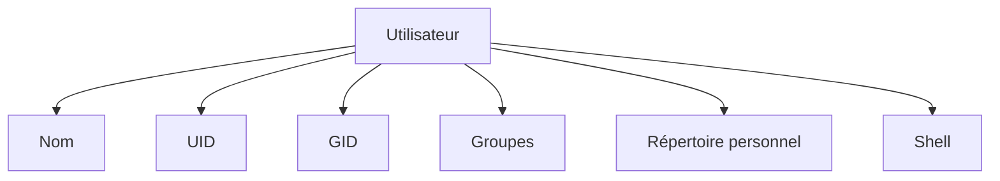

Toutes ces informations seront utilisées par le noyau pour prendre ses décisions de sécurité.

---

# Les trois grandes catégories d'utilisateurs

Sur un serveur Linux,

nous rencontrons généralement trois familles d'identités.

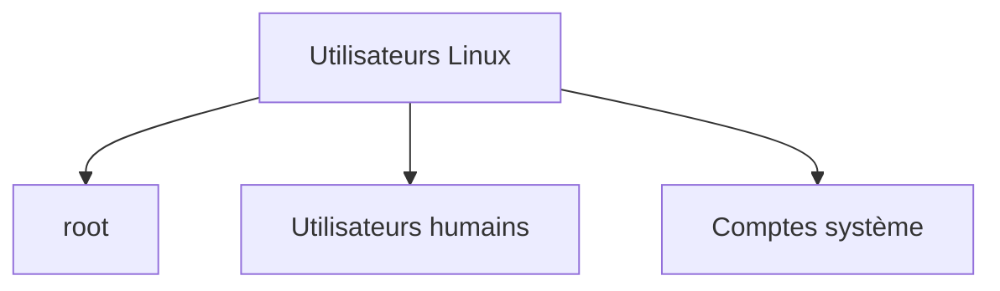

Ces trois catégories n'ont absolument pas le même rôle.

---

# Root

Le premier utilisateur est :

```text
root
```

Nous l'avons déjà rencontré.

Son rôle est simple.

Administrer entièrement le système.

Son identifiant est toujours :

```text
UID 0
```

Il possède les privilèges les plus élevés.

C'est pourquoi son utilisation quotidienne est fortement déconseillée.

---

# Les utilisateurs humains

Ce sont les comptes créés pour les personnes.

Par exemple.

- alice
- bob
- tom
- admin

Ils servent principalement :

- à ouvrir une session ;
- à administrer les serveurs ;
- à développer ;
- à utiliser les applications.

Ils disposent généralement d'un répertoire personnel.

Par exemple.

```text
/home/tom
```

---

# Les comptes système

Ce sont probablement les utilisateurs les plus mystérieux lorsque l'on débute.

Prenons le contenu de :

```text
/etc/passwd
```

On y trouve souvent.

- chrony
- rpc
- dbus
- sssd
- nginx
- apache
- postfix
- nobody

Ces comptes ne correspondent à aucune personne.

Ils représentent uniquement des services.

Chaque service possède sa propre identité.

Cette séparation constitue un élément fondamental de la sécurité de Linux.

---
# Le fichier /etc/passwd

Toutes les informations essentielles concernant les utilisateurs sont stockées dans un fichier.

```text
/etc/passwd
```

Il ne contient **pas** les mots de passe.

Il décrit uniquement les identités connues du système.

Prenons un exemple.

```text
tom:x:1000:1000:Tom Dupont:/home/tom:/bin/bash
```

Cette ligne paraît complexe.

En réalité,

elle est composée de plusieurs champs.

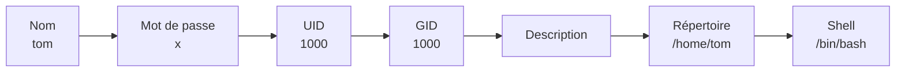

Chaque champ possède un rôle bien précis.

Nous allons les détailler.

---

# Le nom

Le premier champ contient le nom de connexion.

Par exemple.

```text
tom
```

C'est ce nom qui est utilisé lors d'une connexion SSH ou locale.

Le noyau,

lui,

travaille principalement avec les UID.

Le nom est surtout destiné aux humains.

---

# Le champ « x »

Autrefois,

les mots de passe étaient stockés directement dans :

```text
/etc/passwd
```

Aujourd'hui,

on trouve généralement :

```text
x
```

Cela signifie simplement que le mot de passe est stocké ailleurs.

Dans :

```text
/etc/shadow
```

Cette séparation améliore considérablement la sécurité.

Nous y reviendrons dans quelques instants.

---

# L'UID

Chaque utilisateur possède un identifiant numérique unique.

Par exemple.

```text
1000
```

Le noyau utilise principalement cet identifiant.

Le nom :

```text
tom
```

n'est finalement qu'une représentation plus lisible.

Deux utilisateurs différents ne peuvent jamais partager le même UID,

sauf cas très particuliers.

---

# Le GID

Chaque utilisateur appartient au minimum à un groupe.

Ce groupe principal possède également un identifiant numérique.

Par exemple.

```text
1000
```

Les groupes permettent de partager plus facilement des permissions.

Nous les étudierons juste après.

---

# Le répertoire personnel

Chaque utilisateur possède généralement son propre espace de travail.

Par exemple.

```text
/home/tom
```

Toutes les données personnelles y sont stockées.

- scripts ;
- documents ;
- clés SSH ;
- configurations utilisateur.

Nous verrons plus tard que ce répertoire mérite une protection particulière.

---

# Le shell

Le dernier champ indique le programme lancé lors de la connexion.

Par exemple.

```text
/bin/bash
```

ou

```text
/bin/sh
```

ou

```text
/bin/zsh
```

Pour un utilisateur humain,

un shell interactif est nécessaire.

En revanche,

les comptes système utilisent très souvent :

```text
/sbin/nologin
```

ou

```text
/usr/sbin/nologin
```

Pourquoi ?

Parce qu'ils ne sont pas destinés à ouvrir une session.

---

# Le fichier /etc/shadow

Les mots de passe ne sont pas stockés dans :

```text
/etc/passwd
```

Ils sont conservés dans un second fichier.

```text
/etc/shadow
```

Sa lecture est réservée à root.

Visualisons.

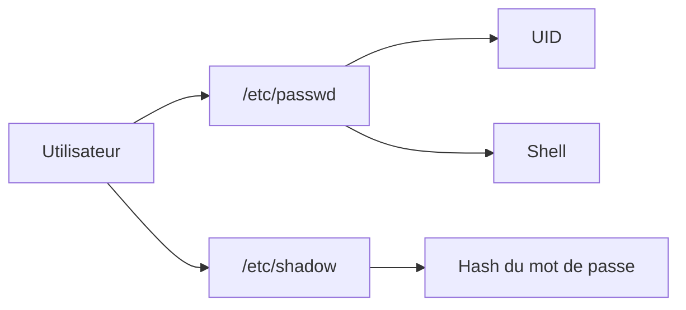

Cette séparation présente un avantage majeur.

Tout le monde peut consulter :

```text
/etc/passwd
```

sans jamais accéder aux informations sensibles d'authentification.

---

# Pourquoi tout le monde peut lire /etc/passwd ?

Cette question revient très souvent.

Le système doit pouvoir convertir :

```text
UID 1000
```

en :

```text
tom
```

ou encore.

```text
UID 991
```

en :

```text
nginx
```

De très nombreux programmes réalisent cette conversion.

Il est donc normal que :

```text
/etc/passwd
```

soit lisible par tous.

En revanche,

```text
/etc/shadow
```

reste réservé aux utilisateurs privilégiés.

C'est cette séparation qui protège les informations d'authentification.

---

# Les comptes sans connexion

Regardons quelques exemples.

```text
chrony

↓

/usr/sbin/nologin
```

```text
sssd

↓

/usr/sbin/nologin
```

```text
rpc

↓

/usr/sbin/nologin
```

Ces utilisateurs existent uniquement pour exécuter leur service.

Ils ne possèdent pas :

- de mot de passe utilisable ;
- de shell interactif ;
- de session utilisateur.

Ils permettent simplement d'attribuer une identité au processus concerné.

C'est exactement ce qui limite les conséquences d'une compromission d'un service.

---
# Les groupes

Jusqu'à présent,

nous avons étudié les utilisateurs.

Mais Linux possède un second mécanisme extrêmement important.

Les **groupes**.

Pourquoi ?

Parce qu'il serait rapidement impossible d'administrer les permissions utilisateur par utilisateur.

Prenons un exemple.

Une équipe de développement est composée de :

- Alice
- Bob
- Charlie
- David

Tous doivent accéder aux mêmes fichiers.

Deux approches sont possibles.

Première approche.

```text
Donner les permissions

à chacun individuellement
```

Deuxième approche.

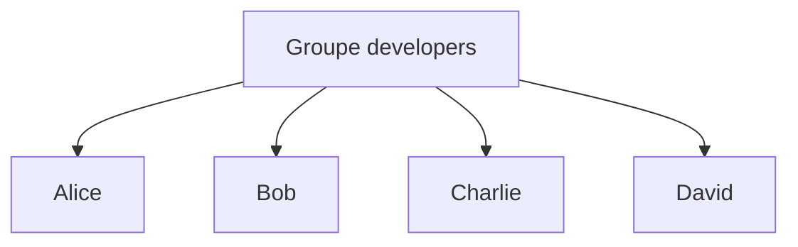

Puis.

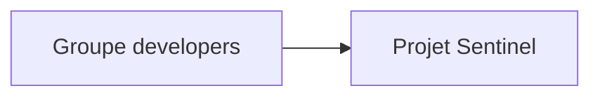

La seconde solution est évidemment beaucoup plus simple à administrer.

---

# Le groupe principal

Chaque utilisateur possède obligatoirement :

- un UID ;
- un GID principal.

Prenons notre utilisateur.

```text
tom:x:1000:1000:Tom:/home/tom:/bin/bash
```

Le quatrième champ correspond justement au groupe principal.

Dans beaucoup de distributions modernes,

un utilisateur possède son propre groupe.

Par exemple.

```text
Utilisateur

↓

tom
```

```text
Groupe principal

↓

tom
```

Cette approche simplifie énormément la gestion des permissions dans le répertoire personnel.

---

# Les groupes secondaires

Un utilisateur peut également appartenir à plusieurs groupes.

Visualisons.

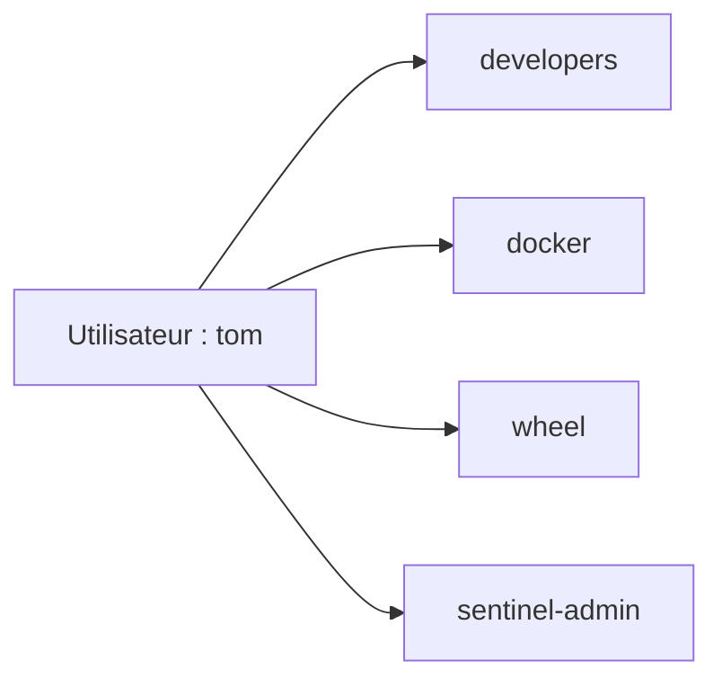

Chaque groupe ajoute de nouveaux droits.

C'est un mécanisme extrêmement souple.

Par exemple.

- accès au dépôt Git ;
- administration Docker ;
- gestion des sauvegardes ;
- administration Sentinel.

Nous utiliserons abondamment cette fonctionnalité.

---

# Le fichier /etc/group

Les groupes sont définis dans :

```text
/etc/group
```

Exemple.

```text
developers:x:1001:alice,bob,charlie
```

Décomposons cette ligne.

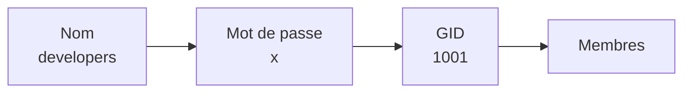

Le dernier champ contient les utilisateurs appartenant au groupe.

---

# Pourquoi utiliser des groupes ?

Prenons Sentinel.

Plusieurs administrateurs doivent consulter les journaux.

Sans groupe.

```text
Alice

↓

Permissions
```

```text
Bob

↓

Permissions
```

```text
Charlie

↓

Permissions
```

Chaque nouvel administrateur nécessite une modification.

Avec un groupe.

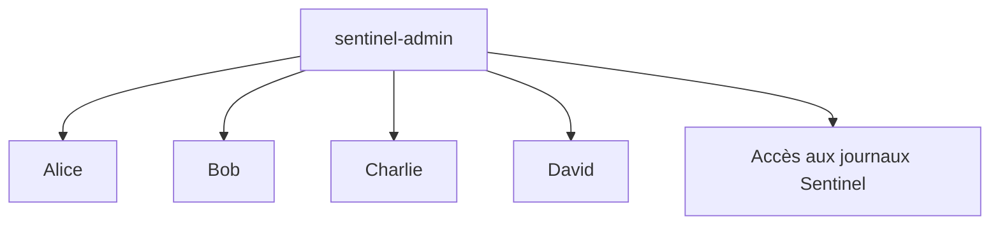

L'ajout d'un nouvel administrateur consiste simplement à l'ajouter au groupe.

---

# Les groupes et les permissions

Nous allons bientôt étudier les permissions Linux.

Il est néanmoins utile d'en comprendre dès maintenant le principe.

Chaque fichier possède trois catégories de droits.

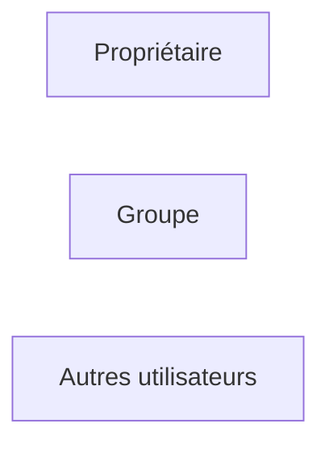

Lorsqu'un utilisateur tente d'accéder à un fichier,

Linux suit toujours le même raisonnement.

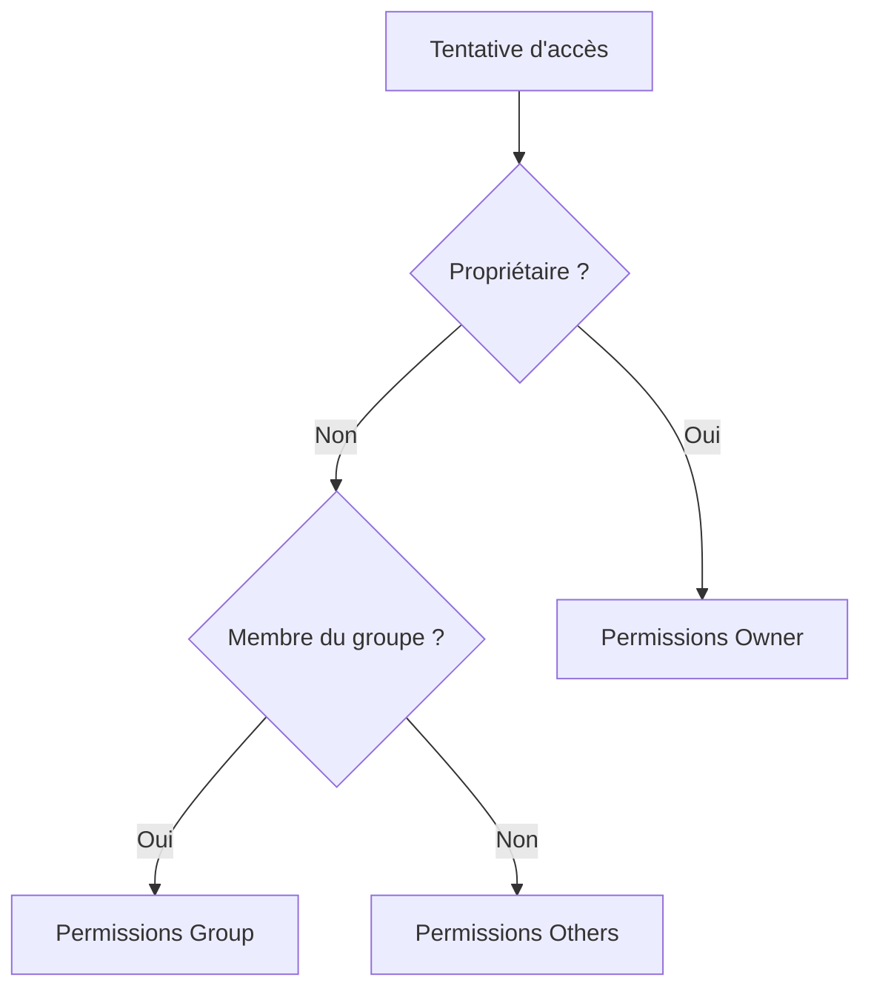

Ce mécanisme constitue le cœur du modèle de sécurité Unix.

Nous l'étudierons en détail dans le prochain chapitre.

---

# Les commandes utiles

Afficher son identité.

```bash
whoami
```

Afficher l'UID et les groupes.

```bash
id
```

Lister les groupes d'un utilisateur.

```bash
groups
```

Afficher les groupes du système.

```bash
cat /etc/group
```

Créer un groupe.

```bash
sudo groupadd developers
```

Créer un utilisateur.

```bash
sudo useradd alice
```

Ajouter un utilisateur à un groupe.

```bash
sudo usermod -aG developers alice
```

Ces commandes feront partie de votre quotidien d'administrateur Linux.

---
# 💎 Le point d'expertise

## Les utilisateurs ne sont qu'une abstraction

Lorsque l'on débute,

on imagine que Linux travaille avec des noms comme :

```text
tom

alice

nginx
```

En réalité,

le noyau ne manipule quasiment jamais ces noms.

Il utilise principalement :

- les UID ;
- les GID.

Les noms sont simplement une traduction destinée aux humains.

Le fonctionnement réel ressemble davantage à ceci.

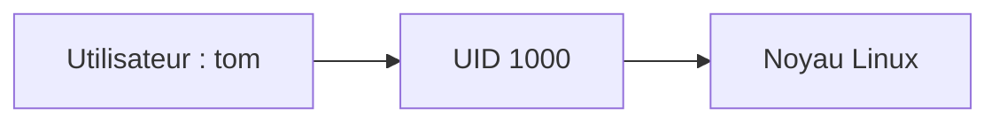

Lorsque vous exécutez :

```bash
id
```

vous observez justement cette identité numérique.

---

## Pourquoi plusieurs comptes système ?

Prenons un serveur Web.

Une mauvaise conception consisterait à exécuter tous les services sous :

```text
root
```

Une conception moderne ressemble davantage à ceci.

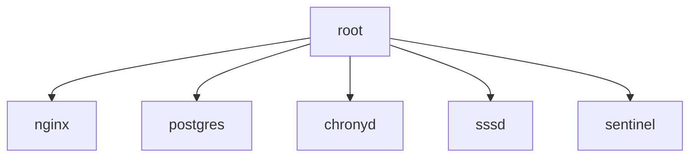

Chaque service possède :

- son propre utilisateur ;
- son propre groupe ;
- ses propres permissions.

Ainsi,

si un service est compromis,

les autres continuent généralement à être protégés.

Cette isolation est l'une des plus grandes forces de Linux.

---

## Pourquoi les groupes sont-ils si importants ?

Supposons que cinquante administrateurs doivent accéder aux journaux Sentinel.

Sans groupes,

il faudrait modifier cinquante comptes.

Avec un groupe,

le raisonnement devient :

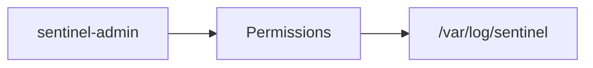

Les utilisateurs ne reçoivent plus directement les permissions.

Ils héritent de celles de leur groupe.

Cette philosophie simplifie énormément l'administration des grandes infrastructures.

---

## Une identité est utilisée partout

L'identité d'un utilisateur n'intervient pas uniquement lors de la connexion.

Elle est utilisée dans de nombreux composants.

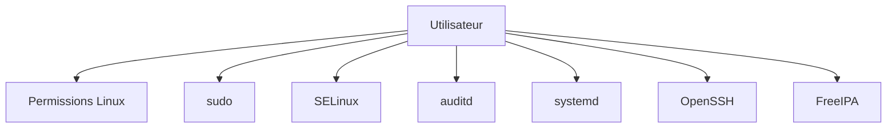

Autrement dit,

la gestion des identités constitue l'un des fondements de toute l'architecture Linux.

C'est pourquoi nous consacrerons une campagne entière à FreeIPA plus loin dans cette formation.

---

# 🧠 Comment pense un architecte ?

Un architecte ne crée jamais un utilisateur "par habitude".

Il commence toujours par se poser une question.

> **Quelle identité ce composant doit-il posséder ?**

Prenons Sentinel.

L'application doit :

- lire sa configuration ;
- écrire ses journaux ;
- accéder à sa base de données.

Elle n'a pas besoin de :

- modifier les comptes utilisateurs ;
- arrêter le serveur ;
- accéder aux fichiers SSH des administrateurs.

L'architecte crée donc un compte dédié.

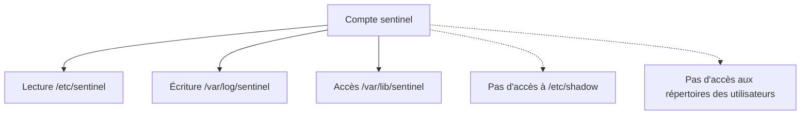

Cette approche applique naturellement le principe du moindre privilège.

---

## Penser en séparation des responsabilités

Une infrastructure professionnelle sépare généralement plusieurs rôles.

Par exemple.

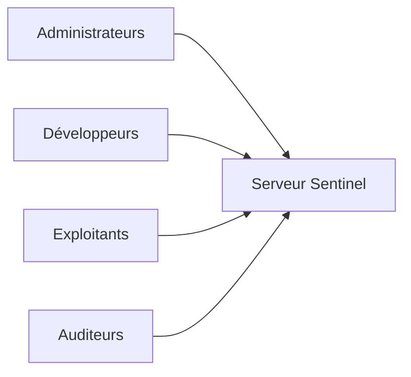

Ces quatre catégories n'ont pourtant pas les mêmes besoins.

Un administrateur système n'a pas les mêmes droits qu'un développeur.

Un auditeur doit pouvoir consulter certains journaux,

sans pour autant modifier la configuration.

Cette séparation des responsabilités est essentielle pour limiter les risques d'erreur ou d'abus.

---

# ⚔️ Comment pense un attaquant ?

Lorsqu'un attaquant obtient un accès à un serveur,

il commence souvent par dresser un inventaire des identités disponibles.

Par exemple.

```bash
cat /etc/passwd
```

Il cherche notamment :

- des comptes oubliés ;
- des utilisateurs disposant d'un shell interactif ;
- des comptes de service mal configurés ;
- des UID inhabituels ;
- des groupes privilégiés.

Pourquoi ?

Parce qu'un compte possédant des droits excessifs représente souvent un excellent point de départ pour une élévation de privilèges.

L'objectif du défenseur est donc de rendre cette recherche la moins intéressante possible.

---

# 🏢 En entreprise

Dans les grandes infrastructures,

les comptes locaux sont souvent limités au strict minimum.

Les utilisateurs sont généralement gérés de manière centralisée.

Par exemple.

```text
FreeIPA

↓

Active Directory

↓

LDAP
```

Le serveur ne contient alors que :

- les comptes système indispensables ;
- quelques comptes techniques ;
- éventuellement un compte d'administration de secours.

Les identités des utilisateurs sont fournies par un annuaire centralisé.

Cette approche présente plusieurs avantages.

- création d'un utilisateur une seule fois ;
- révocation immédiate sur tous les serveurs ;
- politiques de mot de passe homogènes ;
- intégration avec SSH, sudo et les certificats.

C'est exactement cette architecture que nous construirons plus tard avec FreeIPA.

---
# 📚 Culture technique

## Pourquoi les UID commencent-ils souvent à 1000 ?

En affichant le contenu de :

```text
/etc/passwd
```

vous remarquerez probablement que votre utilisateur possède un identifiant similaire à :

```text
UID = 1000
```

Pourquoi pas 1 ?

Historiquement,

les premiers identifiants sont réservés au système.

Une répartition classique ressemble à ceci.

| Plage d'UID | Utilisation |
|-------------|-------------|
| 0 | root |
| 1 à ~999 | Comptes système (selon la distribution) |
| ≥1000 | Utilisateurs humains |

Cette convention permet de distinguer rapidement les comptes système des comptes interactifs.

Il est toutefois important de retenir que cette plage est une **convention**, et non une règle absolue du noyau Linux.

---

## Pourquoi un utilisateur possède-t-il un groupe portant son propre nom ?

Sur AlmaLinux,

si vous créez :

```text
tom
```

vous obtenez généralement :

```text
Utilisateur : tom

Groupe principal : tom
```

On parle de **User Private Group (UPG)**.

Cette méthode présente plusieurs avantages.

- elle simplifie le partage de fichiers ;
- elle réduit les risques liés aux permissions ;
- elle évite que tous les utilisateurs appartiennent au même groupe.

Cette organisation est aujourd'hui la norme sur la plupart des distributions orientées entreprise.

---

## Le compte "nobody"

Vous rencontrerez probablement un utilisateur nommé :

```text
nobody
```

Son rôle historique est de représenter un utilisateur disposant de très peu de privilèges.

Autrefois,

certains services s'exécutaient sous ce compte.

Aujourd'hui,

cette pratique tend à disparaître.

Les services modernes préfèrent disposer chacun de leur propre utilisateur.

Par exemple.

```text
nginx

postgres

chronyd

sssd

named
```

Cette approche offre une bien meilleure isolation.

---

## Pourquoi les comptes système utilisent-ils nologin ?

Si vous examinez :

```text
/etc/passwd
```

vous verrez souvent :

```text
/usr/sbin/nologin
```

ou

```text
/sbin/nologin
```

Cela signifie simplement que ces comptes ne peuvent pas ouvrir de session interactive.

Le fonctionnement peut être résumé ainsi.

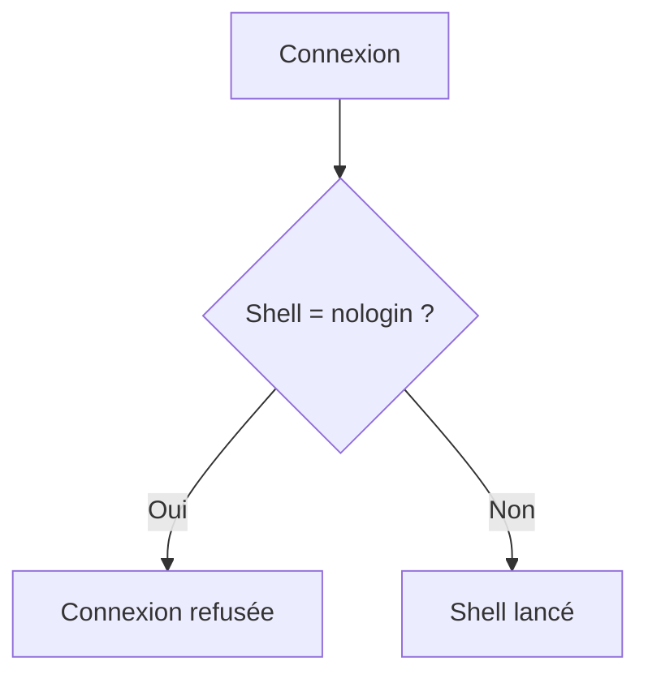

Cela n'empêche absolument pas le service concerné de fonctionner.

Au contraire,

le service démarre directement sous cette identité grâce à **systemd**,

sans jamais passer par une connexion interactive.

C'est une notion importante que nous approfondirons lorsque nous étudierons systemd.

---

# ⚠️ Piège classique

## Confondre utilisateur et personne

Une erreur très fréquente consiste à penser que tous les utilisateurs représentent des personnes.

Sur un serveur fraîchement installé,

la majorité des comptes appartiennent en réalité à des services.

Par exemple.

```text
chrony

rpc

dbus

sssd

systemd-network

systemd-resolve
```

Ces comptes ne se connecteront jamais.

Ils servent uniquement à exécuter des processus avec une identité propre.

---

## Supprimer un compte système "pour faire le ménage"

Un administrateur débutant peut être tenté de supprimer des comptes qu'il ne connaît pas.

Par exemple.

```bash
sudo userdel chrony
```

Cette opération peut empêcher le service concerné de fonctionner correctement.

Avant de supprimer un utilisateur,

il faut toujours répondre à deux questions.

- Quel service utilise ce compte ?
- Quelles seraient les conséquences de sa suppression ?

En administration système,

la prudence est souvent préférable à la précipitation.

---

# Laboratoire AlmaLinux

## Objectif

Découvrir concrètement les identités présentes sur un serveur AlmaLinux.

---

## Étape 1 — Observer les utilisateurs

Afficher les premiers comptes du système.

```bash
cat /etc/passwd
```

Identifier :

- votre utilisateur ;
- `root` ;
- plusieurs comptes système.

Pour chacun,

relever :

- son UID ;
- son shell ;
- son répertoire personnel.

---

## Étape 2 — Observer les groupes

Afficher :

```bash
cat /etc/group
```

Repérer :

- votre groupe principal ;
- le groupe `wheel` ;
- quelques groupes système.

Comparer ces informations avec le résultat de :

```bash
id
```

---

## Étape 3 — Identifier les comptes non interactifs

Exécuter.

```bash
grep nologin /etc/passwd
```

Observer le nombre de comptes concernés.

Choisir trois d'entre eux.

Rechercher à quel service ils sont associés.

---

## Étape 4 — Explorer les groupes de votre utilisateur

Afficher.

```bash
groups
```

Puis.

```bash
id
```

Comparer les résultats.

Comprendre la différence entre :

- groupe principal ;
- groupes secondaires.

---

# Mission d'ingénieur

Votre équipe prépare le déploiement de Sentinel dans une entreprise comptant plusieurs centaines de développeurs et d'administrateurs.

Vous devez définir une politique de gestion des identités répondant aux questions suivantes.

- Quels comptes doivent être locaux ?
- Quels comptes doivent être gérés par FreeIPA ?
- Quels groupes seront créés pour Sentinel ?
- Quels utilisateurs pourront consulter les journaux ?
- Quels utilisateurs pourront modifier la configuration ?
- Quels comptes seront utilisés par les services ?

Votre proposition devra respecter le principe du moindre privilège et préparer l'industrialisation de l'infrastructure.

---

# Impact sur Sentinel

Nous savons désormais qu'une application ne doit jamais s'exécuter sous une identité générique.

Notre futur service Sentinel disposera :

- d'un utilisateur système dédié ;
- d'un groupe dédié ;
- d'un répertoire personnel si nécessaire ;
- de permissions adaptées à sa fonction.

Cette identité sera utilisée par :

- systemd ;
- SELinux ;
- les permissions Linux ;
- les journaux d'audit ;
- Ansible ;
- FreeIPA.

Nous commençons ainsi à construire une application qui s'intègre naturellement dans un environnement Linux professionnel.

---

# Ce qu'il faut retenir

- Les utilisateurs représentent les identités du système, qu'ils soient humains ou techniques.
- Le noyau travaille principalement avec les UID et les GID, et non avec les noms.
- Les groupes permettent de mutualiser les permissions et de simplifier l'administration.
- Les comptes système sont dédiés à l'exécution des services et utilisent généralement `nologin`.
- Les fichiers `/etc/passwd`, `/etc/shadow` et `/etc/group` décrivent les identités et leurs caractéristiques.
- Une bonne gestion des utilisateurs prépare l'application du moindre privilège, l'automatisation et la centralisation future des identités avec FreeIPA.

---
# Grande infographie de révision du chapitre

```text
┌──────────────────────────────────────────────────────────────────────────────────────────────┐
│                   CHAPITRE 1.5 — UTILISATEURS ET GROUPES                                     │
├──────────────────────────────────────────────────────────────────────────────────────────────┤
│                                                                                              │
│                         LES IDENTITÉS LINUX                                                  │
│                                                                                              │
│                               Utilisateurs                                                   │
│                                      │                                                       │
│         ┌────────────────────────────┼─────────────────────────────┐                         │
│         │                            │                             │                         │
│      root                  Utilisateurs humains          Comptes système                     │
│         │                            │                             │                         │
│     UID 0                    UID ≥ 1000                Services Linux                        │
│                                                                                              │
├──────────────────────────────────────────────────────────────────────────────────────────────┤
│                           FICHIERS IMPORTANTS                                                 │
│                                                                                              │
│ /etc/passwd   → Identité des utilisateurs                                                    │
│ /etc/shadow   → Hashs des mots de passe                                                      │
│ /etc/group    → Définition des groupes                                                       │
│                                                                                              │
├──────────────────────────────────────────────────────────────────────────────────────────────┤
│                          UNE IDENTITÉ CONTIENT                                                │
│                                                                                              │
│ ✔ Nom de connexion                                                                           │
│ ✔ UID                                                                                        │
│ ✔ GID                                                                                        │
│ ✔ Groupes secondaires                                                                        │
│ ✔ Répertoire personnel                                                                       │
│ ✔ Shell                                                                                      │
│                                                                                              │
├──────────────────────────────────────────────────────────────────────────────────────────────┤
│                            UTILISATEURS SYSTÈME                                               │
│                                                                                              │
│ chronyd                                                                                      │
│ sssd                                                                                         │
│ nginx                                                                                        │
│ postgres                                                                                     │
│ rpc                                                                                          │
│ dbus                                                                                         │
│                                                                                              │
│ Leur rôle :                                                                                  │
│                                                                                              │
│ ✔ Faire fonctionner un service                                                               │
│ ✔ Posséder une identité propre                                                               │
│ ✔ Limiter les privilèges                                                                     │
│ ✔ Empêcher une compromission globale                                                         │
│                                                                                              │
├──────────────────────────────────────────────────────────────────────────────────────────────┤
│                            LES GROUPES                                                       │
│                                                                                              │
│ Utilisateur                                                                                  │
│      │                                                                                       │
│      ▼                                                                                       │
│ Groupe principal                                                                             │
│      │                                                                                       │
│      ▼                                                                                       │
│ Groupes secondaires                                                                          │
│      │                                                                                       │
│      ▼                                                                                       │
│ Permissions partagées                                                                        │
│                                                                                              │
├──────────────────────────────────────────────────────────────────────────────────────────────┤
│                        BONNES PRATIQUES                                                      │
│                                                                                              │
│ ✔ Un compte par personne                                                                     │
│ ✔ Un compte par service                                                                      │
│ ✔ Utiliser les groupes                                                                       │
│ ✔ Utiliser nologin pour les services                                                         │
│ ✔ Conserver les comptes système                                                              │
│ ✔ Préparer la centralisation avec FreeIPA                                                    │
│ ✘ Ne jamais partager root                                                                    │
│ ✘ Ne jamais supprimer un compte système sans analyse                                         │
│ ✘ Ne jamais utiliser un même compte pour plusieurs services                                  │
│                                                                                              │
├──────────────────────────────────────────────────────────────────────────────────────────────┤
│                           VISION FUTURE DE SENTINEL                                           │
│                                                                                              │
│ Administrateurs ───────► Groupe sentinel-admin                                               │
│ Exploitants ───────────► Groupe sentinel-ops                                                 │
│ Auditeurs ─────────────► Groupe sentinel-audit                                               │
│ Service Sentinel ──────► Utilisateur système sentinel                                        │
│                                                                                              │
│ FreeIPA centralisera plus tard la gestion de ces identités.                                  │
│                                                                                              │
├──────────────────────────────────────────────────────────────────────────────────────────────┤
│                                 IDÉE CLÉ                                                     │
│                                                                                              │
│ « Linux ne gère pas des personnes. Il gère des identités.                                    │
│  Les utilisateurs et les groupes constituent la base                                         │
│  de toutes les décisions de sécurité du système. »                                           │
└──────────────────────────────────────────────────────────────────────────────────────────────┘
```
