# Chapitre 1.6 — Architecture des systèmes de fichiers

> **Campagne 1 — Installation et fondations**

> *« Sous Linux, tout est organisé selon une hiérarchie. Comprendre cette hiérarchie est indispensable avant d'installer, sécuriser ou développer une application. »*

---

## Vous êtes ici

```text
Partie I — Construire un socle sécurisé

Campagne 1 — Installation et fondations

      1.1 Pourquoi sécuriser un socle Linux ?
      1.2 Installation d'AlmaLinux Minimal
      1.3 Comprendre les composants d'un système Linux
      1.4 Premier démarrage et premières vérifications
      1.5 Mise à jour et gestion des dépôts
    ► 1.6 Architecture des systèmes de fichiers
      1.7 Utilisateurs, groupes et permissions
      1.8 sudo et principe du moindre privilège
      1.9 Première mise en sécurité du serveur
      1.10 Création du laboratoire Sentinel
```

---

## Objectifs pédagogiques

À la fin de ce chapitre, vous serez capable de :

- comprendre la hiérarchie standard d'un système Linux ;
- connaître le rôle des principaux répertoires ;
- savoir où installer une application professionnelle ;
- distinguer les fichiers système, les données et les configurations ;
- organiser correctement les fichiers de Sentinel.

---

## Pourquoi ce chapitre existe

Lorsqu'un développeur arrive sous Linux,

une question revient très vite.

> **Où dois-je placer mes fichiers ?**

Sous Windows,

on rencontre souvent :

```text
C:\Program Files

C:\Users

C:\Temp
```

Sous Linux,

la logique est différente.

Tous les fichiers,

qu'il s'agisse :

- du noyau ;
- des programmes ;
- des utilisateurs ;
- des journaux ;
- des périphériques ;

font partie d'un **arbre unique**.

Comprendre cette organisation est indispensable pour construire une application propre.

---

## Un seul arbre

Contrairement à Windows,

Linux ne possède pas plusieurs lecteurs (`C:`, `D:`, `E:`...).

Tout commence par un unique répertoire.

```text
/
```

appelé :

> **la racine** (*Root Directory*).

Visualisons.

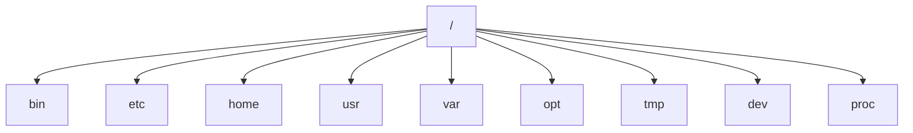

Tous les autres répertoires descendent de cette racine.

---

## Le FHS

L'organisation des fichiers sous Linux n'est pas laissée au hasard.

Elle suit une norme.

```text
Filesystem Hierarchy Standard

(FHS)
```

Le FHS définit notamment :

- où installer les programmes ;
- où placer les fichiers de configuration ;
- où écrire les journaux ;
- où stocker les données variables.

Grâce à cette normalisation,

un administrateur retrouve rapidement ses repères,

quelle que soit la distribution.

---

## Les répertoires essentiels

Voici les principaux répertoires que tout administrateur doit connaître.

| Répertoire | Rôle |
|------------|------|
| `/` | Racine du système |
| `/etc` | Configuration |
| `/usr` | Programmes installés |
| `/var` | Données variables |
| `/home` | Répertoires utilisateurs |
| `/tmp` | Fichiers temporaires |
| `/opt` | Applications tierces |
| `/dev` | Périphériques |
| `/proc` | Informations sur le noyau |
| `/run` | Données temporaires des services |

Nous allons maintenant étudier chacun d'entre eux.

---

## Le répertoire /etc

Le répertoire :

```text
/etc
```

contient principalement :

- les fichiers de configuration ;
- les paramètres système ;
- les configurations des services.

Par exemple.

```text
/etc/ssh/

/etc/systemd/

/etc/passwd

/etc/group

/etc/fstab

/etc/sudoers
```

Une règle importante est la suivante.

> **Aucun programme ne doit écrire ses données de travail dans `/etc`.**

Ce répertoire est réservé à la configuration.

---

## Le répertoire /usr

Le répertoire :

```text
/usr
```

contient la majorité des logiciels installés.

Visualisons.

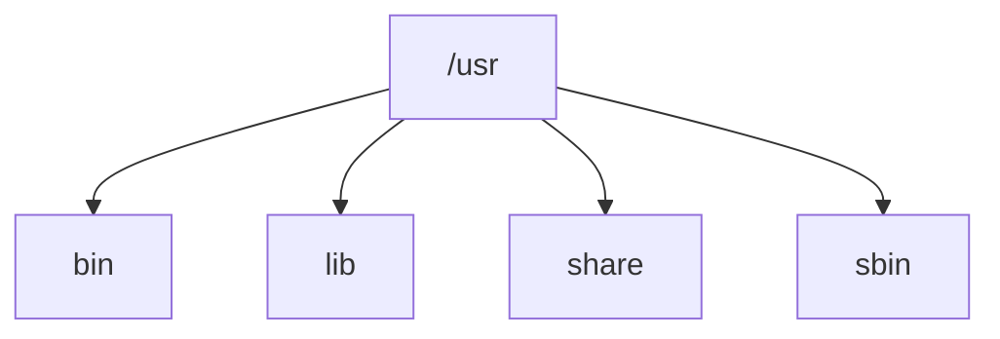

On y trouve notamment :

- les exécutables ;
- les bibliothèques ;
- la documentation ;
- les ressources partagées.

Lorsqu'un RPM installe un programme,

celui-ci est très souvent placé dans `/usr`.

---

## Le répertoire /var

Contrairement à `/usr`,

le contenu de :

```text
/var
```

évolue constamment.

On y trouve notamment.

```text
/var/log

/var/lib

/var/cache

/var/spool

/var/tmp
```

Visualisons.

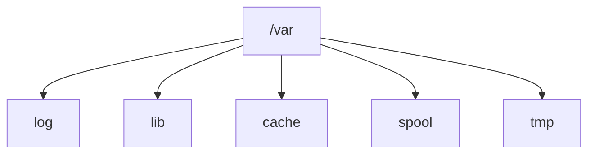

La règle est simple.

> **Les données qui changent pendant l'exécution d'un programme appartiennent généralement à `/var`.**

---
## Le répertoire /home

Chaque utilisateur possède généralement son propre répertoire personnel.

Par exemple.

```text
/home/tom

/home/alice

/home/bob
```

Visualisons.

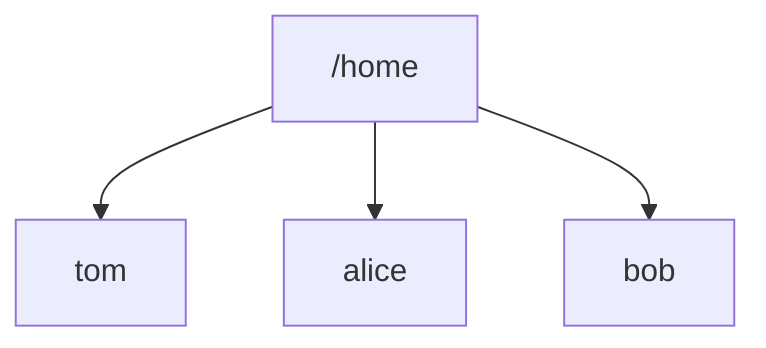

Chaque utilisateur y stocke :

- ses documents ;
- ses scripts ;
- sa configuration personnelle ;
- ses clés SSH ;
- son historique de commandes.

Ce répertoire n'est **pas** destiné aux applications système.

Sentinel n'y stockera donc jamais ses données.

---

## Le répertoire /tmp

Le répertoire :

```text
/tmp
```

est destiné aux fichiers temporaires.

Exemples.

- archives décompressées ;
- fichiers intermédiaires ;
- données de travail temporaires.

Important.

Le contenu de `/tmp` peut être supprimé automatiquement.

Une application ne doit donc jamais y conserver des données importantes.

---

## Le répertoire /run

Le répertoire :

```text
/run
```

contient les données temporaires utilisées par les services **pendant leur exécution**.

On y trouve par exemple.

- fichiers PID ;
- sockets Unix ;
- fichiers de verrouillage ;
- informations de runtime.

Visualisons.

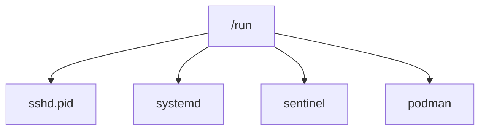

Son contenu est recréé à chaque démarrage.

Il ne doit jamais contenir de données permanentes.

---

## Le répertoire /opt

Le répertoire :

```text
/opt
```

est réservé aux applications tierces installées indépendamment du système.

Par exemple.

```text
/opt/google

/opt/oracle

/opt/mon_application
```

Historiquement,

certaines entreprises installaient leurs logiciels dans `/opt`.

Aujourd'hui,

dans le monde RPM,

on privilégie généralement :

- `/usr` pour les exécutables ;
- `/etc` pour la configuration ;
- `/var/lib` pour les données.

Nous suivrons cette approche avec Sentinel.

---

## Le répertoire /dev

Sous Linux,

les périphériques apparaissent sous forme de fichiers.

Ils sont accessibles dans :

```text
/dev
```

Par exemple.

```text
/dev/sda

/dev/null

/dev/random

/dev/tty

/dev/zero
```

Visualisons.

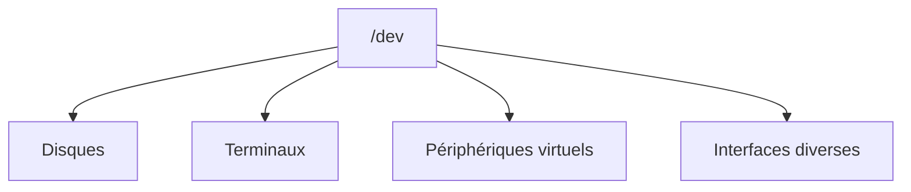

Cette approche illustre parfaitement une célèbre philosophie Unix.

> **Tout est un fichier.**

---

## Le répertoire /proc

Le contenu de :

```text
/proc
```

n'est pas réellement stocké sur le disque.

Il est généré dynamiquement par le noyau.

On y trouve par exemple.

```text
/proc/cpuinfo

/proc/meminfo

/proc/version

/proc/modules
```

Visualisons.

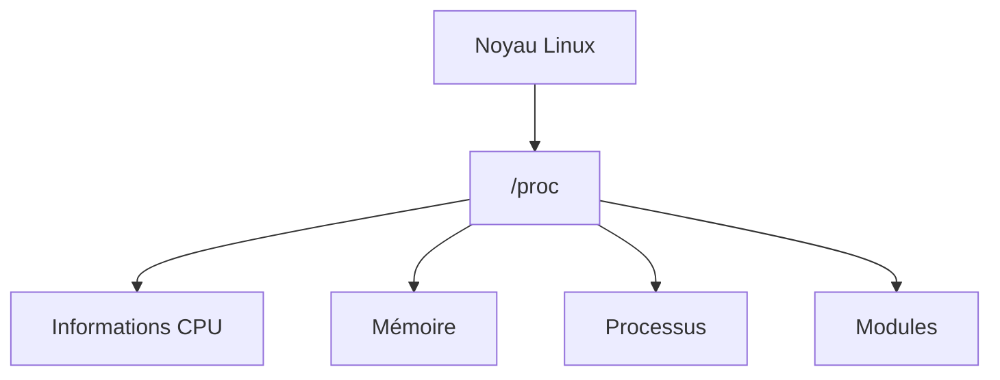

Lorsque vous consultez ces fichiers,

vous interrogez directement le noyau.

---

## Tout est organisé

Nous pouvons maintenant résumer les rôles.

| Répertoire | Contenu |
|------------|----------|
| `/etc` | Configuration |
| `/usr` | Logiciels installés |
| `/var` | Données variables |
| `/home` | Données utilisateurs |
| `/tmp` | Fichiers temporaires |
| `/run` | Données d'exécution |
| `/opt` | Applications tierces |
| `/dev` | Périphériques |
| `/proc` | Informations du noyau |

Cette organisation est commune à la majorité des distributions Linux.

---

## Où placer Sentinel ?

Notre application suivra les recommandations du FHS.

Visualisons.

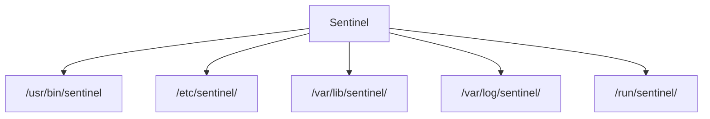

Chaque composant possède un emplacement précis.

| Élément | Emplacement |
|----------|-------------|
| Exécutable | `/usr/bin/sentinel` |
| Configuration | `/etc/sentinel/` |
| Journaux | `/var/log/sentinel/` |
| Données | `/var/lib/sentinel/` |
| Runtime | `/run/sentinel/` |

Cette organisation sera conservée tout au long du projet.

---

## Pourquoi cette organisation est-elle importante ?

Prenons un exemple.

Un administrateur souhaite :

- sauvegarder la configuration ;
- nettoyer les journaux ;
- migrer les données ;
- remplacer le programme.

Grâce au FHS,

chaque opération devient évidente.

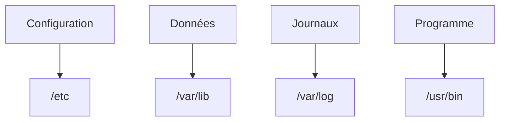

Une application qui respecte cette organisation est :

- plus facile à maintenir ;
- plus simple à sauvegarder ;
- plus simple à empaqueter ;
- plus simple à automatiser avec Ansible.

---
## 💎 Le point d'expertise

### Le FHS est un contrat entre les développeurs et les administrateurs

Le **Filesystem Hierarchy Standard (FHS)** n'est pas seulement une convention.

C'est un véritable contrat.

Le développeur s'engage à placer chaque élément de son application au bon endroit.

L'administrateur sait alors immédiatement :

- où trouver la configuration ;
- où consulter les journaux ;
- où sauvegarder les données ;
- où se trouve l'exécutable.

Visualisons.

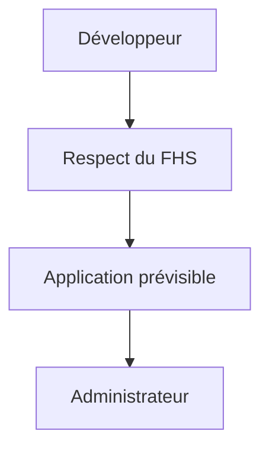

Cette standardisation est l'une des raisons pour lesquelles l'administration Linux est aussi homogène.

---

### Pourquoi ne pas tout mettre dans un seul dossier ?

Sous Windows,

de nombreuses applications installent toute leur arborescence dans un unique répertoire.

Par exemple.

```text
C:\Program Files\MonApplication\
```

Sous Linux,

cette approche est déconseillée.

Le FHS préfère répartir les éléments selon leur rôle.

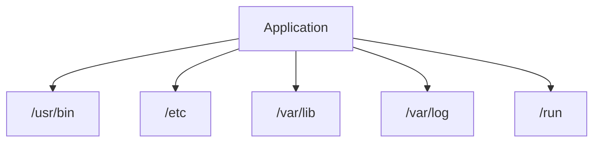

Cette organisation apporte plusieurs avantages.

- sauvegarder uniquement la configuration ;
- déplacer les données sans toucher au programme ;
- nettoyer les journaux indépendamment ;
- mettre à jour l'application sans écraser la configuration.

---

### Pourquoi séparer les données des exécutables ?

Imaginons une mise à jour de Sentinel.

Le paquet RPM remplace :

```text
/usr/bin/sentinel
```

Mais il ne touche pas à :

```text
/etc/sentinel/
```

ni à :

```text
/var/lib/sentinel/
```

Visualisons.

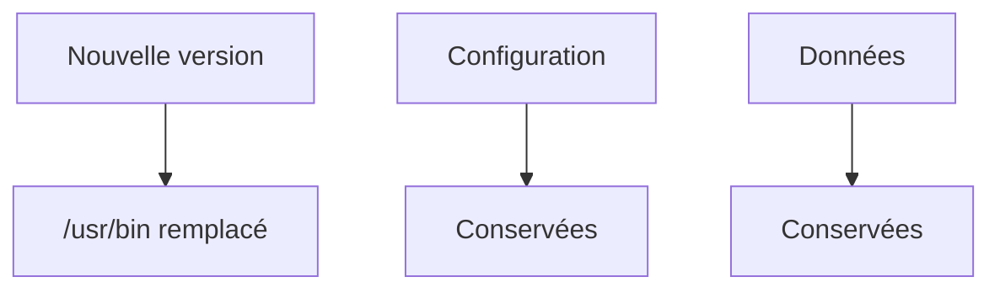

Cette séparation permet de mettre à jour une application sans perdre les paramètres de production.

C'est l'un des fondements des distributions Linux professionnelles.

---

### Pourquoi les journaux sont-ils séparés ?

Les journaux peuvent représenter plusieurs gigaoctets.

Ils évoluent constamment.

Ils ne doivent donc jamais être mélangés avec :

- les exécutables ;
- les bibliothèques ;
- les fichiers de configuration.

Le répertoire :

```text
/var/log
```

est conçu spécialement pour eux.

Cette organisation permet :

- la rotation automatique des journaux ;
- leur archivage ;
- leur suppression sans impacter l'application.

Nous étudierons plus tard `logrotate` et `journald`.

---

## 🧠 Comment pense un architecte ?

Avant même d'écrire la première ligne de code,

un architecte dessine souvent l'arborescence de son application.

Pour Sentinel.

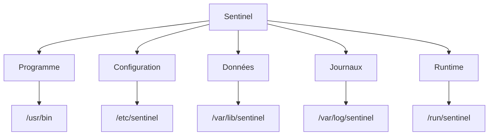

Une fois cette architecture définie,

le développement devient beaucoup plus simple.

Toutes les futures décisions respecteront cette organisation.

---

### Le FHS facilite les sauvegardes

Imaginons que vous deviez sauvegarder Sentinel.

Grâce au FHS,

vous savez immédiatement quoi sauvegarder.

| Élément | Répertoire | Sauvegarde ? |
|---------|------------|:------------:|
| Exécutable | `/usr/bin` | ❌ (réinstallable) |
| Configuration | `/etc/sentinel` | ✅ |
| Données métier | `/var/lib/sentinel` | ✅ |
| Journaux | `/var/log/sentinel` | Selon la politique |
| Runtime | `/run/sentinel` | ❌ |

Cette séparation est extrêmement précieuse lors d'une restauration après incident.

---

## ⚔️ Comment pense un attaquant ?

Lorsqu'un attaquant compromet un serveur,

il connaît parfaitement le FHS.

Il sait donc immédiatement où chercher.

Par exemple.

```text
/etc
```

→ fichiers de configuration

```text
/var/lib
```

→ bases de données

```text
/var/log
```

→ journaux pouvant révéler l'activité

```text
/home
```

→ clés SSH et fichiers utilisateurs

Autrement dit,

le FHS aide autant l'administrateur que l'attaquant.

La différence est que l'administrateur utilise cette connaissance pour protéger ces emplacements.

---

## 🏢 En entreprise

Dans une grande infrastructure,

des dizaines d'équipes interviennent sur les serveurs.

Le respect du FHS leur permet de collaborer sans ambiguïté.

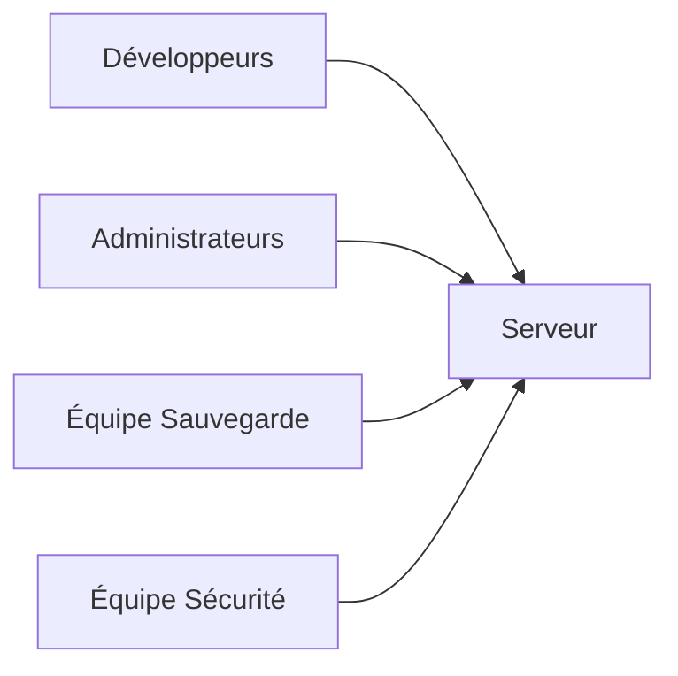

Chaque équipe sait immédiatement :

- où chercher les journaux ;
- où sauvegarder les données ;
- où déployer les exécutables ;
- où auditer les configurations.

Cette standardisation réduit fortement les erreurs d'exploitation.

---

## 📚 Culture technique

### Pourquoi dit-on que « tout est un fichier » ?

L'une des caractéristiques historiques d'Unix est la volonté d'unifier les interfaces.

Ainsi,

de nombreux objets sont représentés comme des fichiers :

- un disque (`/dev/sda`) ;
- un terminal (`/dev/tty`) ;
- un générateur aléatoire (`/dev/random`) ;
- des informations système (`/proc`) ;
- certains sockets Unix.

Pour un programme,

l'accès à ces ressources se fait souvent avec les mêmes appels système (`open`, `read`, `write`, `close`).

Cette philosophie simplifie énormément le développement des applications.

Elle explique pourquoi Linux présente une grande cohérence malgré sa richesse fonctionnelle.

---
## ⚠️ Piège classique

### Créer une arborescence personnelle

Il est fréquent de voir des applications installées ainsi.

```text
/monappli

/monappli/bin

/monappli/config

/monappli/log

/monappli/data
```

Ou encore.

```text
/root/application
```

Ou pire.

```text
/home/admin/application
```

Cette organisation fonctionne…

mais uniquement tant que son auteur est présent.

Un autre administrateur ne saura pas :

- où se trouve la configuration ;
- où sauvegarder les données ;
- où consulter les journaux.

Une application Linux professionnelle doit toujours respecter le FHS.

---

### Écrire des données dans /usr

Une erreur fréquente consiste à enregistrer des données dans :

```text
/usr
```

Par exemple.

```text
/usr/bin/database.db

/usr/share/logs

/usr/config.backup
```

Cette pratique est déconseillée.

Pourquoi ?

Parce que :

- une mise à jour RPM peut remplacer ces fichiers ;
- `/usr` peut être monté en lecture seule ;
- les sauvegardes deviennent incohérentes.

La règle est simple.

```text
Programme

↓

/usr
```

```text
Configuration

↓

/etc
```

```text
Données

↓

/var/lib
```

```text
Journaux

↓

/var/log
```

---

### Utiliser /tmp comme stockage permanent

Certains développeurs utilisent :

```text
/tmp
```

comme répertoire de stockage.

Exemple.

```python
/tmp/database.sqlite
```

Le programme fonctionne…

jusqu'au prochain redémarrage.

En effet,

le contenu de `/tmp` peut être supprimé automatiquement.

Une donnée importante ne doit jamais y être conservée.

---

## Laboratoire AlmaLinux

### Objectif

Découvrir concrètement l'organisation du système de fichiers.

---

### Étape 1 — Explorer la racine

Afficher.

```bash
ls /
```

Identifier chacun des principaux répertoires.

- etc
- usr
- var
- home
- run
- proc
- dev
- tmp

Essayez d'expliquer leur rôle avec vos propres mots.

---

### Étape 2 — Explorer la configuration

Afficher.

```bash
ls /etc
```

Identifier quelques sous-répertoires connus.

Par exemple.

- ssh
- systemd
- dnf
- pki

Observer qu'il s'agit essentiellement de fichiers de configuration.

---

### Étape 3 — Explorer /var

Afficher.

```bash
tree -L 2 /var
```

ou.

```bash
find /var -maxdepth 2 -type d
```

Repérer notamment.

- log
- lib
- cache
- spool
- tmp

Essayez de deviner le rôle de chacun avant de consulter la documentation.

---

### Étape 4 — Observer /proc

Afficher.

```bash
cat /proc/version
```

Puis.

```bash
cat /proc/meminfo
```

Enfin.

```bash
cat /proc/cpuinfo
```

Constater que ces informations proviennent directement du noyau.

---

### Étape 5 — Concevoir l'arborescence de Sentinel

Dessinez l'organisation suivante.

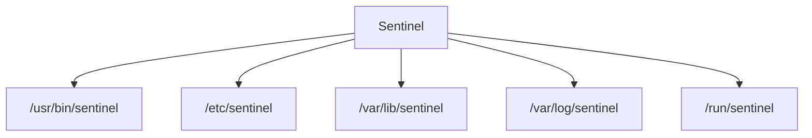

Expliquez pourquoi chaque élément est placé à cet emplacement.

---

## Mission d'ingénieur

Votre entreprise souhaite développer une nouvelle application de supervision.

Avant d'écrire la moindre ligne de code,

vous devez proposer son implantation complète dans le système Linux.

Votre proposition devra préciser.

- où sera installé l'exécutable ;
- où sera stockée la configuration ;
- où seront écrits les journaux ;
- où seront conservées les données métier ;
- où seront créés les fichiers temporaires ;
- où seront placés les sockets Unix et les PID.

Votre objectif est de produire une architecture conforme au FHS,

compatible avec RPM,

systemd,

SELinux

et les bonnes pratiques des distributions Enterprise.

---

## Impact sur Sentinel

À partir de maintenant,

toutes les décisions prises concernant Sentinel respecteront cette architecture.

Cela aura un impact sur :

- la création du paquet RPM ;
- l'unité systemd ;
- les politiques SELinux ;
- les sauvegardes ;
- les scripts Ansible ;
- les mises à jour.

En respectant le FHS dès le départ,

nous éviterons de nombreuses difficultés lors de l'industrialisation du projet.

---

## Synthèse

- Linux organise tous les fichiers selon une hiérarchie unique dont la racine est `/`.
- Le **Filesystem Hierarchy Standard (FHS)** définit l'emplacement des programmes, configurations, données et journaux.
- Une application professionnelle répartit ses composants selon leur rôle plutôt que dans un répertoire unique.
- Les exécutables vont généralement dans `/usr`, les configurations dans `/etc`, les données persistantes dans `/var/lib`, les journaux dans `/var/log` et les fichiers d'exécution dans `/run`.
- Respecter le FHS simplifie les sauvegardes, les mises à jour RPM, l'administration et l'automatisation.
- Sentinel adoptera cette organisation dès sa première version.

---

## Infographie de révision

```text
┌──────────────────────────────────────────────────────────────────────────────────────────────┐
│       CHAPITRE 1.6 — ARCHITECTURE DES SYSTÈMES DE FICHIERS                                   │
├──────────────────────────────────────────────────────────────────────────────────────────────┤
│                                                                                              │
│                            LA RACINE                                                         │
│                                                                                              │
│                                  /                                                           │
│                                  │                                                           │
│        ┌──────────┬──────────┬──────────┬──────────┬──────────┐                              │
│        │          │          │          │          │          │                              │
│      /etc      /usr       /var      /home      /run      /tmp ...                           │
│                                                                                              │
├──────────────────────────────────────────────────────────────────────────────────────────────┤
│                         RÔLE DES PRINCIPAUX DOSSIERS                                          │
│                                                                                              │
│ /etc       → Configuration                                                                   │
│ /usr       → Programmes et bibliothèques                                                     │
│ /var/lib   → Données persistantes                                                            │
│ /var/log   → Journaux                                                                        │
│ /run       → Runtime (PID, sockets...)                                                       │
│ /tmp       → Fichiers temporaires                                                            │
│ /home      → Données des utilisateurs                                                        │
│ /dev       → Périphériques                                                                   │
│ /proc      → Informations du noyau                                                           │
│ /opt       → Applications tierces                                                            │
│                                                                                              │
├──────────────────────────────────────────────────────────────────────────────────────────────┤
│                      ARCHITECTURE DE SENTINEL                                                 │
│                                                                                              │
│ /usr/bin/sentinel        → Exécutable                                                        │
│ /etc/sentinel/           → Configuration                                                     │
│ /var/lib/sentinel/       → Données métier                                                    │
│ /var/log/sentinel/       → Journaux                                                          │
│ /run/sentinel/           → PID, sockets, runtime                                             │
│                                                                                              │
├──────────────────────────────────────────────────────────────────────────────────────────────┤
│                          BONNES PRATIQUES                                                     │
│                                                                                              │
│ ✔ Respecter le FHS                                                                           │
│ ✔ Séparer programme, configuration et données                                                │
│ ✔ Utiliser /run pour le runtime                                                              │
│ ✔ Utiliser /var/log pour les journaux                                                        │
│ ✔ Utiliser /var/lib pour les données                                                         │
│ ✘ Écrire des données dans /usr                                                               │
│ ✘ Stocker des données permanentes dans /tmp                                                  │
│ ✘ Inventer sa propre arborescence                                                            │
│                                                                                              │
├──────────────────────────────────────────────────────────────────────────────────────────────┤
│                               IDÉE CLÉ                                                       │
│                                                                                              │
│ « Une application Linux professionnelle n'est pas                                            │
│  seulement un programme. Elle s'intègre à une                                                │
│  architecture normalisée que tous les administrateurs                                        │
│  savent immédiatement comprendre. »                                                          │
└──────────────────────────────────────────────────────────────────────────────────────────────┘
```

---

← [1.5 — Mise à jour et gestion des dépôts](1.5-mise-a-jour-gestion-depots.md) · [1.7 — Utilisateurs, groupes et permissions](1.7-utilisateurs-groupes-permissions.md) →
