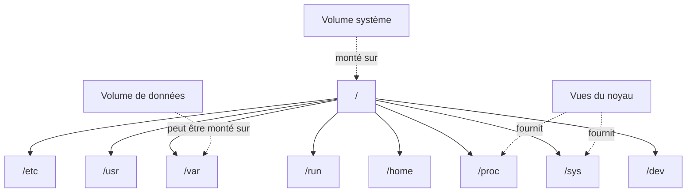
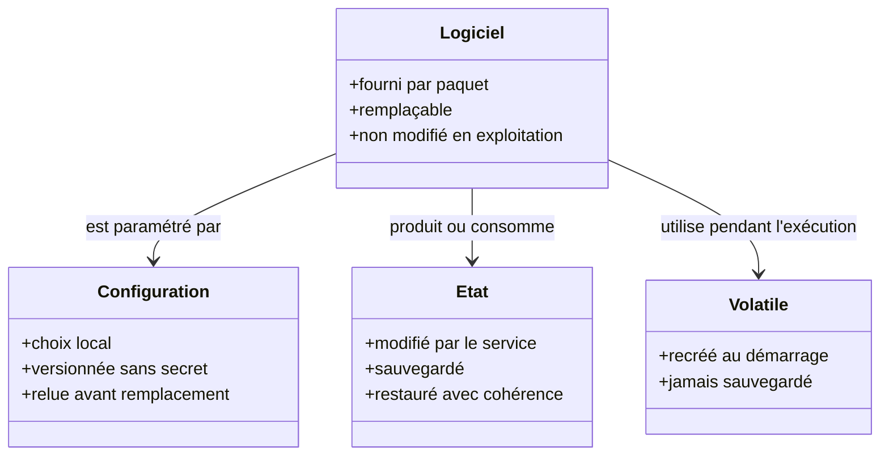
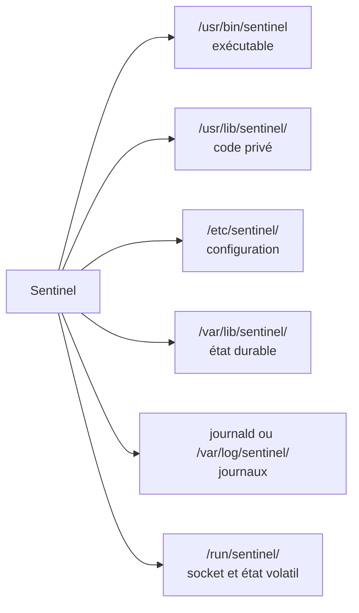
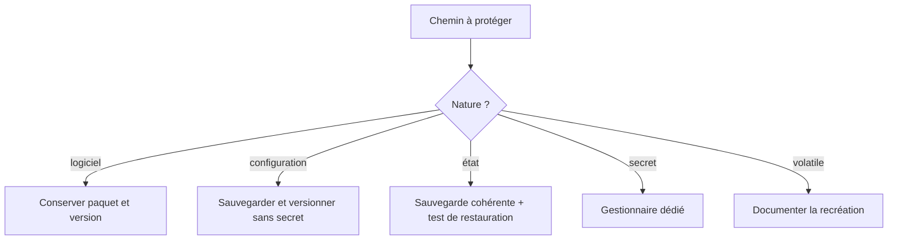
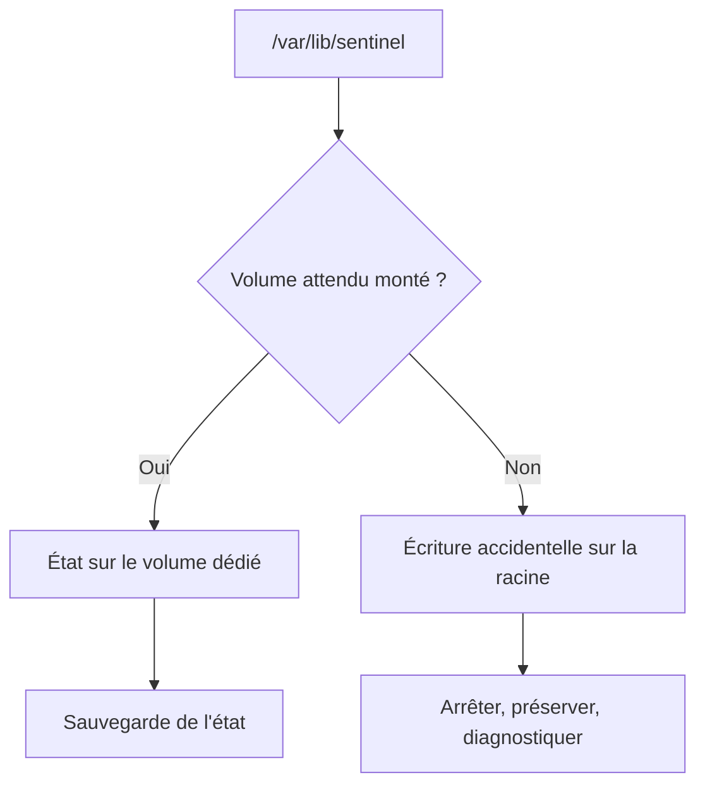

# Chapitre 1.6 — Organiser les systèmes de fichiers

> **Campagne 1 — Installation et fondations**

> *« Le chemin d'un fichier exprime son rôle et son cycle de vie. »*

## Vous êtes ici

```text
PARTIE I — Construire un socle sécurisé

Campagne 1

  1.1 Pourquoi sécuriser un socle Linux ? ✔
  1.2 Installer AlmaLinux minimal ✔
  1.3 Comprendre les composants du système ✔
  1.4 Établir la baseline du serveur ✔
  1.5 Mettre à jour et gérer les dépôts ✔
► 1.6 Organiser les systèmes de fichiers
  1.7 Comprendre identités et permissions
  1.8 Administrer avec sudo
  1.9 Mission : mettre le serveur en sécurité
  1.10 Créer le laboratoire Sentinel
```

## Objectifs pédagogiques

À l'issue de ce chapitre, vous serez capable de :

- expliquer l'arbre unique de Linux et le rôle du Filesystem Hierarchy Standard ;
- classer un fichier selon sa fonction et sa durée de vie ;
- distinguer contenu fourni par un paquet, configuration locale, état, journal et donnée volatile ;
- choisir les emplacements de Sentinel et leur politique de sauvegarde ;
- diagnostiquer un chemin sans modifier arbitrairement ses permissions.

## Pourquoi ce chapitre existe

Une application peut fonctionner tout en plaçant son exécutable, sa configuration, ses données et ses journaux dans un même répertoire. Cette facilité initiale devient vite un problème : une mise à jour écrase une configuration, une sauvegarde collecte des fichiers temporaires, un service écrit dans un emplacement réputé immuable ou un administrateur ne sait pas quel contenu restaurer.

Linux organise les fichiers selon leur rôle. Cette convention crée un contrat entre paquet, administrateur, service, sauvegarde et outils de sécurité. Sentinel l'adoptera dès sa conception.

## Un seul arbre, plusieurs systèmes de fichiers

Tous les chemins partent de `/`. Des systèmes de fichiers différents peuvent être montés à divers points de cet arbre sans créer de lettres de lecteur.



`findmnt` indique la source, le type et les options des montages :

```bash
findmnt --real
findmnt / /var /home
df -hT
```

Le chemin logique reste stable même si l'administrateur change plus tard le volume sous-jacent. Cette abstraction facilite l'évolution du stockage, à condition de documenter les montages.

## Le FHS comme contrat

Le **Filesystem Hierarchy Standard** décrit le rôle de répertoires communs. Toutes les distributions et applications n'appliquent pas chaque détail de manière identique, mais le modèle suivant suffit pour prendre de bonnes décisions.

| Chemin | Rôle principal | Exemple Sentinel |
| --- | --- | --- |
| `/usr/bin` | exécutables fournis et gérés comme logiciels | commande `sentinel` |
| `/usr/lib` | bibliothèques et contenu privé au logiciel | modules applicatifs |
| `/etc` | configuration locale de l'hôte | `/etc/sentinel/sentinel.conf` |
| `/var/lib` | état durable modifié par le service | base ou état Sentinel |
| `/var/log` | journaux persistants si l'application les écrit | `/var/log/sentinel/` |
| `/run` | état volatil depuis le démarrage | PID ou socket d'exécution |
| `/tmp` | fichiers temporaires partagés | travail non durable |
| `/home` | données personnelles des utilisateurs | sources du développeur, pas état du service |
| `/opt` | logiciels additionnels autonomes selon politique | non retenu pour le RPM natif Sentinel |

Le chemin ne définit pas seul les permissions ni la sauvegarde, mais il annonce une intention que les outils peuvent comprendre.

## Séparer quatre cycles de vie

Pour une application, quatre catégories structurent presque toutes les décisions.



### Logiciel fourni par paquet

Les fichiers sous `/usr` doivent être installés et remplacés par le gestionnaire de paquets. Le service ne doit pas y écrire pendant son exécution. Une modification locale serait perdue ou signalée lors d'une vérification RPM.

### Configuration locale

`/etc` contient les décisions propres à l'hôte : ports, chemins, limites, références vers des secrets. La configuration doit être lisible, validable et sauvegardée. Un secret n'est pas une configuration ordinaire : ses permissions, sa rotation et son stockage exigent un traitement séparé.

### État durable et journaux

`/var/lib` contient ce que le service doit retrouver après redémarrage. `/var/log` reçoit les journaux lorsque ceux-ci sont écrits dans des fichiers ; une application intégrée à systemd peut aussi envoyer sa sortie à journald. L'état et les journaux ont des politiques de rétention et de restauration différentes.

### État volatil et temporaire

`/run` est recréé au démarrage et convient aux sockets, PID ou verrous. `/tmp` accueille des données temporaires, souvent dans un espace partagé et nettoyé. Aucun de ces emplacements ne doit devenir la seule copie d'une donnée durable.

## Concevoir l'arborescence de Sentinel

Le modèle retenu est volontairement prévisible :



| Objet | Propriétaire de la création | Écriture en exploitation | Sauvegarde |
| --- | --- | --- | --- |
| exécutable et code | RPM | non | reconstruits depuis le dépôt |
| configuration | RPM puis administrateur | administrateur | oui, sans exposer les secrets |
| état durable | RPM crée le répertoire, service écrit | compte `sentinel` | oui |
| journaux | service ou journald | service de journalisation | selon rétention |
| runtime | systemd au démarrage | compte `sentinel` | non |

Le paquet préparera les répertoires et leurs métadonnées ; l'unité systemd pourra créer `/run/sentinel` à chaque démarrage. L'application n'aura pas à lancer `sudo` ni à créer sa propre convention sous la racine.

## Sauvegarder selon le rôle

« Sauvegarder Sentinel » recouvre plusieurs opérations :

- le logiciel est reconstruit depuis un paquet identifié ;
- la configuration est sauvegardée et relue comme du texte ;
- l'état applicatif suit une procédure cohérente, éventuellement après arrêt ou export ;
- les secrets sont restaurés depuis leur système de gestion ;
- les journaux suivent une politique de conservation, pas forcément la restauration applicative ;
- `/run` et les caches sont recréés.



Une copie n'est une sauvegarde utile que si sa restauration a été testée avec la version compatible de l'application.

## Diagnostiquer un chemin

Lorsqu'un accès échoue, ne commencez pas par `chmod 777`. Identifiez chaque composant du chemin et le montage :

```bash
namei -l /var/lib/sentinel/data.db
findmnt -T /var/lib/sentinel/data.db
ls -ld /var /var/lib /var/lib/sentinel
stat /var/lib/sentinel/data.db
```

`namei -l` montre les permissions de tous les répertoires traversés. `findmnt -T` révèle le système de fichiers et ses options. Une écriture peut être bloquée par un parent non traversable, un montage en lecture seule, des permissions Unix ou SELinux. Modifier au hasard le dernier fichier masque la cause.

Pour relier un fichier système à son paquet :

```bash
rpm -qf /usr/bin/ls
rpm -V "$(rpm -qf /usr/bin/ls)"
```

Un fichier sous `/etc` peut être fourni initialement par un paquet puis modifié légitimement par l'administrateur ; sa divergence doit être comprise, pas automatiquement effacée.

### Liens, inodes et chemins réels

Le nom visible n'est pas toujours l'objet final. Un **lien symbolique** contient un autre chemin ; un **lien physique** ajoute un nom vers le même inode sur un système de fichiers compatible. Les permissions et la sauvegarde doivent tenir compte de cette résolution.

```bash
ls -li /etc/os-release /usr/lib/os-release
readlink -f /etc/os-release
namei -l /etc/os-release
```

Le résultat dépend de la distribution installée, mais il montre comment un chemin sous `/etc` peut référencer un fichier fourni sous `/usr/lib`. Modifier la cible ou remplacer le lien n'a pas le même sens. Avant une correction, vérifiez toujours le chemin canonique et le paquet propriétaire.

Les montages peuvent également masquer le contenu qui existait sous un point de montage. Si un volume prévu pour `/var/lib/sentinel` n'est pas monté, le service pourrait écrire sur le système racine ; lorsque le volume revient, ces données deviennent invisibles sans avoir disparu. Une unité systemd peut exiger un montage avant de démarrer l'application, et la baseline doit confirmer la source réellement montée.



Enfin, supprimer un fichier retire un nom ; l'espace n'est libéré que lorsque plus aucun lien et plus aucun processus ouvert ne le retiennent. Un journal supprimé mais encore ouvert peut continuer à occuper le disque. `lsof +L1` aide à identifier ce cas si l'outil est disponible. Cette nuance évite de conclure qu'un `rm` a nécessairement rendu l'espace.

Chemins, montages, liens et processus ouverts forment donc une seule question d'exploitation : **quel objet le service utilise-t-il réellement ?**

## TP 1 — Classer l'arborescence réelle

Explorez sans parcourir récursivement tout le disque :

```bash
ls -ld /etc /usr /var /run /tmp /home /opt
findmnt --real
du -sh /etc /var/log /var/lib 2>/dev/null
```

Choisissez ensuite dix fichiers ou répertoires représentatifs. Pour chacun, indiquez : rôle, caractère durable ou volatil, propriétaire RPM éventuel, auteur des modifications et stratégie de sauvegarde.

Ajoutez au moins un objet sous `/proc` ou `/sys` et expliquez pourquoi `du`, la sauvegarde et la restauration ordinaires ne s'y appliquent pas de la même manière.

## TP 2 — Prototyper les chemins de Sentinel

Dans votre répertoire personnel, simulez l'arborescence sans écrire dans le vrai système :

```bash
mkdir -p ~/sentinel-fhs/{usr/bin,usr/lib/sentinel,etc/sentinel,var/lib/sentinel,var/log/sentinel,run/sentinel}
find ~/sentinel-fhs -type d -print
```

Placez des fichiers factices représentant exécutable, configuration, état, journal et socket. Pour chacun, rédigez : qui le crée, qui le modifie, quand il disparaît et comment il est restauré. Supprimez le prototype à la fin si vous le souhaitez ; ne le confondez pas avec l'installation réelle.

## Mission d'ingénieur — Écrire la politique de placement

Produisez une décision d'architecture pour Sentinel qui couvre :

1. le chemin de chaque catégorie de fichier ;
2. son propriétaire logique ;
3. les écritures nécessaires en exploitation ;
4. le composant responsable de sa création ;
5. sa rétention et sa sauvegarde ;
6. son comportement lors d'une mise à jour ;
7. son comportement après redémarrage ;
8. la commande permettant de diagnostiquer un accès refusé.

Refusez explicitement deux anti-modèles : état durable sous `/usr` et configuration active dans le répertoire personnel d'un administrateur.

## Impact sur Sentinel

Sentinel dispose désormais d'une architecture de fichiers avant même d'être installé. Cette décision séparera le code remplaçable, la configuration locale, l'état durable, les journaux et l'exécution volatile. Elle préparera les permissions du compte de service, le paquet RPM, l'unité systemd, SELinux et les sauvegardes.

## Synthèse

- Linux présente un arbre unique auquel plusieurs systèmes de fichiers peuvent être montés.
- Le FHS exprime le rôle attendu d'un chemin et facilite l'interopérabilité des outils.
- Logiciel, configuration, état, journaux et données volatiles ont des cycles de vie différents.
- Le code géré par paquet ne doit pas être modifié par le service.
- La sauvegarde dépend de la nature de l'objet et doit être testée par restauration.
- `namei`, `findmnt`, `stat` et RPM aident à diagnostiquer un chemin avant de changer ses droits.

## Infographie de révision

```text
/usr ─────────► LOGICIEL       ─► paquet, remplaçable, lecture seule
/etc ─────────► CONFIGURATION  ─► décision locale, sauvegardée
/var/lib ─────► ÉTAT           ─► durable, écriture du service
/var/log ─────► JOURNAUX       ─► rétention et analyse
/run ─────────► EXÉCUTION      ─► volatil, recréé au démarrage
/tmp ─────────► TEMPORAIRE     ─► non durable, non fiable comme stockage

UN RÔLE → UN CHEMIN → UN PROPRIÉTAIRE → UN CYCLE DE VIE
```

## Pour aller plus loin

Consultez `man hier`, `man file-hierarchy`, `man findmnt` et les recommandations de packaging de la distribution installée. Elles précisent les conventions lorsque plusieurs emplacements semblent possibles.

Chapitre suivant : donner une identité aux utilisateurs et aux processus, puis comprendre les premières décisions de permissions Unix.

← [1.5 — Mettre à jour et gérer les dépôts](1.5-mise-a-jour-gestion-depots.md) · [1.7 — Comprendre identités et permissions](1.7-utilisateurs-groupes-permissions.md) →
