# Campagne 1 — Installation et fondations

# Chapitre 1.6 — Les permissions Linux

> *« Les utilisateurs représentent les identités. Les permissions définissent ce que ces identités sont autorisées à faire. »*

---

# Vous êtes ici

```text
Partie I — Construire un socle sécurisé

Campagne 1 — Installation et fondations

      1.1 Pourquoi sécuriser un socle Linux ?
      1.2 Installation d'AlmaLinux Minimal
      1.3 Comprendre les privilèges
      1.4 Le système de fichiers
      1.5 Utilisateurs et groupes
    ► 1.6 Permissions Linux
      1.7 sudo et moindre privilège
      1.8 Première sécurisation de Sentinel
```

---

# Objectifs pédagogiques

À la fin de ce chapitre, vous serez capable de :

- comprendre le modèle de permissions Linux ;
- interpréter les sorties de `ls -l` ;
- distinguer les permissions de lecture, d'écriture et d'exécution ;
- comprendre le rôle du propriétaire, du groupe et des autres utilisateurs ;
- modifier les permissions en toute sécurité.

---

# Pourquoi ce chapitre existe

Nous savons désormais :

- ce qu'est un utilisateur ;
- ce qu'est un groupe ;
- ce qu'est un privilège.

Mais une question reste entière.

> **Comment Linux décide-t-il qu'un utilisateur peut ou non accéder à un fichier ?**

La réponse repose sur un mécanisme extrêmement ancien,

mais toujours utilisé aujourd'hui :

**les permissions Unix**.

Chaque fichier,

chaque répertoire,

chaque script,

chaque exécutable

possède des permissions.

Ces permissions constituent la première ligne de défense du système de fichiers.

---

# Une décision prise par le noyau

Lorsqu'un processus tente d'accéder à un fichier,

le noyau suit toujours le même raisonnement.

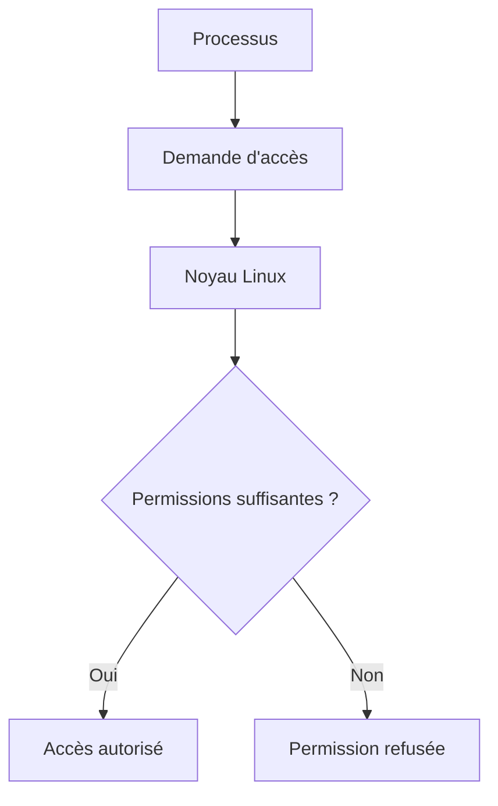

Aucun programme ne décide lui-même de ses droits.

Le noyau reste l'arbitre.

---

# Observer les permissions

La commande la plus utilisée est :

```bash
ls -l
```

Par exemple.

```text
-rwxr-x--- 1 sentinel sentinel 18432 Jun 10 18:15 sentinel
```

Au premier regard,

cette ligne paraît difficile à comprendre.

Pourtant,

elle contient énormément d'informations.

Nous allons la décoder progressivement.

---

# La structure générale

Découpons cette ligne.


Chaque champ possède une signification précise.

Dans ce chapitre,

nous nous concentrerons principalement sur les permissions.

---

# Les trois catégories

Linux distingue toujours trois catégories d'utilisateurs.

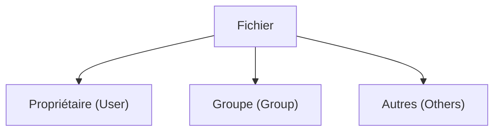

Chaque catégorie possède son propre jeu de permissions.

C'est l'un des principes fondateurs des systèmes Unix.

---

# Les trois permissions

Pour chacune des trois catégories,

Linux définit trois droits.


En anglais.

| Lettre | Signification |
|---------|---------------|
| r | Read |
| w | Write |
| x | Execute |

Ces trois lettres apparaissent dans toutes les sorties de `ls -l`.

---

# Lecture, écriture, exécution

Prenons un fichier.

```text
rwx
```

Cela signifie.

- **r** → le fichier peut être lu ;
- **w** → il peut être modifié ;
- **x** → il peut être exécuté.

Inversement.

```text
r--
```

autorise uniquement la lecture.

Et.

```text
---
```

interdit totalement l'accès.

Ces combinaisons seront omniprésentes dans la suite de la formation.

---
# Comment lire rwxr-x---

Reprenons notre exemple.

```text
-rwxr-x---
```

Décomposons-le.

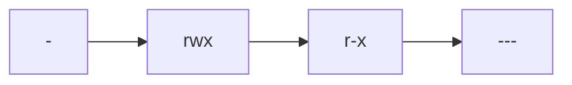

Chaque partie possède une signification.

| Partie | Signification |
|---------|---------------|
| `-` | Type du fichier |
| `rwx` | Permissions du propriétaire |
| `r-x` | Permissions du groupe |
| `---` | Permissions des autres utilisateurs |

Autrement dit.

Le propriétaire peut :

- lire ;
- modifier ;
- exécuter.

Les membres du groupe peuvent :

- lire ;
- exécuter.

Les autres utilisateurs :

- ne peuvent rien faire.

---

# Le premier caractère

Le tout premier caractère ne représente pas une permission.

Il indique le type de l'objet.

Les plus fréquents sont :

| Symbole | Signification |
|----------|---------------|
| `-` | Fichier classique |
| `d` | Répertoire |
| `l` | Lien symbolique |
| `c` | Périphérique caractère |
| `b` | Périphérique bloc |
| `s` | Socket |
| `p` | Tube nommé (FIFO) |

Par exemple.

```text
-rwxr-xr-x
```

est un fichier.

Alors que.

```text
drwx------
```

est un répertoire.

Cette différence est importante,

car les permissions n'ont pas exactement le même sens sur un fichier et sur un répertoire.

---

# Les permissions sur un fichier

Pour un fichier classique,

les trois permissions sont intuitives.

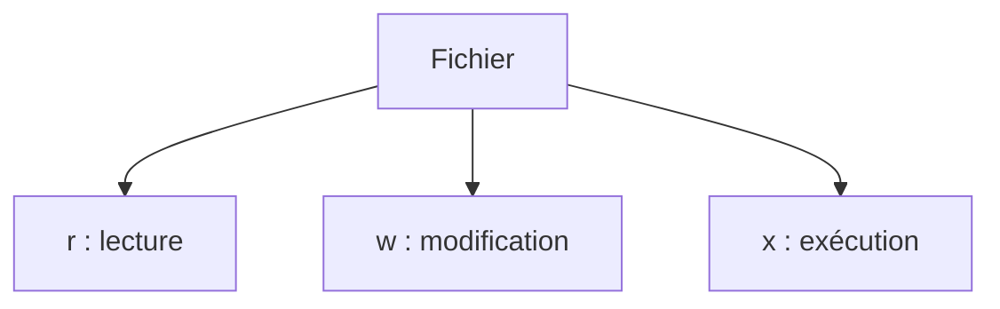

Concrètement.

### r

Autorise :

- l'ouverture ;
- la lecture du contenu.

---

### w

Autorise :

- la modification ;
- l'écriture.

---

### x

Autorise :

- l'exécution comme programme ou script.

Sans le bit `x`,

un script Bash ne pourra pas être exécuté directement.

---

# Les permissions sur un répertoire

Sur un répertoire,

la signification change légèrement.

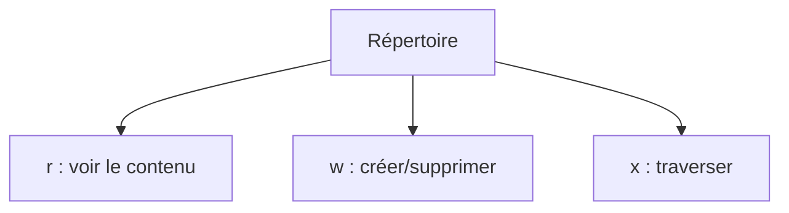

Cette distinction surprend souvent les débutants.

---

## Permission r

Sur un répertoire,

`r` permet de connaître son contenu.

Par exemple.

```bash
ls mon_repertoire
```

---

## Permission w

Elle permet notamment :

- créer un fichier ;
- supprimer un fichier ;
- renommer un fichier.

Attention.

Cette permission ne concerne **pas** directement les fichiers eux-mêmes,

mais le contenu du répertoire.

---

## Permission x

C'est probablement la plus difficile à comprendre.

Elle autorise :

- entrer dans le répertoire ;
- accéder aux fichiers dont on connaît le nom.

Sans ce bit,

même si le répertoire est lisible,

on ne peut pas réellement l'utiliser.

---

# Exemple concret

Prenons un répertoire possédant :

```text
drwx------
```

Le propriétaire peut :

- entrer dedans ;
- afficher son contenu ;
- créer des fichiers ;
- supprimer des fichiers.

Tous les autres utilisateurs sont complètement bloqués.

---

Autre exemple.

```text
dr-xr-xr-x
```

Tout le monde peut :

- parcourir le répertoire ;
- afficher son contenu.

Mais personne (sauf root) ne peut modifier son contenu.

C'est une configuration très fréquente pour les répertoires contenant des programmes système.

---

# Les permissions sont évaluées dans un ordre précis

Supposons que :

- Alice tente d'ouvrir un fichier.

Le noyau suit toujours exactement le même algorithme.

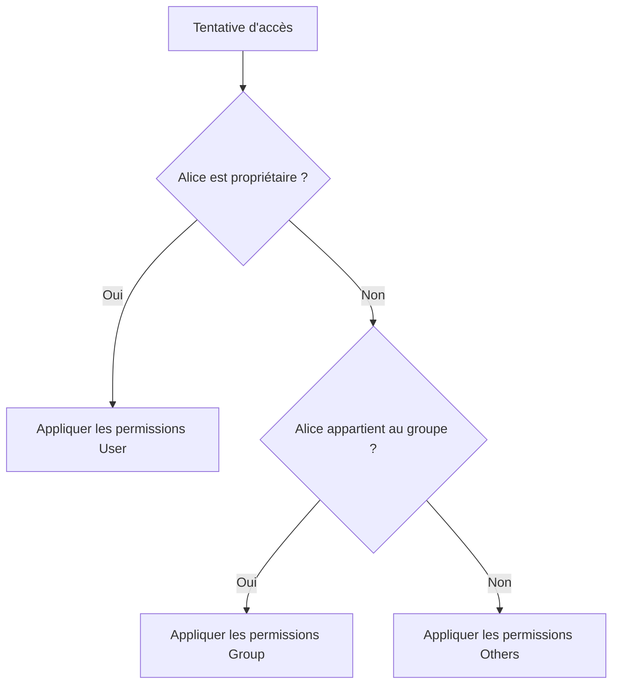

Une fois la catégorie déterminée,

les autres ne sont plus examinées.

Cette règle est extrêmement importante.

Elle explique de nombreux comportements qui semblent surprenants lorsqu'on débute.

---

# Un exemple complet

Imaginons le fichier suivant.

```text
-rw-r-----
```

Propriétaire :

```text
alice
```

Groupe :

```text
developers
```

Visualisons.

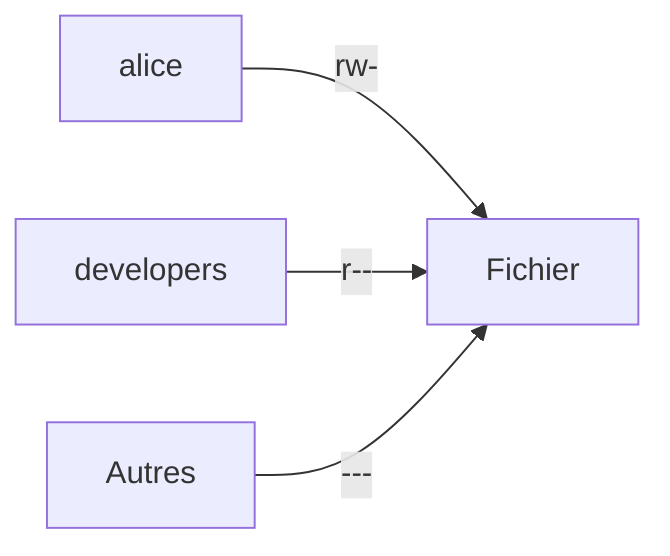

Conséquences.

- Alice peut lire et modifier.
- Les membres du groupe peuvent uniquement lire.
- Tous les autres utilisateurs sont totalement bloqués.

Cette simplicité fait la force du modèle Unix.

---
# 💎 Le point d'expertise

## Les permissions ne sont que la première couche de sécurité

Les permissions Unix sont extrêmement efficaces.

Elles permettent de répondre à une première question.

> **Cet utilisateur est-il autorisé à accéder à ce fichier ?**

Mais elles ne répondent pas à toutes les problématiques de sécurité.

Prenons un exemple.

Le service Sentinel s'exécute sous l'utilisateur :

```text
sentinel
```

Les permissions lui permettent de lire :

```text
/etc/sentinel/config.yml
```

Jusqu'ici,

tout est normal.

Mais imaginons maintenant que Sentinel présente une vulnérabilité.

Un attaquant exploite cette faille et prend le contrôle du processus.

Du point de vue des permissions Linux,

le processus est toujours :

```text
sentinel
```

Le noyau continue donc à lui accorder tous les accès prévus pour cet utilisateur.

Les permissions Unix ne savent pas distinguer :

- le programme légitime ;
- le programme compromis.

C'est précisément la raison d'être de SELinux,

que nous étudierons plus loin.

---

## Les permissions ne suivent pas les utilisateurs mais les fichiers

Une idée reçue consiste à croire qu'un utilisateur possède des permissions.

En réalité,

ce sont les **fichiers** qui possèdent des permissions.

Visualisons.

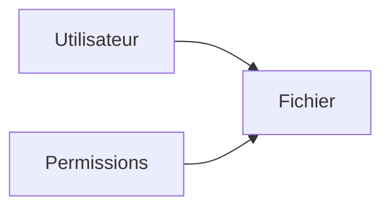

Lorsqu'un accès est demandé,

le noyau compare simplement :

- l'identité du processus ;
- les permissions du fichier.

Le résultat dépend de cette comparaison.

Cette nuance est importante.

---

## Les répertoires protègent les fichiers

Beaucoup de débutants pensent que les permissions d'un fichier suffisent.

Prenons pourtant le cas suivant.

```text
/home/alice/secret.txt
```

Même si :

```text
secret.txt

↓

rw-r--r--
```

est lisible,

l'accès sera impossible si :

```text
/home/alice
```

n'autorise pas la traversée du répertoire.

Autrement dit,

pour atteindre un fichier,

Linux doit également autoriser le passage dans chacun des répertoires parents.

Visualisons.

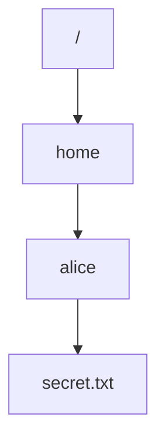

Chaque niveau participe donc au contrôle d'accès.

---

## Les permissions ne protègent pas contre root

Une autre idée importante.

Les permissions Unix protègent principalement les utilisateurs les uns contre les autres.

En revanche,

le superutilisateur peut généralement les contourner.

C'est pourquoi une compromission de root est si critique.

Toute l'architecture moderne consiste justement à éviter que les services s'exécutent sous cette identité.

---

# 🧠 Comment pense un architecte ?

Lorsqu'un architecte crée une nouvelle application,

il ne se demande pas uniquement :

> « Qui peut lire ce fichier ? »

Il réfléchit également à :

- qui peut le modifier ;
- qui peut le supprimer ;
- qui peut créer de nouveaux fichiers dans le même répertoire ;
- qui pourra sauvegarder ces données ;
- qui pourra les restaurer.

Prenons l'exemple de Sentinel.

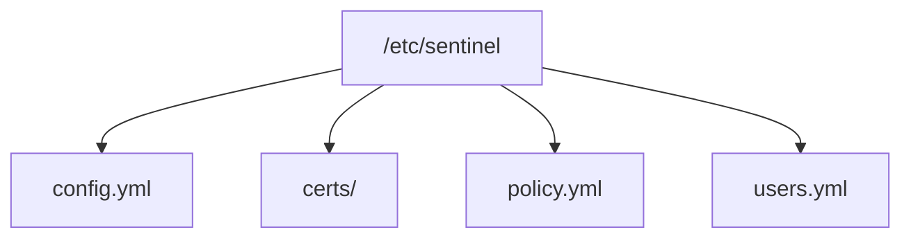

Tous ces fichiers n'ont pas la même sensibilité.

Les certificats,

par exemple,

nécessiteront des permissions beaucoup plus restrictives que certains fichiers de configuration.

---

## Concevoir avant de coder

Un bon architecte définit les permissions **avant même de développer l'application**.

Il répond notamment aux questions suivantes.

- Où seront créés les journaux ?
- Qui pourra les consulter ?
- Qui pourra modifier la configuration ?
- Qui pourra remplacer les certificats ?
- Le service pourra-t-il modifier sa propre configuration ?

Ces décisions influencent directement :

- le paquet RPM ;
- systemd ;
- SELinux ;
- Ansible.

La sécurité ne s'ajoute donc pas après le développement.

Elle est intégrée dès la conception.

---

# ⚔️ Comment pense un attaquant ?

Lorsqu'un attaquant obtient un accès limité,

il recherche immédiatement les fichiers accessibles.

Par exemple.

- fichiers de configuration ;
- clés SSH ;
- certificats ;
- sauvegardes ;
- scripts exécutés par root.

Son objectif est souvent d'obtenir davantage de privilèges.

Une permission trop permissive,

comme :

```text
-rw-rw-rw-
```

peut suffire à compromettre tout un serveur.

C'est pourquoi les permissions doivent toujours être aussi restrictives que possible.

---

# 🏢 En entreprise

Dans une infrastructure professionnelle,

les permissions ne sont presque jamais laissées au hasard.

Les équipes définissent des standards.

Par exemple.

| Élément | Permissions typiques |
|----------|----------------------|
| Configuration | Lecture uniquement pour le service concerné |
| Journaux | Écriture pour le service, lecture pour les administrateurs |
| Certificats privés | Lecture exclusive du service ou de root |
| Exécutables | Lecture et exécution, jamais modifiables par les utilisateurs |
| Répertoires de données | Accès limité au compte de service |

Ces conventions permettent :

- une administration cohérente ;
- des audits simplifiés ;
- une meilleure intégration avec SELinux ;
- une industrialisation facilitée grâce à Ansible.

Elles constituent une étape essentielle avant la mise en place de mécanismes de sécurité plus avancés.

---
# 📚 Culture technique

## Les permissions existent depuis les débuts d'Unix

Le modèle de permissions que nous utilisons aujourd'hui est apparu avec les premiers systèmes Unix au début des années 1970.

À cette époque,

les ordinateurs étaient déjà utilisés simultanément par plusieurs personnes.

Il devenait indispensable de répondre à des questions simples.

- Qui peut lire ce fichier ?
- Qui peut le modifier ?
- Qui peut exécuter ce programme ?

Le modèle :

- **Utilisateur (User)**
- **Groupe (Group)**
- **Autres (Others)**

est né pour répondre à ces besoins.

Plus de cinquante ans plus tard,

il reste toujours utilisé sur la quasi-totalité des systèmes Linux.

---

## Pourquoi seulement trois catégories ?

Une question revient souvent.

Pourquoi Linux ne définit-il que :

- le propriétaire ;
- le groupe ;
- les autres ?

Pourquoi pas dix catégories différentes ?

La réponse est historique.

Les créateurs d'Unix recherchaient un système :

- simple ;
- rapide ;
- compréhensible.

Le modèle devait pouvoir être évalué très rapidement par le noyau.

Aujourd'hui,

ce modèle est parfois insuffisant.

C'est pourquoi Linux propose également :

- les ACL (*Access Control Lists*) ;
- SELinux ;
- AppArmor.

Mais les permissions Unix restent toujours la première couche de contrôle.

---

## La notation numérique

Vous rencontrerez rapidement des commandes comme :

```bash
chmod 750 mon_fichier
```

Pourquoi utiliser des nombres ?

Chaque permission correspond à une valeur binaire.

| Permission | Valeur |
|------------|-------:|
| Lecture (`r`) | 4 |
| Écriture (`w`) | 2 |
| Exécution (`x`) | 1 |

On additionne ensuite les valeurs.

| Valeur | Signification |
|--------:|---------------|
| 7 | rwx |
| 6 | rw- |
| 5 | r-x |
| 4 | r-- |
| 3 | -wx |
| 2 | -w- |
| 1 | --x |
| 0 | --- |

Ainsi,

```text
750
```

correspond à :

```text
rwxr-x---
```

Nous utiliserons cette notation très fréquemment dans les chapitres suivants.

---

## Pourquoi l'exécution est-elle différente sur un répertoire ?

C'est probablement la permission la plus déroutante.

Sur un fichier,

`x` signifie :

> **Le programme peut être exécuté.**

Sur un répertoire,

`x` signifie :

> **Le répertoire peut être traversé.**

Autrement dit,

pour ouvrir :

```text
/home/tom/Documents/secret.txt
```

le noyau doit être autorisé à traverser successivement :

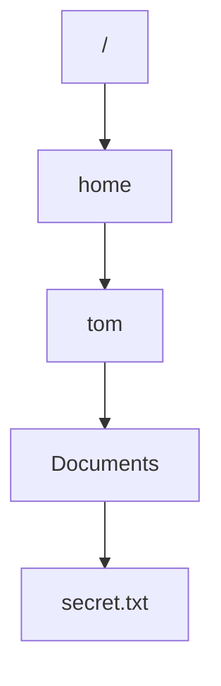

Si une seule étape refuse la traversée,

l'accès au fichier devient impossible,

même si ce dernier est parfaitement lisible.

---

# ⚠️ Piège classique

## Donner les permissions 777

Lorsqu'une application refuse d'accéder à un fichier,

beaucoup de débutants exécutent immédiatement :

```bash
chmod 777 fichier
```

L'erreur disparaît.

Mais une nouvelle vulnérabilité apparaît.

Avec :

```text
rwxrwxrwx
```

tout le monde peut :

- lire ;
- modifier ;
- supprimer ;
- remplacer le fichier.

Cette pratique est fortement déconseillée.

La bonne démarche consiste toujours à comprendre :

- quel utilisateur accède au fichier ;
- quel groupe est concerné ;
- quelle permission manque réellement.

On ajoute **uniquement** le droit nécessaire.

---

## Modifier le propriétaire sans comprendre

Une autre erreur fréquente est l'utilisation systématique de :

```bash
chown
```

pour résoudre un problème d'accès.

Par exemple.

```bash
sudo chown tom:t om fichier
```

sans analyser la cause.

Avant de modifier un propriétaire,

il faut répondre à plusieurs questions.

- Ce fichier appartient-il à une application ?
- Est-il géré par RPM ?
- Est-il utilisé par un service systemd ?
- Une mise à jour remplacera-t-elle ces permissions ?

Comprendre est toujours préférable à corriger "à l'aveugle".

---

# Laboratoire AlmaLinux

## Objectif

Observer et manipuler les permissions Linux.

---

## Étape 1 — Observer les permissions

Créer un fichier.

```bash
touch demo.txt
```

Afficher ses permissions.

```bash
ls -l demo.txt
```

Identifier :

- le propriétaire ;
- le groupe ;
- les permissions.

---

## Étape 2 — Modifier les permissions

Retirer le droit d'écriture.

```bash
chmod u-w demo.txt
```

Puis.

```bash
ls -l demo.txt
```

Observer la différence.

---

## Étape 3 — Utiliser la notation numérique

Attribuer :

```text
rw-r-----
```

avec :

```bash
chmod 640 demo.txt
```

Vérifier ensuite le résultat.

---

## Étape 4 — Tester un script

Créer un fichier.

```bash
nano test.sh
```

Ajouter.

```bash
#!/bin/bash

echo "Bonjour Sentinel"
```

Essayer de l'exécuter.

```bash
./test.sh
```

Observer l'erreur.

Puis ajouter le droit d'exécution.

```bash
chmod +x test.sh
```

Constater la différence.

---

# Mission d'ingénieur

Vous préparez le déploiement de Sentinel sur un serveur de production.

Vous devez proposer les permissions adaptées aux éléments suivants.

| Élément | Permissions proposées | Justification |
|----------|----------------------|---------------|
| `/usr/bin/sentinel` | ? | |
| `/etc/sentinel/config.yml` | ? | |
| `/etc/sentinel/certs/server.key` | ? | |
| `/var/log/sentinel/` | ? | |
| `/var/lib/sentinel/` | ? | |
| `/run/sentinel/` | ? | |

Pour chaque proposition,

expliquez :

- qui doit pouvoir lire ;
- qui doit pouvoir écrire ;
- qui ne doit jamais accéder à la ressource.

---

# Impact sur Sentinel

Nous sommes désormais capables de protéger les ressources de notre application.

Dans les chapitres suivants,

nous utiliserons ces notions pour :

- créer un compte système `sentinel` ;
- attribuer correctement les propriétaires ;
- configurer les permissions des certificats ;
- préparer les contextes SELinux ;
- construire un paquet RPM sécurisé.

Les permissions Unix constituent donc la première pierre de toute la politique de sécurité de Sentinel.

---

# Ce qu'il faut retenir

- Les permissions Linux sont évaluées par le noyau à chaque accès.
- Chaque fichier possède un propriétaire, un groupe et trois jeux de permissions.
- Les permissions n'ont pas exactement le même sens sur un fichier et sur un répertoire.
- La notation numérique (`755`, `640`, `600`…) est une représentation compacte des permissions.
- Évitez les permissions trop permissives comme `777`.
- Une bonne politique de permissions prépare l'intégration avec `sudo`, `systemd`, SELinux et Ansible.

---
# Grande infographie de révision du chapitre

```text
┌──────────────────────────────────────────────────────────────────────────────────────────────┐
│                    CHAPITRE 1.6 — LES PERMISSIONS LINUX                                      │
├──────────────────────────────────────────────────────────────────────────────────────────────┤
│                                                                                              │
│                    COMMENT LE NOYAU PREND SA DÉCISION ?                                      │
│                                                                                              │
│ Processus                                                                                    │
│      │                                                                                       │
│      ▼                                                                                       │
│ Demande d'accès                                                                              │
│      │                                                                                       │
│      ▼                                                                                       │
│ Vérification des permissions                                                                 │
│      │                                                                                       │
│      ├──────────────► Autorisé                                                               │
│      │                                                                                       │
│      └──────────────► Refusé                                                                 │
│                                                                                              │
├──────────────────────────────────────────────────────────────────────────────────────────────┤
│                      LES TROIS CATÉGORIES D'ACCÈS                                             │
│                                                                                              │
│                 Owner                Group                Others                             │
│                   │                    │                     │                               │
│                   ▼                    ▼                     ▼                               │
│                 rwx                  r-x                   ---                              │
│                                                                                              │
│ Le noyau teste toujours :                                                                    │
│                                                                                              │
│ 1. Le propriétaire ?                                                                         │
│ 2. Sinon le groupe ?                                                                         │
│ 3. Sinon les autres ?                                                                        │
│                                                                                              │
├──────────────────────────────────────────────────────────────────────────────────────────────┤
│                          LES TROIS PERMISSIONS                                                │
│                                                                                              │
│ r → Lecture                                                                                  │
│ w → Écriture                                                                                 │
│ x → Exécution (ou traversée d'un répertoire)                                                 │
│                                                                                              │
├──────────────────────────────────────────────────────────────────────────────────────────────┤
│                      SIGNIFICATION SUR UN FICHIER                                             │
│                                                                                              │
│ r → Lire le contenu                                                                          │
│ w → Modifier le contenu                                                                      │
│ x → Exécuter le programme                                                                    │
│                                                                                              │
├──────────────────────────────────────────────────────────────────────────────────────────────┤
│                     SIGNIFICATION SUR UN RÉPERTOIRE                                           │
│                                                                                              │
│ r → Voir la liste des fichiers                                                               │
│ w → Créer / supprimer / renommer                                                             │
│ x → Traverser le répertoire                                                                  │
│                                                                                              │
├──────────────────────────────────────────────────────────────────────────────────────────────┤
│                       NOTATION NUMÉRIQUE                                                      │
│                                                                                              │
│ r = 4                                                                                        │
│ w = 2                                                                                        │
│ x = 1                                                                                        │
│                                                                                              │
│ 7 = rwx                                                                                      │
│ 6 = rw-                                                                                      │
│ 5 = r-x                                                                                      │
│ 4 = r--                                                                                      │
│ 0 = ---                                                                                      │
│                                                                                              │
│ Exemple :                                                                                    │
│                                                                                              │
│ 750 → rwxr-x---                                                                              │
│ 640 → rw-r-----                                                                              │
│ 600 → rw-------                                                                              │
│ 755 → rwxr-xr-x                                                                              │
│                                                                                              │
├──────────────────────────────────────────────────────────────────────────────────────────────┤
│                      COMMANDES À CONNAÎTRE                                                    │
│                                                                                              │
│ ls -l                 Afficher les permissions                                               │
│ chmod                 Modifier les permissions                                               │
│ chown                 Modifier le propriétaire                                               │
│ chgrp                 Modifier le groupe                                                     │
│                                                                                              │
├──────────────────────────────────────────────────────────────────────────────────────────────┤
│                    PERMISSIONS RECOMMANDÉES POUR SENTINEL                                     │
│                                                                                              │
│ /usr/bin/sentinel                  755                                                       │
│ /etc/sentinel/config.yml           640                                                       │
│ /etc/sentinel/certs/server.key     600                                                       │
│ /var/log/sentinel                  750                                                       │
│ /var/lib/sentinel                  750                                                       │
│ /run/sentinel                      750                                                       │
│                                                                                              │
├──────────────────────────────────────────────────────────────────────────────────────────────┤
│                         ERREURS À ÉVITER                                                      │
│                                                                                              │
│ ✘ chmod 777                                                                                  │
│ ✘ Tout exécuter avec root                                                                    │
│ ✘ Modifier un propriétaire sans comprendre                                                   │
│ ✘ Donner plus de droits "pour que ça fonctionne"                                             │
│                                                                                              │
├──────────────────────────────────────────────────────────────────────────────────────────────┤
│                                 IDÉE CLÉ                                                     │
│                                                                                              │
│ « Les permissions Unix ne définissent pas ce que                                             │
│  les utilisateurs peuvent faire. Elles définissent                                           │
│  ce que chaque ressource accepte qu'ils fassent. »                                           │
└──────────────────────────────────────────────────────────────────────────────────────────────┘
```

