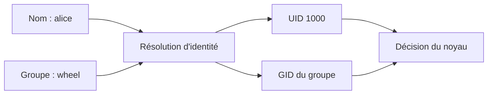
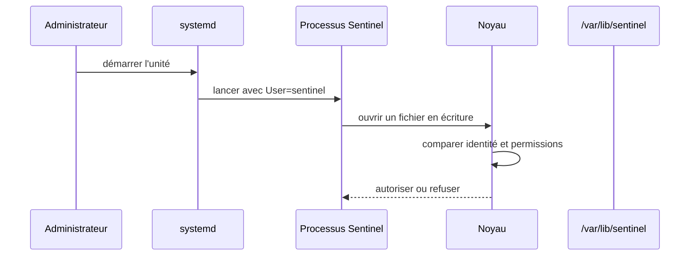
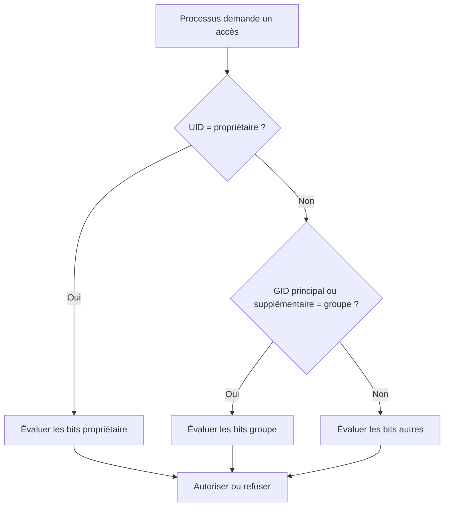
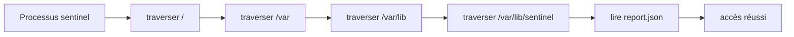

# Chapitre 1.7 — Comprendre identités et permissions

> **Campagne 1 — Installation et fondations**

> *« Le noyau autorise un processus en fonction de son identité, pas de son intention. »*

## Vous êtes ici

```text
PARTIE I — Construire un socle sécurisé

Campagne 1

  1.1 Pourquoi sécuriser un socle Linux ? ✔
  1.2 Installer AlmaLinux minimal ✔
  1.3 Comprendre les composants du système ✔
  1.4 Établir la baseline du serveur ✔
  1.5 Mettre à jour et gérer les dépôts ✔
  1.6 Organiser les systèmes de fichiers ✔
► 1.7 Comprendre identités et permissions
  1.8 Administrer avec sudo
  1.9 Mission : mettre le serveur en sécurité
  1.10 Créer le laboratoire Sentinel
```

## Objectifs pédagogiques

À l'issue de ce chapitre, vous serez capable de :

- distinguer nom de compte, UID, groupe principal et groupes supplémentaires ;
- expliquer pourquoi un processus possède une identité effective ;
- lire propriétaire, groupe et permissions `rwx` d'un fichier ou répertoire ;
- prévoir une décision d'accès Unix simple ;
- concevoir l'identité initiale du futur service Sentinel.

## Pourquoi ce chapitre existe

Les fichiers de Sentinel auront des propriétaires, son processus utilisera une identité et les administrateurs appartiendront à des groupes. Si tous les composants utilisent `root` ou des droits très larges, une erreur applicative devient une compromission du serveur.

Ce chapitre introduit le modèle nécessaire pour installer et observer le laboratoire. La campagne 2 étudiera en détail l'algorithme des permissions, les ACL, l'`umask`, les comptes système, PAM, les mots de passe, `sudoers` et les fichiers d'identité.

## Nom lisible et identifiant numérique

Linux associe un nom de compte à un **UID** et un nom de groupe à un **GID**. Le noyau prend ses décisions avec les identifiants numériques ; les noms rendent l'administration lisible.

```bash
id
id root
getent passwd "$USER"
getent group wheel
```

Une entrée de compte décrit notamment le nom, l'UID, le GID principal, le répertoire personnel et le shell. `getent` interroge les sources d'identité configurées ; il est préférable à une lecture exclusive de `/etc/passwd` lorsque des annuaires seront ajoutés plus tard.



Les UID doivent rester cohérents pour les fichiers persistants et les partages. Renommer un compte ne change pas forcément son UID ; recréer un compte avec un autre UID peut laisser des fichiers orphelins ou attribués à la mauvaise identité.

## Groupes principal et supplémentaires

Chaque processus possède un groupe principal et peut disposer de groupes supplémentaires. Les groupes permettent d'accorder un accès collectif sans dupliquer des règles pour chaque personne.

```bash
id
groups
getent group wheel
```

L'appartenance à un groupe est un privilège. Ajouter un utilisateur à `wheel`, à un groupe capable de lire des journaux sensibles ou à un groupe contrôlant une socket d'administration élargit ses possibilités. Le nom du groupe ne suffit pas : il faut connaître les objets auxquels il donne accès.

Après une modification de groupes, une session existante peut conserver son ancien ensemble de groupes. Ouvrir une nouvelle session permet de charger la nouvelle identité ; bricoler autour de ce comportement risque de rendre les tests incohérents.

## Comptes humains et comptes de service

Un compte humain représente une personne et doit permettre la traçabilité. Un compte de service représente un logiciel et limite les ressources accessibles en cas de défaut.

| Propriété | Compte humain | Compte de service |
| --- | --- | --- |
| finalité | administration ou usage interactif | exécution d'une fonction précise |
| connexion | autorisée selon politique | généralement interdite |
| répertoire personnel | espace de travail personnel | absent ou limité au besoin |
| secret interactif | selon authentification | généralement aucun mot de passe |
| durée | cycle d'arrivée et de départ | cycle de vie du service |

Sentinel utilisera un compte système dédié. Ce compte ne sera pas créé manuellement dans ce chapitre : son UID, son shell, ses répertoires et son propriétaire de cycle de vie seront définis ensemble dans la campagne 2 puis dans le paquet.

## L'identité appartient au processus

Un fichier n'« agit » pas. Lorsqu'un programme est lancé, le processus reçoit une identité issue de son parent ou préparée par un mécanisme comme systemd. Le noyau compare cette identité aux règles de l'objet demandé.



Observez l'identité des processus :

```bash
ps -eo user,group,pid,ppid,comm --sort=user | head -n 25
systemctl show chronyd -p User -p Group -p MainPID
```

Une unité peut ne pas déclarer `User=` et démarrer avec l'identité par défaut du gestionnaire système, souvent `root`. Ce comportement doit être compris avant de conclure qu'un service a besoin de tous ces privilèges.

## Lire les permissions Unix

`ls -l` affiche type, permissions, propriétaire et groupe :

```text
-rw-r----- 1 sentinel sentinel 840 Jul 17 10:00 sentinel.conf
│└┬┘└┬┘└┬┘   └──┬───┘ └──┬───┘
│ │  │  │       │          └─ groupe propriétaire
│ │  │  │       └──────────── propriétaire
│ │  │  └─ autres
│ │  └──── groupe
│ └─────── propriétaire
└───────── type : fichier ordinaire
```

Pour un fichier : `r` permet de lire son contenu, `w` de le modifier et `x` de l'exécuter. Pour un répertoire : `r` permet d'en lister les noms, `w` d'y créer ou supprimer des entrées, et `x` de le traverser pour atteindre un nom connu. Les permissions d'un répertoire ne sont donc pas une simple copie de celles d'un fichier.

```bash
ls -ld /etc /var/lib /tmp
stat -c '%A %a %U %G %n' /etc/passwd /etc/shadow /tmp
```

La notation numérique regroupe les bits : lecture vaut 4, écriture 2, exécution 1. `0640` signifie `rw-` pour le propriétaire, `r--` pour le groupe et aucun droit pour les autres. Le zéro initial rappelle qu'il s'agit d'un mode et laisse apparaître les bits spéciaux, étudiés plus tard.

## Prévoir une décision simple

Pour les permissions Unix classiques, le noyau sélectionne une seule classe : propriétaire si l'UID correspond ; sinon groupe si un GID correspond ; sinon autres. Il n'additionne pas arbitrairement les trois colonnes.



Ce modèle est volontairement incomplet : ACL, bits spéciaux, capacités, montage en lecture seule et SELinux peuvent ajouter des règles. La campagne 2 les intégrera progressivement.

### L'accès dépend de tout le chemin

Lire `/var/lib/sentinel/report.json` demande de traverser `/`, `/var`, `/var/lib` et `/var/lib/sentinel`, puis de lire le fichier. Le mode du dernier objet ne suffit pas. Un répertoire parent sans bit `x` pour la classe sélectionnée bloque l'accès même si le fichier est annoncé `0644`.



La suppression illustre une autre subtilité : supprimer un nom est une opération sur le répertoire parent. Un utilisateur peut parfois supprimer un fichier qu'il ne peut pas modifier, s'il possède les droits adéquats sur le répertoire. Des mécanismes comme le sticky bit de `/tmp` modifient ce comportement ; ils seront étudiés dans la campagne 2.

Pour raisonner sans essais destructifs, collectez :

```bash
namei -l /var/lib/sentinel/report.json
stat -c '%A %a %u:%g %n' /var/lib/sentinel/report.json
id sentinel
```

Si le compte n'existe pas encore, travaillez avec une identité fictive sur papier. Écrivez son UID, son groupe principal, ses groupes supplémentaires et la classe sélectionnée à chaque étape. Cette méthode est plus fiable que de modifier successivement les modes jusqu'à disparition de l'erreur.

Les noms de groupes doivent enfin exprimer un rôle. Un groupe `sentinel-readers` est plus facile à gouverner qu'un groupe générique `apps`, mais sa création n'est justifiée que si plusieurs identités ont réellement besoin du même accès. Multiplier les groupes sans propriétaire ni procédure de retrait déplace la complexité au lieu de la résoudre.

## Modifier dans un laboratoire contrôlé

Dans votre répertoire personnel, créez un fichier et observez son mode :

```bash
mkdir -p ~/identity-lab
printf '%s\n' 'configuration de test' > ~/identity-lab/sentinel.conf
stat -c '%A %a %U %G %n' ~/identity-lab/sentinel.conf
chmod 0640 ~/identity-lab/sentinel.conf
stat -c '%A %a %U %G %n' ~/identity-lab/sentinel.conf
```

`chmod` change le mode. `chown` change le propriétaire et nécessite généralement un privilège administratif pour attribuer un fichier à une autre identité. N'utilisez pas `sudo chown` dans le laboratoire sans plan de restitution : un fichier de votre répertoire personnel pourrait ne plus vous appartenir.

Les modes larges comme `0777` ne sont pas un diagnostic. Ils ouvrent simultanément lecture, écriture et exécution à tous, masquent la règle réellement nécessaire et n'agissent pas sur toutes les couches de sécurité.

## Concevoir les accès de Sentinel

À partir de l'arborescence du chapitre 1.6, la première matrice d'accès devient :

| Objet | Administrateur | Processus `sentinel` | Autres utilisateurs |
| --- | --- | --- | --- |
| `/usr/bin/sentinel` | installe par RPM | lit et exécute | lit/exécute selon politique |
| `/etc/sentinel/` | configure | lit le strict nécessaire | aucun accès sensible |
| `/var/lib/sentinel/` | sauvegarde et maintient | lit et écrit | aucun |
| journaux | consulte selon rôle | émet | accès contrôlé |
| `/run/sentinel/` | diagnostique | crée et utilise | aucun |

Cette matrice exprime des besoins, pas encore tous les modes exacts. Les chapitres 2.1 à 2.4 traduiront les besoins en permissions Unix, ACL, `umask` et attributs.

## TP 1 — Lire des identités réelles

Choisissez votre session et trois services actifs. Pour chacun, relevez : nom, UID, groupe principal, groupes supplémentaires utiles, PID principal et éventuel shell de connexion.

```bash
id
systemctl list-units --type=service --state=running
systemctl show NOM.service -p User -p Group -p MainPID
ps -o user,group,pid,comm -p PID
```

Expliquez pourquoi chaque service observé utilise `root` ou une identité dédiée. Si la raison n'est pas connue, notez « à analyser » plutôt que d'inventer une justification.

## TP 2 — Tester fichier et répertoire

Dans `~/identity-lab`, créez un répertoire en `0750` et un fichier en `0640`. Expliquez les opérations possibles pour propriétaire, groupe et autres : lister le répertoire, traverser, lire le fichier, modifier son contenu et supprimer son nom.

Utilisez `namei -l` et `stat` pour vérifier votre raisonnement. Testez seulement avec des identités prévues par le laboratoire ; ne créez pas de compte partagé pour simplifier l'exercice.

## Mission d'ingénieur — Définir l'identité de Sentinel

Produisez une fiche de conception comprenant :

1. compte et groupe dédiés ;
2. absence ou présence justifiée d'un shell et d'un répertoire personnel ;
3. identité préparée par systemd ;
4. matrice des accès aux chemins Sentinel ;
5. séparation entre administrateurs et processus ;
6. risque si Sentinel s'exécutait comme `root` ;
7. contrôles à détailler dans la campagne 2 ;
8. preuves attendues avec `id`, `ps`, `stat` et `namei`.

Ne choisissez pas encore un UID fixe sans contrainte de déploiement. La stabilité des identifiants sera décidée avec le packaging, les volumes et l'éventuel annuaire.

## Impact sur Sentinel

Sentinel ne sera pas une extension du compte administrateur. Son processus disposera d'une identité de service et recevra seulement les accès nécessaires à sa configuration, son état et son runtime. Cette séparation limitera l'impact d'une vulnérabilité et rendra les journaux plus explicites.

## Synthèse

- Les noms sont résolus vers des UID et GID utilisés par le noyau.
- Un processus possède une identité qui détermine une partie de ses accès.
- Les comptes humains et les comptes de service ont des cycles et des usages différents.
- Les bits `rwx` n'ont pas exactement le même sens sur un fichier et un répertoire.
- Les permissions classiques sélectionnent propriétaire, groupe ou autres.
- Les besoins d'accès de Sentinel doivent être écrits avant de choisir des modes.
- La campagne 2 approfondira l'algorithme et les contrôles avancés sans répéter cette introduction.

## Infographie de révision

```text
NOM ─► UID/GID ─► PROCESSUS ─► DEMANDE D'ACCÈS
                                      │
                         ┌────────────┼────────────┐
                         ▼            ▼            ▼
                    propriétaire    groupe       autres
                         │            │            │
                         └────────► bits rwx ◄─────┘
                                      │
                                      ▼
                               AUTORISER / REFUSER

Sentinel : compte dédié, pas de login, accès définis par besoin.
```

## Pour aller plus loin

Consultez `man id`, `man getent`, `man 5 passwd`, `man 7 credentials` et `man 7 inode`. La campagne suivante sur les identités reprendra ces notions au niveau opérationnel.

Chapitre suivant : conserver une identité nominative pour travailler et n'élever les privilèges que pour une commande d'administration.

← [1.6 — Organiser les systèmes de fichiers](1.6-architecture-systemes-fichiers.md) · [1.8 — Administrer avec sudo](1.8-sudo-moindre-privilege.md) →
