# Campagne 1 — Installation et fondations

# Chapitre 1.7 — sudo et le principe du moindre privilège

> *« Un administrateur compétent n'utilise pas les privilèges maximum. Il utilise les privilèges minimum nécessaires pour accomplir sa tâche. »*

---

# Vous êtes ici

```text
Partie I — Construire un socle sécurisé

Campagne 1 — Installation et fondations

      1.1 Pourquoi sécuriser un socle Linux ?
      1.2 Installation d'AlmaLinux Minimal
      1.3 Comprendre les privilèges
      1.4 Le système de fichiers
      1.5 Utilisateurs et groupes
      1.6 Permissions Linux
    ► 1.7 sudo et moindre privilège
      1.8 Première sécurisation de Sentinel
```

---

# Objectifs pédagogiques

À la fin de ce chapitre, vous serez capable de :

- comprendre le rôle de `sudo` ;
- expliquer pourquoi les administrateurs utilisent un compte personnel ;
- distinguer `sudo` de `su` ;
- comprendre le principe du moindre privilège (*Least Privilege*) ;
- mettre en œuvre une administration sécurisée d'un serveur Linux.

---

# Pourquoi ce chapitre existe

Nous savons désormais que :

- chaque utilisateur possède une identité ;
- chaque processus hérite de cette identité ;
- les permissions sont évaluées par le noyau.

Une question essentielle demeure.

> **Comment un administrateur peut-il réaliser une opération réservée à root sans travailler en permanence avec le compte root ?**

La réponse est :

```text
sudo
```

Aujourd'hui,

la quasi-totalité des infrastructures Linux modernes utilisent ce mécanisme.

Comprendre son fonctionnement est indispensable avant de poursuivre la sécurisation de Sentinel.

---

# Pourquoi ne pas travailler directement en root ?

Prenons deux administrateurs.

Le premier ouvre directement une session root.

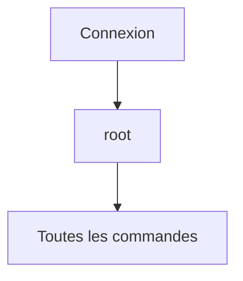

Toutes les commandes disposent immédiatement des privilèges maximum.

Une simple erreur de frappe peut alors avoir des conséquences importantes.

---

Le second administrateur utilise son compte personnel.

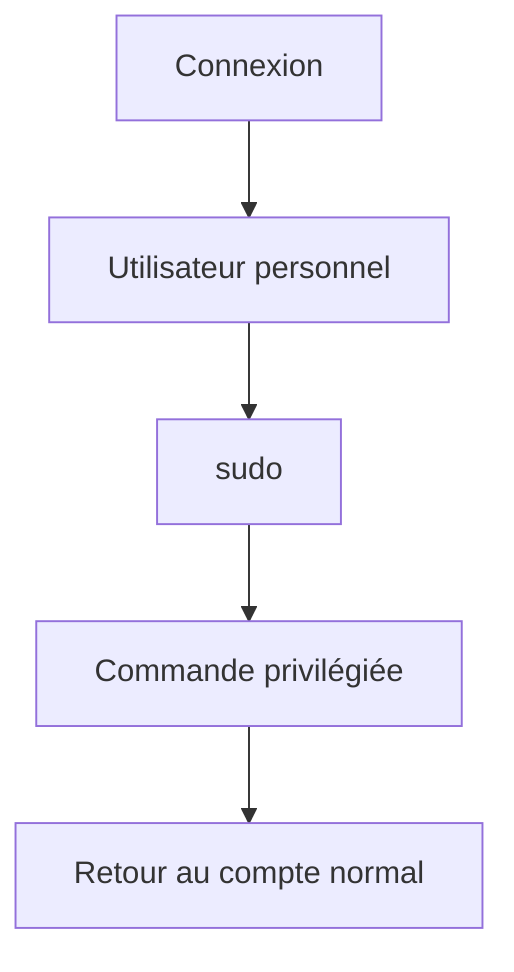

Les privilèges élevés ne sont accordés que pendant quelques instants.

Le risque est considérablement réduit.

---

# Le principe du moindre privilège

Toute la philosophie de `sudo` repose sur un principe fondamental.

> **Un utilisateur ne doit disposer que des privilèges nécessaires à la tâche qu'il réalise, et uniquement pendant la durée nécessaire.**

Ce principe porte un nom.

```text
Least Privilege
```

Il ne concerne pas uniquement Linux.

On le retrouve dans :

- Windows ;
- Kubernetes ;
- les bases de données ;
- les API ;
- le cloud ;
- les systèmes industriels.

Il s'agit de l'un des principes les plus importants de toute la cybersécurité.

---

# Comment fonctionne sudo ?

Le fonctionnement est relativement simple.

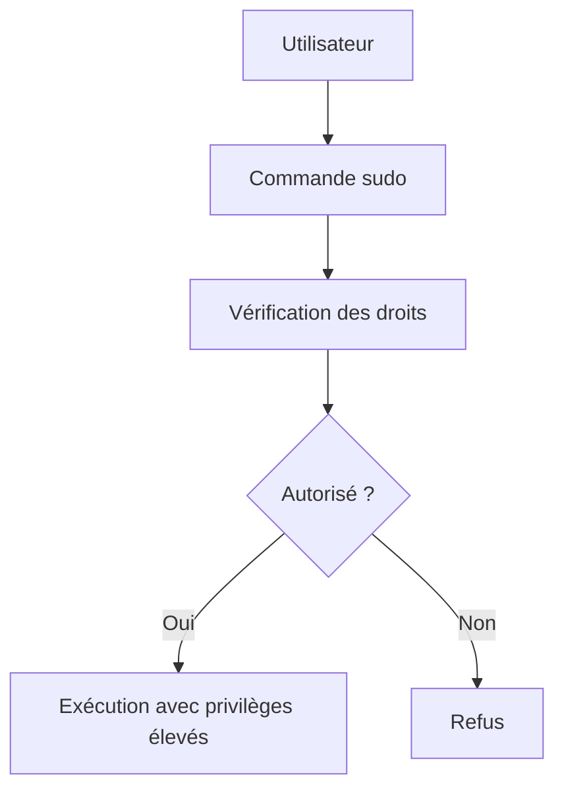

Autrement dit,

`sudo` ne donne pas automatiquement tous les droits.

Il vérifie d'abord si l'utilisateur est autorisé à exécuter la commande demandée.

---

# Une élévation temporaire

Contrairement à une idée reçue,

`sudo` ne transforme pas définitivement l'utilisateur en root.

Il lance simplement **une commande particulière** avec une autre identité.

Visualisons.

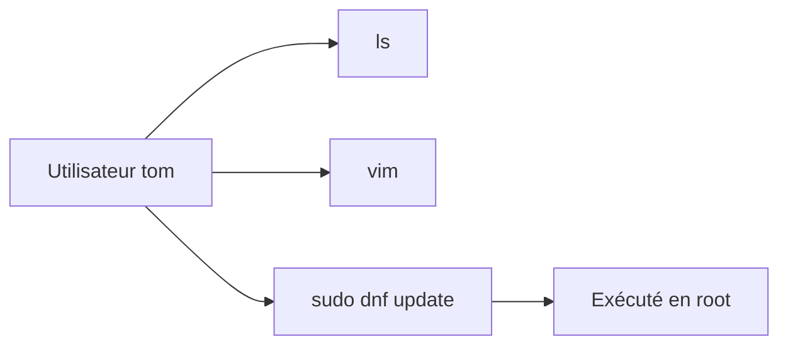

Une fois la commande terminée,

les privilèges reviennent immédiatement à leur niveau initial.

C'est précisément ce comportement qui rend `sudo` beaucoup plus sûr qu'une session root permanente.

---
# sudo n'est pas root

Une confusion très fréquente consiste à penser que :

```text
sudo

=

root
```

Ce n'est pas exact.

`sudo` est simplement un programme.

Son rôle est de :

- vérifier les autorisations ;
- authentifier l'utilisateur si nécessaire ;
- lancer une commande sous une autre identité.

Le plus souvent,

cette identité est :

```text
root
```

Mais ce n'est pas une obligation.

Il est également possible d'exécuter une commande sous un autre utilisateur.

Par exemple.

```bash
sudo -u postgres psql
```

Le processus sera alors exécuté sous l'identité :

```text
postgres
```

et non sous root.

---

# sudo contre su

Deux commandes sont souvent confondues.

```text
sudo
```

et

```text
su
```

Pourtant,

leur philosophie est très différente.

## su

`su` signifie :

> **Substitute User**

ou historiquement

> **Switch User**

Il ouvre une nouvelle session sous une autre identité.

Visualisons.

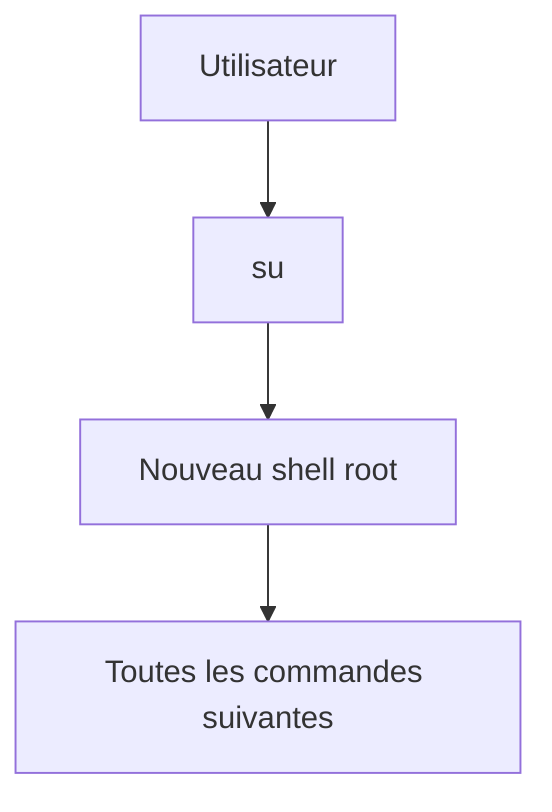

Une fois connecté,

toutes les commandes suivantes s'exécutent avec les privilèges élevés,

jusqu'à la fermeture du shell.

---

## sudo

Avec `sudo`,

aucune nouvelle session n'est créée.

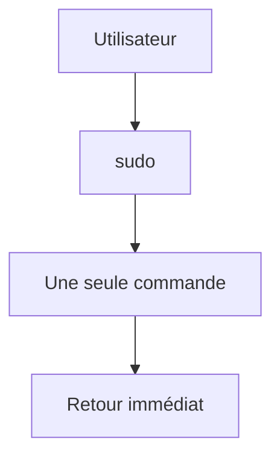

L'élévation de privilèges est beaucoup plus courte.

C'est pourquoi `sudo` est aujourd'hui privilégié.

---

# Pourquoi sudo est-il plus sûr ?

Prenons un exemple.

Vous souhaitez modifier :

```text
/etc/ssh/sshd_config
```

Première méthode.

```bash
su -

vim /etc/ssh/sshd_config

...

rm -rf mauvais_repertoire
```

Toutes les commandes sont exécutées avec les privilèges root.

---

Deuxième méthode.

```bash
sudo vim /etc/ssh/sshd_config
```

Une fois l'éditeur fermé,

vous redevenez immédiatement un utilisateur classique.

Le risque d'erreur diminue considérablement.

---

# Le fichier sudoers

Les droits accordés par `sudo` sont définis dans un fichier.

```text
/etc/sudoers
```

ou dans les fichiers présents dans :

```text
/etc/sudoers.d/
```

Visualisons.

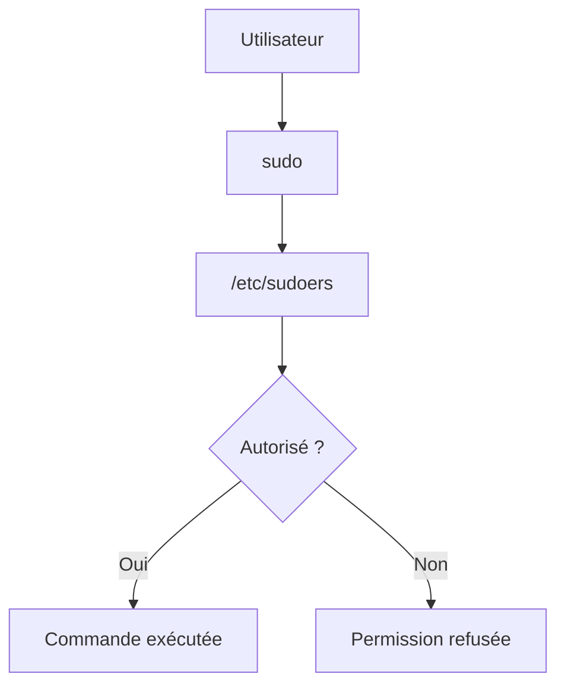

Ce fichier constitue le cœur de la politique d'administration d'un serveur.

---

# Le groupe wheel

Sur AlmaLinux,

les administrateurs appartiennent généralement au groupe :

```text
wheel
```

La configuration par défaut autorise les membres de ce groupe à utiliser :

```bash
sudo
```

Le fonctionnement est donc proche de celui-ci.

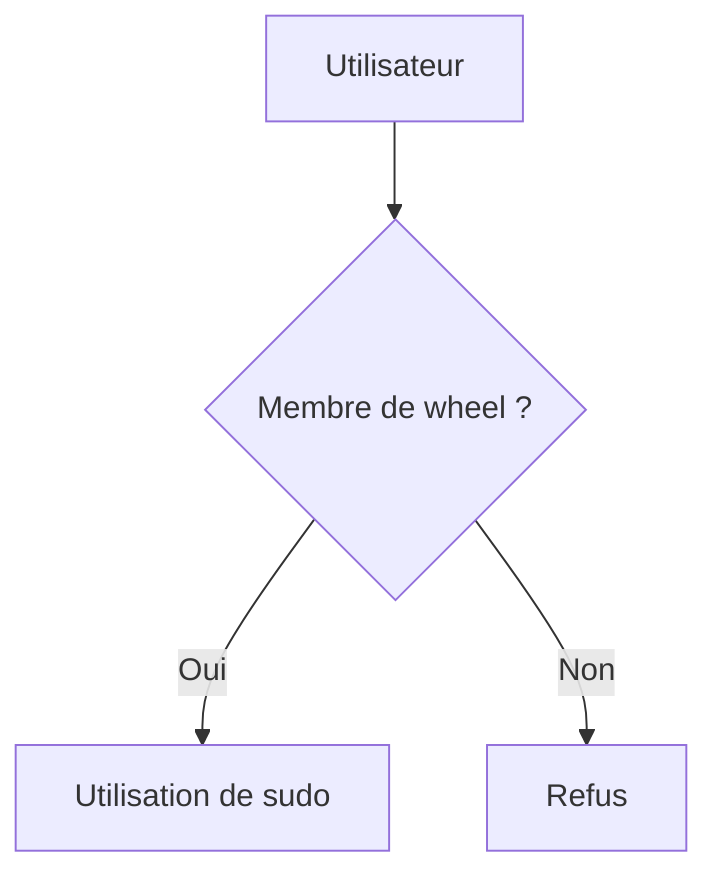

Nous verrons prochainement comment vérifier l'appartenance à ce groupe.

---

# La journalisation

Un avantage majeur de `sudo` est la traçabilité.

Chaque commande privilégiée peut être enregistrée.

Par exemple.

```text
tom

↓

sudo dnf update

↓

Journal système
```

Ou encore.

```text
alice

↓

sudo systemctl restart sentinel

↓

Journal système
```

Cette capacité est essentielle.

Elle permet de répondre à des questions comme :

- Qui a redémarré ce service ?
- Qui a installé ce paquet ?
- Qui a modifié cette configuration ?

Avec un compte root partagé,

ces informations seraient perdues.

C'est pourquoi les entreprises privilégient systématiquement :

- des comptes nominatifs ;
- `sudo` ;
- une journalisation centralisée.

---

# La demande de mot de passe

Par défaut,

`sudo` demande généralement :

**le mot de passe de l'utilisateur courant**,

et non celui de root.

Pourquoi ?

Parce que l'objectif est de vérifier :

- que l'utilisateur est bien celui qu'il prétend être ;
- qu'il est autorisé à utiliser `sudo`.

Le mot de passe root n'a donc généralement pas besoin d'être communiqué aux administrateurs.

Cette approche améliore considérablement la sécurité,

notamment dans les équipes nombreuses.

---
# 💎 Le point d'expertise

## sudo n'accorde pas plus de privilèges que nécessaire

Une erreur fréquente consiste à penser que `sudo` signifie :

> **« Donner tous les droits. »**

En réalité,

`sudo` permet de définir très précisément ce qu'un utilisateur est autorisé à faire.

Par exemple.

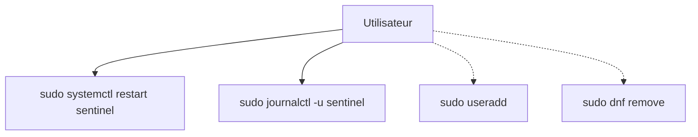

Dans cet exemple,

l'utilisateur peut uniquement :

- consulter les journaux ;
- redémarrer le service Sentinel.

Toutes les autres commandes restent interdites.

Cette granularité constitue l'une des grandes forces de `sudo`.

---

## Pourquoi les entreprises évitent le compte root

Imaginons une équipe composée de cinq administrateurs.

Première approche.

```text
Tous connaissent

le mot de passe root
```

Conséquences.

- impossible de savoir qui a exécuté une commande ;
- impossible de retirer l'accès à un seul administrateur ;
- obligation de changer le mot de passe pour toute l'équipe.

---

Deuxième approche.

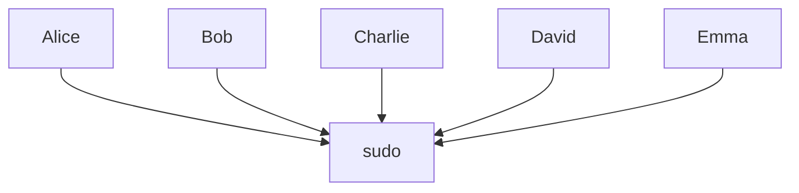

Chaque administrateur possède :

- son propre compte ;
- son propre mot de passe ;
- ses propres journaux.

La traçabilité devient complète.

---

## Least Privilege ne concerne pas uniquement les humains

Une erreur courante consiste à réserver le principe du moindre privilège aux administrateurs.

En réalité,

il s'applique également :

- aux applications ;
- aux conteneurs ;
- aux services systemd ;
- aux bases de données.

Par exemple,

notre futur service Sentinel ne devra jamais disposer des droits permettant :

- de créer un utilisateur ;
- d'installer un paquet RPM ;
- d'arrêter le serveur.

Il devra uniquement pouvoir :

- lire sa configuration ;
- écrire ses journaux ;
- accéder à ses propres données.

---

## sudo prépare naturellement l'automatisation

Plus tard,

nous utiliserons Ansible.

Les tâches seront exécutées ainsi.

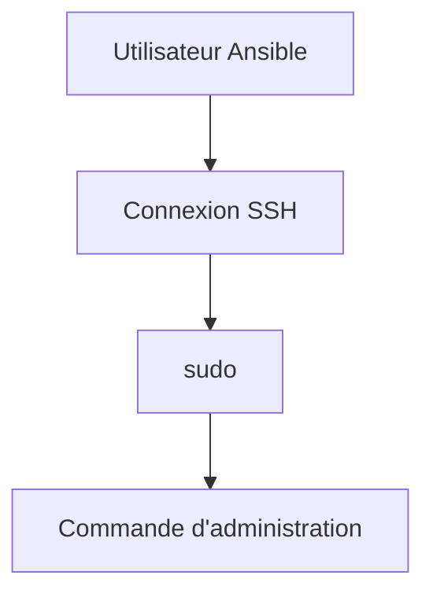

Ansible n'aura pas besoin d'une connexion root.

Il utilisera un compte d'administration classique,

avec une élévation de privilèges uniquement lorsque cela sera nécessaire.

Cette approche est aujourd'hui la norme dans les infrastructures professionnelles.

---

# 🧠 Comment pense un architecte ?

Un architecte ne se demande jamais :

> « Qui est administrateur ? »

Il préfère se demander :

> **« Quelles opérations chaque administrateur doit-il réellement pouvoir effectuer ? »**

Prenons Sentinel.

Plusieurs profils existent.

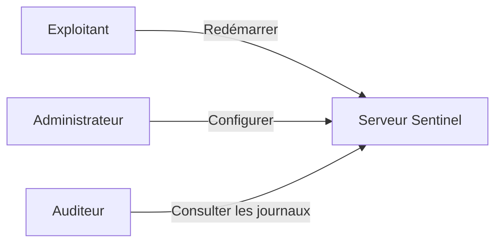

Les trois personnes utilisent `sudo`.

Mais elles n'obtiennent pas les mêmes privilèges.

Cette approche limite fortement les erreurs humaines.

---

## Concevoir une administration durable

Une bonne politique `sudo` doit permettre de répondre à plusieurs questions.

- Qui peut installer un paquet ?
- Qui peut redémarrer un service ?
- Qui peut modifier la configuration ?
- Qui peut consulter les journaux ?
- Qui peut créer un utilisateur ?

Lorsque ces réponses sont clairement définies,

la politique d'administration devient :

- plus sûre ;
- plus simple à auditer ;
- plus facile à automatiser.

---

# ⚔️ Comment pense un attaquant ?

Lorsqu'un attaquant compromet un compte utilisateur,

sa première question est souvent :

> **Cet utilisateur peut-il utiliser sudo ?**

S'il le peut,

une seconde question apparaît immédiatement.

> **Quelles commandes lui sont autorisées ?**

Une politique `sudo` trop permissive peut transformer un simple compte utilisateur en point d'entrée vers une compromission complète.

C'est pourquoi une règle est largement répandue.

> **N'autoriser que les commandes réellement nécessaires.**

---

# 🏢 En entreprise

Dans une grande infrastructure,

les droits `sudo` sont rarement identiques pour tous les administrateurs.

On rencontre souvent plusieurs profils.

| Profil | Exemples de privilèges |
|---------|------------------------|
| Exploitant | Redémarrer les services, consulter les journaux |
| Administrateur système | Installer des paquets, gérer les utilisateurs |
| Administrateur sécurité | Modifier les politiques de sécurité, consulter les audits |
| Automatisation (Ansible) | Exécuter les tâches prévues par les playbooks |

Cette séparation des responsabilités réduit considérablement les risques d'erreur ou d'abus.

Elle facilite également les audits de sécurité.

---
# 📚 Culture technique

## Pourquoi sudo ne demande-t-il pas toujours le mot de passe ?

Vous avez peut-être remarqué que,

après avoir utilisé :

```bash
sudo
```

une première fois,

les commandes suivantes ne demandent parfois plus le mot de passe.

Ce comportement est volontaire.

`sudo` conserve temporairement une preuve que vous vous êtes déjà authentifié.

Cette durée est appelée le **timestamp sudo**.

Schématiquement.

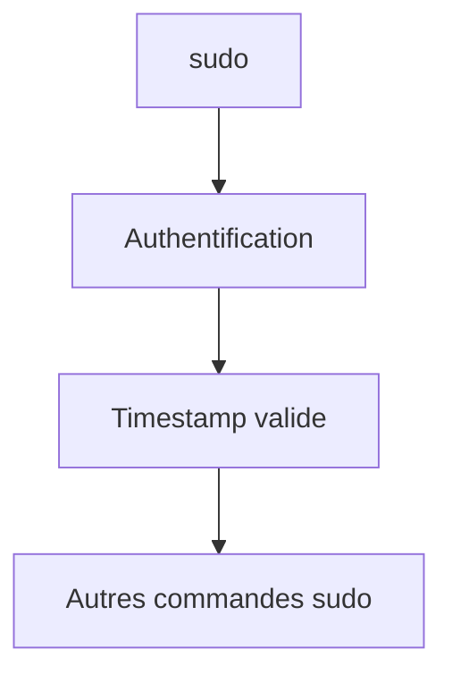

Après quelques minutes d'inactivité,

le timestamp expire automatiquement.

Le mot de passe sera alors de nouveau demandé.

Cette fonctionnalité améliore le confort d'utilisation,

tout en conservant un bon niveau de sécurité.

---

## Pourquoi existe-t-il sudoers.d ?

Autrefois,

toute la configuration de `sudo` se trouvait dans un unique fichier.

```text
/etc/sudoers
```

Aujourd'hui,

les distributions modernes utilisent également :

```text
/etc/sudoers.d/
```

Pourquoi ?

Parce qu'il est beaucoup plus simple d'ajouter une règle spécifique.

Par exemple.

```text
/etc/sudoers.d/ansible
```

```text
/etc/sudoers.d/sentinel
```

```text
/etc/sudoers.d/devops
```

Chaque application peut ainsi ajouter ses propres autorisations,

sans modifier le fichier principal.

Cette organisation facilite :

- les mises à jour ;
- les audits ;
- l'automatisation.

---

## Pourquoi modifier sudoers avec visudo ?

Le fichier `sudoers` est extrêmement sensible.

Une simple erreur de syntaxe peut empêcher complètement l'utilisation de `sudo`.

C'est pourquoi on n'utilise généralement pas :

```bash
nano /etc/sudoers
```

mais :

```bash
sudo visudo
```

`visudo` vérifie automatiquement :

- la syntaxe ;
- la cohérence du fichier ;
- les erreurs avant son enregistrement.

En cas de problème,

la modification est refusée.

C'est un excellent exemple d'outil conçu pour éviter les erreurs d'administration.

---

## sudo est-il une protection de sécurité ?

Pas exactement.

`sudo` n'empêche pas un utilisateur autorisé d'effectuer une opération dangereuse.

Son rôle est différent.

Il permet :

- d'identifier précisément qui agit ;
- de limiter les commandes autorisées ;
- de journaliser les actions ;
- de réduire la durée d'utilisation des privilèges élevés.

La véritable sécurité provient donc principalement :

- d'une bonne politique `sudo` ;
- du moindre privilège ;
- de la journalisation ;
- de la supervision.

---

# ⚠️ Piège classique

## Utiliser sudo devant chaque commande

Certains débutants prennent rapidement l'habitude suivante.

```bash
sudo ls

sudo pwd

sudo cat

sudo nano

sudo vim

sudo cp
```

Dans la majorité des cas,

ces commandes ne nécessitent pourtant aucun privilège particulier.

Utiliser `sudo` systématiquement présente plusieurs inconvénients.

- on s'habitue à travailler avec des privilèges élevés ;
- on masque les véritables problèmes de permissions ;
- on augmente le risque d'erreur.

La bonne question est toujours :

> **Cette commande nécessite-t-elle réellement des privilèges supplémentaires ?**

Si la réponse est non,

n'utilisez pas `sudo`.

---

## Donner ALL=(ALL) ALL à tout le monde

Une autre erreur fréquente consiste à ajouter tous les administrateurs dans une règle comme :

```text
ALL=(ALL) ALL
```

Cette configuration donne pratiquement tous les privilèges.

Elle est parfois acceptable pour un très petit laboratoire,

mais elle est rarement adaptée à une infrastructure de production.

Une bonne politique `sudo` cherche toujours à répondre au besoin réel,

et non à accorder tous les droits "par simplicité".

---

# Laboratoire AlmaLinux

## Objectif

Découvrir le fonctionnement pratique de `sudo`.

---

## Étape 1 — Vérifier son identité

Afficher votre utilisateur.

```bash
whoami
```

Puis.

```bash
id
```

Identifier votre appartenance éventuelle au groupe :

```text
wheel
```

---

## Étape 2 — Tester une commande privilégiée

Essayer.

```bash
dnf update
```

Observer le refus.

Puis.

```bash
sudo dnf update
```

Comparer les deux comportements.

---

## Étape 3 — Observer le timestamp sudo

Exécuter.

```bash
sudo ls /root
```

Puis immédiatement.

```bash
sudo cat /etc/shadow
```

Observer qu'aucun nouveau mot de passe n'est demandé.

Attendre plusieurs minutes.

Relancer ensuite une commande `sudo`.

Constater que l'authentification est de nouveau requise.

---

## Étape 4 — Consulter la configuration sudo

Afficher.

```bash
sudo -l
```

Observer :

- les commandes autorisées ;
- les éventuelles restrictions ;
- les paramètres appliqués à votre utilisateur.

Ne modifiez pas encore la configuration.

Nous le ferons dans une campagne ultérieure.

---

# Mission d'ingénieur

Votre entreprise souhaite supprimer définitivement l'utilisation du compte `root` sur tous les serveurs.

Vous devez proposer une politique d'administration reposant sur :

- des comptes nominatifs ;
- `sudo` ;
- une séparation des responsabilités ;
- une journalisation des actions ;
- un contrôle des privilèges accordés.

Expliquez :

- pourquoi cette approche améliore la sécurité ;
- comment elle facilite les audits ;
- quels avantages elle présente pour l'automatisation avec Ansible et la gestion centralisée des identités via FreeIPA.

---

# Impact sur Sentinel

Le service Sentinel sera administré selon les mêmes principes que les grandes infrastructures Linux.

Les administrateurs utiliseront :

- leur compte personnel ;
- `sudo` pour les opérations sensibles ;
- des droits limités à leur rôle.

Plus tard,

nous créerons des règles `sudo` spécifiques permettant, par exemple :

- de redémarrer le service Sentinel ;
- de consulter ses journaux ;
- de recharger sa configuration ;

sans pour autant accorder des privilèges complets sur le système.

Cette approche illustrera concrètement le principe du moindre privilège.

---

# Ce qu'il faut retenir

- `sudo` permet une élévation **temporaire** des privilèges.
- Les administrateurs doivent utiliser un compte personnel plutôt que le compte `root`.
- `sudo` est plus sûr que `su` car il limite la durée d'utilisation des privilèges élevés.
- Les autorisations sont définies dans `/etc/sudoers` et `/etc/sudoers.d/`.
- Le principe du moindre privilège consiste à n'accorder que les droits strictement nécessaires.
- Une bonne politique `sudo` améliore la sécurité, la traçabilité et l'automatisation des infrastructures.

---
# Grande infographie de révision du chapitre

```text
┌──────────────────────────────────────────────────────────────────────────────────────────────┐
│             CHAPITRE 1.7 — SUDO ET LE MOINDRE PRIVILÈGE                                      │
├──────────────────────────────────────────────────────────────────────────────────────────────┤
│                                                                                              │
│                  ADMINISTRATION MODERNE D'UN SERVEUR LINUX                                   │
│                                                                                              │
│ Administrateur                                                                               │
│        │                                                                                     │
│        ▼                                                                                     │
│ Compte personnel                                                                             │
│        │                                                                                     │
│        ▼                                                                                     │
│ sudo                                                                                         │
│        │                                                                                     │
│        ▼                                                                                     │
│ Commande privilégiée                                                                         │
│        │                                                                                     │
│        ▼                                                                                     │
│ Retour au compte utilisateur                                                                 │
│                                                                                              │
├──────────────────────────────────────────────────────────────────────────────────────────────┤
│                          SUDO OU ROOT ?                                                      │
│                                                                                              │
│ Session root permanente              sudo                                                    │
│                                                                                              │
│ Toutes les commandes               Une seule commande                                        │
│ avec tous les privilèges           avec élévation                                            │
│                                                                                              │
│ Journalisation limitée             Journalisation complète                                   │
│                                                                                              │
│ Risque élevé                       Risque réduit                                             │
│                                                                                              │
├──────────────────────────────────────────────────────────────────────────────────────────────┤
│                    FONCTIONNEMENT DE SUDO                                                    │
│                                                                                              │
│ Utilisateur                                                                                  │
│      │                                                                                       │
│      ▼                                                                                       │
│ sudo                                                                                        │
│      │                                                                                       │
│      ▼                                                                                       │
│ Vérification sudoers                                                                         │
│      │                                                                                       │
│      ├────────────► Refus                                                                    │
│      │                                                                                       │
│      └────────────► Commande exécutée                                                        │
│                                                                                              │
├──────────────────────────────────────────────────────────────────────────────────────────────┤
│                      LEAST PRIVILEGE                                                         │
│                                                                                              │
│ Donner uniquement :                                                                          │
│                                                                                              │
│ ✔ Les droits nécessaires                                                                     │
│ ✔ À la bonne personne                                                                        │
│ ✔ Pour la bonne tâche                                                                        │
│ ✔ Pendant la durée nécessaire                                                                │
│                                                                                              │
│ Jamais davantage.                                                                            │
│                                                                                              │
├──────────────────────────────────────────────────────────────────────────────────────────────┤
│                        FICHIERS IMPORTANTS                                                   │
│                                                                                              │
│ /etc/sudoers                                                                                 │
│ /etc/sudoers.d/                                                                              │
│                                                                                              │
│ Modification recommandée :                                                                   │
│                                                                                              │
│ sudo visudo                                                                                  │
│                                                                                              │
├──────────────────────────────────────────────────────────────────────────────────────────────┤
│                    EXEMPLES DE DROITS                                                        │
│                                                                                              │
│ Exploitant                                                                                   │
│   ✔ systemctl restart sentinel                                                               │
│   ✔ journalctl -u sentinel                                                                   │
│                                                                                              │
│ Administrateur système                                                                       │
│   ✔ dnf                                                                                      │
│   ✔ useradd                                                                                  │
│   ✔ firewall-cmd                                                                             │
│                                                                                              │
│ Auditeur                                                                                     │
│   ✔ Lecture des journaux                                                                     │
│   ✘ Modification de la configuration                                                        │
│                                                                                              │
├──────────────────────────────────────────────────────────────────────────────────────────────┤
│                     BONNES PRATIQUES                                                         │
│                                                                                              │
│ ✔ Utiliser un compte nominatif                                                               │
│ ✔ Utiliser sudo ponctuellement                                                               │
│ ✔ Journaliser toutes les actions                                                             │
│ ✔ Limiter les commandes autorisées                                                           │
│ ✔ Utiliser visudo                                                                            │
│ ✔ Préparer l'automatisation avec Ansible                                                     │
│                                                                                              │
│ ✘ Travailler en root toute la journée                                                        │
│ ✘ Partager le mot de passe root                                                              │
│ ✘ Donner ALL=(ALL) ALL sans justification                                                    │
│ ✘ Préfixer toutes les commandes par sudo                                                     │
│                                                                                              │
├──────────────────────────────────────────────────────────────────────────────────────────────┤
│                     IMPACT SUR LE PROJET SENTINEL                                            │
│                                                                                              │
│ Administrateurs                                                                              │
│        │                                                                                     │
│        ▼                                                                                     │
│ sudo                                                                                         │
│        │                                                                                     │
│        ├──► Redémarrer Sentinel                                                              │
│        ├──► Consulter les journaux                                                           │
│        └──► Recharger la configuration                                                       │
│                                                                                              │
│ Sans obtenir les privilèges complets du système.                                             │
│                                                                                              │
├──────────────────────────────────────────────────────────────────────────────────────────────┤
│                               IDÉE CLÉ                                                       │
│                                                                                              │
│ « sudo ne remplace pas root.                                                                 │
│  Il permet d'utiliser des privilèges élevés                                                  │
│  de manière temporaire, contrôlée et traçable. »                                             │
└──────────────────────────────────────────────────────────────────────────────────────────────┘
```
