# Campagne 1 — Installation et fondations

# Chapitre 1.7 — Utilisateurs, groupes et permissions

> *« Sous Linux, la sécurité commence par une question simple : qui est autorisé à faire quoi ? »*

---

# Vous êtes ici

```text
Partie I — Construire un socle sécurisé

Campagne 1 — Installation et fondations

      1.1 Pourquoi sécuriser un socle Linux ?
      1.2 Installation d'AlmaLinux Minimal
      1.3 Comprendre les composants d'un système Linux
      1.4 Premier démarrage et premières vérifications
      1.5 Mise à jour et gestion des dépôts
      1.6 Architecture des systèmes de fichiers
    ► 1.7 Utilisateurs, groupes et permissions
      1.8 sudo et principe du moindre privilège
      1.9 Première mise en sécurité du serveur
      1.10 Création du laboratoire Sentinel
```

---

# Objectifs pédagogiques

À la fin de ce chapitre, vous serez capable de :

- comprendre le modèle d'identité de Linux ;
- distinguer utilisateur, groupe et processus ;
- interpréter les permissions Unix ;
- comprendre les UID et GID ;
- préparer la création du compte de service Sentinel.

---

# Pourquoi ce chapitre existe

Toutes les protections étudiées jusqu'à présent reposent finalement sur une même question.

> **Qui tente d'accéder à cette ressource ?**

Pour répondre,

Linux ne raisonne jamais avec des noms.

Il raisonne avec des identifiants.

Avant de parler de permissions,

nous devons donc comprendre comment Linux identifie les utilisateurs.

---

# Les trois notions fondamentales

Le modèle Linux repose sur trois concepts.

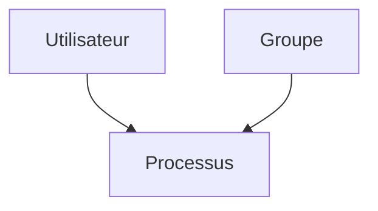

- Un utilisateur possède une identité.
- Un groupe rassemble plusieurs utilisateurs.
- Un processus hérite de l'identité de son utilisateur.

Cette relation est présente partout dans le système.

---

# L'utilisateur

Un utilisateur représente une identité.

Quelques exemples.

```text
tom

root

sentinel

postgres

sshd
```

Chaque utilisateur possède notamment :

- un nom ;
- un identifiant numérique (UID) ;
- un groupe principal ;
- un répertoire personnel ;
- un shell.

Linux ne travaille jamais directement avec le nom.

Il travaille avec l'UID.

---

# L'UID

L'UID (*User Identifier*) est un entier unique.

Par exemple.

| Utilisateur | UID |
|-------------|----:|
| root | 0 |
| tom | 1000 |
| sentinel | 987 |
| postgres | 26 |

Lorsque le noyau vérifie une permission,

il compare les UID,

jamais les noms.

C'est pourquoi il est possible de renommer un utilisateur sans perdre ses droits.

---

# Les groupes

Les groupes permettent de partager des permissions.

Prenons un exemple.

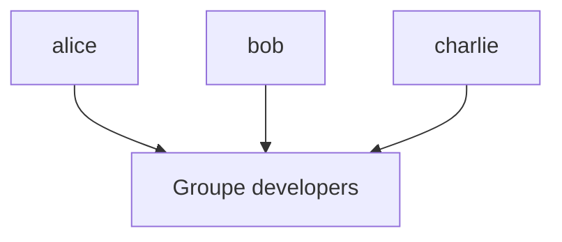

Au lieu de donner les mêmes droits individuellement,

on attribue les permissions au groupe.

L'administration devient beaucoup plus simple.

---

# Le GID

Comme les utilisateurs,

les groupes possèdent un identifiant numérique.

Le **GID** (*Group Identifier*).

Exemple.

| Groupe | GID |
|---------|----:|
| root | 0 |
| wheel | 10 |
| developers | 1001 |
| sentinel | 987 |

Le noyau compare également les GID lors des contrôles d'accès.

---

# Les comptes système

Tous les utilisateurs ne correspondent pas à des personnes.

De nombreux services possèdent leur propre identité.

Par exemple.

```text
chrony

sssd

rpc

nginx

postgres

systemd-network
```

Visualisons.

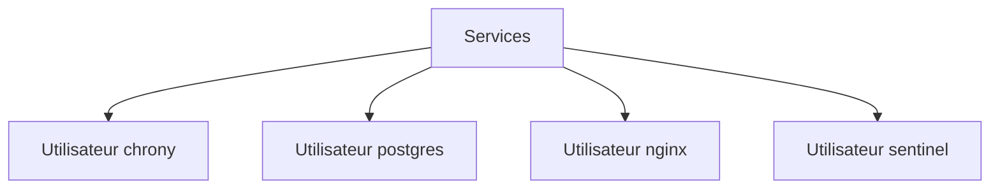

Cette séparation est essentielle.

Si un service est compromis,

l'attaquant récupère uniquement les privilèges de ce compte,

et non ceux de root.

---

# Pourquoi un service possède-t-il son propre utilisateur ?

Imaginons que Sentinel fonctionne avec le compte root.

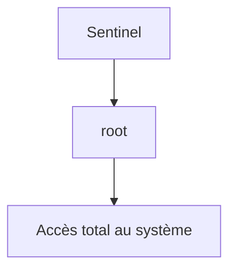

Une vulnérabilité dans Sentinel donnerait immédiatement à un attaquant :

- tous les fichiers ;
- tous les utilisateurs ;
- tous les services.

À l'inverse,

si Sentinel possède son propre compte.

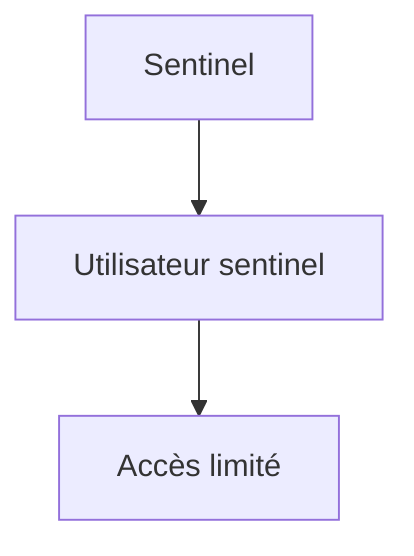

L'impact d'une compromission est considérablement réduit.

C'est l'une des applications les plus importantes du **principe du moindre privilège**.

---
# Les processus héritent d'une identité

Lorsqu'un utilisateur lance un programme,

Linux crée un nouveau processus.

Ce processus hérite automatiquement de son identité.

Visualisons.

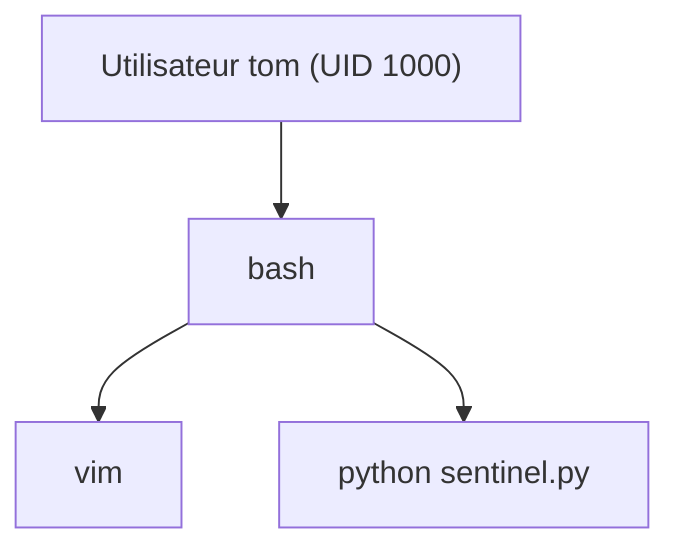

Tous les processus lancés par `tom` s'exécutent donc avec :

- son UID ;
- son groupe principal ;
- ses groupes secondaires.

Le noyau utilisera ensuite ces informations pour vérifier les permissions.

---

# Le processus ne choisit jamais son identité

Une idée reçue consiste à penser qu'un programme peut décider d'être root.

Ce n'est pas le cas.

Le noyau attribue l'identité au moment de la création du processus.

Visualisons.

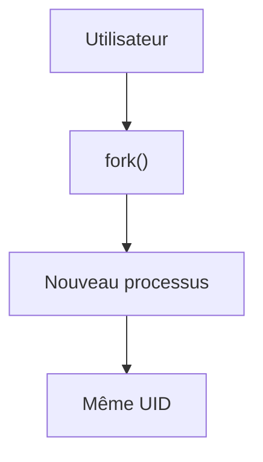

Par défaut,

le processus possède exactement les mêmes privilèges que son créateur.

---

# Le cas particulier de root

L'utilisateur :

```text
root
```

possède toujours l'UID :

```text
0
```

Cet utilisateur bénéficie de privilèges très particuliers.

Par exemple,

il peut généralement :

- modifier les fichiers système ;
- créer des utilisateurs ;
- installer des logiciels ;
- gérer les interfaces réseau ;
- arrêter le système.

Visualisons.

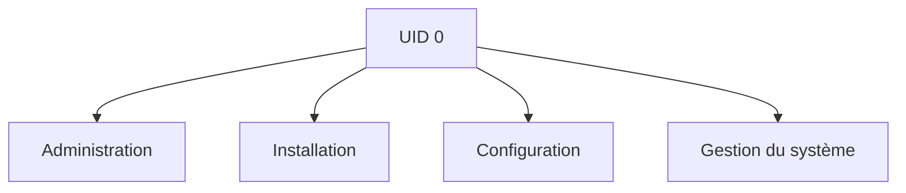

Nous verrons toutefois plus tard que même root peut être limité par certains mécanismes comme **SELinux**.

---

# Les permissions Unix

Chaque fichier Linux possède trois jeux de permissions.

Visualisons.

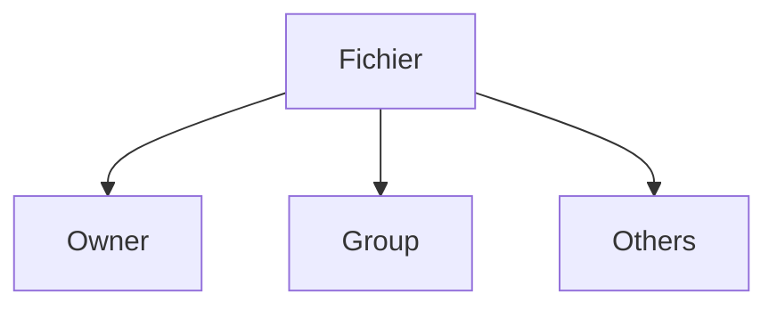

Pour chacun,

trois droits sont possibles.

- lecture (`r`)
- écriture (`w`)
- exécution (`x`)

C'est ce modèle que le noyau utilise en premier lors d'un accès.

---

# Lire les permissions

Prenons un exemple.

```text
-rwxr-x---
```

Découpons-le.

```text
- rwx r-x ---
```

Le premier caractère indique le type.

```text
-
```

signifie :

> fichier classique.

Puis viennent les trois ensembles de permissions.

| Bloc | Signification |
|-------|---------------|
| rwx | propriétaire |
| r-x | groupe |
| --- | autres |

Cette représentation deviendra rapidement très familière.

---

# Les différents types de fichiers

Le premier caractère de la sortie `ls -l` mérite une attention particulière.

| Caractère | Type |
|-----------|------|
| `-` | Fichier |
| `d` | Répertoire |
| `l` | Lien symbolique |
| `c` | Périphérique caractère |
| `b` | Périphérique bloc |
| `s` | Socket |
| `p` | Tube nommé (FIFO) |

Exemple.

```text
drwxr-xr-x
```

Le premier caractère est :

```text
d
```

Il s'agit donc d'un répertoire.

---

# Les trois permissions

Les lettres possèdent un sens légèrement différent selon qu'il s'agit d'un fichier ou d'un répertoire.

| Permission | Fichier | Répertoire |
|------------|----------|------------|
| r | Lire le contenu | Lister les fichiers |
| w | Modifier le contenu | Créer, supprimer ou renommer |
| x | Exécuter | Traverser le répertoire |

La permission **x** sur un répertoire est souvent celle qui surprend le plus les débutants.

---

# La traversée d'un répertoire

Imaginons le fichier suivant.

```text
/home/tom/Documents/secret.txt
```

Pour y accéder,

le noyau doit traverser plusieurs répertoires.

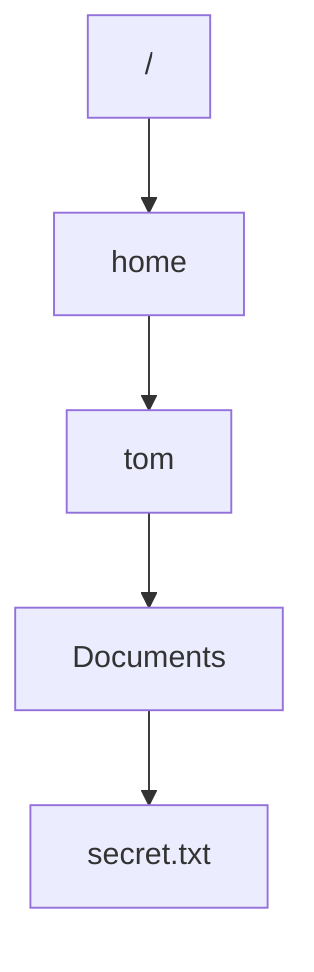

Si l'utilisateur ne possède pas le droit **x** sur un seul de ces répertoires,

l'accès au fichier devient impossible,

même si le fichier lui-même est parfaitement lisible.

Cette subtilité explique de nombreux problèmes de permissions.

---

# La notation numérique

Les permissions peuvent également être représentées sous forme numérique.

Chaque droit possède une valeur.

| Permission | Valeur |
|------------|--------:|
| r | 4 |
| w | 2 |
| x | 1 |

On additionne ensuite les valeurs.

| Valeur | Permissions |
|--------:|-------------|
| 7 | rwx |
| 6 | rw- |
| 5 | r-x |
| 4 | r-- |
| 0 | --- |

Ainsi.

```text
750
```

correspond à.

```text
rwxr-x---
```

Cette notation est celle utilisée par `chmod`.

---
# Vérifier les permissions

La commande la plus utilisée est :

```bash
ls -l
```

Exemple.

```text
-rwxr-x--- 1 sentinel sentinel 24576 Jul 15 10:42 sentinel
```

Décomposons cette ligne.

| Élément | Signification |
|---------|---------------|
| `-` | Type du fichier |
| `rwx` | Droits du propriétaire |
| `r-x` | Droits du groupe |
| `---` | Droits des autres |
| `sentinel` | Propriétaire |
| `sentinel` | Groupe |
| `24576` | Taille |
| `Jul 15` | Date |
| `sentinel` | Nom du fichier |

Un administrateur expérimenté lit cette ligne en quelques secondes.

---

# Modifier les permissions

Les permissions peuvent être modifiées avec :

```bash
chmod
```

Deux syntaxes existent.

## Notation symbolique

Ajouter le droit d'exécution.

```bash
chmod +x script.sh
```

Retirer l'écriture.

```bash
chmod u-w fichier
```

Ajouter la lecture au groupe.

```bash
chmod g+r fichier
```

---

## Notation numérique

Attribuer.

```text
rwxr-x---
```

avec.

```bash
chmod 750 fichier
```

Attribuer.

```text
rw-r-----
```

avec.

```bash
chmod 640 fichier
```

La notation numérique est très utilisée dans les scripts et les playbooks Ansible.

---

# Modifier le propriétaire

Le propriétaire d'un fichier peut être changé.

```bash
sudo chown alice fichier
```

Ou.

```bash
sudo chown alice:developers fichier
```

Visualisons.

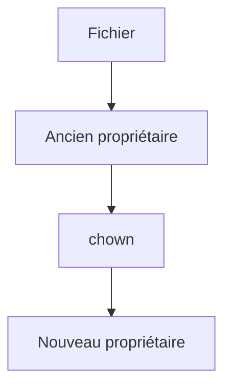

Attention.

Modifier le propriétaire n'accorde pas automatiquement de nouvelles permissions.

Les deux notions sont indépendantes.

---

# Modifier le groupe

Le groupe peut également être changé.

```bash
sudo chgrp developers fichier
```

Ou directement avec :

```bash
chown utilisateur:groupe
```

Le noyau utilisera ensuite ce nouveau groupe lors des contrôles d'accès.

---

# Comment le noyau décide-t-il ?

Lorsqu'un processus tente d'accéder à un fichier,

le noyau applique toujours le même algorithme.

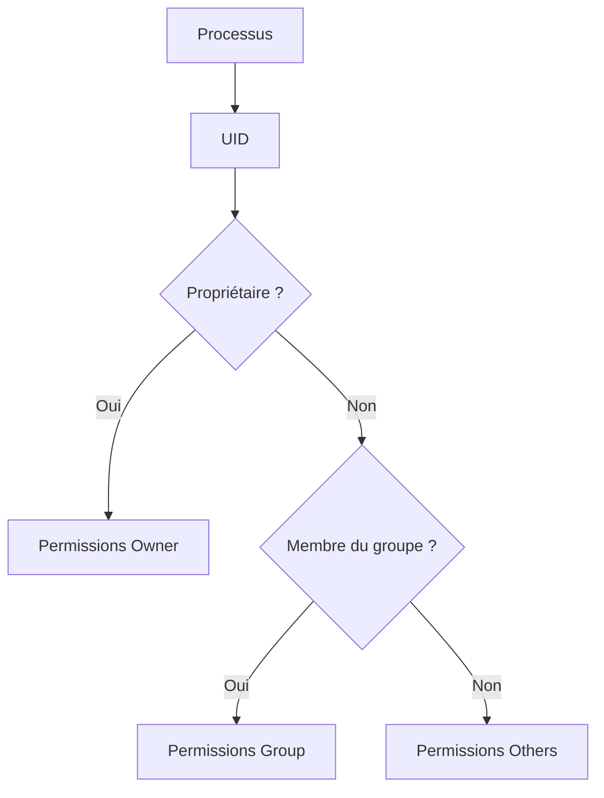

Une fois la catégorie déterminée,

le noyau vérifie simplement les permissions correspondantes.

---

# Exemple complet

Considérons.

```text
-rw-r-----
```

Propriétaire.

```text
alice
```

Groupe.

```text
developers
```

Visualisons.

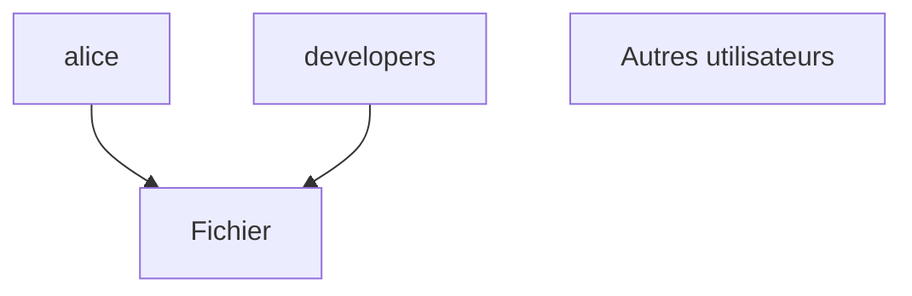

Conséquences.

| Utilisateur | Lecture | Écriture |
|--------------|:------:|:--------:|
| alice | ✅ | ✅ |
| Membre de developers | ✅ | ❌ |
| Tous les autres | ❌ | ❌ |

Le noyau prendra cette décision à chaque tentative d'accès.

---

# Pourquoi les services possèdent-ils leurs propres permissions ?

Reprenons Sentinel.

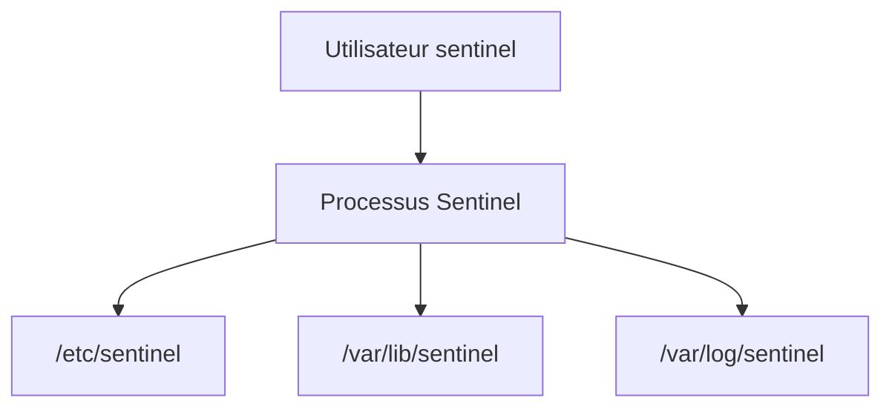

Le service n'a besoin d'accéder qu'à ses propres ressources.

Il ne doit jamais pouvoir :

- modifier `/etc/passwd` ;
- lire les clés SSH des utilisateurs ;
- accéder aux données de PostgreSQL ;
- modifier les fichiers système.

Cette séparation limite considérablement les conséquences d'une compromission.

---

# Les permissions ne suffisent pas toujours

Le modèle Unix est volontairement simple.

Il répond uniquement à trois questions.

- Le propriétaire ?
- Le groupe ?
- Les autres ?

Mais certaines situations sont plus complexes.

Par exemple.

> **Autoriser Alice et Bob à lire un fichier, sans autoriser le reste du groupe.**

Ou encore.

> **Autoriser une application à accéder à un seul répertoire spécifique.**

Pour répondre à ces besoins,

Linux propose d'autres mécanismes.

- ACL (*Access Control Lists*)
- SELinux
- Capabilities

Nous les étudierons plus loin dans la formation.

Il est néanmoins essentiel de comprendre que ces mécanismes **complètent** les permissions Unix.

Ils ne les remplacent pas.

---
# 💎 Le point d'expertise

## Les permissions sont évaluées à chaque accès

Une idée reçue très répandue consiste à penser que les permissions sont vérifiées uniquement lors de l'ouverture d'un fichier.

En réalité,

le noyau effectue des contrôles à chaque opération sensible.

Prenons un exemple.

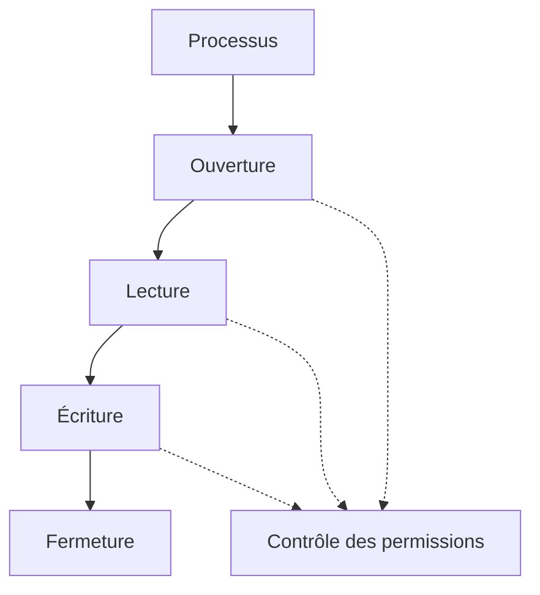

À chaque étape,

le noyau peut autoriser ou refuser l'opération.

C'est ce qui garantit qu'un programme ne peut pas contourner simplement les protections Unix.

---

## Les UID sont plus importants que les noms

Beaucoup d'administrateurs raisonnent avec les noms :

```text
tom

alice

postgres

sentinel
```

Pourtant,

le noyau ignore complètement ces noms.

Il ne connaît que les identifiants numériques.

Visualisons.

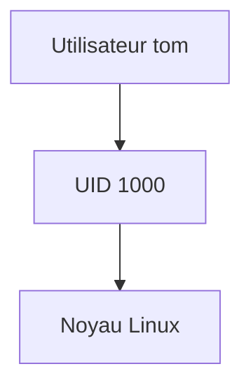

C'est pourquoi renommer un utilisateur n'entraîne généralement aucune modification des permissions.

Les fichiers appartiennent en réalité à un **UID**, pas à un nom.

---

## Les groupes simplifient énormément l'administration

Imaginons une équipe de vingt administrateurs.

Sans groupes,

il faudrait attribuer les permissions vingt fois.

Avec un groupe.

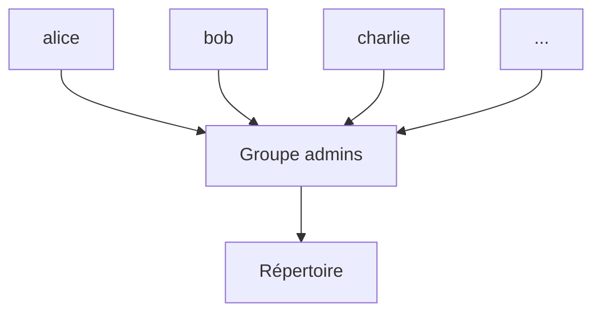

Une seule règle suffit.

L'ajout d'un nouvel administrateur consiste simplement à l'ajouter au groupe.

Cette approche est utilisée partout :

- équipes DevOps ;
- équipes Sécurité ;
- équipes Base de données ;
- équipes Réseau.

---

## Pourquoi root n'est-il pas utilisé par les services ?

Historiquement,

beaucoup de services fonctionnaient en permanence avec les privilèges root.

Aujourd'hui,

ce modèle est considéré comme dangereux.

L'approche moderne consiste à utiliser un compte dédié.

Par exemple.

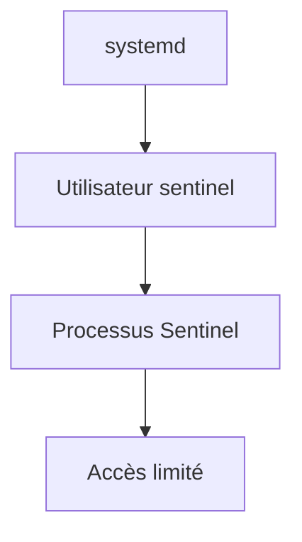

Même si une vulnérabilité est exploitée,

l'attaquant reste limité aux permissions du compte `sentinel`.

Cette approche sera appliquée tout au long de notre projet.

---

# 🧠 Comment pense un architecte ?

Lorsqu'il crée une nouvelle application,

un architecte ne commence pas par choisir un langage.

Il répond d'abord à plusieurs questions de sécurité.

- Quel utilisateur exécutera le service ?
- Quel groupe possédera les données ?
- Quels répertoires seront accessibles ?
- Quels fichiers devront être protégés ?
- L'application aura-t-elle réellement besoin des privilèges root ?

Visualisons.

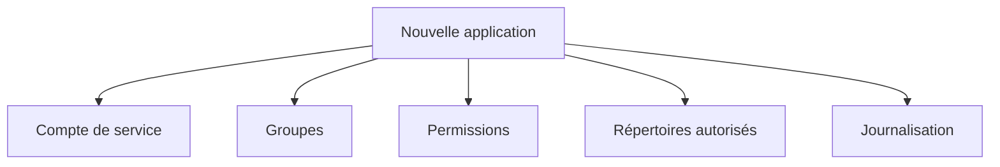

Toutes ces décisions précèdent le développement lui-même.

---

## Les permissions préparent déjà SELinux

Beaucoup pensent que SELinux remplace les permissions Unix.

Ce n'est pas le cas.

Les contrôles sont successifs.

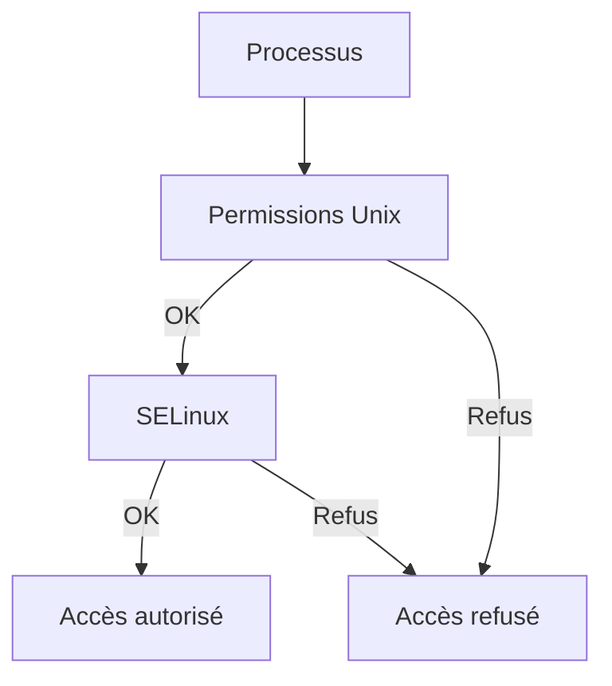

Autrement dit,

même si les permissions Unix autorisent un accès,

SELinux pourra encore le refuser.

Nous retrouverons exactement cette logique dans la campagne consacrée à SELinux.

---

# ⚔️ Comment pense un attaquant ?

Après avoir compromis une application,

un attaquant cherche immédiatement à répondre à plusieurs questions.

- Quel est mon UID ?
- Quels groupes possède ce processus ?
- Quels fichiers puis-je modifier ?
- Puis-je devenir root ?

Les premières commandes exécutées sont souvent.

```bash
id
```

```bash
whoami
```

```bash
groups
```

```bash
ls -la
```

Pourquoi ?

Parce qu'elles permettent d'évaluer immédiatement les possibilités d'élévation de privilèges.

Une bonne politique de permissions limite fortement ces possibilités.

---

# 🏢 En entreprise

Dans les grandes infrastructures,

la gestion des identités est rarement réalisée localement.

Les utilisateurs proviennent généralement d'un annuaire centralisé.

Par exemple.

```mermaid
flowchart TD

A["FreeIPA / Active Directory"]

B["Utilisateur"]

C["Groupes"]

D["Serveur AlmaLinux"]

A --> B
A --> C

B --> D
C --> D
```

Le serveur ne crée donc pas manuellement tous les comptes.

Il interroge un service d'identité central.

Cette approche facilite :

- l'administration ;
- les audits ;
- la révocation des accès ;
- l'automatisation.

Nous construirons cette architecture avec **FreeIPA** dans une campagne ultérieure.

---

# 📚 Culture technique

## Pourquoi existe-t-il autant de comptes système ?

Lors d'une première lecture de :

```text
/etc/passwd
```

beaucoup de débutants sont surpris.

Ils découvrent des utilisateurs tels que :

- `chrony`
- `rpc`
- `sssd`
- `dbus`
- `systemd-network`
- `postfix`

Ces comptes ne représentent pas des personnes.

Ils existent pour isoler les services.

Autrefois,

plusieurs services fonctionnaient avec le compte `root`.

Aujourd'hui,

la plupart disposent de leur propre identité,

ce qui réduit considérablement l'impact d'une éventuelle compromission.

C'est exactement ce que nous ferons avec le compte **`sentinel`**.

---
# ⚠️ Piège classique

## Utiliser le compte root pour exécuter une application

Une erreur très fréquente consiste à lancer une application directement avec :

```bash
sudo ./mon_application
```

ou pire,

à configurer un service pour qu'il s'exécute en permanence sous :

```text
root
```

Cette approche fonctionne...

mais elle augmente énormément les risques.

Si une vulnérabilité est découverte dans l'application,

l'attaquant récupère immédiatement les privilèges du compte root.

La bonne pratique est toujours :

- créer un utilisateur de service ;
- lui attribuer uniquement les permissions nécessaires ;
- exécuter le service avec cette identité.

---

## Utiliser chmod 777

Lorsqu'un problème de permissions apparaît,

la solution la plus souvent rencontrée sur Internet est :

```bash
chmod 777 fichier
```

Cette commande donne :

- lecture ;
- écriture ;
- exécution

à tout le monde.

Elle masque généralement le problème,

mais crée une faille de sécurité.

Avant de modifier les permissions,

il faut toujours répondre à ces questions.

- Quel utilisateur exécute réellement le programme ?
- À quel groupe appartient-il ?
- Quelle permission manque exactement ?

La bonne solution est presque toujours beaucoup plus restrictive.

---

## Modifier les propriétaires au hasard

Autre erreur classique.

```bash
sudo chown -R utilisateur /
```

ou.

```bash
sudo chown -R tom /etc
```

Ces commandes peuvent rendre le système instable,

voire inutilisable.

Avant d'utiliser `chown`,

il faut comprendre :

- qui est censé posséder les fichiers ;
- pourquoi ils appartiennent actuellement à cet utilisateur ;
- si ce propriétaire est défini par un paquet RPM.

---

# Laboratoire AlmaLinux

## Objectif

Comprendre comment Linux associe les identités aux processus et applique les permissions.

---

## Étape 1 — Identifier votre utilisateur

Afficher.

```bash
whoami
```

Puis.

```bash
id
```

Observer notamment :

- votre UID ;
- votre groupe principal ;
- vos groupes secondaires.

---

## Étape 2 — Explorer les comptes système

Afficher.

```bash
cat /etc/passwd
```

Repérer plusieurs comptes tels que :

- chrony
- rpc
- sssd
- dbus
- postfix

Essayez d'identifier le service correspondant.

Vous constaterez qu'ils utilisent généralement :

```text
/usr/sbin/nologin
```

comme shell.

---

## Étape 3 — Observer les permissions

Créer un fichier.

```bash
touch demo.txt
```

Afficher.

```bash
ls -l demo.txt
```

Modifier ensuite ses permissions.

```bash
chmod 640 demo.txt
```

Puis.

```bash
chmod 750 demo.txt
```

Observer les différences.

---

## Étape 4 — Modifier le propriétaire

Créer un second utilisateur dans votre laboratoire (si celui-ci est dédié aux tests).

Puis.

```bash
sudo chown nouvel_utilisateur demo.txt
```

Observer immédiatement le changement dans :

```bash
ls -l
```

---

## Étape 5 — Vérifier la décision du noyau

Essayez d'accéder à un fichier :

- en tant que propriétaire ;
- en tant que membre du groupe ;
- avec un utilisateur ne possédant aucun droit.

Analysez le comportement du noyau.

Essayez d'expliquer **pourquoi** chaque accès est accepté ou refusé.

---

# Mission d'ingénieur

Vous devez préparer le futur déploiement de Sentinel.

Définissez précisément :

| Élément | Utilisateur | Groupe | Permissions |
|----------|-------------|---------|-------------|
| Exécutable | | | |
| Configuration | | | |
| Certificats TLS | | | |
| Journaux | | | |
| Base SQLite | | | |
| Socket Unix | | | |

Justifiez chacune de vos décisions.

Votre objectif n'est pas simplement de faire fonctionner l'application,

mais de limiter au maximum les privilèges accordés au service.

---

# Impact sur Sentinel

Les décisions prises dans ce chapitre seront conservées jusqu'à la fin de la formation.

Nous créerons prochainement :

- un utilisateur système `sentinel` ;
- un groupe `sentinel` ;
- une arborescence conforme au FHS ;
- des permissions adaptées à chaque ressource.

Par la suite,

nous ajouterons progressivement :

- SELinux ;
- les ACL ;
- les Linux Capabilities ;
- systemd ;
- FreeIPA.

Toutes ces technologies viendront **compléter** le modèle de permissions étudié ici.

---

# Ce qu'il faut retenir

- Linux identifie les utilisateurs grâce aux **UID** et les groupes grâce aux **GID**.
- Les processus héritent automatiquement de l'identité de leur créateur.
- Les permissions Unix reposent sur trois catégories : **Owner**, **Group** et **Others**.
- Chaque catégorie dispose de trois droits : **lecture**, **écriture** et **exécution**.
- Les comptes système permettent d'isoler les services et de limiter les conséquences d'une compromission.
- Les permissions Unix constituent la première couche de contrôle d'accès ; elles seront ensuite renforcées par **SELinux**, les **ACL** et les **Capabilities**.

---

# Grande infographie de révision du chapitre

```text
┌──────────────────────────────────────────────────────────────────────────────────────────────┐
│          CHAPITRE 1.7 — UTILISATEURS, GROUPES ET PERMISSIONS                                 │
├──────────────────────────────────────────────────────────────────────────────────────────────┤
│                                                                                              │
│                         MODÈLE D'IDENTITÉ LINUX                                               │
│                                                                                              │
│ Utilisateur                                                                                  │
│      │                                                                                       │
│      ▼                                                                                       │
│ UID                                                                                          │
│      │                                                                                       │
│      ▼                                                                                       │
│ Processus                                                                                    │
│      │                                                                                       │
│      ▼                                                                                       │
│ Accès aux ressources                                                                          │
│                                                                                              │
├──────────────────────────────────────────────────────────────────────────────────────────────┤
│                         CONTRÔLE D'ACCÈS                                                     │
│                                                                                              │
│ Processus                                                                                    │
│      │                                                                                       │
│      ▼                                                                                       │
│ UID / GID                                                                                    │
│      │                                                                                       │
│      ▼                                                                                       │
│ Owner ? ─────► Oui → Permissions Owner                                                       │
│      │                                                                                       │
│      └──► Groupe ? ─► Oui → Permissions Group                                                 │
│              │                                                                               │
│              └──────────────► Permissions Others                                              │
│                                                                                              │
├──────────────────────────────────────────────────────────────────────────────────────────────┤
│                         PERMISSIONS UNIX                                                     │
│                                                                                              │
│ r = Lecture = 4                                                                              │
│ w = Écriture = 2                                                                             │
│ x = Exécution = 1                                                                            │
│                                                                                              │
│ 750 → rwxr-x---                                                                              │
│ 640 → rw-r-----                                                                              │
│ 600 → rw-------                                                                              │
│                                                                                              │
├──────────────────────────────────────────────────────────────────────────────────────────────┤
│                       COMPTES SYSTÈME                                                        │
│                                                                                              │
│ chrony                                                                                       │
│ sssd                                                                                         │
│ postgres                                                                                     │
│ nginx                                                                                        │
│ sentinel                                                                                     │
│                                                                                              │
│ Chaque service possède sa propre identité.                                                   │
│                                                                                              │
├──────────────────────────────────────────────────────────────────────────────────────────────┤
│                     ARCHITECTURE DE SENTINEL                                                 │
│                                                                                              │
│ Utilisateur sentinel                                                                         │
│        │                                                                                     │
│        ▼                                                                                     │
│ Processus Sentinel                                                                           │
│        │                                                                                     │
│        ├──► /etc/sentinel                                                                    │
│        ├──► /var/lib/sentinel                                                                │
│        ├──► /var/log/sentinel                                                                │
│        └──► /run/sentinel                                                                    │
│                                                                                              │
├──────────────────────────────────────────────────────────────────────────────────────────────┤
│                                IDÉE CLÉ                                                      │
│                                                                                              │
│ « La sécurité d'un système Linux commence                                                    │
│  par une identité clairement définie et                                                      │
│  des permissions limitées au strict nécessaire. »                                            │
└──────────────────────────────────────────────────────────────────────────────────────────────┘
```
