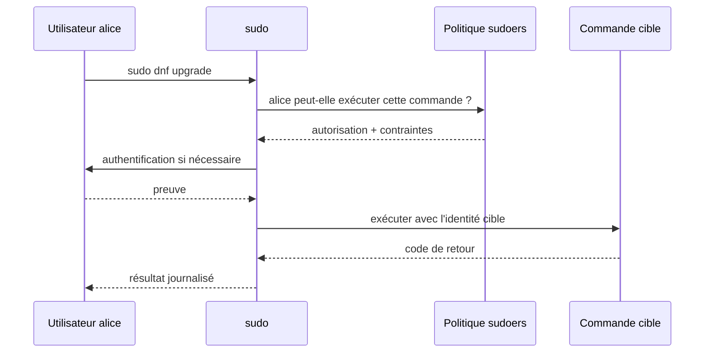
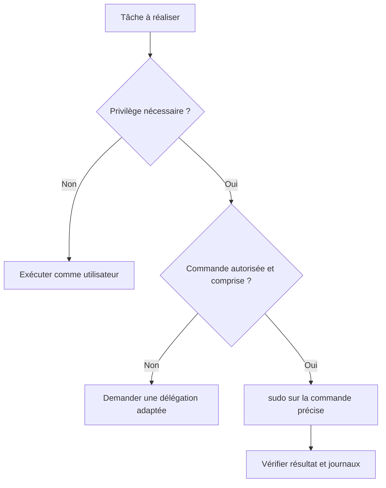
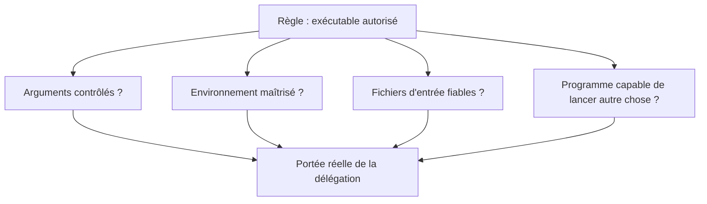
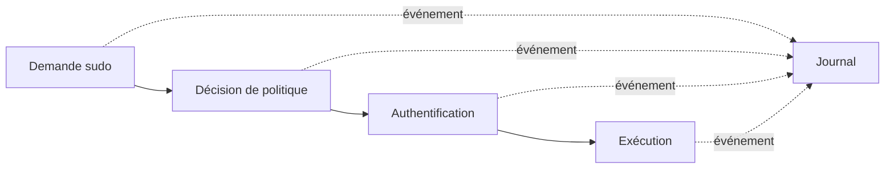

# Chapitre 1.8 — Administrer avec `sudo`

> **Campagne 1 — Installation et fondations**

> *« L'administration est une élévation contrôlée, pas une identité permanente. »*

## Vous êtes ici

```text
PARTIE I — Construire un socle sécurisé

Campagne 1

  1.1 Pourquoi sécuriser un socle Linux ? ✔
  1.2 Installer AlmaLinux minimal ✔
  1.3 Comprendre les composants du système ✔
  1.4 Établir la baseline du serveur ✔
  1.5 Mettre à jour et gérer les dépôts ✔
  1.6 Organiser les systèmes de fichiers ✔
  1.7 Comprendre identités et permissions ✔
► 1.8 Administrer avec sudo
  1.9 Mission : mettre le serveur en sécurité
  1.10 Créer le laboratoire Sentinel
```

## Objectifs pédagogiques

À l'issue de ce chapitre, vous serez capable de :

- expliquer le rôle de `sudo` dans une administration nominative ;
- distinguer utilisateur appelant, identité cible et commande autorisée ;
- vérifier ses droits, utiliser l'élévation pour une commande et fermer son cache ;
- retrouver la trace d'une élévation dans les journaux ;
- éviter les sessions `root`, redirections trompeuses et délégations trop larges.

## Pourquoi ce chapitre existe

Les tâches quotidiennes doivent être réalisées avec un compte nominatif non privilégié. Certaines opérations — installer un paquet, modifier une configuration système ou consulter un journal protégé — nécessitent pourtant une autorité supérieure. `sudo` fournit une transition explicite, soumise à une politique et journalisée.

Ce chapitre couvre l'usage sûr au quotidien. La campagne 2 traitera l'écriture avancée des règles `sudoers`, les alias, les fichiers sous `/etc/sudoers.d`, l'environnement et les délégations fines.

## Trois identités à ne pas confondre

Une exécution `sudo` implique l'utilisateur qui demande, la politique qui décide et l'identité cible sous laquelle la commande s'exécute.



Par défaut, l'identité cible est souvent `root`, mais `sudo` peut viser un autre utilisateur. Dire « passer root » masque donc la décision importante : **qui peut exécuter quelle commande, comme quelle identité et dans quel contexte ?**

## `sudo`, `su` et session `root`

`su` ouvre un shell ou lance une commande comme une autre identité, après authentification selon la politique PAM. Une connexion directe comme `root` ou un long shell privilégié concentre de nombreux gestes sous une identité générique.

`sudo` favorise au contraire des commandes ponctuelles reliées à l'appelant. Il ne rend pas une commande sûre et ne limite pas automatiquement un utilisateur membre d'un rôle très large ; il fournit le mécanisme sur lequel une politique de moindre privilège peut s'appuyer.

| Pratique | Identité visible | Portée | Traçabilité |
| --- | --- | --- | --- |
| commande ordinaire | utilisateur nominatif | droits usuels | journaux applicables |
| `sudo commande` | appelant + cible | une commande | décision et exécution tracées |
| `sudo -i` | appelant puis shell cible | session entière | début visible, gestes internes moins explicites |
| connexion `root` | identité partagée | session entière | attribution humaine difficile |

Préférez la commande ponctuelle. Un shell privilégié reste parfois nécessaire pour une procédure contrôlée, mais il doit être court, justifié et suivi d'une validation.

## Vérifier avant d'utiliser

Commencez par votre identité et les autorisations que la politique vous présente :

```bash
id
sudo -l
sudo -V | sed -n '1,20p'
```

`sudo -l` ne doit pas être interprété trop vite. Une commande autorisée avec des arguments libres, un éditeur, un interpréteur ou un gestionnaire de paquets peut offrir des possibilités bien plus larges que son nom ne le suggère. L'analyse détaillée appartient à la campagne 2 ; dans ce chapitre, signalez toute règle que vous ne comprenez pas.

Le groupe `wheel` reçoit fréquemment une délégation d'administration générale sur AlmaLinux. L'appartenance à ce groupe équivaut donc à un privilège fort et doit être limitée aux administrateurs autorisés.

## Élever une seule commande

Comparez l'identité ordinaire et la cible :

```bash
id
sudo id
sudo -u root id
```

Puis utilisez l'élévation uniquement sur la commande qui en a besoin :

```bash
sudo dnf repolist
sudo systemctl status chronyd --no-pager
```

N'ajoutez pas `sudo` à toutes les commandes d'un copier-coller. `ip address`, `systemctl status` et de nombreuses lectures fonctionnent déjà sans élévation. Exécuter en privilège supérieur augmente les conséquences d'une erreur de chemin, d'une variable vide ou d'un fichier malveillant.



## Comprendre les redirections

Le shell traite `>` avant que `sudo` ne lance la commande. Cette construction échoue donc si votre utilisateur ne peut pas ouvrir le fichier cible :

```bash
sudo printf '%s\n' 'valeur' > /etc/exemple.conf
```

La solution n'est pas systématiquement `sudo sh -c`, qui donne à un shell entier l'autorité cible. Pour installer un fichier préparé et relu, préférez un outil explicite :

```bash
printf '%s\n' 'valeur' > ~/exemple.conf
sudo install -o root -g root -m 0644 ~/exemple.conf /etc/exemple.conf
```

Dans un laboratoire réel, utilisez un chemin prévu, validez la syntaxe avant remplacement et conservez une stratégie de retour arrière. Ne créez pas `/etc/exemple.conf` uniquement pour tester cette commande.

### Arguments, environnement et programmes indirects

Une autorisation portant sur un exécutable n'implique pas que tous ses usages ont la même portée. Un éditeur peut ouvrir un shell, un interpréteur exécute du code arbitraire et un gestionnaire de paquets lance des scripts fournis par les paquets. Autoriser `sudo python`, `sudo vi` ou une commande avec un chemin de fichier contrôlé par l'appelant peut donc équivaloir à une délégation beaucoup plus large.

L'environnement constitue une autre entrée. `sudo` filtre ou reconstruit certaines variables selon sa politique, mais une commande peut encore lire des fichiers de configuration, chercher des greffons ou suivre des chemins fournis en argument. Utilisez des chemins absolus dans les procédures sensibles et ne supposez pas qu'un nom de commande suffit à définir sa sécurité.



Au quotidien, cette analyse conduit à préparer les entrées sans privilège, les relire, puis utiliser une commande d'installation ou de validation précise. Pour une configuration systemd, par exemple, l'administrateur peut travailler sur une copie dans son espace, exécuter un contrôle de syntaxe, comparer le diff, installer le fichier comme `root`, recharger systemd et tester l'unité.

La campagne 2 traduira ces principes en règles `sudoers`. Retenez dès maintenant qu'une règle apparemment étroite doit être testée comme le ferait un utilisateur curieux : peut-il choisir un autre fichier, altérer une variable, remplacer une dépendance ou obtenir un shell ? Le moindre privilège porte sur la capacité réelle, pas sur l'apparence de la ligne de commande.

## Authentification et cache

Selon la politique, `sudo` demande généralement le secret de l'utilisateur appelant : il vérifie que la personne présente contrôle encore sa session. Une authentification réussie peut être mémorisée pendant une courte durée.

```bash
sudo -v
sudo -n true
sudo -k
```

`sudo -v` actualise la preuve d'authentification, `-n` refuse toute interaction et `sudo -k` invalide l'horodatage courant. Sur un poste partagé ou avant de vous éloigner, invalidez le cache et verrouillez la session.

Le cache améliore l'ergonomie mais crée une fenêtre pendant laquelle une personne ayant accès à la session peut lancer une commande autorisée sans nouvelle saisie. Sa durée et son périmètre relèvent de la politique de l'organisation.

## Journaliser et interpréter

Sur un système utilisant journald, recherchez les événements de `sudo` :

```bash
sudo journalctl _COMM=sudo -b --no-pager
sudo journalctl _COMM=sudo -b -n 20 --no-pager
```

Selon la configuration et la version, les messages peuvent aussi être accessibles par l'unité ou les journaux d'authentification. Identifiez l'utilisateur appelant, le terminal, le répertoire courant, l'identité cible et la commande.



La présence d'un journal local n'empêche pas un administrateur puissant de l'altérer. Les campagnes d'audit et de centralisation renforceront la conservation et la corrélation.

## `sudo` n'est pas destiné à Sentinel

Le processus Sentinel ne lancera pas `sudo`. Un service non interactif ne doit pas posséder un mot de passe ou une délégation générale pour contourner de mauvaises permissions.

Les tâches privilégiées seront réparties :

- le paquet installe le logiciel et prépare certains chemins ;
- systemd démarre le processus avec l'identité `sentinel` ;
- l'administrateur modifie les configurations par un changement contrôlé ;
- le service lit et écrit uniquement les objets prévus ;
- les opérations spécialisées sont déléguées par des mécanismes explicites, pas par un shell `root` caché.

Si Sentinel « a besoin de sudo », commencez par reformuler l'opération exacte. Il faut souvent corriger un propriétaire, créer un répertoire au démarrage ou séparer un composant privilégié très limité.

## TP 1 — Exercer une élévation ponctuelle

1. relevez `id` et `sudo -l` ;
2. invalidez le cache avec `sudo -k` ;
3. exécutez `sudo id` et observez la cible ;
4. exécutez une lecture autorisée comme `sudo dnf repolist` ;
5. invalidez de nouveau le cache ;
6. vérifiez avec `sudo -n true` qu'une interaction serait nécessaire.

Notez pour chaque étape l'identité appelante, l'identité cible et le résultat. N'utilisez pas une commande de modification uniquement pour démontrer `sudo`.

## TP 2 — Relire la trace

Collectez les événements correspondant au TP 1 et construisez une chronologie : demande, authentification réussie ou refusée, commande, cible et code de retour si disponible.

Comparez l'heure avec `timedatectl` et vérifiez que le nom d'hôte et l'utilisateur sont identifiables. Expliquez ce que le journal prouve et ce qu'il ne prouve pas, notamment le contenu des actions réalisées dans un éventuel shell interactif.

## Mission d'ingénieur — Administrer sans session permanente

Préparez une procédure pour trois opérations Sentinel futures : installer le paquet, déployer une configuration validée et redémarrer le service. Pour chaque opération, précisez :

1. étapes ordinaires sans privilège ;
2. commande exacte nécessitant une élévation ;
3. identité cible ;
4. validation avant exécution ;
5. preuve dans le journal ;
6. test après changement ;
7. retour arrière ;
8. raison pour laquelle le processus `sentinel` ne reçoit pas ce droit.

La procédure doit éviter `sudo -i`, `sudo su` et les permissions `NOPASSWD` non justifiées. La politique fine sera conçue en 2.8.

## Impact sur Sentinel

Sentinel sera exploité par des administrateurs nominatifs qui élèvent seulement les commandes de changement. Le service lui-même restera non privilégié. Cette séparation améliore le confinement, la relecture des opérations et la possibilité d'automatiser des actions précises.

## Synthèse

- `sudo` applique une politique entre un appelant, une commande et une identité cible.
- Une commande ponctuelle est plus lisible et moins risquée qu'une longue session `root`.
- `sudo -l` expose les droits ; leur portée réelle doit être analysée.
- Le shell traite les redirections, ce qui explique plusieurs erreurs d'élévation.
- Le cache d'authentification doit être compris et invalidé sur une session exposée.
- Les événements `sudo` apportent une trace, renforcée plus tard par l'audit centralisé.
- Sentinel ne doit jamais lancer `sudo` pour compenser une conception de permissions défaillante.

## Infographie de révision

```text
UTILISATEUR NOMINATIF
        │
        ├── tâche ordinaire ─────────────► droits usuels
        │
        └── tâche privilégiée ─► sudo ─► politique ─► identité cible
                                   │                         │
                                   └────── journal ──────────┘

UNE COMMANDE PRÉCISE • UNE RAISON • UNE TRACE • UN TEST

Sentinel : service non privilégié, aucune délégation sudo.
```

## Pour aller plus loin

Consultez `man sudo`, `man sudoers` et `man journalctl`. Ne modifiez jamais `/etc/sudoers` avec un éditeur ordinaire ; la campagne 2 utilisera `visudo` et des fichiers dédiés pour valider la syntaxe.

Chapitre suivant : appliquer ensemble baseline, mises à jour, services, accès et preuves dans une mission de première mise en sécurité.

← [1.7 — Comprendre identités et permissions](1.7-utilisateurs-groupes-permissions.md) · [1.9 — Mission : mettre le serveur en sécurité](1.9-premiere-mise-en-securite-serveur.md) →
