# Chapitre 1.8 — `sudo` et principe du moindre privilège

> **Campagne 1 — Installation et fondations**

> *« Les privilèges administrateur ne doivent jamais être permanents. Ils doivent être exceptionnels, temporaires et justifiés. »*

---

## Vous êtes ici

```text
Partie I — Construire un socle sécurisé

Campagne 1 — Installation et fondations

      1.1 Pourquoi sécuriser un socle Linux ?
      1.2 Installation d'AlmaLinux Minimal
      1.3 Comprendre les composants d'un système Linux
      1.4 Premier démarrage et premières vérifications
      1.5 Mise à jour et gestion des dépôts
      1.6 Architecture des systèmes de fichiers
      1.7 Utilisateurs, groupes et permissions
    ► 1.8 sudo et principe du moindre privilège
      1.9 Première mise en sécurité du serveur
      1.10 Création du laboratoire Sentinel
```

---

## Objectifs pédagogiques

À la fin de ce chapitre, vous serez capable de :

- expliquer le rôle de `sudo` ;
- distinguer `sudo` de `su` ;
- comprendre le principe du moindre privilège (*Least Privilege*) ;
- configurer une administration moderne d'un serveur Linux ;
- préparer les futures politiques d'administration de Sentinel.

---

## Pourquoi ce chapitre existe

Nous savons maintenant que :

- chaque utilisateur possède une identité ;
- chaque processus hérite de cette identité ;
- le noyau contrôle les permissions.

Une question reste pourtant sans réponse.

> **Comment un administrateur peut-il effectuer des tâches réservées à root sans travailler en permanence avec le compte root ?**

La réponse est :

```text
sudo
```

Aujourd'hui,

presque toutes les infrastructures Linux professionnelles utilisent cette approche.

---

## Pourquoi ne pas travailler directement avec root ?

Imaginons deux administrateurs.

Le premier ouvre une session root.

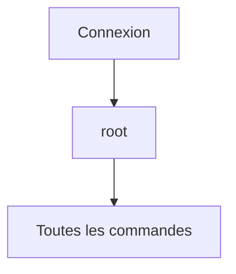

Toutes les commandes disposent immédiatement des privilèges maximum.

Une simple erreur peut alors avoir des conséquences importantes.

---

Le second utilise son compte personnel.

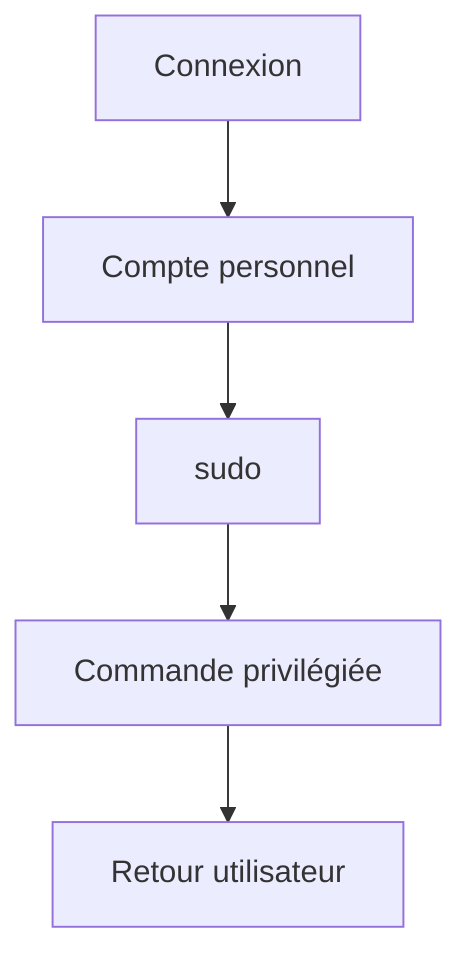

Les privilèges élevés n'existent que pendant quelques secondes.

Le risque est considérablement réduit.

---

## Le principe du moindre privilège

Toute la philosophie de `sudo` repose sur un principe majeur.

> **Un utilisateur ne doit posséder que les privilèges nécessaires à la tâche qu'il réalise.**

Ni plus.

Ni moins.

Ce principe est connu sous le nom de :

```text
Least Privilege
```

On le retrouve partout.

- Linux
- Windows
- Kubernetes
- AWS
- Azure
- Bases de données
- FreeIPA

Il constitue l'un des fondements de la cybersécurité moderne.

---

## Comment fonctionne sudo ?

Le fonctionnement est simple.

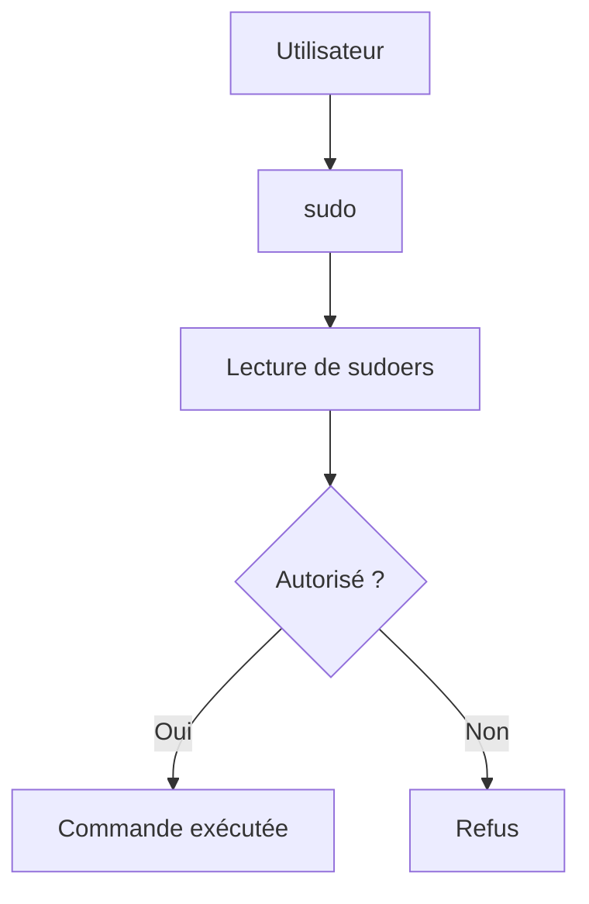

Contrairement à une idée reçue,

`sudo` ne donne pas automatiquement tous les droits.

Il vérifie d'abord si la commande demandée est autorisée.

---

## Une élévation temporaire

Prenons un exemple.

```bash
sudo dnf update
```

Visualisons.

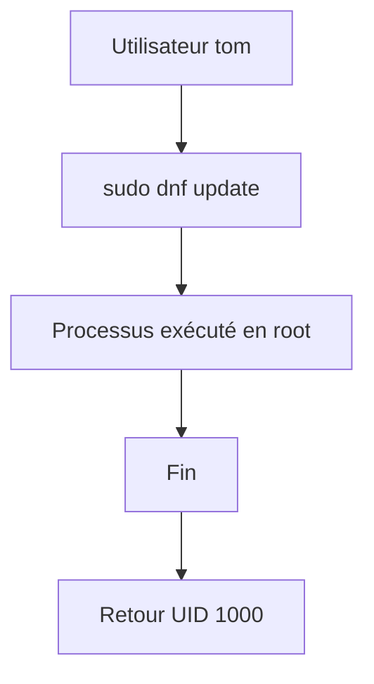

Une fois la commande terminée,

vous redevenez immédiatement un utilisateur classique.

Cette caractéristique explique pourquoi `sudo` est beaucoup plus sûr qu'une session root permanente.

---

## sudo n'est pas root

Une confusion très fréquente consiste à penser que :

```text
sudo = root
```

C'est faux.

`sudo` est simplement un programme.

Son rôle consiste à :

- authentifier l'utilisateur ;
- vérifier les autorisations ;
- lancer une commande sous une autre identité.

Le plus souvent,

cette identité est :

```text
root
```

Mais il est parfaitement possible d'exécuter une commande sous un autre utilisateur.

Par exemple.

```bash
sudo -u postgres psql
```

Le processus sera exécuté avec l'identité :

```text
postgres
```

et non avec celle de root.

---

## sudo contre su

Ces deux commandes sont souvent confondues.

Pourtant,

leur philosophie est très différente.

### su

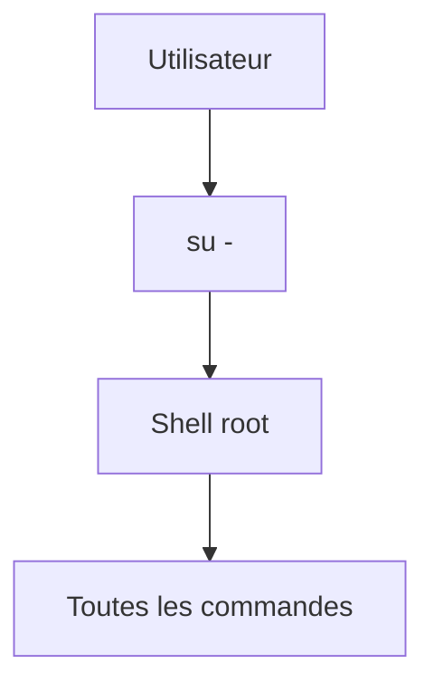

`su` ouvre une nouvelle session.

Toutes les commandes suivantes disposent alors des privilèges élevés.

---

### sudo

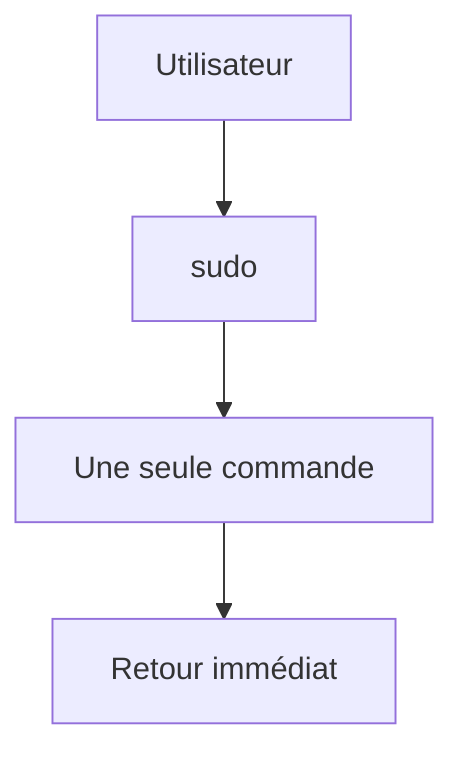

Aucune nouvelle session n'est créée.

Une seule commande bénéficie temporairement de privilèges supplémentaires.

C'est précisément ce comportement qui fait de `sudo` la méthode recommandée.

---
## Où sont définies les autorisations ?

Les règles utilisées par `sudo` sont stockées dans un fichier particulier.

```text
/etc/sudoers
```

Ce fichier indique notamment :

- quels utilisateurs peuvent utiliser `sudo` ;
- quelles commandes sont autorisées ;
- sous quelle identité elles peuvent être exécutées ;
- si un mot de passe est nécessaire.

Une erreur dans ce fichier peut empêcher toute administration du système.

C'est pourquoi il ne doit jamais être modifié avec un éditeur classique.

---

## visudo

La commande recommandée est :

```bash
sudo visudo
```

Pourquoi ?

Parce qu'elle :

- verrouille le fichier pendant l'édition ;
- vérifie automatiquement la syntaxe ;
- refuse d'enregistrer un fichier invalide.

Visualisons.

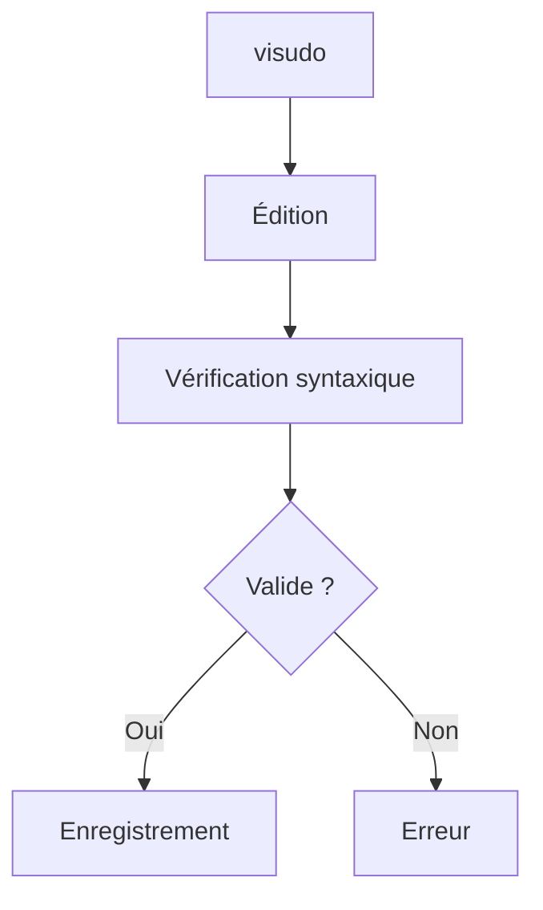

C'est une excellente habitude à adopter dès le début.

---

## Le groupe wheel

Sous AlmaLinux,

les administrateurs appartiennent généralement au groupe :

```text
wheel
```

Visualisons.

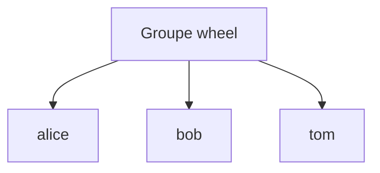

Le fichier `sudoers` contient généralement une règle proche de celle-ci.

```text
%wheel ALL=(ALL) ALL
```

Décodons-la.

| Élément | Signification |
|----------|---------------|
| `%wheel` | Tous les membres du groupe wheel |
| `ALL` | Depuis n'importe quelle machine |
| `(ALL)` | En tant que n'importe quel utilisateur |
| `ALL` | Toutes les commandes |

Autrement dit,

les membres du groupe `wheel` peuvent administrer complètement le système.

---

## Vérifier ses droits

Pour connaître les autorisations disponibles.

```bash
sudo -l
```

Exemple.

```text
User tom may run the following commands...

(ALL) ALL
```

Cette commande est très utile pour :

- vérifier une configuration ;
- comprendre un refus ;
- auditer un serveur.

---

## Le cache d'authentification

Après avoir saisi votre mot de passe,

vous remarquerez que `sudo` ne le redemande pas immédiatement.

Pourquoi ?

Parce qu'il conserve un jeton temporaire.

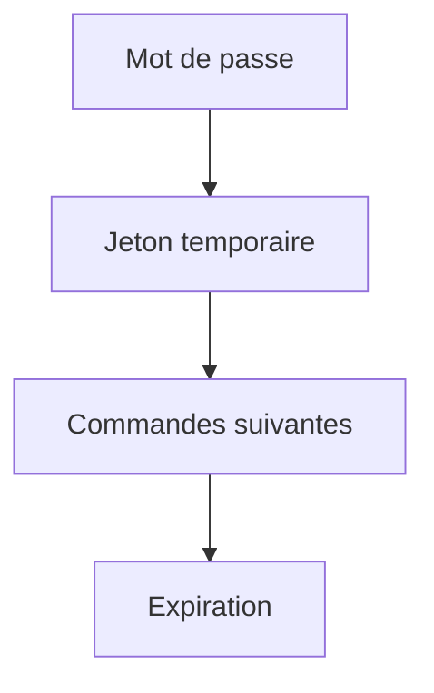

Au bout de quelques minutes,

ce jeton expire automatiquement.

Il faudra alors saisir à nouveau votre mot de passe.

---

## Pourquoi demander le mot de passe de l'utilisateur ?

Une question revient souvent.

> Pourquoi `sudo` demande-t-il mon mot de passe et non celui de root ?

Parce que `sudo` cherche à vérifier :

> **Qui demande l'élévation de privilèges ?**

Il authentifie donc l'utilisateur courant.

Cette approche présente plusieurs avantages.

- chaque administrateur possède son propre mot de passe ;
- les actions sont traçables ;
- il n'est pas nécessaire de partager le mot de passe root.

---

## Journalisation

Chaque utilisation de `sudo` est enregistrée.

Visualisons.

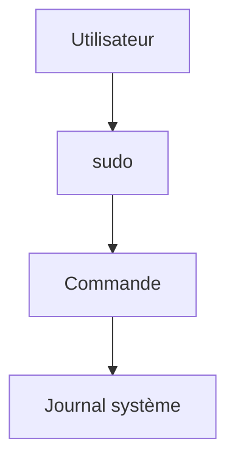

On retrouve notamment :

- l'utilisateur ;
- la date ;
- la commande exécutée.

Cette journalisation est essentielle pour :

- les audits ;
- les enquêtes de sécurité ;
- la traçabilité.

---

## Pourquoi éviter les sessions root ?

Imaginons deux scénarios.

Premier scénario.

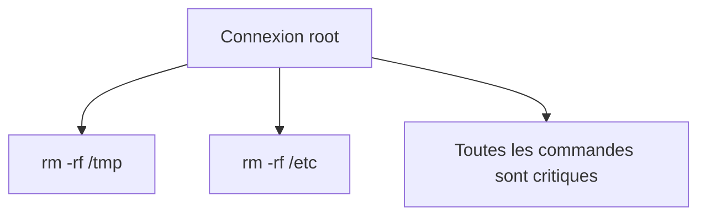

Chaque erreur possède immédiatement les privilèges maximum.

---

Deuxième scénario.

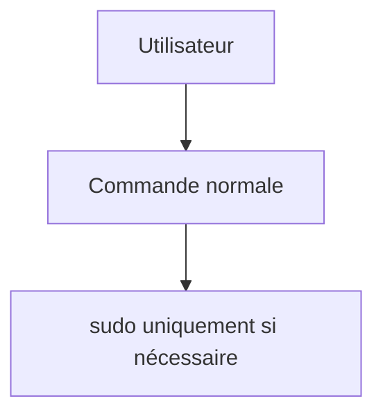

Le nombre de commandes exécutées avec des privilèges élevés devient très faible.

La surface de risque diminue considérablement.

---

## Sentinel et sudo

Notre application Sentinel n'utilisera quasiment jamais `sudo`.

Visualisons.

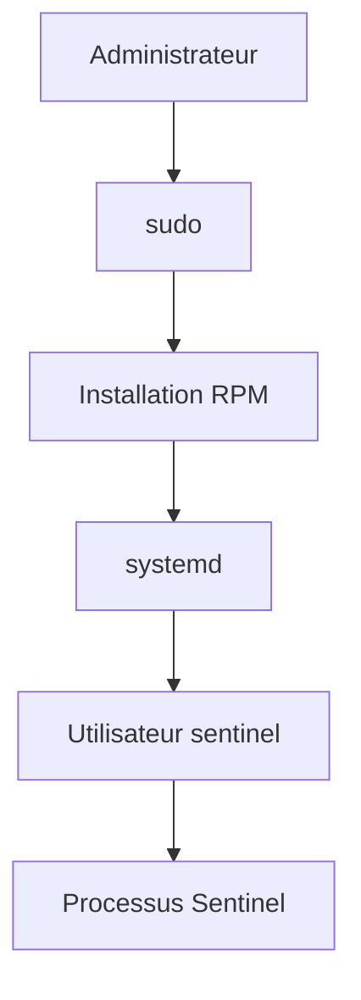

Seules les opérations d'installation,

de mise à jour

ou de maintenance

nécessiteront des privilèges élevés.

Le service lui-même fonctionnera toujours sous son propre compte système.

---
## 💎 Le point d'expertise

### sudo n'accorde pas les privilèges, il les délègue

Une erreur de compréhension très fréquente est la suivante.

> « sudo donne les droits root. »

En réalité,

`sudo` ne crée aucun privilège.

Il agit simplement comme un **intermédiaire**.

Visualisons.

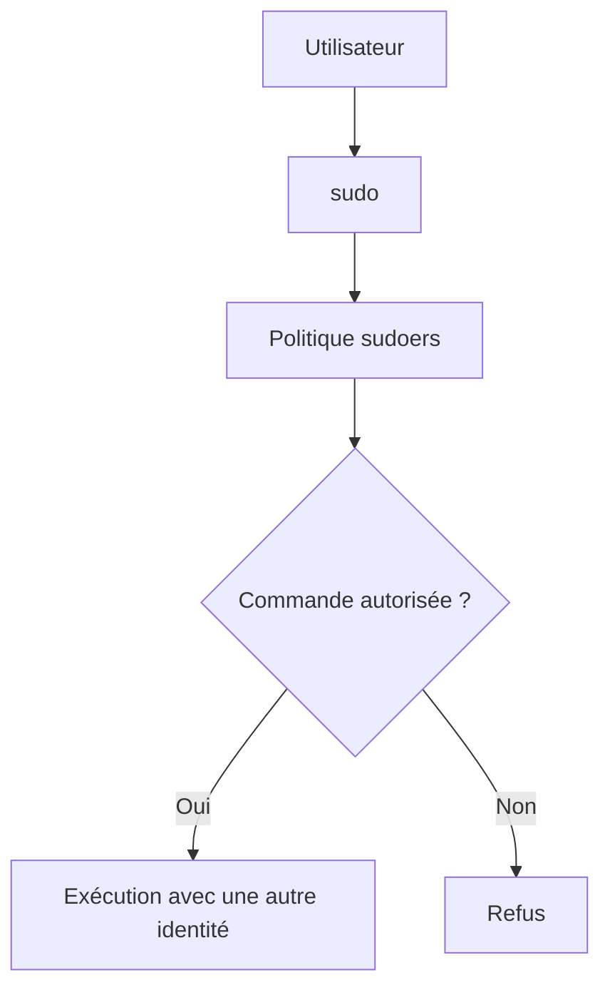

Les privilèges existent déjà.

`sudo` décide simplement si l'utilisateur est autorisé à les utiliser.

---

### sudo applique le principe du moindre privilège

Beaucoup pensent qu'un administrateur doit disposer de tous les droits.

Ce n'est pas nécessairement vrai.

Imaginons une équipe.

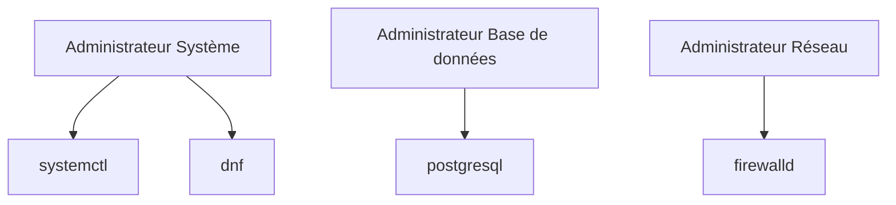

Chaque administrateur peut recevoir uniquement les commandes dont il a réellement besoin.

Cette approche est beaucoup plus sûre qu'un accès root partagé.

---

### sudo permet une traçabilité complète

Dans une entreprise,

il est indispensable de répondre à une question.

> **Qui a exécuté cette commande ?**

Avec un compte root partagé,

la réponse est souvent impossible.

Avec `sudo`,

chaque administrateur conserve son identité.

Visualisons.

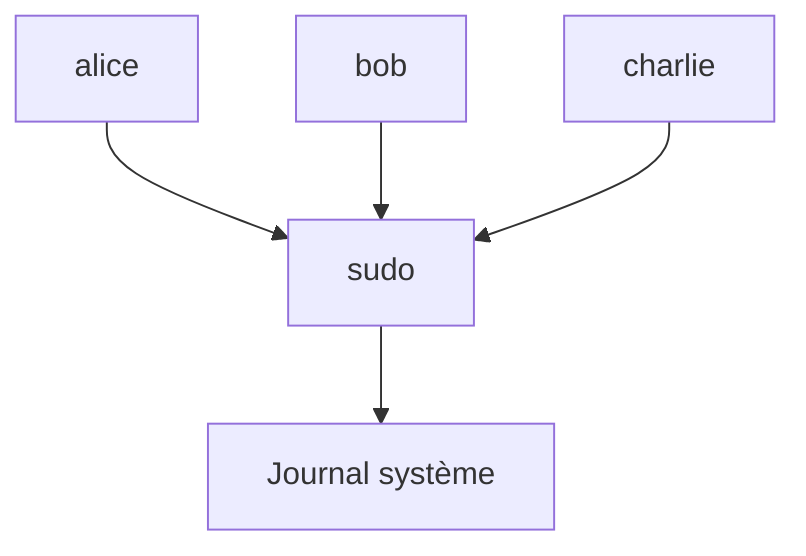

Le journal indiquera précisément :

- quel utilisateur ;
- à quelle heure ;
- sur quel serveur ;
- avec quelle commande.

Cette traçabilité est essentielle lors d'un audit ou d'une enquête de sécurité.

---

### sudo n'est qu'une première couche

Dans une infrastructure moderne,

une commande privilégiée traverse généralement plusieurs mécanismes de sécurité.

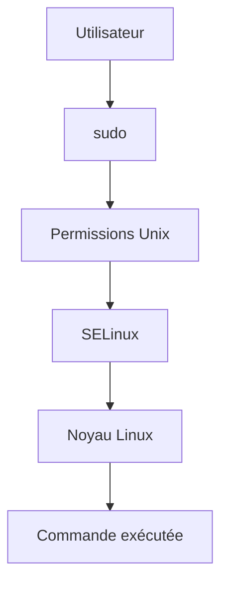

Même si `sudo` autorise une commande,

celle-ci peut encore être refusée par :

- les permissions Unix ;
- SELinux ;
- les Linux Capabilities ;
- les contrôles du noyau.

Cette superposition de protections est appelée **défense en profondeur**.

---

## 🧠 Comment pense un architecte ?

Un architecte ne se demande pas uniquement :

> **Qui est administrateur ?**

Il se demande surtout :

> **De quels privilèges cette personne a-t-elle réellement besoin ?**

Par exemple.

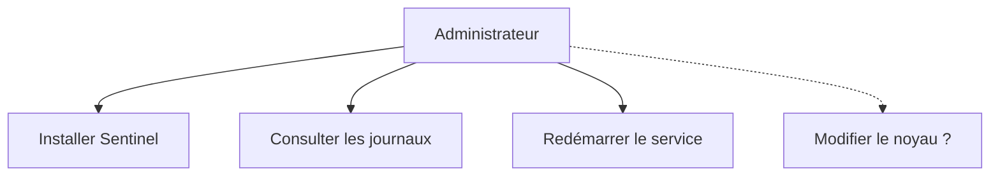

Les trois premières opérations peuvent être nécessaires.

La quatrième ne l'est probablement pas.

L'objectif est donc de réduire progressivement les privilèges accordés.

---

### Concevoir Sentinel selon ce principe

Notre futur service Sentinel devra lui aussi appliquer le moindre privilège.

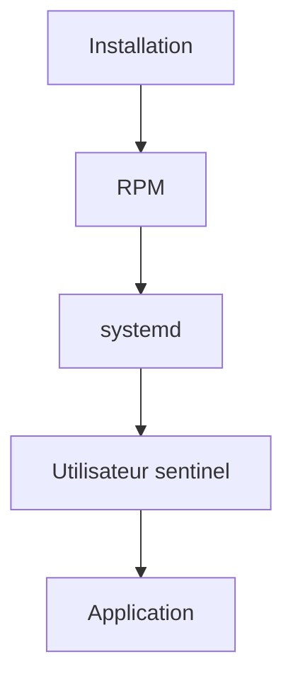

Une fois installé,

le service ne devra plus nécessiter de privilèges administrateur.

Les opérations sensibles resteront limitées :

- à l'installation ;
- aux mises à jour ;
- aux changements de configuration.

---

## ⚔️ Comment pense un attaquant ?

Après avoir compromis un compte utilisateur,

l'une des premières questions d'un attaquant est :

> **Puis-je utiliser sudo ?**

Les premières commandes exécutées sont souvent.

```bash
sudo -l
```

ou.

```bash
id
```

Si une règle `sudo` est mal configurée,

l'attaquant pourra parfois obtenir les privilèges root.

Une mauvaise politique `sudo` est donc une voie classique d'élévation de privilèges.

---

## 🏢 En entreprise

Dans les grandes entreprises,

il est extrêmement rare que plusieurs personnes connaissent le mot de passe root.

L'administration repose plutôt sur ce modèle.

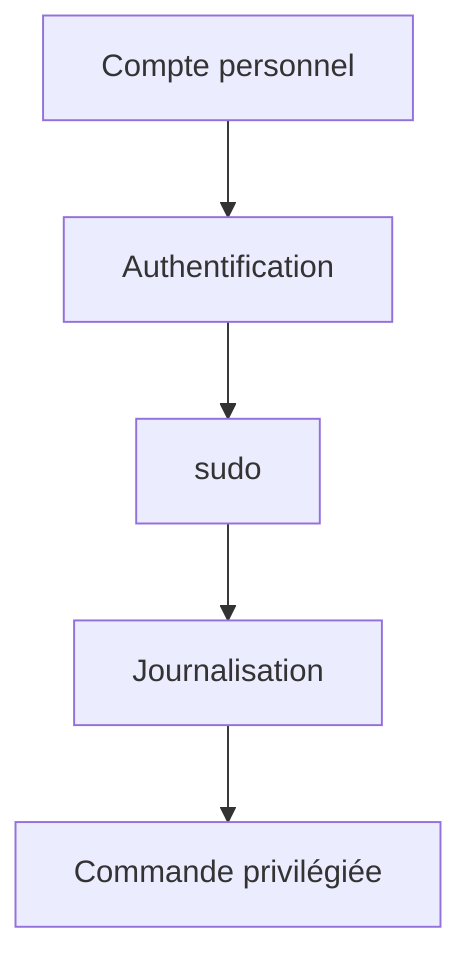

Chaque administrateur :

- possède son propre compte ;
- utilise `sudo` ;
- laisse une trace de ses actions.

Cette organisation répond à plusieurs exigences réglementaires,

notamment en matière d'audit et de conformité.

---

## 📚 Culture technique

### Pourquoi existe-t-il encore la commande su ?

Historiquement,

`su` était le principal moyen de devenir root.

À cette époque,

les équipes d'administration étaient réduites

et le mot de passe root était souvent partagé.

Aujourd'hui,

cette pratique est largement abandonnée.

`sudo` apporte plusieurs améliorations.

- authentification individuelle ;
- journalisation ;
- délégation fine des privilèges ;
- possibilité d'autoriser une seule commande.

C'est pourquoi la quasi-totalité des distributions professionnelles privilégient désormais `sudo`.

---
## ⚠️ Piège classique

### Ajouter tout le monde au groupe wheel

Lorsqu'un utilisateur rencontre un problème de permissions,

la solution de facilité consiste parfois à faire :

```bash
sudo usermod -aG wheel utilisateur
```

Le problème disparaît immédiatement.

Mais un nouveau problème apparaît.

L'utilisateur peut désormais administrer complètement le serveur.

Avant d'ajouter quelqu'un au groupe `wheel`,

il faut toujours se poser la question :

> **A-t-il réellement besoin d'administrer tout le système ?**

Dans une infrastructure professionnelle,

la réponse est très souvent :

> **Non.**

---

### Désactiver complètement sudo

Certaines personnes préfèrent ouvrir directement une session root.

Par exemple.

```bash
su -
```

Puis travailler plusieurs heures ainsi.

Cette pratique présente plusieurs inconvénients.

- toutes les commandes sont exécutées avec les privilèges maximum ;
- les erreurs ont des conséquences importantes ;
- les journaux ne permettent plus de savoir quel administrateur a effectué quelle action.

Aujourd'hui,

les bonnes pratiques recommandent de réserver `su` à des cas très particuliers.

---

### Modifier directement /etc/sudoers

Le fichier :

```text
/etc/sudoers
```

ne doit jamais être modifié avec :

```bash
nano
```

ou

```bash
vim
```

Pourquoi ?

Parce qu'une erreur de syntaxe peut empêcher toute utilisation de `sudo`.

L'administrateur peut alors se retrouver complètement bloqué.

La commande correcte est toujours :

```bash
sudo visudo
```

---

### Donner les droits root à une application

Certains logiciels demandent.

> « Lancez-moi avec sudo. »

Ce n'est presque jamais une bonne idée.

Une application ne devrait disposer que des privilèges indispensables.

Si Sentinel a uniquement besoin de lire :

```text
/var/lib/sentinel
```

il n'a aucune raison de pouvoir :

- modifier le pare-feu ;
- créer des utilisateurs ;
- arrêter le système.

Le moindre privilège consiste justement à limiter cette surface d'action.

---

## Laboratoire AlmaLinux

### Objectif

Découvrir concrètement le fonctionnement de `sudo`.

---

### Étape 1 — Vérifier son appartenance au groupe wheel

Afficher.

```bash
id
```

ou.

```bash
groups
```

Identifier si votre utilisateur appartient au groupe :

```text
wheel
```

---

### Étape 2 — Vérifier les autorisations sudo

Exécuter.

```bash
sudo -l
```

Observer.

- les commandes autorisées ;
- l'utilisateur cible ;
- les éventuelles restrictions.

Essayez de comprendre chaque ligne affichée.

---

### Étape 3 — Observer la durée du cache

Exécuter.

```bash
sudo ls
```

Puis immédiatement.

```bash
sudo pwd
```

Vous remarquerez que le mot de passe n'est plus demandé.

Attendez quelques minutes.

Relancez une commande.

Le mot de passe sera de nouveau demandé.

---

### Étape 4 — Consulter les journaux

Selon la version d'AlmaLinux.

```bash
sudo journalctl | grep sudo
```

ou.

```bash
sudo journalctl -t sudo
```

Observer les informations enregistrées.

- utilisateur ;
- heure ;
- commande exécutée.

---

### Étape 5 — Comparer sudo et su

Exécuter.

```bash
whoami
```

Puis.

```bash
sudo whoami
```

Enfin.

```bash
su -
whoami
exit
```

Comparer les comportements.

Vous comprendrez rapidement que :

- `sudo` élève temporairement les privilèges d'une seule commande ;
- `su` ouvre une nouvelle session.

---

## Mission d'ingénieur

Vous êtes responsable de l'administration d'une équipe de dix personnes.

Définissez une politique d'administration répondant aux questions suivantes.

- Qui peut installer des logiciels ?
- Qui peut redémarrer un service systemd ?
- Qui peut modifier le pare-feu ?
- Qui peut consulter les journaux ?
- Qui peut créer un utilisateur ?

Votre proposition devra respecter le principe du moindre privilège.

Essayez de limiter au maximum le nombre de personnes disposant de privilèges complets.

---

## Impact sur Sentinel

À partir de ce chapitre,

nous considérerons que Sentinel est une application **non privilégiée**.

Son fonctionnement normal ne nécessitera jamais :

- UID 0 ;
- une session root ;
- un accès complet au système.

Les privilèges administrateur ne seront utilisés que pour :

- installer le RPM ;
- créer l'utilisateur `sentinel` ;
- créer les répertoires système ;
- enregistrer l'unité systemd.

Une fois ces opérations terminées,

le service fonctionnera exclusivement sous son compte dédié.

Cette séparation est l'un des objectifs majeurs de toute la formation.

---

## Synthèse

- `sudo` permet d'exécuter ponctuellement une commande avec une autre identité, généralement `root`.
- `sudo` applique une politique définie dans `sudoers` et ne donne pas automatiquement tous les droits.
- `visudo` est le seul outil recommandé pour modifier la configuration de `sudo`.
- Le groupe `wheel` regroupe généralement les administrateurs d'un système AlmaLinux.
- Le principe du moindre privilège consiste à n'accorder que les droits strictement nécessaires à chaque utilisateur ou service.
- Une application professionnelle comme Sentinel doit fonctionner avec un compte de service dédié et ne jamais dépendre d'une exécution permanente en tant que `root`.

---

## Infographie de révision

```text
┌──────────────────────────────────────────────────────────────────────────────────────────────┐
│       CHAPITRE 1.8 — SUDO ET PRINCIPE DU MOINDRE PRIVILÈGE                                   │
├──────────────────────────────────────────────────────────────────────────────────────────────┤
│                                                                                              │
│                        ÉLÉVATION TEMPORAIRE DES DROITS                                        │
│                                                                                              │
│ Utilisateur                                                                                  │
│      │                                                                                       │
│      ▼                                                                                       │
│ sudo                                                                                        │
│      │                                                                                       │
│      ▼                                                                                       │
│ Vérification sudoers                                                                         │
│      │                                                                                       │
│      ▼                                                                                       │
│ Commande privilégiée                                                                         │
│      │                                                                                       │
│      ▼                                                                                       │
│ Retour au compte utilisateur                                                                 │
│                                                                                              │
├──────────────────────────────────────────────────────────────────────────────────────────────┤
│                          sudo vs su                                                          │
│                                                                                              │
│ sudo → Une seule commande                                                                    │
│ su   → Nouvelle session root                                                                 │
│                                                                                              │
├──────────────────────────────────────────────────────────────────────────────────────────────┤
│                   LEAST PRIVILEGE                                                            │
│                                                                                              │
│ ✔ Donner uniquement les droits nécessaires                                                   │
│ ✔ Limiter les privilèges dans le temps                                                       │
│ ✔ Utiliser des comptes personnels                                                            │
│ ✔ Journaliser les actions                                                                    │
│ ✘ Travailler en permanence en root                                                           │
│ ✘ Donner root à une application                                                              │
│                                                                                              │
├──────────────────────────────────────────────────────────────────────────────────────────────┤
│                      APPLICATION À SENTINEL                                                  │
│                                                                                              │
│ Installation RPM       → sudo                                                                │
│ Création des dossiers → sudo                                                                 │
│ Création utilisateur  → sudo                                                                 │
│                                                                                              │
│ Exécution quotidienne → utilisateur sentinel                                                 │
│                                                                                              │
├──────────────────────────────────────────────────────────────────────────────────────────────┤
│                               IDÉE CLÉ                                                       │
│                                                                                              │
│ « Les privilèges administrateur ne doivent pas être                                          │
│  permanents. Ils doivent être limités, temporaires                                           │
│  et parfaitement justifiés. »                                                                │
└──────────────────────────────────────────────────────────────────────────────────────────────┘
```

---

← [1.7 — Utilisateurs, groupes et permissions](1.7-utilisateurs-groupes-permissions.md) · [1.9 — Première mise en sécurité du serveur](1.9-premiere-mise-en-securite-serveur.md) →
