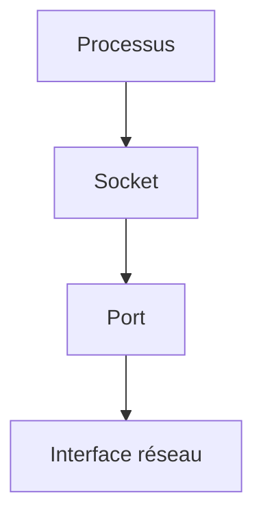
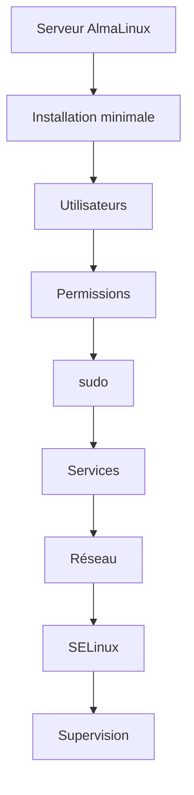
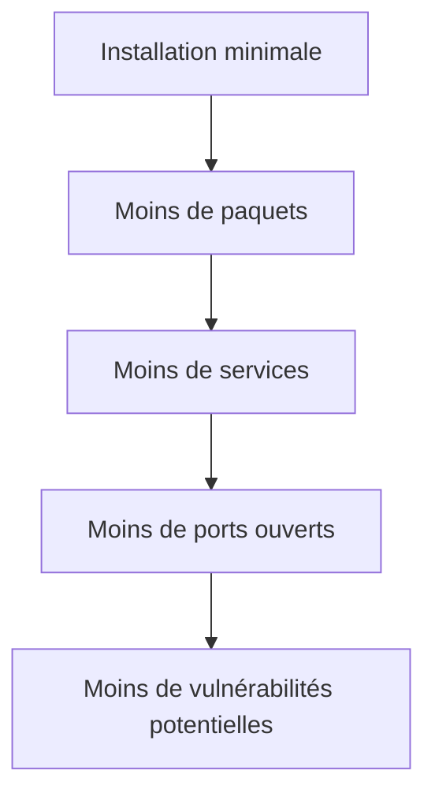
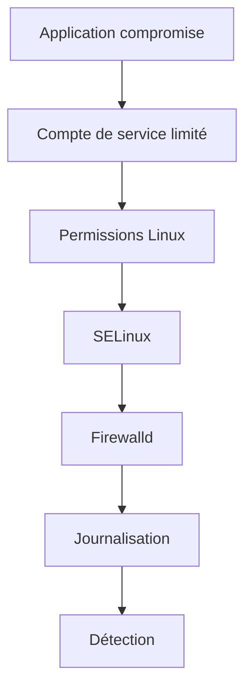
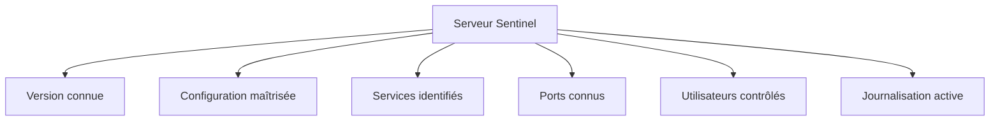
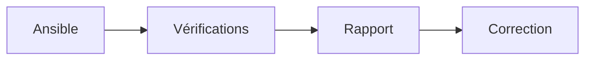
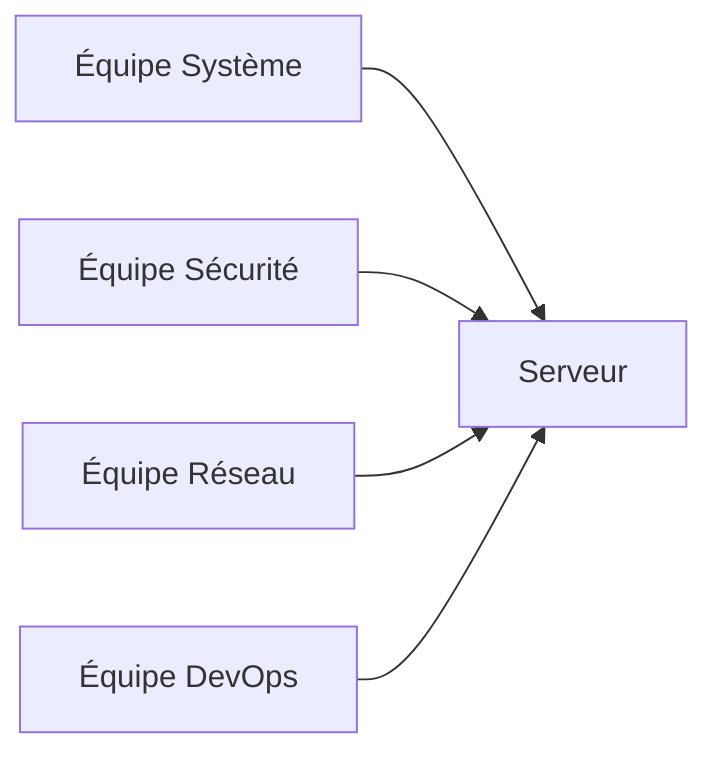

---

# Campagne 1 — Installation et fondations

# Chapitre 1.8 — Première sécurisation de Sentinel

> *« Installer un système est une première étape. Le sécuriser réellement commence maintenant. »*

---

# Vous êtes ici

```text
Partie I — Construire un socle sécurisé

Campagne 1 — Installation et fondations

      1.1 Pourquoi sécuriser un socle Linux ?
      1.2 Installation d'AlmaLinux Minimal
      1.3 Comprendre les privilèges
      1.4 Le système de fichiers
      1.5 Utilisateurs et groupes
      1.6 Permissions Linux
      1.7 sudo et moindre privilège
    ► 1.8 Première sécurisation de Sentinel
```

---

# Objectifs pédagogiques

À la fin de ce chapitre, vous serez capable de :

- appliquer les premières mesures de durcissement sur un serveur AlmaLinux ;
- vérifier l'état des principaux mécanismes de sécurité ;
- préparer une base saine pour les campagnes suivantes ;
- comprendre la logique d'une check-list de sécurisation.

---

# Pourquoi ce chapitre existe

Depuis le début de cette campagne,

nous avons construit progressivement les briques fondamentales :

- une installation minimale ;
- une gestion correcte des utilisateurs ;
- une compréhension des privilèges ;
- une organisation du système de fichiers ;
- une politique de permissions ;
- une administration basée sur `sudo`.

Il est maintenant temps de les mettre en pratique.

L'objectif n'est pas encore de réaliser un durcissement complet.

Nous allons simplement vérifier que notre serveur respecte déjà les bonnes pratiques essentielles.

Cette première étape constituera le **socle** sur lequel viendront se greffer :

- SSH sécurisé ;
- Firewalld ;
- SELinux ;
- les certificats ;
- FreeIPA ;
- systemd ;
- Podman ;
- Ansible.

---
# Vérifier notre point de départ

Avant de modifier quoi que ce soit,

nous devons connaître précisément l'état actuel du serveur.

Comme tout ingénieur système,

nous allons commencer par observer.

---

## Vérifier la version du système

Afficher les informations générales.

```bash
cat /etc/os-release
```

Puis.

```bash
hostnamectl
```

Vérifier notamment :

- la version d'AlmaLinux ;
- l'architecture ;
- le nom d'hôte.

Notre laboratoire doit être parfaitement identifié.

---

## Vérifier les mises à jour

Afficher les éventuelles mises à jour disponibles.

```bash
sudo dnf check-update
```

Si nécessaire.

```bash
sudo dnf update
```

Un serveur non mis à jour est un serveur vulnérable.

Cette étape sera systématiquement réalisée avant toute intervention importante.

---

## Vérifier l'espace disque

Afficher les systèmes de fichiers.

```bash
df -h
```

Exemple.

```text
Filesystem      Size  Used Avail Use%
/dev/sda3        20G  3.1G   17G  16%
```

L'objectif n'est pas uniquement de vérifier la capacité.

Une partition pleine peut empêcher :

- les journaux d'être écrits ;
- les services de démarrer ;
- les mises à jour RPM.

La disponibilité participe directement à la sécurité.

---

## Vérifier la mémoire

Afficher la mémoire.

```bash
free -h
```

Observer :

- RAM utilisée ;
- mémoire disponible ;
- Swap.

Une consommation anormale est souvent le premier symptôme :

- d'une fuite mémoire ;
- d'un service défaillant ;
- d'une attaque.

---

# Vérifier les utilisateurs privilégiés

Afficher les membres du groupe :

```text
wheel
```

```bash
getent group wheel
```

Vérifier que seuls les administrateurs prévus y figurent.

Une bonne pratique consiste à maintenir ce groupe aussi réduit que possible.

---

# Vérifier les services actifs

Lister les services.

```bash
systemctl list-units --type=service
```

Nous ne cherchons pas encore à comprendre chaque ligne.

Nous voulons simplement répondre à une question.

> **Quels services tournent réellement sur notre serveur ?**

Plus un serveur exécute de services,

plus sa surface d'attaque augmente.

---

# Vérifier les ports ouverts

Afficher les sockets d'écoute.

```bash
ss -tulpen
```

Observer :

- les ports TCP ;
- les ports UDP ;
- le processus associé.

Visualisons.



Nous retrouverons cette commande tout au long de la formation.

---

# Vérifier SELinux

Afficher son état.

```bash
getenforce
```

ou.

```bash
sestatus
```

Nous espérons obtenir.

```text
Enforcing
```

ou,

à défaut dans notre laboratoire,

au minimum :

```text
Permissive
```

Nous n'utiliserons jamais :

```text
Disabled
```

sauf dans des cas très particuliers que nous justifierons toujours.

---

# Vérifier Firewalld

Afficher son état.

```bash
sudo systemctl status firewalld
```

Puis.

```bash
sudo firewall-cmd --state
```

Le résultat attendu est généralement.

```text
running
```

Même si nous n'avons encore configuré aucune règle,

il est important de vérifier que le service fonctionne.

---

# Vérifier SSH

Afficher.

```bash
sudo systemctl status sshd
```

Puis.

```bash
ss -tln | grep :22
```

Nous vérifions simplement que le serveur SSH fonctionne correctement.

Sa sécurisation détaillée fera l'objet de la campagne suivante.

---

# Première check-list de sécurité

À ce stade,

notre laboratoire doit satisfaire les critères suivants.

| Vérification | État attendu |
|--------------|--------------|
| Installation minimale | ✅ |
| Système à jour | ✅ |
| Utilisateur personnel | ✅ |
| Utilisation de sudo | ✅ |
| Root non utilisé quotidiennement | ✅ |
| SELinux actif | ✅ |
| Firewalld actif | ✅ |
| SSH opérationnel | ✅ |
| Services identifiés | ✅ |
| Ports connus | ✅ |

Cette liste paraît simple.

Pourtant,

elle correspond déjà à plusieurs recommandations des guides CIS et ANSSI.

---


# Une vision globale

La sécurisation ne consiste pas à activer une seule protection.

Elle consiste à superposer plusieurs couches.



Chaque couche renforce les précédentes.

C'est cette philosophie qui guidera toute la suite de la formation.

---
# 💎 Le point d'expertise

## Une check-list n'est pas une politique de sécurité

Beaucoup d'administrateurs débutants pensent qu'un serveur est sécurisé dès lors que toutes les cases d'une check-list sont cochées.

En réalité,

une check-list répond à une seule question.

> **Les mesures minimales ont-elles été appliquées ?**

Elle ne garantit pas :

- l'absence de vulnérabilité ;
- l'absence de mauvaise configuration ;
- l'absence d'erreur humaine.

Une véritable politique de sécurité repose sur :

- plusieurs couches de protection ;
- des audits réguliers ;
- une supervision continue ;
- une amélioration permanente.

La sécurité est un processus,

pas un état.

---

## La réduction de la surface d'attaque

Depuis le début de cette campagne,

nous avons appliqué plusieurs décisions qui poursuivent toutes le même objectif.

Réduire la surface d'attaque.

Visualisons.



Cette logique est omniprésente en cybersécurité.

Chaque composant inutile représente :

- un risque supplémentaire ;
- une mise à jour supplémentaire ;
- une configuration supplémentaire.

---

## La défense en profondeur

Aucune protection n'est parfaite.

Imaginons qu'un attaquant compromette une application.

Que se passe-t-il ensuite ?

Notre architecture actuelle ressemble à ceci.



Chaque couche ralentit l'attaquant.

Même lorsqu'une protection échoue,

les suivantes continuent de jouer leur rôle.

C'est ce que l'on appelle :

> **la défense en profondeur** (*Defense in Depth*).

---

## Observer avant d'agir

Un administrateur expérimenté applique presque toujours la même méthode.

Avant toute modification,

il observe.

Par exemple.

```text
État actuel

↓

Mesures

↓

Nouvel état

↓

Validation
```

Cette démarche permet :

- d'éviter les erreurs ;
- de comprendre les conséquences ;
- de revenir facilement en arrière.

Elle sera utilisée tout au long de cette formation.

---

# 🧠 Comment pense un architecte ?

Un architecte ne cherche pas à construire un serveur "qui fonctionne".

Il cherche à construire un serveur :

- reproductible ;
- maintenable ;
- documenté ;
- automatisable.

Avant même de commencer le développement de Sentinel,

il définit déjà les contrôles qu'il souhaite retrouver.

Par exemple.



Chaque nouvel environnement devra respecter ces mêmes exigences.

---

## Préparer l'automatisation

La check-list que nous venons d'utiliser ne restera pas longtemps manuelle.

Dans les infrastructures modernes,

elle est progressivement automatisée.

Le principe est simple.



Nous construirons progressivement cette automatisation au fil des campagnes.

À terme,

un simple playbook permettra de vérifier automatiquement plusieurs dizaines de critères de sécurité.

---

# ⚔️ Comment pense un attaquant ?

Un attaquant commence rarement par exploiter une vulnérabilité complexe.

Il recherche d'abord les erreurs les plus évidentes.

Par exemple.

- un système non mis à jour ;
- un service inutile exposé ;
- un pare-feu désactivé ;
- SELinux désactivé ;
- un compte administrateur oublié ;
- un mot de passe faible.

Autrement dit,

il vérifie exactement les mêmes points que notre check-list.

Une grande partie des compromissions résulte d'erreurs de configuration,

et non de vulnérabilités sophistiquées.

---

# 🏢 En entreprise

Dans une entreprise,

la sécurisation d'un serveur ne dépend généralement pas d'une seule personne.

Plusieurs équipes interviennent.



Chacune apporte une couche supplémentaire :

- configuration ;
- supervision ;
- réseau ;
- automatisation ;
- conformité.

Notre objectif avec Sentinel est justement de reproduire cette approche professionnelle,

même dans un laboratoire personnel.

---

# 📚 Culture technique

## Pourquoi les référentiels de sécurité existent-ils ?

Les entreprises n'inventent généralement pas leurs propres règles.

Elles s'appuient sur des référentiels reconnus.

Par exemple.

- CIS Benchmarks ;
- recommandations de l'ANSSI ;
- guides Red Hat ;
- normes ISO 27001.

Ces documents regroupent plusieurs centaines de recommandations.

Notre formation suit exactement la même philosophie.

Chaque campagne ajoute progressivement une nouvelle couche de protection,

jusqu'à construire un serveur conforme aux bonnes pratiques modernes.

---
# ⚠️ Piège classique

## Désactiver une protection pour "gagner du temps"

Un scénario est malheureusement très fréquent.

Un administrateur rencontre un problème.

Par exemple :

- une application ne démarre pas ;
- un accès réseau est refusé ;
- un fichier est inaccessible.

Au lieu d'identifier la véritable cause,

il désactive la protection concernée.

Par exemple.

```bash
setenforce 0
```

ou

```bash
systemctl stop firewalld
```

ou pire.

```bash
systemctl disable firewalld
```

L'application fonctionne désormais.

Mais le serveur est devenu moins sûr.

La bonne démarche consiste toujours à répondre à une question.

> **Pourquoi cette protection bloque-t-elle cette opération ?**

Comprendre le problème est toujours préférable à supprimer la protection.

---

## Oublier de documenter les modifications

Autre erreur très fréquente.

Un administrateur modifie :

- une règle de pare-feu ;
- une configuration SSH ;
- une permission ;
- une politique SELinux.

Tout fonctionne.

Six mois plus tard,

personne ne comprend pourquoi cette modification existe.

Une bonne pratique consiste à toujours documenter :

- la modification réalisée ;
- sa justification ;
- sa date ;
- son auteur.

Cette discipline simplifie énormément les audits et les investigations.

---

# Laboratoire AlmaLinux

## Objectif

Établir un état de référence (*baseline*) de notre serveur Sentinel.

Cette photographie servira de comparaison pendant toute la formation.

---

## Étape 1 — Identifier le système

Exécuter.

```bash
hostnamectl
```

Puis.

```bash
cat /etc/os-release
```

Conserver les informations suivantes.

- version d'AlmaLinux ;
- architecture ;
- hostname.

---

## Étape 2 — Observer les services

Afficher.

```bash
systemctl --type=service --state=running
```

Répondre aux questions suivantes.

- Combien de services sont actifs ?
- Les connaissez-vous tous ?
- Lesquels sont indispensables ?

---

## Étape 3 — Observer les ports réseau

Exécuter.

```bash
ss -tulpen
```

Pour chaque port ouvert,

identifier :

- le protocole ;
- le processus ;
- la raison de son ouverture.

Cette habitude deviendra essentielle dans les prochaines campagnes.

---

## Étape 4 — Construire votre première baseline

Créer un document contenant :

- la liste des utilisateurs ;
- les groupes privilégiés ;
- les services actifs ;
- les ports ouverts ;
- l'état de SELinux ;
- l'état de Firewalld ;
- la version du système.

Ce document deviendra la référence de votre laboratoire.

Chaque nouvelle campagne devra être capable d'expliquer précisément :

> **Pourquoi cette baseline a évolué.**

---

# Mission d'ingénieur

Vous êtes chargé de préparer un serveur qui sera intégré à une infrastructure de production.

Votre responsable sécurité vous demande de définir une **procédure de validation avant mise en service**.

Cette procédure devra répondre aux questions suivantes.

- Le système est-il à jour ?
- Les utilisateurs administrateurs sont-ils identifiés ?
- Les ports ouverts sont-ils connus et justifiés ?
- Les services actifs sont-ils nécessaires ?
- SELinux est-il actif ?
- Firewalld est-il actif ?
- Les permissions critiques ont-elles été vérifiées ?
- La configuration est-elle documentée ?

Votre objectif n'est pas seulement de répondre à ces questions,

mais de proposer une méthode reproductible qui pourra être appliquée à tous les futurs serveurs de l'entreprise.

---

# Impact sur Sentinel

À l'issue de cette première campagne,

Sentinel repose désormais sur un socle solide.

Nous avons :

- installé un système minimal ;
- compris le modèle de privilèges ;
- étudié les utilisateurs et les groupes ;
- maîtrisé les permissions Linux ;
- adopté `sudo` comme méthode d'administration ;
- réalisé une première vérification de sécurité.

Sentinel est maintenant prêt à accueillir des mécanismes de protection plus avancés.

La prochaine campagne marquera un changement important.

Nous quitterons les fondations du système pour nous intéresser à la **protection des accès** :

- sécurisation de SSH ;
- authentification ;
- clés cryptographiques ;
- pare-feu ;
- exposition réseau.

Nous commencerons à protéger le serveur contre des menaces provenant de l'extérieur.

---

# Ce qu'il faut retenir

- Une installation minimale n'est que le point de départ d'un serveur sécurisé.
- Une **baseline** permet de connaître précisément l'état de référence d'un système.
- Avant toute modification, un administrateur observe et documente l'existant.
- La sécurité repose sur plusieurs couches complémentaires (*Defense in Depth*).
- Les protections ne doivent jamais être désactivées pour contourner un problème sans en comprendre la cause.
- Une bonne administration est reproductible, documentée et automatisable.
- Les futures campagnes viendront renforcer progressivement ce socle avec SSH, Firewalld, SELinux, FreeIPA, Ansible et Podman.

---

# Grande infographie de révision du chapitre

```text
┌──────────────────────────────────────────────────────────────────────────────────────────────┐
│             CHAPITRE 1.8 — PREMIÈRE SÉCURISATION DE SENTINEL                                 │
├──────────────────────────────────────────────────────────────────────────────────────────────┤
│                                                                                              │
│                    CONSTRUIRE UNE BASELINE DE SÉCURITÉ                                       │
│                                                                                              │
│ Installation minimale                                                                        │
│        │                                                                                     │
│        ▼                                                                                     │
│ Vérification du système                                                                      │
│        │                                                                                     │
│        ▼                                                                                     │
│ Vérification des utilisateurs                                                                │
│        │                                                                                     │
│        ▼                                                                                     │
│ Vérification des services                                                                    │
│        │                                                                                     │
│        ▼                                                                                     │
│ Vérification des ports                                                                       │
│        │                                                                                     │
│        ▼                                                                                     │
│ Vérification des protections                                                                 │
│                                                                                              │
├──────────────────────────────────────────────────────────────────────────────────────────────┤
│                          CHECK-LIST INITIALE                                                 │
│                                                                                              │
│ ✔ AlmaLinux à jour                                                                           │
│ ✔ Installation minimale                                                                      │
│ ✔ Utilisateur nominatif                                                                      │
│ ✔ Utilisation de sudo                                                                        │
│ ✔ SELinux actif                                                                              │
│ ✔ Firewalld actif                                                                            │
│ ✔ SSH opérationnel                                                                           │
│ ✔ Services identifiés                                                                        │
│ ✔ Ports ouverts connus                                                                       │
│ ✔ Baseline documentée                                                                        │
│                                                                                              │
├──────────────────────────────────────────────────────────────────────────────────────────────┤
│                          DÉFENSE EN PROFONDEUR                                               │
│                                                                                              │
│ Installation                                                                                 │
│      │                                                                                       │
│      ▼                                                                                       │
│ Utilisateurs                                                                                 │
│      │                                                                                       │
│      ▼                                                                                       │
│ Permissions                                                                                  │
│      │                                                                                       │
│      ▼                                                                                       │
│ sudo                                                                                         │
│      │                                                                                       │
│      ▼                                                                                       │
│ SELinux                                                                                      │
│      │                                                                                       │
│      ▼                                                                                       │
│ Firewalld                                                                                    │
│      │                                                                                       │
│      ▼                                                                                       │
│ Supervision                                                                                  │
│                                                                                              │
├──────────────────────────────────────────────────────────────────────────────────────────────┤
│                              IDÉE CLÉ                                                        │
│                                                                                              │
│ « La sécurité ne consiste pas à ajouter une protection.                                      │
│  Elle consiste à construire progressivement                                                  │
│  plusieurs couches capables de se compléter. »                                               │
└──────────────────────────────────────────────────────────────────────────────────────────────┘
```

---

# 🎉 Fin de la Campagne 1

La première campagne est maintenant terminée.

Elle constitue le **socle conceptuel** de toute la formation. La campagne 2 pourra désormais se concentrer sur la sécurisation des accès au serveur (SSH, authentification, clés, réseau et exposition), en s'appuyant sur toutes les notions acquises ici.
