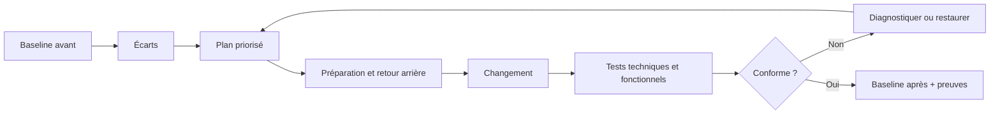
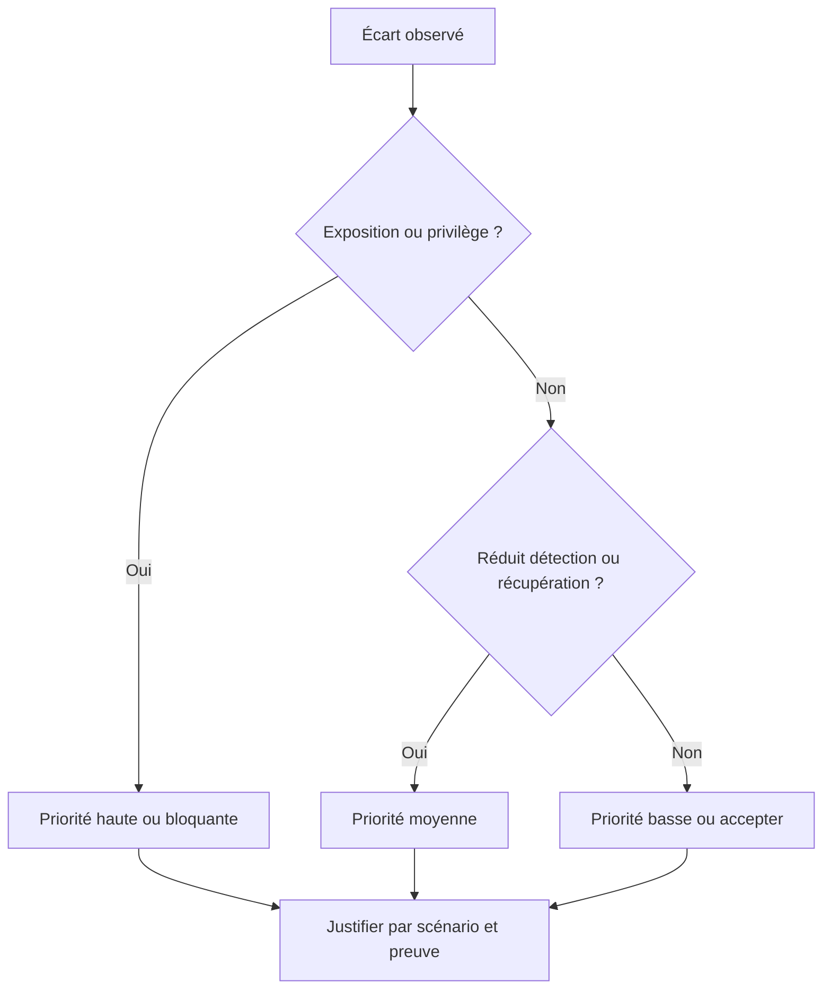
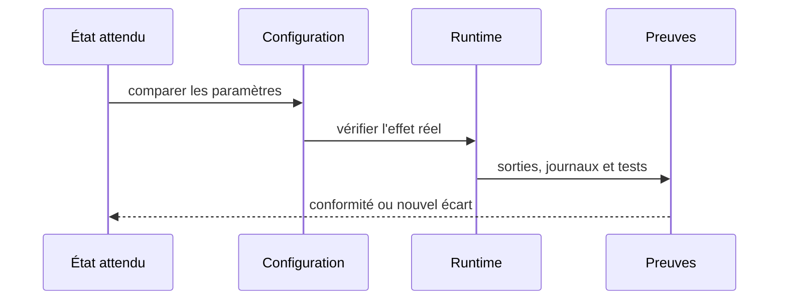
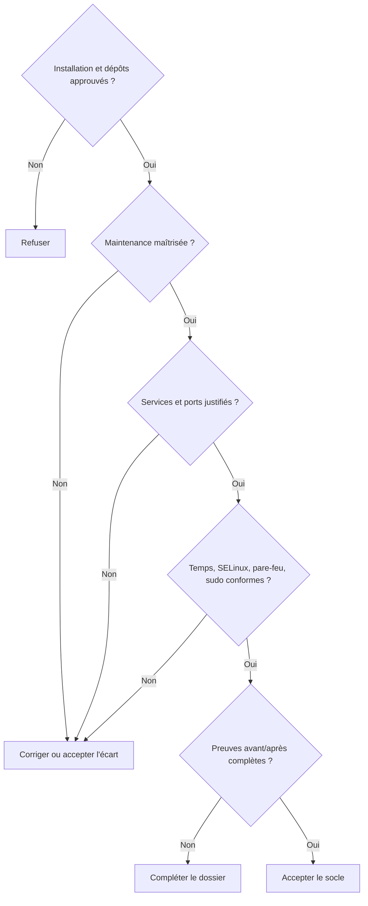

# Chapitre 1.9 — Mission : mettre le serveur en sécurité

> **Campagne 1 — Installation et fondations**

> *« Le durcissement commence par des écarts prouvés, pas par une liste de commandes copiées. »*

## Vous êtes ici

```text
PARTIE I — Construire un socle sécurisé

Campagne 1

  1.1 Pourquoi sécuriser un socle Linux ? ✔
  1.2 Installer AlmaLinux minimal ✔
  1.3 Comprendre les composants du système ✔
  1.4 Établir la baseline du serveur ✔
  1.5 Mettre à jour et gérer les dépôts ✔
  1.6 Organiser les systèmes de fichiers ✔
  1.7 Comprendre identités et permissions ✔
  1.8 Administrer avec sudo ✔
► 1.9 Mission : mettre le serveur en sécurité
  1.10 Créer le laboratoire Sentinel
```

## Objectifs pédagogiques

À l'issue de ce chapitre, vous serez capable de :

- transformer une baseline en plan de mise en sécurité priorisé ;
- distinguer baseline, durcissement et conformité ;
- appliquer un petit nombre de changements maîtrisés et réversibles ;
- vérifier mises à jour, services, ports, temps, SELinux, pare-feu et administration ;
- distinguer preuve de configuration et test d'efficacité ;
- produire un dossier de conformité initial du serveur Sentinel.

## Pourquoi ce chapitre existe

Les chapitres précédents ont présenté les fondations séparément. Cette mission les assemble sans ajouter une nouvelle couche de théorie. Vous allez recevoir le serveur, identifier les écarts, décider des changements, les appliquer puis démontrer le nouvel état.

Le but n'est pas d'atteindre un durcissement exhaustif. SSH, firewalld, systemd, SELinux et audit disposeront de campagnes dédiées. Ici, vous établissez une **baseline de sécurité initiale** qui reste simple, expliquée et compatible avec la suite du laboratoire.

## Distinguer baseline, durcissement et conformité

Le **durcissement**, ou *hardening*, désigne l'ensemble des changements qui adaptent un système à son usage afin de réduire sa surface d'attaque, limiter les privilèges, retirer les fonctions inutiles et renforcer les contrôles nécessaires. Il ne consiste ni à compliquer le serveur ni à appliquer tous les paramètres d'un guide sans contexte.

| Notion | Fonction | Exemple dans la mission |
| --- | --- | --- |
| baseline | décrire l'état de référence | services, ports, dépôts et contrôles observés |
| durcissement | rapprocher l'état réel de l'état attendu | retirer un service inutile ou corriger une configuration |
| conformité | comparer aux exigences retenues | chaque écart possède une décision et une preuve |

Le durcissement est progressif : observer, modifier une propriété comprise, tester, conserver la preuve, puis recommencer. Une nouvelle version, un nouveau service ou un changement d'exposition peut invalider une décision précédente. Le résultat est donc un processus gouverné, pas une étiquette définitive « serveur sécurisé ».

## Contexte de mission

Vous êtes chargé de qualifier la VM `sentinel-dev` fraîchement installée. Elle doit devenir le socle du projet pédagogique. L'équipe attend un serveur minimal, à jour, administrable par un compte nominatif et exempt d'écart critique inexpliqué.

La mission suit une boucle de changement :



## Périmètre et contraintes

Vous devez contrôler :

- identité du système, version et noyau actif ;
- synchronisation de l'heure ;
- dépôts actifs, mises à jour disponibles et historique DNF ;
- espace disque et ressources ;
- services actifs, activés et en échec ;
- ports en écoute et interfaces de liaison ;
- état de SELinux et du pare-feu ;
- compte administratif, groupes et droits `sudo` ;
- présence d'une baseline sans secret.

Contraintes :

- aucune désactivation de SELinux ;
- aucun `--nogpgcheck` ;
- aucun `chmod 777` ;
- aucune exposition directe de la VM à Internet ;
- aucune session `root` prolongée ;
- aucune suppression d'un service avant identification de son rôle ;
- chaque modification possède un résultat attendu et une vérification.

## Étape 1 — Collecter l'état initial

Reprenez la fiche du chapitre 1.4 et actualisez-la. Les commandes suivantes constituent un socle, à compléter si un résultat l'exige :

```bash
hostnamectl
cat /etc/os-release
uname -r
timedatectl
chronyc tracking
ip -brief address
ip route
ss -lntup
findmnt --real
df -hT
free -h
systemctl --failed
systemctl list-units --type=service --state=running
systemctl list-unit-files --state=enabled
getenforce
sudo firewall-cmd --state
sudo firewall-cmd --get-active-zones
id
sudo -l
sudo dnf repolist
sudo dnf history info last
```

Conservez les sorties et rédigez immédiatement une interprétation. Une ligne `0 loaded units listed` après `systemctl --failed` est une preuve utile ; une longue liste de services sans conclusion ne l'est pas.

## Étape 2 — Qualifier et prioriser les écarts

Classez chaque écart selon son impact et l'urgence :

| Priorité | Définition | Exemple |
| --- | --- | --- |
| bloquant | chaîne de confiance ou administration non maîtrisée | ISO/provenance inconnue, SELinux désactivé sans raison |
| haute | exposition ou maintenance directement risquée | service réseau inutile exposé, correctif critique en attente |
| moyenne | dérive qui réduit diagnostic ou résilience | temps non synchronisé, journal rempli d'erreurs |
| basse | amélioration documentée sans risque immédiat | nom peu descriptif dans un lab isolé |

Un écart doit comporter : fait observé, attente, risque, action proposée, propriétaire et preuve de réussite. Ne classez pas automatiquement tout avertissement comme critique.

La priorité peut aussi dépendre de l'enchaînement. Corriger le temps avant d'analyser les journaux améliore leur corrélation ; vérifier l'accès de secours avant de modifier un mécanisme d'administration évite de se verrouiller dehors ; préserver la baseline avant la mise à jour garde une référence. Le plan doit donc indiquer les dépendances, pas seulement un ordre numérique.

Pour chaque risque élevé, ajoutez une condition d'arrêt : espace disque insuffisant, dépôt inattendu, perte de connectivité, nouveau service en échec ou absence de sauvegarde vérifiable. Une condition d'arrêt n'est pas un échec du projet ; c'est un contrôle qui empêche une situation mal comprise de devenir un incident plus large.



## Étape 3 — Préparer les changements

Construisez un plan court. Pour chaque action, précisez commande, précondition, effet attendu, risque, test et retour arrière.

Les actions admissibles dans cette mission sont par exemple :

- appliquer une mise à jour DNF après lecture de la transaction ;
- corriger le nom ou la synchronisation du temps selon la fiche ;
- désactiver un service réellement inutile après analyse de ses dépendances ;
- démarrer le pare-feu s'il était attendu mais arrêté ;
- corriger l'appartenance d'un compte d'administration explicitement autorisé ;
- nettoyer un fichier de laboratoire créé par erreur.

Les changements SSH, règles réseau détaillées, réglages noyau et exceptions SELinux sont hors périmètre. Ouvrez une action pour la campagne correspondante au lieu d'improviser.

## Étape 4 — Appliquer de façon contrôlée

Avant une mise à jour :

```bash
sudo dnf upgrade --assumeno
df -h /
systemctl --failed
```

Après validation du plan :

```bash
sudo dnf upgrade
sudo dnf history info last
```

Pour un service candidat à la désactivation, collectez d'abord :

```bash
systemctl status NOM.service --no-pager
systemctl cat NOM.service
systemctl list-dependencies --reverse NOM.service
ss -lntup
```

N'exécutez la désactivation que si le besoin est absent et les dépendances comprises. Notez la commande inverse comme retour arrière. Après chaque changement, testez immédiatement avant de poursuivre ; un lot de dix changements rend la cause d'un échec ambiguë.

## Étape 5 — Prouver l'état final

Rejouez la baseline et comparez-la à l'état initial. Ajoutez des tests d'efficacité :

- un service inutile n'est plus actif, plus activé et son ancien port n'écoute plus ;
- la mise à jour apparaît dans l'historique et les services attendus restent fonctionnels ;
- SELinux est toujours enforcing ;
- le pare-feu est actif et ses zones sont identifiées ;
- l'heure est synchronisée ;
- `sudo` relie encore les opérations à l'administrateur nominatif ;
- aucun secret n'a été écrit dans les preuves.



Une configuration présente sur disque ne prouve pas qu'elle est chargée. Un processus arrêté ne prouve pas qu'il ne reviendra pas au démarrage. Une mise à jour installée ne prouve pas que le nouveau noyau est actif.

## Travail demandé

Produisez les livrables suivants :

1. fiche de construction de la VM ;
2. baseline initiale horodatée ;
3. registre des écarts et priorités ;
4. plan de changement avec retours arrière ;
5. historique des commandes privilégiées ;
6. résultat de chaque test après changement ;
7. baseline finale ;
8. liste des travaux reportés aux campagnes spécialisées ;
9. décision finale d'acceptation.

Le dossier doit pouvoir être relu par une personne qui n'a pas assisté aux manipulations.

Organisez les preuves par contrôle plutôt que comme une unique transcription de terminal. Chaque dossier peut contenir l'attendu, la commande, la sortie utile, l'interprétation et la date. Conservez à part les sorties volumineuses et référencez-les par leur nom ou leur somme. Cette organisation permet de réexécuter un contrôle sans relire toute la mission.

Terminez par un journal de décisions : écarts corrigés, écarts acceptés avec échéance, travaux reportés et hypothèses non vérifiées. La transparence sur une limite vaut mieux qu'une conclusion « conforme » impossible à défendre.

## Critères de réussite



La mission est réussie si le serveur reste accessible, si aucun changement non expliqué n'est présent, si la surface observée correspond aux besoins du laboratoire et si la reconstruction reste possible. Un serveur « très durci » mais impossible à administrer ou à reproduire est un échec.

## Impact sur Sentinel

Sentinel recevra un hôte accepté et une baseline antérieure à son installation. Les futurs écarts pourront être attribués à des changements précis. Les protections spécialisées seront ajoutées au moment pédagogique approprié sans casser les garanties déjà établies.

## Synthèse

- La mise en sécurité part de la baseline et des risques, pas d'une checklist aveugle.
- Le durcissement adapte le serveur à son usage ; la conformité compare son état aux exigences retenues.
- Chaque écart relie un fait, une attente, un impact, une action et une preuve.
- Les changements courts et séquentiels simplifient diagnostic et retour arrière.
- Configuration, état d'exécution et efficacité doivent être testés séparément.
- Les campagnes spécialisées traitent les contrôles complexes ; cette mission établit le socle initial.
- La décision d'acceptation repose sur des preuves relisibles et sans secret.

## Infographie de révision

```text
BASELINE AVANT
      │
      ▼
ÉCARTS ─► PRIORITÉS ─► PLAN ─► CHANGEMENTS COURTS ─► TESTS
  │                                    │                 │
  └── fait + risque                    └── retour arrière └── effet réel
                                                            │
                                                            ▼
                                               BASELINE APRÈS + DÉCISION

RÈGLE : observer → expliquer → changer → prouver.
```

## Pour aller plus loin

Conservez le dossier de mission avec les documents du laboratoire. Il sera enrichi par les campagnes firewalld, SSH, systemd, SELinux et audit ; les écarts reportés deviendront leurs critères d'entrée.

Chapitre suivant : initialiser le projet Sentinel et l'organisation du laboratoire qui porteront les campagnes suivantes.

← [1.8 — Administrer avec sudo](1.8-sudo-moindre-privilege.md) · [1.10 — Créer le laboratoire Sentinel](1.10-creation-laboratoire-sentinel.md) →
