# Campagne 1 — Installation et fondations

# Chapitre 1.9 — Première mise en sécurité du serveur

> *« Un serveur fraîchement installé fonctionne. Un serveur durci est conçu pour résister aux erreurs, aux mauvaises configurations et aux attaques. »*

---

# Vous êtes ici

```text
Partie I — Construire un socle sécurisé

Campagne 1 — Installation et fondations

      1.1 Pourquoi sécuriser un socle Linux ?
      1.2 Installation d'AlmaLinux Minimal
      1.3 Comprendre les composants d'un système Linux
      1.4 Premier démarrage et premières vérifications
      1.5 Mise à jour et gestion des dépôts
      1.6 Architecture des systèmes de fichiers
      1.7 Utilisateurs, groupes et permissions
      1.8 sudo et principe du moindre privilège
    ► 1.9 Première mise en sécurité du serveur
      1.10 Création du laboratoire Sentinel
```

---

# Objectifs pédagogiques

À la fin de ce chapitre, vous serez capable de :

- comprendre ce qu'est le **durcissement** (*Hardening*) d'un système ;
- appliquer les premières mesures de sécurisation d'un serveur AlmaLinux ;
- distinguer les protections essentielles des protections avancées ;
- préparer le socle sur lequel sera construit Sentinel.

---

# Pourquoi ce chapitre existe

Une installation AlmaLinux est conçue pour être :

- simple ;
- fonctionnelle ;
- compatible avec de nombreux usages.

Elle **n'est pas encore optimisée pour votre contexte**.

Par exemple.

Une machine de développement,

un serveur Web,

une base de données

ou un contrôleur FreeIPA

n'auront pas exactement les mêmes besoins.

Le durcissement consiste justement à adapter progressivement le système.

---

# Qu'est-ce que le hardening ?

Le hardening est l'ensemble des actions visant à :

- réduire la surface d'attaque ;
- limiter les privilèges ;
- supprimer les fonctionnalités inutiles ;
- renforcer les mécanismes de sécurité.

Visualisons.

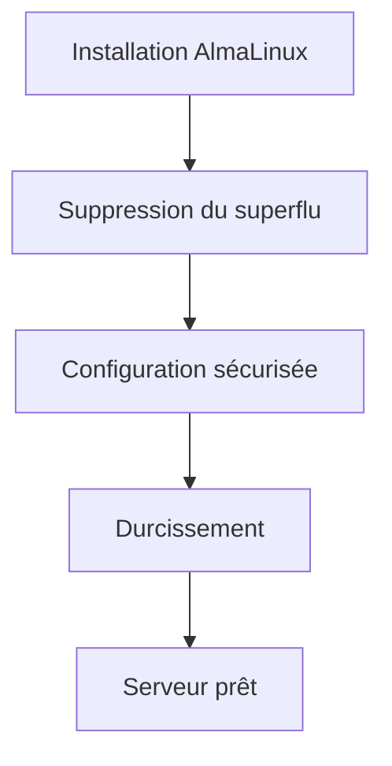

L'objectif n'est pas de rendre le système compliqué.

L'objectif est de le rendre **prévisible et maîtrisé**.

---

# Une approche progressive

Le hardening ne consiste pas à appliquer cent paramètres en une seule fois.

Une approche professionnelle ressemble plutôt à ceci.

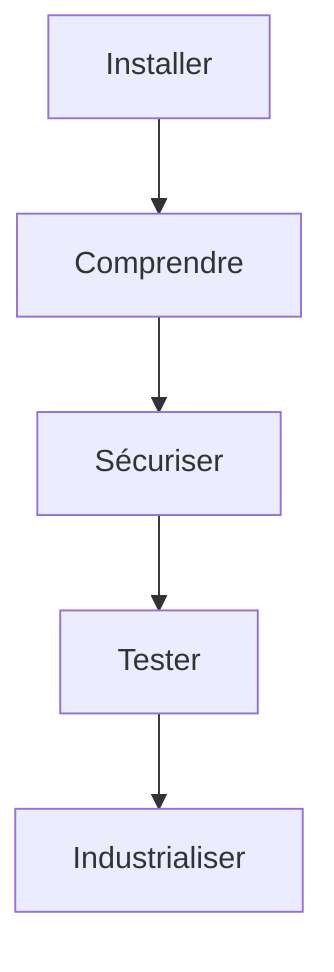

Cette progression est exactement celle de cette formation.

---

# Les grands domaines du hardening

La sécurisation d'un serveur peut être découpée en plusieurs familles.

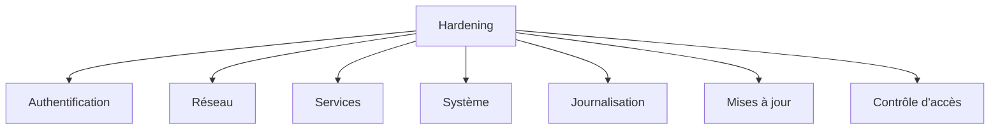

Au cours des prochaines campagnes,

nous approfondirons chacune de ces catégories.

Aujourd'hui,

nous allons construire notre première checklist.

---

# Une stratégie en couches

La sécurité ne repose jamais sur un seul mécanisme.

Elle repose sur plusieurs couches indépendantes.

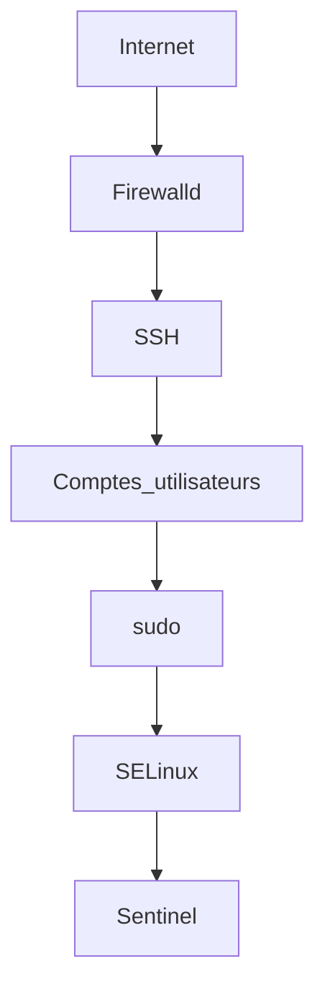

Si une protection échoue,

la suivante continue de protéger le système.

Cette approche est appelée :

> **Défense en profondeur** (*Defense in Depth*).

---

# Première mesure : maintenir le système à jour

Avant toute chose,

nous vérifions que toutes les mises à jour de sécurité sont installées.

```bash
sudo dnf upgrade
```

Pourquoi ?

Parce qu'une vulnérabilité corrigée mais non installée

reste une vulnérabilité exploitable.

Le premier réflexe d'un administrateur est donc toujours :

> **Mettre à jour avant de configurer.**

---

# Deuxième mesure : limiter les services

Chaque service actif représente :

- du code ;
- un processus ;
- parfois un port réseau.

Plus il y a de services,

plus la surface d'attaque augmente.

Visualisons.

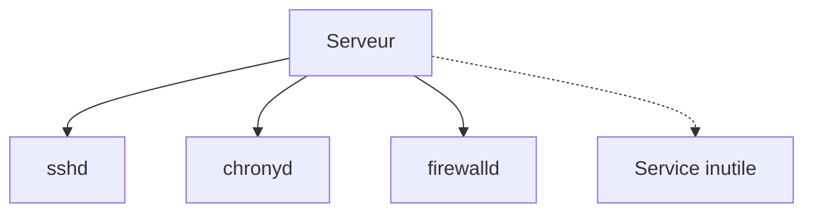

Un service inutile doit être :

- arrêté ;
- désactivé ;
- éventuellement désinstallé.

La règle est simple.

> **Ce qui n'est pas nécessaire ne doit pas fonctionner.**

---
# Troisième mesure : protéger les accès réseau

Un serveur ne doit jamais exposer plus de services que nécessaire.

Le premier mécanisme de protection réseau est le pare-feu.

Sous AlmaLinux,

nous utiliserons :

```text
firewalld
```

Visualisons.

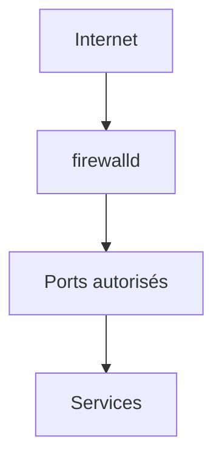

Le principe est simple.

Tout trafic entrant est analysé.

Seuls les flux explicitement autorisés atteignent les services.

Nous consacrerons une campagne entière à firewalld.

---

# Quatrième mesure : sécuriser SSH

Sur la majorité des serveurs,

SSH constitue la principale porte d'entrée.

Il mérite donc une attention particulière.

Les premières bonnes pratiques sont :

- utiliser un compte personnel ;
- interdire les mots de passe lorsque cela est possible ;
- privilégier les clés SSH ;
- limiter les utilisateurs autorisés ;
- journaliser les connexions.

Visualisons.

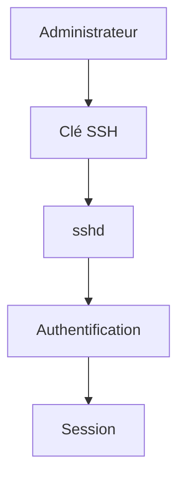

La sécurisation de SSH sera étudiée en détail dans la campagne suivante.

---

# Cinquième mesure : conserver SELinux activé

L'une des premières erreurs des débutants est souvent :

```bash
sudo setenforce 0
```

ou pire,

la modification permanente de :

```text
SELINUX=disabled
```

dans :

```text
/etc/selinux/config
```

Pourquoi ?

Parce qu'un logiciel fonctionne mal.

C'est une très mauvaise pratique.

Visualisons.

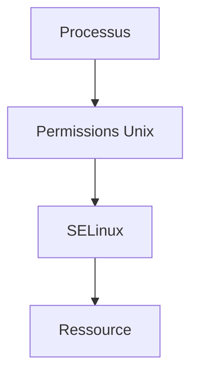

SELinux constitue une couche de protection extrêmement puissante.

Lorsqu'un problème apparaît,

la bonne démarche consiste à comprendre pourquoi,

et non à désactiver la protection.

Nous lui consacrerons une campagne complète.

---

# Sixième mesure : surveiller les journaux

Un serveur sécurisé produit des journaux.

Encore faut-il les consulter.

Sous AlmaLinux,

nous utiliserons principalement :

```text
journald
```

Visualisons.

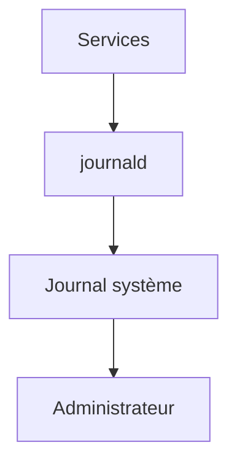

Les journaux permettent notamment de détecter :

- une tentative de connexion ;
- une erreur système ;
- un service en échec ;
- une attaque.

Un administrateur consulte régulièrement ses journaux.

---

# Septième mesure : vérifier les services au démarrage

Tous les services installés ne doivent pas nécessairement démarrer automatiquement.

Afficher les services activés.

```bash
systemctl list-unit-files --type=service
```

Afficher uniquement ceux qui sont actifs.

```bash
systemctl list-units --type=service
```

Visualisons.

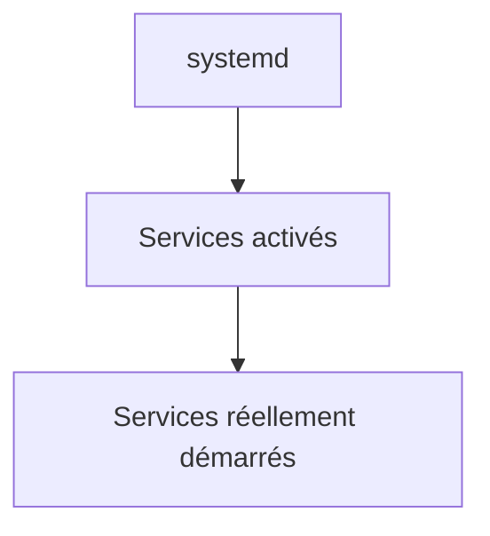

Cette vérification doit faire partie de toute procédure d'audit.

---

# Huitième mesure : protéger les comptes

Les comptes utilisateurs représentent une cible privilégiée.

Les premières règles sont simples.

- créer un compte par administrateur ;
- supprimer les comptes inutilisés ;
- verrouiller les comptes inactifs ;
- utiliser des mots de passe robustes ;
- privilégier ensuite les clés SSH et FreeIPA.

Visualisons.

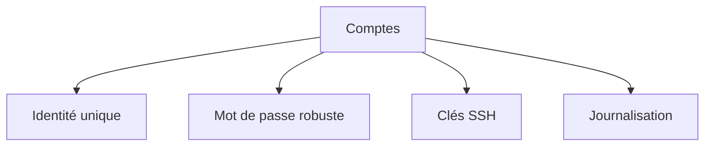

L'identité constitue toujours la première ligne de défense.

---

# Construire une checklist

À ce stade,

notre première checklist de durcissement ressemble à ceci.

| Vérification | État |
|--------------|:---:|
| Système à jour | ☐ |
| Services inutiles supprimés | ☐ |
| Pare-feu actif | ☐ |
| SSH sécurisé | ☐ |
| SELinux activé | ☐ |
| Journaux consultés | ☐ |
| Services vérifiés | ☐ |
| Comptes contrôlés | ☐ |

Cette checklist sera progressivement enrichie tout au long de la formation.

---
# 💎 Le point d'expertise

## Le hardening est un processus, pas un état

Il est fréquent d'entendre :

> « Ce serveur est sécurisé. »

En réalité,

aucun serveur ne l'est définitivement.

La sécurité évolue en permanence.

- de nouvelles vulnérabilités sont découvertes ;
- de nouveaux services sont installés ;
- de nouveaux utilisateurs arrivent ;
- de nouvelles règles de sécurité apparaissent.

Visualisons.

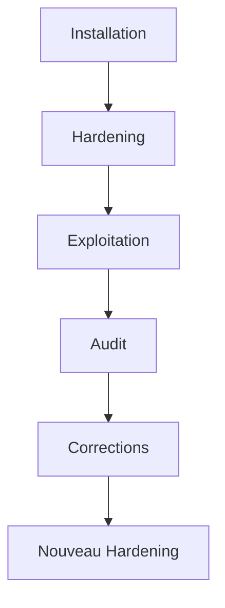

Le hardening est donc une **démarche continue**.

---

## Réduire la surface d'attaque

L'objectif principal du hardening est souvent résumé par une expression.

> **Réduire la surface d'attaque.**

Plus un système expose de composants,

plus un attaquant dispose de possibilités.

Visualisons.

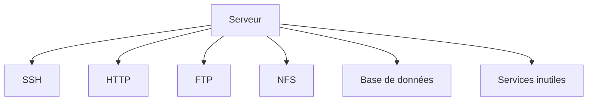

Chaque service supplémentaire représente :

- du code supplémentaire ;
- des dépendances supplémentaires ;
- des vulnérabilités potentielles.

Le meilleur service vulnérable est souvent…

**un service qui n'est pas installé.**

---

## Le principe du "Secure by Default"

Les infrastructures modernes cherchent à appliquer une philosophie simple.

> **Tout est interdit tant qu'il n'est pas explicitement autorisé.**

Par exemple.

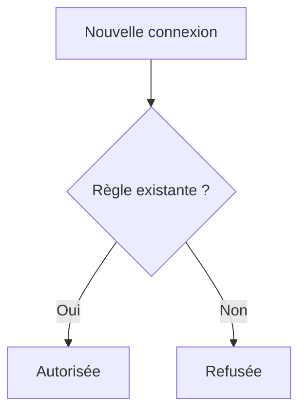

Nous retrouverons cette logique :

- dans `firewalld` ;
- dans SELinux ;
- dans les ACL ;
- dans Kubernetes ;
- dans les pare-feux réseau.

---

## Les protections doivent être indépendantes

Supposons qu'un attaquant contourne SSH.

Le serveur ne doit pas être immédiatement compromis.

Visualisons.

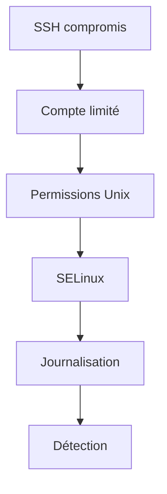

Chaque couche ralentit l'attaquant.

C'est exactement le principe de la **défense en profondeur**.

---

# 🧠 Comment pense un architecte ?

Un architecte ne cherche jamais :

> **Quelle est la meilleure protection ?**

Il cherche plutôt :

> **Quelles protections peuvent se compléter ?**

Visualisons.

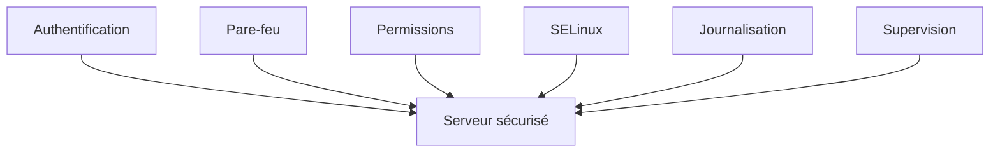

Aucune protection n'est parfaite.

En revanche,

plusieurs protections indépendantes rendent une compromission beaucoup plus difficile.

---

## Le hardening prépare l'automatisation

Un serveur correctement durci possède des caractéristiques prévisibles.

Par exemple.

- mêmes services ;
- mêmes utilisateurs ;
- mêmes permissions ;
- mêmes politiques de sécurité.

Cette homogénéité permet ensuite d'utiliser facilement :

- Ansible ;
- OpenSCAP ;
- Wazuh ;
- Satellite ;
- Sentinel.

Le hardening facilite donc directement l'industrialisation.

---

# ⚔️ Comment pense un attaquant ?

Face à un serveur,

un attaquant cherche immédiatement les protections absentes.

Par exemple.

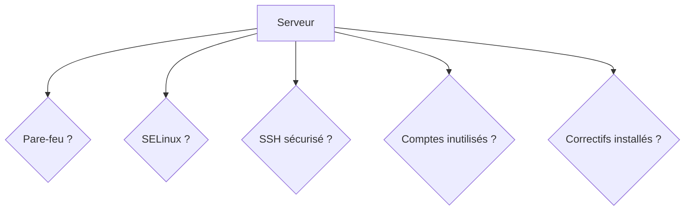

Chaque réponse négative augmente ses chances de réussite.

Le défenseur adopte exactement la démarche inverse :

> **Vérifier systématiquement que chaque protection est présente et correctement configurée.**

---

# 🏢 En entreprise

Dans les grandes organisations,

le hardening est généralement défini par un **standard interne**.

Il prend souvent la forme d'une checklist.

Par exemple.

```text
✓ SELinux Enforcing
✓ firewalld actif
✓ SSH sécurisé
✓ Comptes locaux limités
✓ Journalisation centralisée
✓ Synchronisation NTP
✓ Mises à jour installées
✓ Audits réguliers
```

Chaque nouveau serveur est comparé à cette référence.

Cette approche garantit une homogénéité de l'infrastructure.

---

# 📚 Culture technique

## Les guides de durcissement

Très peu d'entreprises inventent leurs propres règles de sécurité.

Elles s'appuient généralement sur des référentiels reconnus.

Par exemple.

- **CIS Benchmarks**
- **DISA STIG**
- **ANSSI BP28** (en France)
- **Red Hat Security Hardening Guide**

Ces documents contiennent plusieurs centaines de recommandations.

Notre formation reprend les principes les plus importants,

mais les explique progressivement,

afin que vous compreniez **pourquoi** chaque recommandation existe,

et non simplement **quoi** appliquer.

---
