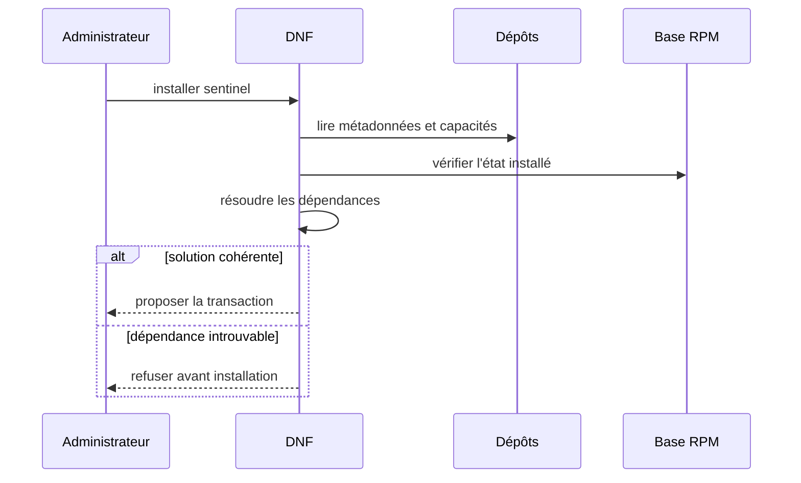
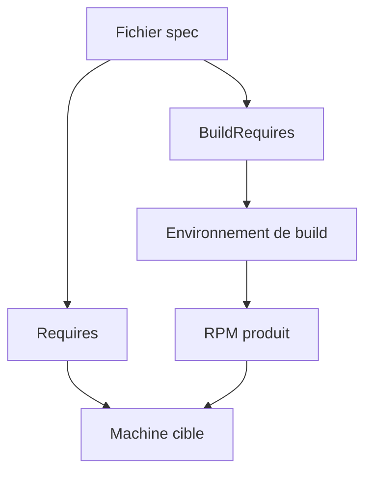
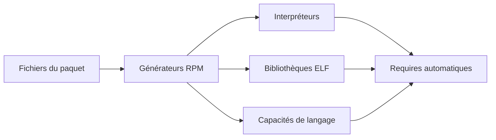
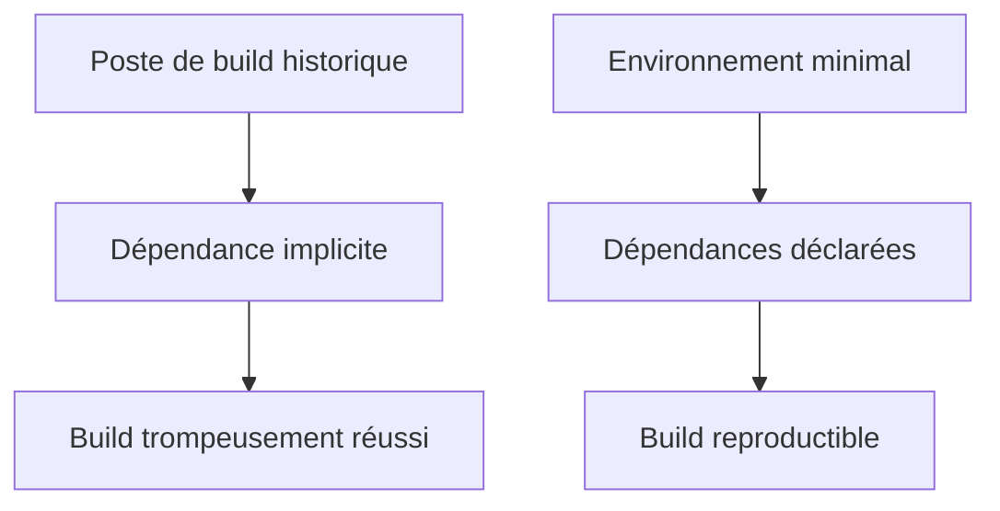

# Chapitre 10.2 — Gérer les dépendances RPM

> **Campagne 10 — RPM et cycle de vie**

> *« Une dépendance bien déclarée transforme un échec tardif en décision de transaction. »*

## Vous êtes ici

```text
PARTIE III — Industrialiser les déploiements

Campagne 10

  10.1 Construire un paquet RPM ✔
► 10.2 Gérer les dépendances
  10.3 Gérer les fichiers de configuration
  10.4 Signer les paquets
  10.5 Exploiter un dépôt RPM privé
  10.6 Packager Sentinel
```

## Objectifs pédagogiques

À l'issue de ce chapitre, vous serez capable de :

- distinguer une dépendance de construction d'une dépendance d'exécution ;
- utiliser `BuildRequires`, `Requires` et les dépendances faibles à bon escient ;
- identifier le paquet qui fournit une commande, une bibliothèque ou une capacité ;
- laisser RPM générer les dépendances qu'il sait détecter ;
- valider un build dans un environnement où les prérequis ne sont pas implicites.

## Pourquoi ce chapitre existe

Un script Sentinel peut fonctionner sur le poste du développeur simplement parce que Python, une bibliothèque ou un utilitaire y est déjà installé. Ce succès local ne prouve pas que le logiciel est déployable.

Le paquet doit déclarer son contrat avec le système. DNF utilise ce contrat pour construire une transaction cohérente avant de modifier la machine.



## Deux moments, deux contrats

Une dépendance peut être nécessaire pour **fabriquer** le paquet sans être requise pour l'utiliser, ou l'inverse.

| Déclaration | Moment | Exemple pour Sentinel |
|---|---|---|
| `BuildRequires` | construction | interpréteur utilisé par `%check`, macros systemd |
| `Requires` | installation et exécution | Python, bibliothèque appelée à l'exécution |
| `Requires(pre)` | avant `%pre` | outil de création du compte système |
| `Recommends` | fonctionnalité utile mais non indispensable | extension de diagnostic |
| `Suggests` | complément facultatif | documentation ou outil opérateur |



> **Piège classique** — Ajouter dans `Requires` tous les paquets présents sur le poste de build produit un contrat trop large et fragile. Une dépendance doit correspondre à un besoin réel du logiciel livré.

## Dépendre d'une capacité, pas d'un hasard

RPM raisonne en **capacités fournies**. Le nom d'un paquet est une capacité fréquente, mais ce n'est pas la seule.

```bash
dnf provides /usr/bin/python3
dnf provides '*/semanage'
dnf repoquery --whatprovides /usr/bin/bash
rpm -q --whatprovides /usr/bin/bash
```

Les deux premières commandes interrogent les dépôts ; la dernière interroge uniquement le système installé.

Une recette peut demander :

```spec
Requires: python3
```

ou, lorsqu'un chemin constitue réellement l'interface attendue :

```spec
Requires: /usr/bin/bash
```

La dépendance par nom de paquet est généralement plus lisible pour un composant maîtrisé. La dépendance par capacité devient utile lorsqu'une interface peut être fournie par plusieurs paquets.

## Les dépendances automatiques

RPM analyse la charge utile et génère certaines dépendances. Un script avec un shebang, une bibliothèque ELF ou un module pris en charge par un générateur peut produire des `Requires` sans ligne manuelle.



Après le build, vérifiez le résultat réel :

```bash
rpm -qpR paquet.rpm
rpm -qp --provides paquet.rpm
```

N'ajoutez pas manuellement une dépendance déjà générée sans raison. En revanche, une commande lancée dynamiquement, un service distant ou un fichier lu par convention peut ne pas être détecté.

### Dépendance logicielle ou prérequis d'exploitation ?

Tout prérequis n'est pas un `Requires` RPM.

| Besoin | Modélisation adaptée |
|---|---|
| interpréteur local indispensable | `Requires` |
| bibliothèque liée à un binaire | génération automatique |
| accès réseau à FreeIPA | documentation et test de santé |
| certificat propre à l'environnement | configuration hors paquet |
| serveur PostgreSQL distant | documentation ou sous-paquet, pas forcément `Requires: postgresql-server` |

Déclarer `postgresql-server` imposerait un serveur local même si Sentinel utilise une base distante. Le paquet doit exprimer un contrat technique, pas reproduire toute l'architecture métier.

## Versions, alternatives et conflits

Une contrainte de version est justifiée lorsqu'une fonction indispensable n'existe pas dans les versions antérieures.

```spec
Requires: python3 >= 3.9
```

Évitez l'égalité stricte sans nécessité :

```spec
Requires: python3 = 3.9.18
```

Elle bloquerait les mises à jour correctives compatibles. Les opérateurs perdraient alors des correctifs de sécurité pour satisfaire une précision fictive.

RPM propose aussi `Provides`, `Conflicts` et `Obsoletes`.

- `Provides` expose une capacité, par exemple `sentinel-agent` ;
- `Conflicts` interdit une cohabitation réellement impossible ;
- `Obsoletes` organise le remplacement d'un ancien paquet ;
- les dépendances riches expriment des relations conditionnelles, mais doivent rester lisibles.

> **Regard architecte** — Plus le graphe de dépendances est précis, plus la mise à jour est prévisible. Plus il est contraint artificiellement, plus il devient difficile à résoudre.

## TP 1 — Observer la génération automatique

Reprenez le paquet `sentinel-banner` du chapitre précédent. Affichez ses dépendances :

```bash
RPM=$(find ~/rpmbuild/RPMS -name 'sentinel-banner-*.rpm' | head -n1)
rpm -qpR "$RPM"
```

Le shebang `#!/usr/bin/bash` doit entraîner une dépendance liée à Bash ou à son chemin. Comparez avec la recette : cette dépendance n'a pas été écrite manuellement.

Créez ensuite une version utilisant Python :

```bash
sed -i '1c #!/usr/bin/python3' /tmp/sentinel-banner-1.0.0/sentinel-banner
sed -i '2c print("Sentinel packaging lab 1.0.0")' \
  /tmp/sentinel-banner-1.0.0/sentinel-banner
tar -C /tmp -czf ~/rpmbuild/SOURCES/sentinel-banner-1.0.0.tar.gz \
  sentinel-banner-1.0.0
rpmbuild -ba ~/rpmbuild/SPECS/sentinel-banner.spec
```

Interrogez de nouveau le RPM et expliquez la différence.

## TP 2 — Séparer build et exécution

Ajoutez au fichier `.spec` :

```spec
BuildRequires:  python3
Requires:       python3
```

Ces deux lignes ont ici des justifications différentes :

- `%check` exécute le script pendant le build ;
- l'utilisateur exécute le script après installation.

Installez le plugin fournissant `dnf builddep`, puis demandez les dépendances de build de la recette :

```bash
sudo dnf install dnf-plugins-core
sudo dnf builddep ~/rpmbuild/SPECS/sentinel-banner.spec
```

Construisez et inspectez :

```bash
rpmbuild -ba ~/rpmbuild/SPECS/sentinel-banner.spec
RPM=$(find ~/rpmbuild/RPMS -name 'sentinel-banner-*.rpm' | head -n1)
rpm -qpR "$RPM" | sort
```

La présence de Python dans l'environnement de build ne suffit pas. La recette doit permettre à un environnement neuf de savoir qu'il en a besoin.

## TP 3 — Diagnostiquer une dépendance impossible

Ajoutez temporairement :

```spec
Requires: sentinel-capacite-inexistante >= 99
```

Le build peut réussir : la dépendance concerne le système cible. L'installation avec DNF doit en revanche être refusée.

```bash
rpmbuild -bb ~/rpmbuild/SPECS/sentinel-banner.spec
RPM=$(find ~/rpmbuild/RPMS -name 'sentinel-banner-*.rpm' | head -n1)
sudo dnf install "$RPM"
```

Interprétez le message de résolution, puis retirez la ligne et reconstruisez le paquet. N'utilisez ni `--nodeps` ni `rpm --force` pour masquer l'erreur : ces options supprimeraient précisément la protection étudiée.

## Construire dans un environnement propre

Un poste ancien accumule des compilateurs, bibliothèques et macros. Un build peut donc réussir grâce à une dépendance non déclarée.



En entreprise, utilisez un constructeur isolé tel que Mock, Koji ou une image de build contrôlée. Dans ce parcours, le minimum attendu est :

1. partir d'une VM AlmaLinux propre ;
2. installer uniquement `rpm-build`, la recette et ses `BuildRequires` ;
3. construire le SRPM et le RPM ;
4. installer le RPM sur une seconde VM propre ;
5. tester les fonctions nécessaires.

Cette séparation révèle les dépendances cachées et les fichiers laissés par des essais précédents.

## Mission d'ingénieur — Cartographier les besoins de Sentinel

À partir du code Sentinel utilisé dans votre laboratoire, construisez un tableau à quatre colonnes :

| Besoin observé | Moment | Déclaration envisagée | Preuve |
|---|---|---|---|
| interpréter `sentinel.py` | exécution | `Requires: python3` | shebang et test sur VM minimale |
| valider la syntaxe Python | build | `BuildRequires: python3` | section `%check` |
| gérer l'unité systemd | build/install | macros et scriptlets | inspection du `.spec` final |
| joindre FreeIPA | exploitation | documentation | service distant, pas paquet local |

Complétez le tableau avec les modules, commandes et services réellement utilisés. Chaque ligne doit être fondée sur une preuve dans le code, le build ou l'exécution.

## Impact sur Sentinel

Sentinel acquiert un contrat d'exécution explicite. DNF pourra refuser une installation incohérente avant que systemd ne tente de démarrer un service incomplet.

La campagne distinguera désormais :

- ce qui doit exister pour construire Sentinel ;
- ce qui doit être installé sur chaque hôte ;
- ce qui relève de la configuration de l'environnement ;
- ce qui constitue une intégration distante, comme FreeIPA.

## Synthèse

- `BuildRequires` prépare le constructeur ; `Requires` protège la machine cible.
- RPM peut générer des dépendances depuis les fichiers du paquet.
- DNF résout des capacités fournies par les dépôts et les paquets installés.
- Une version minimale doit correspondre à une incompatibilité réelle et testée.
- Un service distant ou un secret d'environnement n'est pas automatiquement une dépendance RPM.
- Un build propre révèle les prérequis oubliés par le poste du développeur.

## Infographie de révision

```text
                    CONTRAT RPM

          CONSTRUCTION             EXÉCUTION
          BuildRequires             Requires
                │                      │
                ▼                      ▼
        environnement propre     transaction DNF
                │                      │
                └──────────┬───────────┘
                           ▼
                    RPM installable

Automatique : shebang, ELF, générateurs de langage
Manuel      : commande dynamique ou besoin non détectable
Hors RPM    : secret, service distant, choix d'architecture

RÈGLE : toute dépendance doit avoir une preuve et un moment.
```

## Pour aller plus loin

Les [directives de dépendances du format `.spec`](https://rpm.org/docs/6.0.x/manual/spec.html) et les [guidelines de packaging Fedora](https://docs.fedoraproject.org/en-US/packaging-guidelines/) documentent les capacités, dépendances automatiques et contraintes de version.

Chapitre suivant : faire évoluer une application sans écraser les choix locaux de l'administrateur.

← [10.1 — Construire un paquet RPM](10.1-construire-paquet-rpm.md) · [10.3 — Gérer les fichiers de configuration](10.3-gerer-fichiers-configuration-rpm.md) →
