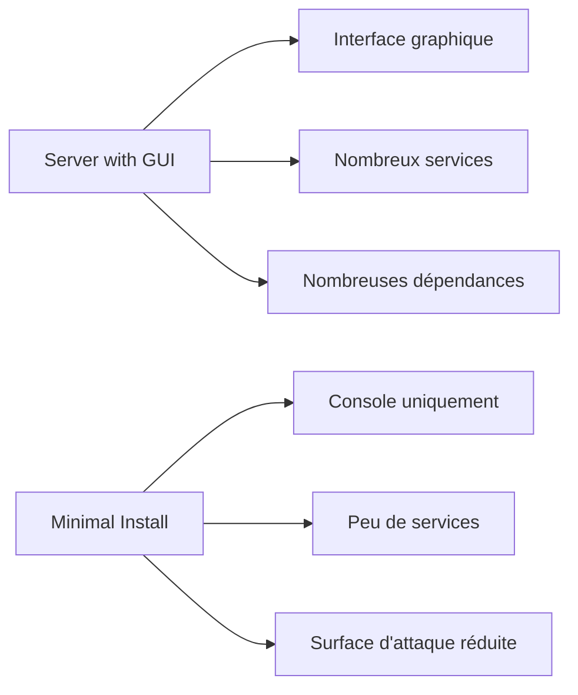
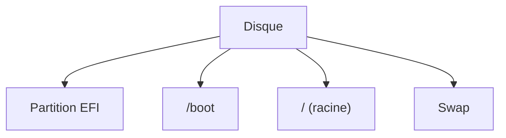
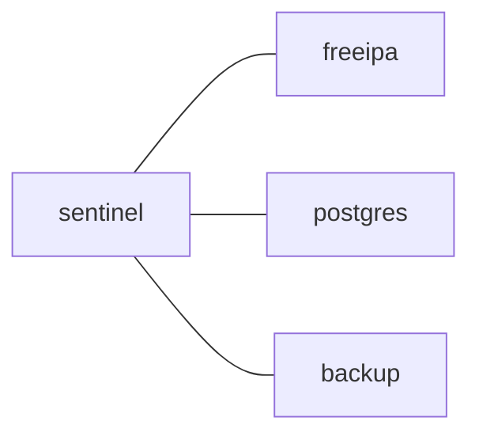
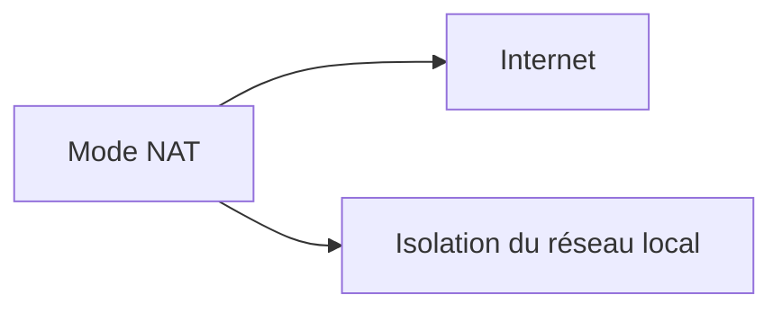
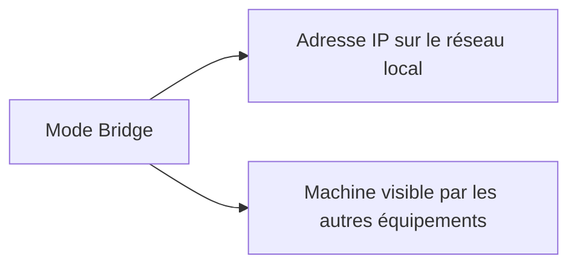
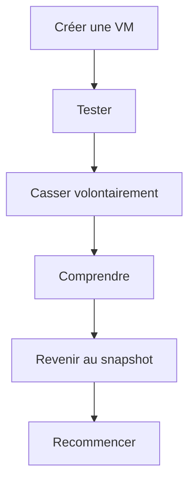
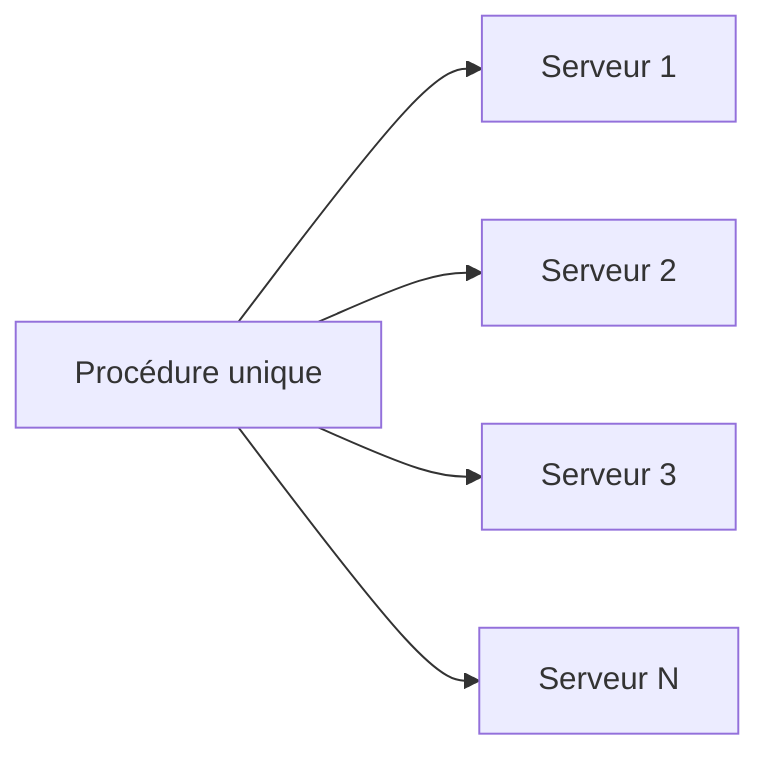

# Campagne 1 — Installation et fondations

# Chapitre 1.2 — Installation d'AlmaLinux Minimal

> *« La qualité d'un système ne dépend pas uniquement de ce que l'on installe. Elle dépend tout autant de ce que l'on choisit de ne pas installer. »*

---

# Vous êtes ici

```text
Partie I — Construire un socle sécurisé

Campagne 1 — Installation et fondations

      1.1 Pourquoi sécuriser un socle Linux ?
    ► 1.2 Installation d'AlmaLinux Minimal
      1.3 Comprendre les privilèges
      1.4 Le système de fichiers
      1.5 Utilisateurs et groupes
      1.6 Permissions Linux
      1.7 sudo et moindre privilège
      1.8 Première sécurisation de Sentinel
```

---

# Objectifs pédagogiques

À la fin de ce chapitre, vous serez capable de :

- comprendre pourquoi une installation minimale constitue une bonne pratique de sécurité ;
- préparer un laboratoire de travail reproductible ;
- installer AlmaLinux avec les paramètres adaptés à un serveur de production ;
- justifier chaque choix effectué pendant l'installation ;
- préparer la future sécurisation de Sentinel.

---

# Pourquoi ce chapitre existe

Installer un système d'exploitation paraît être une opération simple.

Pourtant,

les premières décisions prises pendant l'installation auront des conséquences pendant plusieurs années.

Une mauvaise installation peut entraîner :

- des services inutiles ;
- des dépendances non souhaitées ;
- une surface d'attaque plus importante ;
- une maintenance plus complexe ;
- davantage de mises à jour.

À l'inverse,

une installation réfléchie permet d'obtenir un système :

- simple ;
- robuste ;
- prévisible ;
- facilement industrialisable.

Avant de sécuriser un serveur,

il faut donc commencer par **bien l'installer**.

---

# Pourquoi AlmaLinux ?

Tout au long de cet ouvrage,

nous utiliserons AlmaLinux.

Pourquoi ce choix ?

Parce qu'il s'agit aujourd'hui d'une distribution Linux orientée entreprise.

Elle possède notamment :

- une excellente stabilité ;
- un cycle de vie long ;
- une compatibilité binaire avec Red Hat Enterprise Linux ;
- une documentation abondante ;
- une très forte présence dans les infrastructures professionnelles.

Elle intègre également nativement les technologies que nous allons étudier :

- SELinux ;
- systemd ;
- Firewalld ;
- Podman ;
- FreeIPA ;
- Ansible.

Notre objectif n'est donc pas simplement d'apprendre Linux,

mais d'apprendre **Linux tel qu'il est utilisé en entreprise**.

---

# Notre laboratoire Sentinel

Tout au long de cette formation,

nous conserverons exactement la même machine.

Elle évoluera progressivement,

comme évoluerait un véritable serveur de production.

Notre laboratoire est volontairement simple.


Cette approche présente plusieurs avantages.

- possibilité de réaliser des snapshots ;
- retour arrière immédiat en cas d'erreur ;
- environnement reproductible ;
- apprentissage progressif.

Le lecteur construit ainsi un véritable serveur,

et non une succession d'exercices indépendants.

---

# Pourquoi utiliser une machine virtuelle ?

Une machine virtuelle offre plusieurs bénéfices pédagogiques.

Elle permet :

- de casser le système sans risque ;
- de recommencer rapidement ;
- d'expérimenter librement ;
- d'observer les effets des différentes configurations.

En cybersécurité,

l'expérimentation est essentielle.

Il est beaucoup plus formateur de provoquer volontairement une erreur,

puis de comprendre pourquoi elle s'est produite,

que de suivre une procédure sans jamais s'en écarter.

---

# Les caractéristiques recommandées

Pour cette formation,

les caractéristiques suivantes sont largement suffisantes.

| Ressource | Valeur recommandée |
|------------|-------------------:|
| vCPU | 2 |
| Mémoire | 4 Go |
| Disque | 40 Go |
| Carte réseau | NAT ou Bridge selon le laboratoire |
| Firmware | UEFI |
| TPM | inutile |

Nous verrons plus tard pourquoi certaines de ces caractéristiques pourront évoluer.

---

# Pourquoi utiliser UEFI ?

Aujourd'hui,

la quasi-totalité des serveurs modernes démarrent en mode UEFI.

L'ancien BIOS existe encore,

mais il tend progressivement à disparaître.

Nous utiliserons donc UEFI afin d'être cohérents avec les infrastructures actuelles.

À ce stade,

il n'est pas nécessaire d'en connaître tous les détails.

Nous reviendrons plus tard sur le processus complet de démarrage de Linux.

---

# Le choix du profil d'installation

Lors de l'installation,

plusieurs profils sont proposés.

Par exemple :

- Server with GUI ;
- Workstation ;
- Virtualization Host ;
- Minimal Install.

Nous choisirons systématiquement :

```text
Minimal Install
```

Pourquoi ?

Parce que cette option installe uniquement les composants indispensables au fonctionnement du système.

Elle constitue donc une excellente base de travail.

---

# Comparaison des profils



Cette différence peut paraître anodine.

En réalité,

elle influence directement la sécurité du serveur.

Moins un système contient de composants,

moins il possède de points d'entrée potentiels.

---

# Installer uniquement ce qui est nécessaire

Supposons que nous développions Sentinel.

De quels composants avons-nous réellement besoin ?

Probablement :

- OpenSSH ;
- Python ;
- Podman ;
- quelques outils système.

Avons-nous besoin :

- d'un navigateur web ?
- d'une suite bureautique ?
- d'un environnement graphique complet ?

Bien sûr que non.

Chaque logiciel supplémentaire :

- augmente la taille du système ;
- ajoute des dépendances ;
- nécessite des mises à jour ;
- peut contenir des vulnérabilités.

Nous retrouvons ici le principe du **moindre service** étudié au chapitre précédent.

---
# Le partitionnement

L'installateur propose plusieurs méthodes.

Les plus courantes sont :

- automatique ;
- personnalisé.

Pour cette formation,

nous utiliserons dans un premier temps :

```text
Partitionnement automatique
```

Pourquoi ?

Parce que notre objectif n'est pas encore d'étudier le stockage.

Nous voulons disposer rapidement d'un système fonctionnel.

En revanche,

il est important de comprendre ce que réalise automatiquement l'installateur.

---

# Ce que crée automatiquement AlmaLinux

Dans une installation standard,

AlmaLinux crée généralement plusieurs systèmes de fichiers.



Chacun possède un rôle particulier.

Nous étudierons leur fonctionnement en détail lors du chapitre consacré au système de fichiers.

À ce stade,

retenez simplement qu'un disque Linux est rarement constitué d'une seule partition.

---

# Le choix du système de fichiers

Par défaut,

AlmaLinux propose aujourd'hui :

```text
XFS
```

Pourquoi ce choix ?

Parce qu'il est :

- très performant ;
- extrêmement fiable ;
- conçu pour les serveurs ;
- capable de gérer de très gros volumes.

Il constitue aujourd'hui le système de fichiers recommandé sur les distributions Red Hat.

Nous conserverons donc ce choix.

---

# Pourquoi ne pas choisir ext4 ?

Vous connaissez peut-être déjà :

```text
ext4
```

Il reste un excellent système de fichiers.

Pourquoi utiliser XFS ?

La réponse est simple.

Parce que notre objectif est de reproduire un environnement professionnel.

Or,

la très grande majorité des infrastructures Red Hat et AlmaLinux utilisent désormais XFS par défaut.

Notre laboratoire suivra donc cette recommandation.

---

# Le nom de la machine

Pendant l'installation,

l'installateur demande également un :

```text
Hostname
```

Évitez les noms du type :

```text
serveur

linux

test

machine1
```

Préférez un nom explicite.

Dans notre laboratoire,

nous utiliserons :

```text
sentinel
```

Plus tard,

notre infrastructure comportera plusieurs machines.

Par exemple.



Nommer correctement les machines simplifie énormément l'administration.

---

# Le premier utilisateur

L'installation propose généralement deux possibilités.

Créer uniquement :

```text
root
```

ou

créer également un utilisateur.

Nous choisirons toujours :

- un compte utilisateur personnel ;
- puis l'utilisation de `sudo`.

Autrement dit,

nous n'utiliserons jamais le compte root comme compte de travail quotidien.

Pourquoi ?

Parce que cela applique immédiatement le principe du moindre privilège,

que nous étudierons en détail dans les prochains chapitres.

---

# Le mot de passe root

Même si nous utiliserons principalement `sudo`,

le compte root doit posséder un mot de passe robuste.

Pourquoi ?

Parce qu'il reste indispensable :

- pour certaines opérations de secours ;
- pour certains modes de récupération ;
- lors d'opérations de maintenance exceptionnelles.

En revanche,

ce mot de passe devra être utilisé le moins souvent possible.

---

# Le réseau

L'installation permet également de configurer le réseau.

Dans notre laboratoire,

deux approches sont possibles.



ou



Pour la majorité des exercices,

le mode **NAT** est largement suffisant.

Lorsque nous travaillerons avec plusieurs machines virtuelles,

nous adapterons la configuration réseau en conséquence.

---

# Installer les mises à jour immédiatement

Une fois l'installation terminée,

la première commande ne sera pas l'installation de Sentinel.

Ce sera :

```bash
sudo dnf update
```

Pourquoi ?

Parce que l'image ISO utilisée peut déjà contenir plusieurs semaines,

voire plusieurs mois de retard.

Un système fraîchement installé n'est donc pas forcément un système à jour.

Avant toute autre opération,

nous commencerons toujours par appliquer les correctifs disponibles.

Cette habitude doit devenir un réflexe professionnel.

---

# Premier démarrage

Une fois le système démarré,

nous obtenons un serveur extrêmement sobre.

Pas d'interface graphique.

Pas d'icônes.

Pas de navigateur.

Simplement une console.

C'est exactement ce que nous recherchons.

Chaque composant supplémentaire devra désormais être installé volontairement,

avec une justification technique.

À partir de ce moment,

nous pouvons considérer que les fondations de Sentinel sont en place.

Dans les chapitres suivants,

nous allons progressivement transformer cette installation minimale en un véritable socle sécurisé.

---
# 💎 Le point d'expertise

## Une installation est déjà une décision de sécurité

Beaucoup d'administrateurs considèrent que la sécurité commence après l'installation.

C'est faux.

Prenons deux serveurs.

Premier serveur.

```text
Installation complète

↓

Interface graphique

↓

Navigateurs

↓

Services inutiles

↓

Applications diverses
```

Deuxième serveur.

```text
Installation minimale

↓

Console

↓

SSH

↓

Quelques outils système

↓

Application métier
```

Le second serveur est immédiatement plus simple :

- à comprendre ;
- à maintenir ;
- à mettre à jour ;
- à auditer ;
- à sécuriser.

La différence ne provient pas d'un pare-feu.

Elle provient des choix effectués pendant les dix premières minutes de vie du système.

---

## Chaque paquet installé devient une responsabilité

Lorsqu'un paquet est installé,

on pense généralement uniquement à la fonctionnalité qu'il apporte.

Mais chaque paquet entraîne également :

- des dépendances ;
- des bibliothèques ;
- des fichiers ;
- des services éventuels ;
- des mises à jour futures.

Autrement dit,

installer un logiciel revient à accepter de le maintenir pendant toute la durée de vie du serveur.

Cette idée est fondamentale.

Avant chaque installation,

posez-vous systématiquement la question :

> **Qui utilisera réellement ce logiciel ?**

Si aucune réponse claire n'existe,

il ne devrait probablement pas être installé.

---

## La meilleure machine est celle que l'on peut reconstruire

Une machine virtuelle n'est pas seulement pratique.

Elle change complètement la manière de travailler.

Au lieu de considérer le serveur comme un objet précieux qu'il ne faut jamais casser,

on adopte une autre philosophie.



Cette capacité à reconstruire rapidement une machine est aujourd'hui au cœur des pratiques DevOps et SRE.

---

# 🧠 Comment pense un architecte ?

Lorsqu'un architecte conçoit un serveur,

il ne pense jamais uniquement au présent.

Il réfléchit également au futur.

Par exemple.

> Ce serveur sera-t-il encore administrable dans trois ans ?

Ou encore.

> Si je dois déployer cent serveurs identiques, pourrais-je reproduire exactement cette installation ?

Cette manière de raisonner conduit naturellement à rechercher :

- des procédures reproductibles ;
- des configurations standardisées ;
- de l'automatisation.

Nous retrouverons cette philosophie lorsque nous utiliserons Ansible.

---

## La reproductibilité est une propriété de sécurité

Imaginons deux entreprises.

### Entreprise A

Chaque administrateur installe les serveurs à sa manière.

Résultat.

```text
Serveur 1 ≠ Serveur 2 ≠ Serveur 3
```

Chaque machine devient un cas particulier.

---

### Entreprise B

Toutes les installations suivent exactement la même procédure.



Les audits deviennent plus simples.

Les erreurs diminuent.

Les interventions sont plus rapides.

La standardisation améliore donc directement la sécurité.

---

# ⚔️ Comment pense un attaquant ?

Un attaquant apprécie particulièrement les serveurs installés "rapidement".

Pourquoi ?

Parce qu'ils présentent souvent des caractéristiques communes.

Par exemple.

- comptes inutiles ;
- logiciels jamais utilisés ;
- services oubliés ;
- mots de passe faibles ;
- mises à jour non appliquées.

Autrement dit,

plus une installation est improvisée,

plus les opportunités sont nombreuses.

À l'inverse,

une installation minimale correctement préparée laisse beaucoup moins de prises.

---

## Les mauvaises habitudes naissent dès l'installation

Un serveur mal installé reste souvent mal administré.

Par exemple.

```text
Connexion root

↓

Habitude prise

↓

Toujours root

↓

Aucun audit
```

Ou encore.

```text
Installation graphique

↓

Utilisation d'outils graphiques

↓

Peu d'automatisation

↓

Maintenance plus difficile
```

Les habitudes acquises pendant les premiers jours de vie d'un serveur influencent souvent plusieurs années d'exploitation.

C'est pourquoi cette campagne accorde autant d'importance aux fondations.

---

# 🏢 En entreprise

Dans les grandes entreprises,

les administrateurs ne réalisent presque jamais une installation "à la main".

Ils utilisent :

- une image de référence (*Golden Image*) ;
- un serveur PXE ;
- Kickstart ;
- des modèles VMware ;
- des templates VirtualBox ;
- du provisioning automatisé.

Toutes les machines démarrent ainsi avec :

- le même partitionnement ;
- les mêmes paquets ;
- les mêmes paramètres système ;
- les mêmes politiques de sécurité.

L'objectif est que le centième serveur soit strictement identique au premier.

Nous ne mettrons pas encore en œuvre cette industrialisation,

mais toute notre manière de construire Sentinel préparera progressivement cette approche.

---
# 📚 Culture technique

## Pourquoi les serveurs Linux n'ont généralement pas d'interface graphique ?

Lorsqu'un administrateur découvre un serveur Linux,

il est souvent surpris.

Après le démarrage,

aucun bureau n'apparaît.

Simplement :

```text
login:
```

Ce choix est volontaire.

Une interface graphique nécessite :

- davantage de mémoire ;
- davantage de CPU ;
- davantage de bibliothèques ;
- davantage de services ;
- davantage de mises à jour.

Or,

un serveur n'a généralement pas besoin :

- d'un navigateur Internet ;
- d'un lecteur vidéo ;
- d'un gestionnaire de fenêtres.

Ces composants augmenteraient uniquement la surface d'attaque.

Les administrateurs travaillent donc presque exclusivement :

- en console locale ;
- en SSH.

---

## Pourquoi les distributions proposent-elles malgré tout une interface graphique ?

Parce que tous les usages ne sont pas identiques.

Une même distribution Linux peut être utilisée :

- sur un poste de développement ;
- sur un ordinateur personnel ;
- sur une station de calcul ;
- sur un serveur de production.

Les besoins sont très différents.

L'installateur propose donc plusieurs profils afin de répondre à ces usages.

Notre choix d'une installation minimale n'est pas lié à Linux.

Il est lié à notre objectif :

**administrer un serveur.**

---

## Le rôle de l'installateur Anaconda

L'installateur d'AlmaLinux s'appelle :

```text
Anaconda
```

Son rôle ne se limite pas à copier des fichiers.

Il réalise notamment :

- le partitionnement ;
- le formatage ;
- l'installation des paquets ;
- la configuration du réseau ;
- la création des utilisateurs ;
- l'installation du chargeur de démarrage ;
- la génération de la configuration initiale du système.

Lorsque l'installation se termine,

le système est déjà parfaitement fonctionnel.

---

## Pourquoi utiliser une image ISO officielle ?

Une installation Linux commence toujours par une image ISO.

Il est indispensable de télécharger cette image depuis une source officielle.

Pourquoi ?

Parce que l'ISO contient :

- le système d'exploitation ;
- les paquets ;
- les signatures ;
- le programme d'installation.

Une image modifiée par un attaquant pourrait compromettre le serveur avant même son premier démarrage.

Nous verrons plus tard comment vérifier l'intégrité d'une ISO grâce aux sommes de contrôle et aux signatures GPG.

---

# ⚠️ Piège classique

## Installer tous les paquets "par sécurité"

Une erreur fréquente consiste à penser :

> *« Si j'installe tout maintenant, je n'aurai plus besoin de revenir dessus. »*

Cette approche produit exactement l'effet inverse.

Plus le système contient de logiciels,

plus il faudra :

- les mettre à jour ;
- les maintenir ;
- les surveiller ;
- corriger leurs vulnérabilités.

En cybersécurité,

la simplicité est presque toujours préférable à l'abondance.

---

## Choisir un nom de machine imprécis

Nommer un serveur :

```text
linux

serveur

test

vm1
```

fonctionne...

jusqu'au jour où l'entreprise possède cent cinquante machines.

À ce moment-là,

personne ne sait plus :

- quel est le rôle de la machine ;
- dans quel environnement elle se trouve ;
- si elle peut être arrêtée.

Une convention de nommage claire est un véritable outil d'administration.

Nous définirons la nôtre lorsque notre laboratoire comportera plusieurs serveurs.

---

# Laboratoire AlmaLinux

## Objectif

Installer un serveur AlmaLinux minimal qui servira de base à l'ensemble de la formation.

---

## Étape 1 — Créer la machine virtuelle

Créer une nouvelle machine virtuelle avec les caractéristiques recommandées.

Vérifier :

- le nombre de processeurs ;
- la quantité de mémoire ;
- la taille du disque ;
- le mode UEFI ;
- la configuration réseau.

---

## Étape 2 — Installer AlmaLinux

Pendant l'installation,

choisir :

- **Minimal Install** ;
- partitionnement automatique ;
- système de fichiers par défaut ;
- nom d'hôte :

```text
sentinel
```

Créer ensuite :

- un utilisateur personnel ;
- un mot de passe root robuste.

---

## Étape 3 — Premier démarrage

Après le premier redémarrage,

ouvrir une session avec votre utilisateur.

Vérifier :

```bash
hostnamectl
```

Puis :

```bash
cat /etc/os-release
```

Identifier :

- le nom du système ;
- la version ;
- l'architecture.

---

## Étape 4 — Première mise à jour

Mettre immédiatement le système à jour.

```bash
sudo dnf update
```

Puis redémarrer si nécessaire.

```bash
sudo reboot
```

À l'issue de cette étape,

vous disposez d'un socle propre,

minimal

et entièrement à jour.

---

# Mission d'ingénieur

Votre entreprise souhaite créer une image de référence (*Golden Image*) qui servira à déployer plusieurs centaines de serveurs AlmaLinux.

Vous devez rédiger un document expliquant :

- pourquoi une installation minimale a été retenue ;
- quels paramètres doivent être identiques sur toutes les machines ;
- quels éléments pourront être personnalisés après le déploiement ;
- pourquoi il est indispensable d'appliquer immédiatement les mises à jour ;
- comment garantir que toutes les futures installations resteront identiques.

Votre objectif est de démontrer qu'une installation standardisée constitue la première étape de la sécurisation d'une infrastructure.

---

# Impact sur Sentinel

À l'issue de ce chapitre,

notre laboratoire dispose désormais d'une base saine.

Le serveur Sentinel est :

- installé ;
- minimal ;
- reproductible ;
- entièrement à jour ;
- prêt à être sécurisé.

À partir du prochain chapitre,

nous quitterons le domaine de l'installation pour commencer à étudier ce qui fait la force de Linux :

**son modèle de privilèges**.

Nous allons comprendre pourquoi Linux sépare strictement les utilisateurs ordinaires du superutilisateur,

et comment cette séparation constitue l'un des premiers mécanismes de sécurité du système.

---

# Ce qu'il faut retenir

- Une installation est déjà une décision de sécurité.
- Une installation minimale réduit naturellement la surface d'attaque.
- Chaque logiciel installé devient une responsabilité à maintenir.
- Une machine virtuelle permet d'expérimenter sans risque et favorise l'apprentissage.
- Les serveurs Linux sont généralement administrés sans interface graphique.
- La standardisation des installations facilite l'audit, la maintenance et l'automatisation.
- Un système doit être mis à jour immédiatement après son installation.
- La reproductibilité est une qualité essentielle d'une infrastructure moderne.

---
# Grande infographie de révision du chapitre

```text
┌──────────────────────────────────────────────────────────────────────────────────────────────┐
│              CHAPITRE 1.2 — INSTALLATION D'ALMALINUX MINIMAL                                 │
├──────────────────────────────────────────────────────────────────────────────────────────────┤
│                                                                                              │
│                      OBJECTIF : UN SOCLE SIMPLE ET MAÎTRISÉ                                  │
│                                                                                              │
│      Installation minimale                                                                   │
│              │                                                                               │
│              ▼                                                                               │
│      Peu de paquets                                                                          │
│              │                                                                               │
│              ▼                                                                               │
│      Peu de services                                                                         │
│              │                                                                               │
│              ▼                                                                               │
│      Surface d'attaque réduite                                                               │
│                                                                                              │
├──────────────────────────────────────────────────────────────────────────────────────────────┤
│                         ENVIRONNEMENT DE LABORATOIRE                                          │
│                                                                                              │
│      Poste Windows                                                                           │
│             │                                                                                │
│             ▼                                                                                │
│        VirtualBox                                                                            │
│             │                                                                                │
│             ▼                                                                                │
│    VM AlmaLinux Minimal                                                                      │
│             │                                                                                │
│             ▼                                                                                │
│         Projet Sentinel                                                                      │
│                                                                                              │
├──────────────────────────────────────────────────────────────────────────────────────────────┤
│                          CHOIX D'INSTALLATION                                                 │
│                                                                                              │
│ ✔ Profil : Minimal Install                                                                   │
│ ✔ UEFI                                                                                       │
│ ✔ XFS                                                                                        │
│ ✔ Partitionnement automatique                                                                │
│ ✔ Hostname explicite                                                                         │
│ ✔ Utilisateur personnel                                                                      │
│ ✔ Mot de passe root robuste                                                                  │
│ ✔ Mise à jour immédiate                                                                      │
│                                                                                              │
├──────────────────────────────────────────────────────────────────────────────────────────────┤
│                       CE QUI EST INSTALLÉ                                                     │
│                                                                                              │
│ Disque                                                                                       │
│   │                                                                                          │
│   ├── EFI                                                                                    │
│   ├── /boot                                                                                  │
│   ├── /                                                                                      │
│   └── Swap                                                                                   │
│                                                                                              │
│ Système                                                                                      │
│   │                                                                                          │
│   ├── systemd                                                                                │
│   ├── SELinux                                                                                │
│   ├── Firewalld                                                                              │
│   └── OpenSSH                                                                                │
│                                                                                              │
├──────────────────────────────────────────────────────────────────────────────────────────────┤
│                         PREMIÈRES COMMANDES                                                   │
│                                                                                              │
│ hostnamectl                                                                                  │
│ cat /etc/os-release                                                                          │
│ dnf update                                                                                   │
│ reboot                                                                                       │
│                                                                                              │
├──────────────────────────────────────────────────────────────────────────────────────────────┤
│                          BONNES PRATIQUES                                                     │
│                                                                                              │
│ ✔ Installer le minimum                                                                       │
│ ✔ Utiliser une VM reproductible                                                              │
│ ✔ Donner un nom explicite au serveur                                                         │
│ ✔ Créer un utilisateur nominatif                                                             │
│ ✔ Utiliser sudo                                                                              │
│ ✔ Mettre immédiatement le système à jour                                                     │
│ ✔ Standardiser toutes les installations                                                      │
│ ✘ Ne pas installer "au cas où"                                                               │
│ ✘ Ne pas utiliser root comme compte quotidien                                                │
├──────────────────────────────────────────────────────────────────────────────────────────────┤
│                                 IDÉE CLÉ                                                     │
│                                                                                              │
│ « Une bonne installation n'ajoute rien d'inutile.                                            │
│  Elle construit un socle minimal, propre, reproductible                                      │
│  et prêt à être sécurisé. »                                                                  │
└──────────────────────────────────────────────────────────────────────────────────────────────┘
```
