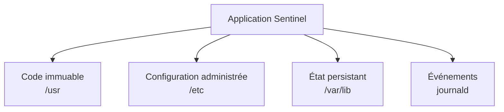
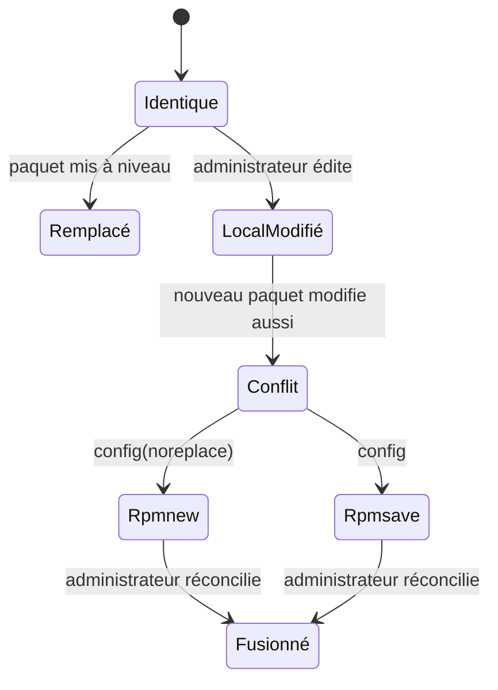
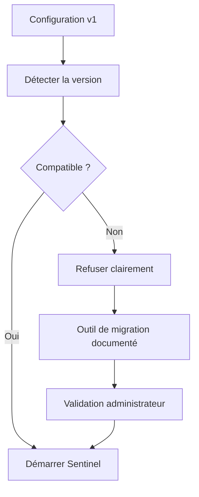

# Chapitre 10.3 — Gérer les fichiers de configuration RPM

> **Campagne 10 — RPM et cycle de vie**

> *« Mettre à jour le logiciel ne doit pas effacer la décision de l'exploitant. »*

## Vous êtes ici

```text
PARTIE III — Industrialiser les déploiements

Campagne 10

  10.1 Construire un paquet RPM ✔
  10.2 Gérer les dépendances ✔
► 10.3 Gérer les fichiers de configuration
  10.4 Signer les paquets
  10.5 Exploiter un dépôt RPM privé
  10.6 Packager Sentinel
```

## Objectifs pédagogiques

À l'issue de ce chapitre, vous serez capable de :

- séparer le code, la configuration, l'état et les journaux d'une application ;
- choisir entre `%config`, `%config(noreplace)` et un fichier ordinaire ;
- prévoir les comportements `.rpmnew` et `.rpmsave` lors d'une mise à niveau ;
- empaqueter des valeurs par défaut sans livrer de secret ;
- tester l'installation, la mise à niveau et la suppression d'une configuration.

## Pourquoi ce chapitre existe

Le binaire Sentinel appartient à l'équipe qui publie le paquet. Sa configuration appartient à l'environnement qui l'exploite.

Si une mise à jour écrase l'adresse de FreeIPA, le port d'écoute ou les chemins de certificats, l'application peut devenir indisponible. Si le paquet conserve éternellement une ancienne configuration, l'opérateur peut manquer une nouvelle option obligatoire.

RPM doit donc arbitrer entre deux versions légitimes : celle fournie par l'éditeur et celle adaptée localement.

## Séparer quatre natures de données



| Nature | Exemple | Propriétaire du changement | Traitement |
|---|---|---|---|
| code | `/usr/libexec/sentinel/sentinel` | mainteneur du paquet | fichier RPM ordinaire |
| configuration | `/etc/sentinel/sentinel.conf` | administrateur | `%config(noreplace)` |
| état | `/var/lib/sentinel/` | application | créé à l'exécution, sauvegardé séparément |
| journal | journald | système et application | politique de journalisation |

Cette séparation évite d'écrire dans le répertoire du programme. Elle permet aussi à `ProtectSystem=strict` de rendre `/usr` en lecture seule pour le service.

> **Regard défenseur** — Un secret placé dans un RPM se retrouve dans l'artefact, le cache DNF, les miroirs, les sauvegardes et parfois le SRPM. Un paquet peut livrer un *emplacement* ou un exemple, jamais un secret propre à un environnement.

## Les attributs de configuration RPM

Un fichier listé simplement dans `%files` est géré comme un fichier applicatif. Pour une configuration locale, RPM propose des attributs dédiés.

```spec
%config(noreplace) %{_sysconfdir}/sentinel/sentinel.conf
```

| Déclaration | Intention | Mise à niveau si le fichier local et le fichier livré ont changé |
|---|---|---|
| fichier ordinaire | contenu contrôlé par le paquet | remplacement par la nouvelle version |
| `%config` | configuration, nouvelle version prioritaire | ancien contenu sauvegardé en `.rpmsave` |
| `%config(noreplace)` | choix local prioritaire | nouveau contenu écrit en `.rpmnew` |
| `%config(missingok)` | fichier autorisé à disparaître | absence non signalée comme divergence |

`noreplace` ne signifie pas « ne jamais mettre à jour ». Si l'administrateur n'a pas modifié le fichier, RPM peut le remplacer normalement. Le cas particulier apparaît lorsque les deux branches ont divergé.



### Pourquoi `noreplace` convient à Sentinel

La configuration Sentinel contient des choix locaux :

- nom ou adresse du serveur d'identité ;
- port d'écoute ;
- niveau de journalisation ;
- chemin du certificat et de la clé privée ;
- paramètres de stockage.

Une mise à jour ne doit pas les réinitialiser. En revanche, le nouveau modèle doit rester accessible dans `.rpmnew` pour permettre une fusion contrôlée.

### Quand ne pas utiliser `noreplace`

Un fichier sous `/usr`, une unité systemd livrée par le paquet ou une règle interne non destinée à l'administrateur doit généralement suivre la version du paquet.

Marquer tous les fichiers comme configuration déplace la responsabilité des mises à jour vers l'opérateur et laisse d'anciens composants en place. Le choix doit refléter **qui est autorisé à modifier le fichier**.

## Livrer des valeurs par défaut sûres

Une configuration initiale doit être utilisable sans simuler un environnement de production.

```ini
[server]
listen_address = 127.0.0.1
listen_port = 8443

[identity]
provider = disabled
freeipa_url =

[tls]
certificate = /etc/sentinel/tls/server.crt
private_key = /etc/sentinel/tls/server.key

[logging]
level = INFO
destination = journald
```

Les valeurs suivent plusieurs principes.

- l'écoute par défaut reste locale ;
- l'intégration distante est désactivée tant qu'elle n'est pas configurée ;
- aucun mot de passe, jeton, certificat privé ou clé privée n'est livré ;
- les chemins attendus sont documentés ;
- les journaux vont vers journald, déjà géré par le système.

Une valeur fictive telle que `change-me` finit souvent par survivre en production. Préférez une valeur vide qui provoque une erreur explicite lorsque la fonction est activée.

## Permissions, propriétaires et répertoires

Le répertoire peut être possédé par le paquet :

```spec
%dir %attr(0750,root,sentinel) %{_sysconfdir}/sentinel
%config(noreplace) %attr(0640,root,sentinel) \
  %{_sysconfdir}/sentinel/sentinel.conf
```

Le service peut lire la configuration grâce à son groupe, mais ne peut pas la modifier. L'écriture reste une action d'administration.

Pour les secrets ajoutés après installation :

```bash
sudo install -d -m 0750 -o root -g sentinel /etc/sentinel/tls
sudo install -m 0640 -o root -g sentinel server.crt /etc/sentinel/tls/
sudo install -m 0640 -o root -g sentinel server.key /etc/sentinel/tls/
```

Le paquet ne doit pas déclarer ces fichiers comme s'il les fournissait. Selon le modèle d'exploitation, Ansible, une PKI ou un gestionnaire de secrets les déploiera.

> **Point SELinux** — Les modes Unix ne remplacent pas les contextes SELinux. Après installation ou restauration, `restorecon` et la politique étudiée en campagne 6 doivent conserver les types attendus.

## TP 1 — Ajouter une configuration au paquet pédagogique

Créez un fichier source :

```bash
cat > ~/rpmbuild/SOURCES/sentinel-banner.conf <<'EOF'
[banner]
message = Sentinel packaging lab
color = disabled
EOF
```

Ajoutez à l'en-tête du `.spec` :

```spec
Source1:        sentinel-banner.conf
```

Ajoutez à `%install` :

```spec
install -Dpm 0644 %{SOURCE1} \
  %{buildroot}%{_sysconfdir}/sentinel-banner.conf
```

Ajoutez à `%files` :

```spec
%config(noreplace) %{_sysconfdir}/sentinel-banner.conf
```

Incrémentez `Release` à `2%{?dist}`, puis construisez :

```bash
rpmbuild -ba ~/rpmbuild/SPECS/sentinel-banner.spec
RPM=$(find ~/rpmbuild/RPMS -name 'sentinel-banner-1.0.0-2*.rpm' | head -n1)
rpm -qpc "$RPM"
```

`rpm -qpc` doit afficher le fichier reconnu comme configuration.

## TP 2 — Provoquer puis résoudre un `.rpmnew`

Installez le release 2 et personnalisez sa valeur :

```bash
sudo dnf install "$RPM"
sudo sed -i 's/Sentinel packaging lab/Sentinel site Paris/' \
  /etc/sentinel-banner.conf
```

Modifiez maintenant la source du paquet :

```bash
sed -i 's/color = disabled/color = blue/' \
  ~/rpmbuild/SOURCES/sentinel-banner.conf
sed -i 's/^Release:.*/Release:        3%{?dist}/' \
  ~/rpmbuild/SPECS/sentinel-banner.spec
rpmbuild -ba ~/rpmbuild/SPECS/sentinel-banner.spec
RPM3=$(find ~/rpmbuild/RPMS -name 'sentinel-banner-1.0.0-3*.rpm' | head -n1)
sudo dnf upgrade "$RPM3"
```

Examinez les deux versions :

```bash
sudo ls -l /etc/sentinel-banner.conf*
sudo diff -u /etc/sentinel-banner.conf \
  /etc/sentinel-banner.conf.rpmnew || true
```

La configuration locale doit être conservée et la nouvelle version proposée dans `.rpmnew`.

Fusionnez explicitement :

```bash
sudoedit /etc/sentinel-banner.conf
sudo rm /etc/sentinel-banner.conf.rpmnew
```

Avant la suppression, assurez-vous d'avoir reporté la nouvelle option `color` sans perdre le message local.

## TP 3 — Vérifier les métadonnées et la suppression

```bash
rpm -V sentinel-banner
rpm -qc sentinel-banner
sudo dnf remove sentinel-banner
sudo ls -l /etc/sentinel-banner.conf* 2>/dev/null || true
```

Interprétez séparément :

- les différences liées au contenu local ;
- les permissions ou propriétaires divergents ;
- le comportement du fichier modifié lors de la suppression.

Un fichier de configuration modifié peut être conservé sous forme `.rpmsave`. Cette sauvegarde facilite la réinstallation, mais ne remplace ni une sauvegarde d'exploitation ni une politique de rétention.

## Gérer les migrations de format

`%config(noreplace)` protège le contenu, mais ne transforme pas une ancienne syntaxe en nouvelle syntaxe. Une évolution incompatible doit être conçue.



Une bonne stratégie peut inclure :

1. un numéro de version de schéma dans le fichier ;
2. un validateur exécutable avant le redémarrage ;
3. un outil de migration idempotent ;
4. une sauvegarde explicite ;
5. une action humaine lorsque le sens d'une option change.

Évitez une migration silencieuse dans `%post` pour une configuration critique. Les scriptlets s'exécutent pendant la transaction et offrent un contexte médiocre pour arbitrer une ambiguïté métier.

## Mission d'ingénieur — Concevoir la politique de configuration Sentinel

Produisez une courte décision d'architecture précisant :

- les fichiers livrés par le RPM ;
- les fichiers créés par l'exploitation ;
- les permissions attendues ;
- la source des certificats et secrets ;
- la réaction à un `.rpmnew` ;
- le test à exécuter avant tout redémarrage ;
- la sauvegarde et le retour arrière prévus.

La validation minimale peut prendre la forme :

```bash
/usr/libexec/sentinel/sentinel \
  --config /etc/sentinel/sentinel.conf \
  --check-config
```

Si cette option n'existe pas encore, son ajout devient une exigence applicative avant l'industrialisation.

## Impact sur Sentinel

Sentinel possède maintenant une frontière claire entre le produit et son environnement.

- le code sera remplacé lors d'une mise à jour ;
- la configuration locale sera conservée avec `%config(noreplace)` ;
- les nouveautés seront visibles dans `.rpmnew` ;
- les secrets seront injectés après installation ;
- l'état persistant ne sera pas confondu avec la charge utile du paquet.

Cette frontière permet à Ansible de gérer les choix du site sans entrer en conflit avec le cycle de vie RPM.

## Synthèse

- `/usr` contient le logiciel livré ; `/etc` contient les choix administratifs.
- `%config(noreplace)` conserve la version locale en cas de double modification.
- `.rpmnew` et `.rpmsave` sont des signaux à traiter, pas des sauvegardes durables.
- Le paquet ne doit contenir aucun secret propre à un environnement.
- Le service lit sa configuration mais ne doit pas pouvoir la réécrire.
- Une migration de format doit être validable, observable et réversible.

## Infographie de révision

```text
              QUI CONTRÔLE LE FICHIER ?

  mainteneur RPM          administrateur          application
       │                       │                       │
       ▼                       ▼                       ▼
     /usr                    /etc                   /var/lib
  fichier normal      %config(noreplace)          état vivant
                               │
                  local + nouveau divergent
                               │
                               ▼
                         fichier .rpmnew
                               │
                               ▼
                    comparer → valider → fusionner

SECRETS : jamais dans le RPM ; injection après installation.
```

## Pour aller plus loin

Les [guidelines Fedora sur les fichiers de configuration](https://docs.fedoraproject.org/en-US/packaging-guidelines/) explicitent les usages de `%config` et `%config(noreplace)`. La documentation DNF décrit également sa [politique de remplacement des configurations](https://dnf.readthedocs.io/en/latest/command_ref.html#configuration-files-replacement-policy).

Chapitre suivant : prouver l'origine du paquet sans confondre signature et qualité du code.

← [10.2 — Gérer les dépendances](10.2-gerer-dependances-rpm.md) · [10.4 — Signer les paquets](10.4-signer-paquets-rpm.md) →
