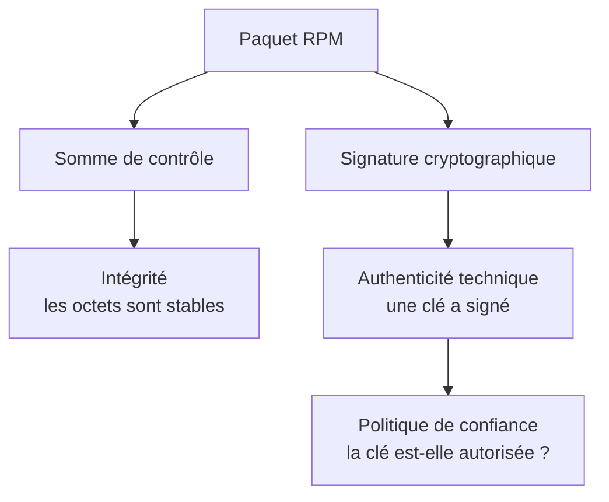
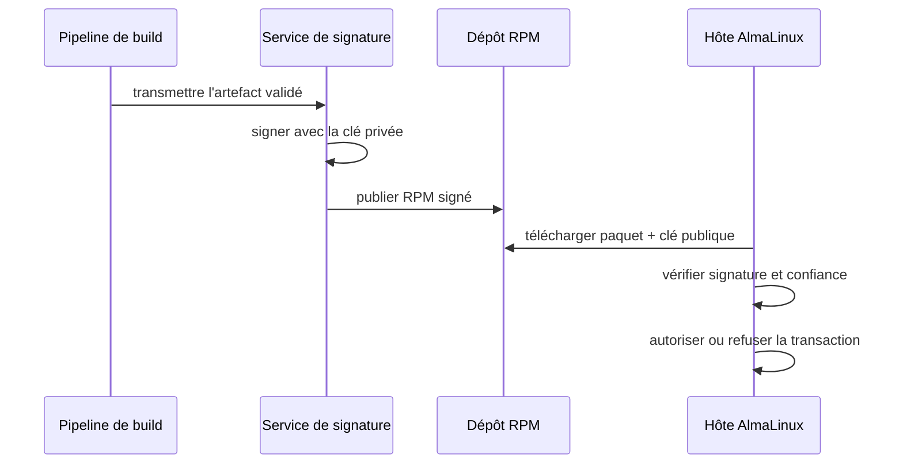
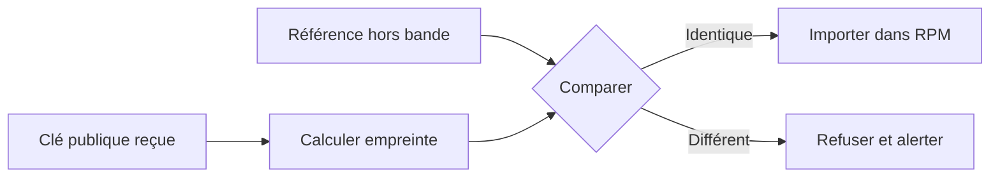
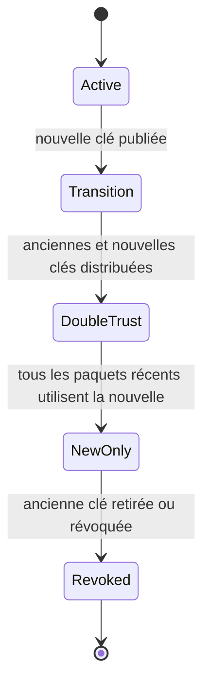

# Chapitre 10.4 — Signer les paquets RPM

> **Campagne 10 — RPM et cycle de vie**

> *« L'intégrité dit que l'objet n'a pas changé ; la signature relie cet objet à une identité de publication. »*

## Vous êtes ici

```text
PARTIE III — Industrialiser les déploiements

Campagne 10

  10.1 Construire un paquet RPM ✔
  10.2 Gérer les dépendances ✔
  10.3 Gérer les fichiers de configuration ✔
► 10.4 Signer les paquets
  10.5 Exploiter un dépôt RPM privé
  10.6 Packager Sentinel
```

## Objectifs pédagogiques

À l'issue de ce chapitre, vous serez capable de :

- distinguer somme de contrôle, signature et confiance ;
- créer une clé de signature dédiée au laboratoire ;
- signer un RPM avec `rpmsign` et vérifier sa signature ;
- distribuer la clé publique sans exposer la clé privée ;
- concevoir une séparation entre construction, signature et publication.

## Pourquoi ce chapitre existe

Un attaquant qui remplace `sentinel-1.0.0.rpm` par un paquet portant le même nom peut ajouter un binaire, modifier une unité systemd ou exécuter un scriptlet privilégié. Le nom du fichier et le canal de téléchargement ne suffisent pas à identifier l'éditeur.

La signature RPM permet à la machine cible de vérifier que l'artefact a été approuvé par le détenteur d'une clé privée connue.

## Trois propriétés à ne pas confondre



| Contrôle | Répond à | Ne prouve pas |
|---|---|---|
| somme de contrôle | le fichier reçu est-il identique à la référence ? | qui a publié la référence |
| signature valide | le fichier a-t-il été signé par cette clé ? | que le code est sûr ou exempt de vulnérabilité |
| clé approuvée | cette clé est-elle autorisée par l'organisation ? | que le processus de build n'a pas été compromis |

Une signature valide sur un paquet malveillant reste une signature valide. La chaîne de confiance doit donc inclure la revue, les tests, la protection des clés et la décision de publication.

## La cryptographie asymétrique appliquée au RPM



La clé privée reste du côté de la publication. Les hôtes n'ont besoin que de la clé publique.

> **Règle absolue** — Une clé privée de signature ne doit jamais être ajoutée au dépôt Git, intégrée au SRPM, copiée dans le RPM ou distribuée aux machines cibles.

## Créer une identité de signature de laboratoire

Installez les outils :

```bash
sudo dnf install rpm-sign gnupg2
```

Créez une clé réservée à ce laboratoire :

```bash
gpg --quick-generate-key \
  'Sentinel RPM Signing (lab) <rpm-signing@example.invalid>' \
  rsa3072 sign 1y
```

GnuPG demande la protection de la clé privée. Utilisez une phrase de passe propre au laboratoire et ne la placez dans aucune commande, aucun fichier `.spec` et aucun historique partagé.

Récupérez l'empreinte complète :

```bash
gpg --list-secret-keys --keyid-format LONG \
  'rpm-signing@example.invalid'

FPR=$(gpg --with-colons --fingerprint \
  'rpm-signing@example.invalid' | awk -F: '/^fpr:/ {print $10; exit}')
printf '%s\n' "$FPR"
```

L'adresse `example.invalid` est volontairement non routable. Elle identifie un exercice et ne constitue pas un compte réel.

## Configurer RPM pour choisir la clé

Créez ou complétez `~/.rpmmacros` :

```text
%_signature gpg
%_gpg_name EMPREINTE_GPG_COMPLETE
```

Remplacez `EMPREINTE_GPG_COMPLETE` par l'empreinte affichée précédemment.

Protégez le fichier, même s'il ne contient pas la clé privée :

```bash
chmod 0600 ~/.rpmmacros
rpm --eval '%{_gpg_name}'
```

Le stockage réel de la clé privée reste géré par GnuPG sous le répertoire personnel. `.rpmmacros` ne fait que sélectionner l'identité.

## TP 1 — Signer le paquet pédagogique

Localisez le dernier RPM construit :

```bash
RPM=$(find ~/rpmbuild/RPMS -name 'sentinel-banner-*.rpm' \
  -printf '%T@ %p\n' | sort -nr | head -n1 | cut -d' ' -f2-)
```

Observez son état avant signature :

```bash
rpm -Kv "$RPM"
```

Ajoutez la signature :

```bash
rpmsign --addsign "$RPM"
```

Vérifiez de nouveau :

```bash
rpm -Kv "$RPM"
rpmkeys --checksig --verbose "$RPM"
```

Sur le poste qui possède déjà la clé dans le trousseau GnuPG, RPM peut encore indiquer que la clé n'est pas présente dans **son propre** magasin de confiance. Ce sont deux trousseaux distincts.

## Exporter et importer uniquement la clé publique

Exportez la partie publique :

```bash
gpg --armor --export "$FPR" > ~/RPM-GPG-KEY-SENTINEL
```

Contrôlez l'export sans afficher de donnée privée :

```bash
gpg --show-keys --fingerprint ~/RPM-GPG-KEY-SENTINEL
```

Sur une VM cliente, copiez ce fichier par un canal contrôlé, vérifiez son empreinte avec une référence indépendante, puis importez-le :

```bash
sudo rpm --import RPM-GPG-KEY-SENTINEL
rpm -qa 'gpg-pubkey*'
rpm -Kv sentinel-banner-1.0.0-3.el9.noarch.rpm
```

L'import signifie : « les paquets signés par cette clé peuvent être considérés selon notre politique ». Il ne doit pas être réduit à un clic réflexe.

### Vérifier l'empreinte hors bande

Le fichier de clé publique peut lui aussi être remplacé sur un serveur compromis. Publiez son empreinte complète dans un canal séparé : documentation interne protégée, gestion de configuration ou procédure de remise des postes.



## TP 2 — Démontrer le refus après altération

Travaillez sur une copie pour ne pas perdre l'artefact valide :

```bash
cp "$RPM" /tmp/sentinel-banner-tampered.rpm
printf 'X' | dd of=/tmp/sentinel-banner-tampered.rpm \
  bs=1 seek=4096 count=1 conv=notrunc
rpm -Kv /tmp/sentinel-banner-tampered.rpm || true
```

Selon l'octet modifié, RPM signale une signature ou une charge utile invalide, voire un paquet illisible. Dans tous les cas, l'artefact ne doit plus être accepté.

Comparez les résultats :

```bash
rpm -Kv "$RPM"
rpm -Kv /tmp/sentinel-banner-tampered.rpm || true
```

Cette expérience montre que la signature couvre l'artefact. Renommer la copie ou recalculer une somme de contrôle externe ne crée pas une nouvelle signature valide.

## TP 3 — Préparer une rotation de clé

Une clé expire, peut être compromise ou doit être remplacée par politique. Écrivez une procédure couvrant les états suivants.



Dans le laboratoire, ne révoquez pas encore la clé. Documentez :

1. comment distribuer la nouvelle clé publique ;
2. comment vérifier les deux empreintes ;
3. à partir de quelle version les paquets changent de signature ;
4. comment retirer l'ancienne confiance ;
5. quoi faire si la clé privée est soupçonnée d'être compromise.

## Séparer build, signature et publication

Signer directement sur le poste du développeur mélange plusieurs responsabilités.

| Étape | Entrée | Contrôle attendu | Secret nécessaire |
|---|---|---|---|
| build | SRPM et sources | compilation, tests, manifeste | aucun secret de signature |
| qualification | RPM non signé | analyse, installation propre, tests | aucun |
| signature | empreinte de l'artefact approuvé | autorisation de publication | clé privée |
| publication | RPM signé | cohérence du dépôt | éventuellement clé de métadonnées |

En production, la clé peut être protégée par un service isolé, un jeton matériel ou un HSM. Le pipeline transmet l'artefact et reçoit une signature ; il ne lit jamais la clé privée.

> **Regard attaquant** — Si un jeton CI généraliste peut signer n'importe quel fichier depuis n'importe quelle branche, compromettre ce jeton revient à devenir l'éditeur. La politique d'accès à la signature fait partie du produit.

## Mission d'ingénieur — Écrire la politique de confiance Sentinel

Rédigez une page opérationnelle répondant aux questions suivantes :

- qui peut demander une signature ?
- quels tests doivent être réussis ?
- qui peut approuver une publication ?
- où réside la clé privée ?
- comment l'empreinte publique est-elle distribuée ?
- quelle est la durée de validité de la clé ?
- comment réagir à une suspicion de compromission ?
- comment conserver les RPM déjà publiés et leur preuve de provenance ?

La politique doit empêcher qu'une seule identité compromise puisse modifier le code, déclencher le build et signer sans contrôle supplémentaire.

## Impact sur Sentinel

Le RPM Sentinel pourra désormais être associé à une identité de publication. Sur chaque hôte, DNF et RPM pourront refuser un paquet non signé ou signé par une clé inconnue.

Cette protection complète les contrôles précédents :

- Git conserve l'historique des sources ;
- le pipeline produit l'artefact ;
- les tests qualifient son comportement ;
- la signature approuve l'artefact exact ;
- la machine cible vérifie la clé autorisée.

## Synthèse

- Une somme de contrôle protège l'intégrité, pas l'identité de l'éditeur.
- Une signature valide prouve l'usage d'une clé, pas l'innocuité du code.
- La clé privée signe ; la clé publique vérifie.
- L'empreinte de la clé publique doit être confirmée par un canal indépendant.
- `rpmsign --addsign` signe l'artefact RPM ; `rpm -Kv` et `rpmkeys` le contrôlent.
- Build, qualification, signature et publication doivent former des responsabilités distinctes.

## Infographie de révision

```text
            CHAÎNE DE CONFIANCE RPM

sources ──► build ──► tests ──► approbation
                                      │
                                      ▼
                              CLÉ PRIVÉE signe
                                      │
                                      ▼
                                 RPM SIGNÉ
                                      │
                     dépôt ───────────┤
                                      ▼
                           CLÉ PUBLIQUE vérifie
                                      │
                         ┌────────────┴────────────┐
                         ▼                         ▼
                     confiance                  refus

La clé privée ne quitte jamais le service de signature.
```

## Pour aller plus loin

Le [manuel officiel de `rpmsign`](https://rpm.org/docs/6.0.x/man/rpmsign.1) et la [documentation RPM des outils de clés](https://rpm.org/docs/6.0.x/man/) décrivent les mécanismes de signature et de vérification. Adaptez les options à la version RPM fournie par votre version d'AlmaLinux.

Chapitre suivant : publier les paquets et les métadonnées dans un dépôt DNF privé.

← [10.3 — Gérer les fichiers de configuration](10.3-gerer-fichiers-configuration-rpm.md) · [10.5 — Exploiter un dépôt RPM privé](10.5-exploiter-depot-rpm-prive.md) →
