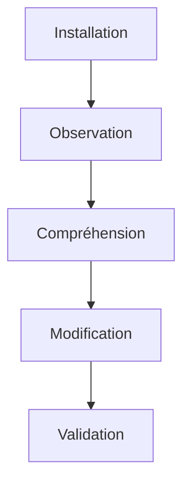
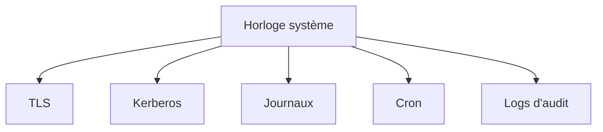
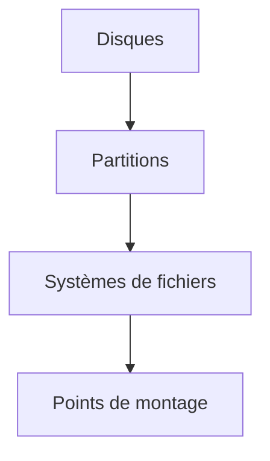
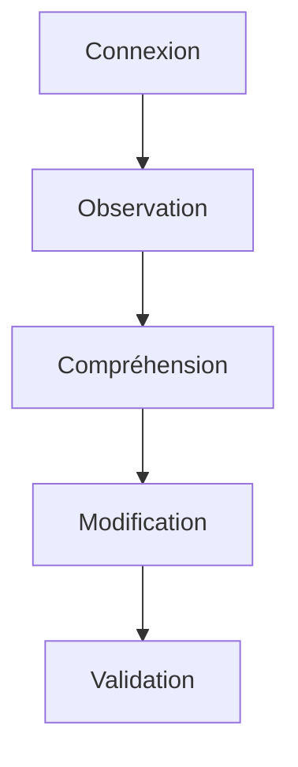
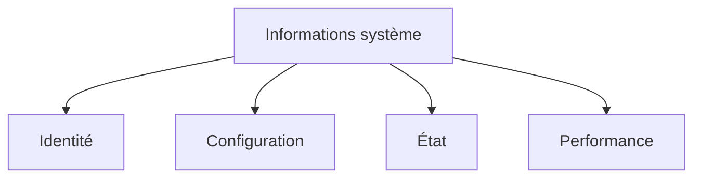
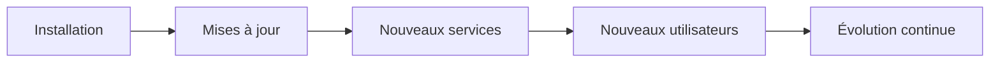
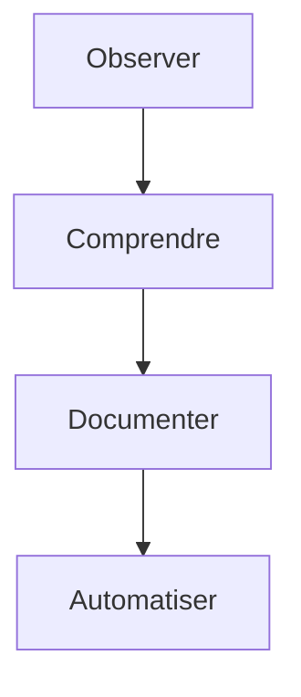

# Campagne 1 — Installation et fondations

# Chapitre 1.4 — Premier démarrage et premières vérifications

> *« Un bon administrateur ne commence jamais par modifier un serveur. Il commence par l'observer. »*

---

# Vous êtes ici

```text
Partie I — Construire un socle sécurisé

Campagne 1 — Installation et fondations

      1.1 Pourquoi sécuriser un socle Linux ?
      1.2 Installation d'AlmaLinux Minimal
      1.3 Comprendre les composants d'un système Linux
    ► 1.4 Premier démarrage et premières vérifications
      1.5 Mise à jour et gestion des dépôts
      1.6 Architecture des systèmes de fichiers
      1.7 Utilisateurs, groupes et permissions
      1.8 sudo et principe du moindre privilège
      1.9 Première mise en sécurité du serveur
      1.10 Création du laboratoire Sentinel
```

---

# Objectifs pédagogiques

À la fin de ce chapitre, vous serez capable de :

- réaliser les premières vérifications après une installation ;
- identifier le système et son environnement ;
- contrôler l'état des principaux composants ;
- collecter les informations nécessaires avant toute intervention ;
- construire une première **photographie** de votre serveur.

---

# Pourquoi ce chapitre existe

L'installation est terminée.

Le système démarre.

Beaucoup de débutants pensent que le travail peut commencer immédiatement.

En réalité,

c'est exactement l'inverse.

Avant de :

- installer un logiciel ;
- modifier une configuration ;
- ouvrir un port réseau ;
- créer un utilisateur ;
- activer un service,

il faut connaître **l'état initial du système**.

Cette première observation constituera la référence de tout le reste de la formation.

---

# Observer avant d'agir

L'approche professionnelle est toujours la même.



Cette méthode permet :

- d'éviter les erreurs ;
- de comprendre les conséquences de chaque action ;
- de revenir facilement en arrière lorsque cela est nécessaire.

---
# Identifier la machine

La première information que doit connaître un administrateur est :

> **Sur quelle machine suis-je connecté ?**

Afficher le nom d'hôte.

```bash
hostname
```

Ou de manière plus complète.

```bash
hostnamectl
```

Exemple.

```text
 Static hostname: sentinel-dev
       Icon name: computer-vm
         Chassis: vm
      Machine ID: ...
         Boot ID: ...
Operating System: AlmaLinux 10
          Kernel: Linux 6.x
    Architecture: x86_64
```

Cette commande fournit immédiatement plusieurs informations importantes :

- le nom de la machine ;
- la distribution ;
- la version du noyau ;
- l'architecture ;
- le type de plateforme.

---

# Identifier le noyau

Le noyau est le composant le plus important du système.

Afficher sa version.

```bash
uname -r
```

Puis.

```bash
uname -a
```

Exemple.

```text
Linux sentinel-dev 6.12.0 x86_64 GNU/Linux
```

Ces informations seront très utiles :

- lors d'une recherche de bug ;
- pour vérifier la compatibilité d'un pilote ;
- pour analyser une vulnérabilité ;
- avant une mise à jour.

---

# Vérifier la date et l'heure

Une horloge incorrecte peut provoquer de nombreux problèmes.

Par exemple.

- certificats TLS invalides ;
- authentification Kerberos impossible ;
- journaux incohérents ;
- tâches planifiées exécutées au mauvais moment.

Afficher la date.

```bash
date
```

Puis.

```bash
timedatectl
```

Visualisons.



Une synchronisation correcte du temps est indispensable.

Nous étudierons `chronyd` dans une campagne ultérieure.

---

# Vérifier le réseau

Identifier les interfaces réseau.

```bash
ip address
```

Ou plus simplement.

```bash
ip -br address
```

Exemple.

```text
lo               UNKNOWN   127.0.0.1/8
ens160           UP        192.168.10.25/24
```

Nous vérifions :

- les interfaces présentes ;
- leur état ;
- leur adresse IP.

---

# Vérifier la connectivité

Afficher la passerelle.

```bash
ip route
```

Puis tester une connexion.

```bash
ping 192.168.10.1
```

Ou.

```bash
ping 8.8.8.8
```

Enfin.

```bash
ping google.com
```

Ces trois tests répondent à trois questions différentes.

| Test | Vérifie |
|-------|----------|
| Passerelle | Réseau local |
| Adresse IP | Accès Internet |
| Nom DNS | Résolution DNS |

Cette distinction est fondamentale lors d'un diagnostic réseau.

---

# Vérifier les systèmes de fichiers

Lister les systèmes montés.

```bash
findmnt
```

Ou.

```bash
df -h
```

Visualisons.



À ce stade,

nous ne cherchons pas encore à comprendre toute l'arborescence.

Nous voulons simplement vérifier que les partitions attendues sont bien montées.

---

# Vérifier la mémoire

Afficher l'utilisation de la mémoire.

```bash
free -h
```

Exemple.

```text
               total   used   free
Mem:            2Gi   410Mi  1.3Gi
Swap:           2Gi      0B   2Gi
```

Cette commande permet de détecter rapidement :

- un manque de mémoire ;
- une consommation anormale ;
- l'utilisation de la Swap.

Nous apprendrons plus tard à analyser ces situations plus en détail.

---

# Vérifier les processus

Afficher les principaux processus.

```bash
ps -ef
```

Ou.

```bash
top
```

L'objectif est simplement de répondre à une question.

> **Qu'est-ce qui tourne actuellement sur mon serveur ?**

Nous apprendrons plus tard à interpréter ces informations.

---

# Première photographie du serveur

À ce stade,

vous devez être capable de répondre aux questions suivantes.

| Question | Commande |
|-----------|----------|
| Quel est le nom du serveur ? | `hostnamectl` |
| Quelle version du noyau est utilisée ? | `uname -r` |
| Quelle est l'heure système ? | `timedatectl` |
| Quelle est l'adresse IP ? | `ip address` |
| Quelle est la route par défaut ? | `ip route` |
| Les partitions sont-elles montées ? | `findmnt` |
| Combien de mémoire est disponible ? | `free -h` |
| Quels processus fonctionnent ? | `ps`, `top` |

Cette photographie constituera votre **baseline technique**.

Avant toute modification importante,

vous devrez toujours être capable de produire ces informations.

---
# 💎 Le point d'expertise

## Observer avant de modifier

L'une des erreurs les plus fréquentes chez les administrateurs débutants est la suivante.

Ils se connectent sur un serveur.

Puis ils commencent immédiatement à modifier :

- des fichiers de configuration ;
- des services ;
- des règles de pare-feu ;
- des permissions.

Un administrateur expérimenté procède toujours dans l'ordre inverse.



Cette méthode possède plusieurs avantages.

- comprendre l'état actuel ;
- détecter une anomalie existante ;
- éviter de créer un nouveau problème ;
- pouvoir revenir facilement en arrière.

Cette philosophie sera utilisée tout au long de cette formation.

---

## Construire une baseline

En cybersécurité,

on parle très souvent de **baseline**.

Une baseline est une photographie de référence du système.

Par exemple.

```text
Nom du serveur

sentinel-dev
```

```text
Version AlmaLinux

10.0
```

```text
Version du noyau

6.12.x
```

```text
SELinux

Enforcing
```

```text
Services actifs

32
```

Quelques semaines plus tard,

on pourra comparer l'état actuel avec cette référence.

Cette comparaison permettra immédiatement de détecter :

- un nouveau service ;
- un nouveau port ;
- un utilisateur ajouté ;
- une modification système.

Les outils professionnels comme OpenSCAP, Wazuh ou Microsoft Defender fonctionnent largement sur ce principe.

---

## Les informations ne se valent pas

Toutes les informations observées sur un serveur n'ont pas la même importance.

On peut les classer.



Par exemple.

### Identité

- hostname
- distribution
- version
- architecture

---

### Configuration

- interfaces réseau
- partitions
- services installés

---

### État

- mémoire utilisée
- charge CPU
- services actifs

---

### Performance

- consommation mémoire
- charge disque
- activité réseau

Un bon administrateur sait distinguer ces catégories.

---

## Une machine est vivante

Un serveur n'est jamais figé.

Au cours de sa vie,

il évolue constamment.



L'objectif de la baseline est justement de suivre cette évolution.

---

# 🧠 Comment pense un architecte ?

Lorsqu'un architecte reçoit un nouveau serveur,

sa première question n'est pas :

> **Comment vais-je installer mon application ?**

Mais plutôt.

> **Dans quel environnement mon application va-t-elle fonctionner ?**

Avant même de parler de Sentinel,

il cherche à connaître :

- le matériel disponible ;
- la mémoire ;
- les interfaces réseau ;
- les services existants ;
- les conventions de nommage ;
- les outils déjà présents.

Cette étape lui permettra ensuite d'intégrer proprement son application.

---

## Comprendre avant d'automatiser

Un débutant lance volontiers un playbook Ansible sur un serveur qu'il ne connaît pas.

Un ingénieur expérimenté procède autrement.



Pourquoi ?

Parce qu'il est impossible d'automatiser correctement quelque chose que l'on ne comprend pas.

Notre objectif est justement de construire progressivement cette compréhension.

---

# ⚔️ Comment pense un attaquant ?

Lorsqu'un attaquant obtient un accès,

il réalise exactement les mêmes vérifications que nous.

Par exemple.

```bash
hostnamectl
uname -a
ip address
ps -ef
ss -tulpen
```

Pourquoi ?

Parce que ces informations lui permettent de répondre à plusieurs questions.

- Où suis-je ?
- Quelle distribution est utilisée ?
- Quels services sont présents ?
- Quels ports sont ouverts ?
- Quels logiciels semblent intéressants à attaquer ?

Autrement dit,

la phase de reconnaissance est commune :

- au défenseur ;
- à l'administrateur ;
- à l'attaquant.

La différence réside uniquement dans l'objectif poursuivi.

---

# 🏢 En entreprise

Dans les grandes infrastructures,

ces vérifications sont rarement réalisées manuellement.

Elles sont généralement automatisées par des outils d'inventaire.

Par exemple.

```text
CMDB

↓

Inventaire matériel

↓

Inventaire logiciel

↓

Configuration

↓

Supervision
```

L'administrateur peut alors connaître immédiatement :

- la version du système ;
- les logiciels installés ;
- les ports ouverts ;
- les utilisateurs ;
- les services actifs.

Notre laboratoire Sentinel évoluera progressivement vers cette approche grâce à :

- Ansible ;
- l'audit Linux ;
- OpenSCAP ;
- notre propre application Sentinel.

---

# 📚 Culture technique

## Pourquoi hostnamectl fournit-il autant d'informations ?

Cette commande interroge plusieurs composants du système.

Elle récupère notamment :

- le nom d'hôte ;
- la distribution ;
- le noyau ;
- l'architecture ;
- le type de virtualisation.

Elle constitue donc un excellent point d'entrée lorsqu'on découvre un nouveau serveur.

C'est souvent l'une des premières commandes exécutées par un administrateur expérimenté.

---

## Pourquoi utiliser ip plutôt que ifconfig ?

Vous trouverez encore de nombreux tutoriels utilisant :

```bash
ifconfig
```

Cette commande appartient au paquet historique :

```text
net-tools
```

Aujourd'hui,

elle est progressivement remplacée par :

```bash
ip
```

issu de :

```text
iproute2
```

`ip` est :

- plus complet ;
- plus cohérent ;
- activement maintenu.

Sur AlmaLinux,

il est recommandé d'utiliser systématiquement :

```bash
ip
```

plutôt que `ifconfig`.

---
# ⚠️ Piège classique

## Modifier avant de comprendre

Un administrateur débutant reçoit un nouveau serveur.

Quelques minutes plus tard,

il a déjà :

- changé le nom d'hôte ;
- modifié le réseau ;
- installé des paquets ;
- ouvert un port ;
- créé plusieurs utilisateurs.

Puis un problème apparaît.

Il devient alors très difficile de déterminer :

- ce qui existait avant ;
- ce qui a été modifié ;
- quelle action est responsable du dysfonctionnement.

Une règle simple permet d'éviter cette situation.

> **Observer → Comprendre → Modifier → Vérifier**

Jamais l'inverse.

---

## Ignorer les messages d'erreur

Linux communique énormément avec son administrateur.

Pourtant,

beaucoup de débutants ignorent les messages affichés.

Exemple.

```text
Permission denied
```

ou

```text
Connection refused
```

ou

```text
No route to host
```

Ces messages constituent souvent la première piste de diagnostic.

Avant d'utiliser Internet,

ou de modifier la configuration,

il faut toujours commencer par les lire attentivement.

---

# Laboratoire AlmaLinux

## Objectif

Construire la première fiche d'identité de votre laboratoire Sentinel.

À la fin de cet exercice,

vous disposerez d'un document décrivant précisément votre serveur.

---

## Étape 1 — Identifier le système

Compléter le tableau suivant.

| Élément | Valeur |
|----------|--------|
| Hostname | |
| Distribution | |
| Version AlmaLinux | |
| Version du noyau | |
| Architecture | |

Toutes ces informations peuvent être obtenues avec :

```bash
hostnamectl
```

---

## Étape 2 — Identifier le matériel visible

Afficher.

```bash
lscpu
```

Puis.

```bash
free -h
```

Enfin.

```bash
lsblk
```

Compléter.

| Élément | Valeur |
|----------|--------|
| Nombre de CPU | |
| Quantité de RAM | |
| Taille du disque | |
| Type de système de fichiers | |

---

## Étape 3 — Identifier le réseau

Compléter.

| Élément | Valeur |
|----------|--------|
| Adresse IP | |
| Interface principale | |
| Passerelle | |
| DNS | |

À l'aide de :

```bash
ip address
```

```bash
ip route
```

```bash
cat /etc/resolv.conf
```

---

## Étape 4 — Identifier les processus importants

Lister.

```bash
ps -ef
```

Repérer notamment.

- systemd
- sshd
- chronyd
- NetworkManager
- firewalld

Ces composants seront étudiés dans les prochaines campagnes.

---

## Étape 5 — Sauvegarder votre baseline

Créer un document Markdown nommé par exemple :

```text
baseline.md
```

Il contiendra toutes les informations collectées.

Ce document deviendra votre référence.

À chaque grande campagne,

vous le mettrez à jour afin de suivre l'évolution du serveur.

Cette pratique est largement utilisée dans les audits professionnels.

---

# Mission d'ingénieur

Votre entreprise vient de livrer dix nouveaux serveurs AlmaLinux destinés à héberger Sentinel.

Votre responsable vous demande de définir une **procédure d'inventaire initial**.

Cette procédure devra permettre à n'importe quel administrateur de répondre rapidement aux questions suivantes.

- Quel est le rôle de cette machine ?
- Quelle version d'AlmaLinux est installée ?
- Quel noyau est utilisé ?
- Combien de mémoire est disponible ?
- Quels sont les disques présents ?
- Quelle est l'adresse IP ?
- Quels services sont déjà actifs ?
- Quels ports sont ouverts ?

Votre objectif est de produire une procédure reproductible,

qui sera utilisée sur tous les futurs serveurs de l'entreprise.

---

# Impact sur Sentinel

Avant même d'installer notre application,

nous avons appris à **caractériser son environnement d'exécution**.

Cette étape est souvent négligée,

alors qu'elle est essentielle.

En effet,

une grande partie des incidents de production provient non pas du logiciel lui-même,

mais de différences entre les environnements :

- version du noyau ;
- configuration réseau ;
- mémoire disponible ;
- services présents ;
- stockage.

En documentant systématiquement ces informations,

nous réduisons considérablement le temps nécessaire au diagnostic.

Cette démarche accompagnera Sentinel tout au long de son cycle de vie.

---

# Ce qu'il faut retenir

- Le premier réflexe d'un administrateur est **d'observer avant de modifier**.
- Une **baseline** décrit l'état de référence d'un serveur.
- Les commandes `hostnamectl`, `uname`, `ip`, `findmnt`, `free` et `ps` permettent d'obtenir rapidement une vue d'ensemble du système.
- Les mêmes informations sont utilisées par les administrateurs, les auditeurs… et les attaquants pendant leur phase de reconnaissance.
- Une bonne documentation du serveur facilite le diagnostic, les audits et l'automatisation.
- Comprendre l'environnement d'exécution est indispensable avant d'installer ou de sécuriser une application.

---

# Grande infographie de révision du chapitre

```text
┌──────────────────────────────────────────────────────────────────────────────────────────────┐
│          CHAPITRE 1.4 — PREMIER DÉMARRAGE ET PREMIÈRES VÉRIFICATIONS                         │
├──────────────────────────────────────────────────────────────────────────────────────────────┤
│                                                                                              │
│                    MÉTHODE DE TRAVAIL D'UN ADMINISTRATEUR                                    │
│                                                                                              │
│ Installation                                                                                 │
│      │                                                                                       │
│      ▼                                                                                       │
│ Observation                                                                                  │
│      │                                                                                       │
│      ▼                                                                                       │
│ Compréhension                                                                                │
│      │                                                                                       │
│      ▼                                                                                       │
│ Modification                                                                                 │
│      │                                                                                       │
│      ▼                                                                                       │
│ Validation                                                                                   │
│                                                                                              │
├──────────────────────────────────────────────────────────────────────────────────────────────┤
│                         PREMIÈRE BASELINE                                                    │
│                                                                                              │
│ ✔ Hostname                                                                                   │
│ ✔ Distribution                                                                               │
│ ✔ Version du noyau                                                                           │
│ ✔ Architecture                                                                               │
│ ✔ CPU                                                                                        │
│ ✔ Mémoire                                                                                    │
│ ✔ Disques                                                                                    │
│ ✔ Réseau                                                                                     │
│ ✔ Services                                                                                   │
│ ✔ Processus                                                                                  │
│                                                                                              │
├──────────────────────────────────────────────────────────────────────────────────────────────┤
│                       COMMANDES À CONNAÎTRE                                                  │
│                                                                                              │
│ hostnamectl      → Identité du système                                                       │
│ uname            → Informations sur le noyau                                                 │
│ ip               → Réseau                                                                    │
│ findmnt          → Systèmes de fichiers                                                      │
│ free             → Mémoire                                                                   │
│ lscpu            → Processeur                                                                │
│ ps / top         → Processus                                                                 │
│ lsblk            → Disques                                                                   │
│                                                                                              │
├──────────────────────────────────────────────────────────────────────────────────────────────┤
│                           OBJECTIF                                                           │
│                                                                                              │
│ Construire une photographie fiable du serveur avant                                          │
│ toute installation ou modification.                                                          │
│                                                                                              │
├──────────────────────────────────────────────────────────────────────────────────────────────┤
│                                IDÉE CLÉ                                                      │
│                                                                                              │
│ « Un bon administrateur ne commence jamais                                                   │
│  par changer un serveur.                                                                     │
│  Il commence par le comprendre. »                                                            │
└──────────────────────────────────────────────────────────────────────────────────────────────┘
```
