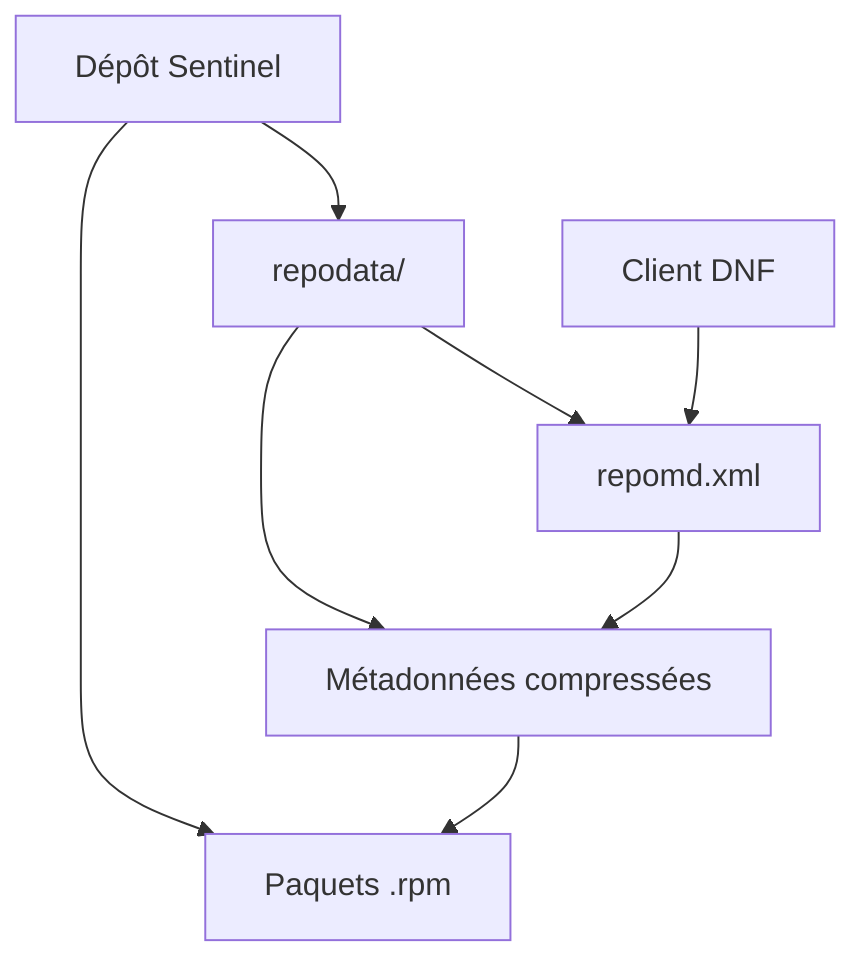
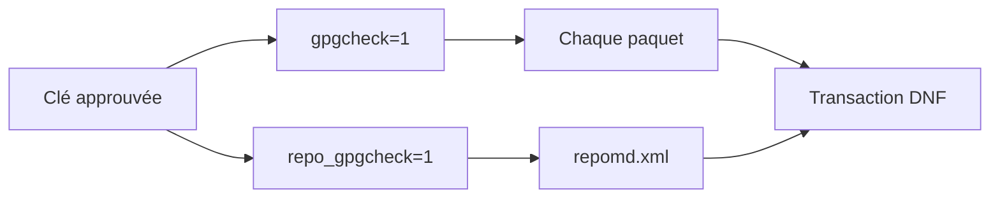
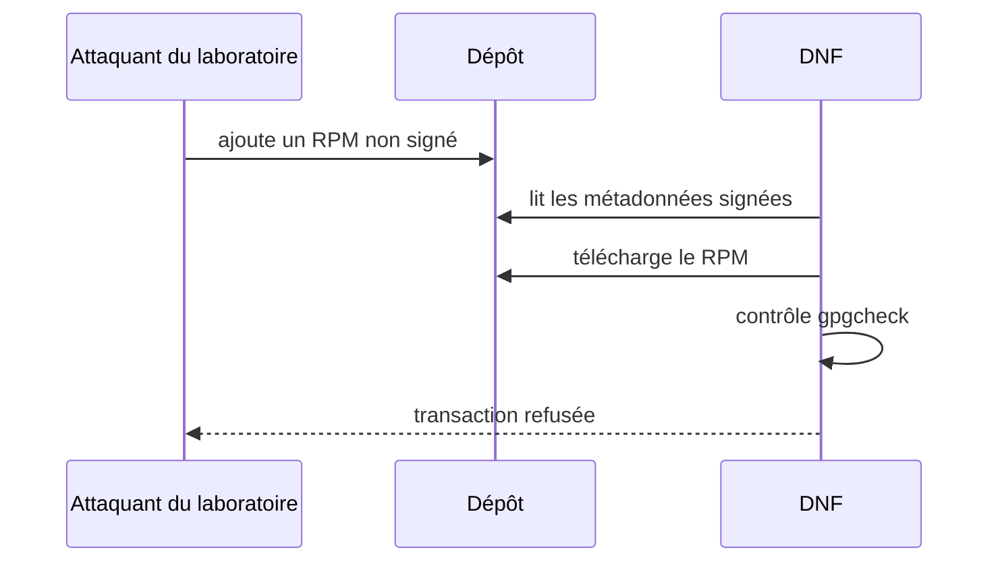
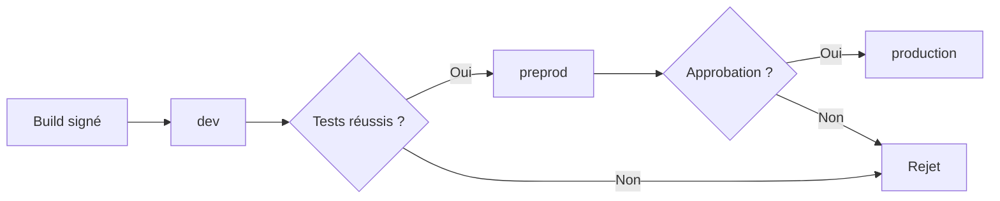

# Chapitre 10.5 — Exploiter un dépôt RPM privé

> **Campagne 10 — RPM et cycle de vie**

> *« Distribuer un paquet, c'est publier une décision de version et une politique de confiance. »*

## Vous êtes ici

```text
PARTIE III — Industrialiser les déploiements

Campagne 10

  10.1 Construire un paquet RPM ✔
  10.2 Gérer les dépendances ✔
  10.3 Gérer les fichiers de configuration ✔
  10.4 Signer les paquets ✔
► 10.5 Exploiter un dépôt RPM privé
  10.6 Packager Sentinel
```

## Objectifs pédagogiques

À l'issue de ce chapitre, vous serez capable de :

- expliquer le rôle des paquets et des métadonnées d'un dépôt RPM ;
- créer et mettre à jour un dépôt avec `createrepo_c` ;
- publier ce dépôt en HTTPS avec des contextes SELinux adaptés ;
- configurer DNF avec `gpgcheck` et `repo_gpgcheck` ;
- tester la publication, la mise à jour et le refus d'un artefact non fiable.

## Pourquoi ce chapitre existe

Installer un fichier local avec `dnf install ./sentinel.rpm` fonctionne pour une machine. Cette méthode ne fournit toutefois ni catalogue de versions, ni résolution centralisée, ni politique de publication, ni mécanisme propre de mise à jour d'un parc.

Un dépôt privé transforme les RPM signés en canal de distribution consommable par DNF et par Ansible.

## Anatomie d'un dépôt RPM



`createrepo_c` lit les RPM et génère les métadonnées nécessaires à DNF. Le client ne parcourt pas naïvement tous les fichiers ; il consulte le catalogue décrit par `repomd.xml`.

Une arborescence d'entreprise peut séparer les générations et architectures :

```text
/srv/repo/
├── RPM-GPG-KEY-SENTINEL
└── sentinel/
    └── 9/
        ├── x86_64/
        │   ├── sentinel-1.0.0-1.el9.noarch.rpm
        │   └── repodata/
        └── aarch64/
            └── repodata/
```

Un paquet `noarch` peut techniquement être commun, mais dupliquer ou agréger les dépôts par architecture simplifie l'usage de `$basearch` lorsque des paquets natifs apparaissent plus tard.

## Deux signatures complémentaires



| Option | Objet vérifié | Risque réduit |
|---|---|---|
| `gpgcheck=1` | signature de chaque RPM | installation d'un paquet non approuvé |
| `repo_gpgcheck=1` | signature des métadonnées du dépôt | substitution du catalogue ou de la version proposée |
| `sslverify=1` | certificat du serveur HTTPS | interception et substitution du transport |

Ces contrôles sont cumulatifs. HTTPS ne remplace pas la signature GPG, et la signature d'un RPM ne protège pas à elle seule la sélection de version décrite par les métadonnées.

> **Piège classique** — Résoudre un problème de clé par `gpgcheck=0` transforme une alerte de sécurité en installation silencieuse. Corrigez la distribution de la clé ou la signature.

## TP 1 — Créer le dépôt

Sur la VM qui jouera le rôle de serveur de dépôt :

```bash
sudo dnf install createrepo_c nginx policycoreutils-python-utils
sudo install -d -m 0755 /srv/repo/sentinel/9/x86_64
```

Copiez le RPM signé et la clé publique créée au chapitre précédent :

```bash
sudo install -m 0644 ~/rpmbuild/RPMS/noarch/sentinel-banner-*.rpm \
  /srv/repo/sentinel/9/x86_64/
sudo install -m 0644 ~/RPM-GPG-KEY-SENTINEL \
  /srv/repo/RPM-GPG-KEY-SENTINEL
```

Vérifiez les signatures **avant** de publier :

```bash
find /srv/repo/sentinel/9/x86_64 -name '*.rpm' -print0 |
  xargs -0 -n1 rpm -Kv
```

Générez les métadonnées :

```bash
sudo createrepo_c /srv/repo/sentinel/9/x86_64
find /srv/repo/sentinel/9/x86_64/repodata -maxdepth 1 -type f -print
```

À chaque ajout ou retrait de RPM :

```bash
sudo createrepo_c --update /srv/repo/sentinel/9/x86_64
```

`--update` réutilise les métadonnées des paquets inchangés. Il ne dispense pas des contrôles de signature et de cohérence avant publication.

## Signer les métadonnées

Le fichier de référence est `repodata/repomd.xml`. Signez-le avec la clé de publication du laboratoire :

```bash
cd /srv/repo/sentinel/9/x86_64
sudo -u "$USER" gpg --armor --detach-sign --yes \
  --output /tmp/repomd.xml.asc repodata/repomd.xml
sudo install -m 0644 /tmp/repomd.xml.asc repodata/repomd.xml.asc
rm /tmp/repomd.xml.asc
```

Vérifiez la signature :

```bash
gpg --verify repodata/repomd.xml.asc repodata/repomd.xml
```

La signature doit être régénérée après chaque exécution de `createrepo_c`, puisque `repomd.xml` change.

## Publier en HTTPS

La campagne TLS a déjà fourni une PKI de laboratoire. Réutilisez un certificat dont le nom correspond à `repo.sentinel.lab`.

Créez `/etc/nginx/conf.d/sentinel-repo.conf` :

```nginx
server {
    listen 443 ssl;
    server_name repo.sentinel.lab;

    ssl_certificate     /etc/pki/tls/certs/repo.sentinel.lab.crt;
    ssl_certificate_key /etc/pki/tls/private/repo.sentinel.lab.key;

    root /srv/repo;
    autoindex off;

    location / {
        limit_except GET HEAD { deny all; }
        try_files $uri =404;
    }
}
```

Appliquez les contextes SELinux :

```bash
sudo semanage fcontext -a -t httpd_sys_content_t '/srv/repo(/.*)?'
sudo restorecon -RFv /srv/repo
ls -Zd /srv/repo /srv/repo/sentinel
```

Validez et démarrez le service :

```bash
sudo nginx -t
sudo systemctl enable --now nginx
sudo firewall-cmd --permanent --add-service=https
sudo firewall-cmd --reload
```

Depuis une VM cliente qui fait confiance à l'autorité du laboratoire :

```bash
curl --fail --show-error --silent \
  https://repo.sentinel.lab/sentinel/9/x86_64/repodata/repomd.xml |
  head
```

N'utilisez pas `curl -k` comme solution durable : il désactive précisément la validation TLS recherchée.

## TP 2 — Configurer le client DNF

Créez `/etc/yum.repos.d/sentinel.repo` :

```ini
[sentinel]
name=Sentinel private RPM repository
baseurl=https://repo.sentinel.lab/sentinel/9/$basearch/
enabled=1
gpgcheck=1
repo_gpgcheck=1
gpgkey=https://repo.sentinel.lab/RPM-GPG-KEY-SENTINEL
sslverify=1
metadata_expire=5m
```

Rafraîchissez uniquement ce dépôt :

```bash
sudo dnf clean metadata
sudo dnf --disablerepo='*' --enablerepo=sentinel makecache
dnf repoinfo sentinel
dnf repository-packages sentinel list
```

Installez sans chemin local :

```bash
sudo dnf install sentinel-banner
dnf info --installed sentinel-banner
```

Le nom de dépôt affiché par DNF doit être `sentinel`. Cette provenance fait partie des preuves d'exploitation.

## TP 3 — Publier une mise à jour

Construisez et signez un release supérieur, puis copiez-le dans un répertoire de préparation qui n'est pas servi par Nginx :

```bash
install -d -m 0755 ~/repo-staging/sentinel/9/x86_64
cp ~/rpmbuild/RPMS/noarch/sentinel-banner-*.rpm \
  ~/repo-staging/sentinel/9/x86_64/
```

Effectuez les contrôles avant la publication :

```bash
find ~/repo-staging -name '*.rpm' -print0 | xargs -0 -n1 rpm -Kv
createrepo_c ~/repo-staging/sentinel/9/x86_64
```

Après validation, publiez les nouveaux RPM, recréez les métadonnées, signez `repomd.xml`, puis testez depuis le client :

```bash
sudo dnf clean metadata
sudo dnf check-update sentinel-banner || test $? -eq 100
sudo dnf upgrade sentinel-banner
dnf history info last
```

Dans une plateforme d'entreprise, remplacez les copies successives par une publication atomique : génération complète dans une zone de staging, validation, puis bascule d'un répertoire ou d'un objet versionné. Un client ne doit jamais observer un catalogue qui référence un RPM encore absent.

## Prouver le refus d'un paquet non fiable

Sur la VM de build, fabriquez une nouvelle version mais ne la signez pas. Placez-la uniquement dans une copie de laboratoire du dépôt, régénérez et signez les métadonnées.

DNF doit encore refuser le paquet lui-même à cause de `gpgcheck=1`. Cette expérience démontre que des métadonnées valides ne rendent pas automatiquement chaque charge utile valide.



Restaurez ensuite le dépôt à partir des artefacts approuvés. N'affaiblissez aucune option du client pour terminer le test.

## Exploiter le dépôt dans la durée

Un dépôt privé est un service de production. Son exploitation couvre :

- la sauvegarde des RPM publiés et de leurs SRPM ;
- la conservation des anciennes versions nécessaires au retour arrière ;
- les journaux d'accès et de publication ;
- la supervision du certificat TLS et de la signature GPG ;
- le contrôle de l'espace disque ;
- la séparation développement, préproduction et production ;
- la révocation ou rotation des clés ;
- la restriction des droits d'écriture.

Les clients n'ont besoin que d'un accès en lecture. Le compte Nginx et le réseau de consultation ne doivent jamais donner un droit de publication.

> **Regard entreprise** — La disponibilité du dépôt conditionne les correctifs de sécurité du parc. Un dépôt privé sans sauvegarde, supervision ou procédure de restauration devient un point unique de défaillance.

## Mission d'ingénieur — Définir la promotion des versions

Concevez trois canaux :



Pour chaque promotion, documentez :

1. l'artefact exact promu ;
2. les tests attendus ;
3. l'identité de l'approbateur ;
4. le mécanisme de publication atomique ;
5. la méthode de retour à la version précédente ;
6. la preuve conservée dans les journaux.

Le même RPM doit être promu. Reconstruire entre préproduction et production créerait un nouvel artefact non testé.

## Impact sur Sentinel

Sentinel devient installable par son nom depuis un canal privé :

```bash
sudo dnf install sentinel
sudo dnf upgrade sentinel
```

Ansible n'aura plus à copier le code applicatif. Il pourra configurer le dépôt, installer une version déclarée et gérer la configuration du site. RPM et DNF conserveront l'historique des transactions sur chaque hôte.

## Synthèse

- `createrepo_c` construit les métadonnées consommées par DNF.
- `gpgcheck` protège les paquets ; `repo_gpgcheck` protège le catalogue.
- HTTPS protège le transport et l'identité du serveur, sans remplacer GPG.
- SELinux doit autoriser explicitement Nginx à lire l'arborescence publiée.
- Une publication complète est préparée et validée avant d'être rendue visible.
- Le même RPM signé doit être promu entre les environnements.

## Infographie de révision

```text
BUILD              PUBLICATION                    CLIENT
  │                     │                            │
  ├─ tests              ├─ RPM signés                ├─ TLS valide
  ├─ signature          ├─ createrepo_c              ├─ repo_gpgcheck=1
  └─ staging            ├─ repomd.xml signé          ├─ gpgcheck=1
                        └─ HTTPS + SELinux            └─ transaction DNF

              dev ──► preprod ──► production
                    même artefact, preuves conservées

INTERDIT : publier à moitié ou désactiver les contrôles pour « tester ».
```

## Pour aller plus loin

Le projet officiel [`createrepo_c`](https://github.com/rpm-software-management/createrepo_c) documente l'outil de génération de métadonnées. La [référence DNF](https://dnf.readthedocs.io/en/latest/command_ref.html) détaille les requêtes, dépôts et transactions côté client.

Chapitre suivant : assembler toutes les briques pour livrer Sentinel comme un véritable composant AlmaLinux.

← [10.4 — Signer les paquets](10.4-signer-paquets-rpm.md) · [10.6 — Packager Sentinel](10.6-packager-sentinel.md) →
