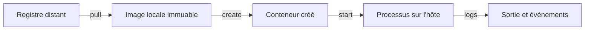
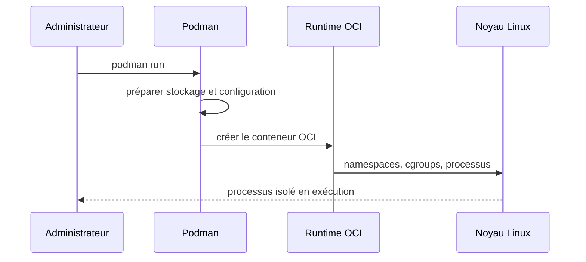
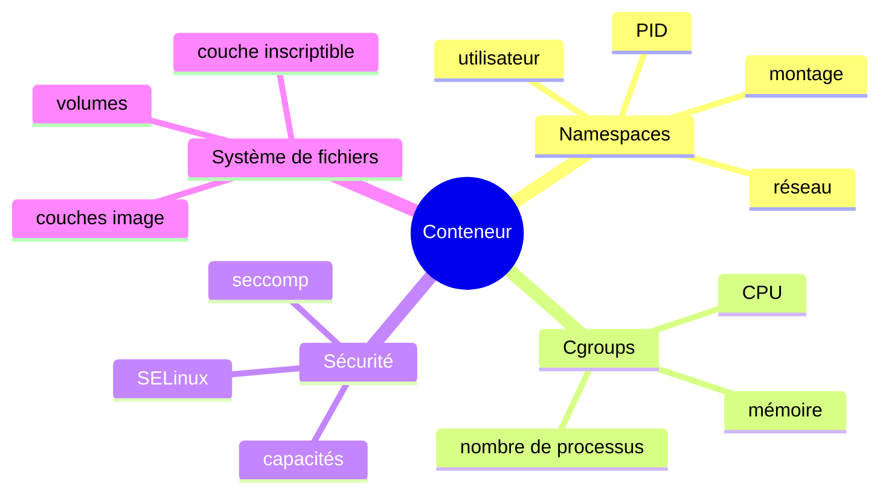
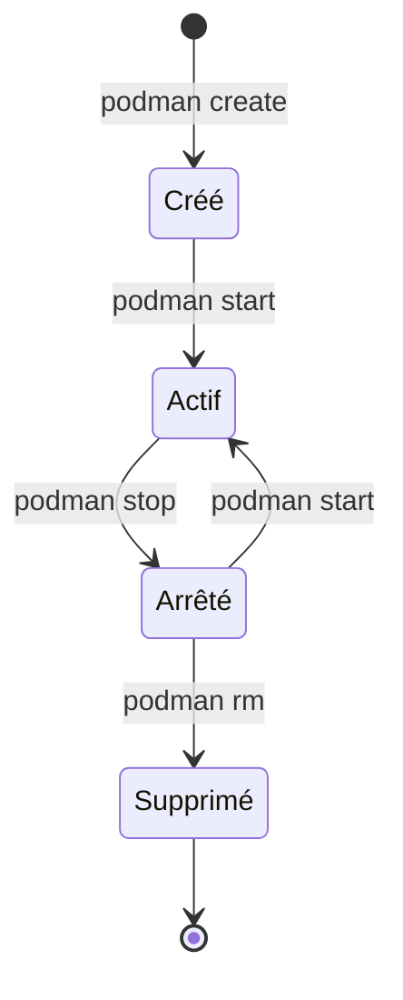

# Chapitre 11.1 — Découvrir Podman

> **Campagne 11 — Conteneurisation**

> *« Un conteneur n'est pas une petite machine virtuelle : c'est un processus isolé qui reste un processus de l'hôte. »*

## Vous êtes ici

```text
PARTIE III — Industrialiser les déploiements

Campagne 11

► 11.1 Découvrir Podman
  11.2 Exécuter des conteneurs rootless
  11.3 Construire des images sécurisées
  11.4 Concevoir les réseaux de conteneurs
  11.5 Gérer les secrets
  11.6 Exécuter Sentinel en sécurité
```

## Objectifs pédagogiques

À l'issue de ce chapitre, vous serez capable de :

- distinguer image, conteneur, registre et stockage local ;
- expliquer le rôle des namespaces, des cgroups et du runtime OCI ;
- installer Podman sur AlmaLinux et inventorier sa configuration ;
- exercer le cycle de vie d'un premier conteneur ;
- inspecter un conteneur sans le confondre avec une machine virtuelle.

## Pourquoi ce chapitre existe

Le RPM de Sentinel fournit désormais un cycle de vie natif à AlmaLinux. La conteneurisation apporte une autre frontière de livraison : l'application et ses dépendances d'exécution sont regroupées dans une image, puis lancées comme processus isolé.

Cette isolation ne supprime ni le noyau partagé, ni les permissions, ni SELinux, ni la responsabilité de mettre les composants à jour. Avant de durcir Sentinel, il faut comprendre ce que Podman crée réellement.

## Quatre objets à distinguer



| Objet | Rôle | Persistance |
| --- | --- | --- |
| registre | distribuer des images et manifestes | distante |
| image | modèle en couches, identifié par tag ou digest | stockage local |
| conteneur | instance configurée d'une image | jusqu'à sa suppression |
| processus | exécution vivante du conteneur | jusqu'à son arrêt |

Une image ne « tourne » pas. Un conteneur arrêté conserve sa configuration et sa couche inscriptible, mais aucun processus applicatif ne s'exécute.

## Podman sans démon central

Podman lance les conteneurs depuis le processus de l'utilisateur. Il n'exige pas un démon privilégié unique qui possède toutes les charges du serveur.



Le runtime bas niveau, souvent `crun`, dialogue avec le noyau. Podman orchestre l'image, le stockage, le réseau et la configuration du conteneur.

> **Point d'expertise** — « Sans démon » ne signifie pas « sans service ». Podman peut exposer une API ou confier un conteneur à systemd. Cela signifie que le fonctionnement normal n'est pas construit autour d'un démon central permanent.

## Les mécanismes du noyau

Un conteneur repose sur des mécanismes Linux déjà rencontrés dans la formation.



- les **namespaces** donnent une vue isolée de certaines ressources ;
- les **cgroups** mesurent et limitent les ressources ;
- les **capacités** découpent les privilèges de `root` ;
- **seccomp** filtre des appels système ;
- **SELinux** impose une politique entre le processus et les objets de l'hôte.

Le noyau reste partagé. Une vulnérabilité applicative peut être contenue, mais une mauvaise configuration privilégiée ou une faille du noyau peut franchir la frontière.

## Conteneur et machine virtuelle

| Question | Conteneur | Machine virtuelle |
| --- | --- | --- |
| noyau | partagé avec l'hôte | propre au système invité |
| démarrage | lancement de processus | démarrage d'un OS |
| image | couches applicatives | disque système complet |
| isolation | namespaces, cgroups, LSM | hyperviseur et matériel virtuel |
| administration | processus et artefact | système d'exploitation complet |

> **Piège classique** — Installer SSH, systemd et plusieurs démons dans chaque conteneur recrée une mauvaise machine virtuelle. Un conteneur applicatif doit avoir une responsabilité claire et un processus principal observable.

## Préparer AlmaLinux

Installez les outils :

```bash
sudo dnf install podman skopeo buildah
```

Inventoriez les versions et le contexte :

```bash
podman version
podman info
podman info --format '{{.Host.OCIRuntime.Name}}'
podman info --format '{{.Host.Security.Rootless}}'
```

Ne recopiez pas une option depuis une version plus récente sans la vérifier :

```bash
podman run --help
man podman-run
```

La documentation installée avec AlmaLinux est la référence de compatibilité de votre hôte.

## Nom complet, tag et digest

Utilisez une référence complète :

```text
registry.access.redhat.com/ubi9/ubi-minimal:latest
└────────── registre ──────────┘ └ dépôt ─┘ └ tag ┘
```

Un tag est un pointeur lisible qui peut évoluer. Un digest identifie un manifeste par son contenu.

```bash
skopeo inspect \
  docker://registry.access.redhat.com/ubi9/ubi-minimal:latest |
  sed -n '1,30p'
```

Le chapitre 11.3 figera l'image de base par digest et ajoutera une politique de confiance. Pour ce premier laboratoire, le tag sert à découvrir le cycle de vie.

## TP 1 — Tirer et inspecter une image

```bash
IMAGE=registry.access.redhat.com/ubi9/ubi-minimal:latest
podman pull "$IMAGE"
podman images
podman image inspect "$IMAGE"
podman history "$IMAGE"
```

Relevez :

- l'identifiant local ;
- le digest du dépôt ;
- l'architecture ;
- la date de création ;
- la commande par défaut ;
- la taille des couches.

Ne déduisez pas la sécurité du nom `minimal`. Inspectez ce qui sera réellement exécuté.

## TP 2 — Exercer le cycle de vie

Lancez un conteneur éphémère :

```bash
podman run --rm --name ubi-release "$IMAGE" cat /etc/os-release
```

Créez ensuite un conteneur persistant mais arrêté :

```bash
podman create --name ubi-lab "$IMAGE" sleep 300
podman ps --all
podman start ubi-lab
podman ps
podman top ubi-lab pid user args
podman stop --time 5 ubi-lab
podman rm ubi-lab
```

Observez à chaque étape la différence entre **créé**, **en cours d'exécution**, **arrêté** et **supprimé**.



## TP 3 — Observer depuis l'hôte

```bash
podman run -d --name observer "$IMAGE" sleep 600
PID=$(podman inspect --format '{{.State.Pid}}' observer)
printf 'PID hôte : %s\n' "$PID"
ps -o pid,ppid,user,cmd -p "$PID"
sudo lsns -p "$PID"
podman stats --no-stream observer
podman logs observer
podman rm --force observer
```

Le processus est visible depuis l'hôte. Dans le namespace PID du conteneur, sa numérotation et sa vue des autres processus diffèrent.

> **Regard attaquant** — Une commande `--privileged`, un montage de `/` ou l'accès à une socket d'administration peuvent annuler une grande partie de l'isolation. La présence d'un conteneur n'est pas une preuve de confinement.

## Les données ne vivent pas dans l'image

La couche inscriptible d'un conteneur disparaît avec lui. Les données durables doivent être placées dans un volume ou un bind mount explicitement gouverné.

```bash
podman volume create sentinel-lab-data
podman volume inspect sentinel-lab-data
```

La campagne distinguera :

- l'image, reconstruite et remplacée ;
- la configuration, injectée à l'exécution ;
- les secrets, fournis par un mécanisme dédié ;
- l'état durable, monté dans un volume ;
- les journaux, envoyés vers l'hôte.

## Mission d'ingénieur — Qualifier une commande `podman run`

Analysez cette proposition sans l'exécuter :

```bash
sudo podman run --privileged --network host \
  -v /:/host registry.example.invalid/sentinel:latest
```

Produisez une revue indiquant :

1. l'identité qui lancerait le conteneur ;
2. les frontières supprimées par `--privileged` ;
3. l'impact de `--network host` ;
4. le risque du montage de la racine ;
5. le problème du registre fictif et du tag mutable ;
6. une stratégie de remplacement fondée sur le moindre privilège.

La bonne réponse n'est pas une commande plus longue : c'est une liste de besoins réels, puis l'ajout minimal des droits nécessaires.

## Impact sur Sentinel

Sentinel dispose désormais d'un second modèle de livraison :

- le RPM intègre l'application au système AlmaLinux ;
- l'image regroupe l'application et son environnement d'exécution ;
- le conteneur instancie cette image avec une identité, un réseau et des montages ;
- le processus reste soumis au noyau, à SELinux et aux limites de l'hôte.

Le chapitre suivant supprimera le privilège `root` de l'opérateur Podman et montrera comment les identités sont traduites.

## Synthèse

- Une image est un modèle ; un conteneur est une instance ; un processus est l'exécution.
- Podman orchestre des conteneurs OCI sans démon central obligatoire.
- Namespaces, cgroups, capacités, seccomp et SELinux forment des couches complémentaires.
- Un conteneur partage le noyau de l'hôte et n'est pas une machine virtuelle.
- Les références complètes évitent les ambiguïtés de registre.
- Les données durables et la configuration doivent être séparées de l'image.

## Infographie de révision

```text
REGISTRE ──pull──► IMAGE ──create──► CONTENEUR ──start──► PROCESSUS
                    │                    │                    │
                  couches           configuration         noyau hôte
                  digest             montages             namespaces
                                      réseau              cgroups
                                      secrets             SELinux

IMAGE       : modèle remplaçable
CONTENEUR   : instance configurée
PROCESSUS   : charge réellement exécutée
VOLUME      : donnée durable hors de l'image

RÈGLE : conteneurisé ne signifie ni privilégié ni automatiquement sûr.
```

## Pour aller plus loin

La [documentation Podman](https://docs.podman.io/en/stable/) décrit chaque commande et la documentation Red Hat présente le [cycle de vie des conteneurs sous RHEL 9](https://docs.redhat.com/en/documentation/red_hat_enterprise_linux/9/html/building_running_and_managing_containers/assembly_starting-with-containers_building-running-and-managing-containers).

Chapitre suivant : exécuter Podman avec une identité non privilégiée et comprendre les user namespaces.

← [10.6 — Packager Sentinel](../campagne%2010/10.6-packager-sentinel.md) · [11.2 — Exécuter des conteneurs rootless](11.2-conteneurs-rootless.md) →
