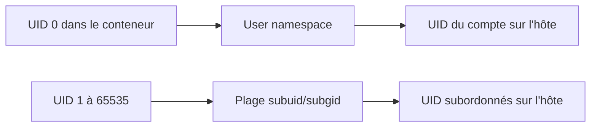
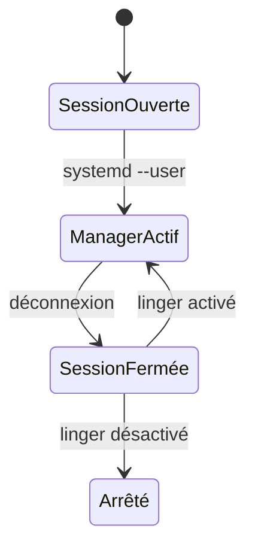
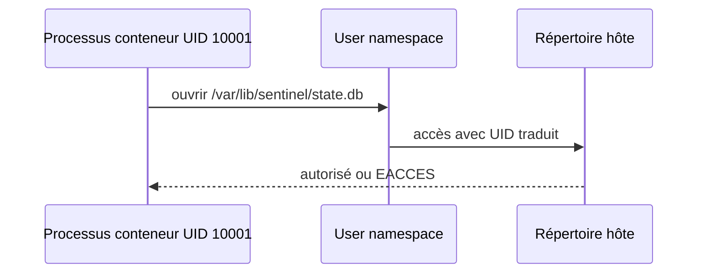

# Chapitre 11.2 — Exécuter des conteneurs rootless

> **Campagne 11 — Conteneurisation**

> *« Le meilleur privilège à retirer est celui dont l'application n'avait jamais besoin. »*

## Vous êtes ici

```text
PARTIE III — Industrialiser les déploiements

Campagne 11

  11.1 Découvrir Podman ✔
► 11.2 Exécuter des conteneurs rootless
  11.3 Construire des images sécurisées
  11.4 Concevoir les réseaux de conteneurs
  11.5 Gérer les secrets
  11.6 Exécuter Sentinel en sécurité
```

## Objectifs pédagogiques

À l'issue de ce chapitre, vous serez capable de :

- expliquer la traduction d'identités d'un user namespace ;
- préparer un compte dédié à Podman rootless sur AlmaLinux ;
- localiser le stockage et le runtime propres à l'utilisateur ;
- diagnostiquer les permissions des volumes rootless ;
- choisir des ports et montages compatibles avec le moindre privilège.

## Pourquoi ce chapitre existe

Lancer Podman avec `sudo` donne au moteur et aux conteneurs des possibilités dont Sentinel n'a pas besoin. Un conteneur rootless est créé par un utilisateur ordinaire. Même si un processus se voit comme `root` dans son namespace, il reste traduit vers une identité non privilégiée sur l'hôte.

Rootless réduit l'impact d'une compromission. Il ne rend pas le code digne de confiance et ne remplace ni SELinux ni la limitation des capacités.

## La racine vue depuis deux mondes



Le noyau maintient une table de traduction. La commande suivante l'affiche :

```bash
podman unshare cat /proc/self/uid_map
podman unshare cat /proc/self/gid_map
```

Une sortie typique contient l'UID réel du compte et une plage subordonnée. Les valeurs exactes dépendent de l'hôte.

> **Point d'expertise** — `root` dans un user namespace n'est pas `root` dans le namespace initial de l'hôte. Mais un montage dangereux, une faille du noyau ou une configuration qui désactive l'isolation restent des risques.

## Préparer un compte de service

Créez un compte distinct du compte d'administration :

```bash
sudo useradd --create-home --shell /bin/bash sentinel-container
sudo passwd sentinel-container
```

Vérifiez les plages subordonnées :

```bash
grep '^sentinel-container:' /etc/subuid /etc/subgid
```

Sur AlmaLinux, `useradd` configure généralement ces plages. Si elles sont absentes, l'administrateur doit allouer des plages non chevauchantes, puis appliquer la migration Podman documentée par la version installée.

Connectez-vous par une vraie session :

```bash
ssh sentinel-container@almalinux.sentinel.lab
```

Évitez `su` comme méthode principale de test. Une session incomplète peut manquer `XDG_RUNTIME_DIR` et le gestionnaire systemd utilisateur.

## Inventorier l'environnement rootless

```bash
id
printf 'runtime=%s\n' "$XDG_RUNTIME_DIR"
podman info --format '{{.Host.Security.Rootless}}'
podman info --format '{{.Store.GraphRoot}}'
podman info --format '{{.Store.RunRoot}}'
```

Les données se trouvent normalement dans l'espace de l'utilisateur.

| Élément | Emplacement habituel | Durée |
| --- | --- | --- |
| images et couches | `~/.local/share/containers/storage` | persistante |
| configuration | `~/.config/containers/` | persistante |
| runtime | `$XDG_RUNTIME_DIR/containers` | session ou démarrage utilisateur |
| unités Quadlet | `~/.config/containers/systemd/` | persistante |

Chaque utilisateur possède son propre catalogue d'images et de conteneurs. Une image tirée par `root` n'apparaît pas automatiquement dans le stockage rootless.

## Rootless et cycle de vie systemd

Pour qu'un service utilisateur survive à la déconnexion et démarre au boot :

```bash
sudo loginctl enable-linger sentinel-container
loginctl show-user sentinel-container -p Linger
```

Cette décision doit être explicite. Le linger autorise le gestionnaire systemd utilisateur à rester actif sans session interactive.



## Ports non privilégiés

Un utilisateur ordinaire ne doit pas s'approprier arbitrairement les ports système. Sentinel utilisera le port 8443 dans le laboratoire :

```bash
podman run --rm -p 127.0.0.1:8443:8080 IMAGE
```

Ne modifiez pas globalement `net.ipv4.ip_unprivileged_port_start` pour éviter de réfléchir à l'architecture. Pour exposer le port 443, préférez un reverse proxy système durci ou une règle d'acheminement précisément documentée.

> **Regard architecte** — Le port visible par le client n'a pas besoin d'être le port écouté par le processus. La terminaison TLS, le filtrage réseau et le conteneur peuvent rester trois responsabilités séparées.

## Réseau rootless selon la version

Les versions de Podman utilisent notamment `pasta` ou `slirp4netns` pour fournir le réseau rootless. Ne supposez pas le backend.

```bash
podman info --debug
podman network ls
podman run --rm IMAGE cat /proc/net/route
```

Consultez `man podman-run` et `man containers.conf` sur la VM. Le choix influence les performances, les adresses visibles et certaines possibilités de publication de ports.

## Les volumes et la traduction des UID

Un bind mount expose un chemin de l'hôte. Les permissions sont évaluées avec les identités traduites.



Pour inspecter les identités depuis le namespace :

```bash
mkdir -p ~/.local/share/sentinel-data
podman unshare ls -ldn ~/.local/share/sentinel-data
```

Si l'image exécute Sentinel avec l'UID 10001, attribuez le répertoire dans le namespace de l'utilisateur :

```bash
podman unshare chown 10001:10001 ~/.local/share/sentinel-data
```

Sur l'hôte, le propriétaire numérique peut sembler inhabituel. Ne le remplacez pas au hasard : il correspond à la traduction subuid.

### SELinux sur les bind mounts

Ajoutez un suffixe de relabellisation adapté :

```bash
podman run --rm \
  -v ~/.local/share/sentinel-data:/var/lib/sentinel:Z IMAGE
```

- `:Z` crée un label privé pour un conteneur ;
- `:z` permet un partage entre plusieurs conteneurs.

Le partage doit être un besoin explicite. Un mauvais label provoque souvent un refus AVC malgré des permissions Unix apparemment correctes.

## TP 1 — Prouver la traduction d'identité

Avec le compte `sentinel-container` :

```bash
IMAGE=registry.access.redhat.com/ubi9/ubi-minimal:latest
podman run --rm "$IMAGE" id
id
podman unshare cat /proc/self/uid_map
```

Comparez l'UID affiché dans le conteneur et celui du compte sur l'hôte. Puis lancez :

```bash
podman run --rm --user 10001:10001 "$IMAGE" id
```

Expliquez les trois identités : UID applicatif dans l'image, UID traduit dans le user namespace et compte propriétaire de Podman.

## TP 2 — Corriger un volume sans ouvrir les permissions

```bash
mkdir -p ~/.local/share/sentinel-lab
chmod 0700 ~/.local/share/sentinel-lab

podman run --rm --user 10001:10001 \
  -v ~/.local/share/sentinel-lab:/data:Z \
  "$IMAGE" sh -c 'echo test > /data/probe'
```

La commande peut échouer selon le propriétaire traduit. Corrigez-la :

```bash
podman unshare chown 10001:10001 ~/.local/share/sentinel-lab
podman run --rm --user 10001:10001 \
  -v ~/.local/share/sentinel-lab:/data:Z \
  "$IMAGE" sh -c 'echo test > /data/probe'
podman unshare ls -ln ~/.local/share/sentinel-lab
```

N'utilisez pas `chmod 0777`. La correction porte sur l'identité et le label, pas sur la suppression de toutes les protections.

## TP 3 — Vérifier la portée du port

Lancez un service de test fourni par votre image Sentinel ou une image de laboratoire approuvée :

```bash
podman run -d --name rootless-web \
  -p 127.0.0.1:8443:8443 IMAGE_SENTINEL
ss -lnt | grep ':8443'
```

Depuis AlmaLinux :

```bash
curl --fail http://127.0.0.1:8443/health
```

Depuis Kali, l'adresse AlmaLinux ne doit pas répondre sur 8443 puisque la publication est liée à la boucle locale. Supprimez ensuite le conteneur :

```bash
podman rm --force rootless-web
```

## Mission d'ingénieur — Choisir l'identité de Sentinel

Comparez trois modèles :

| Modèle | Avantage | Risque principal |
| --- | --- | --- |
| Podman exécuté par `root` | accès aux fonctions système | impact maximal d'une compromission |
| compte humain rootless | démarrage rapide | mélange exploitation et identité personnelle |
| compte dédié rootless | séparation et traçabilité | cycle de session à organiser |

Retenez un compte dédié, documentez ses subuids, son stockage, son linger, ses chemins de données et les administrateurs autorisés à agir en son nom.

## Impact sur Sentinel

Sentinel sera exploité par `sentinel-container`, un compte distinct du compte applicatif interne à l'image.

```text
hôte                 user namespace             conteneur
sentinel-container ─► traduction des UID ──────► UID 10001
```

Cette défense en profondeur limite les droits à trois niveaux : utilisateur hôte non privilégié, user namespace rootless et processus applicatif non-root dans l'image.

## Synthèse

- Rootless exécute Podman sous une identité ordinaire.
- Les fichiers `/etc/subuid` et `/etc/subgid` fournissent les plages de traduction.
- Le stockage et le runtime sont propres à chaque utilisateur.
- Le linger permet à systemd utilisateur de fonctionner sans session interactive.
- Les permissions de volume doivent être corrigées dans le user namespace.
- `:Z` et `:z` traitent les labels SELinux selon le besoin de partage.
- Un port lié à `127.0.0.1` n'est pas exposé au réseau de Kali.

## Infographie de révision

```text
HÔTE                          USER NAMESPACE                 CONTENEUR

sentinel-container ─────────► tables UID/GID ─────────────► UID 10001
      │                            │                              │
      ├─ stockage utilisateur      ├─ subuid/subgid              ├─ sans root
      ├─ systemd --user            ├─ traduction                 ├─ capacités réduites
      └─ port 8443                 └─ podman unshare             └─ volume /var/lib

VOLUME : propriétaire traduit + permissions minimales + label SELinux :Z
SERVICE : linger explicite, pas de dépendance à une session SSH

ROOTLESS réduit l'impact ; il ne remplace pas seccomp, SELinux ou la confiance.
```

## Pour aller plus loin

La documentation Red Hat décrit la [préparation des utilisateurs rootless](https://docs.redhat.com/en/documentation/red_hat_enterprise_linux/9/html/building_running_and_managing_containers/assembly_starting-with-containers_building-running-and-managing-containers). La [documentation réseau Podman](https://docs.podman.io/en/stable/markdown/podman-network.1.html) précise les backends disponibles selon la version.

Chapitre suivant : construire une image Sentinel minimale, traçable et vérifiable.

← [11.1 — Découvrir Podman](11.1-decouvrir-podman.md) · [11.3 — Construire des images sécurisées](11.3-construire-images-securisees.md) →
