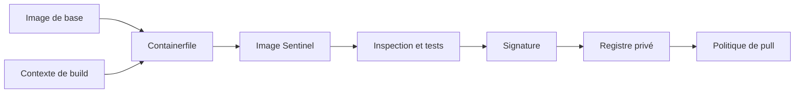
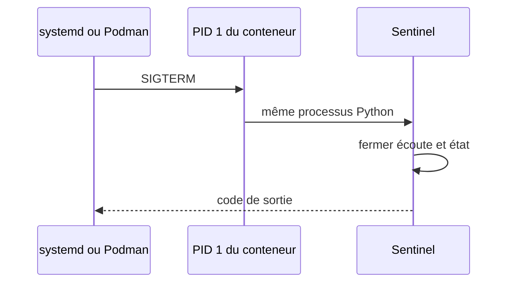
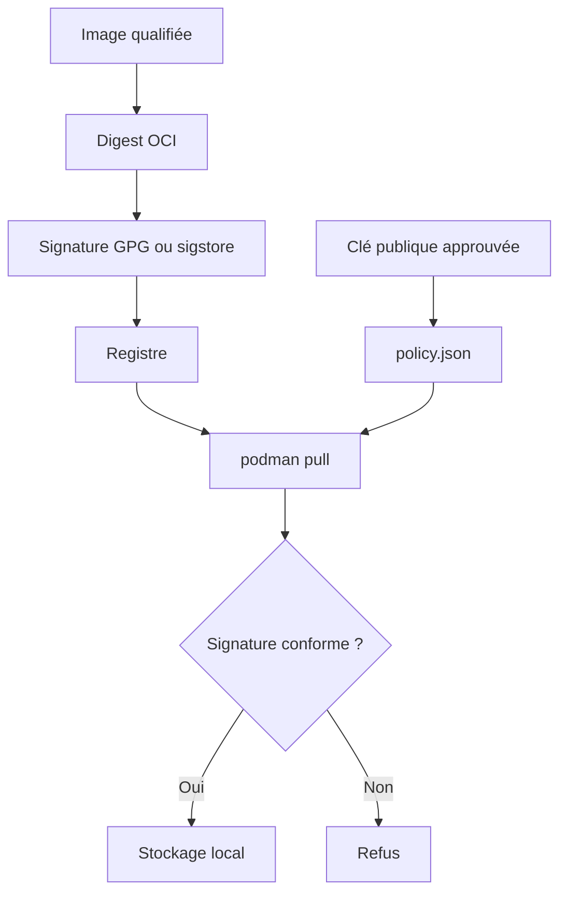

# Chapitre 11.3 — Construire des images sécurisées

> **Campagne 11 — Conteneurisation**

> *« Une image est une chaîne d'approvisionnement exécutable : chaque couche devient une dépendance de production. »*

## Vous êtes ici

```text
PARTIE III — Industrialiser les déploiements

Campagne 11

  11.1 Découvrir Podman ✔
  11.2 Exécuter des conteneurs rootless ✔
► 11.3 Construire des images sécurisées
  11.4 Concevoir les réseaux de conteneurs
  11.5 Gérer les secrets
  11.6 Exécuter Sentinel en sécurité
```

## Objectifs pédagogiques

À l'issue de ce chapitre, vous serez capable de :

- lire un `Containerfile` comme une recette de sécurité ;
- réduire le contexte de build et la surface de l'image ;
- choisir une image de base par registre complet et digest ;
- exécuter Sentinel avec un UID non privilégié et un système de fichiers maîtrisé ;
- inspecter l'historique, les métadonnées et la politique de confiance d'une image.

## Pourquoi ce chapitre existe

Une image peut fonctionner tout en contenant des compilateurs, des caches, des clés, une version vulnérable ou une commande qui démarre en `root`. Son build réussi ne constitue pas une qualification.

La recette Sentinel doit produire un artefact minimal, reproductible et attribuable. La sécurité concerne autant l'entrée du build que le conteneur final.

## Le pipeline d'une image



Une faiblesse à gauche est transportée vers tous les environnements à droite.

## Choisir et figer l'image de base

Utilisez un registre explicite et une base entretenue pour l'écosystème cible. Relevez son digest avant le build :

```bash
BASE=registry.access.redhat.com/ubi9/ubi-minimal:latest
skopeo inspect --format '{{.Digest}}' "docker://$BASE"
```

La recette de production référence ensuite :

```containerfile
FROM registry.access.redhat.com/ubi9/ubi-minimal@sha256:DIGEST_VERIFIE
```

| Référence | Propriété | Usage |
| --- | --- | --- |
| `:latest` | lisible mais mutable | exploration, jamais preuve de promotion |
| `:1.2.0` | version lisible, potentiellement mutable | repère humain |
| `@sha256:...` | contenu précisément identifié | build et déploiement qualifiés |

Le digest doit être mis à jour volontairement pour recevoir les correctifs de la base. Le figer sans processus de rénovation créerait une image reproductible mais vieillissante.

## Réduire le contexte de build

Podman transmet un contexte au constructeur. Un `COPY . .` peut incorporer `.git`, des tests, des caches ou des secrets.

Créez `.containerignore` :

```gitignore
.git
.github
__pycache__/
*.pyc
*.pem
*.key
.env
secrets/
tests/fixtures/private/
rpmbuild/
```

Puis copiez seulement les fichiers nécessaires :

```containerfile
COPY src/sentinel.py /opt/sentinel/sentinel.py
COPY LICENSE /licenses/LICENSE
```

> **Piège classique** — Supprimer un secret dans une couche ultérieure ne l'efface pas des couches précédentes. Un secret ne doit jamais entrer dans le contexte ni dans une instruction `ARG` ou `ENV` persistée.

## Concevoir le `Containerfile` Sentinel

Créez un répertoire `sentinel-image/` contenant le code et la licence, puis le fichier suivant :

```containerfile
FROM registry.access.redhat.com/ubi9/ubi-minimal@sha256:DIGEST_VERIFIE

LABEL org.opencontainers.image.title="Sentinel"
LABEL org.opencontainers.image.description="Service de sécurité du laboratoire AlmaLinux"
LABEL org.opencontainers.image.version="1.0.0"
LABEL org.opencontainers.image.licenses="MIT"
LABEL org.opencontainers.image.source="https://example.invalid/sentinel"

RUN microdnf update -y \
    && microdnf install -y python3 \
    && microdnf clean all \
    && rm -rf /var/cache/dnf

WORKDIR /opt/sentinel
COPY src/sentinel.py /opt/sentinel/sentinel.py
COPY LICENSE /licenses/LICENSE

RUN python3 -m py_compile /opt/sentinel/sentinel.py \
    && mkdir -p /var/lib/sentinel \
    && chmod 0555 /opt/sentinel/sentinel.py \
    && chmod 0444 /licenses/LICENSE \
    && chown 10001:10001 /var/lib/sentinel

USER 10001
EXPOSE 8443

HEALTHCHECK --interval=30s --timeout=3s --retries=3 \
  CMD ["python3", "/opt/sentinel/sentinel.py", "--healthcheck"]

ENTRYPOINT ["python3", "/opt/sentinel/sentinel.py"]
CMD ["--config", "/etc/sentinel/sentinel.conf"]
```

Remplacez le digest et adaptez `--healthcheck` à l'interface réellement développée. La commande doit retourner `0` lorsque le service est sain et une valeur non nulle sinon.

### Pourquoi un UID numérique ?

Le processus ne demande ni shell ni mot de passe. L'UID 10001 rend l'intention explicite sans installer `shadow-utils` uniquement pour créer un nom. Le code reste possédé par `root` et seulement lisible/exécutable par l'application ; seul `/var/lib/sentinel` lui appartient. Si une bibliothèque exige une entrée dans `/etc/passwd`, ajoutez-la de façon contrôlée puis vérifiez la surface créée.

### Pourquoi `microdnf update` ?

Le build doit intégrer les correctifs disponibles au moment où le digest de base est rénové. La vraie preuve reste l'inventaire de l'image produite et son analyse de vulnérabilités. Un `update` exécuté une fois ne remplace pas les reconstructions régulières.

Pour une reproductibilité bit à bit, il faudrait aussi figer un instantané des dépôts et l'ensemble des versions RPM. Dans ce laboratoire, conservez au minimum l'inventaire exact et le digest de l'image produite.

### Pourquoi `ENTRYPOINT` et `CMD` ?

`ENTRYPOINT` fixe l'exécutable. `CMD` fournit les arguments remplaçables. La forme JSON évite un shell intermédiaire et transmet correctement les signaux au processus principal.



## Construire avec des métadonnées traçables

```bash
cd sentinel-image
podman build \
  --label org.opencontainers.image.revision="$(git rev-parse HEAD)" \
  --tag localhost/sentinel:1.0.0 .
```

La substitution sert ici à inscrire le commit dans les métadonnées ; elle ne doit contenir aucun secret. En CI, transmettez une valeur validée par le pipeline.

## TP 1 — Construire et tester sans privilège

```bash
podman build --no-cache --tag localhost/sentinel:1.0.0 .
podman run --rm localhost/sentinel:1.0.0 --version
podman run --rm localhost/sentinel:1.0.0 \
  --config /etc/sentinel/sentinel.conf --check-config
```

Le second test nécessite une configuration montée ; ajoutez-la en lecture seule :

```bash
podman run --rm \
  -v ./sentinel.conf:/etc/sentinel/sentinel.conf:ro,Z \
  localhost/sentinel:1.0.0 \
  --config /etc/sentinel/sentinel.conf --check-config
```

Contrôlez l'identité :

```bash
podman run --rm --entrypoint /usr/bin/id localhost/sentinel:1.0.0
```

Le résultat ne doit pas annoncer l'UID 0.

## TP 2 — Auditer l'artefact

```bash
podman image inspect localhost/sentinel:1.0.0
podman history --no-trunc localhost/sentinel:1.0.0
podman image tree localhost/sentinel:1.0.0
podman run --rm --entrypoint /bin/sh localhost/sentinel:1.0.0 \
  -c 'find / -xdev -perm /6000 -type f -print'
```

Vérifiez :

- l'utilisateur configuré ;
- la commande et le healthcheck ;
- les labels OCI ;
- l'absence de secret dans l'historique ;
- l'absence de binaire setuid inattendu ;
- les paquets réellement installés.

```bash
podman run --rm --entrypoint /bin/rpm localhost/sentinel:1.0.0 -qa
```

Exportez un inventaire dans les preuves du build. Un scanner de vulnérabilités approuvé par l'organisation doit analyser **le digest produit**, avec un seuil et une procédure d'exception documentés.

## TP 3 — Tester un système de fichiers en lecture seule

```bash
podman run --rm --read-only \
  --tmpfs /tmp:rw,noexec,nosuid,nodev,size=16m \
  -v ./sentinel.conf:/etc/sentinel/sentinel.conf:ro,Z \
  localhost/sentinel:1.0.0
```

Si Sentinel tente d'écrire dans `/opt` ou `/etc`, corrigez l'application. Son état doit aller dans un volume monté sur `/var/lib/sentinel`.

```bash
podman volume create sentinel-state
podman run --rm --read-only \
  --tmpfs /tmp:rw,noexec,nosuid,nodev,size=16m \
  -v sentinel-state:/var/lib/sentinel:Z \
  -v ./sentinel.conf:/etc/sentinel/sentinel.conf:ro,Z \
  localhost/sentinel:1.0.0
```

## De l'intégrité à la confiance

Un digest identifie un contenu, mais il ne dit pas qui l'a approuvé. La chaîne de publication doit signer l'image et imposer une politique de vérification.



Affichez la politique actuelle :

```bash
podman image trust show
sudo cat /etc/containers/policy.json
```

La politique par défaut peut accepter des images non signées. Pour la production, limitez le registre et l'espace de noms Sentinel à une clé ou une identité attendue. Testez la politique dans un répertoire de laboratoire avant de remplacer la configuration système.

> **Regard entreprise** — Signer une image n'impose rien tant que les consommateurs acceptent encore les images non signées. La règle de vérification fait partie de la chaîne de confiance.

## Étiquettes, tags et promotion

Construisez une fois, puis promouvez le même digest.

```text
localhost/sentinel:1.0.0
        │
        └── digest sha256:abc...
                 │
          tests + signature
                 │
        registre/dev ─► préprod ─► production
```

Ne reconstruisez pas l'image entre préproduction et production. Un nouveau build produit un nouvel artefact, même avec le même `Containerfile`.

## Mission d'ingénieur — Revue de `Containerfile`

Évaluez une recette selon cette grille :

1. origine et digest de la base ;
2. contenu exact du contexte ;
3. paquets ajoutés et caches retirés ;
4. secrets absents de toutes les couches ;
5. UID final non nul ;
6. commande compatible avec les signaux ;
7. healthcheck fonctionnel ;
8. labels de provenance ;
9. test en lecture seule ;
10. signature et politique de consommation.

Classez chaque point : **conforme**, **à corriger** ou **preuve manquante**.

## Impact sur Sentinel

Sentinel possède une image minimale qui :

- part d'une base précisément identifiée ;
- n'embarque que le code et l'interpréteur nécessaires ;
- s'exécute avec l'UID 10001 ;
- expose une interface de santé ;
- sépare configuration, état et secrets ;
- peut être signée puis promue par digest.

## Synthèse

- Le `Containerfile` est une recette de production et de sécurité.
- Le contexte de build doit exclure tout fichier inutile ou sensible.
- Un digest fixe l'entrée ; un processus de rénovation apporte les correctifs.
- L'image finale s'exécute avec un UID non nul et une commande sans shell intermédiaire.
- L'historique et le contenu doivent être inspectés après le build.
- La lecture seule révèle les écritures applicatives mal placées.
- La signature devient efficace lorsque `policy.json` refuse les artefacts non approuvés.

## Infographie de révision

```text
BASE PAR DIGEST + CONTEXTE MINIMAL + CONTAINERFILE REVU
                         │
                         ▼
                    podman build
                         │
                         ▼
                 IMAGE SENTINEL UID 10001
                         │
          ┌──────────────┼──────────────┐
          ▼              ▼              ▼
       inspecter       scanner        tester
       historique      paquets        read-only
          └──────────────┬──────────────┘
                         ▼
                  signer le digest
                         ▼
             registre + politique de pull

INTERDIT : secret dans une couche, tag seul comme preuve, exécution UID 0.
```

## Pour aller plus loin

Consultez la référence officielle de [`podman build`](https://docs.podman.io/en/stable/markdown/podman-build.1.html) et le chapitre Red Hat consacré à la [signature des images](https://docs.redhat.com/en/documentation/red_hat_enterprise_linux/9/html/building_running_and_managing_containers/assembly_signing-container-images_building-running-and-managing-containers).

Chapitre suivant : construire les flux réseau avant de publier le moindre port.

← [11.2 — Exécuter des conteneurs rootless](11.2-conteneurs-rootless.md) · [11.4 — Concevoir les réseaux de conteneurs](11.4-reseaux-conteneurs.md) →
