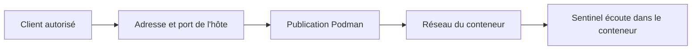
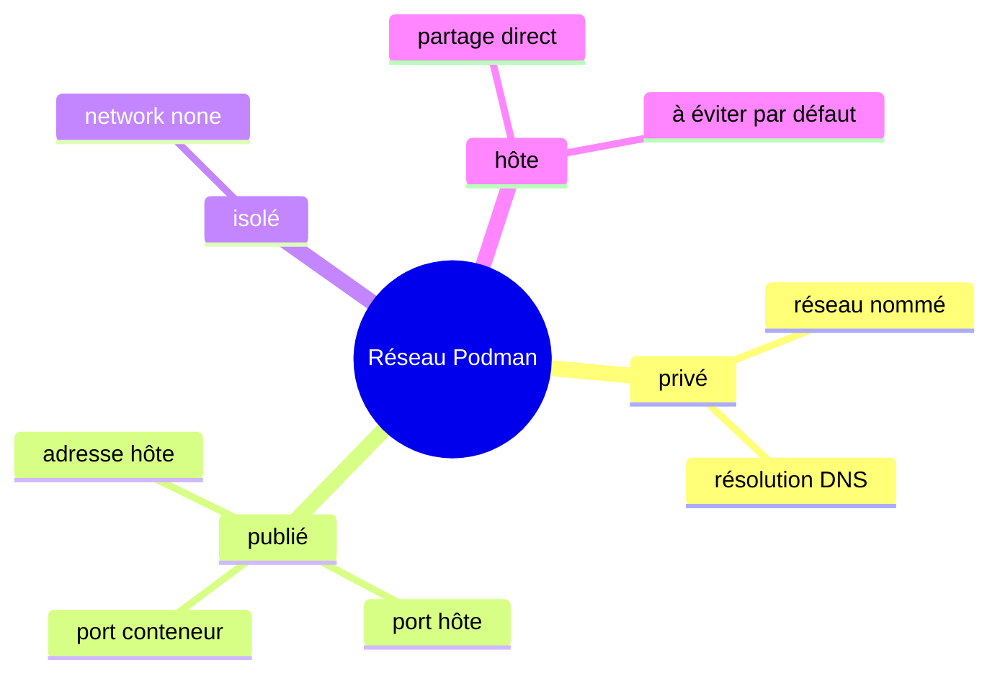
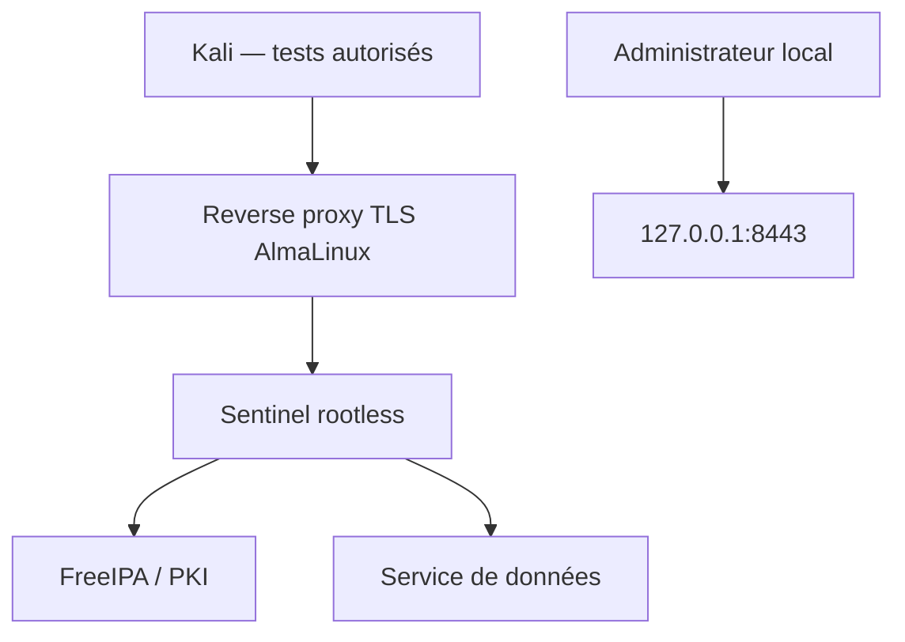
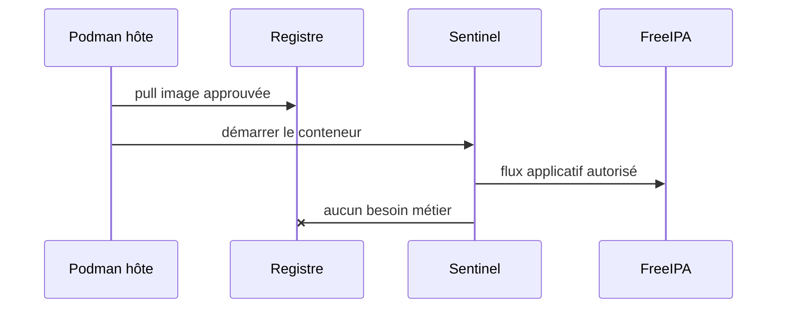

# Chapitre 11.4 — Concevoir les réseaux de conteneurs

> **Campagne 11 — Conteneurisation**

> *« Un port publié est une décision d'architecture, pas une commodité de ligne de commande. »*

## Vous êtes ici

```text
PARTIE III — Industrialiser les déploiements

Campagne 11

  11.1 Découvrir Podman ✔
  11.2 Exécuter des conteneurs rootless ✔
  11.3 Construire des images sécurisées ✔
► 11.4 Concevoir les réseaux de conteneurs
  11.5 Gérer les secrets
  11.6 Exécuter Sentinel en sécurité
```

## Objectifs pédagogiques

À l'issue de ce chapitre, vous serez capable de :

- distinguer écoute applicative, réseau de conteneurs et publication sur l'hôte ;
- créer un réseau Podman dédié et vérifier sa résolution de noms ;
- limiter un port à la boucle locale ou à une adresse précise ;
- articuler Podman, firewalld et SELinux ;
- tester depuis Kali les flux autorisés et refusés.

## Pourquoi ce chapitre existe

Une image peut déclarer `EXPOSE 8443` sans rendre le port accessible. À l'inverse, une option `-p 0.0.0.0:8443:8443` peut ouvrir Sentinel sur toutes les interfaces de l'hôte.

Le réseau doit partir des flux métier : qui appelle Sentinel, vers quelle interface, avec quel protocole et par quel point de contrôle ?

## Les trois niveaux d'un flux entrant



| Niveau | Exemple | Contrôle |
| --- | --- | --- |
| application | `0.0.0.0:8443` dans le conteneur | configuration Sentinel |
| publication | `127.0.0.1:8443:8443` | option Podman ou Quadlet |
| accès hôte | service firewalld et adresse d'écoute | politique AlmaLinux |

`EXPOSE` documente le port attendu dans l'image. Il ne crée pas à lui seul une publication.

## Les modes essentiels



### Réseau nommé

Un réseau nommé fournit une frontière et, lorsqu'il active le DNS, une résolution par nom entre ses membres.

```bash
podman network create sentinel-backend
podman network inspect sentinel-backend
```

### Aucun réseau

Un traitement qui n'a besoin d'aucun flux utilise :

```bash
podman run --rm --network none IMAGE COMMANDE
```

### Réseau de l'hôte

`--network host` supprime l'isolation réseau et expose directement les sockets du processus dans le namespace réseau de l'hôte. Il ne doit être retenu que pour un besoin justifié et revu.

> **Regard attaquant** — Le réseau hôte donne au conteneur une vue plus riche des services locaux. Combiné à des capacités ou montages excessifs, il facilite le mouvement vers l'hôte.

## Concevoir les flux Sentinel

Le modèle de laboratoire retient :



- Sentinel n'est pas publié directement sur toutes les interfaces ;
- le reverse proxy porte le port privilégié et la politique TLS ;
- l'interface de santé reste locale ;
- les dépendances internes rejoignent un réseau nommé ;
- les flux sortants sont documentés et audités.

## TP 1 — Créer un réseau et tester le DNS

```bash
podman network create sentinel-lab
podman network inspect --format '{{.DNSEnabled}}' sentinel-lab
```

Lancez Sentinel avec un alias :

```bash
podman run -d --name sentinel-api \
  --network sentinel-lab \
  --network-alias sentinel \
  -v ./sentinel.conf:/etc/sentinel/sentinel.conf:ro,Z \
  localhost/sentinel:1.0.0
```

Depuis un second conteneur approuvé possédant un client HTTP :

```bash
podman run --rm --network sentinel-lab IMAGE_OUTILS \
  getent hosts sentinel
podman run --rm --network sentinel-lab IMAGE_OUTILS \
  curl --fail http://sentinel:8443/health
```

Remplacez `IMAGE_OUTILS` par une image interne qualifiée. N'introduisez pas une image publique inconnue uniquement pour obtenir `curl`.

Retirez le conteneur de test, puis le réseau après les exercices :

```bash
podman rm --force sentinel-api
podman network rm sentinel-lab
```

## Publier avec une adresse explicite

Ces deux commandes n'ont pas la même portée :

```bash
podman run -p 8443:8443 IMAGE
podman run -p 127.0.0.1:8443:8443 IMAGE
```

La première peut écouter sur toutes les adresses de l'hôte selon la configuration. La seconde limite explicitement la publication à la boucle locale.

Contrôlez toujours le résultat :

```bash
ss -lntp | grep ':8443'
podman port NOM_DU_CONTENEUR
```

> **Piège classique** — Lire seulement `podman port` ne remplace pas l'observation de l'hôte. La preuve finale est le socket réellement ouvert et le test depuis chaque zone réseau.

## TP 2 — Prouver une exposition locale

```bash
podman run -d --name sentinel-local \
  -p 127.0.0.1:8443:8443 \
  -v ./sentinel.conf:/etc/sentinel/sentinel.conf:ro,Z \
  localhost/sentinel:1.0.0

curl --fail http://127.0.0.1:8443/health
ss -lnt | grep ':8443'
```

Depuis Kali :

```bash
nmap -Pn -p 8443 ALMALINUX_IP
```

Le port ne doit pas être accessible depuis le réseau. Documentez la différence entre `closed`, `filtered` et l'absence de réponse selon le chemin réseau.

## Articuler firewalld et Podman

Firewalld protège les interfaces et zones de l'hôte. Podman crée ses propres réseaux et règles de publication. Les implémentations changent avec le backend réseau ; il faut tester le résultat, pas supposer une chaîne nftables précise.

```bash
sudo firewall-cmd --get-active-zones
sudo firewall-cmd --list-all
podman info --debug
podman network inspect sentinel-backend
sudo nft list ruleset
```

Pour une exposition directe exceptionnellement requise :

1. lier le port à l'adresse de service voulue ;
2. créer un service firewalld nommé ;
3. limiter les sources dans la zone ou avec une rich rule ;
4. tester depuis une source autorisée et une source refusée ;
5. conserver les journaux du refus.

Ne considérez pas un réseau Podman comme une politique réseau complète. Dans un hôte unique, la séparation par réseaux réduit les chemins disponibles ; elle ne remplace pas un pare-feu orienté flux.

## Les flux sortants

Sentinel peut contacter FreeIPA, une PKI ou un stockage. Une publication `-p` ne contrôle pas ces sorties.

| Flux | Source | Destination | Justification |
| --- | --- | --- | --- |
| identité | Sentinel | FreeIPA | authentification et annuaire |
| TLS | Sentinel | PKI ou OCSP | validation et renouvellement |
| données | Sentinel | service interne | état applicatif |
| mises à jour | hôte | registre | pull d'image, pas conteneur applicatif |

Le conteneur Sentinel n'a normalement pas besoin d'accéder directement au registre. C'est Podman sur l'hôte qui tire l'image avant le démarrage.



## SELinux reste dans le chemin

La publication réseau n'autorise pas automatiquement chaque opération. SELinux peut limiter les connexions ou l'accès aux certificats montés.

```bash
ps -eZ | grep '[c]onmon\|[s]entinel'
sudo ausearch -m AVC,USER_AVC -ts recent
```

N'utilisez pas `setenforce 0` pour « réparer » un réseau. Identifiez d'abord si l'échec vient de l'écoute applicative, du namespace, de la publication, de firewalld, du routage ou de SELinux.

## TP 3 — Diagnostic par couches

Créez volontairement trois pannes, une à la fois :

1. Sentinel écoute uniquement sur `127.0.0.1` **dans** le conteneur ;
2. le port n'est pas publié ;
3. firewalld refuse la source Kali.

Pour chaque panne, collectez :

```bash
podman logs sentinel-netlab
podman inspect sentinel-netlab
podman port sentinel-netlab
ss -lntp
sudo firewall-cmd --list-all
sudo ausearch -m AVC,USER_AVC -ts recent
```

Écrivez le diagnostic avant la correction. Une méthode fiable descend du processus vers le client ou remonte du client vers le processus sans sauter de couche.

## Mission d'ingénieur — Produire la matrice de flux

Complétez une matrice pour Sentinel :

| Source | Destination | Port | Chiffrement | Point de contrôle | Test |
| --- | --- | --- | --- | --- | --- |
| reverse proxy | Sentinel | 8443 | TLS interne ou boucle locale | publication Podman | `curl` santé |
| Kali autorisée | reverse proxy | 443 | TLS | firewalld + proxy | test fonctionnel |
| Sentinel | FreeIPA | selon service | TLS | réseau + PKI | authentification |

Tout flux absent de la matrice est refusé par défaut. Associez une preuve positive et une preuve négative à chaque règle.

## Impact sur Sentinel

Sentinel n'est plus « exposé parce que le conteneur tourne ». Son architecture réseau distingue :

- l'écoute interne de l'application ;
- le réseau privé entre composants ;
- la publication locale sur AlmaLinux ;
- le point d'entrée TLS ;
- la politique firewalld ;
- les tests autorisés depuis Kali.

## Synthèse

- `EXPOSE` documente un port mais ne le publie pas.
- Une publication doit préciser l'adresse hôte, le port hôte et le port conteneur.
- Les réseaux nommés séparent les composants et peuvent fournir la résolution DNS.
- `--network none` convient aux traitements sans réseau ; `host` doit rester exceptionnel.
- Firewalld, Podman et SELinux sont des contrôles complémentaires.
- Les flux sortants doivent être cartographiés autant que les flux entrants.
- Toute exposition se valide depuis une source autorisée et une source refusée.

## Infographie de révision

```text
CLIENT ─► FIREWALLD ─► SOCKET HÔTE ─► PUBLICATION PODMAN ─► SENTINEL
             │                │                 │                │
           zone/IP       127.0.0.1:8443    réseau nommé      écoute :8443

ENTRANT : adresse précise + port précis + source précise
INTERNE : réseau dédié + DNS par nom + aucun port public inutile
SORTANT : FreeIPA/PKI/données seulement, registre géré par l'hôte

DIAGNOSTIC : application → conteneur → publication → hôte → pare-feu → client
RÈGLE      : aucun flux sans besoin métier, contrôle et test négatif.
```

## Pour aller plus loin

La [référence réseau Podman](https://docs.podman.io/en/stable/markdown/podman-network.1.html) décrit les réseaux, backends et paramètres de sous-réseau. Vérifiez également `man podman-run`, `man containers.conf` et la configuration firewalld de l'hôte.

Chapitre suivant : injecter certificats, clés et mots de passe sans les intégrer à l'image.

← [11.3 — Construire des images sécurisées](11.3-construire-images-securisees.md) · [11.5 — Gérer les secrets](11.5-gerer-secrets-podman.md) →
