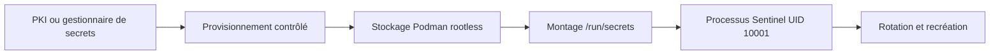
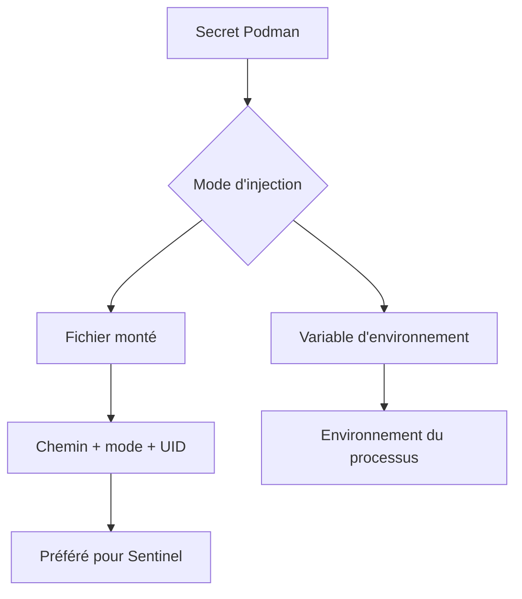
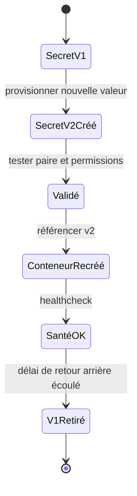

# Chapitre 11.5 — Gérer les secrets avec Podman

> **Campagne 11 — Conteneurisation**

> *« Un secret utile à l'exécution n'a rien à faire dans l'image qui sera copiée partout. »*

## Vous êtes ici

```text
PARTIE III — Industrialiser les déploiements

Campagne 11

  11.1 Découvrir Podman ✔
  11.2 Exécuter des conteneurs rootless ✔
  11.3 Construire des images sécurisées ✔
  11.4 Concevoir les réseaux de conteneurs ✔
► 11.5 Gérer les secrets
  11.6 Exécuter Sentinel en sécurité
```

## Objectifs pédagogiques

À l'issue de ce chapitre, vous serez capable de :

- repérer les canaux qui exposent un secret ;
- créer et inventorier un secret Podman sans le placer dans l'image ;
- préférer un montage fichier à une variable d'environnement ;
- adapter UID, mode et chemin au processus Sentinel ;
- organiser une rotation par recréation contrôlée du conteneur.

## Pourquoi ce chapitre existe

Sentinel utilise des clés TLS, des certificats, des jetons et parfois un mot de passe de service. Une image est répliquée dans des registres, caches et postes de build. Y placer une valeur d'environnement ou un fichier privé multiplie sa diffusion et rend sa révocation difficile.

Le secret doit rejoindre le conteneur seulement à l'exécution, pour l'environnement et l'identité qui en ont besoin.

## Le trajet d'un secret



Le mécanisme Podman évite l'image et le dépôt Git. Il n'est pas automatiquement un coffre-fort d'entreprise : le driver par défaut peut stocker les données sans chiffrement. La protection de l'hôte, du compte rootless et des sauvegardes reste essentielle.

## Les mauvais canaux

| Canal | Pourquoi il fuit |
| --- | --- |
| `ENV PASSWORD=...` dans le `Containerfile` | métadonnées et couches de l'image |
| `ARG SECRET=...` pendant le build | historique, logs ou cache de build |
| `podman run -e PASSWORD=valeur` | historique du shell et inspection du processus appelant |
| fichier dans Git | clones, historique et CI |
| secret dans un RPM ou une image | caches, registres et sauvegardes |
| secret dans un label | métadonnée conçue pour être inspectée |

> **Piège classique** — Une valeur supprimée dans le dernier commit reste dans l'historique Git ; une valeur supprimée dans une couche reste dans les couches antérieures. La réponse est la rotation, puis le nettoyage de provenance selon une procédure d'incident.

## Secret monté ou variable d'environnement



Le montage fichier est préférable :

- l'application ouvre un chemin précis ;
- le mode peut être limité ;
- la valeur n'apparaît pas dans l'environnement ;
- les bibliothèques TLS attendent naturellement des fichiers.

Une variable peut être nécessaire pour une application ancienne. Considérez-la comme une compatibilité temporaire et vérifiez ce que `podman inspect`, les journaux et `/proc` rendent visible.

## Créer un secret sans fichier intermédiaire

Avec le compte `sentinel-container` :

```bash
read -rsp 'Mot de passe de laboratoire : ' SENTINEL_DB_PASSWORD
printf '\n'
printf '%s' "$SENTINEL_DB_PASSWORD" |
  podman secret create sentinel-db-password -
unset SENTINEL_DB_PASSWORD
```

La valeur n'est pas écrite dans la ligne de commande. Elle transite cependant dans la mémoire du shell et vers le stockage du driver. Pour la production, préférez une intégration avec le gestionnaire de secrets de l'organisation.

Inventoriez sans afficher le contenu :

```bash
podman secret ls
podman secret inspect sentinel-db-password
```

Les métadonnées ne doivent pas contenir la valeur secrète.

## TP 1 — Monter un secret comme fichier

```bash
podman run --rm \
  --secret sentinel-db-password,type=mount,target=db-password,uid=10001,gid=10001,mode=0400 \
  --entrypoint /bin/sh \
  localhost/sentinel:1.0.0 \
  -c 'id; stat -c "%a %u %g %n" /run/secrets/db-password; test -s /run/secrets/db-password'
```

Ne lancez pas `cat /run/secrets/db-password` dans une capture de formation ou un journal CI. La preuve attendue porte sur l'existence, le mode, le propriétaire et la possibilité de lecture par Sentinel.

Dans la configuration :

```ini
[database]
password_file = /run/secrets/db-password
```

L'application lit le fichier au démarrage et ne journalise jamais sa valeur.

## TP 2 — Vérifier l'absence dans l'image

```bash
podman history --no-trunc localhost/sentinel:1.0.0 |
  grep -i 'password\|secret' || true
podman image inspect localhost/sentinel:1.0.0 |
  grep -i 'password\|secret' || true
```

Un mot générique peut apparaître dans un chemin ou une documentation. Vérifiez aussi que les fichiers exclus du contexte ne sont pas présents dans la racine finale :

```bash
podman run --rm --entrypoint /bin/sh localhost/sentinel:1.0.0 \
  -c 'find / -xdev \( -name "*.key" -o -name ".env" -o -name ".git" \) -print 2>/dev/null'
```

Ces contrôles ne prouvent pas l'absence d'une valeur supprimée dans une couche antérieure. Le pipeline doit utiliser un scanner d'image conscient des couches et bloquer les motifs sensibles. En cas de doute sur une valeur réelle, révoquez-la et reconstruisez depuis un contexte propre au lieu de l'afficher pour la rechercher.

## Certificats et clés TLS

Le certificat public n'est pas secret, mais sa provenance et son intégrité comptent. La clé privée est un secret.

Créez-les séparément :

```bash
podman secret create sentinel-tls-cert /chemin/controle/server.crt
podman secret create sentinel-tls-key /chemin/controle/server.key
```

Montez-les avec des modes différents :

```bash
--secret sentinel-tls-cert,type=mount,target=tls.crt,uid=10001,gid=10001,mode=0444 \
--secret sentinel-tls-key,type=mount,target=tls.key,uid=10001,gid=10001,mode=0400
```

La configuration Sentinel utilise `/run/secrets/tls.crt` et `/run/secrets/tls.key`.

> **Point PKI** — La rotation d'une clé TLS doit préserver la correspondance certificat/clé et la chaîne de confiance. Validez la paire avant de recréer le conteneur.

```bash
openssl x509 -in server.crt -pubkey -noout | sha256sum
openssl pkey -in server.key -pubout | sha256sum
```

Les deux empreintes de clé publique doivent correspondre. Ces commandes ne doivent être exécutées que dans l'espace protégé qui détient la clé privée.

## Rotation : nouveau secret, nouveau conteneur

Ne dépendez pas d'une propagation implicite vers un conteneur existant. Le modèle le plus prévisible versionne l'identité logique du secret et recrée le conteneur.



Exemple de noms :

```text
sentinel-tls-key-2026-07
sentinel-tls-key-2026-10
```

Le nom ne contient ni valeur secrète ni information personnelle. Le conteneur final référence la version active de façon déclarative.

## TP 3 — Exercer une rotation sans interruption prolongée

1. créez `sentinel-db-password-v2` ;
2. lancez un conteneur de qualification avec v2 sur un port local différent ;
3. exécutez le healthcheck et un test d'authentification ;
4. remplacez le conteneur de production ;
5. conservez v1 pendant la fenêtre de retour arrière ;
6. supprimez v1 après validation.

```bash
podman secret rm sentinel-db-password-v1
podman secret ls
```

La suppression doit échouer ou être différée si un conteneur en dépend encore. Vérifiez le comportement de la version Podman installée et ne forcez pas la disparition d'une dépendance active.

## Fuites par les journaux et erreurs

Même correctement monté, un secret peut être divulgué par l'application :

- affichage de la configuration complète ;
- trace d'exception contenant une URL avec mot de passe ;
- mode debug qui affiche les en-têtes ;
- commande de diagnostic qui retourne l'environnement ;
- collecte de support trop large.

Sentinel doit masquer les valeurs sensibles :

```text
database.password_file=/run/secrets/db-password
database.password=***REDACTED***
```

Testez avec une valeur sentinelle uniquement dans le laboratoire, déclenchez les erreurs prévues, puis cherchez cette valeur dans `journalctl --user` sans jamais publier la sortie si elle est trouvée.

## Mission d'ingénieur — Cartographier les secrets Sentinel

Produisez un registre sans valeurs :

| Secret | Source d'autorité | Consommateur | Chemin | Rotation | Révocation |
| --- | --- | --- | --- | --- | --- |
| clé TLS | PKI | Sentinel UID 10001 | `/run/secrets/tls.key` | avant expiration | immédiate si compromission |
| mot de passe DB | gestionnaire interne | Sentinel | `/run/secrets/db-password` | périodique | désactiver ancien compte |
| jeton API | service cible | Sentinel | `/run/secrets/api-token` | durée courte | invalider côté service |

Chaque secret possède un propriétaire, une durée, une preuve de rotation et une procédure d'incident.

## Impact sur Sentinel

L'image Sentinel reste identique entre développement, préproduction et production. Seuls les secrets injectés à l'exécution changent.

Cela permet de :

- promouvoir le même digest ;
- limiter chaque secret au compte rootless ;
- monter les clés avec l'UID et le mode nécessaires ;
- renouveler sans reconstruire l'image ;
- auditer les métadonnées sans exposer les valeurs.

## Synthèse

- Un secret ne doit entrer ni dans Git, ni dans le contexte de build, ni dans l'image.
- Le driver Podman ne remplace pas automatiquement un coffre-fort chiffré.
- Un montage fichier est généralement moins exposé qu'une variable d'environnement.
- UID, GID, mode et chemin doivent correspondre au processus non-root.
- Une rotation fiable crée une nouvelle version puis recrée le conteneur.
- Les journaux et messages d'erreur font partie de la surface de fuite.
- Le registre des secrets contient des métadonnées opérationnelles, jamais les valeurs.

## Infographie de révision

```text
AUTORITÉ ─► PROVISIONNEMENT ─► SECRET PODMAN ─► /run/secrets ─► SENTINEL
   │               │                  │                │             │
  PKI          canal protégé      compte rootless   mode 0400     UID 10001

JAMAIS DANS : Git | Containerfile | ENV | ARG | labels | journaux

ROTATION : créer v2 → qualifier → recréer → tester → retirer v1
INCIDENT : révoquer à la source → renouveler → rechercher les fuites

Le mécanisme d'injection réduit la diffusion ; la sécurité de l'hôte reste requise.
```

## Pour aller plus loin

La référence [`podman secret create`](https://docs.podman.io/en/stable/markdown/podman-secret-create.1.html) décrit les drivers et entrées disponibles. Les options d'injection sont documentées dans [`podman create`](https://docs.podman.io/en/latest/markdown/podman-create.1.html).

Chapitre suivant : assembler image, réseau, secrets, ressources, SELinux et systemd dans un déploiement Sentinel rootless.

← [11.4 — Concevoir les réseaux de conteneurs](11.4-reseaux-conteneurs.md) · [11.6 — Exécuter Sentinel en sécurité](11.6-executer-sentinel-securite.md) →
