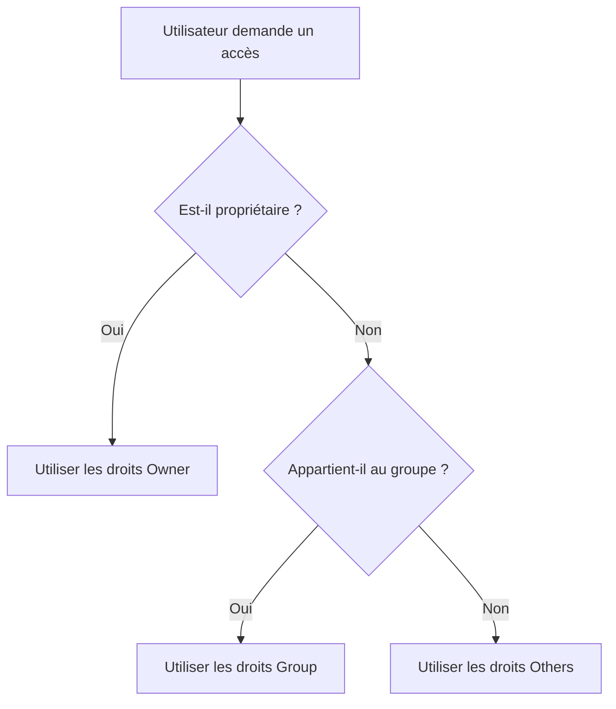
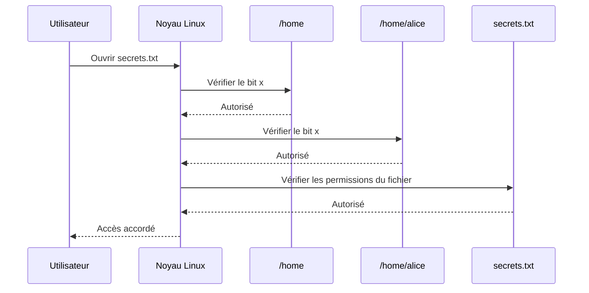
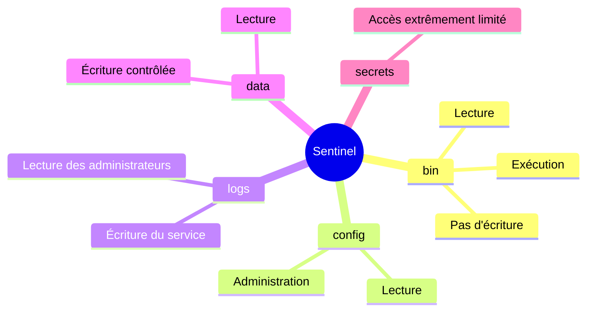
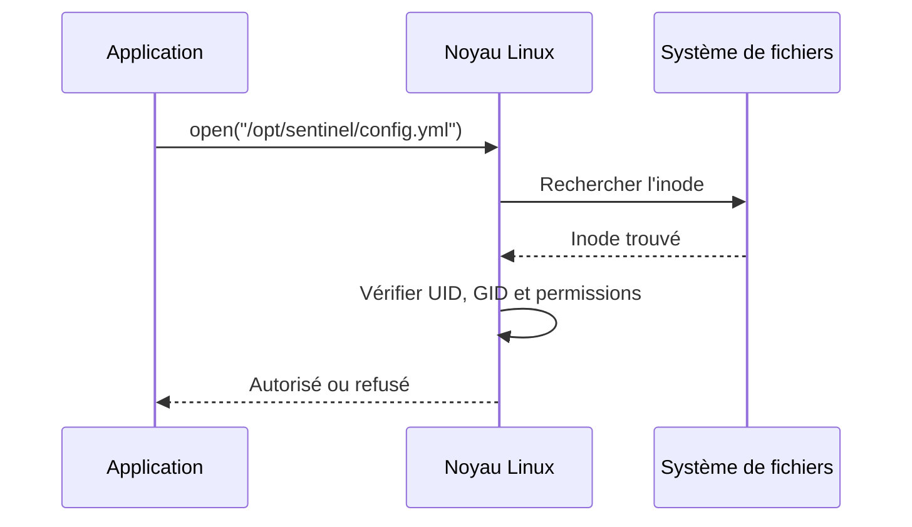
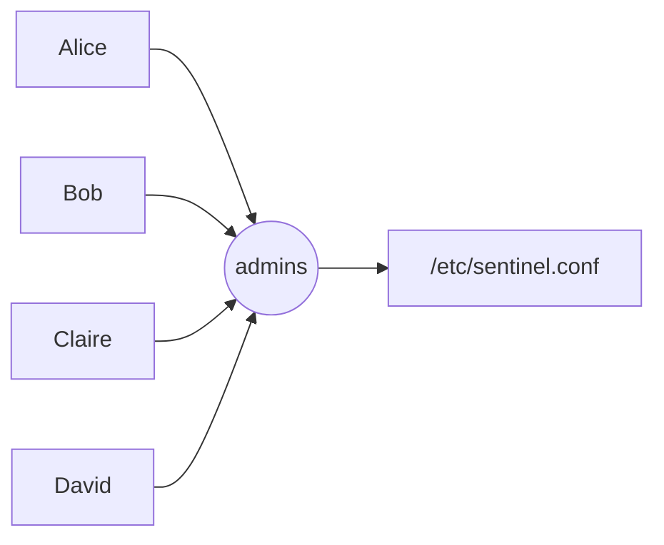
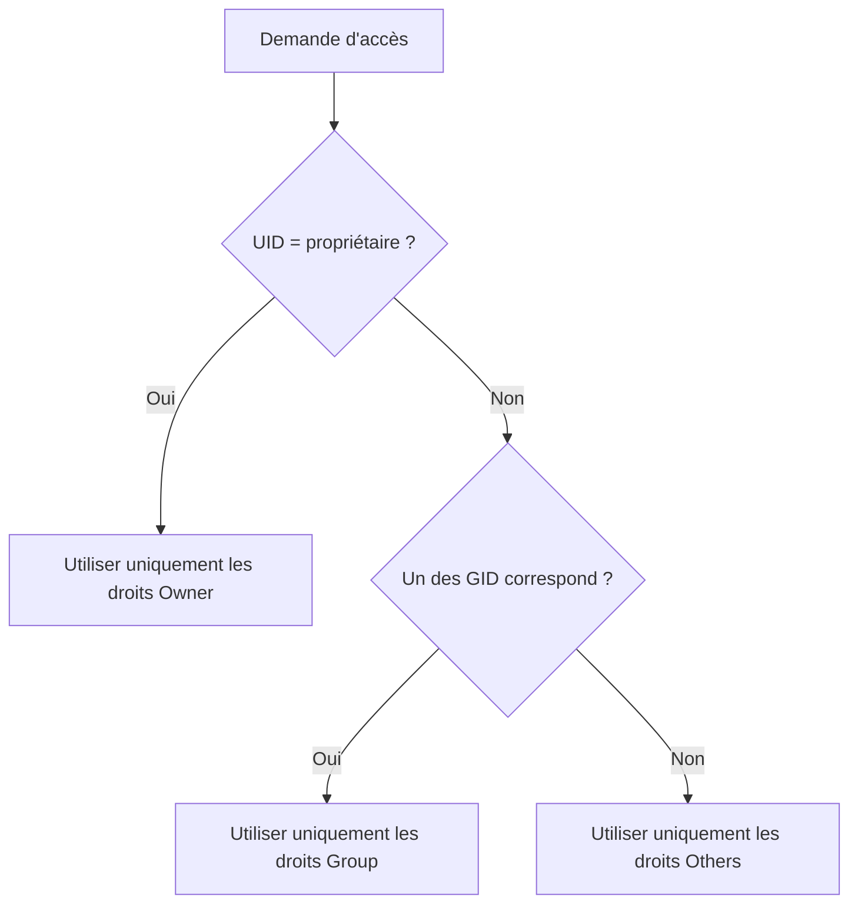
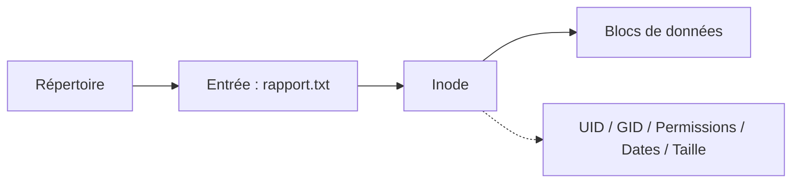
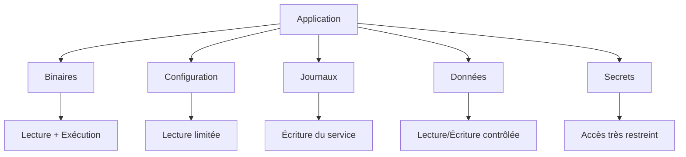

# Campagne 2 — Contrôle des accès

> *« La sécurité ne consiste pas à empêcher les utilisateurs de travailler. Elle consiste à leur permettre de faire exactement ce qu'ils doivent faire... et rien de plus. »*

La première campagne nous a permis de construire un serveur AlmaLinux sain.

Nous avons installé le système.

Nous avons découvert son architecture.

Nous avons créé notre laboratoire.

Nous avons commencé à appliquer les premières règles de durcissement.

Nous possédons désormais une machine relativement propre.

Mais elle présente encore une faiblesse majeure.

Une fois qu'un utilisateur est connecté, que peut-il réellement faire ?

Peut-il lire tous les fichiers ?

Peut-il modifier des configurations ?

Peut-il supprimer des données ?

Peut-il lancer des programmes dangereux ?

Toutes ces questions trouvent leur réponse dans un seul domaine :

**le contrôle des accès.**

Sous Linux, le contrôle des accès est omniprésent.

Il intervient lorsqu'un utilisateur ouvre un fichier.

Lorsqu'un processus crée un répertoire.

Lorsqu'un service écrit un journal.

Lorsqu'un démon lit une clé privée.

Lorsqu'un administrateur exécute une commande avec `sudo`.

Même un simple affichage d'un fichier texte dépend déjà de plusieurs mécanismes de sécurité.

Cette campagne est donc l'une des plus importantes de toute la formation.

Elle constitue le socle de tout ce qui suivra.

Sans elle, il est impossible de comprendre :

- SELinux
- systemd
- FreeIPA
- Ansible
- les conteneurs
- ou même SSH.

Nous allons progressivement découvrir comment Linux décide :

- qui peut accéder à une ressource ;
- quelles opérations sont autorisées ;
- dans quelles conditions ;
- et comment renforcer ces décisions.

À la fin de cette campagne, Sentinel ne sera plus une simple application Python.

Elle commencera à devenir un véritable service sécurisé.

---

# 2.1 Les permissions UNIX

> *« Avant de protéger un serveur contre le monde extérieur, il faut apprendre à protéger les utilisateurs les uns des autres. »*

---

## Vous êtes ici

```text
PARTIE I — Construire un socle sécurisé

Campagne 1  [██████████] ✔
Campagne 2  [█░░░░░░░░░]

    ► 2.1 Les permissions UNIX
      2.2 ACL
      2.3 umask
      2.4 Attributs étendus
      2.5 PAM
      2.6 Politique de mots de passe
      2.7 Comptes système
      2.8 sudo avancé
      2.9 passwd / shadow / group
      2.10 Synthèse
```

---

## Objectifs pédagogiques

À la fin de ce chapitre, vous serez capable de :

- comprendre le modèle historique des permissions UNIX ;
- expliquer pourquoi il est toujours utilisé cinquante ans après sa création ;
- interpréter correctement les droits d'un fichier ;
- différencier lecture, écriture et exécution ;
- comprendre les notions de propriétaire, groupe et autres utilisateurs ;
- analyser les décisions prises par le noyau lors d'un accès à un fichier ;
- identifier les limites du modèle UNIX classique.

---

## Pourquoi ce chapitre existe

Lorsqu'un administrateur découvre Linux, il rencontre très rapidement une commande devenue presque mythique :

```bash
ls -l
```

Son résultat ressemble souvent à ceci :

```text
-rwxr-x---
```

Pour beaucoup de débutants, cette suite de lettres paraît mystérieuse.

On apprend rapidement que :

- `r` signifie Read ;
- `w` signifie Write ;
- `x` signifie eXecute.

Puis on mémorise quelques commandes :

```bash
chmod
```

```bash
chown
```

```bash
chgrp
```

Et l'on considère le sujet comme acquis.

En réalité, ce n'est que la partie visible.

Ces quelques caractères représentent l'un des mécanismes fondamentaux de Linux.

Chaque accès à un fichier.

Chaque création de répertoire.

Chaque exécution d'un programme.

Chaque lecture d'une clé TLS.

Chaque lancement d'un démon systemd.

Chaque accès de Sentinel.

Tout passe d'abord par cette première vérification.

Avant SELinux.

Avant les ACL.

Avant les capacités Linux.

Avant AppArmor.

Avant même que votre application ne commence réellement à travailler.

Le noyau Linux commence toujours par vérifier les permissions UNIX.

Comprendre cette étape est indispensable.

---

# Une idée étonnamment simple

L'histoire des permissions UNIX commence au début des années 1970.

À cette époque, les ordinateurs sont extrêmement coûteux.

Ils sont partagés.

Des dizaines, parfois des centaines d'utilisateurs utilisent simultanément la même machine.

Un problème apparaît immédiatement.

Comment empêcher un utilisateur de modifier les fichiers d'un autre ?

Comment protéger le système ?

Comment éviter les erreurs accidentelles ?

Les concepteurs d'UNIX imaginent alors une idée très simple.

Chaque fichier appartiendra à quelqu'un.

Chaque fichier pourra éventuellement être partagé avec un groupe.

Et tout le reste du monde aura un troisième niveau de droits.

Autrement dit :

```text
Qui êtes-vous ?

          |
          |
          v

+----------------------+
| propriétaire ?       |
+----------------------+
        |
     oui|non
        |
        v
+----------------------+
| membre du groupe ?   |
+----------------------+
        |
     oui|non
        |
        v
+----------------------+
| tout le reste        |
+----------------------+
```

Trois catégories.

Pas davantage.

Cette simplicité est volontaire.

Elle permet au noyau de prendre une décision extrêmement rapidement.

Même aujourd'hui, ce mécanisme reste incroyablement performant.

---

# Trois acteurs seulement

Chaque fichier Linux possède exactement un propriétaire.

Par exemple :

```text
sentinel.conf
```

peut appartenir à :

```text
sentinel
```

Le même fichier possède également un groupe.

Par exemple :

```text
sentinel-admin
```

Enfin, tous les autres utilisateurs appartiennent automatiquement à une troisième catégorie.

Ils ne sont :

- ni propriétaires ;
- ni membres du groupe.

Ils deviennent donc simplement :

```text
others
```

ou parfois :

```text
world
```

Le noyau ne cherche pas plus loin.

Il ne regarde pas :

- le prénom de l'utilisateur ;
- son service ;
- son ancienneté ;
- son métier.

Il applique simplement un ordre de priorité.



Cette règle paraît presque naïve.

Pourtant, elle fonctionne depuis plus de cinquante ans.

---

# Les trois autorisations

Pour chacune de ces trois catégories, Linux peut accorder trois permissions.

Lecture.

Écriture.

Exécution.

Ces trois permissions sont indépendantes.

Un utilisateur peut :

- lire sans écrire ;
- écrire sans exécuter ;
- exécuter sans modifier.

Chaque combinaison est possible.

---

## Le droit de lecture

Le droit de lecture est représenté par :

```text
r
```

Il autorise l'ouverture du contenu.

Pour un fichier texte :

```text
cat notes.txt
```

fonctionnera.

Sans ce droit :

```text
Permission denied
```

Pour un fichier binaire, la lecture signifie simplement que son contenu peut être consulté.

Le noyau ne fait aucune différence.

Pour lui, un fichier reste une suite d'octets.

---

## Le droit d'écriture

Le droit :

```text
w
```

autorise la modification.

On peut :

- remplacer le contenu ;
- ajouter des données ;
- tronquer le fichier.

Sans ce droit, toute tentative de modification sera refusée.

---

## Le droit d'exécution

Le droit :

```text
x
```

est probablement celui qui intrigue le plus.

Beaucoup pensent qu'il signifie :

> "ce fichier est un programme."

En réalité, ce n'est pas exact.

Le bit `x` indique simplement :

> "le noyau est autorisé à essayer d'exécuter ce fichier."

Il ne garantit absolument pas que l'exécution réussira.

Par exemple :

```bash
chmod +x montexte.txt
```

ne transforme évidemment pas un fichier texte en programme.

Le noyau essaiera simplement de l'exécuter.

L'opération échouera ensuite car le contenu ne correspond pas à un format exécutable ou à un script valide.

Le bit `x` ouvre seulement la porte.

Il ne garantit pas ce qui se trouve derrière.

---

# Les neuf permissions

Nous pouvons maintenant comprendre l'écriture classique.

Prenons :

```text
-rwxr-x---
```

Découpons-la.

```text
rwx   r-x   ---
```

Les trois premiers caractères concernent :

```text
Owner
```

Les trois suivants :

```text
Group
```

Les trois derniers :

```text
Others
```

Chaque bloc possède toujours le même ordre.

```text
r w x
```

Jamais :

```text
x r w
```

Jamais :

```text
w x r
```

Toujours :

```text
Lecture
Écriture
Exécution
```

Le cerveau finit par reconnaître ces motifs presque instantanément.

Avec un peu d'expérience, un administrateur lit une permission comme il lit un mot.

Il ne décode plus caractère par caractère.

---
# Comprendre le premier caractère

Lorsque nous exécutons :

```bash
ls -l
```

nous obtenons généralement un résultat semblable à celui-ci :

```text
-rwxr-x---
```

Beaucoup de personnes commencent immédiatement à lire les neuf derniers caractères.

Pourtant, un administrateur expérimenté regarde presque toujours **le premier caractère**.

Pourquoi ?

Parce qu'il indique immédiatement **la nature de l'objet**.

Les permissions n'ont pas exactement la même signification selon que l'on manipule un fichier, un répertoire ou un lien symbolique.

Observons plusieurs exemples.

```text
-rw-r--r--
```

Le premier caractère est :

```text
-
```

Il s'agit d'un fichier classique.

En revanche :

```text
drwxr-xr-x
```

commence par :

```text
d
```

Nous sommes face à un répertoire.

Autre exemple :

```text
lrwxrwxrwx
```

Le caractère :

```text
l
```

désigne un lien symbolique.

Il existe également d'autres types moins courants :

| Caractère | Type |
|-----------|------|
| `-` | Fichier ordinaire |
| `d` | Répertoire |
| `l` | Lien symbolique |
| `c` | Périphérique caractère |
| `b` | Périphérique bloc |
| `s` | Socket UNIX |
| `p` | FIFO (tube nommé) |

Nous retrouverons certains de ces objets dans les prochains chapitres, notamment lorsque nous étudierons `systemd`, les sockets ou encore Podman.

---

# Les permissions ne signifient pas toujours la même chose

Voici un point qui surprend souvent.

Les permissions ont une signification différente selon le type d'objet.

Prenons un fichier.

```text
-rw-------
```

Le droit de lecture permet évidemment de lire son contenu.

Le droit d'écriture autorise sa modification.

Le droit d'exécution permet de tenter son exécution.

Jusqu'ici, tout paraît logique.

Mais observons maintenant un répertoire.

```text
drwx------
```

Que signifie ici le droit de lecture ?

Peut-on "lire" un répertoire ?

En réalité, un répertoire n'est pas un conteneur magique.

Sous Linux, c'est lui aussi un fichier.

Simplement, son contenu n'est pas constitué de texte.

Il contient une table associant des noms à des numéros d'inodes.

Les permissions prennent donc un sens légèrement différent.

| Permission | Fichier | Répertoire |
|------------|----------|------------|
| Lecture (`r`) | Lire le contenu | Lister les entrées |
| Écriture (`w`) | Modifier le contenu | Créer ou supprimer des entrées |
| Exécution (`x`) | Exécuter le fichier | Traverser le répertoire |

Ce dernier point mérite que l'on s'y attarde.

---

# Le mystérieux bit d'exécution des répertoires

Pourquoi un répertoire possède-t-il un droit d'exécution ?

La réponse est historique.

Dans UNIX, pénétrer dans un répertoire revient à le parcourir.

Le bit `x` est donc parfois appelé :

> **search permission**

ou

> **traverse permission**.

Autrement dit :

> "Avez-vous le droit d'utiliser ce répertoire comme étape de votre chemin ?"

Imaginons l'arborescence suivante.

```text
/home
   |
   +-- alice
         |
         +-- secrets.txt
```

Pour accéder au fichier :

```text
/home/alice/secrets.txt
```

le noyau doit parcourir plusieurs répertoires.



Si l'un des répertoires refuse le droit de traversée, le noyau s'arrête immédiatement.

Peu importe que le fichier lui-même soit parfaitement accessible.

Le chemin est bloqué.

---

# Lire sans entrer

Ce comportement peut sembler étrange.

Prenons un exemple.

```text
dr--r--r--
```

Le répertoire est lisible.

Mais il n'est pas exécutable.

Que peut faire un utilisateur ?

Il peut connaître la liste des fichiers.

Par exemple :

```bash
ls monrepertoire
```

peut fonctionner.

En revanche :

```bash
cd monrepertoire
```

échouera.

Pourquoi ?

Parce que changer de répertoire nécessite de le traverser.

Autrement dit :

```text
Lecture ≠ Traversée
```

Inversement, un utilisateur peut parfois posséder uniquement :

```text
--x
```

Dans ce cas, il ne peut pas obtenir la liste complète des fichiers.

Mais il peut accéder directement à un fichier dont il connaît déjà le nom.

Cette situation est relativement rare, mais elle existe dans certaines architectures de sécurité.

---

# Écrire dans un répertoire

Le droit d'écriture d'un répertoire est lui aussi souvent mal compris.

Beaucoup imaginent qu'il permet de modifier les fichiers contenus dans ce répertoire.

Ce n'est pas vrai.

Le droit d'écriture concerne le **répertoire lui-même**.

Autrement dit, il autorise des opérations sur les entrées qu'il contient.

Par exemple :

- créer un nouveau fichier ;
- supprimer un fichier ;
- renommer un fichier ;
- créer un sous-répertoire.

En revanche, modifier le contenu d'un fichier dépend des permissions de ce fichier.

Prenons un exemple.

```text
documents/
```

possède :

```text
drwx------
```

À l'intérieur :

```text
rapport.txt
```

possède :

```text
-r--------
```

Le propriétaire du répertoire pourra créer :

```text
notes.txt
```

ou supprimer :

```text
rapport.txt
```

Mais il ne pourra pas forcément modifier le contenu de `rapport.txt` si les permissions de ce dernier ne l'y autorisent pas.

Le répertoire contrôle la présence des objets.

Le fichier contrôle son contenu.

Ce sont deux responsabilités différentes.

---

## 💎 Le point d'expertise

Les permissions UNIX sont évaluées **à chaque composant du chemin**.

Pour ouvrir :

```text
/opt/sentinel/config/settings.yaml
```

le noyau doit vérifier successivement :

```mermaid
flowchart LR

A[/] --> B[/opt]
B --> C[/opt/sentinel]
C --> D[/opt/sentinel/config]
D --> E[settings.yaml]
```

Sur chacun des répertoires (`/`, `/opt`, `/opt/sentinel`, `/opt/sentinel/config`), le processus doit disposer du droit **d'exécution (`x`)** afin de pouvoir poursuivre sa progression.

Ce n'est qu'une fois le dernier répertoire franchi que les permissions du fichier lui-même sont évaluées.

Cette vérification incrémentale explique pourquoi un fichier peut sembler correctement protégé alors qu'il reste inaccessible à cause d'un répertoire intermédiaire, ou inversement, pourquoi un mauvais réglage sur un seul répertoire peut exposer tout un arbre de fichiers.

Un architecte sécurité raisonne donc toujours **sur l'ensemble du chemin**, et jamais uniquement sur le fichier cible.

---
## 🧠 Comment pense un architecte ?

Lorsqu'un architecte conçoit une infrastructure Linux, il ne réfléchit jamais en termes de fichiers isolés.

Il raisonne en **zones de confiance**.

Chaque répertoire devient une frontière.

Chaque frontière possède des règles.

Prenons l'exemple de Sentinel.

```text
/opt/sentinel/
├── bin/
├── config/
├── logs/
├── data/
└── secrets/
```

La première idée d'un débutant est souvent :

> « Je vais mettre les bonnes permissions sur chaque fichier. »

Un architecte adopte une approche différente.

Il commence par définir ce que représente chaque répertoire.

Par exemple :

| Répertoire | Rôle |
|------------|------|
| `/opt/sentinel/bin` | Exécutables de l'application |
| `/opt/sentinel/config` | Configuration |
| `/opt/sentinel/logs` | Journaux |
| `/opt/sentinel/data` | Données métier |
| `/opt/sentinel/secrets` | Secrets cryptographiques |

Une fois ces rôles définis, il se pose une série de questions.

Qui doit lire ?

Qui doit écrire ?

Qui ne doit même pas savoir que ce répertoire existe ?

Il construit progressivement une véritable politique d'accès.



Ce raisonnement sera réutilisé lorsque nous construirons les politiques SELinux.

Les permissions UNIX constituent le premier niveau.

Elles ne doivent jamais être choisies au hasard.

---

## ⚔️ Comment pense un attaquant ?

Un attaquant ne commence généralement pas par rechercher une vulnérabilité complexe.

Il observe d'abord les permissions.

Pourquoi ?

Parce qu'une mauvaise permission peut suffire à compromettre un système entier.

Imaginons qu'un fichier de configuration soit accessible à tous.

```text
-rw-rw-rw-
```

L'attaquant n'a pas besoin d'exploiter un bug.

Il lui suffit de modifier le contenu.

Autre situation.

Une clé privée TLS est stockée avec les permissions :

```text
-rw-r--r--
```

Tous les utilisateurs peuvent la lire.

Le chiffrement TLS reste parfaitement fonctionnel.

Mais il ne protège plus rien.

L'attaquant possède désormais la clé.

Le problème ne vient pas de TLS.

Il vient des permissions.

De nombreux incidents de sécurité trouvent leur origine dans ce type d'erreur.

Les mécanismes cryptographiques étaient excellents.

Les permissions étaient mauvaises.

---

## 📚 Culture technique

Le modèle des permissions UNIX est apparu au début des années 1970.

À cette époque, la mémoire se comptait en kilo-octets.

Les processeurs fonctionnaient à quelques mégahertz.

Chaque instruction coûtait cher.

Les concepteurs d'UNIX avaient donc un objectif clair :

> décider très rapidement si un accès est autorisé.

Le choix de trois catégories seulement n'était pas un hasard.

Il permettait une évaluation extrêmement rapide.

Même aujourd'hui, le noyau Linux peut déterminer les permissions d'un fichier en quelques opérations très simples.

Cette efficacité explique pourquoi ce modèle est toujours utilisé plus de cinquante ans plus tard.

En revanche, les besoins de sécurité ont considérablement évolué.

Aujourd'hui, une entreprise souhaite souvent exprimer des politiques beaucoup plus fines.

Par exemple :

- un groupe peut modifier un fichier mais pas le supprimer ;
- un utilisateur externe peut uniquement consulter certains documents ;
- une application peut accéder à un répertoire sans appartenir au groupe propriétaire.

Le modèle UNIX classique devient alors insuffisant.

C'est précisément pour répondre à ces besoins que les ACL, étudiées au chapitre suivant, ont été introduites.

---

## ⚠️ Piège classique

Le piège le plus fréquent consiste à croire que les permissions visibles dans `ls -l` racontent toute l'histoire.

Prenons un exemple.

```text
-rw-------
```

À première vue, le fichier semble parfaitement protégé.

Pourtant, plusieurs éléments peuvent encore influencer l'accès :

- les ACL ;
- SELinux ;
- les capacités Linux ;
- le montage du système de fichiers ;
- les espaces de noms (namespaces) d'un conteneur ;
- certains mécanismes propres à systemd.

Autrement dit, les permissions UNIX constituent **la première couche**.

Elles ne sont pas toujours la dernière.

À l'inverse, il est impossible qu'une ACL ou SELinux rendent accessible un fichier que les permissions UNIX refusent complètement dans certains cas de parcours : ces mécanismes s'ajoutent au contrôle d'accès, ils ne remplacent pas le raisonnement de base sur les permissions.

Au fil de cette formation, nous apprendrons à empiler ces différentes couches de manière cohérente.

---

# Laboratoire AlmaLinux

Il est temps d'observer concrètement les permissions UNIX.

Connectez-vous à votre machine AlmaLinux.

Créez un espace de travail.

```bash
mkdir ~/permissions-demo
```

Déplacez-vous dans ce répertoire.

```bash
cd ~/permissions-demo
```

Créons quelques fichiers.

```bash
touch rapport.txt
touch script.sh
touch secret.key
```

Affichons leurs permissions.

```bash
ls -l
```

Vous devriez obtenir un résultat proche de celui-ci :

```text
-rw-r--r--  rapport.txt
-rw-r--r--  script.sh
-rw-r--r--  secret.key
```

Observons maintenant les répertoires.

```bash
mkdir sauvegardes
mkdir archives
```

Puis :

```bash
ls -ld sauvegardes archives
```

Vous verrez quelque chose de similaire à :

```text
drwxr-xr-x
```

Prenez quelques minutes pour identifier :

- le premier caractère ;
- les trois blocs de permissions ;
- les différences entre fichiers et répertoires.

L'objectif n'est pas encore de modifier les droits.

Il est simplement d'apprendre à les lire rapidement.

---

# Lire les permissions comme un administrateur

Un administrateur expérimenté ne lit généralement pas les permissions caractère par caractère.

Il reconnaît immédiatement certains profils.

Par exemple :

```text
-rw-r--r--
```

évoque instantanément :

> fichier de données classique.

À l'inverse :

```text
-rwxr-xr-x
```

fait immédiatement penser à :

> programme exécutable.

De même :

```text
drwx------
```

suggère :

> répertoire privé.

Avec l'expérience, cette lecture devient instinctive.

On ne traduit plus mentalement chaque lettre.

On identifie directement une politique de sécurité.

C'est exactement cette capacité que nous allons développer tout au long de cette campagne.

---
# Le rôle du noyau dans la décision

Une question revient souvent chez les administrateurs qui découvrent Linux.

> « Qui décide réellement si un accès est autorisé ? »

La réponse est simple.

Ce n'est pas la commande `cat`.

Ce n'est pas `vim`.

Ce n'est pas Python.

Ce n'est pas Sentinel.

C'est toujours le **noyau Linux**.

Les applications ne peuvent pas décider elles-mêmes qu'un accès est autorisé.

Elles peuvent uniquement **le demander**.

À chaque tentative d'ouverture d'un fichier, un dialogue s'engage entre le programme et le noyau.



Le noyau est le seul composant capable de rendre cette décision.

Même si une application contient une erreur, elle ne peut pas contourner ce mécanisme par elle-même.

C'est l'une des raisons qui font de Linux un système particulièrement robuste.

Les contrôles sont réalisés au plus bas niveau du système.

---

# Les identités utilisées par le noyau

Lorsque le noyau doit prendre une décision, il ne connaît pas votre prénom.

Il ne connaît pas non plus votre nom d'utilisateur sous forme de texte.

En réalité, il manipule principalement des **identifiants numériques**.

Chaque utilisateur possède un :

- UID (*User Identifier*).

Chaque groupe possède un :

- GID (*Group Identifier*).

Par exemple :

```text
Utilisateur : sentinel
UID : 1001

Groupe : sentinel
GID : 1001
```

Lorsqu'un processus tente d'accéder à un fichier, le noyau compare des nombres.

Le raisonnement est proche de celui-ci :

```text
UID du processus
        │
        ▼
Correspond-il au propriétaire ?

        │
   Oui ─┴─ Non

Utiliser les droits Owner
```

Si la réponse est négative, il examine ensuite les groupes auxquels appartient le processus.

Enfin, si aucune correspondance n'est trouvée, il applique les permissions destinées aux autres utilisateurs.

Cette approche est extrêmement rapide.

Comparer des entiers est bien plus efficace que comparer des chaînes de caractères.

C'est une des nombreuses optimisations héritées des premières versions d'UNIX.

---

# Les groupes : une simplification essentielle

Imaginons une entreprise de cinquante administrateurs système.

Sans groupes, chaque fichier devrait référencer individuellement les cinquante utilisateurs autorisés.

La gestion deviendrait rapidement impossible.

Les groupes résolvent ce problème.

Au lieu d'autoriser chaque personne séparément, on crée un groupe.

```text
admins
```

Tous les administrateurs rejoignent ce groupe.

Le fichier est ensuite associé à ce groupe.



Désormais, lorsqu'un nouvel administrateur arrive dans l'équipe, il suffit de l'ajouter au groupe.

Les permissions du fichier restent inchangées.

Cette idée paraît évidente aujourd'hui.

Elle était pourtant révolutionnaire lors de la conception d'UNIX.

---

# Une seule catégorie est utilisée

Un point est souvent mal compris.

Supposons le fichier suivant.

```text
-rwxr-----
```

Son propriétaire est :

```text
alice
```

Son groupe est :

```text
admins
```

Alice appartient également au groupe `admins`.

Quels droits seront utilisés ?

Les deux ?

Non.

Le noyau ne mélange jamais les catégories.

Il applique **la première catégorie qui correspond**.

L'ordre est toujours le même.



Dans notre exemple, Alice est propriétaire.

Le noyau n'examine donc jamais les permissions du groupe.

Même si celles-ci étaient plus permissives.

Même si elles étaient plus restrictives.

La première correspondance met fin à l'évaluation.

Cette règle explique de nombreux comportements qui surprennent les débutants.

---

# Pourquoi les permissions sont-elles stockées dans l'inode ?

Jusqu'à présent, nous avons parlé des fichiers comme s'ils contenaient directement leurs permissions.

En réalité, ce n'est pas exactement le cas.

Sous Linux, un nom de fichier est essentiellement une entrée dans un répertoire.

Les véritables informations sont stockées dans une structure appelée **inode**.

L'inode contient notamment :

- le propriétaire ;
- le groupe ;
- les permissions ;
- la taille ;
- les dates importantes ;
- les pointeurs vers les blocs de données.

Le nom du fichier, lui, est stocké dans le répertoire.

Cette séparation est fondamentale.

Elle explique notamment pourquoi plusieurs noms peuvent désigner le même fichier grâce aux liens physiques (*hard links*), un sujet que nous aborderons plus tard.

On peut résumer cette organisation ainsi :



Lorsque le noyau reçoit une demande d'accès, il ne regarde pas d'abord le contenu du fichier.

Il consulte l'inode, car c'est lui qui contient les métadonnées nécessaires à la décision.

---

## 💎 Le point d'expertise

Les permissions sont associées à **l'inode**, pas au nom du fichier.

Cela signifie que renommer un fichier ne modifie absolument pas ses permissions.

Par exemple :

```bash
mv rapport.txt ancien_rapport.txt
```

Le fichier change de nom.

Mais il conserve exactement :

- le même propriétaire ;
- le même groupe ;
- les mêmes permissions ;
- le même inode.

À l'inverse, copier un fichier crée généralement un **nouvel inode**.

Les permissions du fichier copié pourront donc différer selon la commande utilisée, l'`umask`, les options de copie ou les attributs que l'on choisit de préserver.

Cette distinction deviendra très importante lorsque nous étudierons les sauvegardes, les déploiements Ansible et le packaging RPM.

---
## 🧠 Comment pense un architecte ?

Un architecte ne voit pas les permissions comme une simple propriété d'un fichier.

Il les considère comme un **contrat** entre le système et ses utilisateurs.

Chaque permission répond implicitement à une question.

- Qui est responsable de cette ressource ?
- Qui doit pouvoir la consulter ?
- Qui doit pouvoir la modifier ?
- Qui ne doit jamais y accéder ?

Avant même de créer un répertoire, il connaît déjà les réponses.

Prenons l'exemple d'une application métier.

```text
/opt/monapp
├── bin/
├── config/
├── logs/
├── cache/
└── data/
```

Un administrateur peu expérimenté crée souvent toute cette arborescence avec les mêmes droits.

Par exemple :

```text
drwxr-xr-x
```

partout.

Le système fonctionne.

Mais il est inutilement exposé.

L'architecte, lui, raisonne par fonction.



Les permissions deviennent alors la traduction technique d'une politique de sécurité.

Cette façon de raisonner sera essentielle lorsque nous concevrons les répertoires de Sentinel.

---

## ⚔️ Comment pense un attaquant ?

Un attaquant cherche rarement à comprendre toute l'application.

Il cherche un point faible.

Les permissions constituent une cible de choix.

Il observe notamment :

- les fichiers modifiables ;
- les exécutables remplaçables ;
- les répertoires accessibles en écriture ;
- les fichiers de configuration exposés ;
- les secrets lisibles.

Imaginons un script lancé automatiquement par `systemd`.

```text
-rwxrwxrwx
```

Tout le monde peut le modifier.

L'attaquant n'a plus qu'à remplacer son contenu.

Au prochain redémarrage du service, son propre code sera exécuté.

Aucune vulnérabilité n'a été exploitée.

Le système applique simplement des permissions beaucoup trop permissives.

Les mauvaises permissions sont particulièrement dangereuses parce qu'elles sont souvent **invisibles**.

Le serveur fonctionne.

Les utilisateurs travaillent normalement.

Jusqu'au jour où quelqu'un en profite.

---

## 📚 Culture technique

Le modèle UNIX repose sur une idée très différente de celle utilisée dans de nombreux systèmes modernes.

Sous Linux, on commence par définir :

- un propriétaire ;
- un groupe ;
- des permissions.

Dans d'autres environnements, notamment ceux inspirés des systèmes Windows d'entreprise, l'approche est souvent inverse.

On définit directement une liste détaillée des personnes ou des groupes autorisés.

Cette différence explique pourquoi les **ACL** (*Access Control Lists*) ont été introduites dans Linux.

Elles permettent d'ajouter une granularité plus fine sans remettre en cause le modèle historique.

C'est précisément l'objet du chapitre suivant.

Vous comprendrez alors pourquoi les permissions UNIX restent le socle de la sécurité, même lorsqu'elles ne suffisent plus à exprimer toutes les politiques d'accès souhaitées.

---

## ⚠️ Piège classique

L'erreur la plus fréquente consiste à utiliser systématiquement :

```bash
chmod 777
```

lorsqu'un problème de permission apparaît.

Cette pratique est extrêmement dangereuse.

Pourquoi ?

Parce qu'elle ne résout pas réellement le problème.

Elle le masque.

Donner tous les droits à tout le monde revient à supprimer une partie de la politique de sécurité.

Imaginez une porte blindée dont la serrure refuse de s'ouvrir.

La solution n'est pas de retirer la porte.

Pourtant, c'est exactement ce que représente souvent un :

```bash
chmod -R 777
```

Un bon administrateur cherche toujours **pourquoi** un accès est refusé.

Il ne cherche pas à supprimer les contrôles.

---

# Laboratoire AlmaLinux

Nous allons maintenant expérimenter le fonctionnement des permissions.

Créons un nouvel utilisateur de test.

```bash
sudo useradd labo
```

Créons ensuite un répertoire de démonstration.

```bash
mkdir ~/demo-permissions
```

Créons un fichier.

```bash
touch ~/demo-permissions/document.txt
```

Affichons ses permissions.

```bash
ls -l ~/demo-permissions
```

Essayons maintenant plusieurs modifications.

Retirer le droit de lecture :

```bash
chmod u-r document.txt
```

Retirer le droit d'écriture :

```bash
chmod u-w document.txt
```

Ajouter le droit d'exécution :

```bash
chmod u+x document.txt
```

Après chaque commande, exécutez :

```bash
ls -l
```

Observez comment les caractères changent.

L'objectif n'est pas encore de mémoriser la syntaxe complète de `chmod`.

Nous voulons simplement comprendre que chaque caractère représente une décision du noyau.

---

# Première lecture d'un résultat `ls -l`

Prenons un exemple plus réaliste.

```text
-rwxr-x---
```

Un administrateur expérimenté lit cette ligne presque instantanément.

Il procède mentalement dans cet ordre :

1. Premier caractère.

```text
-
```

Il s'agit d'un fichier.

2. Bloc propriétaire.

```text
rwx
```

Le propriétaire peut :

- lire ;
- modifier ;
- exécuter.

3. Bloc groupe.

```text
r-x
```

Le groupe peut :

- lire ;
- exécuter ;
- mais pas modifier.

4. Bloc autres.

```text
---
```

Les autres utilisateurs n'ont absolument aucun droit.

En quelques secondes, il est déjà capable de répondre à plusieurs questions importantes.

Qui peut modifier ce fichier ?

Qui peut simplement le consulter ?

Qui en est totalement exclu ?

Avec l'habitude, cette analyse devient instinctive.

C'est une compétence fondamentale pour tout administrateur Linux.

---

# Impact sur Sentinel

Notre application Sentinel va progressivement devenir un véritable service système.

Elle manipulera notamment :

- des fichiers de configuration ;
- des certificats TLS ;
- des journaux ;
- des bases de données locales ;
- des scripts de maintenance.

Tous ces éléments devront recevoir des permissions adaptées.

Par exemple :

| Élément | Objectif |
|---------|----------|
| Configuration | Lecture par le service uniquement |
| Clés privées TLS | Accès extrêmement restreint |
| Journaux | Écriture par Sentinel, lecture par les administrateurs |
| Binaires | Lecture et exécution, jamais modifiables par les utilisateurs |
| Données applicatives | Lecture/écriture uniquement par le compte de service |

Nous ne fixerons pas ces permissions au hasard.

Elles découleront directement de la politique de sécurité que nous construirons tout au long de cette formation.

---

# Ce qu'il faut retenir

- Les permissions UNIX constituent le premier mécanisme de contrôle d'accès utilisé par le noyau Linux.
- Chaque objet possède un propriétaire, un groupe et une catégorie « autres ».
- Trois permissions existent : lecture (`r`), écriture (`w`) et exécution (`x`).
- La signification des permissions dépend du type d'objet, notamment pour les répertoires.
- Le noyau évalue toujours les catégories dans le même ordre : propriétaire, groupe, puis autres.
- Les permissions sont stockées dans l'inode, et non dans le nom du fichier.
- Une politique de permissions cohérente est une composante essentielle de la sécurité d'un système.

---

# Grande infographie de révision

```text
                  LES PERMISSIONS UNIX

                 Demande d'accès à une ressource
                           │
                           ▼
                 Le noyau Linux reçoit la requête
                           │
                           ▼
             ┌─────────────────────────────────┐
             │ Le processus est-il propriétaire ? │
             └─────────────────────────────────┘
                   │ Oui                 │ Non
                   ▼                     ▼
      Utiliser les droits Owner     Vérifier les groupes
                                         │
                              ┌──────────┴──────────┐
                              │ Groupe correspondant ? │
                              └──────────┬──────────┘
                                         │ Oui
                                         ▼
                              Utiliser les droits Group
                                         │
                                         └──────► Sinon
                                                  ▼
                                       Utiliser les droits Others

────────────────────────────────────────────────────────────────────

                Chaque catégorie possède trois droits

                     r        w        x
                     │        │        │
               Lire le   Modifier   Exécuter
                contenu   le contenu ou traverser
                                      un répertoire

────────────────────────────────────────────────────────────────────

              Les permissions sont stockées dans l'inode

 Nom du fichier ───────────────► Inode ─────────────► Données
                                 │
                                 ├── UID
                                 ├── GID
                                 ├── Permissions
                                 ├── Dates
                                 └── Taille

────────────────────────────────────────────────────────────────────

          Les permissions UNIX sont la première couche
             de la sécurité d'un système Linux.
```

# Transition vers le chapitre 2.2

À ce stade, nous maîtrisons le modèle historique des permissions UNIX.

Il est simple.

Il est rapide.

Il est robuste.

Mais il possède une faiblesse importante.

Imaginons la situation suivante.

Le fichier :

```text
/opt/sentinel/config.yml
```

appartient à l'utilisateur :

```text
sentinel
```

et au groupe :

```text
sentinel
```

Ses permissions sont :

```text
-rw-r-----
```

Jusqu'ici, tout va bien.

Puis une nouvelle demande apparaît.

L'équipe d'exploitation souhaite qu'un utilisateur nommé `backup` puisse lire **uniquement ce fichier**, afin de réaliser une sauvegarde.

Les permissions UNIX ne permettent pas de répondre simplement à cette demande.

Deux possibilités s'offrent à nous.

La première consiste à modifier le groupe du fichier.

Mais cela risque d'accorder des droits à d'autres utilisateurs qui appartiennent déjà à ce groupe.

La seconde consiste à ajouter `backup` au groupe `sentinel`.

Là encore, cette solution est dangereuse.

Car `backup` héritera alors des droits sur **tous** les fichiers associés à ce groupe.

Nous aimerions exprimer une règle beaucoup plus précise.

Par exemple :

> « Seul `backup` peut lire ce fichier, sans modifier les droits de personne d'autre. »

Le modèle UNIX classique ne sait pas faire cela.

C'est précisément pour résoudre ce problème qu'ont été créées les **ACL** (*Access Control Lists*).

Dans le prochain chapitre, nous découvrirons comment Linux est capable d'ajouter des permissions extrêmement fines tout en restant compatible avec le modèle UNIX historique.

Les permissions que nous venons d'étudier ne disparaîtront pas.

Elles resteront toujours la première couche de contrôle.

Les ACL viendront simplement les compléter.

---
