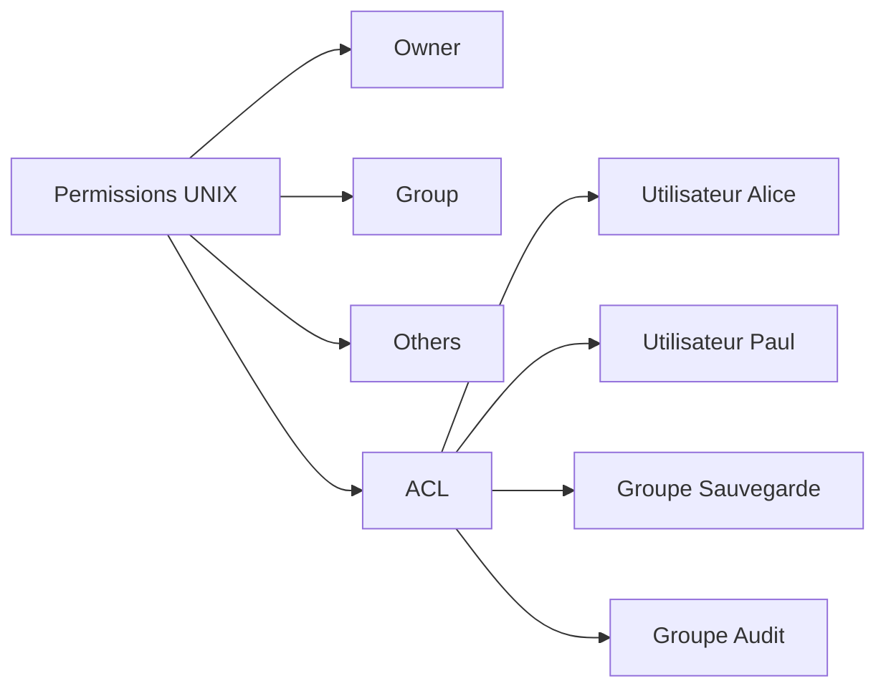
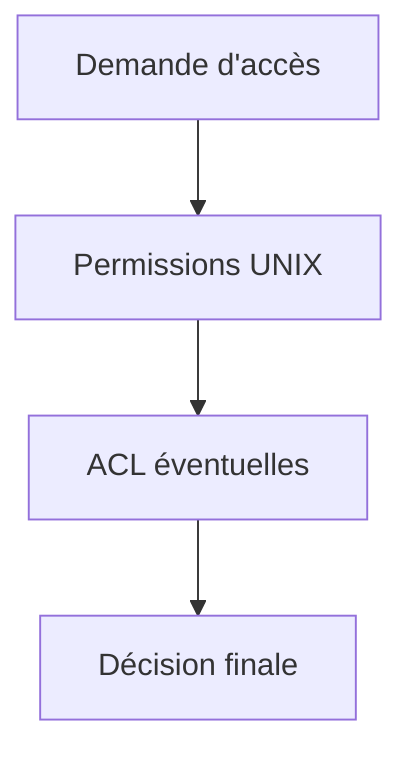
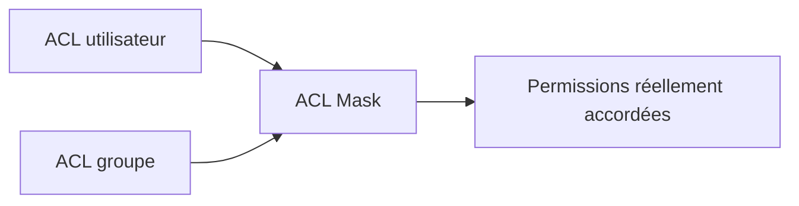
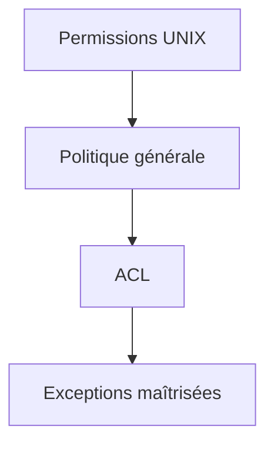
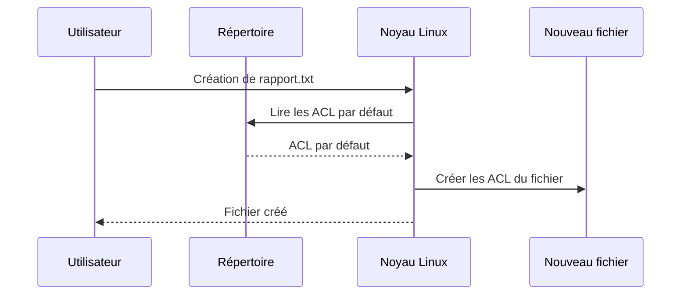
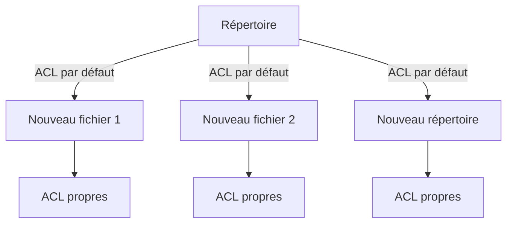
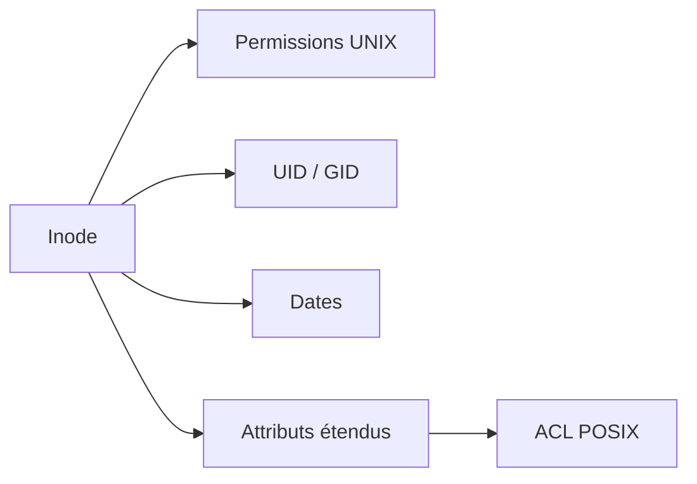
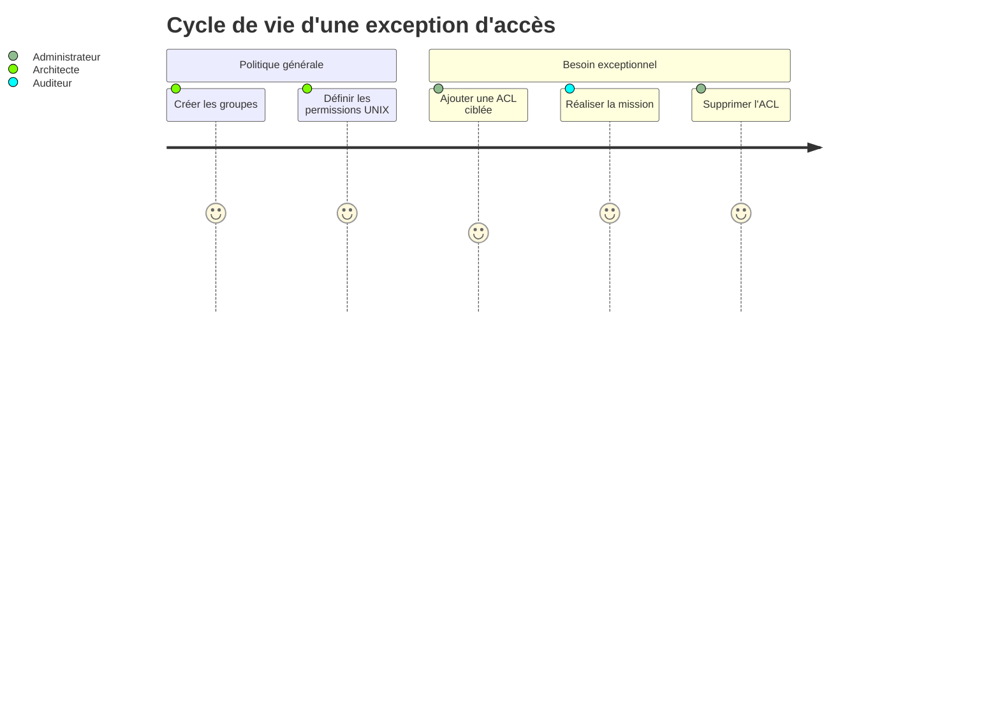

# Chapitre 2.2 — Les ACL

> **Campagne 2 — Contrôle des accès**

> *« La simplicité est une qualité. Jusqu'au jour où elle devient une limite. »*

---

## Vous êtes ici

```text
PARTIE I — Construire un socle sécurisé

Campagne 1  [██████████] ✔
Campagne 2  [██░░░░░░░░]

      2.1 Les permissions UNIX ✔
   ►  2.2 ACL
      2.3 umask
      2.4 Attributs étendus
      2.5 PAM
      2.6 Politique de mots de passe
      2.7 Comptes système
      2.8 sudo avancé
      2.9 passwd / shadow / group
      2.10 Synthèse
```

---

## Objectifs pédagogiques

À la fin de ce chapitre, vous serez capable de :

- comprendre pourquoi les ACL ont été introduites dans Linux ;
- identifier les limites des permissions UNIX classiques ;
- expliquer le fonctionnement d'une Access Control List ;
- lire et interpréter une ACL ;
- utiliser les commandes `getfacl` et `setfacl` ;
- créer des ACL pour des utilisateurs et des groupes ;
- comprendre la notion de masque (*ACL Mask*) ;
- mettre en place des ACL par défaut sur des répertoires.

---

## Pourquoi ce chapitre existe

Les permissions UNIX ont traversé plus d'un demi-siècle.

Elles sont toujours utilisées.

Elles sont rapides.

Faciles à comprendre.

Extrêmement efficaces.

Alors pourquoi avoir inventé autre chose ?

Parce que les systèmes d'information ont changé.

Dans les années 1970, quelques dizaines d'utilisateurs partageaient un ordinateur.

Aujourd'hui, une entreprise peut compter :

- plusieurs milliers d'utilisateurs ;
- des centaines d'applications ;
- des dizaines d'équipes ;
- des prestataires externes ;
- des robots d'automatisation ;
- des comptes de services.

Les besoins sont devenus beaucoup plus fins.

Prenons un exemple.

Vous possédez un répertoire contenant des documents sensibles.

```text
/projets
```

Le propriétaire est :

```text
alice
```

Le groupe est :

```text
developpeurs
```

Les permissions sont :

```text
drwxrwx---
```

Un nouvel utilisateur rejoint temporairement l'équipe.

Son nom est :

```text
paul
```

Vous souhaitez uniquement lui donner un accès en lecture sur ce répertoire.

Sans modifier :

- le propriétaire ;
- le groupe ;
- les autres utilisateurs.

Le modèle UNIX classique ne sait pas exprimer cette règle.

Il ne connaît que trois catégories.

- propriétaire ;
- groupe ;
- autres.

Paul n'appartient à aucune de ces catégories.

Nous avons besoin d'un mécanisme plus précis.

C'est exactement ce que proposent les ACL.

---

## Une liste d'autorisations supplémentaire

Une ACL peut être vue comme une extension des permissions UNIX.

Les permissions classiques restent présentes.

Mais Linux peut désormais ajouter une liste de règles complémentaires.

On peut représenter cette évolution ainsi.



Le fichier conserve toujours son propriétaire.

Il conserve toujours son groupe.

Il conserve toujours ses permissions traditionnelles.

Les ACL viennent simplement ajouter des exceptions.

Cette approche présente un avantage majeur.

Les anciens programmes continuent de fonctionner sans modification.

Les nouvelles fonctionnalités restent compatibles avec le modèle UNIX historique.

---

## Les permissions UNIX ne disparaissent pas

Une erreur fréquente consiste à croire que les ACL remplacent les permissions UNIX.

Ce n'est pas le cas.

Les permissions classiques constituent toujours la base.

Les ACL s'y ajoutent.

On peut imaginer le raisonnement du noyau de cette manière.



Les deux mécanismes collaborent.

Ils ne sont pas concurrents.

C'est une idée essentielle.

Tout au long de ce chapitre, nous continuerons donc à raisonner d'abord avec les permissions UNIX.

Les ACL viendront ensuite affiner cette première décision.

---

## Une première analogie

Imaginons une entreprise.

Le service informatique possède un bureau.

Pour entrer dans ce bureau, il existe une règle générale.

```text
Les membres du service informatique sont autorisés.
```

C'est l'équivalent des permissions UNIX.

Puis le responsable ajoute une note sur la porte.

```text
Paul peut également entrer.
```

Paul ne rejoint pas officiellement le service informatique.

Il bénéficie simplement d'une autorisation particulière.

Cette note correspond à une ACL.

Le fonctionnement est très similaire.

Les règles générales restent en place.

Quelques exceptions viennent les compléter.

---

## Observer une ACL

Créons un fichier.

```bash
touch rapport.txt
```

Affichons ses permissions.

```bash
ls -l
```

Par exemple :

```text
-rw-r--r--
```

Affichons maintenant ses ACL.

```bash
getfacl rapport.txt
```

Le résultat ressemble à ceci.

```text
# file: rapport.txt
# owner: alice
# group: alice

user::rw-
group::r--
other::r--
```

Cette sortie est très intéressante.

Elle reprend exactement les permissions UNIX.

Pourquoi ?

Parce qu'en réalité, Linux les représente déjà sous forme d'ACL internes.

Lorsque vous n'avez ajouté aucune règle particulière, les deux visions sont équivalentes.

Les ACL deviennent réellement intéressantes lorsque l'on ajoute des entrées supplémentaires.

---

## Ajouter un utilisateur spécifique

Imaginons maintenant que l'utilisateur :

```text
backup
```

doive pouvoir lire ce fichier.

Sans modifier le groupe.

Sans changer le propriétaire.

Il suffit d'ajouter une entrée ACL.

```bash
setfacl -m u:backup:r rapport.txt
```

Observons à nouveau le résultat.

```bash
getfacl rapport.txt
```

Cette fois :

```text
user::rw-
user:backup:r--
group::r--
mask::r--
other::r--
```

Une nouvelle ligne est apparue.

```text
user:backup:r--
```

Le propriétaire du fichier n'a pas changé.

Le groupe n'a pas changé.

Les permissions UNIX visibles dans `ls -l` restent presque identiques.

Pourtant, un nouvel utilisateur dispose désormais d'un droit supplémentaire.

C'est toute la puissance des ACL.

---
## Lire une ACL pas à pas

Au premier abord, la sortie de `getfacl` peut sembler plus complexe que celle de `ls -l`.

En réalité, elle suit une logique très régulière.

Reprenons notre exemple.

```text
# file: rapport.txt
# owner: alice
# group: alice

user::rw-
user:backup:r--
group::r--
mask::r--
other::r--
```

Chaque ligne possède une signification précise.

Les trois premières lignes sont des informations.

```text
# file
```

désigne le fichier.

```text
# owner
```

indique son propriétaire.

```text
# group
```

désigne son groupe.

Viennent ensuite les véritables règles d'accès.

```text
user::rw-
```

Cette ligne représente le propriétaire du fichier.

Elle correspond exactement au bloc **Owner** des permissions UNIX.

Puis apparaît :

```text
user:backup:r--
```

Cette entrée est une ACL.

Elle concerne uniquement l'utilisateur `backup`.

Ensuite :

```text
group::r--
```

correspond au groupe propriétaire.

Enfin :

```text
other::r--
```

désigne tous les autres utilisateurs.

Une nouvelle ligne attire cependant notre attention.

```text
mask::r--
```

Nous allons bientôt découvrir qu'il s'agit probablement de la partie la plus subtile des ACL.

---

## Le masque ACL

Le mot *mask* surprend souvent.

Pourquoi Linux ajoute-t-il une nouvelle notion alors que les permissions semblaient déjà suffisantes ?

La réponse tient à une idée simple.

Les ACL permettent d'accorder beaucoup de droits.

Le masque permet d'en fixer la limite maximale.

Autrement dit :

> Une ACL peut demander davantage de permissions.

> Le masque décide jusqu'où ces permissions peuvent réellement aller.

On peut représenter cette idée ainsi.



Le masque agit comme un plafond.

Les permissions effectivement obtenues correspondent à l'intersection entre les droits demandés et ceux autorisés par le masque.

---

## Un premier exemple

Prenons un fichier.

```bash
touch secret.txt
```

Ajoutons une ACL.

```bash
setfacl -m u:backup:rwx secret.txt
```

Affichons le résultat.

```text
user::rw-
user:backup:rwx
group::r--
mask::rwx
other::r--
```

Ici, tout paraît cohérent.

Le masque autorise :

```text
rwx
```

L'utilisateur `backup` obtient donc effectivement :

```text
rwx
```

Mais imaginons maintenant que le masque soit modifié.

```bash
setfacl -m m:r-- secret.txt
```

La sortie devient :

```text
user::rw-
user:backup:rwx
group::r--
mask::r--
other::r--
```

La ligne concernant `backup` n'a pas changé.

Pourtant, ses droits effectifs ont changé.

Pourquoi ?

Parce que le masque les limite désormais à :

```text
r--
```

Les droits affichés dans l'entrée ACL représentent les droits **demandés**.

Les droits réellement utilisables sont calculés après application du masque.

---

## Pourquoi ce mécanisme existe-t-il ?

À première vue, ce fonctionnement paraît inutilement compliqué.

Pourquoi ne pas modifier directement chaque ACL ?

La réponse apparaît lorsqu'un fichier possède de nombreuses entrées.

Imaginons :

```text
user:backup
user:auditeur
user:supervision
group:admins
group:developpeurs
group:qualite
```

Supposons que l'on souhaite rendre temporairement tous ces accès non modifiables.

Sans masque, il faudrait modifier chaque entrée individuellement.

Avec le masque, une seule opération suffit.

```text
mask::r--
```

Toutes les ACL concernées deviennent immédiatement limitées à la lecture.

Le masque joue donc un rôle comparable à un interrupteur général.

Il simplifie considérablement l'administration.

---

## Les permissions affichées par `ls -l`

Voici une situation qui déroute presque tous les administrateurs lors de leur première rencontre avec les ACL.

Créons une ACL.

```bash
setfacl -m u:backup:r rapport.txt
```

Puis exécutons :

```bash
ls -l
```

Le résultat est légèrement différent.

```text
-rw-r--r--+
```

Un caractère supplémentaire est apparu.

```text
+
```

Ce symbole est extrêmement important.

Il indique simplement :

> « Des ACL supplémentaires existent sur ce fichier. »

Il ne donne aucun détail.

Pour connaître leur contenu, il faut utiliser :

```bash
getfacl
```

Ainsi, un administrateur expérimenté remarque immédiatement ce `+`.

Il sait alors que la simple lecture des permissions UNIX ne suffit plus.

---

## Les ACL sur les répertoires

Les ACL ne concernent pas uniquement les fichiers.

Elles peuvent également être appliquées aux répertoires.

Prenons l'exemple suivant.

```text
/projets
```

Nous souhaitons que l'utilisateur :

```text
backup
```

puisse consulter son contenu.

Sans appartenir au groupe propriétaire.

Une simple commande suffit.

```bash
setfacl -m u:backup:rx /projets
```

Le noyau appliquera ensuite cette règle lors de chaque tentative d'accès à ce répertoire.

Les permissions UNIX restent présentes.

Les ACL viennent simplement ajouter une nouvelle possibilité.

---

### 💎 Le point d'expertise

Le masque ACL ne limite **pas** le propriétaire (`user::`).

Il s'applique uniquement :

- aux utilisateurs nommés dans une ACL (`user:nom`) ;
- aux groupes (`group::` et `group:nom`).

Cette distinction est importante.

Le propriétaire conserve toujours les permissions indiquées dans l'entrée :

```text
user::
```

Même si le masque est plus restrictif.

Cette règle évite qu'un propriétaire perde accidentellement la maîtrise de son propre fichier à cause d'une modification du masque.

En revanche, tous les autres utilisateurs bénéficiant d'ACL peuvent voir leurs droits réduits sans que leurs entrées individuelles soient modifiées.

C'est un comportement très élégant, mais également une source fréquente d'incompréhension lorsque l'on débute avec les ACL.

---
### 🧠 Comment pense un architecte ?

Un architecte considère les ACL comme un **outil de précision**.

Il ne les utilise pas pour corriger une mauvaise conception.

Il les utilise pour traiter les exceptions.

Imaginons une entreprise.

Le service « Développement » possède un répertoire.

```text
/projets/developpement
```

Tous les développeurs doivent y accéder.

Les permissions UNIX suffisent parfaitement.

Puis apparaît un nouveau besoin.

L'équipe Sécurité doit uniquement consulter les journaux produits par l'application.

Faut-il modifier le groupe du répertoire ?

Non.

Faut-il intégrer l'équipe Sécurité au groupe des développeurs ?

Encore moins.

Ce serait contraire au principe du moindre privilège.

L'architecte ajoute alors une ACL spécifique.

Elle répond exactement au besoin.

Rien de plus.

Rien de moins.

On peut résumer cette philosophie ainsi :



Une bonne architecture repose sur des règles générales simples.

Les ACL ne doivent jamais devenir la règle.

Elles doivent rester l'exception.

Si un administrateur ajoute des dizaines d'ACL sur chaque fichier, c'est souvent le symptôme d'une organisation des utilisateurs ou des groupes qui mérite d'être repensée.

---

### ⚔️ Comment pense un attaquant ?

Les ACL intéressent également les attaquants.

Pourquoi ?

Parce qu'elles sont parfois oubliées.

De nombreux administrateurs vérifient uniquement :

```bash
ls -l
```

Ils constatent :

```text
-rw-------
```

Ils concluent :

> « Ce fichier est bien protégé. »

Pourtant, un simple :

```bash
getfacl
```

peut révéler :

```text
user:backup:r--
user:test:r--
user:stagiaire:r--
```

Le fichier est beaucoup plus exposé qu'il n'y paraît.

Un attaquant connaît cette possibilité.

Il inspectera systématiquement les ACL lorsqu'il réalise une phase de reconnaissance sur un système compromis.

À l'inverse, un défenseur doit intégrer ce réflexe dans ses audits.

Une politique de sécurité ne se limite jamais à ce que montre `ls -l`.

---

### 📚 Culture technique

Les ACL utilisées sous Linux sont définies par la norme **POSIX.1e**.

Fait intéressant, cette norme n'a jamais été finalisée.

Le projet POSIX.1e a été abandonné avant son adoption officielle.

Pourtant, son modèle d'ACL était suffisamment pertinent pour être repris par de nombreux systèmes UNIX et Linux.

Aujourd'hui encore, lorsqu'on parle d'ACL POSIX sous Linux, on fait référence à une spécification qui est restée à l'état de projet.

À ne pas confondre avec les ACL utilisées dans certains systèmes de fichiers comme NTFS ou NFSv4.

Ces dernières sont beaucoup plus riches.

Elles permettent notamment :

- des permissions de refus explicites (*deny*) ;
- un héritage très élaboré ;
- des dizaines de droits distincts.

Les ACL POSIX sont volontairement plus simples.

Elles s'intègrent naturellement au modèle historique des permissions UNIX.

---

### ⚠️ Piège classique

Le piège le plus fréquent consiste à multiplier les ACL jusqu'à rendre la politique de sécurité illisible.

Prenons un exemple.

Un répertoire possède :

- huit utilisateurs nommés ;
- six groupes ;
- plusieurs ACL par défaut ;
- un masque restrictif.

Quelques mois plus tard, plus personne ne sait réellement qui peut accéder aux fichiers.

Le système fonctionne.

Mais la politique est devenue incompréhensible.

Une règle simple peut aider.

> Si vous avez besoin d'ajouter une ACL à presque tous les fichiers d'un répertoire, il est probablement temps de revoir votre stratégie de groupes.

Les groupes représentent les règles générales.

Les ACL représentent les exceptions.

Mélanger ces deux niveaux conduit souvent à une administration difficile et à des erreurs de sécurité.

---

## Laboratoire AlmaLinux

Dans ce laboratoire, nous allons créer nos premières ACL.

Commençons par créer un utilisateur dédié.

```bash
sudo useradd backup
```

Créons ensuite un fichier de démonstration.

```bash
touch rapport.txt
```

Observons son état initial.

```bash
ls -l rapport.txt
```

Puis :

```bash
getfacl rapport.txt
```

Ajoutons maintenant une ACL.

```bash
setfacl -m u:backup:r rapport.txt
```

Vérifions le résultat.

```bash
ls -l rapport.txt
```

Vous remarquerez l'apparition du caractère :

```text
+
```

Affichons ensuite les ACL.

```bash
getfacl rapport.txt
```

Vous devriez observer une sortie proche de celle-ci.

```text
user::rw-
user:backup:r--
group::r--
mask::r--
other::r--
```

Supprimons maintenant cette ACL.

```bash
setfacl -x u:backup rapport.txt
```

Puis vérifions à nouveau.

```bash
getfacl rapport.txt
```

Le fichier retrouve sa représentation initiale.

Cette manipulation est volontairement simple.

L'objectif est de vous familiariser avec les outils avant de construire des politiques plus élaborées.

---

## Les ACL par défaut

Jusqu'à présent, nous avons ajouté des ACL sur des fichiers existants.

Mais imaginons un répertoire partagé.

Chaque jour, de nouveaux fichiers y sont créés.

Faudra-t-il ajouter une ACL manuellement sur chacun d'eux ?

Heureusement, non.

Linux permet de définir des **ACL par défaut** (*Default ACLs*).

Elles ne s'appliquent pas au répertoire lui-même.

Elles servent de modèle pour tous les nouveaux objets créés à l'intérieur.

Prenons un répertoire de travail.

```bash
mkdir projets
```

Nous souhaitons que tout nouveau fichier créé dans ce répertoire accorde automatiquement un accès en lecture au compte `backup`.

Il suffit de définir une ACL par défaut.

```bash
setfacl -d -m u:backup:r projets
```

L'option :

```text
-d
```

signifie :

> « Cette règle est un modèle d'héritage, pas une permission immédiate. »

À partir de cet instant, chaque nouveau fichier créé dans `projets` héritera automatiquement de cette ACL.

Nous verrons dans la suite du chapitre comment cet héritage fonctionne précisément, et quelles sont ses interactions avec l'`umask` et les permissions classiques.

## Comment fonctionne l'héritage des ACL ?

Le mot *héritage* peut laisser penser que les ACL se propagent en permanence.

Ce n'est pas le cas.

Sous Linux, les **ACL par défaut** sont utilisées **uniquement au moment de la création** d'un nouvel objet.

Prenons un exemple.

Un répertoire possède la configuration suivante.

```text
projets/
```

ACL par défaut :

```text
default:user:backup:r--
```

Lorsqu'un utilisateur crée un nouveau fichier :

```bash
touch projets/rapport.txt
```

le noyau consulte les ACL par défaut du répertoire.

Il construit alors les ACL du nouveau fichier.

Une fois cette opération terminée, les deux objets deviennent indépendants.

On peut représenter ce mécanisme ainsi.



Si, quelques heures plus tard, vous modifiez les ACL par défaut du répertoire, les fichiers déjà créés ne seront pas modifiés.

Seules les créations futures utiliseront la nouvelle politique.

Cette distinction est essentielle.

---

## Observer les ACL par défaut

Créons un répertoire.

```bash
mkdir partage
```

Ajoutons une ACL par défaut.

```bash
setfacl -d -m u:backup:r partage
```

Affichons ensuite les ACL.

```bash
getfacl partage
```

La sortie ressemble à ceci.

```text
user::rwx
group::r-x
other::r-x

default:user::rwx
default:user:backup:r--
default:group::r-x
default:mask::r-x
default:other::r-x
```

Les lignes commençant par :

```text
default:
```

ne décrivent pas les permissions actuelles du répertoire.

Elles décrivent le modèle qui sera utilisé pour les futurs objets créés à l'intérieur.

C'est une différence importante.

---

## ACL et création d'un nouveau fichier

Créons maintenant un fichier.

```bash
touch partage/compte-rendu.txt
```

Puis observons-le.

```bash
getfacl partage/compte-rendu.txt
```

Vous constaterez que l'utilisateur `backup` apparaît désormais dans les ACL du fichier.

Pourtant, nous ne lui avons jamais appliqué directement une ACL.

Elle provient du répertoire parent.

L'héritage a joué son rôle au moment de la création.

On peut représenter cette propagation de la manière suivante.



Chaque nouvel objet reçoit une copie.

Par la suite, chacun évolue indépendamment.

---

## Les ACL ne remplacent pas l'`umask`

Un autre point mérite d'être clarifié.

Lorsque nous créerons un fichier, deux mécanismes interviendront.

Le premier est l'`umask`.

Le second est l'ACL par défaut.

Ces deux mécanismes collaborent.

Ils ne s'excluent pas.

On peut représenter la création d'un fichier ainsi.


Dans le prochain chapitre, nous étudierons précisément le rôle de l'`umask`.

Vous comprendrez alors pourquoi les permissions d'un fichier nouvellement créé ne correspondent pas toujours exactement à ce que l'on attend.

---

## Les systèmes de fichiers compatibles

Toutes les ACL ne sont pas disponibles sur tous les systèmes de fichiers.

Sous AlmaLinux, les principaux systèmes de fichiers utilisés en production prennent en charge les ACL POSIX.

Par exemple :

- XFS ;
- ext4.

C'est l'une des raisons pour lesquelles XFS est le système de fichiers par défaut sur les distributions RHEL et AlmaLinux.

Les ACL y sont parfaitement intégrées.

Dans la plupart des installations modernes, aucune configuration supplémentaire n'est nécessaire.

En revanche, dans des environnements plus anciens ou avec certains systèmes de fichiers particuliers, il pouvait être nécessaire d'activer explicitement la prise en charge des ACL au montage.

Aujourd'hui, cette situation est devenue rare.

---

### 💎 Le point d'expertise

Les ACL sont stockées dans les **attributs étendus** (*Extended Attributes*, ou **xattr**) du système de fichiers.

Elles ne font donc pas partie des métadonnées traditionnelles de l'inode, comme les permissions UNIX, le propriétaire ou les dates.

Schématiquement :



Cette architecture présente plusieurs avantages.

Elle permet d'ajouter de nouvelles métadonnées sans modifier le format historique des inodes.

C'est également ce mécanisme qui sera utilisé plus tard par d'autres fonctionnalités, notamment certaines informations de sécurité ou des métadonnées spécifiques à des applications.

Nous consacrerons un chapitre entier aux attributs étendus (xattr) dans la section **2.4**, car ils constituent une brique importante de l'écosystème Linux moderne.

> **Note de précision**
>
> Selon le système de fichiers, les ACL peuvent être implémentées de manière légèrement différente en interne. Sous Linux, elles sont généralement exposées via des attributs étendus (`system.posix_acl_access` et `system.posix_acl_default`), ce qui constitue le modèle que l'administrateur rencontre en pratique.

---
### 🧠 Comment pense un architecte ?

Un architecte ne voit pas les ACL comme un moyen d'éviter de créer des groupes.

Au contraire.

Il commence toujours par construire une organisation cohérente des utilisateurs et des groupes.

Les ACL interviennent uniquement lorsque cette organisation ne permet plus d'exprimer un besoin particulier.

Prenons un exemple.

Une entreprise possède les équipes suivantes.

```text
Développement
Production
Sécurité
Support
```

Chaque équipe dispose de son propre groupe Linux.

Les permissions UNIX permettent déjà de couvrir l'immense majorité des besoins.

Puis apparaît une demande exceptionnelle.

L'équipe d'audit doit consulter les journaux d'une seule application pendant deux semaines.

Créer un nouveau groupe pour ce besoin ponctuel serait disproportionné.

Modifier les permissions du répertoire exposerait inutilement les journaux.

L'architecte ajoute alors une ACL temporaire.

Une fois la mission terminée, cette ACL est supprimée.



Les ACL deviennent ainsi un outil de gestion des exceptions.

Elles ne remplacent jamais une bonne conception des groupes.

---

### ⚔️ Comment pense un attaquant ?

Un attaquant apprécie les systèmes où les ACL sont nombreuses.

Non pas parce qu'elles sont faibles.

Mais parce qu'elles sont parfois oubliées.

Prenons un répertoire partagé.

```text
/projets
```

Après plusieurs années d'exploitation, il contient :

- des ACL pour d'anciens prestataires ;
- des ACL créées lors d'un incident ;
- des ACL ajoutées pour un audit ;
- des ACL oubliées après une migration.

L'administrateur consulte :

```bash
ls -l
```

Tout semble normal.

L'attaquant, lui, lance immédiatement :

```bash
getfacl -R /projets
```

Son objectif est simple.

Trouver un utilisateur qui possède encore un accès alors qu'il ne devrait plus en avoir.

Une ACL oubliée est souvent plus discrète qu'un fichier mal protégé.

Elle attire moins l'attention.

C'est précisément ce qui la rend intéressante pour un attaquant.

---

### 📚 Culture technique

Les ACL POSIX sont volontairement limitées.

Par exemple, elles ne permettent pas d'exprimer directement une règle du type :

> « Cet utilisateur ne doit jamais accéder à ce fichier. »

Autrement dit, il n'existe pas de notion de **refus explicite** (*deny*).

Les ACL POSIX accordent des droits.

Elles ne créent pas de règles de refus.

Cette philosophie est très différente de celle des ACL NTFS utilisées sous Windows.

Dans NTFS, une règle de refus explicite peut prendre le pas sur une règle d'autorisation.

Sous Linux, la logique est plus simple.

On détermine les droits effectivement accordés.

Tout ce qui n'est pas autorisé est implicitement interdit.

Cette approche réduit la complexité de l'évaluation.

Elle évite également certains conflits de règles.

---

### ⚠️ Piège classique

L'une des erreurs les plus fréquentes consiste à oublier les ACL lors d'une sauvegarde ou d'une copie.

Prenons cet exemple.

```bash
cp rapport.txt sauvegarde/
```

Selon les options utilisées, la copie peut perdre :

- ses ACL ;
- certains attributs étendus ;
- d'autres métadonnées.

Le fichier semble identique.

Son contenu est identique.

Mais sa politique de sécurité ne l'est plus.

Pour préserver les ACL lors d'une copie, il est préférable d'utiliser des outils ou des options adaptés.

Par exemple :

```bash
cp -a
```

ou encore :

```bash
rsync -A
```

Nous reviendrons sur ces commandes dans les chapitres consacrés aux sauvegardes et aux déploiements.

Un bon administrateur ne vérifie jamais uniquement les données copiées.

Il vérifie également les métadonnées.

---

## Laboratoire AlmaLinux

Nous allons maintenant expérimenter les ACL par défaut.

Créons un nouveau répertoire.

```bash
mkdir laboratoire-acl
```

Définissons une ACL par défaut.

```bash
setfacl -d -m u:backup:r laboratoire-acl
```

Créons ensuite deux fichiers.

```bash
touch laboratoire-acl/a.txt
touch laboratoire-acl/b.txt
```

Affichons leurs ACL.

```bash
getfacl laboratoire-acl/a.txt
```

Puis :

```bash
getfacl laboratoire-acl/b.txt
```

Vous constaterez que les deux fichiers possèdent déjà une entrée pour l'utilisateur `backup`.

Essayons maintenant de modifier les ACL par défaut.

```bash
setfacl -d -m u:backup:rw laboratoire-acl
```

Créons un troisième fichier.

```bash
touch laboratoire-acl/c.txt
```

Affichons son ACL.

```bash
getfacl laboratoire-acl/c.txt
```

Comparez-la avec celle de `a.txt`.

Vous remarquerez que :

- `c.txt` hérite de la nouvelle politique ;
- `a.txt` conserve l'ancienne.

Cela confirme que l'héritage intervient uniquement lors de la création.

---

## Impact sur Sentinel

Au fil de cette formation, Sentinel manipulera différents types de ressources.

Certaines devront être accessibles uniquement au compte de service.

D'autres devront également être consultables par :

- un compte de sauvegarde ;
- un agent de supervision ;
- un outil d'audit ;
- un administrateur.

Les ACL permettront de répondre à ces besoins sans modifier les groupes principaux.

Prenons un exemple.

```text
/var/log/sentinel/
```

Les journaux sont écrits par le service Sentinel.

L'équipe d'exploitation doit pouvoir les consulter.

Le logiciel de sauvegarde doit également y accéder.

En revanche :

- il ne doit pas pouvoir modifier les journaux ;
- il ne doit pas appartenir au groupe du service.

Une ACL constitue alors une solution élégante.

Elle évite d'élargir inutilement les privilèges du compte de sauvegarde.

Cette approche est très courante dans les infrastructures d'entreprise.

---

## Synthèse

- Les ACL complètent les permissions UNIX ; elles ne les remplacent pas.
- Elles permettent d'accorder des droits à des utilisateurs ou à des groupes nommés sans modifier le propriétaire ni le groupe principal.
- Le caractère `+` affiché par `ls -l` indique la présence d'ACL supplémentaires.
- Les commandes principales sont `getfacl` pour consulter les ACL et `setfacl` pour les créer, les modifier ou les supprimer.
- Le masque ACL (`mask`) fixe la limite maximale des permissions accordées aux utilisateurs et groupes définis dans les ACL (à l'exception du propriétaire).
- Les ACL par défaut servent de modèle lors de la création de nouveaux fichiers et répertoires.
- Les ACL doivent rester des exceptions. Une politique reposant essentiellement sur des ACL est souvent le signe qu'une meilleure organisation des groupes est nécessaire.

---

## Infographie de révision

```text
                           LES ACL POSIX

                  Permissions UNIX classiques
                            │
                            ▼
        ┌──────────────────────────────────────────┐
        │  Owner │ Group │ Others                  │
        └──────────────────────────────────────────┘
                            │
                 Suffisant dans la majorité
                      des situations
                            │
                            ▼
               Besoin d'une exception ?
                            │
                 ┌──────────┴──────────┐
                 │                     │
               Non                   Oui
                 │                     │
                 ▼                     ▼
      Conserver les permissions     Ajouter une ACL
           UNIX uniquement        (utilisateur ou groupe)

────────────────────────────────────────────────────────────

                 Une ACL complète contient :

    user::          → Propriétaire
    user:nom:       → Utilisateur nommé
    group::         → Groupe propriétaire
    group:nom:      → Groupe nommé
    mask::          → Limite maximale des droits
    other::         → Tous les autres utilisateurs

────────────────────────────────────────────────────────────

                 Héritage des ACL par défaut

         Répertoire
      (Default ACL)
             │
             │ Création d'un fichier
             ▼
     Nouveau fichier
     ├── Copie des ACL
     └── Évolution indépendante

────────────────────────────────────────────────────────────

              Philosophie d'utilisation

        Permissions UNIX  → Règles générales

                 +
                 │
                 ▼

              ACL POSIX   → Exceptions ciblées

────────────────────────────────────────────────────────────

      Une bonne architecture utilise peu d'ACL...
      ...mais les utilise exactement là où elles
      apportent une réelle valeur.
```
## Pour aller plus loin

Grâce aux ACL, nous savons désormais répondre à une question importante.

> « Qui peut accéder à une ressource déjà existante ? »

Mais une autre question apparaît immédiatement.

Que se passe-t-il lorsqu'un **nouveau fichier** est créé ?

Prenons un exemple très simple.

Deux utilisateurs exécutent exactement la même commande.

```bash
touch rapport.txt
```

Pourtant, les permissions obtenues peuvent être différentes.

Pourquoi ?

Le fichier n'existait pas une seconde auparavant.

Qui a choisi ses permissions ?

L'application ?

Le noyau ?

Le système de fichiers ?

L'utilisateur ?

En réalité, plusieurs mécanismes interviennent.

L'un d'eux est particulièrement important.

Il s'appelle **l'`umask`**.

Contrairement aux permissions UNIX ou aux ACL, l'`umask` ne contrôle pas l'accès à un fichier existant.

Il intervient **au moment de la création**.

Son rôle est discret.

Pourtant, il influence quotidiennement tous les fichiers créés sur un système Linux.

Comprendre son fonctionnement est indispensable pour éviter de créer, sans le vouloir, des fichiers trop permissifs.

Dans le prochain chapitre, nous allons découvrir comment Linux décide des permissions initiales d'un nouveau fichier et pourquoi cette décision est bien plus subtile qu'il n'y paraît.

---

← [2.1 — Les permissions UNIX](2.1-permissions-unix.md) · [2.3 — L'`umask`](2.3-umask.md) →
