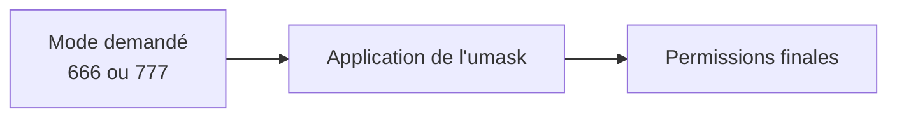
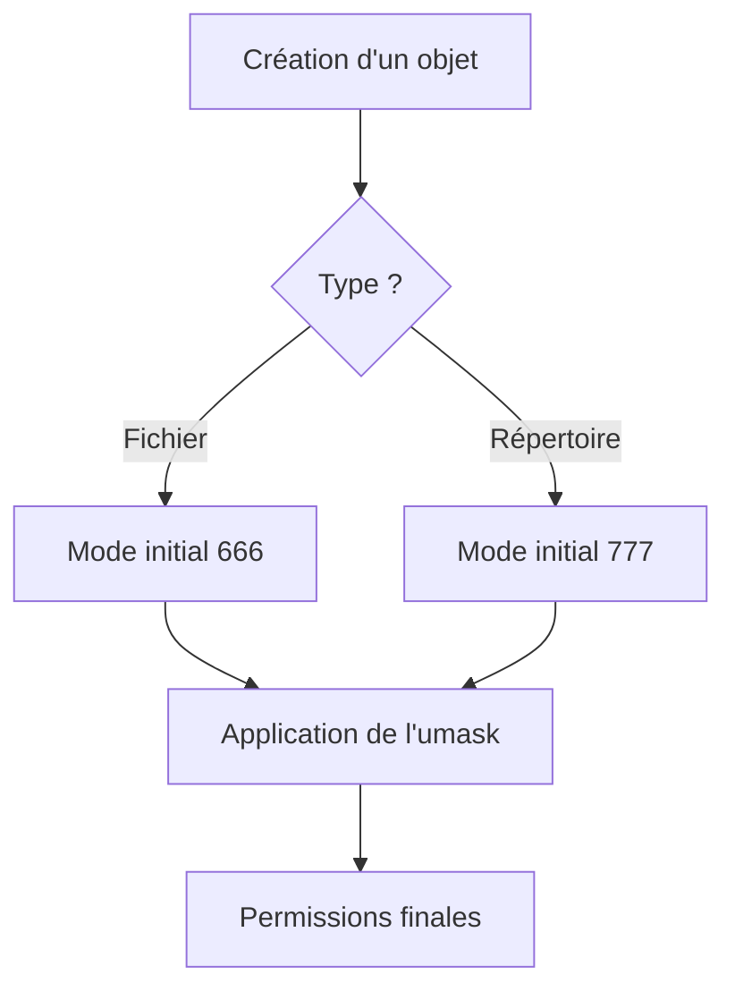
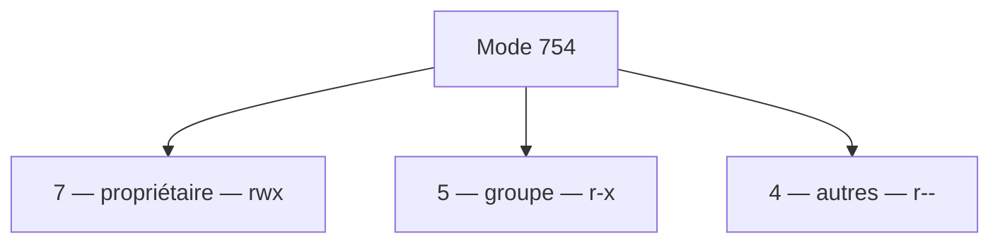
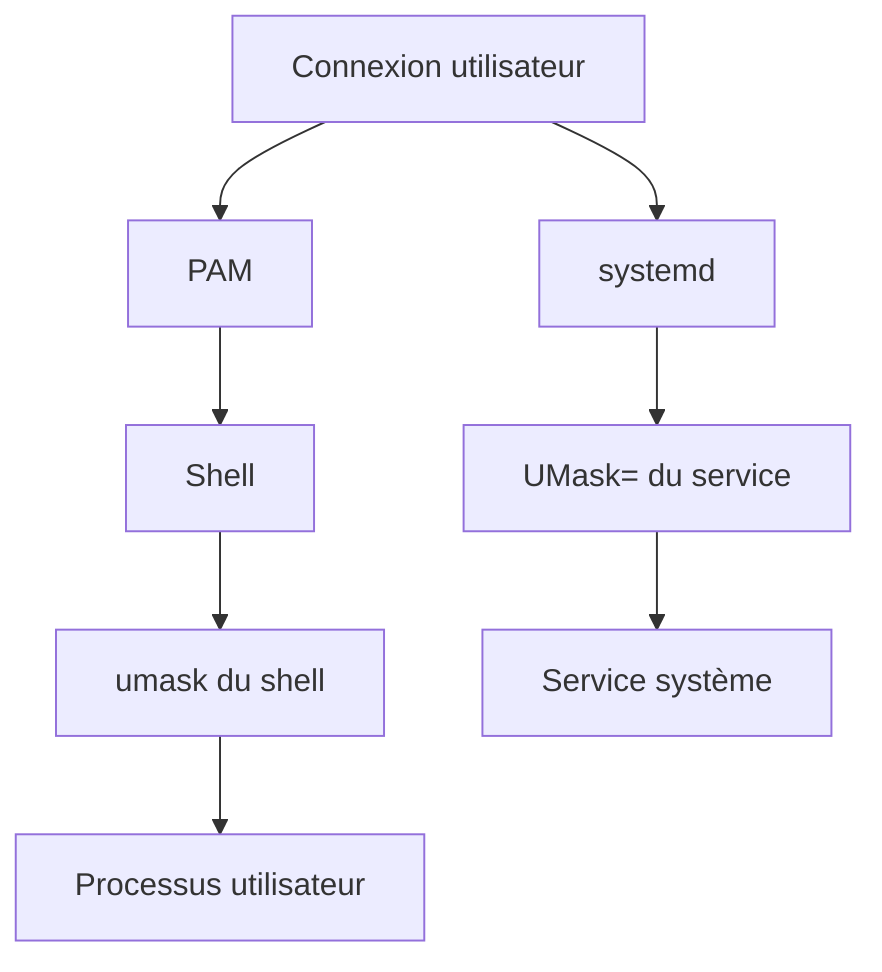
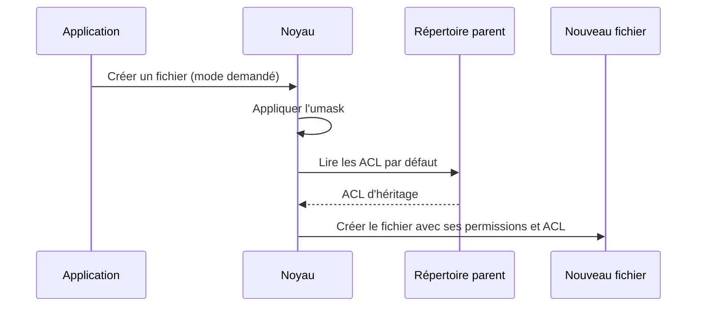
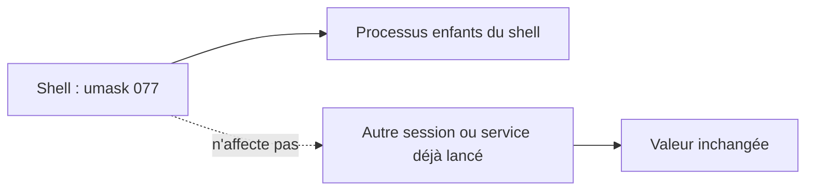

# Chapitre 2.3 — L'`umask`

> **Campagne 2 — Contrôle des accès**

> *« Le meilleur moyen de protéger un fichier est souvent de ne jamais lui accorder de permissions inutiles dès sa création. »*

## Vous êtes ici

```text
PARTIE I — Construire un socle sécurisé

Campagne 1  [██████████] ✔
Campagne 2  [███░░░░░░░]

      2.1 Les permissions UNIX ✔
      2.2 ACL ✔
   ►  2.3 umask
      2.4 Attributs étendus
      2.5 PAM
      2.6 Politique de mots de passe
      2.7 Comptes système
      2.8 sudo avancé
      2.9 passwd / shadow / group
      2.10 Synthèse
```

## Objectifs pédagogiques

À la fin de ce chapitre, vous serez capable de :

- comprendre le rôle exact de l'`umask` ;
- expliquer pourquoi les permissions d'un fichier nouvellement créé ne sont pas toujours celles attendues ;
- calculer les permissions résultantes ;
- modifier temporairement ou durablement une `umask` ;
- comprendre l'interaction entre l'`umask`, les ACL par défaut et les applications ;
- définir une politique de création de fichiers adaptée à un environnement professionnel.

## Pourquoi ce chapitre existe

Nous avons appris à lire les permissions. Nous savons maintenant les modifier. Nous savons également créer des ACL. Mais une question demeure. Prenons cette commande.

```bash
touch document.txt
```

Le fichier apparaît immédiatement. Observons ses permissions.

```bash
-rw-r--r--
```

Pourquoi ces permissions ? Pourquoi pas : `-rwxrwxrwx` Ou : `-r--------` Qui a pris cette décision ? À première vue, on pourrait penser que c'est `touch`. Pourtant, remplaçons `touch` par un programme Python.

```python
open("document.txt", "w")
```

Le résultat est pratiquement identique. Essayons maintenant avec :

- `vim` ;
- `nano` ;
- `cp` ;
- `tar`.

Les permissions initiales restent cohérentes. Ce n'est donc pas chaque application qui décide individuellement. Il existe une règle commune. Cette règle est l'`umask`.

## Une idée contre-intuitive

Le nom **umask** est souvent mal interprété. Beaucoup pensent qu'il s'agit des permissions qui seront accordées. C'est l'inverse. L'`umask` indique les permissions qui seront **retirées**. Autrement dit :

> L'`umask` ne dit pas ce qu'il faut autoriser.

> Elle indique ce qu'il faut interdire.

C'est une différence fondamentale.

## Pourquoi avoir conçu l'`umask` de cette manière ?

Revenons quelques décennies en arrière. Imaginons un programme. Il crée un fichier. Le développeur souhaite généralement obtenir un fichier pleinement utilisable. Il demande donc : `rw-rw-rw-` Autrement dit : `666` Pourquoi pas : `777` Parce qu'un fichier ordinaire n'a normalement aucune raison d'être exécutable dès sa création. Pour un répertoire, la situation est différente. Afin de pouvoir y entrer et y créer des fichiers, il demande généralement : `rwxrwxrwx` soit : `777` À partir de là, intervient l'`umask`.

Elle retire les permissions jugées excessives. On peut représenter ce principe de la manière suivante.



L'`umask` agit comme un filtre. Elle ne crée jamais de nouvelles permissions. Elle ne fait qu'en supprimer.

## Le mode demandé par l'application

Voici un détail que beaucoup d'administrateurs découvrent assez tard. L'`umask` ne travaille jamais seule. Elle agit toujours sur un **mode initial** fourni par l'application. Dans la grande majorité des cas :

| Objet créé | Mode demandé |
|------------|-------------:|
| Fichier | `666` |
| Répertoire | `777` |

Pourquoi cette différence ? Parce qu'un fichier n'a pas besoin du bit d'exécution pour être créé. Un répertoire, en revanche, a besoin du droit de traversée (`x`) pour être utilisable. C'est pourquoi les deux valeurs de départ sont différentes. Nous pouvons résumer ce comportement ainsi.



Cette distinction est essentielle pour comprendre les calculs qui suivent.

## Une première `umask`

Affichons la valeur actuelle.

```bash
umask
```

Vous obtiendrez probablement quelque chose comme : `0022` ou : `0002` À première vue, cette valeur ne ressemble pas aux permissions UNIX. Pourtant, elle utilise exactement la même représentation octale. La différence est purement conceptuelle. Les permissions indiquent ce qui est **autorisé**. L'`umask` indique ce qui sera **supprimé**.

## Comprendre la notation octale

Avant d'aller plus loin, nous devons faire un détour par la notation octale. Cette représentation est omniprésente sous Linux. Vous la rencontrerez dans :

- `chmod` ;
- l'`umask` ;
- certains appels système ;
- des scripts shell ;
- du code C ;
- des programmes Python.

Il est donc indispensable de la maîtriser.

## Pourquoi utiliser l'octal ?

Les permissions UNIX sont constituées de trois droits.

- lecture ;
- écriture ;
- exécution.

Chacun de ces droits peut être :

- présent ;
- absent.

Autrement dit, chaque droit peut être représenté par un bit.

```text
Lecture      1 ou 0
Écriture     1 ou 0
Exécution    1 ou 0
```

Nous obtenons donc trois bits. `r w x` Trois bits permettent de représenter exactement huit combinaisons. Or : `2³ = 8` C'est précisément le nombre de chiffres disponibles en base huit. L'octal devient donc une représentation naturelle des permissions.

## De binaire à octal

Observons toutes les combinaisons possibles.

| Binaire | Octal | Permissions |
|---------:|------:|-------------|
| 000 | 0 | `---` |
| 001 | 1 | `--x` |
| 010 | 2 | `-w-` |
| 011 | 3 | `-wx` |
| 100 | 4 | `r--` |
| 101 | 5 | `r-x` |
| 110 | 6 | `rw-` |
| 111 | 7 | `rwx` |

Cette table mérite d'être mémorisée. Avec l'habitude, un administrateur lit immédiatement : `755` comme : `rwxr-xr-x` sans effectuer le moindre calcul.

## Décomposer un nombre octal

Prenons l'exemple : `754` Chaque chiffre correspond à une catégorie.



Développons chaque chiffre.

```text
7 = rwx

5 = r-x

4 = r--
```

Nous obtenons donc : `rwxr-xr--` Le noyau ne voit jamais réellement : `754` Il manipule des bits. L'écriture octale est simplement une représentation plus compacte pour les administrateurs.

## Revenons à l'`umask`

Supposons maintenant : `umask 022` Que signifie ce nombre ? Il ne représente pas les permissions finales. Il représente les permissions qui seront retirées. Découpons-le. `0 2 2` Développons.

```text
0 = ---

2 = -w-

2 = -w-
```

Autrement dit :

```text
Le propriétaire ne perd rien.

Le groupe perd l'écriture.

Les autres perdent l'écriture.
```

Cette lecture est beaucoup plus parlante.

## Calculer les permissions d'un fichier

Prenons un exemple concret. Une application crée un fichier. Mode demandé : `666` L'`umask` vaut : `022` Le calcul consiste à retirer les bits présents dans l'`umask`. On peut le représenter ainsi.

```text
Mode demandé

666

Retirer

022

Résultat

644
```

Autrement dit : `rw-r--r--` C'est précisément ce que l'on observe sur la plupart des distributions Linux.

## Calculer les permissions d'un répertoire

Le raisonnement est identique. Cette fois, le mode demandé est : `777` L'`umask` reste : `022` Le résultat devient :

```text
777

022

↓

755
```

Le répertoire possède alors : `rwxr-xr-x` Ce résultat est extrêmement courant. Vous l'avez probablement déjà rencontré des centaines de fois sans savoir d'où il provenait.

## Pourquoi les fichiers ordinaires ne deviennent-ils pas exécutables par défaut ?

Une question revient régulièrement. Si l'`umask` vaut `000`, pourquoi un fichier créé par `touch` n'obtient-il pas `777` ? Parce que cet outil demande normalement `0666` pour un fichier ordinaire. Même si l'`umask` ne retire rien, le bit d'exécution n'existe pas dans cette demande. Une autre application pourrait demander un mode contenant `x`, mais l'`umask` ne peut jamais ajouter une permission absente du mode demandé.

L'`umask` est un mécanisme de **restriction**, jamais d'ajout.

### Culture technique

Sous Linux, l'`umask` est une propriété du **processus**. Cela signifie que deux programmes exécutés simultanément peuvent utiliser des `umask` différentes. Par exemple :

- votre shell interactif peut utiliser `0022` ;
- un service `systemd` peut utiliser `0027` ;
- un conteneur Podman peut utiliser une autre valeur ;
- un programme peut même modifier sa propre `umask` avant de créer un fichier.

Autrement dit, l'`umask` n'est pas une propriété globale du système. Elle appartient au contexte d'exécution du processus. Cette particularité explique pourquoi deux applications peuvent créer des fichiers avec des permissions différentes sur une même machine. Nous exploiterons cette possibilité lorsque nous étudierons `systemd`, qui permet de définir une `UMask=` spécifique à un service.

### Piège classique

L'une des idées reçues les plus répandues consiste à croire que l'`umask` peut rendre un programme exécutable. Prenons un exemple.

```bash
umask 000
```

Puis :

```bash
touch script.sh
```

Le fichier obtenu sera `-rw-rw-rw-`, et non `-rwxrwxrwx`, parce que `touch` demande au noyau le mode de base `0666`. Pour rendre ensuite un script exécutable, on peut utiliser :

```bash
chmod +x script.sh
```

ou demander explicitement ce droit lors de la création via un appel système approprié.

## TP 1 — Expérimenter sur AlmaLinux

Observons l'effet de différentes valeurs d'`umask`. Affichons la valeur actuelle.

```bash
umask
```

Créons un fichier.

```bash
touch test1.txt
```

Puis vérifions ses permissions.

```bash
ls -l test1.txt
```

Modifions temporairement l'`umask`.

```bash
umask 077
```

Créons un nouveau fichier.

```bash
touch test2.txt
```

Affichons ses permissions.

```bash
ls -l test2.txt
```

Vous devriez observer un résultat proche de : `-rw-------` Essayons maintenant :

```bash
umask 002
```

Créons un troisième fichier.

```bash
touch test3.txt
```

Puis :

```bash
ls -l test3.txt
```

Comparez les trois résultats. Vous constaterez que le comportement de `touch` n'a jamais changé. Seule la politique de retrait des permissions a évolué. Enfin, pensez à rétablir votre configuration initiale. Par exemple :

```bash
umask 022
```

## Où l'`umask` est-elle définie ?

Une question se pose naturellement. D'où vient la valeur affichée par :

```bash
umask
```

La réponse dépend du contexte d'exécution. Plusieurs composants peuvent définir une `umask`. Par exemple :

- le shell de connexion ;
- PAM ;
- `systemd` ;
- un script de démarrage ;
- une application elle-même.

On peut représenter ces différentes sources ainsi.



La valeur utilisée par un processus est celle qu'il hérite de son parent, sauf si elle est modifiée en cours d'exécution. Cette notion d'héritage est commune à de nombreux paramètres des processus Linux.

## L'interaction entre l'`umask` et les ACL

Nous avons étudié ces deux mécanismes séparément. Dans la réalité, ils interviennent souvent ensemble. Lorsqu'un nouveau fichier est créé dans un répertoire possédant des ACL par défaut, plusieurs étapes se succèdent. Le noyau ne choisit pas arbitrairement l'un ou l'autre mécanisme. Il combine leurs effets. Schématiquement, le processus est le suivant.



Les détails de cette interaction peuvent être subtils. Retenez pour l'instant l'idée suivante :

- l'`umask` fixe une politique générale de création ;
- les ACL permettent d'ajouter des règles spécifiques héritées du répertoire.

Ces deux mécanismes sont complémentaires. Ils ne poursuivent pas exactement le même objectif.

## Quelle valeur d'`umask` choisir ?

Il n'existe pas de valeur universelle. Le choix dépend du contexte. Cependant, certaines valeurs sont devenues des standards.

| `umask` | Fichiers créés | Répertoires créés | Usage courant |
|---------:|----------------|-------------------|---------------|
| `000` | `666` | `777` | Très rarement justifiée, extrêmement permissive |
| `002` | `664` | `775` | Travail collaboratif avec groupe partagé |
| `022` | `644` | `755` | Valeur classique sur de nombreuses distributions |
| `027` | `640` | `750` | Serveurs d'entreprise, réduction de l'exposition |
| `077` | `600` | `700` | Données très sensibles, comptes administratifs, clés privées |

On remarque une tendance claire. Plus les données sont sensibles, plus l'`umask` retire de permissions dès la création.

## Pourquoi `0022` est-elle si répandue ?

Pendant longtemps, les systèmes UNIX étaient utilisés par de nombreux utilisateurs partageant la même machine. Il était courant de rendre les fichiers lisibles par tous. En revanche, il était dangereux de les rendre modifiables. L'`umask` : `022` répond précisément à ce besoin. Elle retire uniquement les permissions d'écriture pour :

- le groupe ;
- les autres utilisateurs.

Le propriétaire conserve tous les droits prévus. Le résultat est : `644` pour les fichiers. Et : `755` pour les répertoires. Cette politique reste adaptée à de nombreux environnements. Mais elle n'est plus toujours suffisante pour des infrastructures modernes où les données sont plus sensibles.

## Pourquoi de nombreuses entreprises préfèrent `0027` ou `0077`

Dans un serveur d'entreprise, il est rarement souhaitable que tous les utilisateurs puissent lire automatiquement les nouveaux fichiers. Prenons un exemple. Une application génère un rapport. `rapport-financier.csv` Avec une `umask` : `022` le fichier devient : `644` Tous les utilisateurs locaux peuvent le lire. Ce comportement est rarement souhaitable. Une entreprise choisira souvent : `027` Le résultat devient : `640` Les autres utilisateurs n'ont plus aucun accès.

Cette simple modification réduit considérablement la surface d'exposition des données.

### Culture technique

L'`umask` est apparue très tôt dans l'histoire d'UNIX. À cette époque, les développeurs étaient confrontés à un dilemme. Chaque programme créait des fichiers. Fallait-il demander aux développeurs de choisir systématiquement les bonnes permissions ? Cette solution présentait un risque évident. Chaque logiciel aurait implémenté sa propre logique. Certaines applications auraient été trop permissives. D'autres trop restrictives. Les comportements auraient varié d'un programme à l'autre.

Les concepteurs d'UNIX ont alors fait un choix particulièrement élégant. Ils ont séparé les responsabilités.

- L'application indique les permissions **maximales** dont elle pourrait avoir besoin.
- Le système applique ensuite une politique de sécurité commune grâce à l'`umask`.

Cette séparation est un excellent exemple de conception modulaire. L'application décrit son besoin fonctionnel. Le système applique la politique de sécurité. Ce principe se retrouvera de nombreuses fois dans Linux. Par exemple avec :

- SELinux ;
- les capacités Linux ;
- les politiques PAM ;
- `systemd`.

Chaque couche possède une responsabilité clairement définie.

### Piège classique

Une erreur fréquente consiste à croire que modifier l'`umask` d'un shell modifie tout le système. Prenons un terminal.

```bash
umask 077
```

Puis ouvrons un second terminal.

```bash
umask
```

Il affichera probablement : `022` Pourquoi ? Parce que chaque session possède ses propres processus. Chaque processus hérite de l'`umask` de son parent. Modifier l'`umask` dans un shell n'affecte pas les autres shells déjà ouverts. De même, cela ne modifie pas les services `systemd` déjà démarrés. Autrement dit :



Cette distinction est essentielle lorsqu'on administre un environnement de production.

## TP 2 — Expérimenter sur AlmaLinux

Nous allons vérifier expérimentalement que l'`umask` appartient bien au processus. Ouvrez deux terminaux. Dans le premier :

```bash
umask 077
```

Puis vérifiez.

```bash
umask
```

Résultat : `0077` Dans le second terminal :

```bash
umask
```

Vous constaterez généralement une autre valeur. Par exemple : `0022` Les deux sessions sont indépendantes. Essayons maintenant de créer un fichier dans chaque terminal. Terminal 1 :

```bash
touch secret.txt
ls -l secret.txt
```

Terminal 2 :

```bash
touch public.txt
ls -l public.txt
```

Comparez les permissions obtenues. Vous venez d'observer que deux processus travaillant sur le même système peuvent créer des fichiers avec des politiques différentes. C'est précisément ce qui permet à un service sensible d'utiliser une `UMask=` très restrictive, sans perturber les autres applications du serveur.

## Au-delà du calcul : limites et variantes

Parler de « soustraction » est une aide mnémotechnique qui fonctionne pour les exemples courants, mais l'opération réelle est un masquage de bits : `mode_final = mode_demandé & ~umask`. Une application peut demander moins de droits que `0666` ou `0777` ; l'`umask` ne peut jamais ajouter ce qu'elle n'a pas demandé. Elle n'agit pas non plus rétroactivement sur les objets existants.

Le shell peut afficher la valeur sous forme symbolique avec `umask -S`. Cette vue est lisible, mais attention au sens : elle présente les permissions **conservées**, alors que la valeur octale indique les bits retirés.

```bash
umask
umask -S
```

La valeur est héritée lors de la création d'un processus. Une session interactive peut la recevoir des fichiers de shell ou de PAM ; un service `systemd` peut employer `UMask=` ; une application peut appeler la fonction système `umask()` avant de créer des fichiers sensibles. Pour diagnostiquer une permission initiale surprenante, il faut donc identifier le processus créateur et son environnement, pas seulement lire `/etc/profile`.

Enfin, une ACL par défaut peut modifier le résultat visible. Le noyau combine le mode demandé, l'`umask` et les règles d'héritage ACL : appliquer mentalement uniquement `0666 - 0022` peut alors conduire à une conclusion fausse. `getfacl` reste la preuve de référence.

## Mission d'ingénieur — Choisir les valeurs de création de Sentinel

Classez les objets créés par Sentinel en quatre familles : secrets, configuration générée, données et journaux. Pour chacune, indiquez le mode maximal demandé, l'`umask` du service, le mode final attendu et l'éventuelle ACL par défaut. Vérifiez le résultat avec `stat` et `getfacl`, puis justifiez pourquoi une valeur unique comme `0027` suffit ou pourquoi une création applicative plus restrictive reste nécessaire.

## Impact sur Sentinel

Lorsque Sentinel deviendra un service `systemd`, il créera différents types de fichiers :

- des journaux ;
- des fichiers temporaires ;
- des fichiers d'état ;
- des exports ;
- éventuellement des certificats ou des clés.

Nous ne voulons pas que ces fichiers soient accidentellement lisibles par tous les utilisateurs du système. Nous définirons donc une politique adaptée directement dans l'unité `systemd`. Par exemple :

```ini
[Service]
UMask=0027
```

Avec cette configuration :

- Sentinel continuera à fonctionner normalement ;
- les fichiers créés seront immédiatement protégés ;
- aucune commande `chmod` corrective ne sera nécessaire après leur création.

Cette approche réduit le risque d'erreur et s'inscrit pleinement dans une stratégie de **sécurité dès la conception** (*Security by Design*).

## Synthèse

- L'`umask` ne définit pas les permissions d'un fichier : elle retire certaines permissions au mode demandé par l'application.
- Les fichiers sont généralement créés avec un mode initial de `0666` et les répertoires avec un mode initial de `0777`.
- Les permissions finales résultent d'une opération logique entre le mode demandé et l'`umask`.
- L'`umask` est une propriété du **processus**, pas du système de fichiers.
- Deux processus exécutés sur le même serveur peuvent utiliser des `umask` différentes.
- Une `umask` restrictive limite l'exposition des nouveaux fichiers dès leur création.
- `systemd` permet de définir une `UMask=` spécifique pour chaque service.

## Infographie de révision

```text
                           L'UMASK

              Une application crée un nouvel objet
                           │
                           ▼
                 Demande un mode initial

              Fichier        → 666 (rw-rw-rw-)
              Répertoire     → 777 (rwxrwxrwx)

                           │
                           ▼
                Application de l'umask

                   Exemple : 022

              Retirer l'écriture au
              groupe et aux autres

                           │
                           ▼

        Fichier : 666  → 644 (rw-r--r--)
        Répertoire : 777 → 755 (rwxr-xr-x)

────────────────────────────────────────────────────────────

                L'umask ne crée jamais de droits

             ✔ Peut retirer une permission

             ✘ Ne peut jamais en ajouter une

────────────────────────────────────────────────────────────

               L'umask appartient au processus

          Shell A (022) ───────► Fichier 644

          Shell B (077) ───────► Fichier 600

          Service C (027) ─────► Fichier 640

────────────────────────────────────────────────────────────

          Philosophie de l'umask

      Application → "Voici le maximum dont j'ai besoin."

                 +
                 │
                 ▼

      Système → "Voici ce que j'autorise réellement."

────────────────────────────────────────────────────────────

        Une bonne politique consiste à créer des
      fichiers correctement protégés dès leur naissance.
```

## Pour aller plus loin

Jusqu'à présent, nous avons manipulé trois grandes familles de mécanismes.

- Les permissions UNIX.
- Les ACL.
- L'`umask`.

Tous agissent sur les **droits d'accès**. Pourtant, Linux est capable d'associer à un fichier bien plus que des permissions. Un fichier peut également porter des **métadonnées supplémentaires**. Par exemple :

- empêcher sa suppression, même par `root` dans certains cas ;
- interdire toute modification ;
- demander un effacement sécurisé ;
- signaler qu'il doit être compressé ;
- stocker une ACL ;
- conserver des informations utilisées par SELinux.

Toutes ces informations reposent sur un mécanisme commun : les **attributs étendus** (*Extended Attributes*, ou *xattr*). Dans le prochain chapitre, nous allons découvrir que, sous Linux, un fichier ne se résume pas à son contenu et à ses permissions. Il peut également transporter un ensemble de propriétés qui jouent un rôle essentiel dans la sécurité moderne des systèmes.

← [2.2 — Les ACL](2.2-acl.md) · [2.4 — Les attributs étendus](2.4-attributs-etendus.md) →
