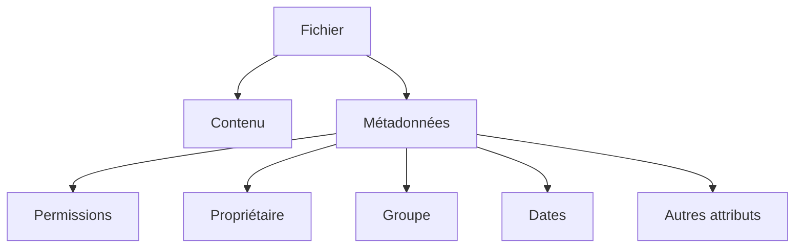
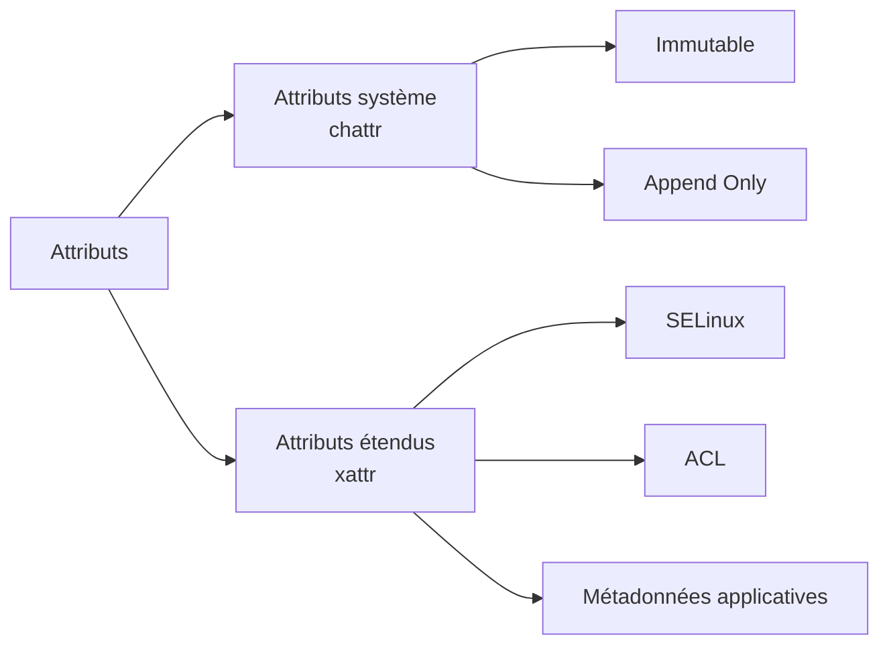
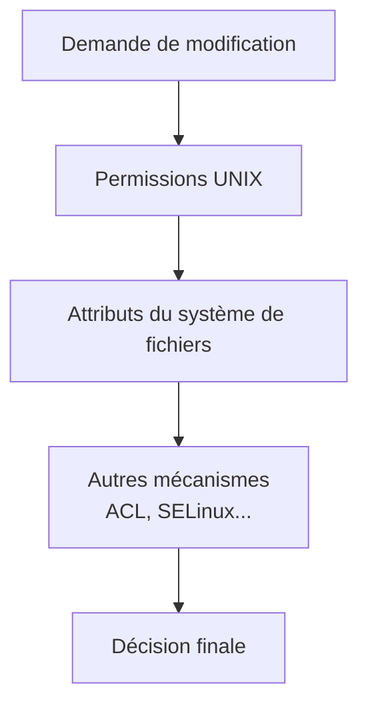
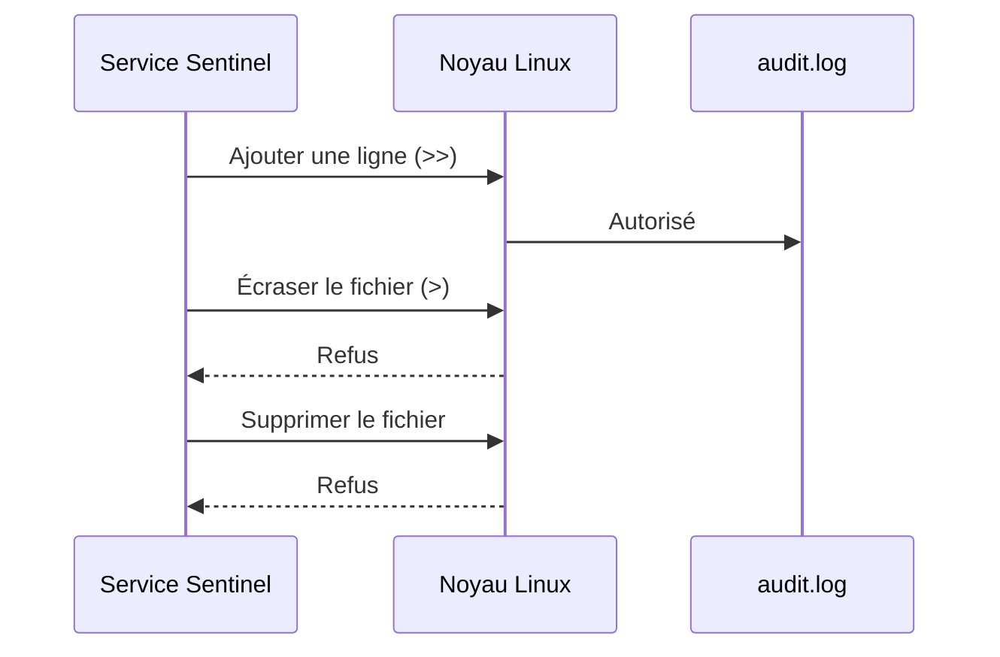
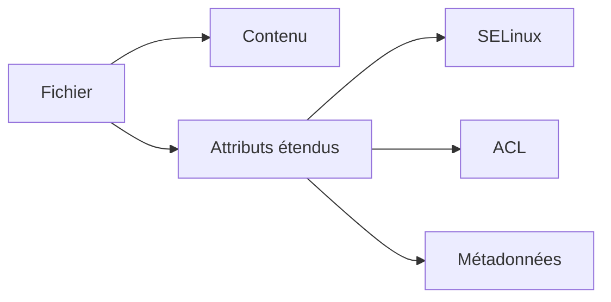
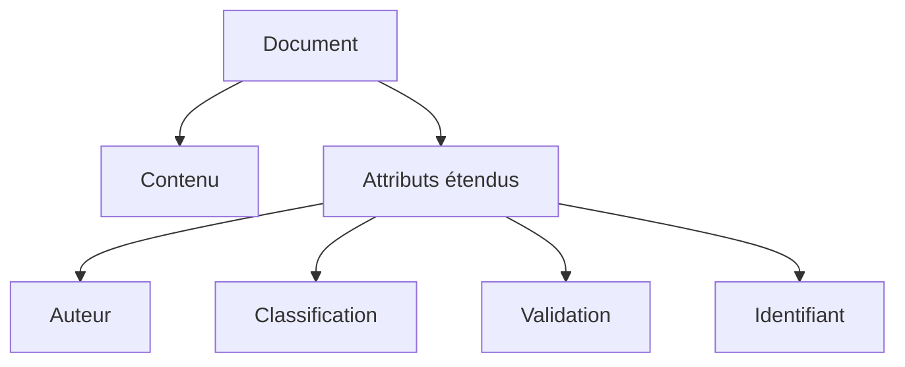
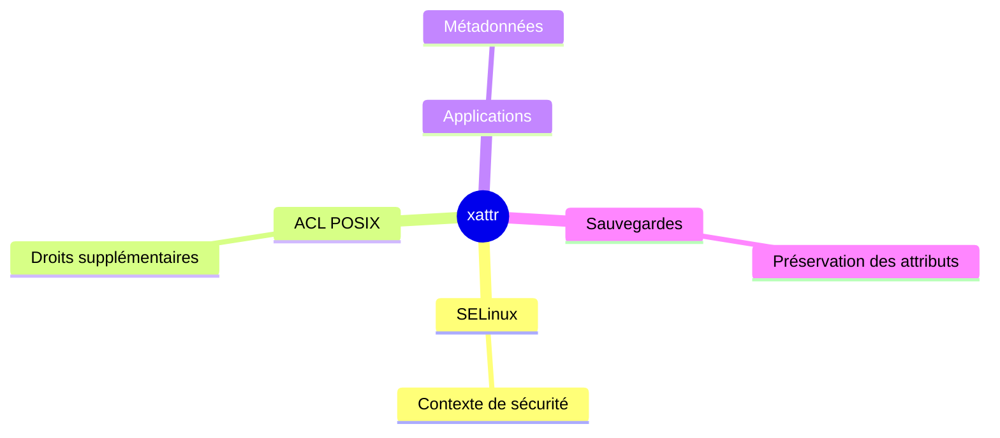
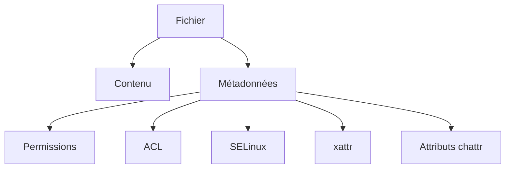

# 2.4 Les attributs étendus (`chattr` et `xattr`)

> *« Un fichier ne se résume pas à ses données. Les informations qui l'accompagnent sont parfois encore plus importantes que son contenu. »*

---

## Vous êtes ici

```text
PARTIE I — Construire un socle sécurisé

Campagne 1  [██████████] ✔
Campagne 2  [████░░░░░░]

      2.1 Les permissions UNIX ✔
      2.2 ACL ✔
      2.3 umask ✔
   ►  2.4 Attributs étendus
      2.5 PAM
      2.6 Politique de mots de passe
      2.7 Comptes système
      2.8 sudo avancé
      2.9 passwd / shadow / group
      2.10 Synthèse
```

---

## Objectifs pédagogiques

À la fin de ce chapitre, vous serez capable de :

- comprendre ce que sont les métadonnées d'un fichier ;
- distinguer les attributs de système de fichiers (`chattr`) des attributs étendus (`xattr`) ;
- utiliser `lsattr` et `chattr` ;
- comprendre le rôle des attributs immuable (`i`) et append-only (`a`) ;
- découvrir les attributs étendus (`xattr`) utilisés par Linux moderne ;
- comprendre pourquoi SELinux, les ACL et de nombreux services reposent sur les `xattr`.

---

## Pourquoi ce chapitre existe

Lorsque nous observons un fichier avec :

```bash
ls -l
```

nous obtenons déjà beaucoup d'informations.

Nous voyons :

- son propriétaire ;
- son groupe ;
- ses permissions ;
- sa taille ;
- sa date de modification.

On pourrait croire que cela représente l'ensemble des informations connues par le système.

En réalité, ce n'est qu'une petite partie.

Sous Linux, un fichier possède de nombreuses autres propriétés.

Certaines peuvent complètement modifier son comportement.

Par exemple, il est possible de demander au système :

- d'interdire toute suppression ;
- d'interdire toute modification ;
- d'autoriser uniquement l'ajout de données ;
- d'associer une étiquette SELinux ;
- de stocker une ACL ;
- de mémoriser des informations propres à une application.

Toutes ces informations ne sont pas visibles avec `ls -l`.

Elles appartiennent à une famille plus large que l'on appelle les **attributs**.

Dans ce chapitre, nous allons distinguer deux mécanismes souvent confondus :

- les **attributs du système de fichiers**, manipulés notamment avec `chattr` ;
- les **attributs étendus** (*Extended Attributes* ou **xattr**).

Ces deux notions sont proches.

Mais elles répondent à des besoins différents.

---

# Les métadonnées d'un fichier

Lorsqu'un administrateur pense à un fichier, il imagine souvent son contenu.

Par exemple :

```text
configuration.yaml
```

Pour le noyau Linux, le contenu n'est pourtant qu'une partie de l'information.

Chaque fichier possède également un ensemble de métadonnées.

On peut représenter cette idée ainsi.



Ces métadonnées permettent au noyau de répondre à des questions telles que :

- Qui possède ce fichier ?
- Peut-on l'exécuter ?
- Peut-on le modifier ?
- Est-il protégé contre la suppression ?
- Possède-t-il une étiquette SELinux ?

Le contenu du fichier ne répond à aucune de ces questions.

---

# Deux familles différentes

C'est ici que les choses deviennent intéressantes.

Linux distingue deux grandes catégories.

La première regroupe les **attributs du système de fichiers**.

Ils modifient directement le comportement du fichier.

Ils sont manipulés principalement avec :

```bash
chattr
```

La seconde regroupe les **attributs étendus**.

Ils servent principalement à stocker des informations complémentaires.

Ils sont manipulés avec :

```bash
getfattr
```

et :

```bash
setfattr
```

Le schéma suivant résume cette distinction.



Cette différence est importante.

Même si les deux familles concernent les métadonnées d'un fichier, elles ne poursuivent pas les mêmes objectifs.

---

# Les attributs du système de fichiers

Commençons par les plus anciens.

Ils sont visibles grâce à :

```bash
lsattr
```

Prenons un exemple.

```bash
touch demo.txt
```

Puis :

```bash
lsattr demo.txt
```

Vous obtenez quelque chose de proche de :

```text
---------------------- demo.txt
```

Cette suite de caractères représente les attributs actifs.

Chaque lettre possède une signification.

Par exemple :

```text
i
```

désigne un fichier immuable.

```text
a
```

désigne un fichier en mode *append only*.

De nombreux autres attributs existent.

Mais, en pratique, seuls quelques-uns sont réellement utilisés en administration système moderne.

---

# L'attribut immuable

L'attribut le plus célèbre est :

```text
i
```

pour **immutable**.

On peut l'activer avec :

```bash
sudo chattr +i demo.txt
```

Vérifions.

```bash
lsattr demo.txt
```

Nous obtenons :

```text
----i--------------- demo.txt
```

Essayons maintenant de modifier le fichier.

```bash
echo "test" >> demo.txt
```

Le noyau refuse.

Essayons de le supprimer.

```bash
rm demo.txt
```

Le résultat est identique.

Le fichier est protégé.

Même un utilisateur possédant les permissions d'écriture ne peut plus le modifier.

Le noyau applique une règle supplémentaire.

C'est précisément ce qui distingue les attributs des permissions UNIX.

Les permissions répondent à la question :

> « Qui est autorisé ? »

L'attribut immuable répond à une autre question :

> « Cette opération est-elle autorisée tout court ? »

Même avec les bonnes permissions, la réponse peut être non.

---
# Une protection plus forte que les permissions

L'attribut immuable surprend souvent lors des premières manipulations.

Prenons un fichier.

```text
-rw-------
```

Son propriétaire possède tous les droits nécessaires pour le modifier.

Pourtant, si l'attribut :

```text
i
```

est présent, la modification échoue.

Pourquoi ?

Parce que les permissions UNIX répondent uniquement à la question :

> « Cet utilisateur possède-t-il les droits nécessaires ? »

L'attribut immuable ajoute une seconde règle.

> « Cette opération est-elle autorisée sur ce fichier ? »

Autrement dit, le noyau vérifie plusieurs couches successives.



Un refus à l'une de ces étapes suffit à empêcher l'opération.

Cette logique de défense en profondeur est omniprésente sous Linux.

---

# Qui peut supprimer l'attribut immuable ?

Une question se pose naturellement.

Si un fichier est immuable, comment le mettre à jour ?

La réponse est simple.

Il faut d'abord retirer l'attribut.

```bash
sudo chattr -i demo.txt
```

Le fichier retrouve alors son comportement normal.

Historiquement, cette opération est réservée à un utilisateur privilégié.

Cependant, il est important de comprendre **pourquoi**.

Le fait d'être `root` ne suffit pas toujours.

Dans les noyaux Linux modernes, la capacité **`CAP_LINUX_IMMUTABLE`** est nécessaire pour modifier les attributs `i` et `a`. Par défaut, cette capacité est généralement détenue par `root`, mais dans un environnement où les capacités sont restreintes (conteneur, service `systemd` fortement sandboxé, etc.), même un processus exécuté avec l'UID 0 peut se voir refuser cette opération.

Nous reviendrons en détail sur les capacités Linux dans la campagne consacrée à `systemd` et au durcissement des services.

---

# L'attribut Append Only

Le second attribut très utilisé est :

```text
a
```

pour :

> **Append Only**

Son fonctionnement est différent.

Le fichier reste modifiable.

Mais uniquement en ajoutant des données à la fin.

On peut l'activer ainsi.

```bash
sudo chattr +a journal.log
```

Le comportement devient alors très intéressant.

Cette commande fonctionne.

```bash
echo "Nouvelle entrée" >> journal.log
```

En revanche, une tentative d'écrasement échoue.

```bash
echo "Remplacement" > journal.log
```

Pourquoi ?

Parce que l'opérateur :

```text
>
```

remplace entièrement le contenu.

À l'inverse :

```text
>>
```

ajoute simplement de nouvelles données.

Le noyau autorise cette seconde opération.

---

# Pourquoi cet attribut existe-t-il ?

Imaginons un fichier de journal.

```text
/var/log/sentinel/audit.log
```

Ce journal doit conserver toutes les actions réalisées.

Un attaquant qui parvient à obtenir un accès au serveur cherchera souvent à effacer ses traces.

Si le journal est protégé par :

```text
+a
```

il devient beaucoup plus difficile de le falsifier.

Le contenu existant ne peut plus être remplacé.

Les nouvelles lignes continuent d'être ajoutées.

On peut représenter ce fonctionnement ainsi.



L'attribut `a` est particulièrement utile pour certains journaux de sécurité.

Il ne remplace évidemment pas une journalisation centralisée.

Mais il constitue une première protection locale intéressante.

---

# Les autres attributs

La commande :

```bash
man chattr
```

présente de nombreux autres attributs.

Par exemple :

- compression ;
- suppression sécurisée ;
- absence de copie lors des sauvegardes ;
- optimisation de certaines écritures.

Cependant, la plupart sont :

- spécifiques à certains systèmes de fichiers ;
- obsolètes ;
- rarement utilisés en production.

En pratique, les administrateurs rencontrent surtout :

| Attribut | Usage courant |
|----------|---------------|
| `i` | Fichier immuable |
| `a` | Journal en ajout uniquement |

Ce sont donc ces deux attributs que nous retiendrons pour cette formation.

---

# Les attributs étendus (`xattr`)

Nous allons maintenant changer complètement de famille.

Contrairement à `chattr`, les **attributs étendus** ne modifient généralement pas directement le comportement du fichier.

Ils servent principalement à stocker des informations.

On peut les comparer à une petite base de données associée à chaque fichier.



Chaque attribut est identifié par un nom.

Par exemple :

```text
user.commentaire
```

ou :

```text
security.selinux
```

Le système peut ainsi associer des informations supplémentaires sans modifier le contenu du fichier.

C'est un mécanisme extrêmement souple.

---

# Les espaces de noms des `xattr`

Tous les attributs étendus ne jouent pas le même rôle.

Pour éviter les conflits, Linux les classe dans plusieurs espaces de noms (*namespaces*).

Les plus importants sont :

| Préfixe | Utilisation |
|----------|-------------|
| `user.` | Applications utilisateur |
| `trusted.` | Réservé au système |
| `security.` | Mécanismes de sécurité (SELinux, etc.) |
| `system.` | Fonctionnement interne du système de fichiers |

Par exemple :

```text
security.selinux
```

contient le contexte SELinux d'un fichier.

Nous découvrirons en détail cette information dans la campagne consacrée à SELinux.

Il est important de noter que certains espaces de noms ne sont accessibles qu'à des processus privilégiés. Par exemple, les attributs `security.*` et `trusted.*` sont soumis à des contrôles particuliers, tandis que les attributs `user.*` sont destinés aux applications utilisateur lorsqu'ils sont autorisés par le système de fichiers.

---
# Observer les attributs étendus

Contrairement aux attributs manipulés avec `chattr`, les attributs étendus ne sont pas visibles avec :

```bash
lsattr
```

Ils disposent de leurs propres outils.

Pour afficher la liste des attributs d'un fichier, on utilise :

```bash
getfattr
```

Par exemple :

```bash
getfattr -d document.txt
```

L'option :

```text
-d
```

demande l'affichage des attributs et de leurs valeurs.

Suivant le fichier observé, le résultat pourra être vide.

Ou contenir plusieurs informations.

Par exemple :

```text
# file: document.txt

user.commentaire="Document validé"
```

Nous voyons ici que le fichier possède un attribut supplémentaire.

Son contenu reste inchangé.

Ses permissions restent identiques.

Pourtant, une nouvelle information lui est désormais associée.

---

# Ajouter un attribut utilisateur

Créons un fichier.

```bash
touch rapport.txt
```

Ajoutons un attribut.

```bash
setfattr -n user.commentaire \
         -v "Version validée" \
         rapport.txt
```

Affichons ensuite les attributs.

```bash
getfattr -d rapport.txt
```

Résultat.

```text
user.commentaire="Version validée"
```

Nous venons d'associer une information au fichier.

Cette donnée ne fait pas partie du contenu.

Elle est conservée séparément.

Le fichier pourrait parfaitement rester vide.

L'attribut existerait malgré tout.

---

# Pourquoi stocker des informations à côté du fichier ?

Imaginons une application de gestion documentaire.

Chaque document possède :

- un auteur ;
- un niveau de confidentialité ;
- une date de validation ;
- un identifiant interne.

Plusieurs approches sont possibles.

La première consiste à modifier directement le contenu du document.

Cette solution est rarement satisfaisante.

Pourquoi ?

Parce qu'elle dépend du format.

Un PDF.

Un document texte.

Une image.

Une archive.

Tous utilisent des structures différentes.

Les attributs étendus offrent une approche beaucoup plus générique.

On peut représenter cette idée ainsi.



Le fichier conserve son contenu.

Les métadonnées sont stockées séparément.

---

# Pourquoi les administrateurs utilisent-ils rarement `user.*` ?

Lorsqu'on découvre les `xattr`, on imagine souvent de nombreux usages.

Pourtant, dans l'administration système, les attributs :

```text
user.*
```

sont relativement peu employés.

Pourquoi ?

Parce que les mécanismes les plus importants utilisent surtout :

```text
security.*
```

ou :

```text
system.*
```

Par exemple :

- SELinux ;
- les ACL POSIX ;
- certaines fonctionnalités du système de fichiers.

Autrement dit, les administrateurs manipulent quotidiennement des `xattr`…

Sans forcément s'en rendre compte.

---

# Les `xattr` au cœur de Linux moderne

Les attributs étendus sont devenus une brique essentielle de Linux.

De nombreux mécanismes reposent directement sur eux.



Cette architecture présente un avantage majeur.

Chaque fonctionnalité peut enrichir les fichiers sans modifier leur contenu.

Le système reste ainsi très extensible.

---

## 💎 Le point d'expertise

Toutes les opérations de copie ne préservent pas les attributs étendus.

Prenons une simple commande.

```bash
cp fichier copie
```

Selon les options utilisées, plusieurs informations peuvent être perdues :

- les ACL ;
- certains `xattr` ;
- les contextes SELinux ;
- d'autres métadonnées.

En revanche, des commandes comme :

```bash
cp -a
```

ou :

```bash
rsync -aX
```

préservent également les attributs étendus (`-X`) et, avec `-A`, les ACL lorsqu'on utilise `rsync`.

Cette différence est particulièrement importante lors :

- d'une migration de serveur ;
- d'une restauration ;
- d'un déploiement automatisé.

Un administrateur expérimenté ne vérifie jamais uniquement que les fichiers ont été copiés.

Il vérifie également que toutes leurs métadonnées ont été conservées.

Sans cela, une restauration peut sembler correcte tout en ayant perdu une partie de sa politique de sécurité.

---

## 🧠 Comment pense un architecte ?

Pour un architecte, un fichier n'est jamais simplement un ensemble d'octets.

C'est un objet qui possède :

- un contenu ;
- une identité ;
- une politique d'accès ;
- une politique de sécurité ;
- des métadonnées.

On peut représenter cette vision ainsi.



Cette approche explique pourquoi une simple copie de fichiers ne suffit pas toujours à reconstruire correctement un serveur.

Les métadonnées sont souvent aussi importantes que les données elles-mêmes.

C'est précisément ce que nous exploiterons lors des campagnes consacrées à Ansible, aux sauvegardes et au packaging RPM.

---

## ⚔️ Comment pense un attaquant ?

Lorsqu'un attaquant obtient un accès sur un système Linux, il ne s'intéresse pas uniquement au contenu des fichiers.

Il cherche également les métadonnées.

Pourquoi ?

Parce qu'elles révèlent souvent des informations précieuses.

Par exemple :

- un contexte SELinux inhabituel ;
- une ACL oubliée ;
- un fichier marqué immuable ;
- un attribut applicatif contenant un identifiant.

Ces informations permettent souvent de mieux comprendre l'architecture de la machine.

À l'inverse, un défenseur doit apprendre à les vérifier régulièrement.

Une politique de sécurité ne se limite jamais aux permissions visibles dans `ls -l`.

---
## 📚 Culture technique

Les attributs étendus existent depuis de nombreuses années.

Pourtant, ils sont longtemps restés relativement confidentiels.

Pourquoi ?

Parce que les premiers systèmes UNIX avaient été conçus avec une philosophie très minimaliste.

Un fichier devait essentiellement contenir :

- des données ;
- quelques métadonnées indispensables.

Avec le temps, les besoins ont évolué.

Les systèmes d'exploitation ont dû intégrer :

- des mécanismes de contrôle d'accès plus avancés ;
- des politiques de sécurité obligatoires (*Mandatory Access Control*) ;
- des outils de sauvegarde plus riches ;
- des applications souhaitant associer leurs propres informations aux fichiers.

Modifier le format historique des systèmes de fichiers aurait été extrêmement complexe.

Les attributs étendus ont apporté une solution élégante.

Ils permettent d'ajouter de nouvelles informations sans remettre en cause les structures historiques.

Cette capacité d'extension explique pourquoi ils sont aujourd'hui utilisés dans de très nombreux composants de Linux.

---

## ⚠️ Piège classique

Beaucoup d'administrateurs pensent qu'une archive contient automatiquement toutes les informations d'un fichier.

Ce n'est pas toujours vrai.

Selon l'outil utilisé, il est possible de perdre :

- les ACL ;
- les attributs étendus ;
- les contextes SELinux ;
- certains attributs du système de fichiers.

Prenons un exemple.

Un serveur est sauvegardé.

Quelques semaines plus tard, il est restauré.

Les fichiers sont présents.

Le contenu est correct.

Pourtant, plusieurs services refusent de démarrer.

Pourquoi ?

Parce que leurs contextes SELinux ont disparu.

Ou parce que certaines ACL n'ont pas été restaurées.

Le contenu du fichier était intact.

La politique de sécurité, elle, ne l'était plus.

Lorsqu'on prépare une stratégie de sauvegarde, il faut toujours vérifier quelles métadonnées sont réellement conservées.

---

# Laboratoire AlmaLinux

Commençons par créer un fichier.

```bash
touch laboratoire.txt
```

Affichons ses attributs de système de fichiers.

```bash
lsattr laboratoire.txt
```

Ajoutons ensuite l'attribut immuable.

```bash
sudo chattr +i laboratoire.txt
```

Essayons de modifier le fichier.

```bash
echo "Test" >> laboratoire.txt
```

Le noyau refuse l'opération.

Tentons maintenant de le supprimer.

```bash
rm laboratoire.txt
```

Là encore, l'opération échoue.

Retirons enfin l'attribut.

```bash
sudo chattr -i laboratoire.txt
```

Le fichier redevient modifiable.

---

Créons maintenant un attribut étendu.

```bash
setfattr -n user.version \
         -v "1.0" \
         laboratoire.txt
```

Affichons-le.

```bash
getfattr -d laboratoire.txt
```

Essayons ensuite de modifier sa valeur.

```bash
setfattr -n user.version \
         -v "1.1" \
         laboratoire.txt
```

Puis :

```bash
getfattr -d laboratoire.txt
```

Vous constaterez que le contenu du fichier n'a jamais changé.

Seule une métadonnée associée au fichier a été modifiée.

Cette distinction est au cœur du fonctionnement des `xattr`.

---

# Impact sur Sentinel

Sentinel utilisera plusieurs mécanismes étudiés dans ce chapitre.

Par exemple :

- ses fichiers de configuration pourront être protégés contre des modifications accidentelles pendant certaines phases d'exploitation ;
- ses journaux sensibles pourront bénéficier d'une stratégie de protection adaptée ;
- les contextes SELinux de tous les fichiers de l'application seront stockés sous forme d'attributs étendus ;
- certaines opérations de sauvegarde devront impérativement préserver ces métadonnées.

Lorsqu'une application devient un véritable service d'entreprise, la copie de ses fichiers ne suffit plus.

Il faut également préserver :

- leurs permissions ;
- leurs ACL ;
- leurs contextes SELinux ;
- leurs attributs étendus.

Autrement dit, il faut préserver **leur identité complète**.

---

# Ce qu'il faut retenir

- Un fichier Linux possède des données, mais également de nombreuses métadonnées.
- Les attributs manipulés avec `chattr` modifient directement le comportement du fichier.
- Les attributs `i` (immutable) et `a` (append-only) sont les plus utilisés en administration système.
- Les attributs étendus (`xattr`) permettent d'associer des informations supplémentaires à un fichier sans modifier son contenu.
- Les espaces de noms (`user.`, `security.`, `system.`, `trusted.`) permettent d'organiser ces informations.
- SELinux, les ACL POSIX et de nombreux composants de Linux reposent sur les attributs étendus.
- Une stratégie de sauvegarde doit préserver les métadonnées autant que les données elles-mêmes.

---

# Grande infographie de révision

```text
                  LES ATTRIBUTS D'UN FICHIER LINUX

                         Fichier
                            │
          ┌─────────────────┴─────────────────┐
          │                                   │
          ▼                                   ▼
      Contenu                         Métadonnées
                                              │
      ┌───────────────────────────────────────┴────────────────────────────────────┐
      │                                                                            │
      ▼                                                                            ▼
Permissions UNIX                                                          Autres informations
      │                                                                            │
      │                                   ┌────────────────────────────────────────┼─────────────────────────────┐
      │                                   │                                        │                             │
      ▼                                   ▼                                        ▼                             ▼
   ACL POSIX                     Attributs chattr                         Attributs étendus                Dates / UID / GID
                                       │                                        │
                              ┌────────┴────────┐                     ┌──────────┼──────────┐
                              ▼                 ▼                     ▼          ▼          ▼
                         Immutable (+i)    Append (+a)          SELinux      ACL      Métadonnées
                                                                         (stockage)  applicatives

──────────────────────────────────────────────────────────────────────────────────────────────────

              chattr                   xattr

         Modifie le               Stocke des informations
     comportement du fichier       complémentaires

──────────────────────────────────────────────────────────────────────────────────────────────────

         Une copie complète d'un serveur doit préserver :

     ✔ Contenu
     ✔ Permissions
     ✔ ACL
     ✔ Contextes SELinux
     ✔ Attributs étendus
     ✔ Métadonnées essentielles

──────────────────────────────────────────────────────────────────────────────────────────────────

         Un fichier Linux est bien plus qu'une suite d'octets.
```

# Transition vers le chapitre 2.5

Depuis le début de cette campagne, nous répondons toujours à la même question.

> **« Un utilisateur peut-il accéder à cette ressource ? »**

Jusqu'à présent, nous avons étudié des mécanismes qui s'appliquent **après** l'identification de l'utilisateur :

- les permissions UNIX ;
- les ACL ;
- l'`umask` ;
- les attributs.

Mais une question encore plus fondamentale existe.

> **Comment Linux sait-il qui est l'utilisateur ?**

Avant d'autoriser l'accès à un fichier, le système doit répondre à plusieurs interrogations :

- Le mot de passe est-il correct ?
- Le compte est-il encore valide ?
- Est-il autorisé à se connecter à cette heure ?
- Depuis cette machine ?
- Avec cette méthode d'authentification ?
- Une authentification multifactorielle est-elle requise ?

Toutes ces décisions sont prises par un composant extrêmement puissant, mais souvent méconnu :

**PAM**, pour **Pluggable Authentication Modules**.

Dans le prochain chapitre, nous allons découvrir que, sous Linux, l'authentification n'est pas codée directement dans chaque application.

Elle est déléguée à une architecture modulaire qui permet de construire des politiques d'authentification extrêmement riches, sans modifier les programmes eux-mêmes.

## 📚 Culture technique

Les attributs étendus existent depuis de nombreuses années.

Pourtant, ils sont longtemps restés relativement confidentiels.

Pourquoi ?

Parce que les premiers systèmes UNIX avaient été conçus avec une philosophie très minimaliste.

Un fichier devait essentiellement contenir :

- des données ;
- quelques métadonnées indispensables.

Avec le temps, les besoins ont évolué.

Les systèmes d'exploitation ont dû intégrer :

- des mécanismes de contrôle d'accès plus avancés ;
- des politiques de sécurité obligatoires (*Mandatory Access Control*) ;
- des outils de sauvegarde plus riches ;
- des applications souhaitant associer leurs propres informations aux fichiers.

Modifier le format historique des systèmes de fichiers aurait été extrêmement complexe.

Les attributs étendus ont apporté une solution élégante.

Ils permettent d'ajouter de nouvelles informations sans remettre en cause les structures historiques.

Cette capacité d'extension explique pourquoi ils sont aujourd'hui utilisés dans de très nombreux composants de Linux.

---

## ⚠️ Piège classique

Beaucoup d'administrateurs pensent qu'une archive contient automatiquement toutes les informations d'un fichier.

Ce n'est pas toujours vrai.

Selon l'outil utilisé, il est possible de perdre :

- les ACL ;
- les attributs étendus ;
- les contextes SELinux ;
- certains attributs du système de fichiers.

Prenons un exemple.

Un serveur est sauvegardé.

Quelques semaines plus tard, il est restauré.

Les fichiers sont présents.

Le contenu est correct.

Pourtant, plusieurs services refusent de démarrer.

Pourquoi ?

Parce que leurs contextes SELinux ont disparu.

Ou parce que certaines ACL n'ont pas été restaurées.

Le contenu du fichier était intact.

La politique de sécurité, elle, ne l'était plus.

Lorsqu'on prépare une stratégie de sauvegarde, il faut toujours vérifier quelles métadonnées sont réellement conservées.

---

# Laboratoire AlmaLinux

Commençons par créer un fichier.

```bash
touch laboratoire.txt
```

Affichons ses attributs de système de fichiers.

```bash
lsattr laboratoire.txt
```

Ajoutons ensuite l'attribut immuable.

```bash
sudo chattr +i laboratoire.txt
```

Essayons de modifier le fichier.

```bash
echo "Test" >> laboratoire.txt
```

Le noyau refuse l'opération.

Tentons maintenant de le supprimer.

```bash
rm laboratoire.txt
```

Là encore, l'opération échoue.

Retirons enfin l'attribut.

```bash
sudo chattr -i laboratoire.txt
```

Le fichier redevient modifiable.

---

Créons maintenant un attribut étendu.

```bash
setfattr -n user.version \
         -v "1.0" \
         laboratoire.txt
```

Affichons-le.

```bash
getfattr -d laboratoire.txt
```

Essayons ensuite de modifier sa valeur.

```bash
setfattr -n user.version \
         -v "1.1" \
         laboratoire.txt
```

Puis :

```bash
getfattr -d laboratoire.txt
```

Vous constaterez que le contenu du fichier n'a jamais changé.

Seule une métadonnée associée au fichier a été modifiée.

Cette distinction est au cœur du fonctionnement des `xattr`.

---

# Impact sur Sentinel

Sentinel utilisera plusieurs mécanismes étudiés dans ce chapitre.

Par exemple :

- ses fichiers de configuration pourront être protégés contre des modifications accidentelles pendant certaines phases d'exploitation ;
- ses journaux sensibles pourront bénéficier d'une stratégie de protection adaptée ;
- les contextes SELinux de tous les fichiers de l'application seront stockés sous forme d'attributs étendus ;
- certaines opérations de sauvegarde devront impérativement préserver ces métadonnées.

Lorsqu'une application devient un véritable service d'entreprise, la copie de ses fichiers ne suffit plus.

Il faut également préserver :

- leurs permissions ;
- leurs ACL ;
- leurs contextes SELinux ;
- leurs attributs étendus.

Autrement dit, il faut préserver **leur identité complète**.

---

# Ce qu'il faut retenir

- Un fichier Linux possède des données, mais également de nombreuses métadonnées.
- Les attributs manipulés avec `chattr` modifient directement le comportement du fichier.
- Les attributs `i` (immutable) et `a` (append-only) sont les plus utilisés en administration système.
- Les attributs étendus (`xattr`) permettent d'associer des informations supplémentaires à un fichier sans modifier son contenu.
- Les espaces de noms (`user.`, `security.`, `system.`, `trusted.`) permettent d'organiser ces informations.
- SELinux, les ACL POSIX et de nombreux composants de Linux reposent sur les attributs étendus.
- Une stratégie de sauvegarde doit préserver les métadonnées autant que les données elles-mêmes.

---

# Grande infographie de révision

```text
                  LES ATTRIBUTS D'UN FICHIER LINUX

                         Fichier
                            │
          ┌─────────────────┴─────────────────┐
          │                                   │
          ▼                                   ▼
      Contenu                         Métadonnées
                                              │
      ┌───────────────────────────────────────┴────────────────────────────────────┐
      │                                                                            │
      ▼                                                                            ▼
Permissions UNIX                                                          Autres informations
      │                                                                            │
      │                                   ┌────────────────────────────────────────┼─────────────────────────────┐
      │                                   │                                        │                             │
      ▼                                   ▼                                        ▼                             ▼
   ACL POSIX                     Attributs chattr                         Attributs étendus                Dates / UID / GID
                                       │                                        │
                              ┌────────┴────────┐                     ┌──────────┼──────────┐
                              ▼                 ▼                     ▼          ▼          ▼
                         Immutable (+i)    Append (+a)          SELinux      ACL      Métadonnées
                                                                         (stockage)  applicatives

──────────────────────────────────────────────────────────────────────────────────────────────────

              chattr                   xattr

         Modifie le               Stocke des informations
     comportement du fichier       complémentaires

──────────────────────────────────────────────────────────────────────────────────────────────────

         Une copie complète d'un serveur doit préserver :

     ✔ Contenu
     ✔ Permissions
     ✔ ACL
     ✔ Contextes SELinux
     ✔ Attributs étendus
     ✔ Métadonnées essentielles

──────────────────────────────────────────────────────────────────────────────────────────────────

         Un fichier Linux est bien plus qu'une suite d'octets.
```

# Transition vers le chapitre 2.5

Depuis le début de cette campagne, nous répondons toujours à la même question.

> **« Un utilisateur peut-il accéder à cette ressource ? »**

Jusqu'à présent, nous avons étudié des mécanismes qui s'appliquent **après** l'identification de l'utilisateur :

- les permissions UNIX ;
- les ACL ;
- l'`umask` ;
- les attributs.

Mais une question encore plus fondamentale existe.

> **Comment Linux sait-il qui est l'utilisateur ?**

Avant d'autoriser l'accès à un fichier, le système doit répondre à plusieurs interrogations :

- Le mot de passe est-il correct ?
- Le compte est-il encore valide ?
- Est-il autorisé à se connecter à cette heure ?
- Depuis cette machine ?
- Avec cette méthode d'authentification ?
- Une authentification multifactorielle est-elle requise ?

Toutes ces décisions sont prises par un composant extrêmement puissant, mais souvent méconnu :

**PAM**, pour **Pluggable Authentication Modules**.

Dans le prochain chapitre, nous allons découvrir que, sous Linux, l'authentification n'est pas codée directement dans chaque application.

Elle est déléguée à une architecture modulaire qui permet de construire des politiques d'authentification extrêmement riches, sans modifier les programmes eux-mêmes.
