# Chapitre 2.5 — PAM

> **Campagne 2 — Contrôle des accès**

> *« L'authentification n'est pas une fonction des applications. C'est un service fourni par le système. »*

## Vous êtes ici

```text
PARTIE I — Construire un socle sécurisé

Campagne 1  [██████████] ✔
Campagne 2  [█████░░░░░]

      2.1 Les permissions UNIX ✔
      2.2 ACL ✔
      2.3 umask ✔
      2.4 Attributs étendus ✔
   ►  2.5 PAM
      2.6 Politique de mots de passe
      2.7 Comptes système
      2.8 sudo avancé
      2.9 passwd / shadow / group
      2.10 Synthèse
```

## Objectifs pédagogiques

À la fin de ce chapitre, vous serez capable de :

- comprendre pourquoi PAM existe ;
- expliquer l'architecture des Pluggable Authentication Modules ;
- distinguer les quatre familles de modules PAM ;
- comprendre le rôle des fichiers de configuration PAM ;
- interpréter le chemin suivi par une authentification ;
- comprendre comment plusieurs mécanismes d'authentification peuvent être combinés.

## Pourquoi ce chapitre existe

Imaginons un système Linux sans PAM. Plusieurs programmes demandent une authentification. Par exemple :

- `login` ;
- `sshd` ;
- `sudo` ;
- `su` ;
- `gdm` ;
- `passwd`.

Sans architecture commune, chaque programme devrait implémenter lui-même :

- la vérification des mots de passe ;
- les règles d'expiration ;
- les comptes verrouillés ;
- l'authentification par carte à puce ;
- l'authentification biométrique ;
- l'authentification multifactorielle.

Cela poserait immédiatement plusieurs problèmes. Le premier concerne le développement. Chaque application devrait réécrire exactement le même code. Le second concerne la maintenance. Une modification de la politique de sécurité obligerait à mettre à jour toutes les applications. Enfin, le troisième problème est celui de la cohérence. Chaque programme pourrait appliquer des règles légèrement différentes. Le système deviendrait rapidement incohérent.

Les concepteurs de Linux ont donc adopté une approche beaucoup plus élégante. Ils ont séparé les responsabilités. Les applications demandent simplement :

> « Cet utilisateur peut-il être authentifié ? »

PAM répond.

## Une architecture en couches

PAM est souvent présenté comme un composant. En réalité, il s'agit plutôt d'un **cadre d'exécution**. Les applications ne réalisent pas directement l'authentification. Elles délèguent cette tâche à PAM. PAM appelle ensuite les modules nécessaires. On peut représenter cette architecture ainsi.

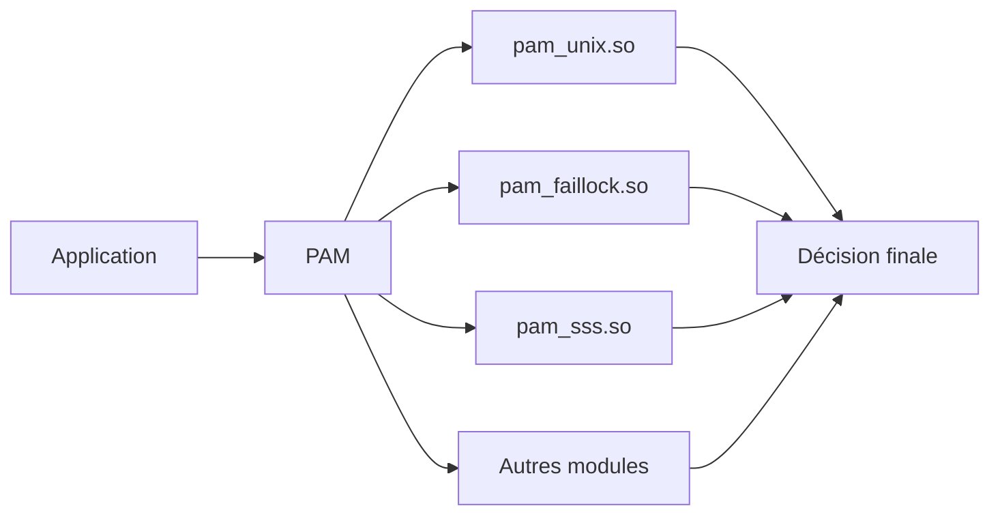

Cette séparation présente un avantage considérable. L'application ignore totalement :

- comment le mot de passe est vérifié ;
- où sont stockés les comptes ;
- si une authentification biométrique est utilisée ;
- si un annuaire LDAP intervient.

Elle délègue tout cela à PAM.

## Pourquoi le mot « Pluggable » ?

Le mot : `Pluggable` signifie littéralement :

> « que l'on peut brancher ou remplacer ».

C'est précisément la philosophie de PAM. Prenons un exemple. Aujourd'hui, votre entreprise utilise des comptes locaux. Demain, elle adopte FreeIPA. Les applications comme : `sudo` ou : `sshd` n'ont pas besoin d'être modifiées. Seule la configuration PAM change. Les modules utilisés deviennent différents.

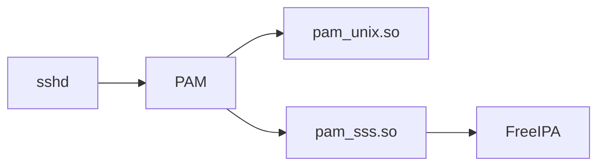

L'application continue simplement à demander :

> « PAM, peux-tu authentifier cet utilisateur ? »

Le reste est entièrement transparent.

## Une analogie simple

Imaginons un immeuble sécurisé. À l'entrée se trouve un agent d'accueil. Les visiteurs arrivent. L'agent ne décide pas lui-même. Selon la situation, il consulte différents services.

- Vérification de la carte d'identité.
- Vérification de la liste des employés.
- Vérification des horaires.
- Vérification des autorisations temporaires.

Une fois toutes les vérifications terminées, il répond simplement :

> Oui.

ou

> Non.

PAM joue exactement ce rôle. Les applications voient uniquement la réponse finale. Toute la logique de décision est cachée derrière cette interface.

## Les quatre familles de modules

Toutes les opérations réalisées par PAM ne concernent pas directement le mot de passe. Pour organiser les traitements, PAM distingue quatre grandes catégories.

| Famille | Rôle |
|----------|------|
| `auth` | Vérifier l'identité |
| `account` | Vérifier si le compte peut être utilisé |
| `password` | Modifier les informations d'authentification |
| `session` | Préparer et terminer une session utilisateur |

Ces quatre catégories apparaissent dans tous les fichiers de configuration PAM. Nous allons maintenant les étudier une par une.

## Les modules `auth`

La première étape consiste naturellement à vérifier l'identité. Par exemple :

- le mot de passe ;
- une carte à puce ;
- une clé FIDO2 ;
- un second facteur ;
- un certificat.

Les modules : `auth` répondent à une seule question.

> L'utilisateur est-il bien celui qu'il prétend être ?

C'est tout. Ils ne décident pas si le compte est autorisé à se connecter. Ils vérifient uniquement son identité.

## Les modules `account`

Une fois l'identité vérifiée, une seconde question apparaît.

> Cet utilisateur est-il autorisé à utiliser son compte maintenant ?

Cette distinction est essentielle. Imaginons un utilisateur. Son mot de passe est parfaitement correct. Pourtant :

- son compte est expiré ;
- il a été désactivé ;
- son accès est limité à certaines heures ;
- il n'est plus membre du groupe autorisé.

Dans toutes ces situations, l'authentification est réussie. Mais l'accès doit être refusé. C'est précisément le rôle des modules : `account` Ils répondent à la question :

> « Même correctement authentifié, cet utilisateur peut-il ouvrir une session ? »

Cette séparation entre identité et autorisation est un principe fondamental de la sécurité informatique.

## Les modules `password`

Cette troisième famille intervient dans un contexte particulier. Elle n'est utilisée que lorsqu'un utilisateur souhaite modifier son secret d'authentification. Par exemple :

```bash
passwd
```

Lorsqu'un utilisateur change son mot de passe, plusieurs règles peuvent être appliquées. Par exemple :

- longueur minimale ;
- complexité ;
- historique ;
- interdiction de réutiliser les anciens mots de passe.

Les modules : `password` ne servent donc pas à authentifier l'utilisateur. Ils servent à gérer les modifications de ses informations d'authentification. Nous les retrouverons très bientôt dans le chapitre consacré aux politiques de mots de passe.

## Les modules `session`

Une authentification réussie ne marque pas la fin du travail. Au contraire. Une session utilisateur va maintenant commencer. Plusieurs opérations doivent être réalisées. Par exemple :

- créer le répertoire personnel s'il n'existe pas ;
- monter certains systèmes de fichiers ;
- enregistrer la connexion ;
- initialiser des variables d'environnement ;
- appliquer certaines limites de ressources.

Toutes ces opérations sont réalisées par les modules : `session` À la fermeture de la session, d'autres traitements peuvent également être exécutés. Par exemple :

- démonter un répertoire ;
- enregistrer l'heure de déconnexion ;
- supprimer des fichiers temporaires.

Les modules `session` accompagnent donc toute la durée de vie de la connexion.

## Les quatre familles en une seule vue

On peut représenter l'enchaînement complet des traitements PAM de la manière suivante.

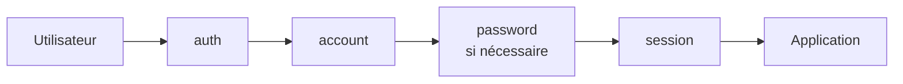

Il est important de comprendre que ces quatre familles sont indépendantes. Une application peut utiliser :

- uniquement `auth` ;
- `auth` et `account` ;
- les quatre catégories.

Tout dépend de son fonctionnement.

## Les fichiers de configuration PAM

Toute la puissance de PAM repose sur sa configuration. Sous AlmaLinux, celle-ci se trouve principalement dans : `/etc/pam.d/` Observons son contenu.

```bash
ls /etc/pam.d
```

Vous découvrirez une liste de fichiers. Par exemple :

```text
login
passwd
sudo
sshd
su
system-auth
password-auth
```

Chaque service possède généralement son propre fichier. Ce fichier décrit les modules à utiliser. Par exemple, le fichier : `/etc/pam.d/sudo` détermine entièrement la manière dont `sudo` réalise son authentification. Le programme lui-même ne contient pratiquement aucune logique d'authentification.

## Une première lecture

Prenons un exemple simplifié.

```text
auth      required      pam_env.so

auth      sufficient    pam_unix.so

account   required      pam_unix.so

session   required      pam_unix.so
```

Même si cette syntaxe paraît intimidante, elle suit toujours la même structure.

```text
Type

Contrôle

Module
```

Autrement dit :

```text
auth

required

pam_unix.so
```

signifie simplement :

> Pour la phase d'authentification, utiliser le module `pam_unix.so`.

Nous étudierons dans un instant la signification des mots :

- `required`
- `requisite`
- `sufficient`
- `optional`

Ce sont eux qui donnent toute sa puissance à PAM.

## Les indicateurs de contrôle

Jusqu'à présent, nous avons identifié trois éléments. Le type. Le module. Mais un élément reste à comprendre. Le contrôle. Prenons cette ligne. `auth required pam_unix.so` Pourquoi le mot : `required` est-il présent ? Parce que tous les modules n'ont pas la même importance. Certains sont obligatoires. D'autres sont facultatifs. D'autres encore permettent d'arrêter immédiatement l'évaluation. C'est précisément le rôle des indicateurs de contrôle (*Control Flags*).

Ils indiquent à PAM comment interpréter le résultat renvoyé par chaque module.

## `required`

Le plus courant est : `required` Son comportement est le suivant.

- Le module doit réussir.
- Si le module échoue, l'authentification échouera.
- PAM continue néanmoins à exécuter les modules suivants.

Pourquoi continuer alors que l'échec est déjà certain ? Pour plusieurs raisons. La principale est d'éviter de révéler à un attaquant à quel moment exact l'authentification a échoué. Le déroulement reste similaire, que le premier ou le dernier module échoue. On peut représenter ce comportement ainsi.

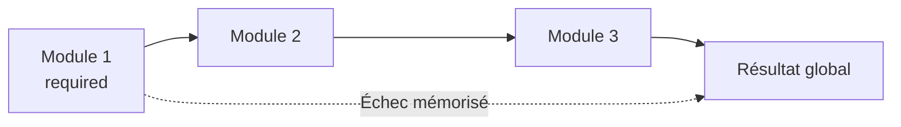

Le refus est enregistré. Mais le traitement continue.

## `requisite`

Le second indicateur est : `requisite` Cette fois, le comportement est différent. Si le module échoue :

- l'authentification échoue immédiatement ;
- PAM arrête complètement son traitement.

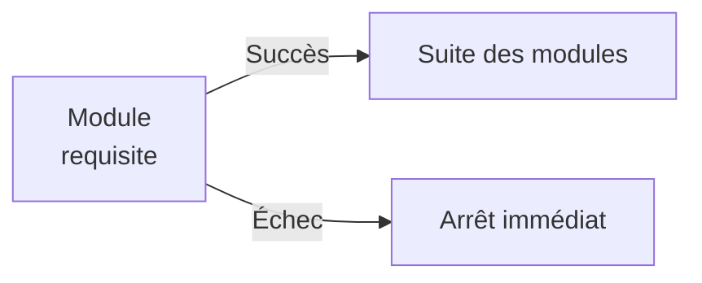

Ce type de contrôle est utilisé lorsqu'il est inutile de poursuivre les vérifications. Par exemple, si une condition fondamentale n'est pas remplie.

## `sufficient`

Le troisième indicateur est souvent celui qui demande le plus d'attention. `sufficient` Signifie :

> Si ce module réussit, et qu'aucun module `required` précédent n'a échoué, l'authentification peut être considérée comme réussie immédiatement.

Autrement dit :

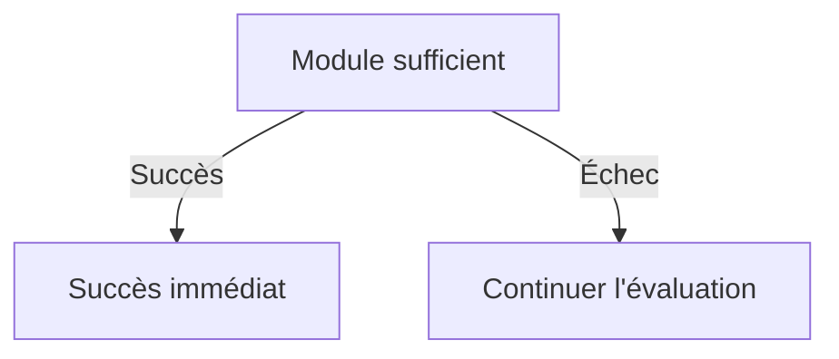

Ce comportement est très pratique lorsqu'on possède plusieurs méthodes d'authentification. Par exemple :

- certificat ;
- mot de passe ;
- authentification réseau.

Une seule méthode peut suffire.

## `optional`

Enfin : `optional` Comme son nom l'indique, le résultat du module n'a généralement pas d'influence sur la décision finale. Ces modules servent souvent à effectuer des traitements annexes. Par exemple :

- enregistrer une information ;
- mettre à jour un compteur ;
- déclencher une action complémentaire.

Leur succès ou leur échec ne modifie normalement pas la décision d'authentification.

## Une vue d'ensemble

Les quatre indicateurs peuvent être résumés ainsi.

| Contrôle | Si le module échoue | PAM continue ? |
|-----------|---------------------|----------------|
| `required` | Échec mémorisé | Oui |
| `requisite` | Échec immédiat | Non |
| `sufficient` | Ignoré, on continue | Oui |
| `optional` | Généralement sans impact | Oui |

Cette table est volontairement simplifiée. PAM possède une logique encore plus riche, notamment avec la syntaxe de contrôle étendue (`[success=1 default=ignore]`, etc.), que l'on rencontre parfois dans les distributions modernes. Nous commencerons par maîtriser les indicateurs historiques, qui permettent déjà de comprendre l'immense majorité des configurations.

## Un exemple concret

Imaginons la configuration suivante.

```text
auth required   pam_env.so

auth required   pam_faillock.so

auth sufficient pam_unix.so

auth required   pam_deny.so
```

Le déroulement est le suivant.

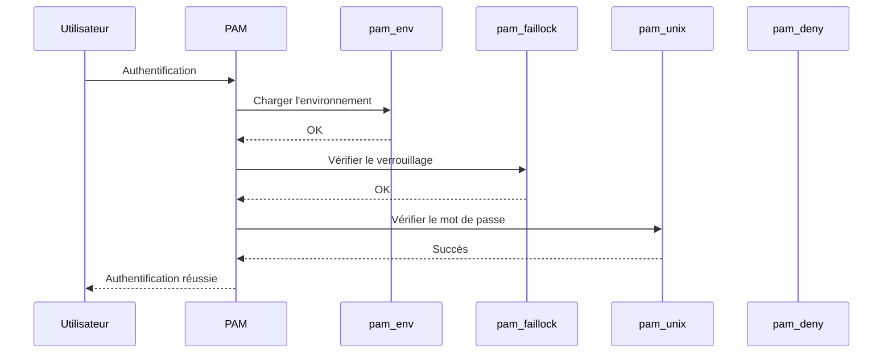

Chaque module possède une responsabilité bien précise. Aucun ne connaît l'ensemble de la politique. PAM orchestre simplement leur enchaînement.

## Pourquoi cette architecture est-elle si puissante ?

Prenons un scénario. Aujourd'hui, l'entreprise utilise uniquement : `pam_unix.so` Demain, elle souhaite ajouter :

- un second facteur ;
- une authentification FreeIPA ;
- une carte à puce.

L'application ne change pas. La configuration PAM évolue simplement.

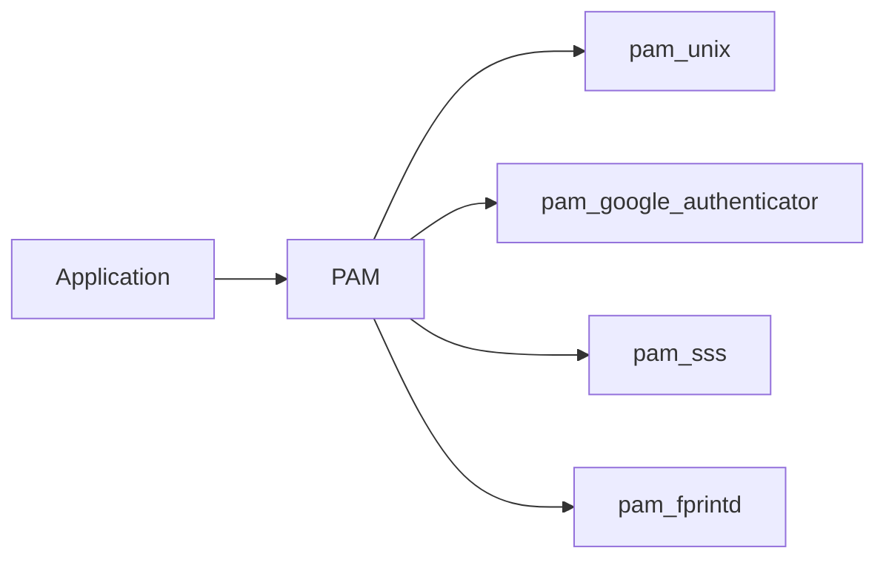

Une même application peut ainsi adopter de nouvelles méthodes d'authentification sans qu'une seule ligne de son code source ne soit modifiée. C'est l'une des plus grandes forces de PAM.

### Culture technique

PAM est apparu au milieu des années 1990 afin de résoudre un problème devenu critique. À cette époque, les entreprises commencent à abandonner les comptes purement locaux. Les annuaires LDAP se développent. Les mécanismes Kerberos apparaissent. Les cartes à puce commencent à être utilisées. Sans PAM, chaque logiciel aurait dû être modifié pour prendre en charge chacune de ces nouvelles technologies. Grâce à PAM, un nouveau module suffit.

Toutes les applications compatibles peuvent immédiatement bénéficier de cette nouvelle méthode d'authentification. Cette architecture a largement contribué à la longévité de nombreux logiciels UNIX. Un programme écrit il y a vingt ans peut aujourd'hui utiliser une authentification moderne sans avoir été profondément réécrit.

### Piège classique

Une erreur fréquente consiste à modifier directement les fichiers situés dans : `/etc/pam.d/` sans comprendre leurs dépendances. Prenons un exemple. Un administrateur modifie : `/etc/pam.d/system-auth` Quelques mois plus tard, une mise à jour du système réécrit ce fichier. Les modifications disparaissent. Sur les distributions de la famille RHEL, il est généralement recommandé d'utiliser les outils prévus pour gérer ces politiques, plutôt que d'éditer directement certains fichiers mutualisés. Par exemple :

```bash
authselect
```

permet de sélectionner et de personnaliser un profil d'authentification tout en conservant une configuration cohérente et compatible avec les mises à jour.

> **Bon réflexe**
>
> Avant de modifier un fichier PAM, identifiez s'il est généré ou géré par `authselect`. Une modification manuelle peut être écrasée lors d'une future opération de gestion des profils.

Nous découvrirons cet outil lorsque nous intégrerons FreeIPA dans notre infrastructure.

## TP 1 — Expérimenter sur AlmaLinux

Nous allons observer la configuration PAM d'un système AlmaLinux. Commencez par afficher les fichiers disponibles.

```bash
ls /etc/pam.d
```

Repérez notamment :

```text
login
passwd
sshd
sudo
su
system-auth
password-auth
```

Ouvrons maintenant la configuration de `sudo`.

```bash
cat /etc/pam.d/sudo
```

Vous remarquerez qu'elle contient peu de logique directement. Elle s'appuie généralement sur une configuration commune. Observons ensuite le profil principal.

```bash
cat /etc/pam.d/system-auth
```

Ou, sur un système récent géré par `authselect`, affichez également :

```bash
authselect current
```

Essayez d'identifier :

- les quatre familles (`auth`, `account`, `password`, `session`) ;
- les modules utilisés ;
- les indicateurs de contrôle (`required`, `sufficient`, etc.) ou la syntaxe de contrôle avancée (`[success=…]`).

À ce stade, il n'est pas nécessaire de comprendre chaque ligne. L'objectif est simplement de reconnaître la structure générale d'une politique PAM.

## Les principaux modules PAM rencontrés sur AlmaLinux

Au fil de votre carrière, certains modules reviendront régulièrement. Voici les plus importants.

| Module | Rôle principal |
|---------|----------------|
| `pam_unix.so` | Authentification locale via `/etc/shadow` |
| `pam_sss.so` | Authentification via SSSD (FreeIPA, LDAP, AD...) |
| `pam_faillock.so` | Verrouillage après plusieurs échecs |
| `pam_env.so` | Chargement de variables d'environnement |
| `pam_limits.so` | Application des limites de ressources |
| `pam_systemd.so` | Initialisation de la session avec systemd |
| `pam_deny.so` | Refus systématique de l'accès |
| `pam_permit.so` | Autorisation systématique (à utiliser avec une extrême prudence) |

Vous n'avez pas besoin de connaître immédiatement le fonctionnement détaillé de chacun. Retenez simplement qu'une politique PAM est construite comme un assemblage de petits modules spécialisés. Cette approche modulaire est l'une des grandes forces de Linux.

## PAM n'authentifie pas uniquement les utilisateurs

Lorsque l'on découvre PAM, on pense immédiatement aux connexions SSH. Pourtant, son champ d'application est bien plus vaste. De nombreux services utilisent PAM.

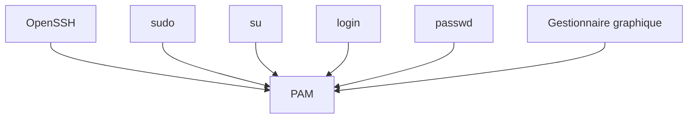

Tous ces programmes délèguent une partie de leur logique d'authentification ou de gestion de session à PAM. Cette mutualisation garantit une politique homogène sur l'ensemble du système.

## PAM n'est pas une base de comptes

Une confusion revient très souvent. Certains administrateurs pensent que PAM contient les utilisateurs. Ce n'est pas le cas. PAM ne stocke aucun compte. Il ne contient aucun mot de passe. Il ne conserve aucune identité. PAM agit uniquement comme un **orchestrateur**. Les véritables informations proviennent d'autres composants. Par exemple :

- `/etc/shadow` avec `pam_unix.so` ;
- SSSD avec `pam_sss.so` ;
- Kerberos ;
- LDAP ;
- FreeIPA ;
- Active Directory ;
- ou tout autre module compatible.

On peut représenter cette architecture de la manière suivante.

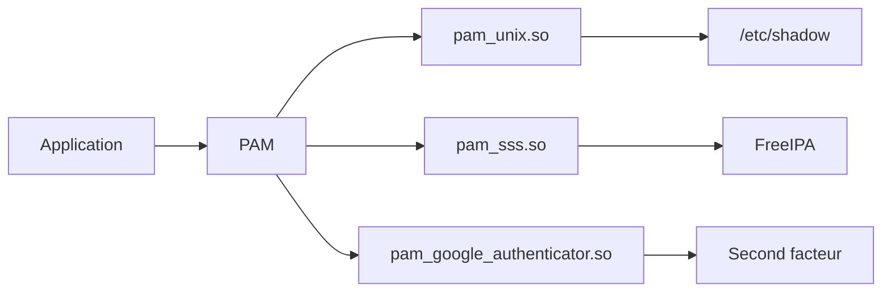

Cette séparation est fondamentale. Elle permet à une même machine de prendre en charge plusieurs sources d'identité sans modifier les applications.

## Une authentification complète

Imaginons un utilisateur qui se connecte en SSH. Vu de l'extérieur, tout semble très simple.

```text
Login :

Mot de passe :

Connexion.
```

En réalité, plusieurs dizaines d'opérations peuvent être réalisées. Par exemple :

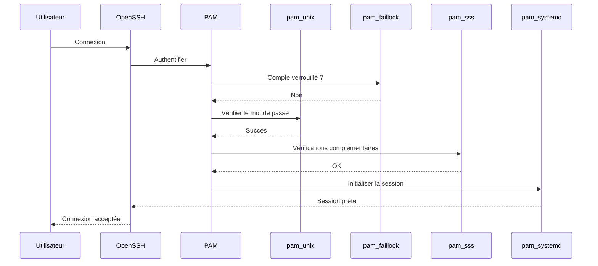

Le mot de passe n'est donc qu'une petite partie du processus.

## Pourquoi Sentinel utilisera PAM

Notre application Sentinel deviendra progressivement un véritable service Linux. Plusieurs choix seront alors possibles. Premier choix. Sentinel implémente entièrement son propre système d'authentification. Elle gère :

- les mots de passe ;
- leur stockage ;
- leur expiration ;
- leur complexité.

Cette solution paraît simple. En réalité, elle est catastrophique. Pourquoi ? Parce qu'elle duplique une fonctionnalité déjà fournie par le système. Deuxième choix. Sentinel délègue complètement cette responsabilité à Linux. Elle utilise PAM. Dans ce cas :

- la politique de sécurité est centralisée ;
- les utilisateurs existants peuvent être réutilisés ;
- l'intégration avec FreeIPA devient immédiate ;
- le MFA devient disponible sans modifier l'application.

C'est évidemment cette seconde approche que nous retiendrons.

### Culture technique

À ses débuts, Linux utilisait principalement des comptes locaux. Chaque machine possédait son propre fichier : `/etc/passwd` et son propre fichier : `/etc/shadow` L'administration était relativement simple. Mais lorsque les entreprises ont commencé à gérer :

- des centaines de serveurs ;
- des milliers d'utilisateurs ;
- plusieurs sites géographiques ;

ce modèle est rapidement devenu insuffisant. Chaque changement de mot de passe devait être reproduit sur toutes les machines. Chaque création de compte nécessitait une intervention sur chaque serveur. Les risques d'erreur augmentaient rapidement. PAM a largement facilité la transition vers des infrastructures centralisées. Lorsqu'une entreprise adopte un annuaire comme FreeIPA, OpenLDAP ou Active Directory (via SSSD), les applications n'ont pas besoin d'être réécrites. Elles continuent à dialoguer avec PAM.

Seuls les modules utilisés par PAM évoluent. Cette capacité d'adaptation explique pourquoi PAM est encore aujourd'hui l'un des piliers de l'authentification sous Linux.

### Piège classique

L'un des pièges les plus dangereux consiste à modifier une configuration PAM sans prévoir de solution de secours. Imaginons que vous modifiiez : `/etc/pam.d/sshd` Une erreur de syntaxe. Un module absent. Une mauvaise directive de contrôle. Résultat : plus personne ne peut se connecter en SSH. Si le serveur est distant, la situation peut devenir très problématique. Quelques bonnes pratiques permettent d'éviter ce type d'incident.

- Conservez toujours une session administrateur déjà ouverte avant toute modification.
- Testez les changements avec une **nouvelle** connexion, sans fermer la première.
- Si le serveur est hébergé à distance, assurez-vous de disposer d'un accès à la console (IPMI, iLO, DRAC, console du fournisseur cloud, etc.).
- Utilisez les outils de gestion recommandés (`authselect` sur AlmaLinux/RHEL) plutôt que de modifier directement les profils mutualisés lorsque cela est possible.
- Sauvegardez les fichiers concernés avant toute modification.

Une erreur PAM n'empêche pas uniquement l'authentification. Elle peut rendre un serveur totalement inaccessible.

## TP 2 — Expérimenter sur AlmaLinux

Dans ce laboratoire, nous allons observer PAM sans modifier sa configuration. Commencez par identifier le profil d'authentification utilisé.

```bash
authselect current
```

Vous obtiendrez un résultat proche de : `Profile ID: sssd` ou : `Profile ID: local` Affichez ensuite les fichiers principaux.

```bash
cat /etc/pam.d/system-auth
```

Puis :

```bash
cat /etc/pam.d/password-auth
```

Repérez :

- les familles (`auth`, `account`, `password`, `session`) ;
- les modules utilisés ;
- les indicateurs de contrôle.

Essayez ensuite de retrouver le rôle de quelques modules. Par exemple : `pam_unix.so` `pam_faillock.so` `pam_env.so` `pam_systemd.so` L'objectif n'est pas encore de modifier ces fichiers. Il est simplement de comprendre qu'une authentification Linux est construite comme une chaîne de traitements.

## Gérer PAM avec `authselect`

Sur les versions récentes de la famille RHEL, dont AlmaLinux suit l'architecture, `authselect` gère les piles mutualisées telles que `system-auth` et `password-auth`, ainsi que tout ou partie de `nsswitch.conf`. Une ligne portant « Do not modify this file manually » doit être prise au sérieux : une modification directe peut être écrasée ou créer un état que l'outil refuse.

```bash
authselect current
authselect check
authselect list
```

`authselect check` vérifie la cohérence de la configuration. Pour une adaptation durable, on crée généralement un **profil personnalisé** à partir d'un profil fourni, on modifie ses modèles, puis on le sélectionne et on applique les changements. Ce travail doit être testé sur une machine de laboratoire avec une session de secours ouverte.

```bash
sudo authselect create-profile sentinel -b sssd
sudo authselect select custom/sentinel
sudo authselect apply-changes
```

Les options exactes et les fichiers générés dépendent de la version et du profil : consultez `authselect(8)` avant toute modification. L'objectif n'est pas de mémoriser une recette, mais de distinguer trois niveaux : fichier propre à une application (`/etc/pam.d/sudo`), pile mutualisée générée, et modèle source géré par `authselect`.

L'ordre demeure crucial. `include` insère les règles d'une autre pile dans la pile courante ; `substack` exécute une sous-pile en limitant certains effets des sauts numériques. Les contrôles entre crochets, comme `[success=1 default=bad]`, forment un petit langage de branchement : les recopier sans tracer chaque chemin de succès et d'échec est dangereux.

## Mission d'ingénieur — Cartographier une authentification Sentinel

Choisissez une entrée réaliste, par exemple une connexion SSH d'un opérateur. Dessinez la pile appelée, classez chaque module dans `auth`, `account`, `password` ou `session`, et indiquez sa source d'identité ainsi que son journal. Ajoutez les chemins « mot de passe correct mais compte expiré » et « identité distante indisponible ». Le livrable doit aussi préciser quels fichiers sont gérés par `authselect` et la procédure de retour arrière.

## Impact sur Sentinel

Sentinel ne possédera pas sa propre base de comptes. Elle s'intégrera au système d'information de l'entreprise. Cette décision présente plusieurs avantages.

- Les utilisateurs utiliseront leur identité habituelle.
- Les politiques de mots de passe seront centralisées.
- Les verrouillages de compte seront automatiquement appliqués.
- L'intégration avec FreeIPA sera immédiate.
- L'authentification multifacteur pourra être introduite sans modifier le code métier de Sentinel.

On peut résumer cette architecture ainsi.

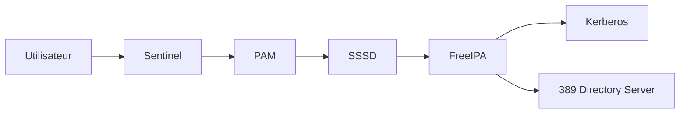

Remarquez un point important. Sentinel ne dialogue ni avec Kerberos, ni directement avec LDAP. Elle dialogue uniquement avec PAM. Le reste de l'architecture demeure transparent pour l'application. C'est exactement ce que recherche une conception modulaire.

## Synthèse

- PAM signifie **Pluggable Authentication Modules**.
- PAM ne stocke ni utilisateurs, ni mots de passe ; il orchestre des modules spécialisés.
- Les applications délèguent l'authentification à PAM au lieu de l'implémenter elles-mêmes.
- Les quatre familles de modules sont `auth`, `account`, `password` et `session`.
- Les indicateurs de contrôle (`required`, `requisite`, `sufficient`, `optional`) déterminent la manière dont PAM interprète le résultat de chaque module.
- Une politique PAM cohérente permet de mutualiser l'authentification entre tous les services du système.
- Une mauvaise modification de PAM peut rendre un serveur inaccessible ; toute évolution doit être testée avec précaution.

## Infographie de révision

```text
                      PAM (Pluggable Authentication Modules)

                                  Application
                                       │
                                       ▼
                                Demande d'accès
                                       │
                                       ▼
                                   PAM décide
                                       │
      ┌────────────────────────────────┼────────────────────────────────┐
      │                                │                                │
      ▼                                ▼                                ▼
 Vérifier l'identité           Vérifier le compte            Préparer la session
      auth                         account                      session
      │                                │                            │
      └───────────────┬────────────────┴────────────────────────────┘
                      ▼
              Modifier le secret
                 password
                      │
                      ▼
             Décision d'authentification

────────────────────────────────────────────────────────────────────────────

                     PAM ne stocke aucune identité

         pam_unix.so ─────────────► /etc/shadow

         pam_sss.so ──────────────► SSSD ─────► FreeIPA / LDAP / AD

         pam_google_authenticator ─► Second facteur

────────────────────────────────────────────────────────────────────────────

                 Une seule politique pour plusieurs services

                 SSH
                  │
                 sudo
                  │
                login
                  │
               Sentinel
                  │
                  ▼
                 PAM

────────────────────────────────────────────────────────────────────────────

         PAM centralise la politique d'authentification.
      Les applications n'ont plus besoin de la réimplémenter.
```

## Pour aller plus loin

Nous savons désormais **comment Linux authentifie un utilisateur**. Mais une nouvelle question apparaît immédiatement.

> Que signifie exactement « un bon mot de passe » ?

Est-ce :

- un mot de passe long ?
- un mot de passe complexe ?
- un mot de passe jamais utilisé auparavant ?
- un mot de passe changé régulièrement ?
- une phrase de passe ?

Pendant longtemps, les politiques de sécurité se sont concentrées sur la complexité. Aujourd'hui, les recommandations ont profondément évolué. Dans le prochain chapitre, nous allons découvrir comment construire une **politique de mots de passe adaptée à un environnement professionnel**, pourquoi certaines anciennes pratiques sont désormais déconseillées et comment AlmaLinux applique concrètement ces règles grâce à PAM et à ses modules associés.

← [2.4 — Les attributs étendus](2.4-attributs-etendus.md) · [2.6 — Politique de mots de passe](2.6-politique-mots-de-passe.md) →
