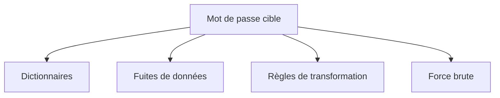
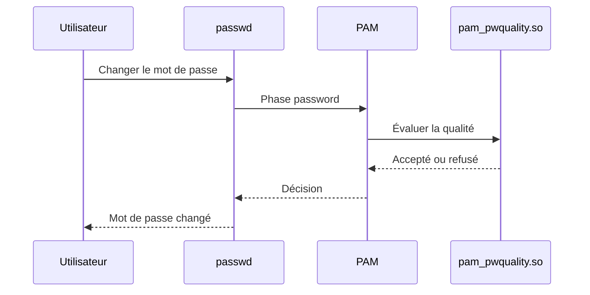
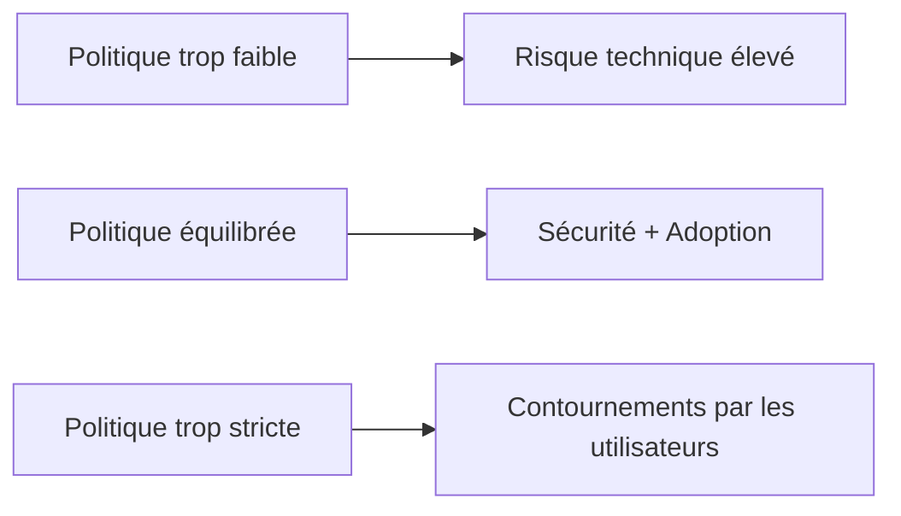
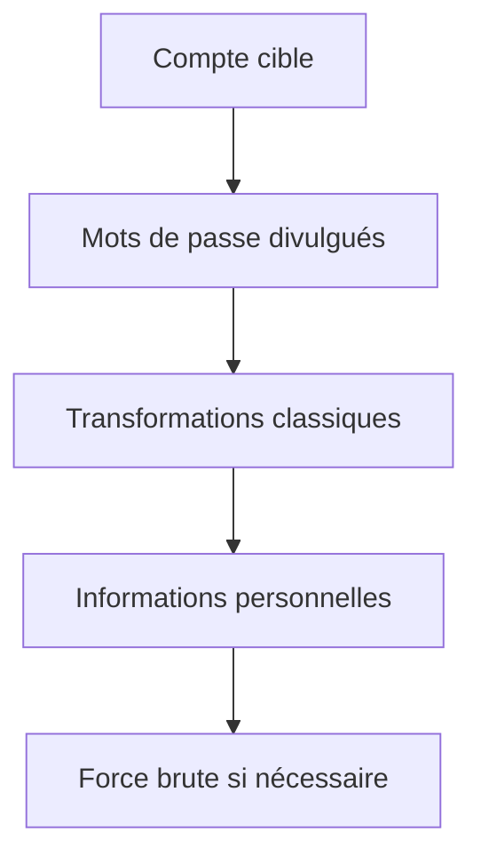

# Chapitre 2.6 — Politique de mots de passe

> **Campagne 2 — Contrôle des accès**

> *« Un mot de passe n'est pas sûr parce qu'il est compliqué. Il est sûr parce qu'il résiste à une attaque réaliste. »*

---

## Vous êtes ici

```text
PARTIE I — Construire un socle sécurisé

Campagne 1  [██████████] ✔
Campagne 2  [██████░░░░]

      2.1 Les permissions UNIX ✔
      2.2 ACL ✔
      2.3 umask ✔
      2.4 Attributs étendus ✔
      2.5 PAM ✔
   ►  2.6 Politique de mots de passe
      2.7 Comptes système
      2.8 sudo avancé
      2.9 passwd / shadow / group
      2.10 Synthèse
```

---

## Objectifs pédagogiques

À la fin de ce chapitre, vous serez capable de :

- comprendre les principes d'une politique de mots de passe moderne ;
- distinguer longueur, complexité et entropie ;
- expliquer le rôle des modules PAM dédiés aux mots de passe ;
- configurer une politique adaptée à un environnement AlmaLinux ;
- comprendre les mécanismes d'expiration, d'historique et de verrouillage ;
- éviter les erreurs les plus fréquentes dans la définition d'une politique de mots de passe.

---

## Pourquoi ce chapitre existe

Pendant de nombreuses années, les politiques de mots de passe étaient relativement simples.

On imposait par exemple :

- au moins huit caractères ;
- une majuscule ;
- une minuscule ;
- un chiffre ;
- un caractère spécial.

Cette approche semblait logique.

Pourtant, elle présentait plusieurs défauts.

Les utilisateurs choisissaient souvent des mots de passe prévisibles.

Par exemple :

```text
Password1!
```

ou :

```text
Bienvenue2025!
```

Ces mots de passe respectaient parfaitement la politique.

Mais ils étaient très faciles à deviner.

Les organismes spécialisés dans la cybersécurité, comme le NIST (National Institute of Standards and Technology), ont progressivement fait évoluer leurs recommandations.

Aujourd'hui, la longueur est généralement considérée comme plus importante que la complexité artificielle.

Nous allons comprendre pourquoi.

---

## Que cherche réellement un attaquant ?

Avant de définir une politique de mots de passe, il faut comprendre les attaques auxquelles elle doit résister.

Un attaquant ne tape généralement pas des mots de passe au hasard.

Il utilise des méthodes bien plus efficaces.

Par exemple :

- des dictionnaires ;
- des listes de mots de passe déjà divulgués ;
- des attaques hybrides ;
- des règles de transformation ;
- des attaques par force brute.

On peut représenter cette démarche ainsi.



Une bonne politique de mots de passe doit ralentir ou empêcher ces différentes approches.

---

## Longueur contre complexité

Prenons deux mots de passe.

Le premier.

```text
P@ssw0rd!
```

Le second.

```text
LesNuagesTraversentLaMontagneChaqueMatin
```

Lequel est le plus difficile à casser ?

Instinctivement, beaucoup répondent le premier.

Pourtant, le second est généralement beaucoup plus robuste.

Pourquoi ?

Parce que sa longueur augmente considérablement le nombre de combinaisons possibles.

La longueur est aujourd'hui considérée comme l'un des critères les plus importants.

Cela ne signifie pas que la complexité est inutile.

Mais une longue phrase de passe est souvent préférable à un mot de passe court artificiellement complexifié.

---

## Qu'est-ce que l'entropie ?

Le terme **entropie** revient très souvent lorsque l'on parle de mots de passe.

Il désigne, de manière simplifiée, la difficulté à prédire un secret.

Plus un mot de passe est imprévisible, plus son entropie est élevée.

Attention toutefois à une idée reçue.

L'entropie ne dépend pas uniquement de la longueur.

Elle dépend également du mode de construction.

Prenons ces deux exemples.

```text
aaaaaaaaaaaaaaaaaaaa
```

et

```text
F7vL!p2KmQ8zR4xA9#
```

Ils n'offrent évidemment pas le même niveau de sécurité.

La longueur est identique.

La prévisibilité ne l'est pas.

Une bonne politique cherche donc à favoriser des secrets :

- suffisamment longs ;
- suffisamment variés ;
- mais également faciles à mémoriser.

---

## Les phrases de passe

Les recommandations modernes mettent de plus en plus en avant les **phrases de passe** (*passphrases*).

Une phrase de passe est constituée de plusieurs mots.

Par exemple :

```text
MonChatObserveLesEtoilesChaqueNuit
```

ou :

```text
LaRiviereTraverseLeVillageEnSilence
```

Ces phrases présentent plusieurs avantages.

Elles sont :

- longues ;
- faciles à retenir ;
- difficiles à casser par force brute.

Leur sécurité repose davantage sur leur longueur que sur une accumulation de caractères spéciaux.

Naturellement, il convient d'éviter les citations célèbres, les paroles de chansons ou les expressions très connues, car elles figurent souvent dans les dictionnaires utilisés par les attaquants.

---

## La complexité n'est pas inutile

Faut-il alors abandonner toute exigence de complexité ?

Non.

Une politique équilibrée reste souhaitable.

Par exemple, imposer une longueur minimale élevée tout en refusant les mots de passe trop simples.

L'objectif n'est plus d'obliger l'utilisateur à ajouter :

```text
!
```

à la fin de son mot de passe.

L'objectif est de réduire la prévisibilité.

C'est une nuance importante.

Une politique de sécurité ne doit pas conduire les utilisateurs à produire des mots de passe artificiels.

Elle doit les conduire à produire des secrets difficiles à deviner.

---

## Comment Linux applique ces règles ?

Sous AlmaLinux, les politiques de mots de passe reposent principalement sur PAM.

Plusieurs modules spécialisés peuvent intervenir.

Historiquement, le plus connu était :

```text
pam_pwquality.so
```

Son rôle est d'évaluer la qualité d'un nouveau mot de passe.

Il peut vérifier :

- la longueur minimale ;
- la présence de différentes catégories de caractères ;
- certaines répétitions ;
- la similarité avec l'ancien mot de passe ;
- d'autres critères configurables.

Lorsqu'un utilisateur exécute :

```bash
passwd
```

le module est appelé pendant la phase :

```text
password
```

de PAM.



Le programme `passwd` ne contient donc pas lui-même toutes les règles de qualité.

Comme pour les autres mécanismes d'authentification, il délègue cette responsabilité à PAM.

---
## Le rôle de `pam_pwquality`

Le module :

```text
pam_pwquality.so
```

est probablement le composant le plus connu lorsqu'on parle de politique de mots de passe sous les distributions de la famille RHEL.

Son objectif n'est pas de déterminer si un mot de passe est « parfait ».

Son objectif est beaucoup plus pragmatique.

Il cherche à empêcher les choix manifestement faibles.

Par exemple :

- un mot de passe trop court ;
- un mot de passe identique à l'ancien ;
- un mot de passe composé d'un seul caractère répété ;
- un mot de passe trop proche du nom de l'utilisateur.

Il agit donc comme un premier filtre.

Une fois ce filtre franchi, le nouveau mot de passe peut être enregistré.

---

## Où se trouve la configuration ?

Sous AlmaLinux, la configuration de `pam_pwquality` est généralement centralisée.

Le fichier principal est :

```text
/etc/security/pwquality.conf
```

On peut l'ouvrir avec :

```bash
sudo less /etc/security/pwquality.conf
```

Vous y trouverez plusieurs paramètres.

Par exemple :

```text
minlen
```

```text
minclass
```

```text
maxrepeat
```

```text
difok
```

Chaque paramètre agit sur un aspect particulier de la qualité du mot de passe.

Nous allons maintenant les découvrir.

---

## La longueur minimale

Le paramètre le plus évident est :

```text
minlen
```

Il définit la longueur minimale acceptable.

Par exemple :

```text
minlen = 15
```

Cette valeur signifie simplement :

> tout mot de passe de moins de quinze caractères sera refusé.

Aujourd'hui, de nombreuses organisations privilégient une longueur minimale importante plutôt qu'une multiplication de contraintes artificielles.

Une phrase de passe de vingt caractères est généralement préférable à un mot de passe de huit caractères rendu complexe uniquement pour satisfaire une règle.

---

## Les classes de caractères

Le paramètre :

```text
minclass
```

impose un nombre minimal de catégories différentes.

Les catégories sont notamment :

- lettres minuscules ;
- lettres majuscules ;
- chiffres ;
- caractères spéciaux.

Par exemple :

```text
minclass = 3
```

signifie que le mot de passe devra contenir au moins trois catégories distinctes.

Cette contrainte peut être utile.

Mais elle ne doit pas devenir excessive.

Une politique trop contraignante pousse souvent les utilisateurs à créer des mots de passe prévisibles.

Par exemple :

```text
Motdepasse2026!
```

Tous les critères sont respectés.

La robustesse réelle reste pourtant limitée.

---

## Les répétitions

Autre paramètre intéressant.

```text
maxrepeat
```

Il limite le nombre maximal de caractères identiques consécutifs.

Par exemple :

```text
aaaaaa
```

sera généralement refusé.

Cette règle permet d'éviter certains mots de passe extrêmement faibles.

Elle améliore légèrement la robustesse sans compliquer inutilement la vie des utilisateurs.

---

## La différence avec l'ancien mot de passe

Le paramètre :

```text
difok
```

contrôle le nombre minimal de caractères différents entre l'ancien et le nouveau mot de passe.

Prenons un exemple.

Ancien mot de passe.

```text
MonServeur2025
```

Nouvelle proposition.

```text
MonServeur2026
```

La modification est très faible.

Selon la valeur de :

```text
difok
```

ce changement pourra être refusé.

Cette règle évite les modifications purement cosmétiques.

---

## Une politique raisonnable

Toutes les contraintes précédentes peuvent être combinées.

Cependant, une bonne politique reste une politique utilisable.

Prenons deux approches.

Première approche.

```text
12 caractères

Majuscule

Minuscule

Chiffre

Caractère spécial

Aucun mot du dictionnaire

Aucune répétition

Changement obligatoire tous les 30 jours
```

Cette politique paraît très sécurisée.

En pratique, les utilisateurs finissent souvent par écrire leurs mots de passe sur un papier ou par adopter des variantes très prévisibles.

Deuxième approche.

```text
Longueur importante

Phrase de passe

Historique

Blocage après plusieurs échecs

MFA lorsque c'est possible
```

Cette seconde approche offre souvent un meilleur niveau de sécurité réel.

Pourquoi ?

Parce qu'elle prend en compte le comportement humain.

La sécurité ne consiste pas uniquement à définir des règles.

Elle consiste à définir des règles que les utilisateurs pourront réellement respecter.

---

### 💎 Le point d'expertise

Il est important de distinguer deux notions souvent confondues.

**La qualité d'un mot de passe** et **sa résistance à une attaque hors ligne**.

Lorsqu'un attaquant obtient une copie de `/etc/shadow`, il peut tenter de casser les condensats (*hashes*) sans interagir avec le serveur.

Dans ce contexte, plusieurs éléments interviennent :

- la qualité du mot de passe ;
- l'algorithme de hachage utilisé ;
- ses paramètres de coût (*work factor*) ;
- la puissance de calcul disponible pour l'attaquant.

Autrement dit, un excellent mot de passe reste indispensable.

Mais il doit être associé à un algorithme moderne, comme **yescrypt** (par défaut sur les versions récentes de RHEL/AlmaLinux), correctement paramétré.

Nous étudierons en détail le stockage des mots de passe lorsque nous analyserons le fichier :

```text
/etc/shadow
```

dans le chapitre **2.9**.

---
### 🧠 Comment pense un architecte ?

Un architecte ne cherche pas à construire la politique de mots de passe la plus sévère.

Il cherche à construire la politique **la plus efficace**.

La nuance est importante.

Une politique trop permissive expose le système.

Une politique trop contraignante pousse les utilisateurs à développer de mauvaises habitudes.

Par exemple :

- écrire le mot de passe sur un Post-it ;
- enregistrer le mot de passe dans un fichier texte ;
- réutiliser le même mot de passe partout ;
- créer des variantes prévisibles.

Une politique de sécurité réussie est donc un compromis.

Elle doit protéger l'entreprise sans rendre le travail quotidien impossible.

On peut représenter ce raisonnement ainsi.



L'architecte ne mesure pas uniquement la robustesse théorique.

Il mesure également la probabilité que la politique soit réellement respectée.

---

### ⚔️ Comment pense un attaquant ?

Contrairement à une idée reçue, un attaquant ne commence presque jamais par tester toutes les combinaisons possibles.

Une attaque exhaustive est généralement beaucoup trop coûteuse.

Il procède de manière beaucoup plus pragmatique.

Sa stratégie ressemble souvent à ceci.



Les premières étapes sont extrêmement efficaces.

Pourquoi ?

Parce que de nombreux utilisateurs réutilisent leurs mots de passe.

Ou utilisent des variantes très prévisibles.

Par exemple :

```text
Bienvenue2024!
Bienvenue2025!
Bienvenue2026!
```

Une politique moderne doit donc empêcher ce type de choix.

Elle ne cherche pas uniquement à résister à la force brute.

Elle cherche également à résister aux habitudes humaines.

---

### 📚 Culture technique

Pendant longtemps, les entreprises imposaient un changement de mot de passe tous les 30 ou 60 jours.

Cette pratique est aujourd'hui largement remise en question.

Pourquoi ?

Parce que les utilisateurs adoptaient presque toujours des variantes.

Par exemple :

```text
Printemps2025!
```

devenait :

```text
Été2025!
```

puis :

```text
Automne2025!
```

Le changement était conforme à la politique.

La sécurité réelle évoluait très peu.

Les recommandations modernes, notamment celles du NIST, privilégient désormais une approche différente.

Un mot de passe robuste peut être conservé longtemps.

Il est remplacé :

- lorsqu'il est soupçonné d'avoir été compromis ;
- lorsqu'une fuite est détectée ;
- ou lorsqu'un changement est réellement nécessaire.

Cette évolution illustre un changement de philosophie.

On cherche désormais à améliorer la sécurité **réelle**, plutôt que de simplement appliquer des règles historiques.

> **À retenir**
>
> Certaines organisations imposent encore une rotation périodique pour répondre à des exigences réglementaires ou sectorielles. Il est donc important de distinguer les **bonnes pratiques techniques** des **obligations de conformité**.

---

### ⚠️ Piège classique

L'une des erreurs les plus fréquentes consiste à croire qu'une politique de mots de passe suffit à protéger un système.

Ce n'est évidemment pas le cas.

Même le meilleur mot de passe peut être :

- volé par hameçonnage (*phishing*) ;
- enregistré par un logiciel malveillant ;
- divulgué lors d'une fuite de données ;
- observé par-dessus l'épaule de l'utilisateur (*shoulder surfing*).

La politique de mots de passe n'est qu'une couche de protection.

Elle doit être complétée par :

- le verrouillage après plusieurs échecs ;
- l'authentification multifacteur ;
- une journalisation efficace ;
- une sensibilisation des utilisateurs.

La sécurité repose toujours sur plusieurs mécanismes complémentaires.

---

## Laboratoire AlmaLinux

Commençons par examiner la configuration actuelle.

```bash
sudo less /etc/security/pwquality.conf
```

Repérez quelques paramètres.

Par exemple :

```text
minlen
```

```text
minclass
```

```text
maxrepeat
```

Essayez ensuite de modifier temporairement une valeur sur une machine de laboratoire.

Par exemple :

```text
minlen = 15
```

Créez ensuite un utilisateur de test.

```bash
sudo useradd testuser
```

Définissez son mot de passe.

```bash
sudo passwd testuser
```

Essayez volontairement plusieurs propositions.

- un mot de passe très court ;
- un mot de passe très simple ;
- une phrase de passe longue.

Observez les messages produits par `pam_pwquality`.

Ils permettent généralement de comprendre pourquoi une proposition est refusée.

Une fois l'expérience terminée, pensez à remettre votre configuration initiale.

---

## Impact sur Sentinel

Sentinel ne stockera jamais directement les mots de passe de ses utilisateurs.

Elle s'appuiera sur la politique définie par le système.

Cette décision présente plusieurs avantages.

Si l'entreprise décide :

- d'augmenter la longueur minimale ;
- d'ajouter un second facteur ;
- de migrer vers FreeIPA ;
- de renforcer les règles de qualité ;

Sentinel bénéficiera immédiatement de ces améliorations.

Aucune modification du code applicatif ne sera nécessaire.

Cette séparation des responsabilités est l'un des objectifs principaux de PAM.

---

## Synthèse

- Une politique de mots de passe moderne privilégie la robustesse réelle plutôt que la complexité artificielle.
- La longueur d'un mot de passe est généralement plus importante que l'ajout systématique de caractères spéciaux.
- Les phrases de passe constituent souvent un excellent compromis entre sécurité et mémorisation.
- `pam_pwquality.so` permet d'évaluer la qualité des nouveaux mots de passe lors de leur changement.
- Les paramètres de `pwquality.conf` permettent d'adapter la politique aux besoins de l'organisation.
- Une politique efficace doit tenir compte du comportement des utilisateurs.
- Les mots de passe ne constituent qu'une couche de la stratégie d'authentification ; ils doivent être complétés par d'autres mécanismes lorsque cela est pertinent.

---

## Infographie de révision

```text
                    POLITIQUE DE MOTS DE PASSE

                     Changement de mot de passe
                                │
                                ▼
                           PAM (password)
                                │
                                ▼
                      pam_pwquality.so
                                │
        ┌───────────────────────┼────────────────────────┐
        │                       │                        │
        ▼                       ▼                        ▼
   Longueur minimale      Qualité globale        Différence avec
                                                   l'ancien mot
        │                       │                        │
        └───────────────────────┼────────────────────────┘
                                ▼
                        Mot de passe accepté
                                │
                                ▼
                      Stockage du condensat
                          dans /etc/shadow

──────────────────────────────────────────────────────────────

           Politique moderne de mots de passe

        ✔ Longueur importante
        ✔ Phrase de passe
        ✔ Historique
        ✔ MFA lorsque possible
        ✔ Verrouillage après échecs

        ✘ Complexité artificielle seule
        ✘ Variantes prévisibles
        ✘ Rotation trop fréquente sans justification

──────────────────────────────────────────────────────────────

             La sécurité dépend autant des utilisateurs
                que des mécanismes techniques.
```

## Pour aller plus loin

Jusqu'à présent, nous nous sommes principalement intéressés aux utilisateurs humains.

Pourtant, lorsque vous affichez le contenu de :

```text
/etc/passwd
```

vous découvrez de nombreux comptes qui ne correspondent à aucune personne.

Par exemple :

```text
sshd
chrony
rpc
dbus
nginx
```

Ces comptes jouent un rôle essentiel dans la sécurité de Linux.

Ils permettent d'isoler les services les uns des autres et d'appliquer le **principe du moindre privilège**.

Dans le prochain chapitre, nous allons découvrir pourquoi un démon ne s'exécute presque jamais avec les privilèges de `root`, comment fonctionnent les comptes système et en quoi ils constituent une pierre angulaire de la sécurité d'un système Linux moderne.

---

← [2.5 — PAM](2.5-pam.md) · [2.7 — Les comptes système](2.7-comptes-systeme.md) →
