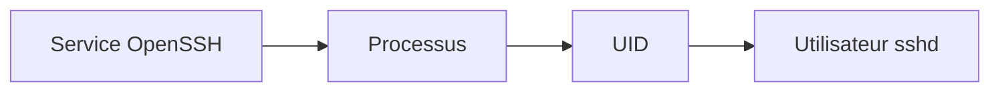
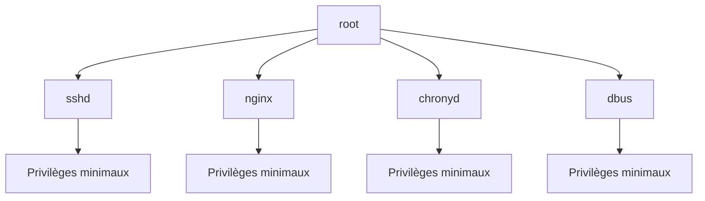
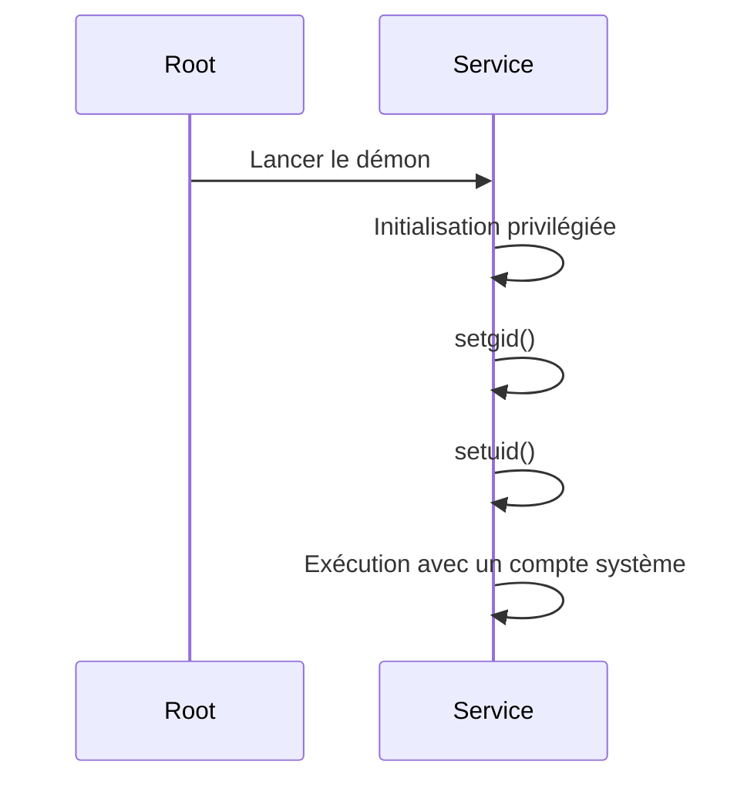
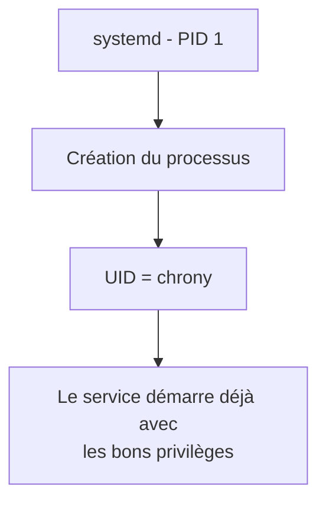
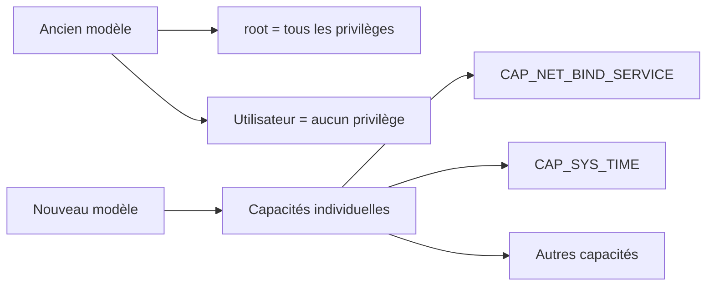
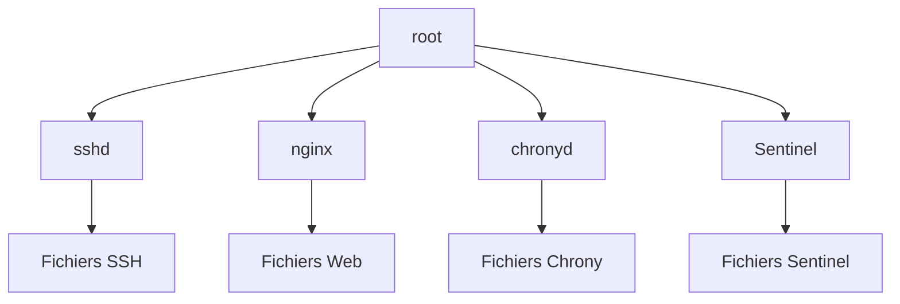
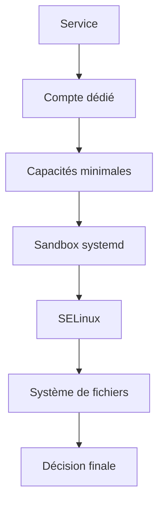
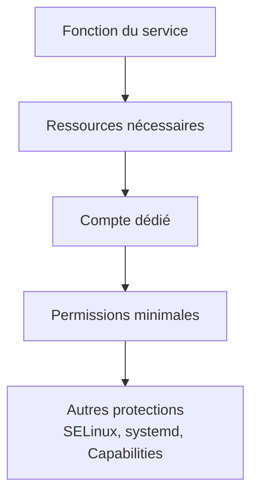
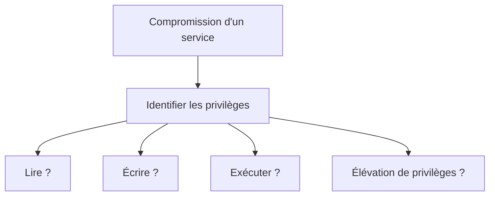

# Chapitre 2.7 — Les comptes système

> **Campagne 2 — Contrôle des accès**

> *« Le service le plus sûr est celui qui ne possède que les privilèges strictement nécessaires à son fonctionnement. »*

---

## Vous êtes ici

```text
PARTIE I — Construire un socle sécurisé

Campagne 1  [██████████] ✔
Campagne 2  [███████░░░]

      2.1 Les permissions UNIX ✔
      2.2 ACL ✔
      2.3 umask ✔
      2.4 Attributs étendus ✔
      2.5 PAM ✔
      2.6 Politique de mots de passe ✔
   ►  2.7 Comptes système
      2.8 sudo avancé
      2.9 passwd / shadow / group
      2.10 Synthèse
```

---

## Objectifs pédagogiques

À la fin de ce chapitre, vous serez capable de :

- distinguer un utilisateur humain d'un compte système ;
- comprendre pourquoi les services Linux utilisent des comptes dédiés ;
- expliquer le principe du moindre privilège appliqué aux démons ;
- identifier les principaux comptes système présents sur AlmaLinux ;
- comprendre comment `systemd` exécute un service avec une identité spécifique ;
- préparer la création du futur compte de service de Sentinel.

---

## Pourquoi ce chapitre existe

Lorsque l'on ouvre pour la première fois :

```text
/etc/passwd
```

une surprise attend souvent les nouveaux administrateurs.

Ils s'attendent à trouver quelques utilisateurs.

À la place, ils découvrent parfois plusieurs dizaines de comptes.

Par exemple :

```text
root
daemon
bin
rpc
sshd
chrony
dbus
nobody
```

Pourtant, une seule personne utilise réellement la machine.

Qui sont donc tous ces utilisateurs ?

La réponse est simple.

Ils ne représentent généralement **aucun être humain**.

Ils représentent des **services**.

Chaque service possède sa propre identité.

Cette idée est l'un des fondements de la sécurité sous Linux.

---

## Un service est aussi un utilisateur

Prenons un exemple.

Le démon OpenSSH.

Lorsqu'il accepte une connexion réseau, il s'exécute sous Linux comme un processus.

Or, tout processus Linux possède :

- un UID ;
- un GID ;
- des permissions ;
- une identité.

Autrement dit, un service doit lui aussi être associé à un utilisateur.

Le schéma suivant illustre cette idée.



Le compte :

```text
sshd
```

n'est donc pas destiné à une personne.

Il sert à donner une identité au démon.

---

## Pourquoi ne pas tout exécuter en `root` ?

Cette question est essentielle.

Après tout, `root` possède tous les droits.

Pourquoi créer des dizaines de comptes supplémentaires ?

Imaginons un serveur Web.

S'il fonctionne sous :

```text
root
```

et qu'un attaquant découvre une vulnérabilité, il obtient immédiatement tous les privilèges de la machine.

En revanche, si le serveur fonctionne sous :

```text
nginx
```

ou :

```text
apache
```

l'attaquant obtient seulement les droits associés à ce compte.

Les dégâts potentiels sont considérablement réduits.

On parle alors de **compartimentation**.

Chaque service est isolé des autres.

---

## Le principe du moindre privilège

Nous avons déjà rencontré ce principe avec `sudo`.

Nous le retrouvons ici.

Chaque service ne doit disposer que des privilèges strictement nécessaires.

Ni plus.

Ni moins.

On peut représenter cette philosophie ainsi.



L'objectif est simple.

Une compromission locale ne doit jamais entraîner automatiquement la compromission complète du serveur.

---

## Tous les comptes ne permettent pas de se connecter

Observons quelques lignes de :

```text
/etc/passwd
```

```text
chrony:x:987:985::/var/lib/chrony:/sbin/nologin

sshd:x:74:74::/run/sshd:/sbin/nologin

rpc:x:32:32::/var/lib/rpcbind:/sbin/nologin
```

Que remarque-t-on ?

Le dernier champ vaut souvent :

```text
/sbin/nologin
```

ou :

```text
/usr/sbin/nologin
```

Selon la distribution.

Cela signifie que ces comptes ne disposent pas d'un shell interactif.

Ils ne sont pas destinés à accueillir une session utilisateur.

Ils existent uniquement pour donner une identité à un processus.

Cette différence est fondamentale.

Un compte système n'est pas nécessairement un compte de connexion.

---

## Une identité sans connexion

Il est important de bien distinguer deux notions.

La première.

Le processus possède une identité.

La seconde.

Cette identité peut ouvrir une session.

Ce sont deux concepts différents.

On peut représenter cela ainsi.

```mermaid
flowchart LR

    A[Compte système]

    A --> B[Identité Linux]

    A --> C[UID]

    A --> D[GID]

    A -.-> E[Connexion interactive ?]

    E -->|Non| F[/sbin/nologin]
```

Le démon utilise bien cette identité.

Mais aucun utilisateur ne peut normalement ouvrir une session interactive avec ce compte.

---

## Qui crée ces comptes ?

La plupart des comptes système sont créés automatiquement.

Par exemple :

- lors de l'installation du système ;
- lors de l'installation d'un paquet RPM ;
- lors de la création d'un nouveau service.

Prenons un exemple.

Vous installez :

```text
chrony
```

Le paquet crée automatiquement :

```text
chrony
```

avec :

- un UID ;
- un GID ;
- un répertoire adapté ;
- un shell `nologin`.

L'administrateur n'a généralement aucune intervention à effectuer.

Le paquet prépare directement l'environnement de sécurité du service.

---
## Un service démarre-t-il en `root` ?

Cette question revient très souvent.

La réponse mérite quelques explications.

De nombreux services doivent effectivement réaliser certaines opérations privilégiées lors de leur démarrage.

Par exemple :

- ouvrir un port inférieur à `1024` ;
- accéder à un fichier appartenant à `root` ;
- créer un socket système ;
- initialiser certains périphériques.

Historiquement, ces services étaient lancés directement par `root`.

Le démon réalisait ses opérations privilégiées.

Puis il appelait les fonctions système :

```c
setgid()
```

puis :

```c
setuid()
```

afin d'abandonner ses privilèges.

On parle souvent de **drop privileges**.

Le déroulement était approximativement le suivant.



Cette approche fonctionne encore.

Mais elle présente plusieurs inconvénients.

Le code du service doit gérer lui-même cette transition.

Une erreur de programmation peut laisser le démon fonctionner en `root` plus longtemps que prévu.

---

## Le rôle de `systemd`

Aujourd'hui, la plupart des services Linux sont lancés par :

```text
systemd
```

`systemd` est exécuté sous l'identité :

```text
root
```

Il possède donc les privilèges nécessaires pour préparer le futur processus.

Lorsqu'une unité contient :

```ini
[Service]
User=chrony
Group=chrony
```

`systemd` crée directement le processus avec l'identité demandée.

Le démon n'a plus besoin d'appeler lui-même :

```text
setuid()
```

dans la majorité des cas.

Le schéma devient alors beaucoup plus simple.



Cette approche réduit le risque d'erreur dans le code applicatif.

Elle participe au durcissement général du système.

---

## Existe-t-il encore des services qui commencent en `root` ?

Oui.

Certaines applications doivent encore réaliser des opérations privilégiées avant de réduire leurs droits.

Par exemple :

- ouvrir un port TCP inférieur à `1024` lorsqu'elles ne s'appuient pas sur les mécanismes modernes de `systemd` ;
- manipuler certains périphériques ;
- effectuer une initialisation nécessitant des privilèges élevés.

Cependant, cette pratique est de moins en moins courante.

Aujourd'hui, plusieurs mécanismes permettent d'éviter de conserver des privilèges élevés.

Par exemple :

- les **capacités Linux** (*Capabilities*) ;
- l'activation par socket de `systemd` (*Socket Activation*) ;
- les espaces de noms (*Namespaces*) ;
- les services `systemd` fortement sandboxés.

Nous étudierons tous ces mécanismes dans les campagnes suivantes.

L'objectif est toujours le même.

Réduire au maximum la durée pendant laquelle un processus possède des privilèges élevés.

---

## Les capacités Linux : un aperçu

Pendant longtemps, un programme avait deux possibilités.

Soit :

```text
root
```

Soit :

```text
non-root
```

Cette vision était très binaire.

Les capacités Linux introduisent une approche beaucoup plus fine.

Au lieu de donner tous les privilèges de `root`, on peut accorder uniquement ceux qui sont réellement nécessaires.

Par exemple :

- ouvrir un port privilégié ;
- modifier l'horloge système ;
- administrer le réseau.

On peut représenter cette évolution ainsi.



Nous consacrerons un chapitre entier aux capacités Linux dans la campagne **5.5**.

---

## Pourquoi autant de comptes système ?

Prenons un serveur classique.

Il peut héberger :

- OpenSSH ;
- Chrony ;
- Podman ;
- SSSD ;
- D-Bus ;
- Auditd ;
- Nginx ;
- Sentinel.

Chacun possède son propre compte.

Pourquoi ?

Parce qu'une vulnérabilité dans :

```text
chronyd
```

ne doit pas donner accès :

- aux journaux de Nginx ;
- aux certificats de SSSD ;
- aux fichiers de Sentinel.

Chaque compte constitue une frontière de sécurité.



Cette isolation limite considérablement les conséquences d'une compromission.

---

### 💎 Le point d'expertise

Le simple fait d'exécuter un service sous un compte dédié n'est pas suffisant.

Un service peut toujours hériter de nombreuses possibilités :

- lire certains fichiers ;
- ouvrir des sockets ;
- accéder au réseau ;
- créer des processus ;
- écrire dans différents répertoires.

Les distributions modernes combinent donc plusieurs couches de protection.

Par exemple :

- compte dédié (`User=`) ;
- groupe dédié (`Group=`) ;
- capacités Linux ;
- sandboxing `systemd` ;
- SELinux ;
- espaces de noms (*Namespaces*) ;
- restrictions sur le système de fichiers.

On peut représenter cette défense en profondeur ainsi.



Le compte système n'est donc que la première couche de protection.

La sécurité d'un service résulte de l'accumulation de plusieurs mécanismes complémentaires.

---
### 🧠 Comment pense un architecte ?

Pour un architecte, la première question n'est jamais :

> « Sous quel utilisateur vais-je exécuter ce service ? »

La véritable question est :

> **« De quels privilèges ce service a-t-il réellement besoin ? »**

La réponse conduit naturellement au choix de l'identité.

Par exemple, un serveur Web n'a généralement pas besoin :

- d'accéder aux répertoires personnels des utilisateurs ;
- de modifier les fichiers système ;
- de lire les clés privées d'autres services ;
- d'administrer le réseau.

Il n'a besoin que d'un ensemble très limité de ressources.

L'architecte construit alors une politique de sécurité autour de cette idée.



L'identité du service est donc une conséquence de son rôle.

Jamais l'inverse.

---

### ⚔️ Comment pense un attaquant ?

Lorsqu'un attaquant compromet un service, sa première question est très différente.

> **« Que puis-je faire avec les privilèges dont je dispose ? »**

Il cherche immédiatement à répondre à des questions comme :

- Puis-je lire des fichiers sensibles ?
- Puis-je écrire dans un répertoire système ?
- Puis-je ouvrir un shell interactif ?
- Puis-je communiquer avec d'autres services ?
- Puis-je élever mes privilèges ?

Plus les privilèges initiaux sont faibles, plus sa progression devient difficile.

On peut représenter cette réflexion ainsi.



Le compte système constitue donc une première barrière.

Il ne supprime pas le risque.

Mais il limite fortement l'impact d'une compromission.

---

### 📚 Culture technique

Les premiers UNIX comportaient déjà plusieurs comptes spéciaux.

On retrouvait notamment :

```text
daemon
```

```text
bin
```

```text
lp
```

```text
mail
```

Ces comptes servaient principalement à séparer les différents services système.

Au fil des années, cette approche s'est affinée.

Aujourd'hui, chaque démon important dispose généralement de son propre compte.

Cette évolution suit une tendance générale de la sécurité moderne.

Au lieu de faire confiance à quelques comptes très puissants, on préfère multiplier les identités très spécialisées.

Cette philosophie se retrouve également dans :

- Kubernetes avec les **Service Accounts** ;
- les identités IAM dans les environnements cloud ;
- les comptes de service Windows ;
- les rôles utilisés dans les bases de données.

Le principe reste identique.

Une identité.

Une responsabilité.

Le minimum de privilèges.

---

### ⚠️ Piège classique

Une erreur fréquente consiste à lancer un nouveau service en `root` « pour simplifier ».

Le raisonnement ressemble souvent à ceci.

> « Je commencerai par le faire fonctionner.
>
> Je réduirai les privilèges plus tard. »

Dans la pratique, ce « plus tard » n'arrive pas toujours.

Le service reste exécuté avec des privilèges excessifs pendant des mois, voire des années.

À l'inverse, il est beaucoup plus simple de concevoir un service sécurisé dès le départ.

Si un accès privilégié est réellement nécessaire, il doit être :

- identifié ;
- justifié ;
- documenté ;
- limité au strict nécessaire.

La sécurité doit accompagner le développement.

Elle ne doit pas être une étape ajoutée après coup.

---

## Laboratoire AlmaLinux

Observons quelques comptes système présents sur une installation AlmaLinux.

Commençons par filtrer les comptes dont le shell est `nologin`.

```bash
grep nologin /etc/passwd
```

Vous obtiendrez un résultat proche de :

```text
sshd:x:74:74::/run/sshd:/sbin/nologin
chrony:x:987:985::/var/lib/chrony:/sbin/nologin
rpc:x:32:32::/var/lib/rpcbind:/sbin/nologin
```

Choisissez ensuite l'un de ces comptes.

Par exemple :

```bash
id chrony
```

Observez son UID et son GID.

Essayez maintenant de lancer une session interactive.

```bash
su - chrony
```

Le système refusera généralement la connexion.

Pourquoi ?

Parce que le shell associé est :

```text
/sbin/nologin
```

Le compte existe.

Le processus peut l'utiliser.

Mais il n'est pas destiné à accueillir un utilisateur humain.

---

Créons maintenant un véritable compte de service.

```bash
sudo useradd \
    --system \
    --home-dir /var/lib/demo \
    --shell /sbin/nologin \
    demo-service
```

Vérifions son existence.

```bash
id demo-service
```

Puis :

```bash
grep demo-service /etc/passwd
```

Vous venez de créer exactement le type de compte que nous utiliserons plus tard pour Sentinel.

---

## Impact sur Sentinel

Sentinel sera installée comme un véritable service d'entreprise.

Elle ne fonctionnera jamais sous :

```text
root
```

Lors de l'installation du paquet RPM, un compte dédié sera créé.

Par exemple :

```text
sentinel
```

L'unité `systemd` utilisera ensuite cette identité.

```ini
[Service]
User=sentinel
Group=sentinel
```

Les répertoires de travail appartiendront à ce compte.

Par exemple :

```text
/var/lib/sentinel

/var/log/sentinel

/etc/sentinel
```

Chaque répertoire recevra uniquement les permissions nécessaires.

Cette architecture limitera fortement les conséquences d'une éventuelle vulnérabilité dans Sentinel.

Nous enrichirons progressivement cette protection avec :

- les capacités Linux ;
- le sandboxing `systemd` ;
- SELinux ;
- les politiques de fichiers.

Le compte système constitue simplement la première étape de cette démarche.

---
## Synthèse

- Un compte système représente généralement un **service**, pas un utilisateur humain.
- Chaque processus Linux s'exécute avec une identité (UID et GID).
- Le principe du moindre privilège impose qu'un service ne possède que les droits strictement nécessaires.
- La plupart des comptes système utilisent un shell de type `nologin`, ce qui empêche les connexions interactives.
- Les services modernes sont généralement lancés par `systemd` directement sous leur identité définitive grâce aux directives `User=` et `Group=`.
- Les comptes système ne constituent qu'une première couche de protection ; ils sont complétés par d'autres mécanismes comme les capacités Linux, le sandboxing `systemd` et SELinux.
- Une bonne conception consiste à créer un compte dédié pour chaque service applicatif.

---

## Infographie de révision

```text
                     LES COMPTES SYSTÈME

                     Utilisateur humain
                             │
                             ▼
                  Ouvre une session interactive
                             │
                             ▼
                 Shell (/bin/bash, /bin/sh...)

──────────────────────────────────────────────────────────────

                      Compte système
                             │
                             ▼
                 Identité d'un service Linux
                             │
          ┌──────────────────┼──────────────────┐
          │                  │                  │
          ▼                  ▼                  ▼
       UID/GID         Répertoire dédié     Shell nologin
                                                 │
                                                 ▼
                                  Pas de connexion interactive

──────────────────────────────────────────────────────────────

                  systemd lance le service

                PID 1 (root)
                     │
                     ▼
          User=sentinel
          Group=sentinel
                     │
                     ▼
          Processus exécuté avec
          des privilèges limités

──────────────────────────────────────────────────────────────

              Principe du moindre privilège

          Service Web      → compte nginx

          SSH              → compte sshd

          Chrony           → compte chrony

          Sentinel         → compte sentinel

──────────────────────────────────────────────────────────────

      Une vulnérabilité dans un service ne doit jamais
      conduire automatiquement à la compromission du serveur.
```

## Pour aller plus loin

Nous savons désormais qu'un service fonctionne avec une identité dédiée.

Nous savons également qu'un utilisateur ordinaire ne doit pas travailler quotidiennement avec les privilèges de `root`.

Une question essentielle reste pourtant en suspens.

> **Comment un administrateur réalise-t-il des opérations privilégiées sans ouvrir directement une session `root` ?**

Pendant longtemps, la réponse était simple.

On utilisait :

```bash
su -
```

Cette approche présente cependant plusieurs inconvénients.

Aujourd'hui, la quasi-totalité des infrastructures Linux professionnelles repose sur un autre mécanisme :

```text
sudo
```

Mais contrairement à ce que beaucoup imaginent, `sudo` ne se limite pas à exécuter une commande en tant que `root`.

Il constitue un véritable moteur de délégation de privilèges, capable d'accorder des droits extrêmement précis, de journaliser les actions réalisées et, dans les grandes entreprises, de s'intégrer directement à des annuaires comme FreeIPA.

Dans le prochain chapitre, nous allons découvrir pourquoi `sudo` est devenu l'un des piliers de l'administration sécurisée des systèmes Linux modernes.

---

← [2.6 — Politique de mots de passe](2.6-politique-mots-de-passe.md) · [2.8 — `sudo` avancé](2.8-sudo-avance.md) →
