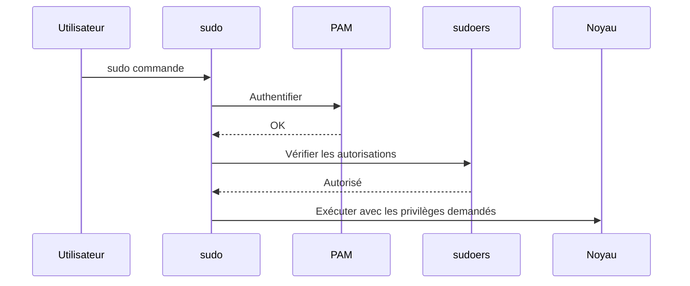
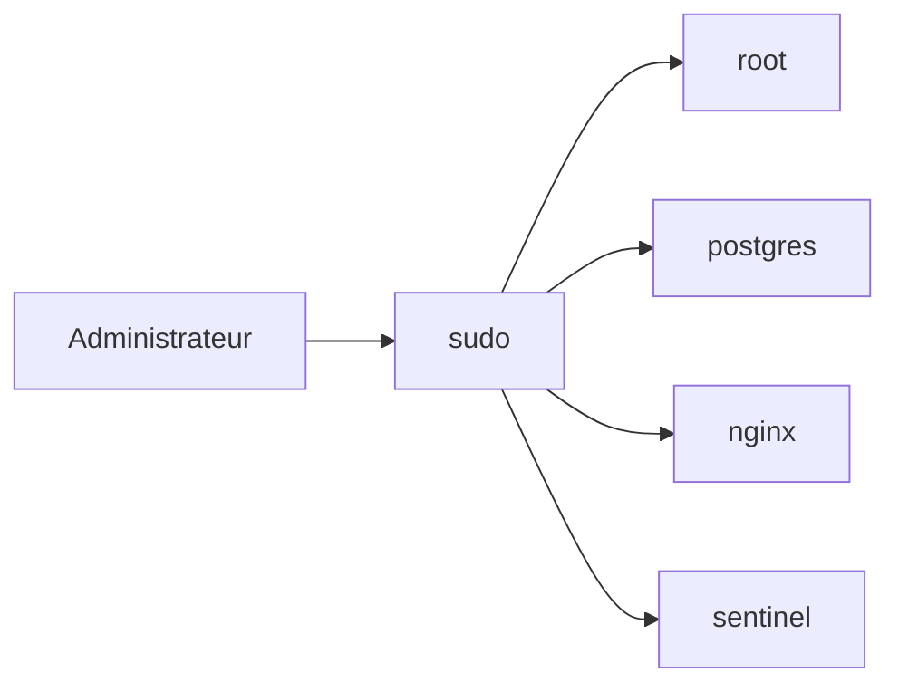
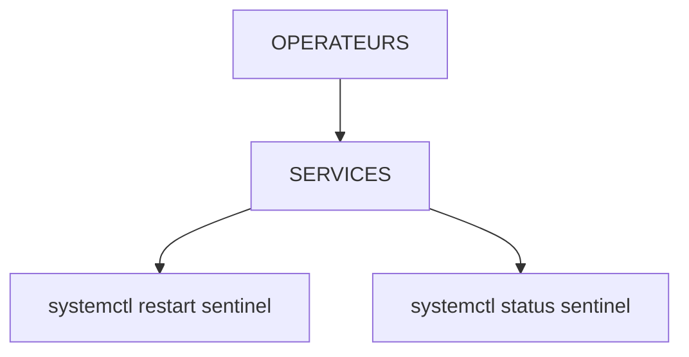
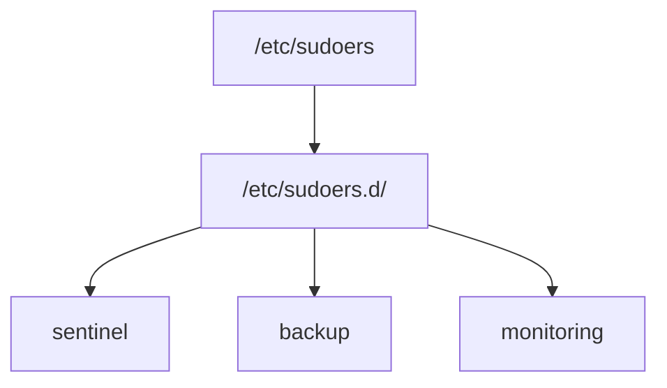
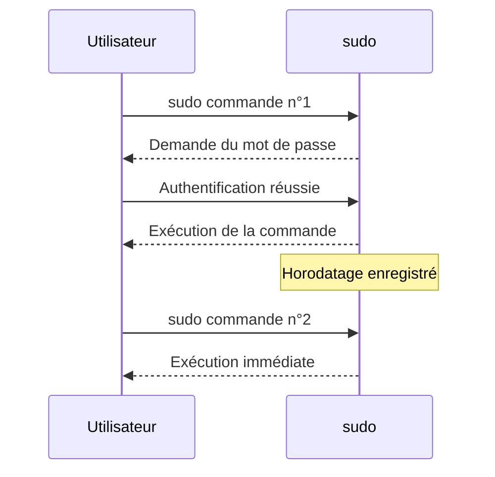
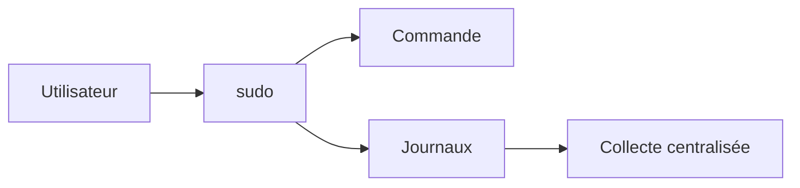
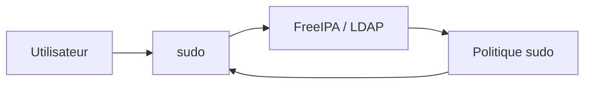

# Chapitre 2.8 — `sudo` avancé

> **Campagne 2 — Contrôle des accès**

> *« La sécurité ne consiste pas à donner tous les droits à quelques personnes. Elle consiste à donner exactement les bons droits, aux bonnes personnes, au bon moment. »*

## Vous êtes ici

```text
PARTIE I — Construire un socle sécurisé

Campagne 1  [██████████] ✔
Campagne 2  [████████░░]

      2.1 Les permissions UNIX ✔
      2.2 ACL ✔
      2.3 umask ✔
      2.4 Attributs étendus ✔
      2.5 PAM ✔
      2.6 Politique de mots de passe ✔
      2.7 Comptes système ✔
   ►  2.8 sudo avancé
      2.9 passwd / shadow / group
      2.10 Synthèse
```

## Objectifs pédagogiques

À la fin de ce chapitre, vous serez capable de :

- comprendre pourquoi `sudo` est devenu le standard de l'administration Linux ;
- expliquer le fonctionnement interne de `sudo` ;
- créer des règles de délégation de privilèges ;
- utiliser correctement `visudo` ;
- comprendre les alias de `sudoers` ;
- limiter précisément les commandes autorisées ;
- préparer l'intégration de `sudo` avec FreeIPA.

## Pourquoi ce chapitre existe

Dans le chapitre **1.8**, nous avons découvert les bases de `sudo`. Nous avons appris à :

- exécuter une commande privilégiée ;
- comprendre le principe du moindre privilège ;
- éviter de travailler directement sous `root`.

Nous allons maintenant aller beaucoup plus loin. Dans une entreprise, un administrateur ne reçoit presque jamais tous les privilèges. Prenons quelques exemples. Un opérateur peut :

- redémarrer un service.

Mais il ne peut pas :

- modifier la configuration réseau.

Une équipe de supervision peut :

- consulter les journaux.

Mais elle ne peut pas :

- modifier les fichiers système.

Un développeur peut :

- redémarrer Sentinel.

Mais il ne peut pas :

- administrer l'ensemble du serveur.

Comment exprimer précisément ces règles ? C'est précisément le rôle de `sudo`.

## Pourquoi `sudo` a remplacé `su`

Pendant longtemps, les administrateurs utilisaient principalement :

```bash
su -
```

Ils saisissaient le mot de passe : `root` Puis réalisaient toutes leurs opérations. Cette méthode présente plusieurs inconvénients. Le premier est évident. Tous les administrateurs connaissent le même mot de passe. Impossible de savoir qui a réellement exécuté une commande. Le second problème concerne la traçabilité. Une fois connecté sous `root`, toutes les actions semblent provenir du même utilisateur. Enfin, cette approche accorde immédiatement tous les privilèges. Même lorsqu'un seul est nécessaire.

`sudo` adopte une philosophie différente. Chaque administrateur conserve son propre compte. Les privilèges sont accordés uniquement lorsque cela est nécessaire.

## Une authentification personnelle

Prenons un exemple. L'utilisateur : `alice` exécute :

```bash
sudo systemctl restart sshd
```

Que se passe-t-il ? Alice ne fournit pas le mot de passe de `root`. Elle fournit son propre mot de passe. Pourquoi ? Parce que `sudo` cherche à répondre à une question.

> Alice est-elle autorisée à exécuter cette commande ?

La décision repose donc sur l'identité d'Alice. Pas sur celle de `root`. Cette approche améliore considérablement l'audit des actions administratives.

## Le déroulement d'une commande `sudo`

Une commande `sudo` met en jeu plusieurs composants.



On remarque immédiatement plusieurs points. `sudo` ne décide pas seul. Il utilise :

- PAM pour l'authentification ;
- le fichier `sudoers` pour la politique d'autorisation.

Cette séparation est très proche de celle que nous avons étudiée avec PAM.

## Le fichier `sudoers`

La politique de délégation est décrite dans : `/etc/sudoers` Il est cependant fortement déconseillé de modifier directement ce fichier avec un éditeur classique. Pourquoi ? Une simple erreur de syntaxe peut empêcher totalement l'utilisation de `sudo`. Pour cette raison, on utilise :

```bash
visudo
```

`visudo` vérifie automatiquement la syntaxe avant d'enregistrer les modifications. S'il détecte une erreur, il refuse la sauvegarde. C'est une protection extrêmement précieuse.

## Une première règle

Prenons une ligne simple. `alice ALL=(ALL) ALL` À première vue, cette syntaxe semble mystérieuse. Décomposons-la. `alice` L'utilisateur concerné. `ALL` Toutes les machines. (Utile dans certains environnements distribués.) `(ALL)` Toutes les identités cibles. Autrement dit :

- `root` ;
- ou un autre utilisateur.

Enfin : `ALL` Toutes les commandes. Cette règle signifie donc :

> L'utilisateur `alice` peut exécuter n'importe quelle commande en tant que n'importe quel utilisateur.

Cette autorisation est très puissante. Elle doit être accordée avec prudence.

## Comprendre la syntaxe de `sudoers`

La syntaxe du fichier `sudoers` peut sembler déroutante au premier abord. Pourtant, elle suit une logique très régulière. Une règle complète s'écrit généralement sous la forme suivante. `utilisateur hôtes = (utilisateurs_cibles) commandes` Chaque partie répond à une question.

| Élément | Question |
|----------|----------|
| Utilisateur | Qui demande le privilège ? |
| Hôtes | Sur quelle(s) machine(s) ? |
| Utilisateurs cibles | Sous quelle identité la commande sera-t-elle exécutée ? |
| Commandes | Quelles commandes sont autorisées ? |

Prenons un exemple plus précis. `alice ALL=(root) /usr/bin/systemctl` Cette règle signifie :

- l'utilisateur `alice` ;
- sur toutes les machines ;
- peut exécuter ;
- la commande `/usr/bin/systemctl` ;
- en tant que `root`.

Remarquez qu'elle n'autorise pas automatiquement toutes les commandes. Le principe du moindre privilège est respecté.

## Exécuter une commande sous un autre utilisateur

On associe souvent `sudo` à `root`. Pourtant, il peut exécuter une commande sous n'importe quelle identité. Par exemple :

```bash
sudo -u postgres psql
```

ou :

```bash
sudo -u nginx ls /var/cache/nginx
```

Pourquoi cette fonctionnalité existe-t-elle ? Parce qu'un administrateur doit parfois diagnostiquer un problème dans les mêmes conditions que le service lui-même. Il souhaite observer exactement ce que voit ce compte. Le schéma suivant illustre ce fonctionnement.



Le compte cible n'est donc pas obligatoirement `root`.

## Les alias dans `sudoers`

Une infrastructure importante peut comporter des centaines de règles. Pour éviter les répétitions, `sudoers` permet de définir des alias. Il en existe plusieurs catégories.

| Alias | Utilisation |
|--------|-------------|
| `User_Alias` | Regrouper plusieurs utilisateurs |
| `Runas_Alias` | Regrouper plusieurs utilisateurs cibles |
| `Host_Alias` | Regrouper plusieurs machines |
| `Cmnd_Alias` | Regrouper plusieurs commandes |

Prenons un exemple. `User_Alias OPERATEURS = alice,bob,charlie` Puis :

```text
Cmnd_Alias SERVICES = \
    /usr/bin/systemctl restart sentinel,\
    /usr/bin/systemctl status sentinel
```

Enfin : `OPERATEURS ALL=(root) SERVICES` Nous obtenons une politique beaucoup plus lisible.

## Pourquoi utiliser des alias ?

Imaginons une entreprise. Elle possède :

- cinquante administrateurs ;
- vingt serveurs ;
- une dizaine de services.

Sans alias, les règles deviennent rapidement illisibles. Avec les alias, la politique ressemble davantage à un document métier.



Cette approche améliore :

- la maintenance ;
- la lisibilité ;
- les audits.

## Les fichiers dans `sudoers.d`

Le fichier principal : `/etc/sudoers` reste volontairement très réduit. La plupart des distributions utilisent aujourd'hui : `/etc/sudoers.d/` Chaque application ou équipe peut disposer de son propre fichier. Par exemple : `/etc/sudoers.d/sentinel` ou : `/etc/sudoers.d/backup` On obtient alors une organisation beaucoup plus modulaire.



Cette approche facilite également les mises à jour et l'automatisation.

## Une délégation très précise

Prenons un besoin réel. Les développeurs doivent uniquement redémarrer Sentinel. Ils ne doivent pas pouvoir :

- arrêter SSH ;
- modifier le pare-feu ;
- redémarrer le serveur.

Une règle adaptée pourrait être :

```text
Cmnd_Alias SENTINEL_CTL = \
    /usr/bin/systemctl restart sentinel,\
    /usr/bin/systemctl status sentinel
```

Puis : `%developpeurs ALL=(root) SENTINEL_CTL` Le groupe : `developpeurs` ne reçoit que les droits nécessaires. Aucun privilège supplémentaire. Cette approche est très représentative de l'administration moderne.

### Culture technique

Le projet **GTFOBins** recense des dizaines de programmes Unix pouvant être détournés pour :

- obtenir un shell ;
- lire des fichiers ;
- écrire des fichiers ;
- contourner certaines restrictions `sudo`.

Par exemple, certains éditeurs, interpréteurs ou outils d'archivage permettent d'exécuter des commandes arbitraires. Cela ne signifie pas que ces logiciels sont vulnérables. Ils fonctionnent comme prévu. Mais leurs fonctionnalités peuvent être détournées lorsqu'ils sont exécutés avec des privilèges élevés. Lorsqu'un administrateur crée une règle `sudo`, il doit donc toujours se demander :

> « Cette commande permet-elle indirectement d'exécuter d'autres commandes ? »

Cette réflexion est devenue un classique des audits de sécurité.

### Piège classique

Une erreur fréquente consiste à croire qu'autoriser une commande revient à autoriser uniquement cette commande. Prenons un exemple. `alice ALL=(root) /usr/bin/vim` À première vue, cette règle paraît inoffensive. Pourtant, `vim` permet d'exécuter une commande shell. Par exemple :

```vim
:! /bin/sh
```

Si `vim` est lancé avec les privilèges de `root`, le shell obtenu héritera généralement de ces privilèges. Le problème ne vient donc pas de `sudo`. Il vient du choix de la commande autorisée. C'est pourquoi les commandes interactives sont rarement de bons candidats pour une délégation de privilèges.

## TP 1 — Expérimenter sur AlmaLinux

Nous allons créer une règle `sudo` simple. Commencez par ouvrir un fichier dédié.

```bash
sudo visudo -f /etc/sudoers.d/laboratoire
```

Ajoutez par exemple :

```text
Cmnd_Alias SENTINEL_STATUS = \
    /usr/bin/systemctl status sentinel

testuser ALL=(root) SENTINEL_STATUS
```

Enregistrez le fichier. `visudo` vérifiera automatiquement la syntaxe. Vous pouvez ensuite afficher les droits accordés.

```bash
sudo -l -U testuser
```

Cette commande est particulièrement utile. Elle permet de vérifier les privilèges d'un utilisateur sans ouvrir de session avec celui-ci. Essayez ensuite de compléter progressivement votre règle. Par exemple, autorisez également : `/usr/bin/systemctl restart sentinel` Vous constaterez rapidement qu'une politique `sudo` se construit très naturellement lorsque les commandes sont clairement identifiées.

## Les directives utiles de `sudoers`

Le langage `sudoers` ne se limite pas aux autorisations de commandes. Plusieurs directives permettent d'affiner le comportement de `sudo`. Voici quelques exemples.

| Directive | Rôle |
|-----------|------|
| `NOPASSWD:` | Ne pas demander de mot de passe pour certaines commandes |
| `PASSWD:` | Exiger explicitement un mot de passe |
| `Defaults` | Définir des options globales ou spécifiques |
| `Defaults logfile=` | Enregistrer les actions dans un fichier dédié |
| `Defaults timestamp_timeout=` | Définir la durée de validité de l'authentification |

Prenons un exemple. `alice ALL=(root) NOPASSWD: /usr/bin/systemctl status sentinel` Dans ce cas, Alice pourra consulter l'état du service sans ressaisir son mot de passe. En revanche, une commande plus sensible, comme un redémarrage, pourra continuer à exiger une authentification. Cette granularité constitue l'une des grandes forces de `sudo`.

> **Bonnes pratiques**
>
> L'utilisation de `NOPASSWD` doit rester exceptionnelle. Elle peut être justifiée pour certaines commandes de supervision ou dans des contextes d'automatisation maîtrisés, mais elle réduit une couche de protection contre les utilisations accidentelles ou opportunistes d'un compte déjà ouvert.

## La mise en cache de l'authentification

Lorsque vous utilisez `sudo`, vous avez probablement remarqué un comportement particulier. Première commande.

```bash
sudo dnf update
```

Le système demande votre mot de passe. Quelques secondes plus tard.

```bash
sudo systemctl status sshd
```

Cette fois, aucun mot de passe n'est demandé. Pourquoi ? Parce que `sudo` conserve temporairement la preuve que vous vous êtes authentifié. On parle souvent de **cache d'authentification** ou de **timestamp**. Ce mécanisme améliore considérablement le confort d'utilisation. Il évite de saisir son mot de passe à chaque commande.

## Comment fonctionne ce cache ?

Après une authentification réussie, `sudo` enregistre un horodatage associé à votre session. Tant que cet horodatage reste valide, les commandes suivantes peuvent être exécutées sans nouvelle authentification. On peut représenter ce fonctionnement ainsi.



Au-delà d'une certaine durée, le cache expire. Le mot de passe sera de nouveau demandé.

## Régler la durée du cache

Cette durée est configurable. Par exemple : `Defaults timestamp_timeout=15` signifie que l'authentification reste valable pendant quinze minutes. Une autre valeur est parfois utilisée. `Defaults timestamp_timeout=0` Dans ce cas, chaque commande `sudo` demandera un nouveau mot de passe. À l'inverse : `Defaults timestamp_timeout=-1` désactive pratiquement l'expiration du cache. Cette dernière configuration est généralement déconseillée sur les postes d'administration.

Le choix dépend du niveau de sécurité recherché et du contexte d'utilisation.

## Invalider le cache

Il est parfois nécessaire de supprimer immédiatement les informations d'authentification mises en cache. La commande suivante permet de le faire.

```bash
sudo -k
```

Le prochain appel à `sudo` exigera alors une nouvelle authentification. Pour supprimer complètement les informations de cache associées à la session courante, on peut également utiliser :

```bash
sudo -K
```

La différence entre `-k` et `-K` est subtile, mais utile dans certains scénarios d'administration.

## Vérifier ses droits

Nous avons déjà rencontré :

```bash
sudo -l
```

Cette commande affiche les privilèges du compte courant. Elle est également très utilisée lors des audits. Par exemple :

```bash
sudo -l
```

produit un résultat semblable à :

```text
User alice may run the following commands:

(root)

    /usr/bin/systemctl status sentinel

    /usr/bin/systemctl restart sentinel
```

Avant d'exécuter une opération sensible, un administrateur peut ainsi vérifier exactement les autorisations dont il dispose.

## Journalisation des actions

L'une des grandes forces de `sudo` est sa capacité de journalisation. Chaque utilisation peut être enregistrée. Selon la configuration, ces informations sont envoyées :

- vers `journald` ;
- vers `syslog` ;
- vers un fichier dédié ;
- ou vers une infrastructure de journalisation centralisée.

On peut représenter ce fonctionnement ainsi.



Cette traçabilité est essentielle. Elle permet de répondre à des questions comme :

- Qui a exécuté cette commande ?
- À quelle heure ?
- Depuis quel compte ?
- Avec quel résultat ?

Dans une infrastructure d'entreprise, ces informations sont précieuses lors des audits et des investigations de sécurité.

### Culture technique

Dans les grandes infrastructures, les règles `sudo` ne sont plus toujours stockées localement. Elles peuvent être centralisées. Par exemple :

- FreeIPA ;
- LDAP ;
- Active Directory (avec certains mécanismes complémentaires).

Le fonctionnement devient alors le suivant.



Cette architecture présente plusieurs avantages.

- Une seule politique pour tous les serveurs.
- Une révocation immédiate des privilèges.
- Des audits simplifiés.
- Une meilleure cohérence de l'ensemble du parc.

Nous mettrons en œuvre cette architecture dans la deuxième partie de cette formation, lorsque Sentinel sera intégrée à FreeIPA.

### Piège classique

Un autre piège consiste à multiplier les règles individuelles. Par exemple :

```text
alice ...

bob ...

charlie ...

david ...
```

Quelques mois plus tard, le fichier `sudoers` devient très difficile à maintenir. Une meilleure approche consiste à raisonner par groupes. Par exemple : `%sentinel-admins` `%exploitation` `%supervision` Les utilisateurs rejoignent ou quittent les groupes. Les règles `sudo`, elles, restent stables. Cette organisation devient indispensable dès que plusieurs dizaines de personnes administrent une infrastructure.

## TP 2 — Expérimenter sur AlmaLinux

Nous allons mettre en pratique plusieurs fonctionnalités de `sudo`. Commencez par afficher vos autorisations.

```bash
sudo -l
```

Puis videz le cache d'authentification.

```bash
sudo -k
```

Relancez ensuite une commande.

```bash
sudo id
```

Vous constaterez qu'un nouveau mot de passe est demandé. Essayez maintenant :

```bash
sudo -v
```

Cette commande ne lance aucun programme. Elle demande simplement à `sudo` de renouveler votre authentification. Elle est souvent utilisée dans les scripts d'administration afin de vérifier les privilèges avant d'exécuter une série d'opérations. Enfin, observez les journaux associés à `sudo`. Selon votre configuration, vous pourrez utiliser par exemple :

```bash
journalctl -t sudo
```

ou :

```bash
journalctl | grep sudo
```

Vous verrez apparaître les différentes demandes d'élévation de privilèges réalisées sur votre système.

## Lire une règle comme une surface d'attaque

Une entrée `sudoers` n'autorise pas seulement un nom de programme : elle peut aussi contraindre ses arguments. Une règle sans arguments autorise généralement toutes les formes d'appel de la commande ; une chaîne d'arguments impose une correspondance. Les caractères génériques sont délicats, car ils peuvent couvrir des espaces, des chemins ou des options inattendues selon le contexte. Testez toujours avec `sudo -l` sous l'identité concernée.

Autoriser un éditeur, un interpréteur, un pager, un gestionnaire de paquets ou une commande capable de charger un fichier arbitraire revient souvent à autoriser une échappée vers un shell. `NOEXEC` peut bloquer certaines exécutions lancées par des programmes dynamiquement liés, mais ce n'est pas une frontière universelle. De même, une négation `!commande` au milieu d'une autorisation large est fragile : variantes de chemin, liens, arguments et outils équivalents peuvent contourner l'intention. Une liste positive courte est préférable.

Les variables d'environnement sont une autre entrée. `env_reset` limite ce qui est transmis, `secure_path` choisit le chemin de recherche des commandes et le tag `SETENV` élargit ce que l'appelant peut conserver. Pour une règle sensible, utilisez des chemins absolus, contrôlez les fichiers que la commande lit et évitez qu'un utilisateur puisse remplacer une bibliothèque, une configuration ou un exécutable auxiliaire.

```sudoers
Defaults env_reset
Defaults secure_path=/usr/local/sbin:/usr/local/bin:/usr/sbin:/usr/bin
%sentinel-ops ALL=(root) /usr/bin/systemctl status sentinel.service
```

La syntaxe correcte ne prouve pas que la délégation est sûre, mais elle reste un préalable. Éditez avec `visudo`, donnez aux fragments de `/etc/sudoers.d` un nom stable sans suffixe de sauvegarde, puis validez tout l'ensemble :

```bash
sudo visudo -cf /etc/sudoers
sudo -u operateur sudo -l
```

L'ordre des règles et des `Defaults` peut modifier le résultat. Évitez de compter sur une intuition de « première règle gagnante » : utilisez `visudo`, `sudo -l` et des tests positifs **et négatifs**.

## Mission d'ingénieur — Déléguer l'exploitation de Sentinel

Écrivez un fragment qui autorise le groupe `sentinel-ops` à consulter l'état et à redémarrer uniquement `sentinel.service`, sans éditeur ni shell. Définissez la politique de mot de passe, de cache et de journalisation, puis testez une commande autorisée, une variante d'argument et trois commandes refusées. Le livrable doit analyser les possibilités indirectes offertes par `systemctl` et les fichiers modifiables par l'opérateur.

## Impact sur Sentinel

Sentinel sera administrée par plusieurs profils d'utilisateurs. Tous n'auront pas les mêmes responsabilités. Par exemple :

| Rôle | Actions autorisées |
|------|--------------------|
| Exploitation | Consulter l'état du service, le redémarrer |
| Développement | Consulter les journaux, redémarrer l'application de test |
| Supervision | Consulter les informations d'état uniquement |
| Administration système | Gérer l'ensemble de l'infrastructure |

Cette séparation sera mise en œuvre grâce à :

- des groupes ;
- des règles `sudo` dédiées ;
- puis, plus tard, des politiques `sudo` centralisées dans FreeIPA.

Ainsi, aucune équipe ne recevra davantage de privilèges que nécessaire. Nous appliquerons concrètement ce principe lors de la mise en production de Sentinel.

## Synthèse

- `sudo` permet de déléguer précisément des privilèges sans partager le compte `root`.
- L'authentification repose sur l'identité de l'utilisateur, pas sur le mot de passe de `root`.
- Le fichier `sudoers` doit être modifié avec `visudo` afin d'éviter les erreurs de syntaxe.
- Les alias (`User_Alias`, `Cmnd_Alias`, etc.) améliorent la lisibilité et la maintenance des politiques.
- Les règles doivent être les plus restrictives possible et n'autoriser que les commandes réellement nécessaires.
- `sudo` met temporairement en cache l'authentification afin d'améliorer le confort d'utilisation.
- Toutes les élévations de privilèges doivent être journalisées afin de garantir la traçabilité.

## Infographie de révision

```text
                        SUDO

                 Utilisateur connecté
                         │
                         ▼
                 sudo <commande>
                         │
                         ▼
                 Authentification PAM
                         │
                         ▼
              Vérification des règles sudoers
                         │
          ┌──────────────┴──────────────┐
          │                             │
          ▼                             ▼
     Autorisé                      Refusé
          │                             │
          ▼                             ▼
 Exécution avec les             Message d'erreur
 privilèges demandés

──────────────────────────────────────────────────────────────

              Une règle sudo répond à quatre questions

     Qui ?        Où ?       En tant que qui ?     Quelle commande ?

──────────────────────────────────────────────────────────────

               Politique moderne de délégation

      Utilisateur
            │
            ▼
      Groupe Linux / FreeIPA
            │
            ▼
      Règle sudo ciblée
            │
            ▼
      Journalisation
            │
            ▼
           Audit

──────────────────────────────────────────────────────────────

      sudo permet de déléguer des privilèges...
          ...sans jamais partager le compte root.
```

## Pour aller plus loin

Depuis le début de cette campagne, nous avons manipulé les utilisateurs comme des objets relativement abstraits. Nous savons qu'ils possèdent :

- un UID ;
- un GID ;
- des permissions ;
- une politique PAM ;
- des privilèges `sudo`.

Mais où toutes ces informations sont-elles réellement stockées ? Depuis les premiers systèmes UNIX, trois fichiers jouent un rôle central :

```text
/etc/passwd
/etc/shadow
/etc/group
```

Leur format paraît simple. Pourtant, ils renferment une quantité impressionnante d'informations sur les identités du système. Dans le prochain chapitre, nous allons les décortiquer champ par champ, comprendre pourquoi les mots de passe ne sont plus stockés dans `passwd`, comment fonctionne réellement `shadow` et pourquoi ces trois fichiers restent, encore aujourd'hui, au cœur de l'authentification sous Linux.

← [2.7 — Les comptes système](2.7-comptes-systeme.md) · [2.9 — Comprendre les fichiers d'identité Linux](2.9-fichiers-identites-linux.md) →
