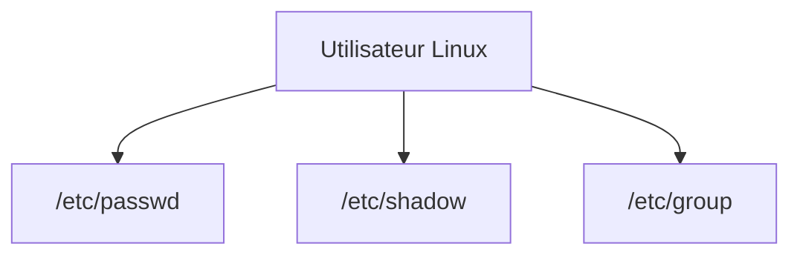
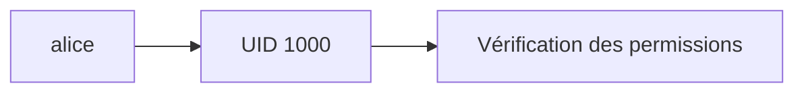
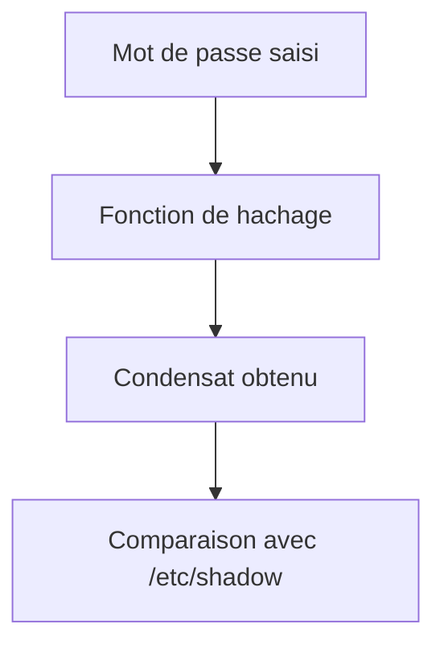
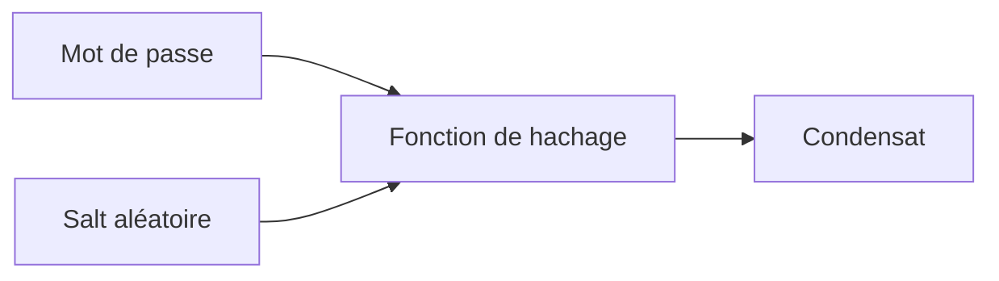
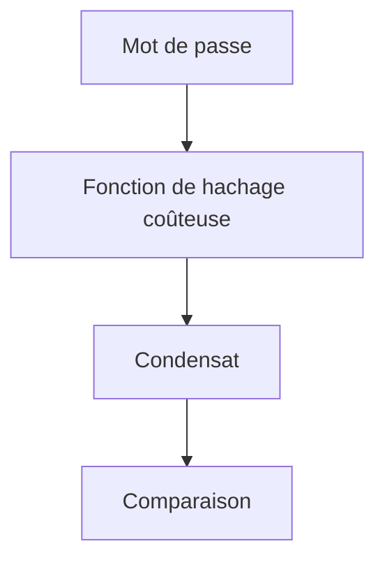
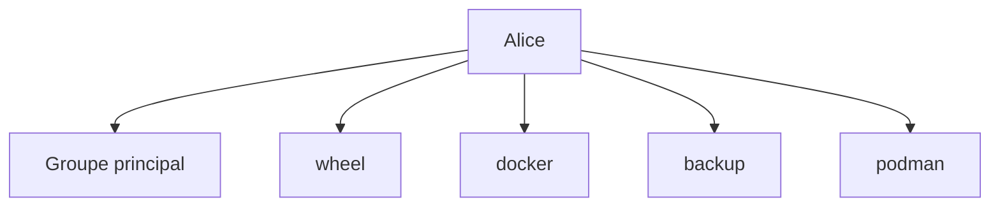
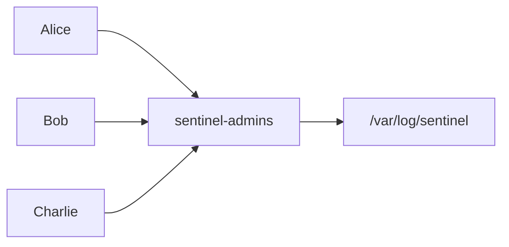
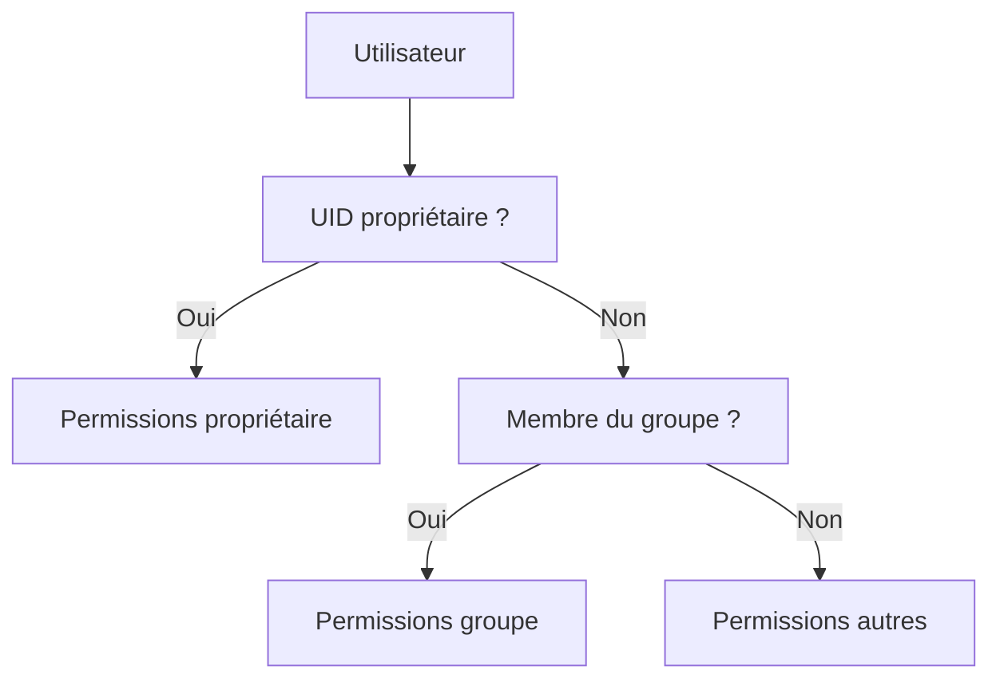
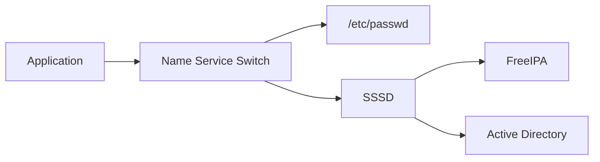

# Chapitre 2.9 — Comprendre les fichiers d'identités Linux

> **Campagne 2 — Contrôle des accès**

> *« Derrière chaque utilisateur Linux se cachent quelques lignes de texte. Comprendre ces fichiers, c'est comprendre la manière dont le système représente les identités. »*

## Vous êtes ici

```text
PARTIE I — Construire un socle sécurisé

Campagne 1  [██████████] ✔
Campagne 2  [█████████░]

      2.1 Les permissions UNIX ✔
      2.2 ACL ✔
      2.3 umask ✔
      2.4 Attributs étendus ✔
      2.5 PAM ✔
      2.6 Politique de mots de passe ✔
      2.7 Comptes système ✔
      2.8 sudo avancé ✔
   ►  2.9 passwd / shadow / group
      2.10 Synthèse
```

## Objectifs pédagogiques

À la fin de ce chapitre, vous serez capable de :

- comprendre le rôle respectif de `/etc/passwd`, `/etc/shadow` et `/etc/group` ;
- interpréter chaque champ de ces fichiers ;
- expliquer pourquoi les mots de passe ne sont plus stockés dans `/etc/passwd` ;
- comprendre le lien entre ces fichiers et PAM ;
- distinguer UID, GID, groupes primaires et groupes secondaires ;
- diagnostiquer les problèmes les plus courants liés aux identités locales.

## Pourquoi ce chapitre existe

Depuis plusieurs chapitres, nous manipulons des utilisateurs. Nous avons vu :

- les permissions ;
- les comptes système ;
- PAM ;
- `sudo`.

Mais une question demeure. Où toutes ces informations sont-elles réellement enregistrées ? Sous Linux, trois fichiers historiques jouent un rôle fondamental.

```text
/etc/passwd

/etc/shadow

/etc/group
```

Ces fichiers existent depuis les premiers UNIX. Ils ont évolué au fil des décennies. Pourtant, ils restent aujourd'hui au cœur de la gestion des identités locales. Avant de comprendre FreeIPA ou Active Directory, il est indispensable de comprendre ces trois fichiers.

## Une représentation textuelle des identités

L'une des caractéristiques historiques d'UNIX est la simplicité de ses formats. Les comptes utilisateurs ne sont pas stockés dans une base de données complexe. Ils sont décrits dans des fichiers texte. On peut représenter cette organisation ainsi.



Chaque fichier possède une responsabilité précise. Cette séparation simplifie l'administration tout en améliorant la sécurité.

## Le rôle de `/etc/passwd`

Commençons par le plus connu. `/etc/passwd` Contrairement à ce que son nom pourrait laisser penser, il ne contient généralement plus les mots de passe. Il contient principalement :

- le nom du compte ;
- son UID ;
- son GID principal ;
- son commentaire ;
- son répertoire personnel ;
- son shell.

Affichons quelques lignes.

```bash
cat /etc/passwd
```

Par exemple : `alice:x:1000:1000:Alice Martin:/home/alice:/bin/bash` Cette ligne décrit entièrement le compte. À l'exception du mot de passe.

## Décomposer une ligne

Chaque champ est séparé par : `:` Détaillons l'exemple précédent. `alice` Le nom du compte. `x` Le mot de passe n'est pas ici. Nous reviendrons sur cette valeur dans quelques instants. `1000` L'UID. L'identifiant numérique de l'utilisateur. `1000` Le groupe principal. `Alice Martin` Le commentaire (*GECOS*). Souvent utilisé pour stocker le nom complet. `/home/alice` Le répertoire personnel. Enfin : `/bin/bash` Le shell de connexion. On peut résumer cette structure ainsi.

```text
Nom

:

Mot de passe

:

UID

:

GID

:

Commentaire

:

Home

:

Shell
```

Cette organisation est identique sur pratiquement tous les systèmes Linux.

## Pourquoi le caractère `x` ?

Dans les premières versions d'UNIX, le second champ contenait réellement le mot de passe chiffré. Cette approche présentait un problème majeur. Le fichier : `/etc/passwd` doit être lisible par tous les utilisateurs. Pourquoi ? Parce que de nombreuses applications doivent pouvoir :

- convertir un UID en nom ;
- retrouver un répertoire personnel ;
- connaître le shell d'un utilisateur.

Si le mot de passe restait dans ce fichier, tous les utilisateurs pourraient récupérer son condensat. Même s'il n'est pas directement exploitable, cela facilite les attaques hors ligne. Pour résoudre ce problème, les systèmes modernes ont introduit : `/etc/shadow` Le caractère : `x` signifie simplement :

> Le condensat du mot de passe est stocké ailleurs.

## Les UID

Sous Linux, le noyau ne travaille pratiquement jamais avec les noms. Il travaille avec des nombres. Par exemple : `alice` devient : `1000` Le noyau utilise ensuite cet UID pour vérifier :

- les permissions ;
- les ACL ;
- les droits d'accès.

On peut représenter cette conversion ainsi.



Le nom n'est finalement qu'une représentation plus agréable pour les humains. Le noyau, lui, manipule essentiellement des identifiants numériques.

## Les différentes plages d'UID

Tous les UID n'ont pas la même signification. Bien que les valeurs exactes puissent varier selon les distributions et les politiques de l'organisation, on retrouve généralement les catégories suivantes sur AlmaLinux.

| Plage approximative | Usage |
|---------------------:|-------|
| `0` | `root` |
| `1` à `999` | Comptes système (la limite exacte dépend de la configuration de la distribution) |
| `1000` et plus | Comptes utilisateurs classiques |

Prenons quelques exemples. `root:x:0:0:root:/root:/bin/bash` Le compte : `root` possède toujours : `UID = 0` Il ne s'agit pas d'une convention. Le noyau attribue une signification particulière à cet identifiant. À l'inverse, un utilisateur créé avec :

```bash
useradd alice
```

recevra généralement un UID supérieur ou égal à : `1000` Cette distinction permet de différencier automatiquement les comptes humains des comptes système.

## Le GID principal

Chaque utilisateur possède également un groupe principal. Dans notre exemple. `alice:x:1000:1000:...` Le quatrième champ vaut : `1000` Il s'agit du **GID principal**. Pourquoi un groupe principal ? Lorsqu'un utilisateur crée un nouveau fichier, celui-ci doit appartenir à un groupe. Le groupe principal fournit cette valeur par défaut. Nous avons déjà rencontré ce mécanisme lorsque nous avons étudié :

- les permissions UNIX ;
- l'`umask` ;
- les ACL.

Tout s'assemble progressivement.

## Le champ GECOS

Le cinquième champ est souvent appelé : `GECOS` Historiquement, il pouvait contenir différentes informations. Par exemple :

- le nom complet ;
- le numéro de bureau ;
- le téléphone.

Aujourd'hui, il contient généralement uniquement le nom de l'utilisateur. Par exemple. `Alice Martin` Ce champ n'intervient pas dans les mécanismes de sécurité. Il est principalement informatif.

## Le répertoire personnel

Le sixième champ indique le répertoire personnel. Par exemple. `/home/alice` Lorsque l'utilisateur ouvre une session, de nombreux programmes utilisent automatiquement cette information. Par exemple :

- le shell ;
- SSH ;
- certains outils graphiques.

Le répertoire personnel n'est donc pas déterminé par le shell. Il est décrit directement dans : `/etc/passwd`

## Le shell

Le dernier champ indique le programme lancé lors de la connexion. Par exemple. `/bin/bash` Mais d'autres valeurs sont possibles. `/bin/sh` `/bin/zsh` `/bin/false` `/sbin/nologin` Les deux dernières méritent une attention particulière. Elles empêchent généralement une connexion interactive normale. Nous avons déjà rencontré : `nologin` dans le chapitre consacré aux comptes système.

## Le rôle de `/etc/shadow`

Nous pouvons maintenant ouvrir le second fichier. `/etc/shadow` Contrairement à : `/etc/passwd` celui-ci est beaucoup plus sensible. Son accès est réservé aux utilisateurs privilégiés. Essayons.

```bash
cat /etc/shadow
```

Sans privilège particulier, la commande échoue. Avec :

```bash
sudo cat /etc/shadow
```

nous obtenons des lignes ressemblant à : `alice:$y$j9T$...:20258:0:99999:7:::` Le second champ contient le **condensat** (*hash*) du mot de passe. Il ne contient jamais le mot de passe en clair. Cette différence est fondamentale.

## Pourquoi stocker un condensat ?

Lorsqu'un utilisateur choisit un mot de passe. Par exemple : `MonSecret123` Le système ne l'enregistre jamais directement. Il applique une fonction de hachage. Le résultat ressemble à ceci. `$y$j9T$...` Le mot de passe initial ne peut pas être retrouvé directement à partir de cette valeur. Lors d'une authentification, le système recommence le calcul. Les deux condensats sont ensuite comparés.



Si les deux valeurs correspondent, l'authentification réussit. Le mot de passe lui-même n'a jamais été stocké.

## Pourquoi un condensat n'est-il pas un chiffrement ?

Une confusion est fréquente. Beaucoup parlent de mot de passe « chiffré ». Ce n'est pas exact. Le chiffrement est réversible. Le hachage ne l'est pas. Autrement dit :

- un fichier chiffré peut être déchiffré avec la bonne clé ;
- un condensat ne permet pas de retrouver directement le mot de passe.

La seule stratégie consiste à essayer des candidats. Pour chacun d'eux.

- calculer son condensat ;
- comparer le résultat.

C'est précisément ce que réalisent les attaques par dictionnaire et les attaques par force brute.

## Que contient réellement une ligne de `/etc/shadow` ?

Prenons un exemple simplifié. `alice:$y$j9T$...:20258:0:99999:7:::` Comme pour `/etc/passwd`, chaque champ est séparé par : `:` Détaillons-les. `alice` Nom du compte. `$y$j9T$...` Condensat du mot de passe. Puis viennent plusieurs informations liées au cycle de vie du mot de passe.

- date du dernier changement ;
- âge minimum ;
- âge maximum ;
- période d'avertissement ;
- période d'inactivité ;
- date d'expiration éventuelle ;
- champ réservé.

Le fichier `/etc/shadow` ne contient donc pas uniquement le condensat. Il contient également la politique d'expiration propre à chaque compte.

## Comprendre le condensat

Regardons le début du condensat. `$y$` Cette information n'est pas choisie au hasard. Elle indique l'algorithme utilisé. Sur les versions récentes d'AlmaLinux et de RHEL, on rencontre généralement : `$y$` qui correspond à **yescrypt**. Sur des systèmes plus anciens, on pouvait rencontrer par exemple : `$6$` pour SHA-512. Cette indication permet au système de savoir comment vérifier le mot de passe. Il n'est donc pas nécessaire que tous les comptes utilisent le même algorithme.

Le système choisit automatiquement le bon mécanisme en fonction du préfixe présent dans le condensat.

## Le sel (*Salt*)

Si deux utilisateurs choisissent exactement le même mot de passe. Par exemple : `Bonjour2026` Obtiendront-ils le même condensat ? Non. Pourquoi ? Parce qu'un élément supplémentaire intervient. Le **sel** (*salt*). Un nombre aléatoire est généré lors de la création du condensat. Le calcul devient alors :

```text
Mot de passe

+

Salt

↓

Condensat
```

On peut représenter cette idée ainsi.



Grâce à ce mécanisme :

- deux utilisateurs ayant le même mot de passe obtiennent des condensats différents ;
- les tables précalculées (*Rainbow Tables*) deviennent beaucoup moins efficaces.

Le sel est donc une protection essentielle contre certaines attaques hors ligne.

## Le coût de calcul

Les algorithmes modernes ne cherchent pas uniquement à produire un condensat. Ils cherchent également à ralentir volontairement le calcul. Pourquoi ? Parce que si un attaquant vole le fichier : `/etc/shadow` il pourra essayer des milliards de mots de passe. Plus chaque tentative est coûteuse, plus l'attaque devient longue. On peut représenter cette idée ainsi.



Quelques millisecondes supplémentaires semblent insignifiantes pour un utilisateur. Mais elles deviennent extrêmement pénalisantes lorsqu'il faut tester plusieurs milliards de candidats. C'est l'une des raisons pour lesquelles les algorithmes modernes comme **yescrypt** ont progressivement remplacé les anciens mécanismes plus rapides.

## Les comptes sans mot de passe

Certaines lignes de `/etc/shadow` attirent immédiatement l'attention. Par exemple : `sshd:!*:...` ou : `daemon:*:...` Que signifient ces caractères ? Ils indiquent que le compte ne possède pas de mot de passe utilisable. Autrement dit : une authentification classique par mot de passe est impossible. C'est parfaitement logique. Les comptes système ne sont généralement pas destinés à accueillir une connexion interactive. Leur identité est utilisée uniquement par les processus.

## Verrouiller un compte

Il est également possible de verrouiller un compte utilisateur. Par exemple.

```bash
sudo passwd -l alice
```

Le système ajoute généralement un caractère : `!` devant le condensat. Par exemple. Avant. `$y$j9T$...` Après. `!$y$j9T$...` Le condensat est toujours présent. Mais il ne peut plus être utilisé pour une authentification par mot de passe. Cette méthode permet de désactiver rapidement un compte sans supprimer ses informations.

## Le rôle de `/etc/group`

Le troisième fichier fondamental est : `/etc/group` Comme son nom l'indique, il décrit les groupes locaux du système. Affichons son contenu.

```bash
cat /etc/group
```

Nous obtenons des lignes similaires à :

```text
wheel:x:10:alice,bob

developers:x:1001:charlie,david
```

Chaque ligne décrit un groupe. Comme pour les autres fichiers, les champs sont séparés par : `:`

## Décomposer une ligne de `/etc/group`

Prenons l'exemple suivant. `developers:x:1001:alice,bob,charlie` Le premier champ. `developers` Nom du groupe. Le second. `x` Champ historiquement réservé au mot de passe du groupe. Aujourd'hui, il est presque toujours inutilisé. Le troisième. `1001` Le GID. L'identifiant numérique du groupe. Enfin. `alice,bob,charlie` La liste des membres secondaires. Cette dernière notion mérite une explication.

## Groupe principal et groupes secondaires

Chaque utilisateur possède :

- un groupe principal ;
- éventuellement plusieurs groupes secondaires.

Prenons Alice.

```text
UID : 1000

Groupe principal : developers
```

Mais Alice peut également appartenir aux groupes :

```text
wheel

docker

podman

backup
```

Le groupe principal est défini dans : `/etc/passwd` Les groupes secondaires sont décrits dans : `/etc/group` On peut représenter cette organisation ainsi.



Cette distinction est très importante. Le noyau prend en compte l'ensemble de ces groupes lors des vérifications d'autorisation.

## Pourquoi utiliser des groupes ?

Imaginons une entreprise. Dix administrateurs doivent accéder : `/var/log/sentinel` Deux possibilités existent. Première solution. Attribuer les droits individuellement. Cette approche devient rapidement ingérable. Deuxième solution. Créer un groupe. `sentinel-admins` Attribuer les permissions au groupe. Puis ajouter les utilisateurs au groupe. Le schéma devient alors beaucoup plus simple.



L'administration devient beaucoup plus facile.

## Comment connaître les groupes d'un utilisateur ?

Plusieurs commandes permettent de répondre à cette question. La plus simple est :

```bash
id alice
```

Par exemple.

```text
uid=1000(alice)

gid=1000(alice)

groups=1000(alice),10(wheel),1001(developers)
```

On peut également utiliser :

```bash
groups alice
```

Ces commandes sont très utilisées lors des diagnostics de permissions. Avant de modifier des ACL ou des règles `sudo`, il est souvent utile de vérifier l'appartenance réelle aux groupes.

## Le lien avec les permissions UNIX

Nous avons étudié les permissions dans le chapitre **2.1**. Vous vous souvenez probablement de cette notation. `-rwxr-x---` La seconde colonne concerne précisément : le groupe. Autrement dit. Lorsque Linux doit répondre à la question :

> L'utilisateur peut-il accéder à ce fichier ?

Il suit généralement cette logique.



Tout ce que nous avons étudié depuis le début de cette campagne converge progressivement. Les fichiers d'identité servent directement au mécanisme d'autorisation du noyau.

## Les groupes spéciaux

Certaines distributions créent plusieurs groupes particuliers. Par exemple : `wheel` Ce groupe est traditionnellement utilisé pour accorder des privilèges administratifs via `sudo`. Nous avons déjà rencontré cette notion. D'autres groupes peuvent également exister. Par exemple :

```text
docker

podman

audio

video

systemd-journal
```

Ils permettent d'accorder des droits très spécifiques. Par exemple :

- utiliser Podman ;
- lire les journaux système ;
- accéder aux périphériques audio.

Cette approche évite une nouvelle fois d'utiliser `root`. Chaque groupe correspond à une responsabilité particulière.

### Culture technique

Les fichiers :

```text
/etc/passwd
/etc/group
/etc/shadow
```

ne sont pas les seules sources d'identités sous Linux. En réalité, lorsqu'une application demande :

> « Qui est l'utilisateur `alice` ? »

elle n'interroge généralement pas directement ces fichiers. Elle passe par une couche d'abstraction appelée **NSS** (*Name Service Switch*). NSS décide où rechercher les informations. Par exemple :

- dans les fichiers locaux ;
- dans LDAP ;
- dans FreeIPA ;
- dans Active Directory via SSSD ;
- ou dans d'autres sources.

On peut représenter cette architecture ainsi.



Cette architecture explique pourquoi les applications continuent de fonctionner lorsque l'on migre d'une gestion locale des comptes vers un annuaire centralisé. Elles ne lisent pas directement les fichiers. Elles interrogent NSS. Nous consacrerons plusieurs chapitres à cette architecture dans la campagne FreeIPA.

### Piège classique

Une erreur très fréquente consiste à modifier directement : `/etc/passwd` ou : `/etc/group` avec un éditeur de texte. Techniquement, cela fonctionne. Mais ce n'est presque jamais recommandé. Pourquoi ? Parce que plusieurs opérations doivent rester cohérentes. Par exemple :

- la création du répertoire personnel ;
- le choix d'un UID libre ;
- la création éventuelle du groupe principal ;
- la mise à jour simultanée de plusieurs fichiers.

Les outils :

```bash
useradd
```

```bash
usermod
```

```bash
userdel
```

```bash
groupadd
```

```bash
groupmod
```

```bash
groupdel
```

réalisent automatiquement toutes ces opérations. Ils réduisent considérablement le risque d'incohérence. L'édition directe des fichiers ne devrait être envisagée qu'en dernier recours, sur un système maîtrisé et après sauvegarde.

## TP 1 — Expérimenter sur AlmaLinux

Nous allons explorer les trois fichiers étudiés. Commencez par afficher votre propre compte.

```bash
grep "^$(whoami):" /etc/passwd
```

Repérez :

- votre UID ;
- votre GID principal ;
- votre répertoire personnel ;
- votre shell.

Affichez ensuite vos groupes.

```bash
id
```

Puis :

```bash
groups
```

Observez maintenant les informations protégées.

```bash
sudo grep "^$(whoami):" /etc/shadow
```

Essayez d'identifier :

- le condensat du mot de passe ;
- les champs numériques liés à son cycle de vie.

Enfin, affichez le groupe principal correspondant.

```bash
grep ":$(id -g):" /etc/group
```

Vous venez de parcourir les trois fichiers qui constituent la base historique de la gestion des identités sous Linux. Dans les chapitres suivants, nous verrons que des composants comme SSSD et FreeIPA permettent d'étendre ce modèle à l'échelle d'une entreprise entière.

## `/etc/gshadow` et les outils de cohérence

`/etc/group` est lisible par tous parce que les programmes doivent résoudre les groupes. Les informations sensibles de gestion des groupes sont séparées dans `/etc/gshadow`, sur le même principe que `shadow` pour les comptes. On y trouve le nom du groupe, un champ de mot de passe généralement verrouillé, des administrateurs de groupe et des membres. Les mots de passe de groupe sont historiques et rarement une bonne méthode de délégation moderne.

```text
sentinel-admin:!::alice,bob
```

Ne modifiez pas ces fichiers avec un éditeur ordinaire. `vipw` et `vigr` prennent un verrou et proposent respectivement l'édition cohérente de `passwd`/`shadow` et de `group`/`gshadow`. `pwck` et `grpck` contrôlent les formats et les références. `pwconv` et `grpconv` synchronisent les fichiers shadow associés ; ce sont des outils de réparation ou de migration, pas des commandes quotidiennes.

```bash
sudo pwck -r
sudo grpck -r
sudo vipw
sudo vigr
```

Les commandes `useradd`, `usermod`, `passwd`, `chage`, `groupadd` et `gpasswd` restent préférables : elles coordonnent plusieurs fichiers et appliquent la politique de la distribution.

## NSS : demander une identité sans supposer sa source

Lire `/etc/passwd` avec `grep` ne trouve que les comptes locaux. Les applications passent normalement par NSS (*Name Service Switch*), configuré dans `/etc/nsswitch.conf`, qui peut interroger `files`, SSSD, LDAP ou d'autres sources. Utilisez donc `getent` pour répondre à « cette identité est-elle connue du système ? ».

```bash
getent passwd alice
getent group sentinel-admin
getent initgroups alice
```

Le nom est une commodité humaine ; les fichiers portent des UID et GID numériques. Une restauration sur une machine où le même numéro désigne une autre personne change silencieusement le propriétaire apparent. À l'inverse, supprimer un compte laisse des fichiers orphelins affichés avec leur numéro. Inventorier les UID/GID fait donc partie d'une migration.

Verrouiller un mot de passe avec `passwd -l` modifie le champ de `shadow`, mais n'expire pas nécessairement le compte et n'interdit pas toutes les autres méthodes d'authentification, comme une clé SSH déjà autorisée. Pour désactiver une identité, analysez mot de passe, date d'expiration, shell, clés, certificats, sessions, tâches et règles d'autorisation.

## TP 2 — Diagnostiquer une identité locale et distante

Comparez `grep '^nom:' /etc/passwd` avec `getent passwd nom`, puis relevez UID, GID principal et groupes secondaires avec `id`. Créez un fichier, notez ses identifiants avec `stat -c '%u %g'`, et simulez sur papier les conséquences d'une suppression puis d'une réutilisation de l'UID. N'altérez pas les fichiers d'identité réels pour cette simulation.

## Mission d'ingénieur — Établir le registre d'identités Sentinel

Produisez un registre contenant le compte de service, les groupes d'exploitation et de sauvegarde, leur source (`files` ou annuaire), leur stabilité numérique, leur mode de création, leurs propriétaires de fichiers et leur révocation. Ajoutez les commandes `getent`, `id`, `pwck`, `grpck` et `stat` qui prouvent la cohérence du registre.

## Impact sur Sentinel

Sentinel exploitera naturellement l'ensemble de ces mécanismes. Lors de son installation, le paquet RPM créera :

- un utilisateur système `sentinel` ;
- un groupe `sentinel`.

Les différents répertoires de l'application utiliseront ensuite ces identités. Par exemple :

| Répertoire | Propriétaire | Groupe |
|------------|--------------|--------|
| `/etc/sentinel` | `root` | `sentinel` |
| `/var/lib/sentinel` | `sentinel` | `sentinel` |
| `/var/log/sentinel` | `sentinel` | `sentinel` |

Cette organisation permettra :

- de limiter les privilèges du service ;
- de simplifier les sauvegardes ;
- de préparer l'intégration avec `systemd`, SELinux et FreeIPA.

L'identité de Sentinel sera donc traitée exactement comme celle de n'importe quel service système moderne.

## Synthèse

- `/etc/passwd` décrit les comptes utilisateurs, mais ne contient plus les mots de passe.
- `/etc/shadow` contient les condensats des mots de passe ainsi que les informations liées à leur cycle de vie.
- `/etc/group` décrit les groupes locaux et leurs membres.
- Le noyau Linux travaille principalement avec des **UID** et des **GID**, les noms étant surtout destinés aux humains.
- Les mots de passe sont stockés sous forme de **condensats (hashes)** et non de mots de passe en clair.
- Les algorithmes modernes, comme **yescrypt**, utilisent un **sel (salt)** et un **coût de calcul** pour ralentir les attaques hors ligne.
- Les groupes permettent d'attribuer des permissions à des fonctions plutôt qu'à des individus.
- Les applications modernes n'accèdent généralement pas directement à ces fichiers ; elles passent par **NSS**, qui peut interroger aussi bien les fichiers locaux que FreeIPA ou Active Directory.

## Infographie de révision

```text
                  LES IDENTITÉS SOUS LINUX

                         Utilisateur
                              │
                              ▼
                    Name Service Switch (NSS)
                              │
        ┌─────────────────────┼──────────────────────┐
        │                     │                      │
        ▼                     ▼                      ▼
   /etc/passwd          /etc/shadow           /etc/group

────────────────────────────────────────────────────────────────────

/etc/passwd

 Nom
 UID
 GID principal
 Commentaire
 Répertoire personnel
 Shell

────────────────────────────────────────────────────────────────────

/etc/shadow

 Condensat du mot de passe
 Dernier changement
 Âge minimal
 Âge maximal
 Avertissement
 Expiration

────────────────────────────────────────────────────────────────────

/etc/group

 Nom du groupe
 GID
 Membres secondaires

────────────────────────────────────────────────────────────────────

                Vérification d'un accès

          Utilisateur
                │
                ▼
             UID / GID
                │
                ▼
      Permissions UNIX / ACL
                │
                ▼
        Décision du noyau Linux

────────────────────────────────────────────────────────────────────

     Les noms sont destinés aux humains.
     Le noyau manipule essentiellement des identifiants numériques.
```

## Pour aller plus loin

Nous arrivons au terme de cette campagne consacrée aux identités. Nous avons étudié :

- les permissions UNIX ;
- les ACL ;
- l'`umask` ;
- les attributs des fichiers ;
- PAM ;
- les politiques de mots de passe ;
- les comptes système ;
- `sudo` ;
- les fichiers historiques des identités.

Tous ces mécanismes poursuivent un objectif commun. Répondre à une seule question.

> **« Cette action est-elle autorisée ? »**

Le dernier chapitre ne présentera pas de nouveau mécanisme. Il reliera tous ceux que nous avons découverts. Nous allons construire une vision globale de la gestion des identités sous Linux, comprendre comment ces différents composants coopèrent et préparer la transition vers la prochaine campagne, qui sera consacrée à la sécurisation du réseau et à l'exposition des services de Sentinel.

← [2.8 — `sudo` avancé](2.8-sudo-avance.md) · [2.10 — Synthèse : sécuriser les identités](2.10-synthese-securiser-identites.md) →
