# Chapitre 3.1 — TCP/IP côté administrateur

> **Campagne 3 — Réseau et exposition**

> *« Un serveur ne peut être attaqué que s'il est joignable. Comprendre le réseau est donc la première étape pour comprendre sa sécurité. »*

> *« La plupart des administrateurs savent utiliser TCP/IP. Les meilleurs savent expliquer pourquoi un paquet arrive — ou pourquoi il n'arrive jamais. »*

## Vous êtes ici

```
Sécurisation d'un socle AlmaLinux et de ses services

Campagne 1  ✔ SSH
Campagne 2  ✔ Contrôle des accès

► Campagne 3 : Réseau et exposition

    ► Chapitre 3.1 TCP/IP côté administrateur

      Chapitre suivant
      3.2 Firewalld
```

Jusqu'à présent, nous avons sécurisé **l'identité** (SSH, comptes, permissions). Nous allons maintenant sécuriser **l'accessibilité**. Avant d'installer un firewall, il faut comprendre précisément ce qu'il protège.

## Objectifs pédagogiques

À la fin de ce chapitre, vous serez capable de :

- expliquer le parcours complet d'un paquet TCP ;
- distinguer une adresse IP d'une interface réseau ;
- comprendre le rôle réel d'une passerelle ;
- expliquer pourquoi un firewall ne "voit" pas une application mais uniquement des paquets ;
- interpréter correctement un schéma réseau simple ;
- comprendre pourquoi deux machines sur le même réseau peuvent parfois être incapables de communiquer ;
- identifier rapidement où se situe une panne réseau.

## Pourquoi ce chapitre existe

Lorsque l'on parle de sécurité, beaucoup d'administrateurs pensent immédiatement :

- firewall ;
- VPN ;
- IDS ;
- IPS ;
- chiffrement.

Pourtant, aucune de ces technologies ne peut être correctement comprise sans maîtriser les bases du fonctionnement réseau. Prenons un exemple très simple. Une machine Kali ne parvient plus à joindre notre serveur AlmaLinux. Plusieurs hypothèses sont possibles :

- le serveur est arrêté ;
- le câble réseau est débranché ;
- la machine possède une mauvaise adresse IP ;
- le firewall bloque le trafic ;
- le service SSH n'écoute plus ;
- la route est incorrecte ;
- un VLAN isole les machines ;
- un équipement intermédiaire filtre les paquets.

Toutes ces situations produisent un symptôme similaire :

> « Je ne peux plus me connecter. »

Pourtant, leurs causes sont totalement différentes. Un ingénieur sécurité doit être capable de distinguer chacune d'elles.

## Le modèle mental que nous allons construire

Durant cette campagne, nous ne verrons plus un serveur comme une simple machine. Nous allons le considérer comme une succession de couches traversées par chaque paquet.

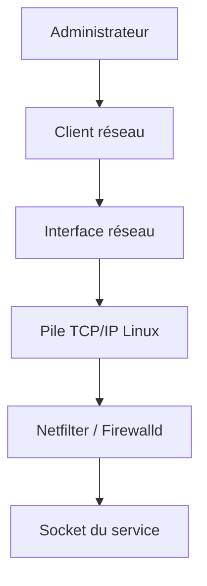

C'est cette représentation que nous utiliserons désormais.

## Une idée fausse très répandue

Beaucoup d'administrateurs pensent qu'un client SSH communique directement avec OpenSSH. En réalité... Ce n'est jamais le cas. Le client communique uniquement avec une **adresse IP**. Le noyau Linux décide ensuite quel processus recevra les données. Cette nuance paraît anodine. Elle explique pourtant une grande partie du fonctionnement du réseau sous Linux.

## Le voyage d'un paquet

Prenons une commande extrêmement banale.

```bash
ssh admin@192.168.56.10
```

Que se passe-t-il réellement ? La plupart des personnes répondraient :

> « SSH se connecte au serveur. »

Cette réponse est vraie. Mais elle est incomplète. En réalité, le noyau réalise une longue succession d'étapes.

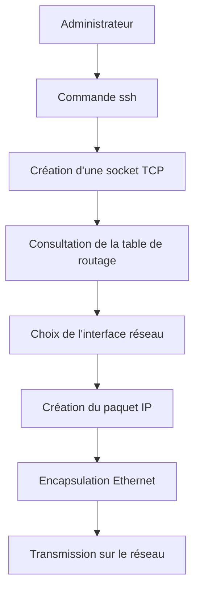

Aucune de ces opérations n'est réalisée par OpenSSH. Toutes sont réalisées par le système d'exploitation.

## Architecture détaillée

Observons maintenant le chemin complet d'un paquet.

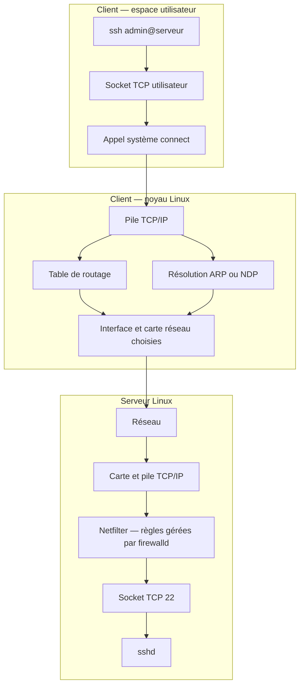

Ce schéma sera réutilisé dans pratiquement toute la suite de la formation. Il constitue l'une des cartes mentales les plus importantes du livre.

## Première conséquence

Lorsqu'un paquet est perdu... Il peut l'être à n'importe quel niveau.

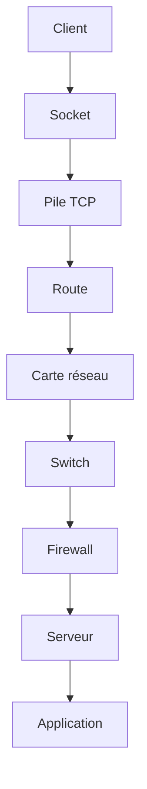

La sécurité ne consiste donc pas uniquement à protéger un serveur. Elle consiste aussi à comprendre **où** une communication peut échouer.

## Les trois piliers du réseau

Pour administrer efficacement un serveur Linux, il faut distinguer trois notions que l'on confond très souvent :

- l'interface réseau ;
- l'adresse IP ;
- la route.

Ces trois éléments sont indépendants. C'est probablement l'un des concepts les plus importants de toute la campagne.

## L'interface réseau

Une interface réseau représente le point de connexion entre le système d'exploitation et le réseau. Elle peut être :

- une carte Ethernet physique ;
- une interface Wi-Fi ;
- une interface virtuelle créée par Podman ;
- une interface VPN ;
- une interface de boucle locale (`lo`) ;
- une interface VLAN ;
- un bridge.

Sous AlmaLinux, on peut les lister avec :

```bash
ip link
```

Exemple :

```text
lo
enp0s3
enp0s8
podman0
virbr0
```

Chaque interface est un objet indépendant. Une interface peut exister sans posséder d'adresse IP.

### Exemple concret

Imaginons une carte réseau nouvellement installée.

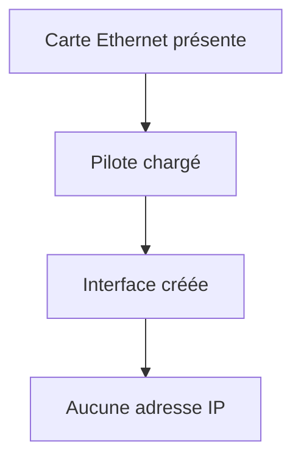

La machine ne peut pas encore communiquer. Pourtant, l'interface existe.

### Première idée importante

Une erreur très fréquente consiste à dire :

> "Mon interface possède l'adresse 192.168.1.10."

En réalité, il serait plus juste de dire :

> "Une adresse IP est actuellement associée à cette interface."

Pourquoi cette nuance est-elle importante ? Parce qu'une même interface peut porter :

- plusieurs adresses IPv4 ;
- plusieurs adresses IPv6 ;
- une adresse temporaire ;
- une adresse permanente.

Inversement : une adresse IP peut être supprimée sans supprimer l'interface.

## Les adresses IP

Une adresse IP n'est pas une propriété du matériel. Elle est simplement une information attribuée à une interface. Exemple :

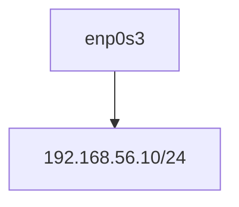

Demain :

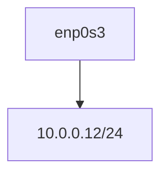

Le matériel est identique. Seule son identité réseau change.

## Plusieurs adresses sur une même interface

Contrairement à une idée reçue, une interface peut posséder plusieurs adresses.

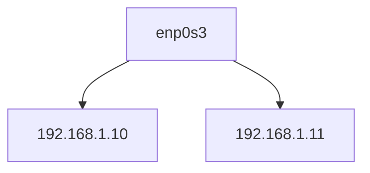

Cette technique est encore utilisée :

- lors de migrations ;
- pour héberger plusieurs services ;
- pour certaines configurations haute disponibilité.

## Les routes

Voici maintenant la notion la plus mal comprise. Une route ne représente pas un chemin physique. Une route est une **décision**. Elle répond à une question très simple :

> "Par quelle interface dois-je envoyer ce paquet ?"

Le noyau consulte une table.

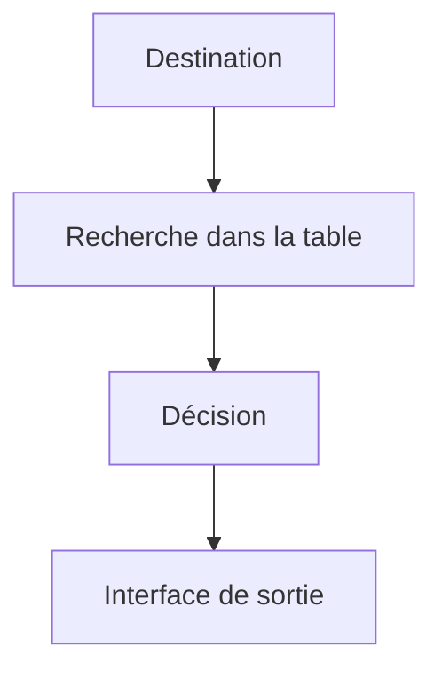

Il n'y a aucune intelligence dans l'application. Toute la décision appartient au noyau.

## Exemple

Imaginons :

```
Serveur

Adresse :

192.168.56.10

```

L'administrateur lance :

```bash
ssh 192.168.56.20
```

Le noyau réfléchit.

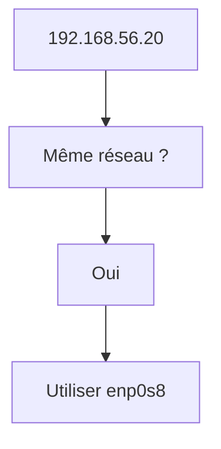

Maintenant :

```bash
ssh 8.8.8.8
```

Le raisonnement devient :

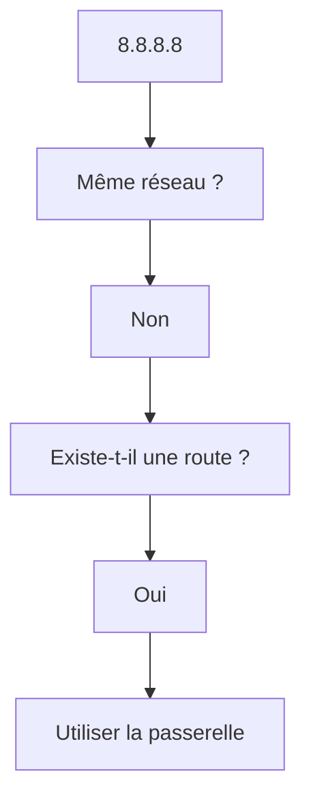

Le comportement est totalement différent. Pourtant l'application SSH n'a rien changé.

## La passerelle

La passerelle est probablement l'élément le plus mal expliqué dans les formations. On dit souvent :

> "C'est le routeur."

C'est faux. Le routeur est une machine. La passerelle est simplement :

> **l'adresse IP vers laquelle Linux envoie les paquets qu'il ne sait pas transmettre directement.**

Cette différence paraît subtile. Elle est pourtant fondamentale.

### Schéma

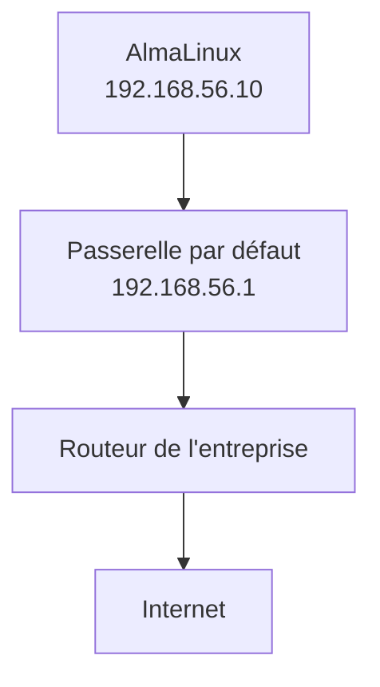

La passerelle n'est donc qu'une destination. Le véritable routage est effectué par l'équipement situé derrière cette adresse.

### En entreprise

Une erreur très fréquente consiste à placer :

- les postes utilisateurs ;
- les serveurs ;
- les équipements d'administration ;

sur le même réseau. En cas de compromission d'un poste utilisateur, l'attaquant dispose alors d'une visibilité directe sur les serveurs. L'une des missions d'un architecte consiste justement à limiter ces possibilités grâce à :

- des VLAN ;
- des réseaux d'administration ;
- des firewalls ;
- des ACL réseau.

Nous reviendrons progressivement sur chacun de ces mécanismes.

### Culture technique

Pourquoi parle-t-on encore de **TCP/IP** alors qu'IPv6 existe depuis longtemps ? Parce que le terme **TCP/IP** ne désigne plus uniquement IPv4. Il désigne l'ensemble de la pile réseau issue des protocoles Internet. Il est donc tout à fait correct de parler de "pile TCP/IP" même lorsqu'un système utilise exclusivement IPv6.

### Piège classique

Un administrateur modifie une adresse IP. SSH ne fonctionne plus. Il conclut immédiatement :

> "Le firewall bloque."

En réalité, le problème est souvent ailleurs :

- route incorrecte ;
- mauvais masque ;
- passerelle absente ;
- câble branché sur la mauvaise interface ;
- interface désactivée.

C'est précisément pour éviter ce type de diagnostic prématuré que nous étudions d'abord les fondations réseau avant d'introduire `firewalld`.

## Les sockets : là où le réseau rencontre les applications

Nous avons vu jusqu'à présent le parcours d'un paquet jusqu'au serveur. Une question reste cependant sans réponse :

> Une fois arrivé sur le serveur, comment Linux sait-il quel programme doit recevoir ce paquet ?

La réponse tient en un mot :

> **Socket**

C'est probablement l'une des notions les plus importantes de toute la formation.

## Qu'est-ce qu'une socket ?

On décrit souvent une socket comme :

> "Une extrémité de communication."

Cette définition est correcte. Mais elle reste très abstraite. Pour un administrateur système, il est plus simple de la voir comme :

> **Une boîte aux lettres gérée par le noyau.**

Imaginons plusieurs services :

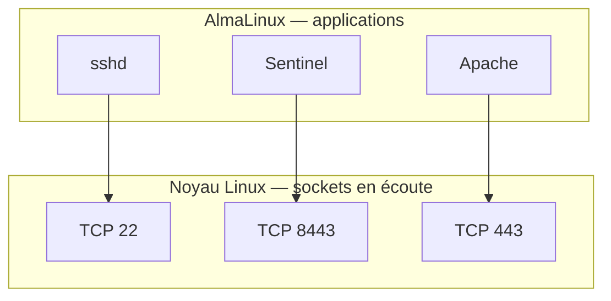

Chaque application ouvre une ou plusieurs sockets. Le noyau associe ensuite chaque paquet reçu à la bonne socket. L'application n'a jamais besoin d'examiner toutes les trames du réseau. Le noyau fait ce travail pour elle.

## Les ports

Un port est simplement un identifiant numérique associé à une socket. Exemples classiques :

| Service | Port |
|----------|------|
| SSH | 22 |
| HTTP | 80 |
| HTTPS | 443 |
| DNS | 53 |

Une idée reçue consiste à dire :

> "SSH utilise le port 22."

En réalité, il serait plus juste de dire :

> **Le démon `sshd` possède une socket en écoute sur le port TCP 22.**

Cette nuance sera très importante lorsque nous étudierons systemd et les sockets activées à la demande.

## Plusieurs applications peuvent-elles utiliser le même port ?

La réponse est : **Non.** Du moins pas simultanément sur la même adresse. Pourquoi ? Parce que le noyau ne saurait plus à quelle application remettre le paquet.

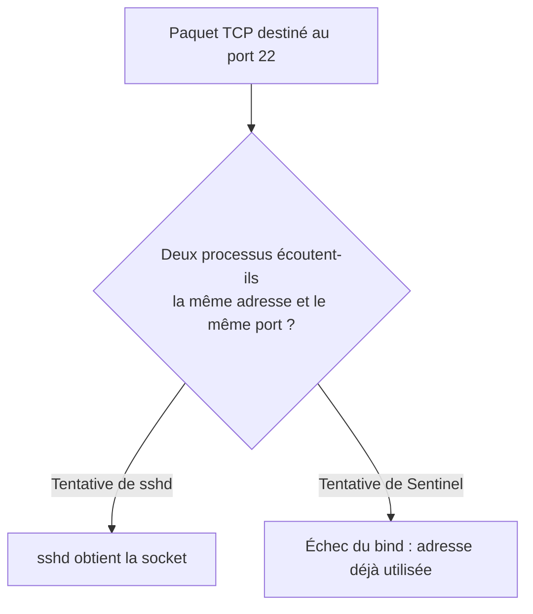

Le noyau interdit donc cette situation. C'est la raison pour laquelle deux serveurs HTTP ne peuvent pas écouter en même temps sur le port 80.

## Où intervient le firewall ?

Nous pouvons maintenant répondre précisément à cette question. Le firewall ne protège pas une application. Il agit **avant**.

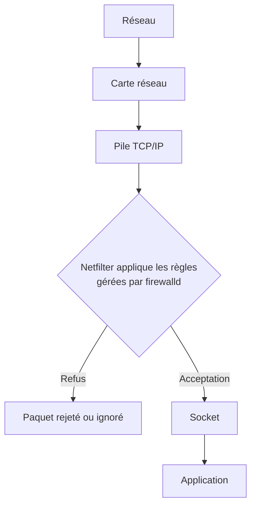

Cette représentation est fondamentale. Le démon SSH ignore totalement qu'un paquet a été bloqué. Il ne l'a tout simplement jamais reçu.

### Conséquence

Lorsqu'un port est fermé par firewalld :

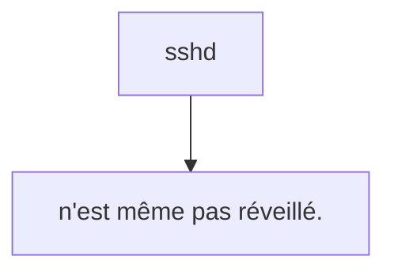

Autrement dit : L'application ne participe absolument pas à la décision. Le firewall travaille entièrement dans le noyau.

## Exemple concret

Imaginons Sentinel.

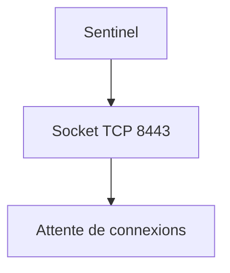

Deux cas sont possibles.

#### Cas n°1

Le firewall autorise :

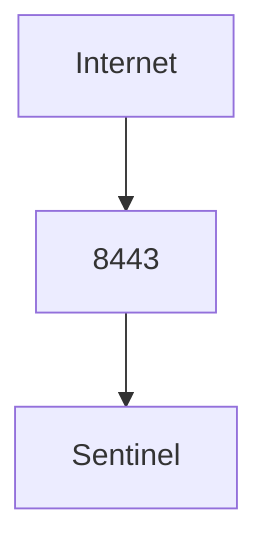

Le paquet atteint l'application.

#### Cas n°2

Le firewall interdit :

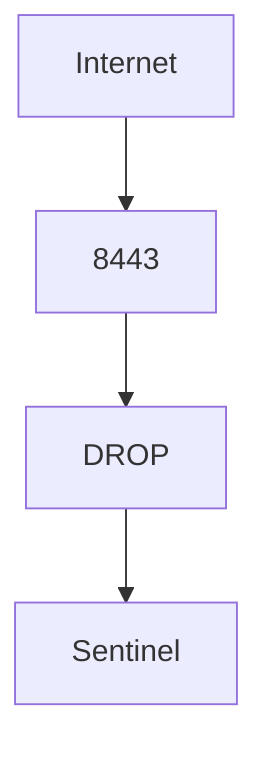

Sentinel ne reçoit jamais le paquet. Pour lui, cette tentative de connexion n'a jamais existé.

### En entreprise

Une erreur fréquente consiste à ouvrir un port "temporairement". Quelques mois plus tard :

- le projet est terminé ;
- le port est toujours ouvert ;
- personne ne sait pourquoi.

Les audits révèlent régulièrement ce type de règle oubliée. Une bonne règle de sécurité est toujours :

- documentée ;
- justifiée ;
- revue régulièrement.

### Culture technique

Le numéro de port n'a rien de magique. Le choix de 22 pour SSH est une convention historique. Il aurait pu être différent. Changer le port de SSH ne renforce pas réellement sa sécurité. En revanche, cela réduit le bruit généré par les robots qui ciblent systématiquement le port 22. Nous reviendrons sur ce débat lors du chapitre consacré au durcissement de SSH.

### Piège classique

De nombreux administrateurs confondent :

- **port fermé** ;
- **service arrêté** ;
- **firewall**.

Les symptômes peuvent être proches, mais leur origine est différente. Par exemple :

- un port fermé par firewalld ;
- un service qui n'écoute plus ;
- une route absente ;

empêcheront tous une connexion SSH. Pourtant, les méthodes de diagnostic sont totalement différentes.

## Relier couche locale, routage et transport

Avant qu'un paquet atteigne Firewalld, le noyau doit résoudre plusieurs problèmes. Il vérifie d'abord si la destination appartient à un préfixe directement connecté. Si oui, ARP en IPv4 ou NDP en IPv6 associe l'adresse IP à un voisin de couche 2. Sinon, la table de routage choisit la route possédant le **préfixe le plus long** parmi celles qui correspondent, puis utilise éventuellement une passerelle.

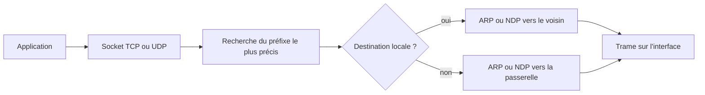

Une adresse de boucle locale (`127.0.0.0/8` en IPv4, `::1` en IPv6) ne quitte pas l'hôte. Un service écoutant uniquement sur `127.0.0.1:8443` possède bien une socket, mais aucun client distant ne peut l'atteindre directement. À l'inverse, une écoute sur `0.0.0.0` ou `::` demande une vérification de toutes les interfaces, des routes et des deux familles IP.

TCP établit une conversation et fournit ordre, retransmission et contrôle de flux. UDP envoie des datagrammes sans établir la même session. Le pare-feu traite les deux, mais un test TCP ne prouve rien pour UDP. ICMP n'est pas un « port » : il transporte notamment des erreurs et des informations indispensables au diagnostic et au bon fonctionnement d'IP.

Pour diagnostiquer sans sauter de couche :

```bash
ip -brief address
ip route get 192.168.56.20
ip neigh show
ss -lntup
```

## Préparer le laboratoire

À ce stade, ne configure **aucun firewall**. L'objectif est uniquement d'observer. Depuis AlmaLinux :

```bash
ss -lnt
```

Identifier :

- les ports ouverts ;
- les adresses d'écoute ;
- les services associés.

Depuis Kali :

```bash
nmap 192.168.56.10
```

Comparer les résultats. Question : Pourquoi certains services visibles localement ne sont-ils pas forcément visibles depuis le réseau ?

## TP 1 — Cartographier les sockets

Lister toutes les sockets TCP en écoute. Identifier pour chacune :

- le port ;
- l'adresse ;
- le processus.

Construire un tableau.

## TP 2 — Relier sockets et processus

Lancer :

```bash
ss -lntp
```

Observer le lien entre :

- socket ;
- PID ;
- programme.

Essayer ensuite :

```bash
systemctl stop sshd
```

Observer immédiatement l'effet sur les sockets.

### Extension — Établir la référence avant filtrage

Depuis Kali : Scanner le serveur. Lister :

- les ports ouverts ;
- les ports fermés ;
- les ports filtrés (s'il y en a).

Ce relevé servira de référence lorsque nous configurerons `firewalld` dans le prochain chapitre.

## Mission d'ingénieur — Expliquer un trajet vers Sentinel

À partir d'un client Kali et du futur port `8443/tcp`, produisez une fiche indiquant l'interface choisie, l'adresse source, la route, la passerelle éventuelle, la résolution ARP/NDP, la socket d'écoute et le point où Firewalld intervient. Ajoutez un test pour `127.0.0.1`, l'adresse de l'interface et une adresse distante. Chaque échec doit être rattaché à une couche observable.

## Impact sur Sentinel

Sentinel deviendra un service réseau. Avant même d'écrire une seule ligne de code, nous savons déjà que :

- il devra ouvrir une socket ;
- il devra écouter sur une adresse et un port ;
- il dépendra entièrement de la pile TCP/IP du noyau ;
- son accessibilité sera contrôlée par `firewalld`, et non par Sentinel lui-même.

Cette distinction influencera toute son architecture.

## Synthèse

Avant d'étudier `firewalld`, il était indispensable de comprendre le parcours d'un paquet dans Linux. Une application ne communique jamais directement avec le réseau. Elle s'appuie sur des sockets fournies par le noyau, qui prend en charge le routage, la gestion des interfaces, les retransmissions et l'association des paquets aux processus.

Le firewall agit avant les applications. Lorsqu'il bloque un paquet, celui-ci n'atteint jamais la socket, et le service concerné ignore totalement qu'une tentative de connexion a eu lieu. Cette compréhension sera essentielle pour interpréter correctement les comportements observés lors de la configuration du firewall.

## Infographie de révision

```text
╔════════════════════════════════════════════════════════════════════╗
║                CHAPITRE 3.1 — TCP/IP CÔTÉ ADMINISTRATEUR          ║
╚════════════════════════════════════════════════════════════════════╝

                 COMMENT UN PAQUET ARRIVE À SSH ?

Administrateur
      │
      ▼
Commande : ssh admin@serveur
      │
      ▼
┌─────────────────────────────────────────────────────────────────┐
│            Espace utilisateur                                   │
│                                                                 │
│        Client SSH → connect() → Socket TCP                      │
└─────────────────────────────────────────────────────────────────┘
      │
      ▼
══════════════════════ NOYAU LINUX ════════════════════════════════
      │
      ▼
Pile TCP/IP
      │
      ├── Vérification de la table de routage
      ├── Choix de l'interface réseau
      ├── Construction des paquets
      └── Transmission Ethernet
      │
      ▼
═══════════════════════ RÉSEAU ════════════════════════════════════
      │
      ▼
Carte réseau du serveur
      │
      ▼
Pile TCP/IP Linux
      │
      ▼
┌─────────────────────────────────────────────────────────────────┐
│                     FIREWALLD                                   │
│                                                                 │
│   ✓ Autorise ───────────────► Socket ─────────► sshd            │
│   ✗ Bloque ─────────────────► Paquet détruit                    │
└─────────────────────────────────────────────────────────────────┘

━━━━━━━━━━━━━━━━━━━━━━━━━━━━━━━━━━━━━━━━━━━━━━━━━━━━━━━━━━━━━━━━━━━━

CONCEPTS CLÉS

✓ Une interface réseau n'est pas une adresse IP.
✓ Une adresse IP n'est pas une route.
✓ Une route est une décision du noyau.
✓ Une socket est le point d'entrée d'une application.
✓ Le firewall filtre les paquets avant qu'ils n'atteignent les applications.

━━━━━━━━━━━━━━━━━━━━━━━━━━━━━━━━━━━━━━━━━━━━━━━━━━━━━━━━━━━━━━━━━━━━

À RETENIR

        Réseau
          │
          ▼
     Noyau Linux
          │
          ▼
     Firewalld
          │
          ▼
       Socket
          │
          ▼
     OpenSSH / Sentinel

━━━━━━━━━━━━━━━━━━━━━━━━━━━━━━━━━━━━━━━━━━━━━━━━━━━━━━━━━━━━━━━━━━━━

PROCHAIN CHAPITRE

              3.2 — Firewalld
      Pourquoi Linux a remplacé iptables
      par une architecture orientée services
      et zones de confiance.
```

## Pour aller plus loin

Les commandes `ip-route(8)`, `ip-neighbour(8)` et `ss(8)` détaillent les structures réellement interrogées par l'administrateur. Le chapitre suivant place Firewalld dans ce trajet sans le confondre avec le moteur de filtrage du noyau.

[3.2 — Architecture de Firewalld](3.2-architecture-firewalld.md) →
