# Chapitre 3.10 — Concevoir la politique réseau de Sentinel

> **Campagne 3 — Réseau et exposition**

> *« Un pare-feu n'est pas une collection de règles. C'est la traduction opérationnelle d'une politique de sécurité. »*

## Vous êtes ici

```text
Partie I ─ Construire un socle sécurisé
        │
        ├── Campagne 1 ─ Installation
        ├── Campagne 2 ─ Comptes et privilèges
        │
        └── Campagne 3 ─ Sécurisation réseau
                 │
                 ├── 3.1 TCP/IP côté administrateur
                 ├── 3.2 Firewalld
                 ├── 3.3 Les zones
                 ├── 3.4 Les services
                 ├── 3.5 Conntrack
                 ├── 3.6 Les Rich Rules
                 ├── 3.7 Journalisation
                 ├── 3.8 Les IP Sets
                 ├── 3.9 Runtime / Permanent
                 │
                 └──► 3.10 Architecture Firewalld
```

## Objectifs pédagogiques

À la fin de ce chapitre, vous serez capable de :

- concevoir une architecture Firewalld adaptée à un environnement professionnel ;
- articuler les zones, les services, les Rich Rules et les IP Sets dans une politique cohérente ;
- intégrer Firewalld avec SELinux, Systemd, FreeIPA, Podman et Sentinel ;
- distinguer une configuration fonctionnelle d'une architecture réellement maintenable ;
- préparer le terrain pour l'industrialisation de la sécurité avec Ansible.

## Pourquoi ce chapitre existe

Au fil de cette campagne, nous avons étudié plusieurs mécanismes :

- les zones ;
- les services ;
- Conntrack ;
- les Rich Rules ;
- les IP Sets ;
- la journalisation ;
- la gestion du runtime.

Chaque mécanisme répond à une problématique particulière. Pourtant, un serveur en production ne les utilise jamais isolément. L'ingénieur sécurité ne réfléchit pas :

> « Quelle Rich Rule dois-je écrire ? »

Il se demande :

> « Quelle politique globale doit protéger cette machine ? »

Autrement dit : Firewalld n'est plus considéré comme un logiciel. Il devient un composant d'une architecture de sécurité.

## Théorie détaillée

### Une erreur fréquente

Lorsqu'un administrateur reçoit un nouveau serveur, il procède souvent de la manière suivante.

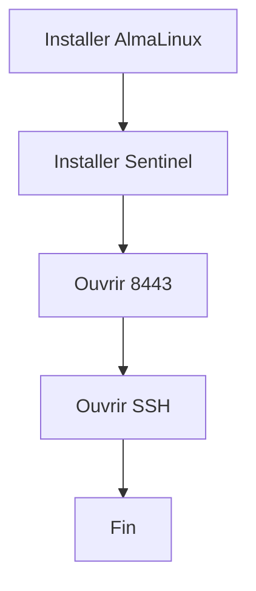

Cette approche fonctionne. Mais elle ne répond à aucune réflexion architecturale. Quelques mois plus tard apparaissent :

- un second réseau ;
- une DMZ ;
- un bastion ;
- des sauvegardes ;
- des conteneurs ;
- des partenaires externes.

La configuration devient progressivement difficile à comprendre. Pourquoi ? Parce que les règles ont été ajoutées au fil des besoins, sans vision d'ensemble.

## Une architecture commence par les flux

Avant d'écrire la moindre commande Firewalld, un architecte dessine les communications. Prenons Sentinel.

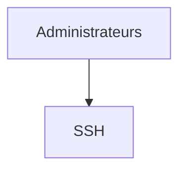

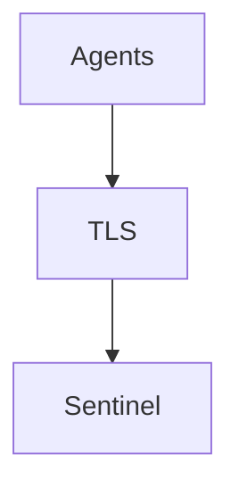

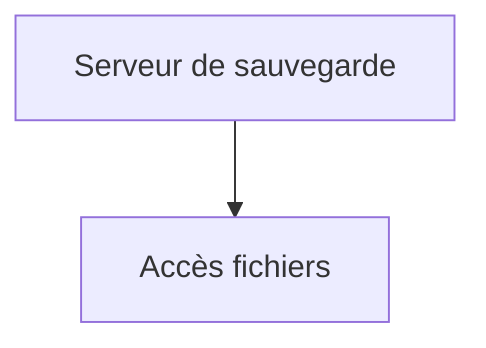

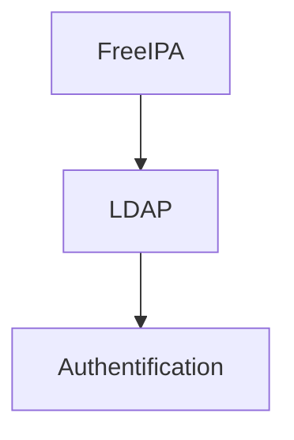

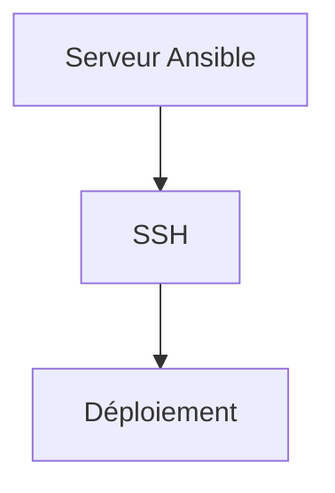

Aucune règle n'a encore été écrite. Pourtant, une grande partie de la politique est déjà définie.

## Construire une matrice de flux

Une méthode très utilisée consiste à construire une matrice. Exemple.

| Source | Destination | Service | Justification |
|---------|-------------|----------|---------------|
| Bastion | AlmaLinux | SSH | Administration |
| Agents Sentinel | Sentinel | TLS | Collecte |
| FreeIPA | Sentinel | LDAP/LDAPS | Authentification |
| Ansible | AlmaLinux | SSH | Déploiement |
| Supervision | Sentinel | HTTPS | Monitoring |

Cette matrice devient le document de référence. Les Rich Rules ne sont qu'une traduction de cette matrice.

## Deux niveaux de réflexion

Une politique de sécurité comporte généralement deux niveaux. Premier niveau.

```
Le réseau.
```

Questions :

- quels réseaux communiquent ?
- quelles interfaces ?
- quelles zones ?

Second niveau.

```
Les services.
```

Questions :

- quel protocole ?
- quel port ?
- quel certificat ?
- quelle authentification ?

Firewalld traite principalement le premier niveau. Les autres composants traiteront progressivement le second.

## Le rôle des zones

Les zones expriment le niveau de confiance. Par exemple.

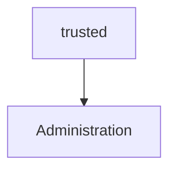

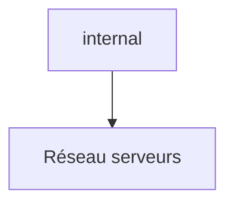

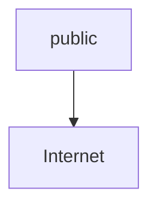

Chaque interface reçoit une zone. L'objectif est que :

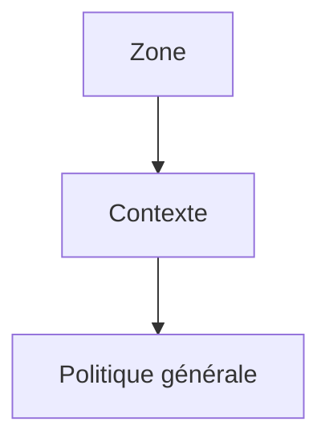

## Le rôle des services

Les services répondent à une autre question. Quels protocoles sont légitimes ? Par exemple :

```
SSH
```

```
HTTPS
```

```
DNS
```

```
DHCPv6
```

Ils constituent une couche d'abstraction. Ils évitent de manipuler directement les ports.

## Le rôle des Rich Rules

Les Rich Rules ajoutent les exceptions. Par exemple.

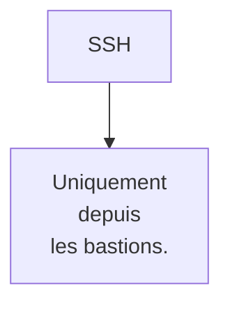

Ou :

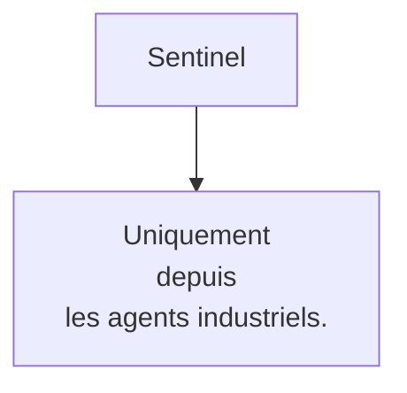

Les Rich Rules expriment la politique métier.

## Le rôle des IP Sets

Les IP Sets permettent ensuite de définir les populations. Par exemple.

```
ADMINS
```

```
PARTNERS
```

```
BACKUPS
```

```
OT_AGENTS
```

Les Rich Rules ne manipulent plus les adresses. Elles manipulent des groupes.

## Le rôle de Conntrack

Conntrack répond à une autre problématique.

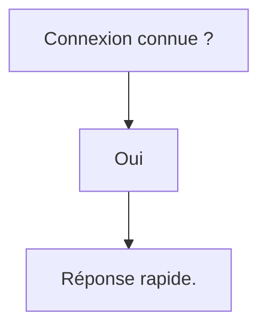

L'architecte ne crée généralement aucune règle spécifique pour Conntrack. Il conçoit simplement une politique compatible avec un pare-feu stateful.

## La journalisation

Dernière couche. Observer. Toutes les règles n'ont pas vocation à produire un journal. Une bonne architecture définit précisément :

- ce qui est enregistré ;
- ce qui est ignoré ;
- ce qui est limité ;
- ce qui est transmis au SIEM.

Le pare-feu devient alors un véritable capteur de sécurité.

## Une vision globale

À ce stade, Firewalld peut être représenté de la manière suivante.

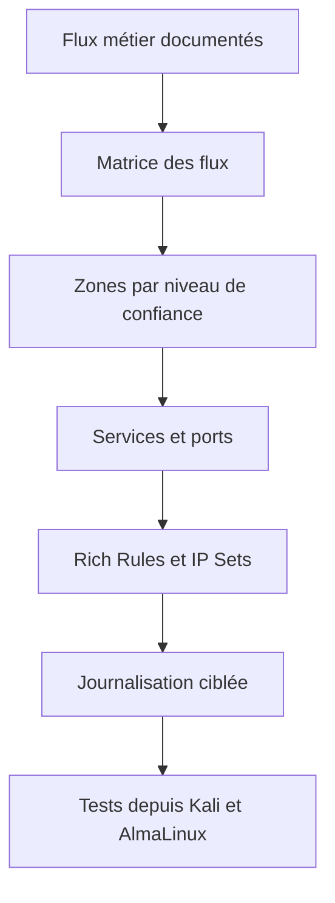

Chaque niveau répond à une question différente. Ensemble, ils construisent une politique cohérente.

## L'erreur de la "règle miracle"

Certains administrateurs cherchent toujours LA règle qui résoudra tous les problèmes. Cette règle n'existe pas. La sécurité est toujours le résultat de plusieurs décisions complémentaires. Firewalld ne remplace pas :

- TLS ;
- FreeIPA ;
- SELinux ;
- Systemd ;
- les permissions Linux ;
- les audits.

Il prépare simplement le terrain pour que ces mécanismes puissent travailler dans de bonnes conditions.

## Intégrer Firewalld dans une architecture de défense en profondeur

L'une des erreurs les plus répandues consiste à considérer Firewalld comme la première et la dernière ligne de défense. En réalité, Firewalld ne constitue qu'une couche. Prenons l'exemple de Sentinel. Un agent souhaite transmettre un rapport. Le chemin parcouru par cette communication est beaucoup plus riche qu'il n'y paraît.

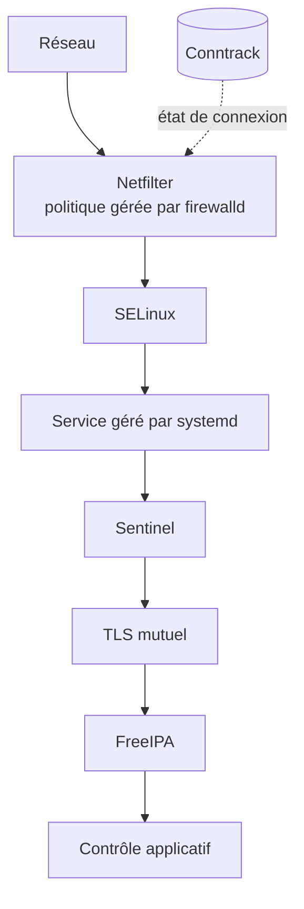

À chaque étape, une nouvelle décision est prise. Si une couche échoue, les suivantes continuent de protéger le système. C'est précisément la définition de la défense en profondeur.

## Firewalld et SELinux

Ces deux technologies sont souvent comparées. Pourtant, elles répondent à deux questions totalement différentes. Firewalld demande :

> Ce paquet peut-il atteindre ce processus ?

SELinux demande :

> Ce processus a-t-il le droit d'effectuer cette action ?

Prenons un exemple. Le port 8443 est autorisé. Le paquet atteint Sentinel. Sentinel tente ensuite :

```
Lecture

/etc/shadow
```

Firewalld n'intervient plus. Le réseau est terminé. SELinux prend alors le relais. Il peut parfaitement refuser cette opération. Ainsi, même un attaquant ayant réussi à atteindre l'application ne bénéficie pas automatiquement d'un accès au système. Cette complémentarité est essentielle.

## Firewalld et Systemd

Systemd intervient encore à un autre niveau. Imaginons que Sentinel écoute sur : `8443/TCP` Firewalld autorise ce port. Pourtant :

```
systemctl stop sentinel
```

Le port n'est plus ouvert. Pourquoi ? Parce qu'aucun processus n'écoute. Le pare-feu ne crée jamais un service. Il autorise uniquement le trafic destiné à un service existant. L'architecture complète devient donc :

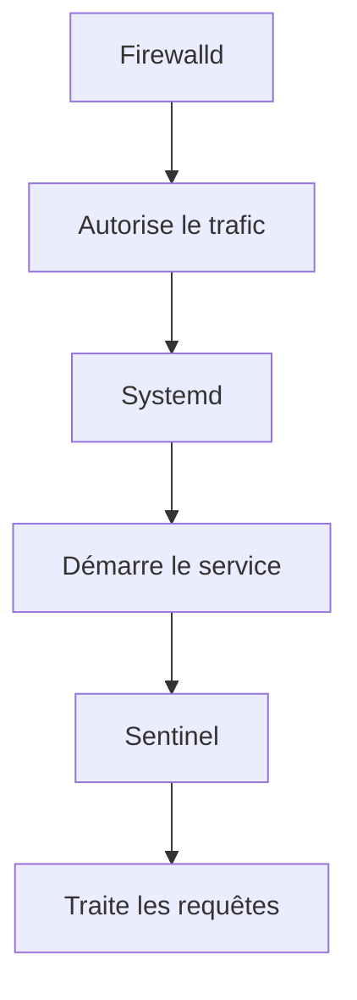

## Firewalld et FreeIPA

FreeIPA ne remplace pas Firewalld. Supposons qu'un utilisateur possède un certificat parfaitement valide. Il tente une connexion depuis une adresse IP totalement inconnue. Si Firewalld refuse le trafic : la connexion TLS n'aura même jamais lieu. Inversement : si Firewalld autorise le trafic, mais que FreeIPA refuse le certificat, l'utilisateur sera également bloqué. Les deux composants réalisent donc des contrôles différents.

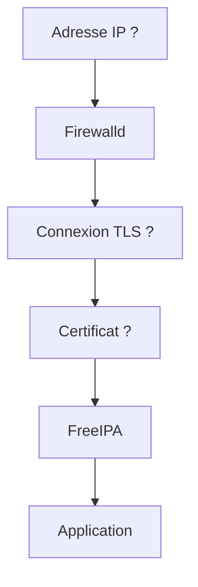

Cette succession de filtres réduit considérablement les possibilités d'attaque.

## Firewalld et Podman

Notre architecture Sentinel évoluera progressivement vers des conteneurs Podman. Cette évolution soulève une question importante. Qui protège le conteneur ? Plusieurs réponses coexistent. Le trafic peut être filtré :

- avant d'atteindre le réseau Podman ;
- au niveau du réseau des conteneurs ;
- dans le conteneur lui-même.

Une architecture robuste évite de concentrer toute la sécurité à un seul niveau. Le filtrage peut donc être réparti entre :

- Firewalld ;
- les réseaux Podman ;
- l'application ;
- SELinux.

Cette répartition limite fortement les conséquences d'une erreur de configuration isolée.

## Firewalld et Ansible

À ce stade de la formation, un constat s'impose. La politique Firewalld devient de plus en plus riche. Elle contient désormais :

- plusieurs zones ;
- plusieurs services ;
- des Rich Rules ;
- des IP Sets ;
- une stratégie de journalisation.

Peut-on raisonnablement maintenir cela manuellement sur cinquante serveurs ? Évidemment non. Une architecture professionnelle suit généralement le schéma suivant.

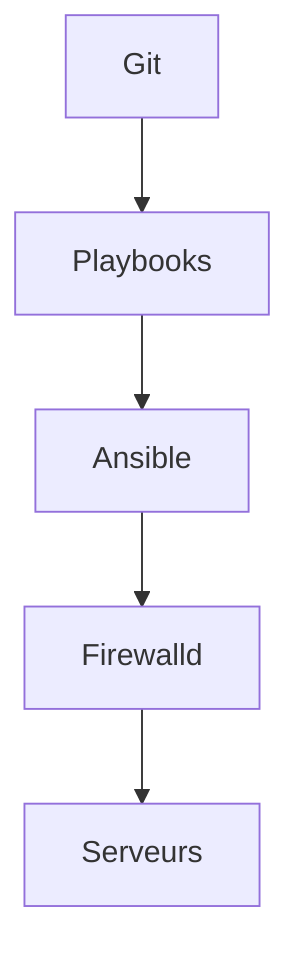

Le pare-feu devient un élément de l'Infrastructure as Code. Chaque modification :

- est versionnée ;
- relue ;
- testée ;
- déployée automatiquement.

Cette approche réduit énormément les erreurs humaines.

## L'architecture Sentinel

Rassemblons maintenant tous les éléments étudiés.

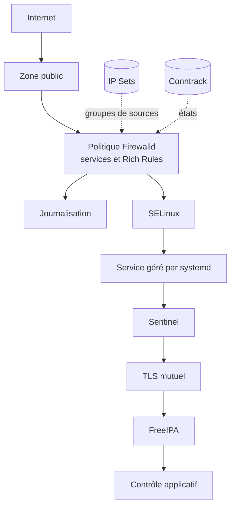

Aucune couche n'est suffisante seule. Ensemble, elles construisent une architecture particulièrement robuste.

## Une politique qui résiste au temps

Une bonne politique Firewalld possède plusieurs caractéristiques. Elle est :

- lisible ;
- documentée ;
- industrialisée ;
- reproductible ;
- testable ;
- auditée ;
- automatisée.

Une politique qui dépend uniquement de la mémoire des administrateurs est une politique fragile. À l'inverse, une politique décrite dans :

- des playbooks ;
- une documentation ;
- une matrice de flux ;
- des IP Sets bien nommés ;

peut évoluer sereinement pendant plusieurs années.

## Le véritable objectif de Firewalld

Au début de cette campagne, Firewalld pouvait sembler n'être qu'un outil permettant d'ouvrir un port. Nous savons maintenant que son véritable rôle est tout autre. Il permet de transformer une politique de sécurité abstraite en une politique appliquée par le noyau Linux. Cette distinction est essentielle. L'outil importe finalement assez peu. Ce qui compte est la capacité à exprimer correctement la politique. Demain, l'entreprise pourra migrer :

- vers un pare-feu matériel ;
- vers Kubernetes ;
- vers une solution SDN ;
- vers une infrastructure cloud.

Les concepts étudiés dans cette campagne resteront exactement les mêmes. Les commandes changeront. La réflexion architecturale, elle, restera valable.

## Concevoir des frontières de confiance

Un architecte commence par les frontières, puis traduit les flux autorisés dans Firewalld.

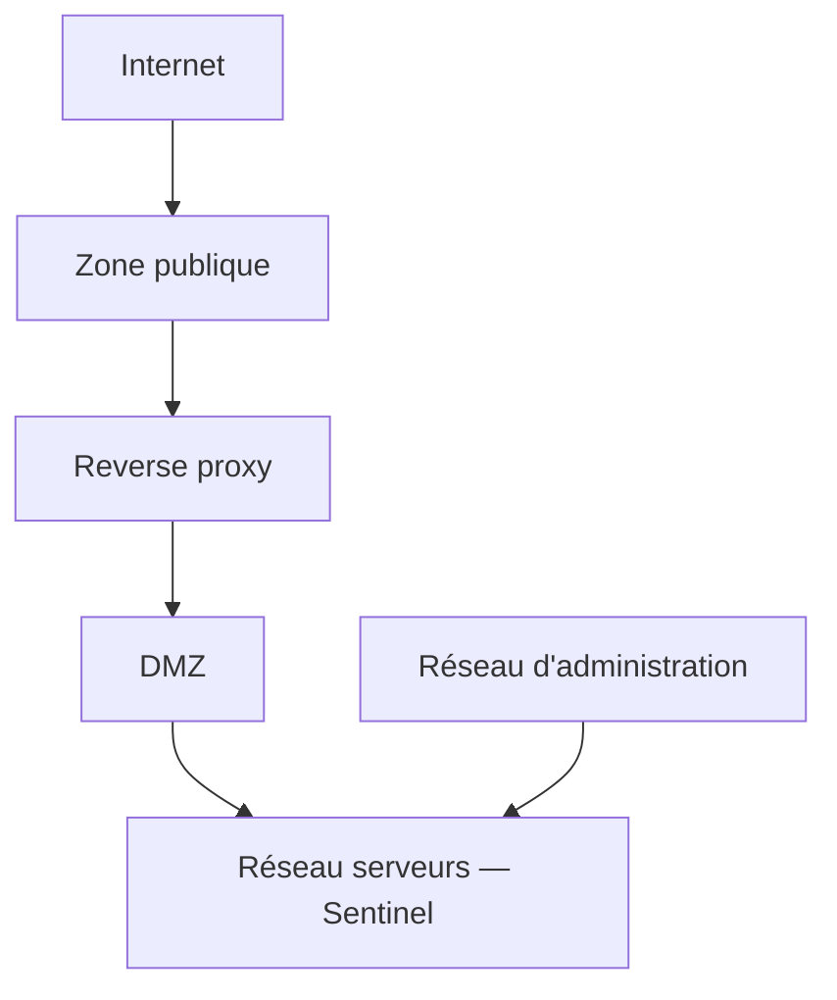

Chaque frontière implique une question. Que peut traverser cette frontière ? Qui en est responsable ? Comment le vérifier ? Firewalld intervient ensuite pour mettre en œuvre ces décisions.

### Les couches doivent rester indépendantes

Une architecture robuste possède une propriété importante. Chaque couche continue de protéger le système même si une autre couche échoue. Imaginons. Firewalld contient une erreur. Une adresse IP non prévue atteint Sentinel. Que se passe-t-il ? TLS intervient. Si TLS échoue également ? FreeIPA intervient. Si un certificat valide est utilisé ? Le contrôle applicatif intervient. Si l'application est compromise ? SELinux limite les conséquences.

Cette indépendance constitue la véritable force d'une architecture de sécurité.

### Concevoir pour l'audit

Une architecture doit être compréhensible. Pas uniquement par son auteur. Imaginons qu'un auditeur arrive dans trois ans. Il demande :

> Pourquoi cette Rich Rule existe-t-elle ?

Si la seule réponse est :

> « Je crois que c'était pour un ancien projet... »

alors la politique est déjà dégradée. Chaque règle importante devrait pouvoir être reliée :

- à un flux ;
- à un besoin métier ;
- à un propriétaire ;
- à une documentation.

Une politique explicable est généralement une politique plus sûre.

## En entreprise

Les grandes organisations ne documentent pas leurs pare-feu en listant des règles. Elles documentent :

- les zones ;
- les flux ;
- les responsabilités ;
- les dépendances.

Une revue d'architecture ressemble davantage à ceci.

| Flux | Justification | Responsable | Criticité |
|------|---------------|-------------|-----------|
| Bastion → SSH | Administration | Équipe Système | Élevée |
| Agents → Sentinel | Collecte | Équipe OT | Critique |
| Sentinel → FreeIPA | Authentification | IAM | Critique |
| Supervision → HTTPS | Monitoring | Exploitation | Moyenne |

Les Rich Rules sont ensuite générées à partir de cette réflexion. L'ordre est important. On ne construit jamais une architecture à partir des commandes. On construit les commandes à partir de l'architecture.

## Culture technique

Les concepts étudiés dans cette campagne dépassent largement Firewalld. On retrouve exactement les mêmes idées dans :

| Technologie | Équivalent |
|-------------|------------|
| Pare-feux matériels | Address Objects / Policies |
| Cisco ACI | Contracts |
| VMware NSX | Distributed Firewall Policies |
| Kubernetes | Network Policies |
| AWS | Security Groups |
| Azure | Network Security Groups |
| Google Cloud | VPC Firewall Rules |

Les commandes changent. Les principes restent identiques :

- segmentation ;
- moindre privilège ;
- groupes ;
- politiques ;
- observabilité ;
- défense en profondeur.

C'est précisément pour cette raison que ces notions resteront utiles quelle que soit l'évolution future de votre infrastructure.

## Piège classique

### Penser que Firewalld protège une application

Firewalld ne protège jamais directement une application. Il protège **l'accès** à cette application. Prenons Sentinel. Firewalld peut empêcher qu'un attaquant atteigne le port 8443. En revanche, si un utilisateur légitime possède déjà un accès valide : Firewalld ne contrôle plus :

- les autorisations métier ;
- les rôles ;
- les commandes exécutées ;
- les données consultées.

Ces responsabilités appartiennent à Sentinel. Cette séparation des responsabilités est fondamentale. Un pare-feu ne remplace jamais une conception applicative sécurisée.

## Couvrir les deux sens et les deux familles IP

Une matrice limitée aux connexions entrantes oublie les dépendances de Sentinel : DNS, synchronisation de l'heure, annuaire FreeIPA, dépôt RPM, sauvegarde ou SIEM. Documentez donc les flux entrants, sortants et éventuellement transférés. Les zones décrivent surtout le contexte d'entrée ; les **policies** Firewalld permettent d'exprimer des relations entre zones, y compris vers la zone symbolique `HOST` ou `ANY` selon le besoin.

```mermaid
flowchart LR
    Agents["Agents autorisés"] -->|"8443/tcp"| Sentinel
    Admin["Bastion"] -->|"22/tcp"| Sentinel
    Sentinel -->|"DNS, NTP, FreeIPA, dépôts"| Infra["Services d'infrastructure"]
    Sentinel -->|"journaux"| SIEM
    Internet -. "accès direct refusé" .-> Sentinel
```

Chaque flux doit préciser IPv4, IPv6 ou les deux. Une règle IPv4 correcte n'est pas une politique dual-stack. De même, un conteneur Podman peut introduire du forwarding et des zones supplémentaires : vérifiez le trajet réel au lieu de supposer que la zone de l'interface physique suffit.

Le plan de validation doit contenir des tests positifs, des refus, un contrôle local des sockets, la politique Firewalld active, la table de routage et les journaux. Ajoutez un retour arrière et un responsable. Une matrice n'est validée que lorsque ses décisions sont observables des deux côtés du pare-feu.

## TP 1 — Construire la matrice de flux

### Objectif

Concevoir une architecture Firewalld complète pour une infrastructure Sentinel, sans partir des commandes, mais à partir des **flux métier**. L'objectif de ce laboratoire est de reproduire la démarche d'un architecte sécurité. Vous ne devez pas vous demander :

> « Quelle commande `firewall-cmd` dois-je exécuter ? »

Vous devez vous demander :

> « Quels flux sont réellement nécessaires au fonctionnement de cette infrastructure ? »

Les commandes ne viendront qu'après.

### Architecture

Nous reprenons l'infrastructure construite tout au long de cette campagne.

```mermaid
flowchart TB
    internet[Internet] --> edge[Pare-feu périmétrique]
    subgraph admin[Réseau d'administration]
        bastion[Bastion SSH]
        ansible[Serveur Ansible]
        monitoring[Serveur de supervision]
    end
    subgraph servers[Réseau serveurs]
        sentinel[Serveur Sentinel]
        freeipa[Serveur FreeIPA]
    end
    subgraph industrial[Réseau industriel]
        agents[Agents Sentinel]
    end
    edge --> bastion
    bastion -->|SSH| sentinel
    ansible -->|SSH| sentinel
    monitoring -->|HTTPS| sentinel
    agents -->|HTTPS avec TLS| sentinel
    sentinel -->|LDAPS| freeipa
```

### Étape 1 — Identifier les flux

Sans écrire une seule règle Firewalld, réalisez une matrice des communications. Par exemple :

| Source | Destination | Service | Obligatoire ? | Pourquoi ? |
|---------|-------------|----------|---------------|------------|
| Bastion | Sentinel | SSH | Oui | Administration |
| Agent | Sentinel | HTTPS/TLS | Oui | Collecte |
| Sentinel | FreeIPA | LDAPS | Oui | Authentification |
| Ansible | Sentinel | SSH | Oui | Déploiement |
| Supervision | Sentinel | HTTPS | Oui | Monitoring |

Ajoutez ensuite tous les flux que vous estimez nécessaires.

### Étape 2 — Identifier les flux interdits

Complétez maintenant une seconde matrice.

| Source | Destination | Justification du refus |
|---------|-------------|------------------------|
| Internet | SSH | Administration uniquement via bastion |
| Internet | FreeIPA | Jamais exposé |
| Poste utilisateur | API Sentinel | Non autorisé |
| Agent | SSH | Aucun besoin métier |

Cette seconde matrice est souvent plus importante que la première. Elle matérialise le principe du moindre privilège.

### Étape 3 — Construire les zones

Déterminez les zones Firewalld adaptées à votre architecture. Par exemple : `public` `internal` `trusted` ou toute autre organisation répondant à votre contexte. Justifiez chaque choix. Une zone ne doit jamais être créée "par habitude". Elle doit correspondre à un niveau de confiance clairement identifié.

### Étape 4 — Définir les IP Sets

Listez les ensembles nécessaires. Par exemple : `SENTINEL_AGENTS` `SENTINEL_ADMINS` `BACKUP_SERVERS` `MONITORING` `ANSIBLE_CONTROLLERS` Pour chacun :

- indiquez son propriétaire ;
- sa source de vérité ;
- sa méthode de mise à jour ;
- son cycle de revue.

## TP 2 — Traduire et vérifier la politique

À partir des matrices précédentes, rédigez les Rich Rules correspondantes. L'objectif n'est pas d'en produire beaucoup. Au contraire. Cherchez à obtenir :

- peu de règles ;
- très lisibles ;
- fortement réutilisables.

### Étape 6 — Définir la stratégie de journalisation

Pour chaque flux : Décidez s'il doit être :

- journalisé ;
- ignoré ;
- limité (`limit`) ;
- remonté au SIEM.

Justifiez chacune de vos décisions.

### Étape 7 — Préparer l'automatisation

Sans écrire encore de playbook Ansible, identifiez :

- les variables ;
- les modèles ;
- les objets réutilisables ;
- les informations qui ne devraient jamais être codées en dur.

Réfléchissez à la manière dont cette politique pourrait être déployée sur :

- 10 serveurs ;
- 100 serveurs ;
- 1 000 serveurs.

L'exercice ne porte plus uniquement sur Firewalld. Il porte sur la capacité à industrialiser une architecture.

## Mission d'ingénieur

### Contexte

Votre entreprise déploie Sentinel dans un groupe industriel international. L'infrastructure cible comprend :

- 12 datacenters ;
- 350 serveurs AlmaLinux ;
- plus de 9 000 agents Sentinel ;
- plusieurs milliers d'utilisateurs FreeIPA ;
- plusieurs centaines de conteneurs Podman ;
- une plateforme Ansible centralisée.

L'audit de sécurité met en évidence plusieurs problèmes.

- Les politiques Firewalld diffèrent selon les sites.
- Certaines Rich Rules n'ont aucune justification documentée.
- Plusieurs IP Sets sont gérés manuellement.
- Les journaux ne suivent aucune convention commune.
- Les modifications d'urgence ne sont pas toujours reportées dans les playbooks Ansible.

La direction vous confie la refonte complète de la politique réseau. Votre objectif n'est pas seulement de sécuriser les serveurs. Vous devez concevoir une architecture capable d'être :

- comprise ;
- auditée ;
- maintenue ;
- automatisée ;
- transmise à de nouvelles équipes.

### Votre mission

Vous devez produire un dossier d'architecture contenant au minimum :

1. La cartographie des zones de confiance.
2. La matrice complète des flux autorisés.
3. Les flux explicitement interdits.
4. Les IP Sets nécessaires.
5. Les conventions de nommage.
6. La stratégie de journalisation.
7. Les règles de gouvernance.
8. Le cycle de validation des changements.
9. La stratégie d'automatisation Ansible.
10. Les contrôles permettant de vérifier que chaque serveur reste conforme au modèle.

Votre proposition devra montrer que la sécurité n'est pas une succession de commandes, mais une architecture cohérente.

## Impact sur Sentinel

À l'issue de cette campagne, Sentinel repose désormais sur un véritable socle de sécurité.

```mermaid
flowchart TD
    internet[Internet] --> segmentation[Segmentation réseau]
    segmentation --> filter[Firewalld<br/>zones, services et Rich Rules]
    ipsets[(IP Sets)] -. sources .-> filter
    conntrack[(Conntrack)] -. états .-> filter
    filter --> logs[Journalisation]
    filter --> selinux[SELinux]
    selinux --> systemd[systemd]
    systemd --> sentinel[Service Sentinel]
    sentinel --> tls[TLS mutuel]
    tls --> freeipa[FreeIPA]
    freeipa --> acl[Contrôle applicatif]
```

Cette architecture n'est pas figée. Les campagnes suivantes viendront renforcer chacune de ces couches. Par exemple :

- **Campagne 4** : SSH et administration sécurisée.
- **Campagne 5** : SELinux.
- **Campagne 6** : TLS et certificats.
- **Campagne 7** : Systemd et durcissement des services.
- **Campagne 8** : FreeIPA.
- **Campagne 9** : Ansible.
- **Campagne 10** : Podman.
- **Campagne 11** : Industrialisation complète de Sentinel.

Chaque nouvelle technologie viendra s'appuyer sur les fondations construites dans cette campagne.

## Synthèse

- Une politique Firewalld est la traduction technique d'une politique de sécurité.
- Les zones définissent les niveaux de confiance.
- Les services décrivent les protocoles légitimes.
- Les Rich Rules expriment les exceptions métier.
- Les IP Sets séparent les données de la politique.
- Conntrack optimise le traitement des connexions établies.
- La journalisation transforme le pare-feu en capteur de sécurité.
- La distinction runtime/permanent permet de tester sans compromettre la reproductibilité.
- Firewalld n'est efficace que lorsqu'il est intégré à une stratégie de défense en profondeur avec SELinux, Systemd, FreeIPA, TLS, Podman et Ansible.
- Une architecture homogène, documentée et automatisée est plus sûre qu'une accumulation de règles.

## Infographie de révision

```text
┌────────────────────────────────────────────────────────────────────────────────────┐
│                     CAMPAGNE 3 — SÉCURISATION RÉSEAU                               │
├────────────────────────────────────────────────────────────────────────────────────┤
│                                                                                    │
│                         Définir la politique                                       │
│                                                                                    │
│              Flux métier ─────────► Matrice des communications                     │
│                                           │                                        │
│                                           ▼                                        │
│                              Définition des zones                                 │
│                                           │                                        │
│                                           ▼                                        │
│                          Services autorisés (SSH, HTTPS…)                         │
│                                           │                                        │
│                                           ▼                                        │
│                     Rich Rules (exceptions métier)                                │
│                                           │                                        │
│                                           ▼                                        │
│                      IP Sets (groupes d'adresses)                                 │
│                                           │                                        │
│                                           ▼                                        │
│                       Conntrack (connexions établies)                             │
│                                           │                                        │
│                                           ▼                                        │
│                     Journalisation & Observabilité                                │
│                                           │                                        │
│                                           ▼                                        │
│                            Runtime / Permanent                                    │
│                                           │                                        │
│                                           ▼                                        │
│                         Déploiement Ansible                                       │
│                                           │                                        │
│                                           ▼                                        │
│                           Infrastructure homogène                                 │
├────────────────────────────────────────────────────────────────────────────────────┤
│                                                                                    │
│                      Défense en profondeur                                         │
│                                                                                    │
│   Réseau → Firewalld → SELinux → Systemd → Sentinel → TLS → FreeIPA → Application │
│                                                                                    │
├────────────────────────────────────────────────────────────────────────────────────┤
│                                                                                    │
│ Réflexes d'ingénieur                                                               │
│                                                                                    │
│ ✓ Commencer par les flux métier                                                    │
│ ✓ Documenter chaque décision                                                       │
│ ✓ Utiliser le moindre privilège                                                    │
│ ✓ Automatiser avec Ansible                                                         │
│ ✓ Maintenir Runtime = Permanent                                                    │
│ ✓ Corréler les journaux                                                            │
│ ✓ Réviser régulièrement les IP Sets                                                │
│ ✓ Considérer Firewalld comme une couche, jamais comme une solution unique          │
│                                                                                    │
├────────────────────────────────────────────────────────────────────────────────────┤
│                                                                                    │
│                       Vision de l'architecte                                       │
│                                                                                    │
│ « Une bonne politique réseau ne se mesure pas au nombre de règles.                 │
│  Elle se mesure à sa capacité à rester simple, explicable, reproductible           │
│  et sûre malgré l'évolution permanente de l'infrastructure. »                      │
│                                                                                    │
└────────────────────────────────────────────────────────────────────────────────────┘
```

## Pour aller plus loin

Conservez la matrice de flux et les preuves comme baseline. Les campagnes suivantes ajouteront SSH, systemd, SELinux, TLS, FreeIPA, Ansible et Podman ; chacune devra préciser quels flux elle ajoute, retire ou rend plus exigeants sans contourner cette source de vérité.

À l'issue de cette campagne, vous savez raisonner en flux métier, segmenter un réseau et combiner zones, services, Rich Rules, IP Sets, Conntrack, journalisation et cycle runtime/permanent. Ce socle permettra aux campagnes suivantes d'ajouter SELinux, systemd, FreeIPA, TLS, Podman et Ansible sans perdre la maîtrise de l'exposition réseau.

← [3.9 — Runtime et Permanent](3.9-runtime-permanent.md)
