# Chapitre 3.2 — Architecture de Firewalld

> **Campagne 3 — Réseau et exposition**

> *« Le meilleur paquet est parfois celui qui n'atteint jamais l'application. »*

## Vous êtes ici

```
Sécurisation d'un socle AlmaLinux et de ses services

Campagne 3 : Réseau et exposition

✔ 3.1 TCP/IP côté administrateur

► 3.2 Firewalld

Prochain chapitre

3.3 Les zones
```

Dans le chapitre précédent, nous avons suivi le voyage d'un paquet depuis Kali jusqu'à une application Linux. Nous avons vu que le paquet traverse plusieurs couches :

- la carte réseau ;
- la pile TCP/IP du noyau ;
- puis seulement l'application.

Une question reste alors en suspens. À quel endroit Linux décide-t-il :

> *« Ce paquet peut continuer »*

ou

> *« Ce paquet doit être détruit »* ?

C'est précisément le rôle du firewall.

## Objectifs pédagogiques

À la fin de ce chapitre, vous serez capable de :

- expliquer le rôle exact d'un firewall Linux ;
- comprendre pourquoi firewalld n'est pas le firewall lui-même ;
- distinguer netfilter, nftables et firewalld ;
- comprendre la notion de politique de filtrage ;
- savoir où intervient firewalld dans la pile réseau ;
- interpréter les premières règles de filtrage.

## Pourquoi ce chapitre existe

Lorsque l'on demande :

> « Quel pare-feu utilisez-vous sous AlmaLinux ? »

La réponse est presque toujours :

> **Firewalld.**

Cette réponse est pourtant inexacte. Firewalld n'est pas le firewall. C'est une erreur extrêmement répandue. Pour comprendre pourquoi, nous devons regarder un peu plus bas.

## L'empilement réel

Sous Linux, plusieurs composants collaborent.

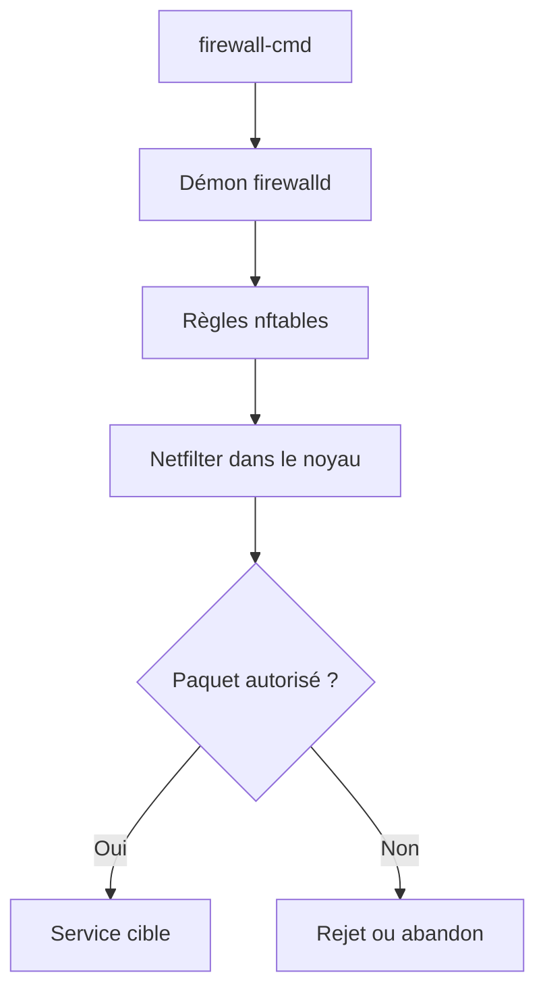

Ce schéma est fondamental. Il montre que :

- **Netfilter** réalise le filtrage.
- **nftables** décrit les règles.
- **Firewalld** pilote dynamiquement ces règles.

Firewalld n'est donc pas le moteur. Il est le chef d'orchestre.

## Une analogie

Imaginons un théâtre.

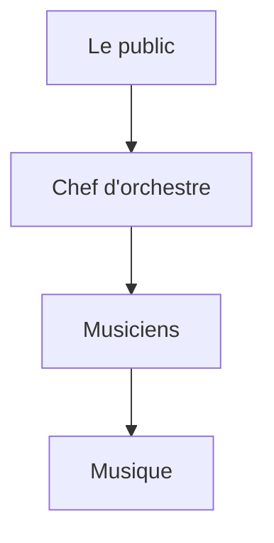

Le chef d'orchestre ne produit aucun son. Il coordonne. Firewalld joue exactement ce rôle. Les véritables décisions sont prises par le moteur de filtrage du noyau.

## Un peu d'histoire

Pendant longtemps, Linux utilisait :

```
iptables
```

Chaque règle était manipulée individuellement. Au fil des années :

- les configurations sont devenues très complexes ;
- les performances ont diminué ;
- IPv4 et IPv6 nécessitaient souvent des règles distinctes ;
- les scripts devenaient difficiles à maintenir.

Le projet **nftables** est né pour répondre à ces limites. Firewalld a ensuite évolué pour utiliser nftables comme moteur. Aujourd'hui, sur AlmaLinux 9, le schéma est généralement :

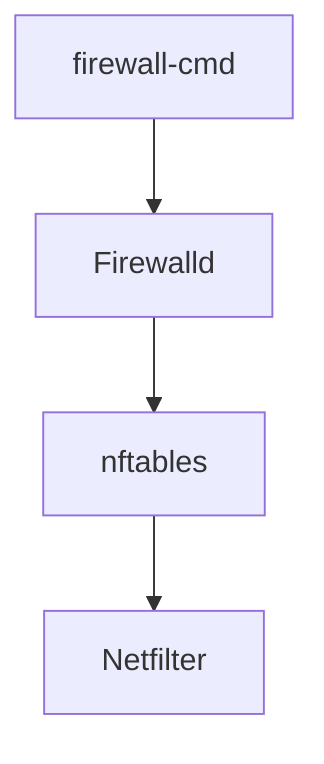

Il est encore possible de rencontrer `iptables` sur des systèmes plus anciens, mais il est important de comprendre que les distributions récentes s'appuient principalement sur nftables.

## Pourquoi un firewall dans le noyau ?

On pourrait imaginer un programme utilisateur qui inspecte tous les paquets. Pourquoi Linux ne fait-il pas cela ? La réponse est simple : Parce qu'il serait déjà trop tard. Si un paquet arrivait jusqu'à une application utilisateur avant d'être filtré :

- l'application devrait le recevoir ;
- l'analyser ;
- puis décider de l'accepter ou non.

Cela augmenterait la charge système et élargirait la surface d'attaque. En intégrant le filtrage directement dans le noyau, Linux élimine les paquets indésirables **avant qu'ils n'atteignent le moindre processus utilisateur**. C'est une décision d'architecture majeure.

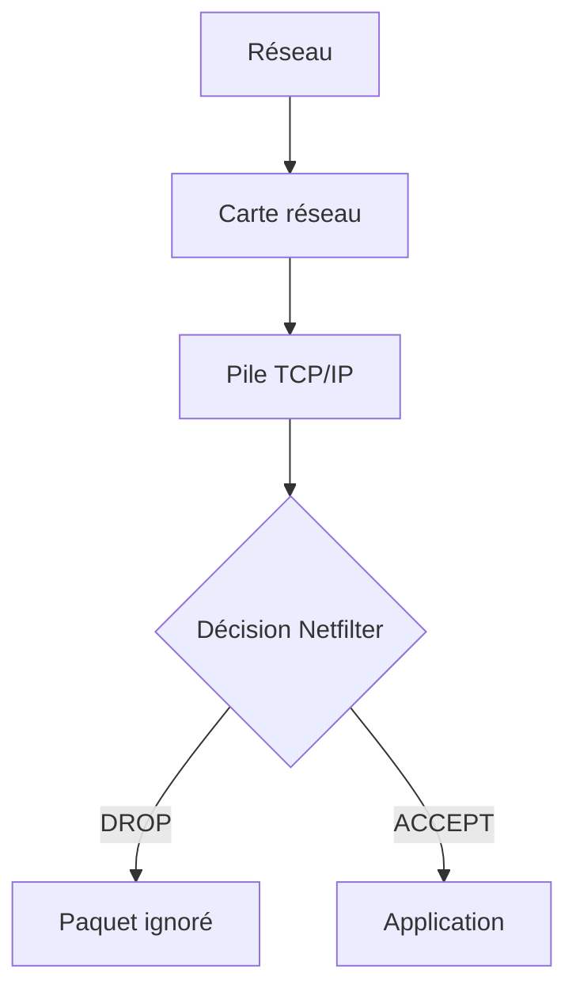

Le démon `sshd` ou Sentinel ne savent même pas qu'un paquet a été rejeté. Ils n'ont jamais été réveillés.

## La philosophie d'un firewall

Maintenant que nous savons **où** agit le firewall, une nouvelle question apparaît. Comment décide-t-il si un paquet doit être accepté ou refusé ? À première vue, cela semble simple. On pourrait imaginer :

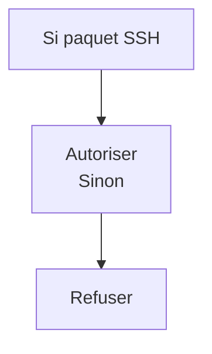

En réalité, un firewall moderne prend ses décisions selon une philosophie beaucoup plus générale. Cette philosophie repose sur une idée extrêmement importante :

> **Tout ce qui n'est pas explicitement autorisé doit être considéré comme interdit.**

On appelle cela :

> **Deny by Default**

ou

> **Principe du refus par défaut**

Cette règle est omniprésente en cybersécurité. Nous la retrouverons :

- avec les permissions Linux ;
- avec SELinux ;
- avec les ACL ;
- avec sudo ;
- avec les certificats TLS ;
- avec FreeIPA.

C'est l'un des fondements de la défense en profondeur.

## Pourquoi le "Allow by Default" est dangereux ?

Imaginons un nouveau service installé sur le serveur.

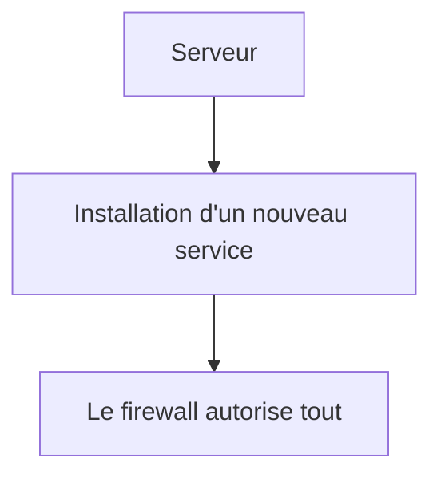

L'administrateur ne fait rien. Pourtant : Le nouveau service devient immédiatement accessible. Personne ne l'a décidé. Le système s'est ouvert tout seul. Cette philosophie est extrêmement risquée.

### Exemple

Supposons que Sentinel ouvre demain un nouveau port :

```
TCP 9443
```

Si le firewall fonctionne selon le principe :

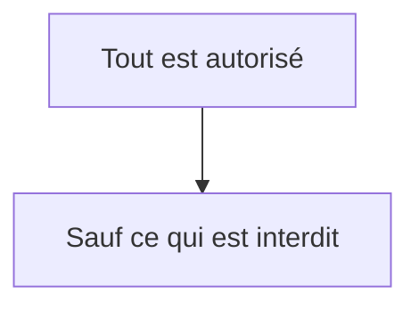

Alors Sentinel sera immédiatement joignable. L'administrateur devra penser à le bloquer. À l'inverse. Avec le refus par défaut :

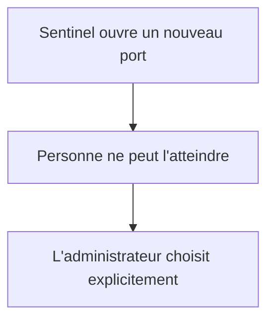

Cette différence change complètement la sécurité d'une infrastructure.

## Firewalld raisonne autrement qu'iptables

C'est ici que Firewalld devient vraiment intéressant. Pendant des années, les administrateurs écrivaient directement des règles. Par exemple :

```
Autoriser TCP 22

Autoriser TCP 443

Interdire le reste
```

Cette approche fonctionne. Mais elle possède un défaut. Elle décrit **des ports**. Or un administrateur ne pense généralement pas en termes de ports. Il pense :

> SSH

> HTTPS

> DNS

> NTP

Autrement dit. Il pense en termes de **services**. Firewalld introduit justement cette abstraction.

## Les services

Lorsque l'on exécute :

```bash
firewall-cmd --add-service=ssh
```

On ne demande pas :

```
Autoriser TCP 22.
```

On demande :

```
Autoriser le service SSH.
```

Firewalld traduit ensuite cette demande. En interne. Il sait que :

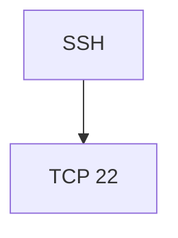

Mais il pourrait tout aussi bien autoriser :

```
TCP

+

UDP

+

Modules complémentaires
```

Sans que l'administrateur ait besoin de les connaître.

## Une analogie

Imaginons une entreprise. Le directeur ne dit pas :

> Ouvrez la porte numéro 14.

Il dit :

> Laissez entrer les employés.

Le gardien connaît ensuite :

- les badges ;
- les portes ;
- les horaires.

Firewalld joue exactement ce rôle.

## Les règles deviennent lisibles

Au lieu de :

```
TCP 22

TCP 80

TCP 443

UDP 53
```

On obtient :

```
SSH

HTTP

HTTPS

DNS
```

Cette différence paraît mineure. Pourtant. Lorsque l'on gère plusieurs centaines de serveurs. La maintenance devient infiniment plus simple.

### En entreprise

Une bonne pratique consiste à documenter les ouvertures de firewall en langage métier. Par exemple :

```
Autoriser HTTPS

Pour les utilisateurs

Depuis Internet
```

plutôt que :

```
TCP 443
```

Pourquoi ? Parce que dans cinq ans, un administrateur comprendra immédiatement l'intention de la règle. Les numéros de ports, eux, ne racontent pas l'histoire de l'infrastructure.

### Culture technique

Les définitions des services utilisées par Firewalld sont stockées dans des fichiers XML. Sous AlmaLinux, on les trouve notamment dans :

```
/usr/lib/firewalld/services/
```

Par exemple :

```
ssh.xml
http.xml
https.xml
dns.xml
```

Vous pouvez les ouvrir avec un simple éditeur de texte. Vous découvrirez qu'un « service » Firewalld est en réalité une description structurée :

- ports ;
- protocoles ;
- parfois modules particuliers.

C'est une excellente manière de comprendre ce qui est réellement autorisé lorsqu'on ajoute un service.

### Piège classique

Beaucoup d'administrateurs ouvrent un port directement :

```bash
firewall-cmd --add-port=8443/tcp
```

Alors qu'il s'agit en réalité d'un nouveau service métier. Quelques mois plus tard, plus personne ne sait :

- pourquoi ce port est ouvert ;
- quelle application l'utilise ;
- s'il est encore nécessaire.

Lorsque cela est possible, privilégier un **service identifié** rend la configuration plus lisible et plus durable.

## Pourquoi Firewalld a inventé les zones

Nous arrivons maintenant au concept qui différencie réellement Firewalld de nombreux autres firewalls. Pendant longtemps, les firewalls fonctionnaient principalement comme une succession de règles. Par exemple :

```
Autoriser TCP 22

Autoriser TCP 443

Interdire TCP 23

Autoriser UDP 53
```

Cette approche fonctionne. Mais elle devient rapidement difficile à maintenir. Imaginons maintenant un serveur possédant :

- une interface Internet ;
- une interface d'administration ;
- une interface de sauvegarde ;
- une interface de supervision.

Toutes ces interfaces n'ont pas le même niveau de confiance. Pourtant, avec une simple liste de règles, cette notion n'apparaît nulle part. C'est précisément pour résoudre ce problème que Firewalld introduit les **zones**.

## Une zone représente un niveau de confiance

C'est probablement la définition la plus importante du chapitre. Une zone **n'est pas un réseau**. Une zone **n'est pas une interface**. Une zone **n'est pas un firewall**. Une zone représente :

> **un niveau de confiance attribué à une origine du trafic.**

Cette idée est extrêmement puissante. Elle permet de raisonner en termes de contexte plutôt qu'en termes de ports. Par exemple :

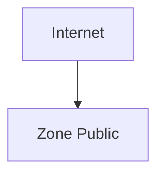

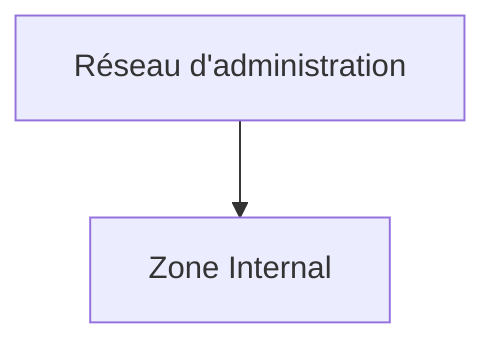

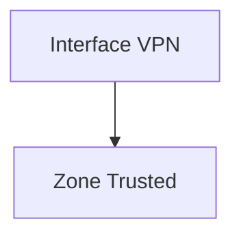

Chaque zone possède ensuite sa propre politique de sécurité.

## Premier aperçu des commandes

Avant d'écrire des règles, il est utile de savoir observer l'état du firewall. Lister les zones disponibles :

```bash
firewall-cmd --get-zones
```

Afficher la zone active :

```bash
firewall-cmd --get-active-zones
```

Afficher la configuration complète :

```bash
firewall-cmd --list-all
```

À ce stade, **ne modifie encore rien**. L'objectif est simplement de comprendre ce que le système fait par défaut. Nous commencerons les modifications dans le chapitre 3.3.

## Du client D-Bus aux points de passage du noyau

`firewall-cmd` n'écrit pas directement dans Netfilter. Il dialogue avec le démon `firewalld` par D-Bus ; le démon valide une configuration de haut niveau puis programme le backend, généralement nftables. `firewall-offline-cmd` constitue une exception utile lorsque le démon n'est pas disponible : il modifie la configuration permanente hors ligne.

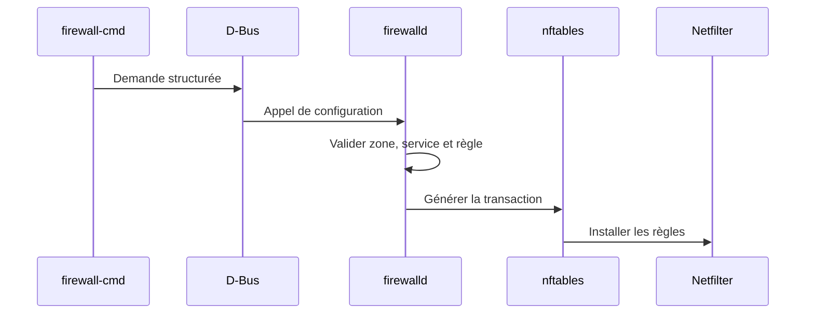

Netfilter voit différents trajets : un paquet destiné à l'hôte, un paquet routé à travers lui et un paquet émis localement ne passent pas exactement par les mêmes points de contrôle. Les termes historiques `INPUT`, `FORWARD` et `OUTPUT` restent donc utiles pour raisonner, même lorsque Firewalld masque les chaînes nftables produites.

Les **policies** Firewalld complètent les zones pour contrôler des flux entre ensembles de zones, par exemple d'un réseau de conteneurs vers l'extérieur. Elles ne remplacent pas les zones d'entrée de l'hôte ; elles expriment un autre sens de circulation. Cette notion sera surtout mobilisée dans la synthèse et les campagnes sur Podman.

Évitez de modifier les tables gérées avec `nft` ou `iptables` pendant que Firewalld orchestre la politique : une règle manuelle peut disparaître au rechargement ou contredire l'état déclaré.

## Préparer le laboratoire

Dans notre laboratoire :

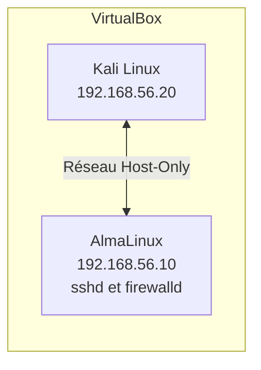

Pour le moment :

- SSH fonctionne.
- Firewalld est actif.
- Aucune règle personnalisée n'a été ajoutée.

C'est volontaire. Nous voulons d'abord observer avant de modifier.

## TP 1 — Identifier les couches Firewalld

Sur AlmaLinux :

```bash
systemctl status firewalld
```

Répondre aux questions suivantes :

- Le service est-il démarré ?
- Est-il activé au démarrage ?
- Quel est son PID ?

## TP 2 — Lire la politique active

Exécuter :

```bash
firewall-cmd --get-zones
```

Puis :

```bash
firewall-cmd --get-active-zones
```

Noter :

- la zone par défaut ;
- les interfaces qui lui sont associées.

Sans rien modifier.

### Extension — Inventorier les services autorisés

Exécuter :

```bash
firewall-cmd --list-all
```

Construire un tableau.

| Élément | Valeur |
|---------|--------|
| Zone active | |
| Interfaces | |
| Services | |
| Ports | |
| Masquerading | |
| Forward | |

Nous compléterons ce tableau au fur et à mesure des chapitres suivants.

## Mission d'ingénieur — Cartographier la pile de filtrage

Produisez un schéma allant de `firewall-cmd` au verdict du noyau. Pour chaque couche, indiquez son rôle, sa commande d'observation et ce qui persiste après un redémarrage. Ajoutez les trajets « client vers Sentinel », « Sentinel vers un service distant » et « trafic routé », sans écrire de règle manuelle nftables.

## Impact sur Sentinel

À ce stade du projet, Sentinel n'est toujours pas exposé sur le réseau. C'est une excellente nouvelle. Pourquoi ? Parce que nous pouvons définir **la politique de sécurité avant même l'arrivée de l'application**. Lorsque Sentinel ouvrira son port HTTPS, nous nous poserons immédiatement les bonnes questions :

- doit-il être accessible depuis Internet ?
- uniquement depuis un réseau d'administration ?
- uniquement via un VPN ?
- doit-il être visible par les autres serveurs ?

Cette démarche illustre parfaitement un principe d'architecture :

> **La sécurité doit être pensée avant le déploiement, pas après.**

## Synthèse

Firewalld n'est pas le moteur de filtrage de Linux. Il constitue une couche d'administration qui simplifie la gestion des règles appliquées par Netfilter via nftables. Son innovation majeure réside dans l'introduction des **zones**, qui permettent de raisonner selon un niveau de confiance plutôt qu'à partir d'une simple liste de ports. Cette approche rend les configurations plus lisibles, plus évolutives et beaucoup plus proches de la manière dont un architecte conçoit une infrastructure.

Le prochain chapitre sera entièrement consacré aux zones. Nous apprendrons à les manipuler, à les associer à des interfaces ou à des réseaux, puis à construire progressivement une politique de filtrage adaptée à notre laboratoire.

## Infographie de révision

```text
╔══════════════════════════════════════════════════════════════════════╗
║                     CHAPITRE 3.2 — FIREWALLD                        ║
╚══════════════════════════════════════════════════════════════════════╝

                      QUI FILTRE VRAIMENT LES PAQUETS ?

               Administrateur
                      │
          firewall-cmd (CLI)
                      │
                      ▼
               ┌───────────────┐
               │   Firewalld   │
               │ Orchestrateur │
               └──────┬────────┘
                      │
         Génère / met à jour les règles
                      │
                      ▼
               ┌───────────────┐
               │   nftables    │
               │ Jeu de règles │
               └──────┬────────┘
                      │
              Interprété par
                      ▼
               ┌───────────────┐
               │  Netfilter    │
               │ (dans le      │
               │    noyau)     │
               └──────┬────────┘
                      │
        ┌─────────────┴─────────────┐
        ▼                           ▼
     ACCEPT                      DROP
        │                           │
        ▼                           ▼
  Socket applicative          Paquet détruit
        │
        ▼
  SSH / Sentinel / HTTP...

━━━━━━━━━━━━━━━━━━━━━━━━━━━━━━━━━━━━━━━━━━━━━━━━━━━━━━━━━━━━━━━━━━

             PHILOSOPHIE DE FIREWALLD

         Deny by Default
                │
                ▼
 Tout est interdit...
                │
                ▼
 ...jusqu'à autorisation explicite.

━━━━━━━━━━━━━━━━━━━━━━━━━━━━━━━━━━━━━━━━━━━━━━━━━━━━━━━━━━━━━━━━━━

             COMMENT PENSE FIREWALLD ?

       Administrateur
              │
              ▼
      "Autoriser SSH"
              │
              ▼
     Service Firewalld
              │
              ▼
    Traduction en règles nftables
              │
              ▼
      Netfilter applique

━━━━━━━━━━━━━━━━━━━━━━━━━━━━━━━━━━━━━━━━━━━━━━━━━━━━━━━━━━━━━━━━━━

             CE QU'APPORTE FIREWALLD

✓ Gestion dynamique
✓ Zones de confiance
✓ Services plutôt que ports
✓ Configuration lisible
✓ Compatible IPv4 / IPv6
✓ Administration simplifiée

━━━━━━━━━━━━━━━━━━━━━━━━━━━━━━━━━━━━━━━━━━━━━━━━━━━━━━━━━━━━━━━━━━

          À RETENIR

• Firewalld ≠ Firewall
• Netfilter filtre réellement
• nftables contient les règles
• Firewalld orchestre
• Les zones représentent un niveau de confiance

━━━━━━━━━━━━━━━━━━━━━━━━━━━━━━━━━━━━━━━━━━━━━━━━━━━━━━━━━━━━━━━━━━

                PROCHAINE ÉTAPE

          CHAPITRE 3.3

          LES ZONES FIREWALLD

      Concevoir une politique de sécurité
      orientée confiance plutôt que ports.
```

## Pour aller plus loin

La documentation de Firewalld décrit son architecture D-Bus, ses backends et ses objets de politique. Le chapitre suivant se concentre sur l'objet le plus visible : la zone de confiance associée à une connexion, une interface ou une source.

← [3.1 — TCP/IP côté administrateur](3.1-tcp-ip-administrateur.md) · [3.3 — Les zones Firewalld](3.3-zones-firewalld.md) →
