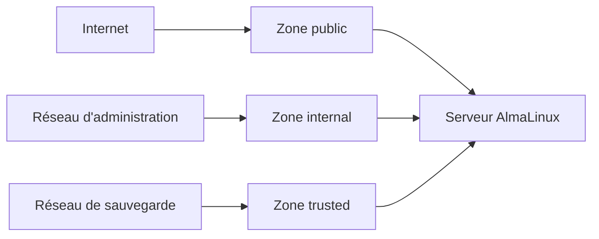

# Chapitre 3.3 — Les zones Firewalld

> **Campagne 3 — Réseau et exposition**

> *« Un firewall n'est pas une liste de règles. C'est une traduction de la confiance que l'on accorde à chaque réseau. »*

---

## Vous êtes ici

```
Campagne 3 — Réseau et exposition

✔ 3.1 TCP/IP
✔ 3.2 Firewalld

► 3.3 Les zones

Prochain chapitre

3.4 Les services
```

Jusqu'à présent, nous avons découvert que Firewalld repose sur trois briques :

- Firewalld ;
- nftables ;
- Netfilter.

Nous savons également qu'il fonctionne selon le principe du **Deny by Default**.

Il manque toutefois une pièce essentielle.

Comment appliquer une politique différente selon l'origine du trafic ?

Autrement dit :

Pourquoi autoriser un paquet provenant du réseau d'administration, mais refuser exactement le même paquet provenant d'Internet ?

La réponse tient dans un mot :

> **Zone.**

---

## Objectifs pédagogiques

À la fin de ce chapitre, tu seras capable de :

- expliquer ce qu'est réellement une zone Firewalld ;
- comprendre pourquoi une zone représente un niveau de confiance plutôt qu'un réseau ;
- associer une interface ou une source à une zone ;
- comprendre la politique par défaut des principales zones ;
- concevoir une architecture réseau basée sur les niveaux de confiance ;
- préparer la politique de filtrage qui protégera Sentinel.

---

## Pourquoi ce chapitre existe

Imaginons un serveur possédant trois interfaces.

```
Internet

↓

enp0s3

----------------------

VPN Administrateur

↓

enp0s8

----------------------

Réseau de sauvegarde

↓

enp0s9
```

Toutes les interfaces reçoivent potentiellement des paquets SSH.

Une question apparaît immédiatement.

Faut-il appliquer exactement les mêmes règles sur les trois interfaces ?

Évidemment non.

Le trafic provenant du VPN d'administration inspire beaucoup plus confiance que celui provenant d'Internet.

Firewalld devait donc introduire une notion qui n'existait pas dans les anciens firewalls :

> **La confiance.**

---

## La philosophie des zones

Une zone est une **politique de sécurité**.

Elle ne décrit pas un réseau.

Elle ne décrit pas un port.

Elle répond simplement à la question :

> **Quel niveau de confiance accordons-nous au trafic qui arrive ici ?**

C'est une différence majeure.

Une même machine peut appartenir à plusieurs réseaux.

Mais chaque réseau n'inspire pas la même confiance.

Firewalld permet donc d'associer une politique différente à chacun.

---

## Premier schéma



Le même serveur.

Trois niveaux de confiance.

Trois politiques différentes.

---

## Pourquoi est-ce une excellente idée ?

Les anciens firewalls demandaient souvent :

```
Interface 1

↓

Règles

↓

Interface 2

↓

Autres règles

↓

Interface 3

↓

Encore des règles
```

Au bout de quelques années.

Personne ne savait plus pourquoi certaines règles existaient.

Les zones introduisent une couche d'abstraction.

L'administrateur ne réfléchit plus :

> "Quelle règle dois-je écrire ?"

Mais :

> "Quel est le niveau de confiance de ce réseau ?"

C'est un changement profond de manière de penser.

---

### 💎 Le point d'expertise

L'un des aspects les plus élégants de Firewalld est que les zones permettent de **séparer l'intention de l'implémentation**.

Un architecte peut dire :

> *« Le réseau VPN est de confiance élevée. »*

Cette phrase n'évoque aucun port, aucune adresse IP et aucune règle technique.

Pourtant, elle peut être directement traduite en configuration Firewalld.

Cette séparation entre le **langage métier** (confiance) et le **langage technique** (règles nftables) est une des raisons pour lesquelles Firewalld est beaucoup plus facile à maintenir que des fichiers `iptables` de plusieurs milliers de lignes.

## Les zones par défaut de Firewalld

Lorsque Firewalld est installé, plusieurs zones sont déjà disponibles.

Tu peux les afficher avec :

```bash
firewall-cmd --get-zones
```

Tu obtiendras généralement quelque chose de proche de :

```text
block dmz drop external home internal public trusted work
```

À première vue, ces noms paraissent évidents.

En réalité, ils sont souvent mal compris.

Leur nom décrit un **cas d'usage**.

Il ne constitue pas une obligation.

Par exemple.

Une entreprise peut parfaitement utiliser la zone **home** dans un environnement professionnel si sa politique correspond à son besoin.

Inversement.

Utiliser la zone **work** parce qu'il s'agit d'un réseau d'entreprise n'est pas forcément le meilleur choix.

Encore une fois.

Les zones représentent :

> **un niveau de confiance.**

---

## Vue d'ensemble

```
                 Niveau de confiance

Faible                                               Fort

DROP ─ BLOCK ─ PUBLIC ─ EXTERNAL ─ DMZ ─ HOME ─ WORK ─ INTERNAL ─ TRUSTED

               ↑

      Internet inconnu

                                               Réseau administrateur
```

Cette représentation est volontairement simplifiée.

Elle constitue un excellent modèle mental.

---

## Zone : drop

```
Nom :

drop
```

Politique :

```
Tout est ignoré.
```

Le paquet est simplement détruit.

Aucune réponse n'est envoyée.

```
Internet

↓

DROP

↓

Silence
```

Pour l'attaquant.

La machine semble parfois ne même pas exister.

---

#### Quand l'utiliser ?

Rarement.

Principalement :

- certains réseaux très hostiles ;
- des listes noires ;
- des mécanismes automatiques.

---

#### Avantage

Très discret.

---

#### Inconvénient

Peut compliquer certains diagnostics réseau.

---

## Zone : block

Elle ressemble beaucoup à **drop**.

Mais avec une différence importante.

Au lieu d'ignorer complètement le paquet.

Linux répond.

Par exemple :

```
ICMP administratively prohibited
```

L'expéditeur comprend immédiatement que le trafic est interdit.

---

#### Différence fondamentale

```
DROP

↓

Aucune réponse
```

```
BLOCK

↓

Réponse négative
```

Cette nuance sera importante lorsque nous utiliserons :

- `ping`
- `nmap`

---

### 💎 Le point d'expertise

Beaucoup d'administrateurs pensent que **DROP est toujours plus sécurisé que BLOCK**.

La réalité est plus nuancée.

Un paquet ignoré entraîne souvent plusieurs retransmissions TCP.

Le client attend.

Puis recommence.

Puis attend encore.

Sur certaines infrastructures, cela peut générer davantage de trafic et compliquer le diagnostic.

À l'inverse.

Une réponse immédiate permet au client d'abandonner rapidement.

Autrement dit.

Le choix entre DROP et BLOCK relève autant de la politique d'exploitation que de la sécurité.

---

## Zone : public

C'est la zone par défaut sur de nombreuses distributions.

Elle part du principe que :

> Le réseau n'est pas digne de confiance.

Elle autorise uniquement les services explicitement déclarés.

C'est généralement celle que nous utiliserons pour une machine exposée.

---

#### Exemple

```
Internet

↓

Zone PUBLIC

↓

SSH

HTTPS

Autorisés

↓

Tout le reste

↓

Refusé
```

---

## Zone : external

Cette zone est prévue principalement pour les interfaces connectées à l'extérieur.

Elle est souvent utilisée avec :

- NAT
- masquerading

Nous reviendrons sur ces notions plus tard.

Dans notre laboratoire.

Nous l'utiliserons peu.

---

## Zone : dmz

Le terme DMZ signifie :

> Demilitarized Zone.

Historiquement.

Une DMZ est un réseau intermédiaire.

Ni totalement interne.

Ni totalement externe.

Elle héberge généralement :

- serveur web ;
- reverse proxy ;
- serveur SMTP ;
- relais DNS.

Une machine placée en DMZ reste potentiellement compromise.

On limite donc soigneusement ses communications avec le réseau interne.

---

## Zone : home

Elle représente un réseau relativement sûr.

Par exemple.

Un réseau domestique.

La confiance est supérieure à celle d'Internet.

Mais pas absolue.

---

## Zone : work

Très proche de **home**.

Elle est destinée à un environnement professionnel.

Dans la pratique.

Les différences sont faibles.

C'est la politique qui importe davantage que le nom.

---

## Zone : internal

Cette zone suppose que le réseau est contrôlé.

Par exemple :

- réseau d'administration ;
- réseau privé de serveurs ;
- infrastructure de supervision.

Cela ne signifie pas :

> Aucun contrôle.

Cela signifie simplement :

> Le niveau de confiance est plus élevé.

---

## Zone : trusted

```
Tout est accepté.
```

Autrement dit.

Le firewall ne filtre pratiquement plus.

C'est une zone extrêmement puissante.

Et donc potentiellement dangereuse.

Elle ne doit être utilisée que lorsque cette confiance est réellement justifiée.

Par exemple.

Une interface de communication interne très spécifique.

---

## Tableau récapitulatif

| Zone | Niveau de confiance | Utilisation typique |
|------|----------------------|---------------------|
| drop | Très faible | Réseaux hostiles |
| block | Très faible | Refus explicite |
| public | Faible | Internet |
| external | Faible | NAT |
| dmz | Moyen | Services exposés |
| home | Moyen + | Réseau domestique |
| work | Moyen + | Réseau professionnel |
| internal | Élevé | Administration |
| trusted | Maximum | Réseau totalement maîtrisé |

---

## Comment pense un architecte ?

L'erreur classique consiste à raisonner :

```
Interface

↓

Règles
```

Un architecte raisonne autrement.

```
Niveau de confiance

↓

Zone

↓

Services

↓

Règles
```

Cette inversion paraît anodine.

Pourtant.

Elle change complètement la manière de concevoir un firewall.

Les règles deviennent la conséquence d'une réflexion.

Elles ne sont plus le point de départ.

---

## Exemple Sentinel

Imaginons notre application.

```
Sentinel

↓

HTTPS

↓

8443
```

Deux architectures.

Première.

```
Internet

↓

PUBLIC

↓

8443
```

Deuxième.

```
VPN

↓

INTERNAL

↓

8443
```

Les deux fonctionnent.

Mais laquelle présente la plus faible surface d'exposition ?

La seconde.

Parce que Sentinel n'est plus directement visible depuis Internet.

Avant même d'écrire une règle de filtrage.

Le simple choix de la zone améliore déjà la sécurité.

## Associer une zone à une interface

Nous savons maintenant ce qu'est une zone.

Une question pratique apparaît immédiatement.

Comment Firewalld sait-il qu'un paquet doit être évalué avec la politique **public** plutôt que **internal** ?

La réponse est simple.

Chaque paquet est associé à une zone selon plusieurs critères.

Le plus courant est :

```
Interface réseau

↓

Zone
```

Par exemple.

```
                AlmaLinux

             enp0s3

                │

                ▼

             PUBLIC

             enp0s8

                │

                ▼

            INTERNAL
```

Lorsque le paquet arrive.

Firewalld identifie d'abord l'interface.

Puis applique immédiatement la politique de la zone correspondante.

---

## Les commandes essentielles

Afficher les zones actives :

```bash
firewall-cmd --get-active-zones
```

Exemple :

```text
public
  interfaces: enp0s3
```

---

Afficher entièrement une zone :

```bash
firewall-cmd --zone=public --list-all
```

---

Déplacer une interface :

```bash
firewall-cmd \
    --zone=internal \
    --change-interface=enp0s8
```

---

Définir la zone par défaut :

```bash
firewall-cmd \
    --set-default-zone=public
```

---

### Attention au mode permanent

L'une des particularités de Firewalld est la coexistence de deux configurations.

```
Configuration active

↓

Mémoire RAM
```

et

```
Configuration permanente

↓

Disque
```

Lorsqu'une règle est créée sans option particulière.

Elle disparaît après un redémarrage.

Pour la conserver :

```bash
firewall-cmd \
    --permanent \
    --add-service=https
```

Puis :

```bash
firewall-cmd --reload
```

---

### 💎 Le point d'expertise

C'est probablement l'une des causes de dysfonctionnement les plus fréquentes.

De nombreux administrateurs pensent :

> "Ma règle n'a pas fonctionné."

En réalité.

Elle a parfaitement fonctionné.

Mais uniquement dans la configuration **runtime**.

Après un redémarrage.

Le serveur revient à la configuration **permanente**.

Comprendre cette distinction est indispensable avant toute mise en production.

---

## 🧠 Comment pense un architecte ?

Un architecte ne cherche pas à créer le plus grand nombre de règles.

Il cherche à créer :

> **le moins de règles possibles.**

Pourquoi ?

Parce qu'une règle :

- doit être maintenue ;
- auditée ;
- comprise ;
- testée.

Plus une politique est simple.

Plus elle est robuste.

L'objectif est donc de faire porter le maximum de logique par :

- les zones ;
- les services ;

et le minimum par des règles spécifiques.

---

## ⚔️ Comment pense un attaquant ?

Un attaquant ne connaît pas les zones.

Il observe uniquement le résultat.

Par exemple.

Deux interfaces.

```
Internet

↓

22 fermé

443 ouvert

↓

PUBLIC
```

Puis.

```
VPN

↓

22 ouvert

↓

INTERNAL
```

Pour lui.

Le comportement est différent.

Il cherchera donc à atteindre l'interface la plus permissive.

C'est pourquoi un réseau d'administration ne doit jamais être directement accessible depuis Internet.

---

## 🏢 En entreprise

Une erreur classique consiste à associer toutes les interfaces à :

```
trusted
```

Parce que :

> "C'est plus simple."

En réalité.

Cela revient pratiquement à désactiver le firewall.

À l'inverse.

Une bonne architecture pourrait être :

```
Internet

↓

PUBLIC

────────────

VPN

↓

INTERNAL

────────────

Sauvegardes

↓

WORK

────────────

Cluster

↓

TRUSTED
```

Chaque interface possède une politique adaptée.

---

## 📚 Culture technique

Firewalld est souvent perçu comme un produit Red Hat.

En réalité.

Il est aujourd'hui utilisé par :

- Fedora
- AlmaLinux
- Rocky Linux
- CentOS Stream
- RHEL
- openSUSE

Il est devenu un standard de fait sur de nombreuses distributions professionnelles.

---

## ⚠️ Piège classique

Modifier une zone.

Tester.

Tout fonctionne.

Redémarrer.

Plus rien ne fonctionne.

Dans 90 % des cas.

Le problème provient simplement d'une règle créée en mode **runtime** mais jamais enregistrée en **permanent**.

---

## Laboratoire AlmaLinux / Kali

Nous allons maintenant commencer à manipuler réellement Firewalld.

Architecture :

```
                     VirtualBox

              ┌─────────────────────┐

              │      Kali           │
              │ 192.168.56.20       │

              └─────────┬───────────┘
                        │
                Host-only Network
                        │
              ┌─────────▼───────────┐

              │     AlmaLinux       │
              │ 192.168.56.10       │

              │ Firewalld           │
              │ SSH                 │

              └─────────────────────┘
```

Objectif.

Observer.

Puis modifier progressivement.

---

## TP guidés

### TP 1

Identifier :

- la zone active ;
- les interfaces ;
- les services autorisés.

Construire un schéma.

---

### TP 2

Créer une nouvelle règle **runtime**.

Observer.

Redémarrer.

Constater sa disparition.

---

### TP 3

Créer ensuite exactement la même règle.

Mais avec :

```bash
--permanent
```

Comparer.

---

### TP 4

Depuis Kali.

Scanner :

```bash
nmap 192.168.56.10
```

Puis.

Modifier uniquement la zone.

Scanner de nouveau.

Comparer.

---

## Impact sur Sentinel

Nous pouvons maintenant imaginer le futur.

```
                 Sentinel

                     │

                TCP 8443

                     │

             Zone INTERNAL

                     │

             Réseau VPN Admin
```

Résultat.

Même si Sentinel possède une vulnérabilité.

Un attaquant situé sur Internet ne pourra même pas tenter de l'exploiter.

Nous venons donc de réduire la surface d'attaque **avant même d'avoir écrit la première ligne de code de Sentinel**.

C'est exactement ce que signifie :

> **Security by Design.**

---

## Synthèse

Les zones constituent l'apport majeur de Firewalld.

Elles permettent de raisonner selon un niveau de confiance plutôt qu'en fonction de simples numéros de ports.

Cette approche rapproche le firewall du raisonnement d'un architecte réseau : on décrit l'intention (Internet, administration, sauvegarde...) avant de définir les règles techniques qui en découlent.

Comprendre cette philosophie est essentiel pour construire une politique de filtrage lisible, maintenable et évolutive.

Dans le prochain chapitre, nous approfondirons les **services Firewalld**, afin de comprendre pourquoi il est préférable d'autoriser un service plutôt qu'un port lorsque cela est possible.

---

## Infographie de révision

```text
╔════════════════════════════════════════════════════════════════════════════╗
║                     CHAPITRE 3.3 — LES ZONES FIREWALLD                    ║
╚════════════════════════════════════════════════════════════════════════════╝

                   UNE ZONE = UN NIVEAU DE CONFIANCE

                      Internet
                          │
                    Zone PUBLIC
                          │
                SSH / HTTPS uniquement
                          │
────────────────────────────────────────────────────────────────────────────

                    VPN Administrateur
                          │
                   Zone INTERNAL
                          │
              SSH + Sentinel + Supervision
                          │
────────────────────────────────────────────────────────────────────────────

                  Réseau de Cluster
                          │
                   Zone TRUSTED
                          │
                Communications internes

════════════════════════════════════════════════════════════════════════════

              COMMENT FIREWALLD PREND UNE DÉCISION ?

          Paquet entrant
                │
                ▼
      Interface de réception
                │
                ▼
     Zone associée à l'interface
                │
                ▼
     Services autorisés dans la zone
                │
         ┌──────┴──────┐
         ▼             ▼
      ACCEPT        REJECT/DROP
         │
         ▼
     Application

════════════════════════════════════════════════════════════════════════════

        DU POINT DE VUE DE L'ARCHITECTE

    Niveau de confiance
            │
            ▼
          Zone
            │
            ▼
         Services
            │
            ▼
      Règles techniques

════════════════════════════════════════════════════════════════════════════

        LES COMMANDES À RETENIR

firewall-cmd --get-active-zones

firewall-cmd --zone=public --list-all

firewall-cmd --change-interface=enp0s8

firewall-cmd --set-default-zone=public

firewall-cmd --reload

════════════════════════════════════════════════════════════════════════════

             LES 5 IDÉES CLÉS

✓ Une zone représente une confiance, pas un réseau.
✓ Une interface est rattachée à une zone.
✓ Les règles découlent des zones.
✓ Runtime ≠ Permanent.
✓ La sécurité commence par limiter les flux.

════════════════════════════════════════════════════════════════════════════

                      PROCHAINE ÉTAPE

                 CHAPITRE 3.4

             LES SERVICES FIREWALLD

      Comprendre pourquoi Firewalld préfère
      raisonner en services plutôt qu'en ports.
```

---

← [3.2 — Architecture de Firewalld](3.2-architecture-firewalld.md) · [3.4 — Les services Firewalld](3.4-services-firewalld.md) →
