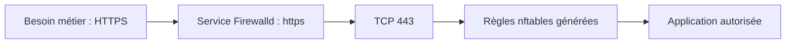
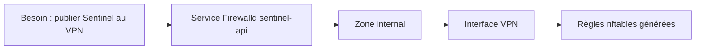

# Chapitre 3.4 — Les services Firewalld

> **Campagne 3 — Réseau et exposition**

> *« Un administrateur ouvre un port. Un architecte autorise un service. »*

## Vous êtes ici

```
Campagne 3 — Réseau et exposition

✔ 3.1 TCP/IP
✔ 3.2 Firewalld
✔ 3.3 Les zones

► 3.4 Les services Firewalld

Prochain chapitre

3.5 Les ports et protocoles
```

Jusqu'à présent, nous avons appris à raisonner selon un niveau de confiance grâce aux zones. Nous savons désormais **où** une règle s'applique. Une nouvelle question apparaît naturellement :

> *Que doit-on réellement autoriser ?*

La réponse la plus évidente serait :

> « Le port utilisé par l'application. »

Et pourtant… Ce n'est pas ce que recommande Firewalld.

## Objectifs pédagogiques

À la fin de ce chapitre, vous serez capable de :

- comprendre ce qu'est un service Firewalld ;
- expliquer pourquoi un service est préférable à un port lorsqu'il existe ;
- explorer la base de services de Firewalld ;
- créer un service personnalisé pour Sentinel ;
- comprendre l'intérêt de cette abstraction dans une grande infrastructure.

## Pourquoi ce chapitre existe

Prenons un exemple très courant. Un administrateur souhaite rendre SSH accessible. Il exécute :

```bash
firewall-cmd --add-port=22/tcp
```

Le résultat est correct. SSH fonctionne. Mais cette règle raconte-t-elle réellement **l'intention** de l'administrateur ? Non. Elle indique uniquement :

> *« Le port 22 est autorisé. »*

Elle ne dit pas :

- quel logiciel l'utilise ;
- pourquoi il est ouvert ;
- si un changement futur est prévu ;
- si ce port correspond réellement à SSH.

À l'inverse, la commande :

```bash
firewall-cmd --add-service=ssh
```

exprime directement l'intention :

> **« Je souhaite autoriser le service SSH. »**

Cette nuance paraît minime. Elle change pourtant profondément la manière d'administrer un firewall.

## Les services : une abstraction

Un service Firewalld est une description logique d'un service réseau. Autrement dit :



L'administrateur ne manipule plus directement les ports. Il manipule des **objets métiers**.

### Exemple

Imaginons un serveur web. Deux approches sont possibles.

#### Approche 1

```
Autoriser TCP 80

Autoriser TCP 443
```

#### Approche 2

```
Autoriser HTTP

Autoriser HTTPS
```

Les deux produisent sensiblement le même résultat. La seconde est cependant beaucoup plus lisible. Elle permet à un autre administrateur de comprendre immédiatement l'intention de la règle.

## Où sont stockés les services ?

Contrairement à ce que l'on pourrait penser, Firewalld ne possède pas une base de données. Chaque service est simplement décrit dans un fichier XML. Par défaut :

```
/usr/lib/firewalld/services/
```

Quelques exemples :

```
ssh.xml
http.xml
https.xml
smtp.xml
dns.xml
cockpit.xml
```

Ces fichiers sont volontairement lisibles. Ils décrivent notamment :

- les ports ;
- les protocoles ;
- une courte description.

Vous pouvez les consulter avec :

```bash
cat /usr/lib/firewalld/services/ssh.xml
```

Vous découvrirez un contenu proche de :

```xml
<service>
    <short>SSH</short>
    <description>Secure Shell</description>
    <port protocol="tcp" port="22"/>
</service>
```

Il n'y a rien de magique. Lorsque vous autorisez le service `ssh`, Firewalld lit simplement cette définition et génère les règles correspondantes.

## Sentinel : pourquoi créer un service Firewalld dédié ?

Nous arrivons maintenant à une situation que vous rencontrerez souvent en entreprise : vous développez une nouvelle application. Dans notre cas :

```
Sentinel
```

Elle expose une API HTTPS sur :

```
TCP 8443
```

Le réflexe de beaucoup d'administrateurs est immédiat :

```bash
firewall-cmd \
    --permanent \
    --add-port=8443/tcp
```

Le problème ? Six mois plus tard, lorsqu'un autre administrateur auditera le serveur, il verra simplement :

```
8443/tcp
```

Et il se demandera :

> Pourquoi ce port est-il ouvert ?

Personne ne le saura. Nous venons de perdre l'intention.

## Une règle doit raconter une histoire

J'aimerais introduire ici une idée qui reviendra souvent dans le manuel. Une bonne configuration doit être **auto-documentée**. Lorsqu'un administrateur exécute :

```bash
firewall-cmd --list-services
```

Il devrait obtenir quelque chose comme :

```
ssh
https
sentinel-api
```

Immédiatement, il comprend :

- SSH est utilisé.
- HTTPS est utilisé.
- Sentinel expose une API.

Aucun besoin d'aller rechercher la signification du port 8443.

## Créer un service Firewalld personnalisé

Les services fournis par le système sont stockés dans : `/usr/lib/firewalld/services/` Mais il est déconseillé de les modifier. Pourquoi ? Parce qu'ils seront remplacés lors d'une mise à jour. Les services personnalisés doivent être créés dans : `/etc/firewalld/services/` Notre premier objectif sera donc de créer :

```
sentinel-api.xml
```

### Exemple

```xml
<?xml version="1.0" encoding="utf-8"?>

<service>

  <short>Sentinel API</short>

  <description>
    API HTTPS du service Sentinel.
  </description>

  <port protocol="tcp" port="8443"/>

</service>
```

Une fois le fichier enregistré :

```bash
firewall-cmd --reload
```

Puis :

```bash
firewall-cmd --get-services
```

Vous devriez voir apparaître :

```
sentinel-api
```

Nous pouvons maintenant l'autoriser comme n'importe quel autre service :

```bash
firewall-cmd \
    --permanent \
    --add-service=sentinel-api
```

### Pourquoi cette approche est meilleure ?

Comparons.

#### Première approche

```
8443/tcp
```

Que représente ce port ? Impossible de le savoir.

#### Deuxième approche

```
sentinel-api
```

Cette fois. La règle raconte immédiatement son intention. Nous pouvons même imaginer :

```
sentinel-agent

sentinel-ui

sentinel-metrics
```

Chaque service représente une fonction métier.



Cette manière de raisonner permet de conserver une séparation claire entre :

- le besoin métier ;
- la mise en œuvre technique.

## En entreprise

Imaginons une infrastructure comportant :

- 250 serveurs ;
- 60 applications ;
- plusieurs équipes.

Si toutes les règles utilisent uniquement des ports :

```
22
80
443
8443
9443
2055
18080
...
```

Les audits deviennent extrêmement difficiles. En revanche, si les services sont nommés :

```
ssh
https
sentinel-api
grafana
vault
freeipa
postgresql
```

L'intention apparaît immédiatement. Les revues de sécurité gagnent énormément en efficacité.

## Culture technique

Les fichiers XML de Firewalld peuvent contenir bien plus que des ports. Selon les cas, ils peuvent définir :

- plusieurs protocoles ;
- des modules d'assistance (helpers) ;
- des ports multiples.

Ils constituent une véritable couche d'abstraction entre le métier et les règles du firewall. C'est l'une des raisons pour lesquelles Firewalld reste très utilisé dans les environnements Red Hat.

## Piège classique

Créer un service personnalisé… …puis continuer malgré tout à ouvrir directement le port. Par exemple :

```bash
--add-service=sentinel-api

--add-port=8443/tcp
```

La seconde règle devient alors redondante. Une politique de sécurité simple est toujours préférable à une accumulation de règles équivalentes.

## TP 1 — Lire un service fourni

Comparez `ssh`, `https` et un service plus complexe sans modifier `/usr/lib/firewalld` :

```bash
firewall-cmd --get-services
firewall-cmd --info-service=ssh
firewall-cmd --info-service=https
```

Relevez ports, protocoles, destinations et éventuels helpers. Vérifiez ensuite dans quelle zone le service est réellement autorisé. L'existence d'une définition ne signifie pas qu'elle est active.

## TP 2 — Créer et tester `sentinel-api`

Dans le laboratoire, créez le service permanent par l'interface Firewalld, puis rechargez et autorisez-le uniquement dans la zone choisie :

```bash
sudo firewall-cmd --permanent --new-service=sentinel-api
sudo firewall-cmd --permanent --service=sentinel-api --set-description="API HTTPS Sentinel"
sudo firewall-cmd --permanent --service=sentinel-api --add-port=8443/tcp
sudo firewall-cmd --reload
firewall-cmd --info-service=sentinel-api
```

Testez depuis une source autorisée et une source non autorisée. Vérifiez aussi que Sentinel écoute réellement : ouvrir le service Firewalld ne démarre aucune application.

## Mission d'ingénieur — Publication sécurisée de Sentinel

### Contexte

Vous venez de rejoindre l'équipe Infrastructure d'une PME. Une nouvelle application interne, **Sentinel**, vient d'être développée. Elle expose une API HTTPS écoutant sur :

```
TCP 8443
```

Le responsable sécurité vous transmet les exigences suivantes :

- L'API ne doit **jamais** être accessible directement depuis Internet.
- Seuls les administrateurs connectés au VPN doivent pouvoir y accéder.
- La configuration Firewalld doit rester lisible et facilement auditable.
- Aucune règle ne doit faire directement référence au port 8443 si cela peut être évité.

Vous êtes chargé de préparer le serveur avant la mise en production.

### Analyse

Avant d'écrire la moindre commande, réponds aux questions suivantes.

#### Question 1

Quelle zone Firewalld semble la plus adaptée ? Expliquez votre choix.

#### Question 2

Faut-il ouvrir un port ou créer un service ? Justifie.

#### Question 3

Quels risques apparaîtraient si Sentinel était placé dans la zone `public` ?

#### Question 4

Quels éléments devront être documentés afin qu'un autre administrateur comprenne immédiatement la configuration ?

### Mise en œuvre

Créer un service personnalisé.

```
sentinel-api
```

Le placer dans :

```
/etc/firewalld/services/
```

Puis :

- recharger Firewalld ;
- vérifier que le service apparaît ;
- autoriser ce service dans la bonne zone ;
- supprimer toute règle redondante basée directement sur le port.

### Vérification

Depuis Kali. Réaliser deux scénarios.

### Scénario A

Connexion depuis le réseau d'administration. Le résultat attendu est :

```
Connexion HTTPS possible.
```

### Scénario B

Connexion simulée depuis un réseau non autorisé. Le résultat attendu est :

```
Connexion refusée.
```

### Questions de réflexion

Imaginons que Sentinel évolue. Deux nouveaux composants apparaissent.

```
Sentinel UI

HTTPS 9443

-------------------

Sentinel Metrics

TCP 9100
```

Comment feriez-vous évoluer la configuration ? Choisiriez-vous :

- trois ports ouverts ;

ou

- trois services Firewalld ?

Pourquoi ?

### Critères de réussite

À la fin de cette mission : ✓ aucune règle ne fait directement référence au port 8443 ; ✓ Sentinel apparaît comme un service identifié ; ✓ la politique de sécurité est lisible ; ✓ la configuration est facilement maintenable ; ✓ la surface d'exposition est limitée au strict nécessaire.

## Impact sur Sentinel

Le service `sentinel-api` devient un contrat stable entre le paquet RPM, Firewalld, la documentation et l'automatisation. Un changement de port pourra faire évoluer la définition du service sans réécrire toutes les zones et Rich Rules qui utilisent son nom. Ce contrat ne remplace ni l'écoute de l'application, ni TLS, ni l'authentification.

## Synthèse

Le chapitre **Les services Firewalld** établit une brique du socle de sécurité Sentinel. Avant de poursuivre, vérifiez que vous savez :

- expliquer le rôle des mécanismes présentés ;
- distinguer leur configuration de leur état réellement observé ;
- valider leur comportement dans le laboratoire ;
- conserver une configuration explicite, vérifiable et reproductible.

## Infographie de révision

```text
BESOIN MÉTIER ──► SERVICE NOMMÉ ──► PORTS / PROTOCOLES
                         │
                         ▼
                  ZONE AUTORISÉE
                         │
                         ▼
               RÈGLES NFTABLES GÉNÉRÉES

/usr/lib/firewalld : définitions fournies
/etc/firewalld     : personnalisations locales
```

## Pour aller plus loin

Un service exprime une fonction réutilisable ; une Rich Rule ajoute un contexte comme une source, une journalisation ou une limitation. Le prochain chapitre explique pourquoi les réponses d'une connexion restent possibles sans ouvrir explicitement tous les ports éphémères.

← [3.3 — Les zones Firewalld](3.3-zones-firewalld.md) · [3.5 — Conntrack et le filtrage par états](3.5-conntrack-filtrage-etats.md) →
