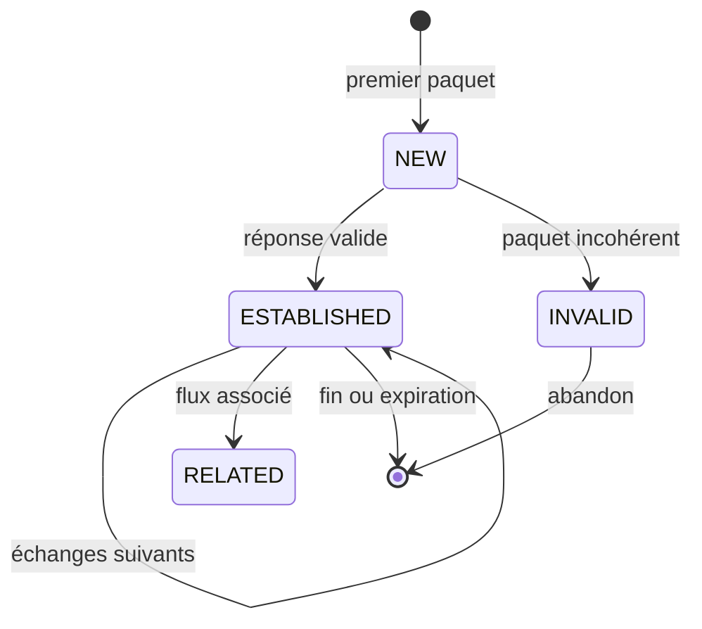

# Chapitre 3.5 — Conntrack et le filtrage par états

> **Campagne 3 — Réseau et exposition**

> *« Le meilleur pare-feu n'est pas celui qui bloque le plus de paquets. C'est celui qui comprend les conversations. »*

---

## Vous êtes ici

```
Partie I ─ Construire un socle sécurisé
        │
        ├── Campagne 1 ─ Installation
        ├── Campagne 2 ─ Comptes et privilèges
        │
        └── Campagne 3 ─ Sécurisation réseau
                 │
                 ├── 3.1 TCP/IP côté administrateur
                 ├── 3.2 Firewalld
                 ├── 3.3 Les zones
                 ├── 3.4 Les services
                 │
                 ├──► 3.5 Conntrack et le filtrage par états
                 ├── 3.6 Rich Rules
                 ├── 3.7 Journalisation
                 ├── 3.8 IP Sets
                 ├── 3.9 Runtime vs Permanent
                 └── 3.10 Architecture complète Firewalld
```

---

## Objectifs pédagogiques

À la fin de ce chapitre vous serez capable de :

- expliquer précisément le fonctionnement de Netfilter Conntrack ;
- comprendre pourquoi un pare-feu moderne est dit **stateful** ;
- distinguer les états NEW, ESTABLISHED, RELATED, INVALID et UNTRACKED ;
- analyser une table Conntrack ;
- comprendre comment Firewalld exploite automatiquement ces mécanismes ;
- diagnostiquer des comportements réseau apparemment "magiques" ;
- anticiper les limites du suivi de connexion dans un contexte de production.

---

## Pourquoi ce chapitre existe

La plupart des administrateurs savent qu'un flux TCP "fonctionne".

Ils savent qu'il existe une règle autorisant SSH.

Ils savent qu'un client peut se connecter.

En revanche, très peu savent **pourquoi les paquets de réponse reviennent sans qu'une règle explicite ne les autorise.**

Cette incompréhension conduit à des erreurs fréquentes :

- ouverture inutile de ports ;
- règles redondantes ;
- mauvaises politiques DROP ;
- diagnostics erronés lors d'incidents.

Comprendre **Conntrack** est probablement l'une des compétences qui différencie un administrateur système d'un véritable ingénieur sécurité.

Car ce n'est pas Firewalld qui décide réellement du sort des paquets.

Firewalld produit une configuration.

Netfilter applique cette configuration.

Et Netfilter s'appuie sur un composant extrêmement sophistiqué :

**Connection Tracking**, plus connu sous le nom de **Conntrack**.

---

## Théorie détaillée

### Le problème fondamental d'un pare-feu

Imaginons un serveur Sentinel.

Il écoute sur le port TCP 8443.

Un client ouvre une connexion.

```
Client
192.168.1.25:54821
        │
        │ SYN
        ▼
Sentinel
192.168.1.10:8443
```

Une règle Firewalld autorise :

```
tcp/8443
```

Le premier paquet est donc accepté.

Très bien.

Mais une question apparaît immédiatement.

Comment le serveur peut-il répondre ?

```
Serveur
8443
 │
 │ SYN/ACK
 ▼

Client
54821
```

Le paquet de retour est destiné au port **54821**.

Or ce port :

- n'est pas ouvert ;
- n'est pas déclaré dans Firewalld ;
- change à chaque connexion.

Pourquoi le paquet est-il accepté ?

Sans Conntrack...

il ne devrait pas l'être.

---

### Les ports éphémères

Lorsqu'un client établit une connexion TCP, il choisit automatiquement un port source.

Par exemple :

```
Client

Source :
54821

Destination :
8443
```

Le serveur répond ensuite vers ce même port.

```
Destination :
54821
```

Le port 54821 n'a jamais été déclaré dans le pare-feu.

Et pourtant...

la communication fonctionne.

La raison est simple.

Le pare-feu mémorise la connexion.

---

## Le suivi de connexion

Netfilter possède une immense table mémoire.

Chaque nouvelle connexion crée une entrée.

Exemple extrêmement simplifié :

```
+------------------------------------------------------------+
| Source               Destination             Etat          |
+------------------------------------------------------------+
|192.168.1.25:54821 -> 192.168.1.10:8443       ESTABLISHED   |
+------------------------------------------------------------+
```

À partir de cet instant :

tout paquet appartenant à cette conversation est immédiatement reconnu.

Le pare-feu ne réévalue plus entièrement les règles.

Il regarde d'abord :

> "Est-ce que ce paquet appartient à une conversation déjà connue ?"

Si oui,

il est traité beaucoup plus rapidement.

---

### Un pare-feu stateful

On distingue deux familles.

#### Stateless

Chaque paquet est indépendant.

Le pare-feu ignore totalement :

- les échanges précédents ;
- le contexte ;
- l'historique.

Chaque paquet est jugé seul.

```
Packet A

↓

Analyse complète

↓

Décision
```

Puis

```
Packet B

↓

Analyse complète

↓

Décision
```

Encore et encore.

---

Cela présente plusieurs inconvénients.

Par exemple :

```
SYN

ACK

FIN

RST
```

Tous sont vus comme des paquets totalement indépendants.

Le pare-feu ne comprend jamais qu'ils appartiennent à la même connexion.

---

#### Stateful

Avec Conntrack :

```
Premier paquet

↓

Création d'un état

↓

Enregistrement

↓

Tous les paquets suivants
↓

Reconnaissance immédiate
```

Le pare-feu comprend désormais :

- qui a initié la connexion ;
- quelles adresses participent ;
- quels ports sont utilisés ;
- où en est la conversation.

Il devient capable de raisonner.

---

## Les états Conntrack

Le noyau Linux attribue un état à chaque paquet.

Les plus importants sont :

```
NEW

ESTABLISHED

RELATED

INVALID
```

Un cinquième existe dans certains contextes :

```
UNTRACKED
```

Voyons chacun d'eux.

---

## NEW

Le tout premier paquet d'une nouvelle connexion.

Exemple :

```
Client

SYN

------------>

Serveur
```

Le noyau voit :

```
NEW
```

C'est à ce moment que Firewalld décide si la connexion est autorisée.

Si la réponse est NON :

la connexion n'existera jamais.

---

Exemple SSH.

```
22/TCP autorisé

↓

Premier SYN

↓

Etat NEW

↓

Accepté

↓

Entrée Conntrack créée
```

---

## ESTABLISHED

Une fois le handshake TCP terminé :

```
SYN

SYN ACK

ACK
```

La connexion devient :

```
ESTABLISHED
```

Tous les paquets suivants portent cet état.

C'est pourquoi la règle implicite :

```
ESTABLISHED,RELATED ACCEPT
```

est probablement la règle la plus importante de tout Linux.

Sans elle...

la majorité des communications cesseraient immédiatement.

---

### Pourquoi cette règle est quasiment universelle

Sur presque toutes les distributions Linux, on retrouve une règle équivalente :

```
ct state established,related accept
```

ou historiquement :

```
-m state --state ESTABLISHED,RELATED
```

Cette règle permet au serveur de répondre librement aux connexions qu'il a déjà acceptées.

Elle réduit énormément le nombre de règles nécessaires.

Au lieu d'autoriser explicitement chaque port de retour, le pare-feu applique une logique beaucoup plus simple :

> « Si cette réponse appartient à une conversation déjà validée, elle est autorisée. »

Cette approche est plus sûre, plus performante et beaucoup plus simple à maintenir.

---

## RELATED

RELATED est souvent le plus mal compris.

Il ne signifie pas :

> "le même flux"

Il signifie :

> "un nouveau flux qui dépend directement d'un flux existant."

La nuance est fondamentale.

Prenons un exemple historique : FTP en mode actif.

Le client ouvre d'abord une connexion de contrôle.

```
Client
      41200
         │
         ▼
Serveur FTP
        21
```

Cette connexion est **ESTABLISHED**.

Puis, au cours du dialogue, le serveur demande l'ouverture d'une nouvelle connexion de données.

Cette seconde connexion est différente :

- nouveau port ;
- nouvelle socket ;
- nouveau flux.

Pourtant, le noyau sait qu'elle découle directement de la première grâce à un module d'analyse du protocole (un *helper* Conntrack).

Son état est donc :

```
RELATED
```

Sans cette notion, de nombreux protocoles historiques auraient nécessité des dizaines de règles spécifiques dans le pare-feu.

Aujourd'hui, FTP est moins courant, mais le mécanisme RELATED reste utilisé dans plusieurs cas particuliers, notamment certains protocoles réseau complexes et les messages ICMP associés à une connexion existante.

### RELATED et ICMP : un cas concret

Beaucoup d'administrateurs découvrent RELATED avec FTP, puis oublient rapidement son existence en pensant que ce mécanisme ne concerne que des protocoles anciens.

Pourtant, il intervient encore quotidiennement.

Prenons un cas très simple.

Une connexion HTTPS est déjà établie.

```
Client
      │
      │ HTTPS
      ▼
Serveur
```

Pendant cette communication, un routeur intermédiaire détecte que le paquet est trop volumineux pour le prochain lien réseau.

Il génère alors un message ICMP :

```
Destination Unreachable
Fragmentation Needed
```

Ce paquet ICMP ne constitue pas une nouvelle communication indépendante.

Il est directement lié à la connexion TCP existante.

Le noyau le classe donc :

```
RELATED
```

Le pare-feu peut alors autoriser ce paquet sans ouvrir largement ICMP.

Cette subtilité est essentielle.

Sans RELATED, certains mécanismes indispensables au bon fonctionnement du réseau cesseraient de fonctionner.

---

### INVALID

INVALID désigne un paquet qui ne peut être associé à aucune connexion valide.

Cela peut provenir de nombreuses situations.

Exemple :

```
Paquet reçu

↓

Pas d'entrée Conntrack

↓

Impossible de reconstruire l'état TCP

↓

INVALID
```

Quelques causes classiques :

- paquet corrompu ;
- checksum erronée ;
- paquet reçu hors séquence ;
- connexion expirée ;
- attaque réseau ;
- désynchronisation NAT ;
- saturation de la table Conntrack.

Exemple.

Le serveur reçoit directement un ACK.

```
ACK

↓

Aucun SYN connu

↓

INVALID
```

Pour Conntrack, cette situation est impossible.

Un ACK ne peut apparaître que dans une connexion déjà connue.

Le paquet est donc classé INVALID.

---

### Pourquoi rejeter INVALID ?

Dans la plupart des politiques de sécurité, on retrouve très tôt :

```
INVALID → DROP
```

Pourquoi ?

Parce qu'un paquet INVALID est rarement légitime.

Au contraire, il est souvent le symptôme :

- d'une erreur réseau ;
- d'un logiciel défaillant ;
- d'une tentative d'évasion du pare-feu ;
- d'un scan sophistiqué.

Il est donc généralement plus sûr de le supprimer immédiatement.

---

### INVALID ne signifie pas forcément "attaque"

Attention néanmoins à une erreur de diagnostic fréquente.

Des paquets INVALID apparaissent parfois dans des environnements parfaitement sains.

Par exemple :

- lors d'une forte congestion réseau ;
- après un redémarrage du pare-feu ;
- lorsqu'une entrée Conntrack a expiré mais que le client continue d'envoyer des paquets ;
- lors d'une modification d'une règle NAT en production ;
- sur certains réseaux asymétriques.

L'apparition ponctuelle de quelques INVALID n'est donc pas inquiétante.

En revanche, une augmentation brutale mérite toujours une investigation.

---

## UNTRACKED

UNTRACKED signifie que Conntrack ne suit volontairement pas cette communication.

Ce cas est relativement rare.

Il est principalement rencontré lorsque l'administrateur choisit explicitement de désactiver le suivi.

Pourquoi faire cela ?

Parce que Conntrack consomme :

- de la mémoire ;
- du CPU ;
- des structures internes du noyau.

Sur des équipements traitant plusieurs millions de paquets par seconde, chaque optimisation compte.

Certains flux peuvent donc être exclus volontairement du suivi.

Par exemple :

```
Raw Table

↓

NOTRACK

↓

UNTRACKED
```

Cette optimisation est réservée à des architectures très spécifiques.

Dans une infrastructure d'entreprise classique, il est exceptionnel d'avoir à manipuler cet état.

---

## La machine à états TCP

Pour comprendre Conntrack, il faut également comprendre que TCP lui-même est une machine à états.

Une connexion n'est jamais simplement :

```
ouverte
```

ou

```
fermée
```

Elle traverse une succession d'étapes.

```
CLOSED

↓

SYN_SENT

↓

SYN_RECEIVED

↓

ESTABLISHED

↓

FIN_WAIT

↓

TIME_WAIT

↓

CLOSED
```

Conntrack s'appuie sur cette logique.

Il vérifie que les transitions observées sont cohérentes.

Par exemple :

```
ACK

↓

Sans SYN préalable

↓

Transition impossible

↓

INVALID
```

Cette vérification participe à la robustesse globale du filtrage.

---

## Que contient réellement une entrée Conntrack ?

Contrairement à une idée reçue, Conntrack ne mémorise pas uniquement :

- une adresse IP ;
- un port.

Une entrée contient beaucoup plus d'informations.

Schématiquement :

```
Connexion TCP

Adresse source

Adresse destination

Port source

Port destination

Protocole

Etat TCP

Timeout

Direction

Informations NAT

Marques (marks)

Zones

Compteurs

Options diverses
```

Une représentation simplifiée pourrait ressembler à ceci :

```
TCP

192.168.10.25:53124

↓

192.168.10.100:8443

Etat :
ESTABLISHED

Timeout :
431 s

NAT :
aucun

Zone :
public
```

En réalité, la structure interne du noyau est beaucoup plus riche.

Elle permet notamment de suivre simultanément les deux sens de circulation d'un même échange.

---

## Les timeouts

Toutes les connexions finissent par disparaître.

Conntrack ne conserve pas les entrées indéfiniment.

Chaque protocole possède ses propres temporisations.

Par exemple :

```
TCP ESTABLISHED

↓

plusieurs jours possibles
```

Alors qu'un paquet UDP inactif peut disparaître beaucoup plus rapidement.

Lorsque le délai expire :

```
Entrée supprimée

↓

Mémoire libérée
```

Cette politique permet au noyau de limiter la consommation mémoire.

---

## Pourquoi un timeout est-il indispensable ?

Imaginons un serveur exposé sur Internet.

Chaque seconde :

```
1000 nouvelles connexions
```

Au bout d'une journée :

```
86 millions de connexions
```

Si aucune entrée n'était supprimée :

```
Mémoire

↓

Saturation

↓

Crash
```

Le nettoyage automatique est donc indispensable.

---

## La taille de la table Conntrack

Le noyau réserve une capacité maximale.

On la retrouve notamment via :

```bash
sysctl net.netfilter.nf_conntrack_max
```

Exemple :

```text
262144
```

Cela signifie que le noyau peut suivre simultanément environ 262 000 connexions.

Cette valeur dépend :

- de la mémoire disponible ;
- de la configuration du système ;
- des paramètres noyau.

Sur un serveur web important, cette limite peut être augmentée.

---

## Lorsque la table est pleine

Voici une situation extrêmement intéressante.

Imaginons :

```
Table Conntrack

262144 / 262144
```

Puis un nouveau client tente d'ouvrir une connexion.

```
SYN

↓

Impossible de créer une entrée

↓

Connexion refusée
```

Le serveur est pourtant :

- allumé ;
- joignable ;
- Firewalld fonctionne.

Mais aucune nouvelle connexion n'est possible.

Ce type d'incident existe réellement.

Il est souvent confondu avec :

- une panne réseau ;
- une surcharge CPU ;
- un problème applicatif.

Alors que la cause est simplement :

```
Conntrack plein
```

---

## Les attaques par saturation de Conntrack

Un attaquant n'a pas nécessairement besoin de faire tomber un serveur.

Il peut viser une ressource plus discrète.

Par exemple :

```
Table Conntrack
```

En ouvrant un très grand nombre de connexions incomplètes ou très longues, il cherche à remplir progressivement cette table.

Lorsque celle-ci atteint sa limite :

```
Nouvelle connexion

↓

Impossible

↓

Déni de service
```

Cette attaque est particulièrement efficace contre :

- des passerelles NAT ;
- des reverse proxies ;
- des pare-feu ;
- des VPN concentrateurs ;
- des équilibreurs de charge.

Le serveur applicatif n'est parfois jamais directement attaqué.

C'est l'infrastructure de sécurité qui est épuisée.

---

## Observer Conntrack

Sous AlmaLinux, plusieurs outils permettent d'observer ce mécanisme.

Le plus connu est :

```bash
conntrack
```

Après installation du paquet correspondant :

```bash
dnf install conntrack-tools
```

On peut afficher les connexions suivies :

```bash
conntrack -L
```

Exemple simplifié :

```text
tcp      6 431 ESTABLISHED src=192.168.10.15 dst=192.168.10.20 sport=53124 dport=8443
```

Chaque ligne représente une entrée de la table Conntrack.

Lorsqu'un administrateur comprend réellement cette sortie, il possède un niveau de diagnostic très supérieur à la moyenne.

---

## Observer les statistiques

Conntrack fournit également des statistiques utiles.

Par exemple :

```bash
conntrack -S
```

On y retrouve notamment :

- le nombre d'entrées créées ;
- les suppressions ;
- les collisions de hachage ;
- les échecs d'allocation ;
- les insertions refusées ;
- les erreurs internes.

Ces informations sont précieuses lors d'un incident de production.

Elles permettent de distinguer rapidement :

- une saturation ;
- un problème de configuration ;
- un comportement anormal du trafic.

---

## Firewalld utilise Conntrack sans que vous l'écriviez

Un point surprend souvent les administrateurs qui découvrent `nftables` après avoir utilisé Firewalld pendant des années.

Ils ne trouvent aucune règle explicite ressemblant à :

```
ESTABLISHED ACCEPT
```

Pourtant, tout fonctionne.

La raison est simple.

Firewalld génère automatiquement un ensemble cohérent de règles `nftables` qui exploitent Conntrack.

Lorsque vous exécutez simplement :

```bash
firewall-cmd --add-service=https
```

vous n'autorisez pas uniquement :

```
TCP/443
```

Vous autorisez implicitement tout le dialogue réseau nécessaire :

- création de la connexion ;
- suivi de l'état ;
- réponses ;
- fermeture propre de la session.

C'est précisément ce qui rend Firewalld beaucoup plus simple à administrer qu'une écriture manuelle complète de règles Netfilter.

---

## 💎 Le point d'expertise

### Pourquoi Conntrack est l'un des composants les plus critiques du noyau Linux

Lorsqu'un administrateur pense au pare-feu, il imagine souvent les règles.

Pourtant, dans une architecture Linux moderne, les règles ne représentent qu'une partie du travail.

La véritable intelligence réside dans la capacité du noyau à conserver une représentation cohérente des conversations réseau.

Conntrack est utilisé bien au-delà du simple filtrage.

Il constitue une brique fondamentale de nombreuses fonctionnalités :

- Firewalld ;
- nftables ;
- iptables (mode stateful) ;
- le NAT ;
- la translation d'adresses des conteneurs Podman ;
- les réseaux Kubernetes ;
- les routeurs Linux ;
- les VPN ;
- les passerelles Internet ;
- les reverse proxies.

Autrement dit, lorsqu'un serveur Linux réalise une traduction d'adresse (NAT), il ne se contente pas de modifier un paquet.

Il doit également mémoriser cette traduction.

Prenons un exemple simplifié.

```
Machine interne

10.0.0.25:52144

↓

Passerelle Linux

↓

Internet

203.0.113.42:62015
```

Le noyau enregistre une correspondance.

```
10.0.0.25:52144

⇄

203.0.113.42:62015
```

Lorsque la réponse revient depuis Internet :

```
203.0.113.42:62015

↓

Passerelle Linux

↓

10.0.0.25:52144
```

Conntrack retrouve immédiatement la traduction.

Sans lui, le NAT moderne serait pratiquement impossible.

C'est pourquoi une attaque visant Conntrack peut indirectement perturber :

- l'accès Internet ;
- les conteneurs ;
- les tunnels VPN ;
- les communications inter-VM ;
- les services exposés.

Le composant est discret.

Mais il est absolument central.

---

### Conntrack n'est pas spécifique à TCP

Le mot "connexion" induit souvent en erreur.

TCP possède effectivement une notion de connexion.

UDP, lui, n'en possède aucune.

Pourtant, Conntrack suit également UDP.

Comment est-ce possible ?

Le noyau reconstruit artificiellement une conversation.

Par exemple :

```
Client

UDP 53000

↓

Serveur DNS

53
```

Le noyau considère que les paquets échangés pendant une certaine durée appartiennent au même flux logique.

Ce suivi permet notamment :

- le NAT UDP ;
- le retour des réponses DNS ;
- les communications NTP ;
- certains protocoles multimédias.

Autrement dit :

Conntrack suit des **flux**, pas uniquement des connexions TCP.

Cette nuance est essentielle.

---

## 🧠 Comment pense un architecte ?

Lorsqu'un architecte conçoit une infrastructure, il ne réfléchit jamais uniquement en termes de ports ouverts.

Il raisonne en termes de **flux autorisés**.

Prenons Sentinel.

Le serveur expose :

- HTTPS ;
- SSH d'administration ;
- FreeIPA ;
- Ansible.

Une réflexion débutante consiste à établir une liste de ports.

```
22

443

8443

389

636
```

Un architecte expérimenté procède autrement.

Il se demande :

1. Qui initie la communication ?
2. Qui répond ?
3. Quel équipement garde la mémoire des échanges ?
4. Quel est le comportement attendu si une connexion est interrompue ?
5. Que se passe-t-il après un redémarrage du pare-feu ?
6. Quels flux sont temporaires ?
7. Les flux passent-ils par un NAT ?
8. Existe-t-il des communications asymétriques ?
9. Les conteneurs utilisent-ils leur propre espace réseau ?
10. Combien de connexions simultanées peut supporter l'infrastructure ?

Ce raisonnement conduit naturellement à surveiller :

- la capacité Conntrack ;
- les temps d'expiration ;
- le nombre de connexions actives ;
- les statistiques du noyau.

Autrement dit, le pare-feu devient un composant de supervision.

Plus seulement un composant de sécurité.

---

### Concevoir Sentinel avec Conntrack en tête

Imaginons plusieurs centaines de capteurs Sentinel répartis sur un réseau industriel.

Chaque agent ouvre périodiquement une connexion TLS vers le serveur central.

```
Agent 1

↓

Serveur

Agent 2

↓

Serveur

Agent 3

↓

Serveur
```

Un architecte se pose immédiatement plusieurs questions.

Les connexions restent-elles ouvertes ?

Ou sont-elles recréées toutes les minutes ?

Le choix est loin d'être anodin.

#### Cas n°1 : connexion persistante

```
1000 agents

↓

1000 connexions
```

Peu d'entrées sont créées.

Le coût CPU est faible.

Mais la table Conntrack reste occupée durablement.

#### Cas n°2 : reconnexion permanente

```
1000 agents

↓

Connexion

↓

Déconnexion

↓

Connexion

↓

Déconnexion
```

La table reste plus petite.

En revanche, le nombre de créations et destructions explose.

Le noyau travaille davantage.

Le bon compromis dépend :

- du matériel ;
- du volume d'agents ;
- de la latence réseau ;
- des mécanismes TLS ;
- des exigences de disponibilité.

Ce sont précisément ces arbitrages qui distinguent une architecture robuste d'une architecture simplement fonctionnelle.

---

## ⚔️ Comment pense un attaquant ?

Un attaquant ne voit pas votre serveur.

Il voit des ressources.

Parmi elles :

- la mémoire ;
- le CPU ;
- le stockage ;
- la bande passante ;
- la table Conntrack.

Une erreur fréquente consiste à penser :

> « Si tous mes ports sont fermés, je suis protégé. »

Ce n'est pas toujours vrai.

Certaines attaques cherchent simplement à consommer les ressources internes du pare-feu.

---

### Exemple : saturation lente

Un attaquant ouvre progressivement plusieurs dizaines de milliers de connexions.

```
Connexion 1

Connexion 2

Connexion 3

...

Connexion 50000
```

Chaque connexion reste ouverte.

Le trafic est faible.

Il n'y a presque aucun paquet.

Pourtant :

```
Chaque connexion

↓

Une entrée Conntrack
```

Au bout d'un certain temps :

```
Table pleine
```

Puis :

```
Utilisateur légitime

↓

Nouvelle connexion

↓

Refus
```

L'application Sentinel continue pourtant de fonctionner.

Le système Linux est toujours en ligne.

La mémoire n'est pas saturée.

Le CPU est calme.

Pour l'utilisateur, le serveur semble simplement "ne plus accepter de connexions".

Sans connaissance de Conntrack, ce type d'incident est particulièrement difficile à diagnostiquer.

---

### Exploiter les délais d'expiration

Chaque état possède un timeout.

Un attaquant peut chercher à maintenir artificiellement ces délais.

Par exemple :

```
Petit paquet

↓

Toutes les 30 secondes
```

Chaque paquet repousse l'expiration.

L'entrée reste présente.

Avec suffisamment de connexions, la consommation devient importante.

Les équipements de sécurité professionnels disposent souvent de protections spécifiques contre ce type d'attaque :

- limitation du nombre de connexions ;
- quotas par adresse IP ;
- expiration plus agressive ;
- détection comportementale.

Sur Linux, ces protections peuvent être construites avec plusieurs briques complémentaires :

- Firewalld ;
- nftables ;
- IP Sets ;
- Fail2ban ;
- SELinux (indirectement, en limitant l'impact d'un service compromis) ;
- supervision.

Aucune de ces technologies n'est suffisante seule.

C'est l'accumulation des mécanismes qui constitue la défense en profondeur.

---

## 🏢 En entreprise

Un incident réel ressemble rarement à un exercice de laboratoire.

Voici une situation typique.

Une entreprise déploie une nouvelle version de Sentinel.

Cette version conserve désormais les connexions TLS ouvertes beaucoup plus longtemps afin d'éviter les renégociations cryptographiques.

Les tests unitaires sont excellents.

Les performances applicatives progressent.

Quelques jours plus tard, la supervision signale :

- refus de nouvelles connexions ;
- pics d'erreurs TLS ;
- saturation intermittente des passerelles.

L'équipe applicative soupçonne immédiatement un problème de certificat.

L'équipe réseau pense à une panne de switch.

L'équipe système redémarre plusieurs services.

Aucun effet.

Après plusieurs heures d'analyse, un ingénieur examine les statistiques Conntrack.

Il constate :

```
Utilisation :

99,8 %
```

La nouvelle version de Sentinel n'était pas plus lente.

Elle gardait simplement beaucoup plus de connexions ouvertes simultanément.

Le noyau fonctionnait exactement comme prévu.

L'architecture, elle, n'avait pas été dimensionnée pour ce nouveau comportement.

Cette situation illustre une réalité importante.

Les performances applicatives et les performances de l'infrastructure ne sont pas toujours alignées.

Une optimisation locale peut produire une dégradation globale.

L'architecte doit constamment raisonner à l'échelle de l'ensemble du système.

---

## 📚 Culture technique

### Une histoire de performances… devenue une histoire de sécurité

Les premiers pare-feu IP étaient essentiellement **stateless**.

Chaque paquet était traité indépendamment.

Cette approche fonctionnait correctement tant que les réseaux étaient relativement simples :

- peu de connexions simultanées ;
- peu de NAT ;
- peu de protocoles complexes ;
- peu de services exposés.

Avec la généralisation d'Internet, plusieurs phénomènes sont apparus simultanément :

- explosion du nombre de connexions TCP ;
- démocratisation du NAT ;
- multiplication des protocoles applicatifs ;
- augmentation des débits réseau.

Les performances des pare-feu stateless ont commencé à devenir insuffisantes.

L'idée de mémoriser les conversations n'est donc pas née d'un objectif de sécurité.

Elle est née d'un objectif de **performance**.

En mémorisant une connexion déjà validée, le noyau évite de retraiter chaque paquet comme s'il s'agissait d'un nouveau flux.

Très rapidement, cette mémoire des connexions a offert d'autres possibilités :

- filtrage beaucoup plus fin ;
- traduction d'adresses (NAT) fiable ;
- inspection de certains protocoles ;
- limitation des attaques ;
- journalisation plus pertinente.

Aujourd'hui, il est difficile d'imaginer un système Linux moderne sans Conntrack.

Il est utilisé dans pratiquement tous les environnements :

- serveurs physiques ;
- machines virtuelles ;
- routeurs ;
- hyperviseurs ;
- conteneurs Podman ;
- clusters Kubernetes ;
- appliances de sécurité.

---

### Firewalld, nftables et Conntrack

Une idée reçue consiste à croire que Firewalld « fait » le suivi de connexion.

Ce n'est pas le cas.

Chaque composant possède son rôle.



Cette séparation est importante.

Si demain Firewalld disparaissait, Conntrack continuerait d'exister.

Inversement, sans Conntrack, Firewalld perdrait une grande partie de son intérêt.

Comprendre cette architecture permet de mieux diagnostiquer les incidents.

Un problème observé avec Firewalld n'est pas nécessairement causé par Firewalld.

Il peut provenir :

- du noyau ;
- de Netfilter ;
- de nftables ;
- d'une saturation Conntrack ;
- d'une interaction avec le NAT.

L'ingénieur sécurité cherche toujours **à quel niveau de la pile** se situe réellement le problème.

---

## ⚠️ Piège classique

### « J'ai ouvert le port, donc ça doit fonctionner. »

C'est probablement l'une des phrases les plus entendues lors d'un incident.

Pourtant, ouvrir un port ne garantit absolument pas qu'une communication fonctionnera.

Prenons un exemple.

```
TCP 8443 autorisé
```

L'administrateur vérifie :

```
firewall-cmd --list-services
```

Le service apparaît.

Pour lui :

> « Le pare-feu n'est pas en cause. »

Pourtant, plusieurs éléments peuvent empêcher la communication :

- saturation de Conntrack ;
- saturation des sockets ;
- SELinux ;
- application non démarrée ;
- certificat TLS invalide ;
- mauvaise zone Firewalld ;
- règle nftables personnalisée ;
- politique de routage ;
- MTU incorrecte.

L'ouverture d'un port n'est qu'une condition parmi beaucoup d'autres.

---

### Autre erreur fréquente : ignorer les connexions déjà établies

Lorsqu'un administrateur modifie une règle Firewalld, il est souvent surpris.

Il supprime une autorisation.

Pourtant…

les utilisateurs déjà connectés continuent à travailler.

Pourquoi ?

Parce que leur connexion est déjà présente dans Conntrack.

Elle est :

```
ESTABLISHED
```

Le pare-feu continue donc à accepter les paquets appartenant à cette conversation.

Les nouvelles connexions, elles, seront refusées.

Ce comportement est parfaitement normal.

Il explique pourquoi certains changements semblent « ne pas fonctionner immédiatement ».

L'ingénieur sécurité ne l'oublie jamais lorsqu'il planifie une opération de maintenance.

---

## Laboratoire AlmaLinux / Kali

### Objectif

Observer concrètement le fonctionnement de Conntrack et comprendre comment Firewalld exploite automatiquement le suivi de connexion.

---

### Architecture

```
                   Réseau laboratoire

        +-------------------------------+

             Kali Linux
        192.168.10.20

                │

                │

        192.168.10.10
             AlmaLinux

        - Firewalld
        - Sentinel
        - OpenSSH

        +-------------------------------+
```

---

### Étape 1 — Vérifier les règles Firewalld

Sur AlmaLinux :

```bash
firewall-cmd --list-all
```

Identifier :

- la zone active ;
- les services autorisés ;
- les ports ouverts.

Ne modifiez encore aucune règle.

---

### Étape 2 — Installer les outils Conntrack

```bash
sudo dnf install conntrack-tools
```

Vérifier ensuite :

```bash
conntrack -L
```

La table doit être quasiment vide.

---

### Étape 3 — Observer une connexion SSH

Depuis Kali :

```bash
ssh utilisateur@192.168.10.10
```

Laisser la session ouverte.

Sur AlmaLinux :

```bash
conntrack -L
```

Identifier l'entrée correspondant à la connexion SSH.

Observer notamment :

- les adresses IP ;
- les ports ;
- l'état ;
- le protocole.

---

### Étape 4 — Observer l'évolution de la table

Ouvrir une seconde session SSH.

Puis une troisième.

Comparer :

```bash
conntrack -L
```

Chaque nouvelle session crée une nouvelle entrée.

Demandez-vous :

Pourquoi une seconde fenêtre SSH ne réutilise-t-elle pas la première connexion ?

---

### Étape 5 — Observer la disparition d'une entrée

Fermer une session SSH.

Attendre quelques secondes.

Observer :

```bash
conntrack -L
```

Comparer le délai entre la fermeture de la session et la disparition effective de l'entrée.

Ce délai dépend de l'état TCP et des temporisations du noyau.

---

### Étape 6 — Expérimenter avec Sentinel

Lancer Sentinel.

Depuis Kali :

effectuer plusieurs connexions successives.

Observer :

- le nombre d'entrées ;
- les ports sources ;
- les états.

Comparer ensuite deux scénarios :

- Sentinel ferme immédiatement chaque connexion ;
- Sentinel conserve les connexions ouvertes plusieurs minutes.

Analyser les différences observées dans Conntrack.

---

## Mission d'ingénieur

### Contexte

Votre entreprise déploie Sentinel dans plusieurs usines.

Chaque site possède :

- un serveur AlmaLinux ;
- environ 2 000 agents Sentinel ;
- une authentification FreeIPA ;
- un accès d'administration SSH ;
- une supervision centralisée.

Après quelques semaines, plusieurs sites remontent un comportement étrange.

À certaines heures :

- plus aucun nouvel agent ne parvient à se connecter ;
- les agents déjà connectés continuent pourtant d'échanger leurs données ;
- SSH reste fonctionnel ;
- le serveur répond au ping ;
- aucune alerte CPU ou mémoire n'est remontée.

Le redémarrage du serveur résout temporairement le problème.

Quelques heures plus tard, il réapparaît.

---

### Votre mission

Vous êtes chargé de produire un diagnostic technique argumenté.

Vous devez notamment :

- identifier les hypothèses plausibles ;
- déterminer quelles commandes utiliser pour confirmer ou infirmer chacune d'elles ;
- expliquer pourquoi les connexions existantes continuent de fonctionner alors que les nouvelles échouent ;
- proposer une stratégie de supervision permettant de détecter le problème avant qu'il n'impacte la production.

**Contraintes :**

- aucun redémarrage n'est autorisé pendant l'investigation ;
- aucune interruption de service n'est acceptable ;
- la solution devra être industrialisable par Ansible sur l'ensemble du parc.

> **Remarque :** il n'existe pas une unique réponse. Une bonne réponse est une réponse argumentée, reproductible et compatible avec les contraintes d'exploitation.

---

## Impact sur Sentinel

Jusqu'à présent, Sentinel était simplement une application réseau.

À partir de ce chapitre, il devient un **acteur** de l'infrastructure.

Ses choix de conception influencent directement :

- la consommation de la table Conntrack ;
- la charge du noyau ;
- les performances TLS ;
- la capacité maximale du serveur.

Dans les chapitres suivants, plusieurs décisions architecturales seront motivées par cette réalité.

Par exemple :

- durée de vie des connexions TLS ;
- politique de reconnexion des agents ;
- limitation des tentatives simultanées ;
- journalisation des erreurs réseau ;
- supervision des connexions actives ;
- tableaux de bord Grafana.

Sentinel ne sera donc plus seulement sécurisé **par** l'infrastructure.

Il participera activement à la sécurité **de** l'infrastructure.

---

## Synthèse

- Conntrack transforme un pare-feu statique en pare-feu **stateful**.
- Firewalld s'appuie sur Conntrack sans que l'administrateur ait à gérer directement les états.
- Les états `NEW`, `ESTABLISHED`, `RELATED`, `INVALID` et `UNTRACKED` ont chacun un rôle précis.
- Une connexion autorisée continue généralement à fonctionner même après une modification des règles du pare-feu.
- La saturation de la table Conntrack peut provoquer un déni de service sans que le CPU ou la mémoire ne soient saturés.
- Le NAT, Podman, de nombreux VPN et de multiples services réseau dépendent directement de Conntrack.
- Superviser Conntrack est une bonne pratique d'exploitation, pas uniquement de sécurité.
- Un architecte raisonne en **flux**, pas uniquement en **ports**.

---

## Infographie de révision

```text
┌──────────────────────────────────────────────────────────────────────────────┐
│                 CHAPITRE 3.5 — CONNTRACK ET LE FILTRAGE PAR ÉTATS            │
├──────────────────────────────────────────────────────────────────────────────┤
│                                                                              │
│                 Un pare-feu moderne comprend les conversations               │
│                                                                              │
├──────────────────────────────────────────────────────────────────────────────┤
│                                                                              │
│          Premier paquet                Connexion mémorisée                  │
│                                                                              │
│             NEW ───────────────► ESTABLISHED                                │
│                  │                         │                                 │
│                  │                         │                                 │
│                  ▼                         ▼                                 │
│            Autorisation            Réponse immédiate                         │
│                                                                              │
├──────────────────────────────────────────────────────────────────────────────┤
│                                                                              │
│ États principaux                                                             │
│                                                                              │
│ NEW         Nouvelle connexion                                               │
│ ESTABLISHED Conversation valide                                              │
│ RELATED     Flux dépendant d'un flux existant                                │
│ INVALID     Incohérence réseau ou paquet suspect                             │
│ UNTRACKED   Flux volontairement non suivi                                    │
│                                                                              │
├──────────────────────────────────────────────────────────────────────────────┤
│                                                                              │
│ Dépendances                                                                  │
│                                                                              │
│ Firewalld ─┐                                                                 │
│ nftables ──┼────► Conntrack ◄──── NAT                                        │
│ Podman ────┤            ▲                                                    │
│ VPN ───────┤            │                                                    │
│ FreeIPA ───┤      Réponses réseau                                            │
│ Sentinel ──┘                                                           TLS   │
│                                                                              │
├──────────────────────────────────────────────────────────────────────────────┤
│                                                                              │
│ Risques                                                                      │
│                                                                              │
│ • Saturation de la table                                                     │
│ • Timeout mal dimensionné                                                    │
│ • Attaques par accumulation de connexions                                    │
│ • Mauvais diagnostic d'incident                                               │
│                                                                              │
├──────────────────────────────────────────────────────────────────────────────┤
│                                                                              │
│ Réflexe d'ingénieur                                                          │
│                                                                              │
│ "Je ne regarde pas seulement les ports ouverts.                              │
│  Je vérifie également l'état des conversations."                             │
│                                                                              │
└──────────────────────────────────────────────────────────────────────────────┘
```

---

## Pour aller plus loin

Dans ce chapitre, nous avons appris **comment** Firewalld décide d'autoriser un paquet grâce au suivi de connexion.

Cependant, les règles vues jusqu'à présent restent relativement générales : autoriser un service, un port ou une zone.

Dans un environnement professionnel, cela est rarement suffisant.

Vous devrez souvent exprimer des politiques beaucoup plus fines :

- autoriser uniquement un sous-réseau particulier ;
- bloquer une adresse IP spécifique ;
- limiter un accès à certaines heures ou à certaines interfaces ;
- combiner plusieurs critères dans une même règle.

C'est précisément le rôle des **Rich Rules**, que nous allons explorer dans le chapitre **3.6**.

---

← [3.4 — Les services Firewalld](3.4-services-firewalld.md) · [3.6 — Les Rich Rules Firewalld](3.6-rich-rules-firewalld.md) →
